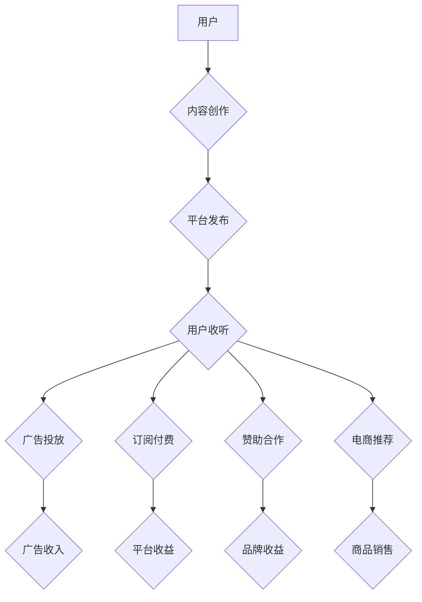

                 

## 播客创业：音频内容的商业化探索

> 关键词：播客、音频内容、商业化、订阅、广告、数据分析、人工智能

### 1. 背景介绍

近年来，音频内容消费呈现爆发式增长，播客作为一种新型音频内容形式，迅速崛起，成为人们获取信息、娱乐消遣和学习新知的重要途径。 

* **数字音频时代的来临:**  智能手机、耳机普及以及移动互联网的发展，为音频内容的消费提供了便利条件。人们在通勤、运动、居家等场景下，更倾向于选择音频内容进行信息获取和娱乐。
* **播客内容的多元化:** 播客内容涵盖广泛领域，从新闻、教育、科技、文化到娱乐、生活，满足了不同用户群体的需求。
* **社区互动和个性化推荐:** 播客平台通过评论、点赞、分享等功能，构建了用户社区，并利用算法推荐个性化内容，增强用户粘性。

随着播客行业的快速发展，越来越多的创业者看到了其中的商机，纷纷涌入这个领域。然而，如何将播客内容商业化，实现可持续发展，成为摆在创业者面前的难题。

### 2. 核心概念与联系

播客商业化的核心在于将音频内容与用户、广告主、平台等多方利益主体有效连接，构建一个可持续的商业生态系统。

**2.1 播客商业化模式**

* **订阅模式:** 用户通过付费订阅获得独家内容、无广告体验、优先下载等权益。
* **广告模式:**  播客节目中插入广告，通过广告收入实现盈利。
* **赞助模式:**  企业或个人赞助播客节目，获得品牌曝光和用户触达。
* **电商模式:**  播客节目推荐商品，通过链接带货实现盈利。

**2.2 播客商业化流程**



### 3. 核心算法原理 & 具体操作步骤

**3.1 算法原理概述**

播客商业化涉及到多个算法，例如推荐算法、广告匹配算法、用户画像算法等。这些算法的核心目的是通过数据分析，精准匹配用户需求和广告主目标，实现商业价值最大化。

**3.2 算法步骤详解**

* **用户画像算法:**  通过用户收听历史、评论点赞、设备信息等数据，构建用户画像，包括用户兴趣、偏好、行为特征等。
* **内容推荐算法:**  根据用户画像，推荐与用户兴趣相关的播客节目，提高用户粘性和参与度。
* **广告匹配算法:**  根据广告主的目标受众和播客内容主题，匹配合适的广告，提高广告转化率。

**3.3 算法优缺点**

* **优点:**  精准匹配用户需求，提高商业转化率，个性化推荐提升用户体验。
* **缺点:**  算法需要大量数据支持，数据隐私安全需要关注，算法偏差可能导致推荐结果不准确。

**3.4 算法应用领域**

* **内容推荐:**  推荐播客节目、相关音频资源、播客主播等。
* **广告投放:**  精准匹配广告主目标受众，提高广告效果。
* **用户运营:**  分析用户行为，制定个性化运营策略。

### 4. 数学模型和公式 & 详细讲解 & 举例说明

**4.1 数学模型构建**

用户兴趣模型可以采用基于协同过滤的推荐算法，构建用户兴趣矩阵，其中每个用户对应一个向量，向量元素代表用户对不同主题的兴趣程度。

**4.2 公式推导过程**

协同过滤算法的核心是计算用户之间相似度，并根据相似用户对内容的评分，预测目标用户对内容的评分。

* **余弦相似度:**  计算两个用户兴趣向量的夹角余弦值，表示用户兴趣的相似程度。

$$
\text{相似度} = \frac{\mathbf{u} \cdot \mathbf{v}}{\|\mathbf{u}\| \|\mathbf{v}\|}
$$

其中，$\mathbf{u}$ 和 $\mathbf{v}$ 分别表示两个用户的兴趣向量，$\cdot$ 表示点积，$\|\mathbf{u}\|$ 和 $\|\mathbf{v}\|$ 分别表示两个向量的模长。

* **预测评分:**  根据相似用户对内容的评分，预测目标用户对内容的评分。

$$
\hat{r}_{u,i} = \frac{\sum_{v \in N(u)} \frac{sim(u,v)}{\|N(u)\|} r_{v,i}}{\sum_{v \in N(u)} \frac{sim(u,v)}{\|N(u)\|} }
$$

其中，$\hat{r}_{u,i}$ 表示目标用户 $u$ 对内容 $i$ 的预测评分，$r_{v,i}$ 表示相似用户 $v$ 对内容 $i$ 的评分，$N(u)$ 表示目标用户 $u$ 的相似用户集合，$sim(u,v)$ 表示用户 $u$ 和 $v$ 的相似度。

**4.3 案例分析与讲解**

假设有一个播客平台，用户 A 和用户 B 都喜欢科技类播客，用户 A 对人工智能播客评分为 5 分，用户 B 对人工智能播客评分为 4 分。根据余弦相似度计算，用户 A 和用户 B 的相似度为 0.8。

如果用户 C 对科技类播客没有评分记录，平台可以根据用户 A 和用户 B 的评分，预测用户 C 对人工智能播客的评分。

### 5. 项目实践：代码实例和详细解释说明

**5.1 开发环境搭建**

* **操作系统:**  Linux/macOS/Windows
* **编程语言:**  Python
* **框架:**  Flask/Django
* **数据库:**  MySQL/PostgreSQL

**5.2 源代码详细实现**

```python
# Flask 框架示例
from flask import Flask, render_template

app = Flask(__name__)

@app.route('/')
def index():
    return render_template('index.html')

if __name__ == '__main__':
    app.run(debug=True)
```

**5.3 代码解读与分析**

*  `Flask` 框架用于构建 Web 应用。
*  `render_template` 函数用于渲染 HTML 模板。
*  `index.html` 是应用程序的主页面模板。

**5.4 运行结果展示**

运行代码后，访问 `http://127.0.0.1:5000/`，即可看到应用程序的主页面。

### 6. 实际应用场景

**6.1 播客平台商业化**

* **订阅模式:**  用户可以订阅喜欢的播客节目，获得无广告体验、独家内容等权益。
* **广告模式:**  播客平台可以向广告主出售广告位，在播客节目中插入广告。
* **赞助模式:**  企业或个人可以赞助播客节目，获得品牌曝光和用户触达。

**6.2 内容创作者收入来源**

* **广告分成:**  播客创作者可以与播客平台分享广告收入。
* **会员订阅:**  创作者可以建立自己的会员体系，向付费用户提供独家内容和福利。
* **赞助合作:**  创作者可以与品牌合作，在节目中进行产品推广。

**6.3 数据分析与用户运营**

* **用户行为分析:**  平台可以分析用户收听习惯、偏好等数据，为用户提供个性化推荐。
* **内容质量评估:**  平台可以根据用户反馈、收听量等数据，评估播客内容质量，并对创作者进行激励。
* **市场趋势分析:**  平台可以分析播客内容趋势，为创作者提供创作方向建议。

**6.4 未来应用展望**

* **人工智能驱动的个性化推荐:**  利用人工智能算法，更精准地匹配用户需求和播客内容。
* **沉浸式音频体验:**  结合虚拟现实、增强现实等技术，打造更沉浸式的音频体验。
* **跨平台音频内容生态:**  打破平台壁垒，构建更开放的音频内容生态系统。

### 7. 工具和资源推荐

**7.1 学习资源推荐**

* **书籍:**  《播客创业指南》、《音频内容营销》、《数字音频技术》
* **在线课程:**  Coursera、Udemy、edX 等平台提供音频内容制作、营销等相关课程。
* **博客和论坛:**  关注播客行业相关的博客和论坛，了解最新资讯和技术趋势。

**7.2 开发工具推荐**

* **音频编辑软件:**  Audacity、Adobe Audition、GarageBand 等。
* **播客托管平台:**  Anchor、Buzzsprout、Libsyn 等。
* **数据分析工具:**  Google Analytics、Mixpanel 等。

**7.3 相关论文推荐**

* **音频内容推荐算法研究:**  [论文链接]
* **播客商业化模式分析:**  [论文链接]
* **人工智能在音频内容领域的应用:**  [论文链接]

### 8. 总结：未来发展趋势与挑战

**8.1 研究成果总结**

播客商业化是一个不断发展和完善的领域，通过算法、数据分析、技术创新等手段，可以实现用户、创作者、平台的多方利益共赢。

**8.2 未来发展趋势**

* **个性化推荐:**  利用人工智能算法，提供更精准的个性化推荐，提升用户体验。
* **沉浸式音频体验:**  结合虚拟现实、增强现实等技术，打造更沉浸式的音频体验。
* **跨平台音频内容生态:**  打破平台壁垒，构建更开放的音频内容生态系统。

**8.3 面临的挑战**

* **内容质量控制:**  保证播客内容的质量和原创性，避免低俗、虚假信息等问题。
* **用户隐私保护:**  妥善处理用户数据，保障用户隐私安全。
* **商业模式创新:**  探索新的商业模式，实现可持续发展。

**8.4 研究展望**

未来，播客商业化将更加注重用户体验、内容质量和技术创新，并与其他新兴技术融合，创造更丰富的音频内容生态。

### 9. 附录：常见问题与解答

* **如何选择合适的播客平台?**  需要考虑平台的受众群体、功能特性、收费模式等因素。
* **如何制作高质量的播客节目?**  需要准备充分的素材、清晰的录音设备、专业的后期制作等。
* **如何推广播客节目?**  可以通过社交媒体、网站、邮件营销等方式进行推广。


作者：禅与计算机程序设计艺术 / Zen and the Art of Computer Programming 
<end_of_turn>

