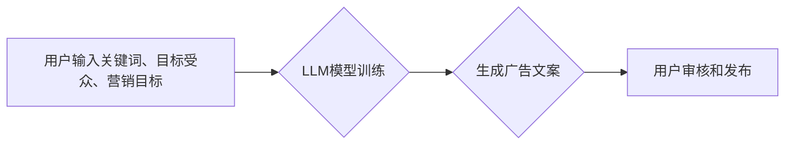

                 

## 智能广告文案生成：LLM在营销创意中的角色

> 关键词：LLM, 广告文案生成, 自然语言处理, 营销创意, 深度学习, Transformer

## 1. 背景介绍

在当今数据爆炸的时代，广告营销正经历着前所未有的变革。传统广告模式面临着越来越大的挑战，消费者对个性化、精准化的广告体验需求日益增长。而大型语言模型（LLM）的出现，为广告文案生成领域带来了新的机遇。

LLM 是一种基于深度学习的强大人工智能模型，能够理解和生成人类语言。其强大的文本生成能力和对语言结构的深刻理解，使其成为广告文案生成领域的理想选择。通过训练大量的广告文案数据，LLM 可以学习到广告文案的写作风格、结构和技巧，并根据特定的目标受众和营销需求，自动生成高质量、吸引人的广告文案。

## 2. 核心概念与联系

### 2.1  LLM

大型语言模型（LLM）是一种基于深度学习的统计模型，能够理解和生成人类语言。其核心是 Transformer 架构，通过自注意力机制学习语言的上下文关系，从而实现更精准的文本理解和生成。

### 2.2  广告文案生成

广告文案生成是指利用人工智能技术自动生成广告文案，包括广告标题、广告描述、广告 slogan 等。

### 2.3  LLM在广告文案生成中的应用

LLM 可以通过以下方式应用于广告文案生成：

* **文本生成:** 根据给定的关键词、目标受众和营销目标，LLM 可以自动生成吸引人的广告文案。
* **文案优化:** LLM 可以分析现有广告文案，并提供改进建议，例如修改措辞、调整结构、增强吸引力等。
* **多语言文案生成:** LLM 可以支持多种语言的广告文案生成，帮助企业拓展海外市场。

**Mermaid 流程图**



## 3. 核心算法原理 & 具体操作步骤

### 3.1  算法原理概述

LLM 在广告文案生成中的核心算法原理是基于 Transformer 架构的文本生成模型。该模型通过学习大量的广告文案数据，掌握了广告文案的写作风格、结构和技巧。

在训练过程中，模型会学习到每个单词在句子中的上下文关系，并根据这些关系预测下一个单词。通过不断迭代训练，模型能够生成越来越符合人类语言习惯和广告文案风格的文本。

### 3.2  算法步骤详解

1. **数据预处理:** 收集大量的广告文案数据，并进行清洗、分词、标记等预处理操作。
2. **模型训练:** 使用 Transformer 架构的文本生成模型，训练模型以生成广告文案。
3. **模型评估:** 使用测试数据评估模型的生成效果，并根据评估结果进行模型调优。
4. **文案生成:** 根据用户输入的关键词、目标受众和营销目标，利用训练好的模型生成广告文案。

### 3.3  算法优缺点

**优点:**

* **自动生成:** 可以自动生成大量广告文案，节省人力成本。
* **个性化:** 可以根据目标受众和营销需求生成个性化的广告文案。
* **效率高:** 生成速度快，可以快速完成文案创作任务。

**缺点:**

* **缺乏创意:** 生成的文案可能缺乏创意和独特之处。
* **数据依赖:** 模型的生成效果依赖于训练数据的质量。
* **伦理问题:** 需要关注模型生成的文案是否符合伦理规范。

### 3.4  算法应用领域

LLM 在广告文案生成领域的应用场景广泛，包括：

* **搜索引擎广告:** 自动生成搜索广告标题和描述。
* **社交媒体广告:** 自动生成社交媒体平台广告文案。
* **电子邮件营销:** 自动生成个性化电子邮件广告文案。
* **内容营销:** 自动生成博客文章、网站内容等广告文案。

## 4. 数学模型和公式 & 详细讲解 & 举例说明

### 4.1  数学模型构建

LLM 的核心数学模型是 Transformer 架构，其主要包含以下组件：

* **编码器:** 用于将输入文本序列编码成固定长度的向量表示。
* **解码器:** 用于根据编码后的向量表示生成输出文本序列。
* **自注意力机制:** 用于学习文本序列中每个单词与其他单词之间的上下文关系。

### 4.2  公式推导过程

Transformer 模型的训练目标是最大化预测下一个单词的概率。

假设输入文本序列为 $x = (x_1, x_2, ..., x_T)$，输出文本序列为 $y = (y_1, y_2, ..., y_S)$。模型的目标是最大化以下似然函数：

$$
P(y|x) = \prod_{i=1}^{S} P(y_i|x, y_{1:i-1})
$$

其中，$P(y_i|x, y_{1:i-1})$ 表示在给定输入序列 $x$ 和前 $i-1$ 个输出单词 $y_{1:i-1}$ 的条件下，预测第 $i$ 个输出单词 $y_i$ 的概率。

### 4.3  案例分析与讲解

例如，输入文本序列为 "今天天气真好"，模型需要预测下一个单词。通过自注意力机制，模型可以学习到 "今天天气" 与 "真好" 之间的上下文关系，并根据这些关系预测下一个单词可能是 "出去" 或 "玩"。

## 5. 项目实践：代码实例和详细解释说明

### 5.1  开发环境搭建

* Python 3.7+
* PyTorch 或 TensorFlow
* CUDA 和 cuDNN (可选，用于 GPU 加速)

### 5.2  源代码详细实现

```python
# 使用 PyTorch 实现简单的 Transformer 模型

import torch
import torch.nn as nn

class Transformer(nn.Module):
    def __init__(self, vocab_size, embedding_dim, num_heads, num_layers):
        super(Transformer, self).__init__()
        self.embedding = nn.Embedding(vocab_size, embedding_dim)
        self.encoder_layers = nn.ModuleList([EncoderLayer(embedding_dim, num_heads) for _ in range(num_layers)])
        self.decoder_layers = nn.ModuleList([DecoderLayer(embedding_dim, num_heads) for _ in range(num_layers)])
        self.linear = nn.Linear(embedding_dim, vocab_size)

    def forward(self, x):
        # ... (代码实现 Transformer 模型的 forward 方法)

class EncoderLayer(nn.Module):
    # ... (代码实现 EncoderLayer 的结构和方法)

class DecoderLayer(nn.Module):
    # ... (代码实现 DecoderLayer 的结构和方法)

# ... (其他代码，例如数据加载、训练循环等)
```

### 5.3  代码解读与分析

* Transformer 模型由编码器和解码器组成，分别负责处理输入文本和生成输出文本。
* 编码器和解码器都由多个 Transformer 层组成，每个 Transformer 层包含自注意力机制和前馈神经网络。
* 自注意力机制可以学习文本序列中每个单词与其他单词之间的上下文关系，从而提高模型的理解能力。
* 前馈神经网络可以学习单词之间的非线性关系，从而提高模型的生成能力。

### 5.4  运行结果展示

训练好的 Transformer 模型可以用于生成广告文案。

## 6. 实际应用场景

### 6.1  搜索引擎广告

LLM 可以自动生成搜索广告标题和描述，根据用户搜索关键词和历史浏览记录，生成更精准、更相关的广告文案。

### 6.2  社交媒体广告

LLM 可以根据目标受众的兴趣爱好和行为特征，自动生成社交媒体平台广告文案，提高广告点击率和转化率。

### 6.3  电子邮件营销

LLM 可以根据用户的购买历史和浏览记录，自动生成个性化的电子邮件广告文案，提高用户参与度和购买意愿。

### 6.4  未来应用展望

随着 LLM 技术的不断发展，其在广告文案生成领域的应用场景将更加广泛，例如：

* **视频广告文案生成:** 自动生成视频广告的旁白和字幕。
* **音频广告文案生成:** 自动生成音频广告的脚本和旁白。
* **跨语言广告文案生成:** 支持多种语言的广告文案生成，帮助企业拓展海外市场。

## 7. 工具和资源推荐

### 7.1  学习资源推荐

* **论文:** "Attention Is All You Need"
* **博客:** OpenAI Blog, Hugging Face Blog
* **在线课程:** Coursera, Udemy

### 7.2  开发工具推荐

* **PyTorch:** https://pytorch.org/
* **TensorFlow:** https://www.tensorflow.org/
* **Hugging Face Transformers:** https://huggingface.co/transformers/

### 7.3  相关论文推荐

* "BERT: Pre-training of Deep Bidirectional Transformers for Language Understanding"
* "GPT-3: Language Models are Few-Shot Learners"
* "T5: Text-to-Text Transfer Transformer"

## 8. 总结：未来发展趋势与挑战

### 8.1  研究成果总结

LLM 在广告文案生成领域取得了显著的成果，能够自动生成高质量、吸引人的广告文案，提高广告效果。

### 8.2  未来发展趋势

* **模型规模和性能提升:** 未来 LLM 模型的规模和性能将进一步提升，能够生成更加精准、更加创意的广告文案。
* **多模态广告文案生成:** LLM 将与其他人工智能技术融合，实现多模态广告文案生成，例如结合图像、视频等多媒体元素。
* **个性化广告文案生成:** LLM 将更加注重用户个性化需求，生成更加精准、更加符合用户偏好的广告文案。

### 8.3  面临的挑战

* **数据质量问题:** LLM 的生成效果依赖于训练数据的质量，如何获取高质量的广告文案数据仍然是一个挑战。
* **伦理问题:** LLM 生成的广告文案可能存在偏见或误导性，需要关注模型的伦理规范问题。
* **可解释性问题:** LLM 的决策过程较为复杂，难以解释模型生成的广告文案背后的逻辑，需要提高模型的可解释性。

### 8.4  研究展望

未来研究将重点关注以下几个方面:

* **开发更加高效、更加鲁棒的 LLM 模型架构。**
* **探索新的数据获取和预处理方法，提高训练数据的质量。**
* **研究 LLM 的伦理问题，并制定相应的规范和标准。**
* **提高 LLM 的可解释性，帮助用户理解模型的决策过程。**

## 9. 附录：常见问题与解答

* **Q: LLM 是否能够完全替代人类文案撰写人员？**

A: 目前 LLM 仍然无法完全替代人类文案撰写人员，其生成的文案可能缺乏创意和独特之处。但 LLM 可以作为文案撰写人员的辅助工具，帮助他们提高效率和生成更精准的文案。

* **Q: 如何评估 LLM 生成的广告文案效果？**

A: 可以通过多种指标来评估 LLM 生成的广告文案效果，例如点击率、转化率、用户反馈等。

* **Q: 如何避免 LLM 生成的广告文案存在偏见或误导性？**

A: 在训练 LLM 模型时，需要使用尽可能多样化、公平的训练数据，并对模型的输出进行严格的审核和控制。


作者：禅与计算机程序设计艺术 / Zen and the Art of Computer Programming 
<end_of_turn>

