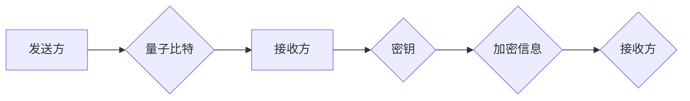

                 

## 关键词：量子通信、量子密钥分发（QKD）、量子互联网、量子纠缠、量子安全、密码学、量子算法

## 1. 背景介绍

在当今信息时代，数据安全和隐私保护日益受到重视。传统密码学依赖于复杂的数学难题，但随着计算能力的不断提升，这些难题逐渐变得可破解。量子计算的出现为密码学带来了新的挑战，同时也为安全通信开辟了新的可能性。量子通信，作为一种利用量子力学原理实现安全通信的技术，正逐渐成为未来通信网络的核心。

### 1.1 传统通信面临的挑战

传统通信网络主要依赖于经典信息理论，信息以比特的形式传输，每个比特可以是0或1。然而，经典通信面临着以下挑战：

* **窃听风险：** 传统的通信方式容易被窃听，攻击者可以拦截信息并进行解密。
* **信息篡改：** 攻击者可以篡改信息内容，导致信息传输失真。
* **身份验证问题：** 难以确保通信双方身份的真实性，存在冒充风险。

### 1.2 量子通信的优势

量子通信利用量子力学原理，例如量子叠加和量子纠缠，实现安全通信。其主要优势包括：

* **绝对安全性：** 量子力学原理保证了信息的绝对安全性，任何窃听行为都会被检测到。
* **抗篡改性：** 信息传输过程中任何篡改都会导致量子态的改变，从而被检测到。
* **身份认证：** 量子通信可以实现身份认证，确保通信双方身份的真实性。

## 2. 核心概念与联系

### 2.1 量子密钥分发（QKD）

量子密钥分发（QKD）是量子通信的核心技术之一，用于在两个通信双方之间安全地共享一个密钥。该密钥可以用于加密和解密信息，确保信息安全传输。

### 2.2 量子纠缠

量子纠缠是指两个或多个量子粒子之间存在一种特殊的关联关系，即使它们相隔很远，测量一个粒子的状态也会瞬间影响另一个粒子的状态。

### 2.3 量子互联网

量子互联网是指利用量子力学原理构建的下一代互联网，它将连接量子计算机、量子传感器和其他量子设备，实现高速、安全、可靠的量子信息传输。

**Mermaid 流程图**



## 3. 核心算法原理 & 具体操作步骤

### 3.1 算法原理概述

量子密钥分发算法基于量子力学的原理，利用量子叠加和量子纠缠来实现密钥的安全共享。

* **量子叠加：** 量子比特可以处于叠加态，即同时处于0和1的叠加状态。
* **量子纠缠：** 两个或多个量子比特可以纠缠在一起，即使它们相隔很远，测量一个粒子的状态也会瞬间影响另一个粒子的状态。

### 3.2 算法步骤详解

1. **量子比特准备：** 发送方准备一组量子比特，每个量子比特处于叠加态。
2. **量子态编码：** 发送方将密钥信息编码到量子比特的状态中。
3. **量子比特传输：** 发送方将量子比特通过光纤或其他量子信道传输到接收方。
4. **量子态测量：** 接收方对接收到的量子比特进行测量，并记录测量结果。
5. **密钥提取：** 发送方和接收方根据预先约定的协议，将测量结果进行比较，提取出共享的密钥。
6. **密钥加密：** 使用提取出的密钥加密信息，确保信息安全传输。

### 3.3 算法优缺点

**优点：**

* **绝对安全性：** 量子力学原理保证了密钥的安全共享，任何窃听行为都会被检测到。
* **抗篡改性：** 信息传输过程中任何篡改都会导致量子态的改变，从而被检测到。

**缺点：**

* **技术复杂性：** 量子通信技术相对复杂，需要高精度的量子设备和控制系统。
* **距离限制：** 量子比特的传输距离有限，需要构建量子中继网络来实现长距离通信。

### 3.4 算法应用领域

量子密钥分发算法在以下领域具有广泛的应用前景：

* **金融安全：** 保护金融交易的安全性和隐私性。
* **政府信息安全：** 保护国家机密和重要信息的安全。
* **医疗信息安全：** 保护患者医疗数据的安全和隐私。
* **军事通信安全：** 保护军事通信的机密性和可靠性。

## 4. 数学模型和公式 & 详细讲解 & 举例说明

### 4.1 数学模型构建

量子密钥分发算法的数学模型主要基于量子力学的叠加原理和纠缠原理。

* **叠加态：** 量子比特可以处于叠加态，可以用以下公式表示：

$$|\psi\rangle = \alpha |0\rangle + \beta |1\rangle$$

其中，$|0\rangle$ 和 $|1\rangle$ 分别表示量子比特处于0和1状态，$\alpha$ 和 $\beta$ 是复数系数，满足 $|\alpha|^2 + |\beta|^2 = 1$。

* **纠缠态：** 两个量子比特可以纠缠在一起，可以用以下公式表示：

$$|\phi\rangle = \frac{1}{\sqrt{2}}(|00\rangle + |11\rangle)$$

其中，$|00\rangle$ 和 $|11\rangle$ 分别表示两个量子比特都处于0和1状态。

### 4.2 公式推导过程

量子密钥分发算法的具体操作步骤涉及到量子态的编码、传输、测量和密钥提取等过程，每个过程都涉及到量子力学的数学公式推导。

例如，在BB84协议中，发送方会将密钥信息编码到量子比特的偏振态中。接收方会对接收到的量子比特进行测量，并根据测量结果提取出密钥。

### 4.3 案例分析与讲解

BB84协议是目前最常用的量子密钥分发协议之一。该协议利用量子比特的偏振态来实现密钥的共享。

**案例分析：**

假设发送方Alice想向接收方Bob共享一个密钥。Alice会准备一组量子比特，每个量子比特的偏振态可以是水平偏振（H）或垂直偏振（V）。Alice会随机选择每个量子比特的偏振态，并将这些量子比特通过光纤传输到Bob。

Bob会对接收到的量子比特进行测量，并根据测量结果记录下来。Alice和Bob会事先约定好测量基，例如，Alice可以选择H基或V基，Bob可以选择H基或V基。

**讲解：**

如果Alice和Bob选择的测量基相同，则他们可以提取出相同的密钥。如果Alice和Bob选择的测量基不同，则他们提取出的密钥会不同。

## 5. 项目实践：代码实例和详细解释说明

### 5.1 开发环境搭建

量子通信的开发环境需要包括量子计算机模拟器、量子编程语言和相关软件工具。

* **量子计算机模拟器：** 可以使用Qiskit、Cirq或PennyLane等开源模拟器。
* **量子编程语言：** 可以使用Python、C++或Java等编程语言编写量子程序。
* **相关软件工具：** 可以使用Git、Docker或Kubernetes等工具进行代码管理、部署和运行。

### 5.2 源代码详细实现

以下是一个使用Qiskit库实现BB84协议的简单代码示例：

```python
from qiskit import QuantumCircuit, Aer, execute

# 创建量子电路
qc = QuantumCircuit(1, 1)

# 随机选择量子比特的偏振态
bit = random.randint(0, 1)
if bit == 0:
    qc.h(0)  # 应用Hadamard门
else:
    qc.x(0)  # 应用X门

# 测量量子比特
qc.measure(0, 0)

# 模拟量子电路
simulator = Aer.get_backend('qasm_simulator')
job = execute(qc, simulator, shots=1024)
result = job.result()
counts = result.get_counts(qc)

# 打印测量结果
print(counts)
```

### 5.3 代码解读与分析

* **创建量子电路：** 使用Qiskit库创建了一个包含一个量子比特和一个经典比特的量子电路。
* **随机选择量子比特的偏振态：** 使用随机数生成器随机选择量子比特的偏振态，可以是水平偏振（H）或垂直偏振（V）。
* **应用量子门：** 根据选择的偏振态，应用Hadamard门或X门到量子比特上。
* **测量量子比特：** 对量子比特进行测量，并将测量结果存储到经典比特中。
* **模拟量子电路：** 使用Qiskit库的模拟器模拟量子电路的运行，并获取测量结果。
* **打印测量结果：** 打印出量子比特的测量结果，可以是0或1。

### 5.4 运行结果展示

运行该代码后，会输出量子比特的测量结果，例如：

```
{0: 512, 1: 512}
```

这表示量子比特测量结果为0和1的概率相等，符合量子叠加原理。

## 6. 实际应用场景

### 6.1 金融安全

量子密钥分发可以用于保护金融交易的安全性和隐私性。例如，银行可以利用量子密钥分发来加密客户的账户信息和交易记录，防止黑客攻击和数据泄露。

### 6.2 政府信息安全

政府机构需要保护国家机密和重要信息的安全。量子密钥分发可以为政府机构提供安全的通信渠道，防止信息泄露和间谍活动。

### 6.3 医疗信息安全

医疗机构需要保护患者的医疗数据的安全和隐私。量子密钥分发可以用于加密患者的病历、诊断结果和治疗方案，防止医疗信息泄露和滥用。

### 6.4 未来应用展望

随着量子技术的不断发展，量子通信将在更多领域得到应用，例如：

* **量子互联网：** 连接量子计算机、量子传感器和其他量子设备，实现高速、安全、可靠的量子信息传输。
* **量子云计算：** 提供安全的量子计算服务，用于科学研究、药物研发和材料设计等领域。
* **量子人工智能：** 利用量子计算的优势，开发更强大的人工智能算法，解决传统人工智能难以解决的问题。

## 7. 工具和资源推荐

### 7.1 学习资源推荐

* **Qiskit：** https://qiskit.org/
* **Cirq：** https://quantumai.google/cirq
* **PennyLane：** https://pennylane.ai/
* **IBM Quantum Experience：** https://quantum-computing.ibm.com/

### 7.2 开发工具推荐

* **Git：** https://git-scm.com/
* **Docker：** https://www.docker.com/
* **Kubernetes：** https://kubernetes.io/

### 7.3 相关论文推荐

* **BB84协议：** Bennett, C. H., & Brassard, G. (1984). Quantum cryptography: Public key distribution and coin tossing. Proceedings of IEEE International Conference on Computers, Systems and Signal Processing, 175-179.
* **量子互联网：** Nielsen, M. A., & Chuang, I. L. (2010). Quantum computation and quantum information. Cambridge university press.

## 8. 总结：未来发展趋势与挑战

### 8.1 研究成果总结

量子通信技术近年来取得了显著进展，从理论研究到实际应用，都取得了突破性成果。量子密钥分发已经实现了实验室规模的实用，并开始在一些关键领域进行试点应用。

### 8.2 未来发展趋势

未来量子通信技术将朝着以下方向发展：

* **提高安全性：** 研究更安全的量子密钥分发协议，提高抗窃听和抗篡改能力。
* **扩展距离：** 研究量子中继技术，实现长距离量子通信。
* **提高效率：** 研究更高效的量子通信算法和硬件，提高通信速度和效率。
* **构建量子互联网：** 建立连接量子计算机、量子传感器和其他量子设备的量子互联网，实现量子信息网络的构建。

### 8.3 面临的挑战

量子通信技术还面临着一些挑战：

* **技术复杂性：** 量子通信技术非常复杂，需要高精度的量子设备和控制系统。
* **成本高昂：** 量子设备和系统成本高昂，制约了量子通信技术的普及。
* **标准化问题：** 目前量子通信技术缺乏统一的标准，需要制定行业标准，促进技术互操作性。

### 8.4 研究展望

尽管面临挑战，但量子通信技术的前景依然光明。随着技术的不断发展和成本的降低，量子通信将成为未来通信网络的核心技术，为人类社会带来安全、可靠、高效的信息传输方式。

## 9. 附录：常见问题与解答

### 9.1 量子通信比传统通信安全吗？

是的，量子通信比传统通信更安全。因为量子力学原理保证了信息的绝对安全性，任何窃听行为都会被检测到。

### 9.2 量子通信的距离限制是什么？

量子通信的距离目前有限，需要构建量子中继网络来实现长距离通信。

### 9.3 量子通信技术何时能够普及？

随着技术的不断发展和成本的降低，量子通信技术预计将在未来几年内逐步普及。


作者：禅与计算机程序设计艺术 / Zen and the Art of Computer Programming 
<end_of_turn>

