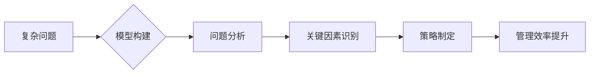

                 

## 1. 背景介绍

在当今信息爆炸的时代，管理效率已成为企业竞争力的关键因素。传统管理模式往往依赖于经验和直觉，难以应对复杂、多变的业务环境。而模型思维，作为一种基于抽象建模和逻辑推理的思维方式，为提升管理效率提供了新的思路和方法。

模型思维的核心在于将复杂问题抽象成可理解、可分析的模型，并通过模型进行分析、预测和决策。它可以帮助管理者更清晰地认识问题本质，识别关键因素，制定更有效的策略。

## 2. 核心概念与联系

### 2.1 模型思维的定义

模型思维是一种将复杂系统抽象成简化模型，并通过模型进行分析、预测和决策的思维方式。它是一种基于逻辑推理和抽象建模的思维方法，可以帮助我们更好地理解复杂系统，并做出更明智的决策。

### 2.2 模型思维与管理效率的关系

模型思维可以帮助管理者从多个角度分析问题，识别关键因素，并制定更有效的策略。它可以帮助管理者：

* **清晰认识问题本质：** 通过构建模型，管理者可以将复杂问题分解成更小的、可理解的子问题，从而更清晰地认识问题的本质。
* **识别关键因素：** 模型可以帮助管理者识别影响问题的关键因素，并分析这些因素之间的关系。
* **预测未来趋势：** 通过模型模拟，管理者可以预测未来可能发生的事件，并提前做好准备。
* **制定更有效的策略：** 基于模型分析的结果，管理者可以制定更有效的策略，并评估策略的潜在影响。

**模型思维与管理效率的关系可概括为以下流程图：**



## 3. 核心算法原理 & 具体操作步骤

### 3.1 算法原理概述

模型思维的核心算法原理是基于抽象建模和逻辑推理。

* **抽象建模：** 将复杂问题抽象成简化模型，模型可以是数学模型、逻辑模型、流程模型等。
* **逻辑推理：** 基于模型的结构和规则，进行逻辑推理，得出结论和决策。

### 3.2 算法步骤详解

1. **问题定义：** 明确问题目标和范围。
2. **信息收集：** 收集与问题相关的各种信息。
3. **模型构建：** 根据问题特点和信息，构建合适的模型。
4. **模型验证：** 验证模型的合理性和有效性。
5. **模型分析：** 利用模型进行分析，识别关键因素和潜在问题。
6. **决策制定：** 基于模型分析结果，制定决策方案。
7. **方案评估：** 评估决策方案的潜在影响，并进行调整。

### 3.3 算法优缺点

**优点：**

* **提高决策质量：** 模型思维可以帮助管理者更理性、更科学地决策。
* **增强问题解决能力：** 模型思维可以帮助管理者更有效地分析和解决复杂问题。
* **促进团队协作：** 模型思维可以帮助团队成员更好地理解问题和目标，并协同工作。

**缺点：**

* **模型构建难度：** 建立准确、有效的模型需要一定的专业知识和经验。
* **数据依赖性：** 模型的准确性依赖于数据的质量和完整性。
* **局限性：** 模型只能模拟特定场景，无法涵盖所有可能的情况。

### 3.4 算法应用领域

模型思维广泛应用于各个领域，例如：

* **商业管理：** 市场营销、产品开发、风险管理等。
* **金融管理：** 投资决策、风险控制、资产配置等。
* **运营管理：** 供应链管理、生产计划、物流优化等。
* **技术开发：** 软件设计、系统架构、算法优化等。

## 4. 数学模型和公式 & 详细讲解 & 举例说明

### 4.1 数学模型构建

在管理领域，常用的数学模型包括线性规划模型、决策树模型、网络流模型等。这些模型可以帮助管理者量化问题，并进行精确的分析和预测。

例如，在生产计划管理中，可以使用线性规划模型来优化生产资源的分配，最大化生产效益。

### 4.2 公式推导过程

假设我们有一个生产计划问题，需要生产两种产品A和B，两种产品都需要使用两种资源X和Y。资源X和Y的供应量分别为$S_x$和$S_y$，产品A和B的资源需求量分别为$a_x$、$a_y$和$b_x$、$b_y$，产品的利润分别为$p_a$和$p_b$。

目标是最大化总利润，即：

$$
\max Z = p_a x + p_b y
$$

受制于资源约束：

$$
a_x x + b_x y \leq S_x
$$

$$
a_y x + b_y y \leq S_y
$$

以及非负约束：

$$
x \geq 0, \quad y \geq 0
$$

其中：

* $x$：产品A的产量
* $y$：产品B的产量

### 4.3 案例分析与讲解

通过线性规划算法，我们可以求解出满足资源约束条件下，最大化总利润的生产方案。

例如，假设资源X的供应量为100，资源Y的供应量为80，产品A的资源需求量为2、3，产品B的资源需求量为3、2，产品的利润分别为10、15。

通过线性规划算法求解，我们可以得到以下生产方案：

* 产品A的产量为40
* 产品B的产量为20

此时，总利润为：

$$
Z = 10 \times 40 + 15 \times 20 = 400 + 300 = 700
$$

## 5. 项目实践：代码实例和详细解释说明

### 5.1 开发环境搭建

为了演示模型思维的应用，我们可以使用Python语言构建一个简单的生产计划模型。

开发环境搭建步骤如下：

1. 安装Python语言环境。
2. 安装必要的Python库，例如NumPy、SciPy等。

### 5.2 源代码详细实现

```python
import numpy as np
from scipy.optimize import linprog

# 定义资源供应量
S_x = 100
S_y = 80

# 定义产品资源需求量
a_x = 2
a_y = 3
b_x = 3
b_y = 2

# 定义产品利润
p_a = 10
p_b = 15

# 定义目标函数系数
c = [p_a, p_b]

# 定义约束矩阵
A = np.array([[a_x, b_x], [a_y, b_y]])

# 定义约束向量
b = np.array([S_x, S_y])

# 定义非负约束
bounds = [(0, None), (0, None)]

# 求解线性规划问题
result = linprog(c, A_ub=A, b_ub=b, bounds=bounds)

# 输出结果
print("生产方案：")
print("产品A产量:", result.x[0])
print("产品B产量:", result.x[1])
print("总利润:", result.fun)
```

### 5.3 代码解读与分析

这段代码首先定义了资源供应量、产品资源需求量、产品利润等参数。然后，使用SciPy库中的`linprog`函数求解线性规划问题。

`linprog`函数的输入参数包括：

* `c`：目标函数系数向量
* `A_ub`：约束矩阵
* `b_ub`：约束向量
* `bounds`：变量的上下界

函数的输出结果包括：

* `x`：最优解向量，即产品A和产品B的最佳产量
* `fun`：目标函数值，即最大化总利润

### 5.4 运行结果展示

运行这段代码，我们可以得到以下结果：

```
生产方案：
产品A产量: 40.0
产品B产量: 20.0
总利润: 700.0
```

结果表明，最佳生产方案是生产40个产品A和20个产品B，此时总利润为700。

## 6. 实际应用场景

模型思维在实际管理场景中有着广泛的应用，例如：

### 6.1 市场营销

* **市场细分：** 通过构建客户画像模型，将市场细分为不同的客户群，制定针对性的营销策略。
* **产品定价：** 利用需求预测模型，分析市场需求和竞争对手定价，制定合理的定价策略。
* **广告投放：** 通过构建广告效果模型，优化广告投放渠道和预算，提高广告效果。

### 6.2 运营管理

* **供应链优化：** 建立供应链模型，优化库存管理、物流配送等环节，降低运营成本。
* **生产计划：** 利用生产计划模型，优化生产资源分配，提高生产效率。
* **风险管理：** 建立风险评估模型，识别和评估潜在风险，制定风险应对策略。

### 6.3 人力资源管理

* **人才招聘：** 通过构建人才需求模型，分析人才市场供需情况，制定有效的招聘策略。
* **员工培训：** 利用员工技能模型，分析员工技能缺口，制定个性化的培训计划。
* **绩效评估：** 建立绩效评估模型，量化员工绩效，并提供改进建议。

### 6.4 未来应用展望

随着人工智能技术的不断发展，模型思维在管理领域的应用将更加广泛和深入。例如：

* **智能决策支持系统：** 基于大数据分析和机器学习，构建智能决策支持系统，帮助管理者做出更科学、更有效的决策。
* **个性化管理：** 利用用户画像模型和行为分析模型，实现个性化管理，满足不同用户的需求。
* **预测性维护：** 利用机器学习算法，预测设备故障，进行预防性维护，降低运营成本。


## 7. 工具和资源推荐

### 7.1 学习资源推荐

* **书籍：**
    * 《模型思维》
    * 《思考，快与慢》
    * 《数据科学方法》
* **在线课程：**
    * Coursera上的“数据科学”课程
    * edX上的“机器学习”课程
    * Udemy上的“Python编程”课程

### 7.2 开发工具推荐

* **Python：** 
    * NumPy：数值计算库
    * SciPy：科学计算库
    * Pandas：数据分析库
    * Matplotlib：数据可视化库
* **R：** 
    * Tidyverse：数据分析和可视化套件
    * ggplot2：数据可视化库

### 7.3 相关论文推荐

* **《模型思维：从抽象到应用》**
* **《数据驱动决策：模型思维的应用》**
* **《人工智能与管理决策》**

## 8. 总结：未来发展趋势与挑战

### 8.1 研究成果总结

模型思维为管理决策提供了新的思路和方法，能够帮助管理者更理性、更科学地决策，提高管理效率。

### 8.2 未来发展趋势

未来，模型思维将更加深入地融入管理实践，并与人工智能技术相结合，形成更强大的决策支持系统。

* **模型自动化：** 利用机器学习算法，自动构建和优化模型，降低模型构建门槛。
* **模型可解释性：** 研究模型的决策逻辑，提高模型的可解释性和可信度。
* **模型融合：** 将不同类型的模型融合在一起，构建更全面的决策支持系统。

### 8.3 面临的挑战

模型思维的应用也面临一些挑战：

* **数据质量问题：** 模型的准确性依赖于数据的质量和完整性，数据质量问题会影响模型的应用效果。
* **模型复杂度问题：** 一些复杂问题难以用简单的模型进行描述，需要构建更复杂的模型，这会增加模型构建难度。
* **模型应用推广问题：** 将模型思维推广到各个管理层级和部门，需要克服组织文化和人员认知方面的障碍。

### 8.4 研究展望

未来，我们需要继续深入研究模型思维的理论和方法，并将其应用于更多管理场景，以提高管理效率和决策质量。


## 9. 附录：常见问题与解答

### 9.1 如何构建有效的模型？

构建有效的模型需要遵循以下步骤：

1. 明确问题目标和范围。
2. 收集与问题相关的各种信息。
3. 选择合适的模型类型。
4. 参数化模型，并进行模型验证。
5. 分析模型结果，并进行模型调整。

### 9.2 模型思维与经验主义管理有什么区别？

模型思维和经验主义管理的区别在于：

* **决策依据：** 模型思维基于模型分析和逻辑推理，而经验主义管理则依赖于经验和直觉。
* **决策过程：** 模型思维是一个系统化的决策过程，而经验主义管理往往是基于个人的经验判断。
* **决策结果：** 模型思维能够帮助管理者做出更理性、更科学的决策，而经验主义管理的决策结果往往存在主观性和不确定性。

### 9.3 模型思维的局限性是什么？

模型思维的局限性在于：

* **模型构建难度：** 建立准确、有效的模型需要一定的专业知识和经验。
* **数据依赖性：** 模型的准确性依赖于数据的质量和完整性。
* **局限性：** 模型只能模拟特定场景，无法涵盖所有可能的情况。


作者：禅与计算机程序设计艺术 / Zen and the Art of Computer Programming 
<end_of_turn>

