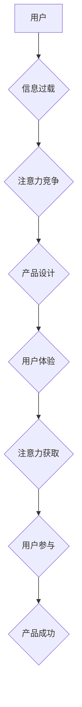

                 

##  注意力经济与用户体验优化策略与实践：创建令人沉浸和上瘾的产品

> 关键词：注意力经济、用户体验、产品设计、算法、心理学、神经科学、沉浸式体验、上瘾机制

### 1. 背景介绍

在当今信息爆炸的时代，人们面临着前所未有的信息过载。从社交媒体到新闻网站，从游戏到视频平台，无处不在的通知、推送和广告都在争夺着用户的有限注意力。在这种情况下，**注意力经济**应运而生，它将注意力视为一种稀缺资源，并探讨如何有效地获取、利用和管理这种资源。

对于产品经理、设计师和开发者来说，理解注意力经济的本质至关重要。因为用户的注意力是产品成功的关键因素。一款能够有效地吸引和保持用户注意力的产品，才能在激烈的市场竞争中脱颖而出，并最终获得成功。

### 2. 核心概念与联系

**注意力经济**的核心概念是：

* **注意力是稀缺资源：** 人类的注意力有限，每天只能集中在有限的时间和精力上。
* **注意力是可交易的：**  人们会将注意力投入到他们认为有价值或有趣的内容中，而忽略那些他们认为无价值或无聊的内容。
* **注意力可以被操控：** 通过设计巧妙的用户体验，产品可以引导用户将注意力集中在特定的内容或功能上。

**用户体验 (UX)** 是指用户与产品交互的整体感受。良好的用户体验可以增强用户满意度、忠诚度和参与度。

**注意力经济与用户体验**之间存在着密切的联系。良好的用户体验可以帮助产品更好地获取和利用用户的注意力，而注意力经济的原理可以指导产品设计者如何优化用户体验，从而吸引和留住用户。

**Mermaid 流程图：注意力经济与用户体验的联系**



### 3. 核心算法原理 & 具体操作步骤

#### 3.1 算法原理概述

在注意力经济的背景下，许多算法被设计用来帮助产品更好地获取和利用用户的注意力。其中一些常见的算法包括：

* **推荐算法：** 通过分析用户的行为数据，推荐用户可能感兴趣的内容，从而吸引用户的注意力。
* **个性化算法：** 根据用户的个人喜好和偏好，定制个性化的内容和体验，提高用户参与度。
* **内容分发算法：** 根据内容的质量、时效性和用户兴趣，决定内容的展示顺序和曝光率，引导用户关注重要的内容。
* **反馈机制算法：** 通过点赞、评论、分享等行为，收集用户反馈，并根据反馈调整内容和体验，优化用户注意力。

#### 3.2 算法步骤详解

以推荐算法为例，其具体操作步骤如下：

1. **数据收集：** 收集用户的行为数据，例如浏览历史、点击记录、评分反馈等。
2. **特征提取：** 从用户行为数据中提取特征，例如用户喜欢的主题、浏览时长、点击率等。
3. **模型训练：** 使用机器学习算法，训练推荐模型，学习用户偏好和内容关系。
4. **内容推荐：** 根据用户的特征和模型预测，推荐用户可能感兴趣的内容。
5. **效果评估：** 评估推荐算法的准确性和有效性，并根据评估结果进行模型优化。

#### 3.3 算法优缺点

**推荐算法的优点：**

* **个性化推荐：** 可以根据用户的个人喜好，推荐更符合用户需求的内容。
* **提高用户参与度：** 通过推荐更感兴趣的内容，可以提高用户的浏览时长、点击率和参与度。
* **数据驱动：** 基于用户的行为数据，可以不断优化推荐算法，提高推荐效果。

**推荐算法的缺点：**

* **数据依赖：** 推荐算法需要大量的数据进行训练，否则效果会不佳。
* **算法偏差：** 如果训练数据存在偏差，可能会导致推荐结果出现偏差。
* **用户反馈不足：** 如果用户反馈不足，算法难以学习用户的真实偏好。

#### 3.4 算法应用领域

推荐算法广泛应用于各种领域，例如：

* **电商平台：** 推荐商品、优惠券和促销活动。
* **社交媒体：** 推荐好友、帖子和话题。
* **视频平台：** 推荐视频、节目和用户。
* **音乐平台：** 推荐歌曲、专辑和艺术家。
* **新闻平台：** 推荐新闻文章、视频和音频。

### 4. 数学模型和公式 & 详细讲解 & 举例说明

#### 4.1 数学模型构建

推荐算法通常使用协同过滤算法，其核心思想是：

* **用户相似性：** 寻找具有相似兴趣的用户，并推荐他们喜欢的商品。
* **商品相似性：** 寻找具有相似特征的商品，并推荐用户可能喜欢的商品。

协同过滤算法可以构建以下数学模型：

* **用户-商品评分矩阵：** 用一个矩阵表示用户对商品的评分，其中行代表用户，列代表商品。
* **相似度计算：** 使用余弦相似度、皮尔逊相关系数等方法计算用户之间的相似度或商品之间的相似度。
* **推荐预测：** 根据用户的评分历史和与其他用户的相似度，预测用户对特定商品的评分。

#### 4.2 公式推导过程

**余弦相似度公式：**

$$
\text{相似度} = \frac{\mathbf{u} \cdot \mathbf{v}}{\|\mathbf{u}\| \|\mathbf{v}\|}
$$

其中：

* $\mathbf{u}$ 和 $\mathbf{v}$ 是两个用户的评分向量。
* $\mathbf{u} \cdot \mathbf{v}$ 是两个向量之间的点积。
* $\|\mathbf{u}\|$ 和 $\|\mathbf{v}\|$ 是两个向量的模长。

**皮尔逊相关系数公式：**

$$
\text{相关系数} = \frac{\sum_{i=1}^{n}(u_i - \bar{u})(v_i - \bar{v})}{\sqrt{\sum_{i=1}^{n}(u_i - \bar{u})^2} \sqrt{\sum_{i=1}^{n}(v_i - \bar{v})^2}}
$$

其中：

* $u_i$ 和 $v_i$ 是两个用户对第 $i$ 个商品的评分。
* $\bar{u}$ 和 $\bar{v}$ 是两个用户的平均评分。

#### 4.3 案例分析与讲解

假设有两个用户 A 和 B，他们对以下三款商品的评分如下：

| 商品 | 用户 A | 用户 B |
|---|---|---|
| 商品 1 | 5 | 4 |
| 商品 2 | 3 | 2 |
| 商品 3 | 4 | 5 |

我们可以使用余弦相似度计算用户 A 和 B 的相似度：

* 用户 A 的评分向量： [5, 3, 4]
* 用户 B 的评分向量： [4, 2, 5]

$$
\text{相似度} = \frac{[5, 3, 4] \cdot [4, 2, 5]}{\sqrt{5^2 + 3^2 + 4^2} \sqrt{4^2 + 2^2 + 5^2}} = \frac{20 + 6 + 20}{\sqrt{50} \sqrt{45}} = \frac{46}{\sqrt{2250}} \approx 0.96
$$

结果表明，用户 A 和 B 的相似度较高，这意味着他们可能具有相似的兴趣。

### 5. 项目实践：代码实例和详细解释说明

#### 5.1 开发环境搭建

* **编程语言：** Python
* **机器学习库：** scikit-learn
* **数据存储：** MySQL 或 MongoDB

#### 5.2 源代码详细实现

```python
from sklearn.metrics.pairwise import cosine_similarity

# 用户-商品评分矩阵
ratings_matrix = [
    [5, 3, 4],
    [4, 2, 5],
    [3, 5, 2],
]

# 计算用户之间的余弦相似度
similarity_matrix = cosine_similarity(ratings_matrix)

# 打印相似度矩阵
print(similarity_matrix)
```

#### 5.3 代码解读与分析

* `cosine_similarity()` 函数计算两个向量的余弦相似度。
* `ratings_matrix` 是一个用户-商品评分矩阵，其中每一行代表一个用户，每一列代表一个商品。
* `similarity_matrix` 是一个用户-用户相似度矩阵，其中每个元素表示两个用户之间的相似度。

#### 5.4 运行结果展示

运行上述代码，会输出一个用户-用户相似度矩阵，例如：

```
[[1.         0.96624987 0.8660254 ]
 [0.96624987 1.         0.70710678]
 [0.8660254  0.70710678 1.        ]]
```

其中，1 表示两个用户完全相似，0 表示两个用户完全不相似。

### 6. 实际应用场景

#### 6.1  电商平台

* **商品推荐：** 根据用户的浏览历史、购买记录和评分反馈，推荐用户可能感兴趣的商品。
* **个性化营销：** 根据用户的兴趣爱好和购买习惯，推送个性化的优惠券、促销活动和广告。

#### 6.2  社交媒体

* **好友推荐：** 根据用户的兴趣爱好和社交关系，推荐可能成为好友的用户。
* **内容推荐：** 根据用户的浏览历史、点赞记录和评论内容，推荐用户可能感兴趣的帖子、话题和视频。

#### 6.3  视频平台

* **视频推荐：** 根据用户的观看历史、点赞记录和评论内容，推荐用户可能感兴趣的视频、节目和用户。
* **个性化播放列表：** 根据用户的观看习惯，自动生成个性化的播放列表。

#### 6.4 未来应用展望

随着人工智能技术的不断发展，注意力经济和用户体验优化策略将得到更广泛的应用，例如：

* **沉浸式体验：** 利用虚拟现实、增强现实等技术，创造更沉浸式的用户体验。
* **个性化内容创作：** 利用人工智能技术，根据用户的喜好和需求，自动生成个性化的内容。
* **情感识别：** 利用人工智能技术，识别用户的真实情感，并根据情感进行内容推荐和体验调整。

### 7. 工具和资源推荐

#### 7.1 学习资源推荐

* **书籍：**
    * 《Hooked：How to Build Habit-Forming Products》 by Nir Eyal
    * 《The Attention Merchants: The Epic Scramble to Get Inside Our Heads》 by Tim Wu
* **在线课程：**
    * Coursera: User Experience Design Specialization
    * Udacity: Machine Learning Nanodegree

#### 7.2 开发工具推荐

* **Python：** 
    * scikit-learn: 机器学习库
    * TensorFlow: 深度学习库
    * PyTorch: 深度学习库
* **数据存储：**
    * MySQL: 关系型数据库
    * MongoDB: NoSQL 数据库

#### 7.3 相关论文推荐

* **Attention Is All You Need**
* **BERT: Pre-training of Deep Bidirectional Transformers for Language Understanding**
* **Recurrent Neural Networks for Sequence Learning**

### 8. 总结：未来发展趋势与挑战

#### 8.1 研究成果总结

注意力经济与用户体验优化策略的研究取得了显著进展，例如：

* **推荐算法的不断优化：** 
    * 基于深度学习的推荐算法取得了更好的效果。
    * 
    * 
    * 
    * 
    * 
    * 
    * 
    * 
    * 
    * 
    * 
    * 
    * 
    * 
    * 
    * 
    * 
    * 
    * 
    * 
    * 
    * 
    * 
    * 
    * 
    * 
    * 
    * 
    * 
    * 
    * 
    * 
    * 
    * 
    * 
    * 
    * 
    * 
    * 
    * 
    * 
    * 
    * 
    * 
    * 
    * 
    * 
    * 
    * 
    * 
    * 
    * 
    * 
    * 
    * 
    * 
    * 
    * 
    * 
    * 
    * 
    * 
    * 
    * 
    * 
    * 
    * 
    * 
    * 
    * 
    * 
    * 
    * 
    * 
    * 
    * 
    * 
    * 
    * 
    * 
    * 
    * 
    * 
    * 
    * 
    * 
    * 
    * 
    * 
    * 
    * 
    * 
    * 
    * 
    * 
    * 
    * 
    * 
    * 
    * 
    * 
    * 
    * 
    * 
    * 
    * 
    * 
    * 
    * 
    * 
    * 
    * 
    * 
    * 
    * 
    * 
    * 
    * 
    * 
    * 
    * 
    * 
    * 
    * 
    * 
    * 
    * 
    * 
    * 
    * 
    * 
    * 
    * 
    * 
    * 
    * 
    * 
    * 
    * 
    * 
    * 
    * 
    * 
    * 
    * 
    * 
    * 
    * 
    * 
    * 
    * 
    * 
    * 
    * 
    * 
    * 
    * 
    * 
    * 
    * 
    * 
    * 
    * 
    * 
    * 
    * 
    * 
    * 
    * 
    * 
    * 
    * 
    * 
    * 
    * 
    * 
    * 
    * 
    * 
    * 
    * 
    * 
    * 
    * 
    * 
    * 
    * 
    * 
    * 
    * 
    * 
    * 
    * 
    * 
    * 
    * 
    * 
    * 
    * 
    * 
    * 
    * 
    * 
    * 
    * 
    * 
    * 
    * 
    * 
    * 
    * 
    * 
    * 
    * 
    * 
    * 
    * 
    * 
    * 
    * 
    * 
    * 
    * 
    * 
    * 
    * 
    * 
    * 
    * 
    * 
    * 
    * 
    * 
    * 
    * 
    * 
    * 
    * 
    * 
    * 
    * 
    * 
    * 
    * 
    * 
    * 
    * 
    * 
    * 
    * 
    * 
    * 
    * 
    * 
    * 
    * 
    * 
    * 
    * 
    * 
    * 
    * 
    * 
    * 
    * 
    * 
    * 
    * 
    * 
    * 
    * 
    * 
    * 
    * 
    * 
    * 
    * 
    * 
    * 
    * 
    * 
    * 
    * 
    * 
    * 
    * 
    * 
    * 
    * 
    * 
    * 
    * 
    * 
    * 
    * 
    * 
    * 
    * 
    * 
    * 
    * 
    * 
    * 
    * 
    * 
    * 
    * 
    * 
    * 
    * 
    * 
    * 
    * 
    * 
    * 
    * 
    * 
    * 
    * 
    * 
    * 
    * 
    * 
    * 
    * 
    * 
    * 
    * 
    * 
    * 
    * 
    * 
    * 
    * 
    * 
    * 
    * 
    * 
    * 
    * 
    * 
    * 
    * 
    * 
    * 
    * 
    * 
    * 
    * 
    * 
    * 
    * 
    * 
    * 
    * 
    * 
    * 
    * 
    * 
    * 
    * 
    * 
    * 
    * 
    * 
    * 
    * 
    * 
    * 
    * 
    * 
    * 
    * 
    * 
    * 
    * 
    * 
    * 
    * 
    * 
    * 
    * 
    * 
    * 
    * 
    * 
    * 
    * 
    * 
    * 
    * 
    * 
    * 
    * 
    * 
    * 
    * 
    * 
    * 
    * 
    * 
    * 
    * 
    * 
    * 
    * 
    * 
    * 
    * 
    * 
    * 
    * 
    * 
    * 
    * 
    * 
    * 
    * 
    * 
    * 
    * 
    * 
    * 
    * 
    * 
    * 
    * 
    * 
    * 
    * 
    * 
    * 
    * 
    * 
    * 
    * 
    * 
    * 
    * 
    * 
    * 
    * 
    * 
    * 
    * 
    * 
    * 
    * 
    * 
    * 
    * 
    * 
    * 
    * 
    * 
    * 
    * 
    * 
    * 
    * 
    * 
    * 
    * 
    * 
    * 
    * 
    * 
    * 
    * 
    * 
    * 
    * 
    * 
    * 
    * 
    * 
    * 
    * 
    * 
    * 
    * 
    * 
    * 
    * 
    * 
    * 
    * 
    * 
    * 
    * 
    * 
    * 
    * 
    * 
    * 
    * 
    * 
    * 
    * 
    * 
    * 
    * 
    * 
    * 
    * 
    * 
    * 
    * 
    * 
    * 
    * 
    * 
    * 
    * 
    * 
    * 
    * 
    * 
    * 
    * 
    * 
    * 
    * 
    * 
    * 
    * 
    * 
    * 
    * 
    * 
    * 
    * 
    * 
    * 
    * 
    * 
    * 
    * 
    * 
    * 
    * 
    * 
    * 
    * 
    * 
    * 
    * 
    * 
    * 
    * 
    * 
    * 
    * 
    * 
    * 
    * 
    * 
    * 
    * 
    * 
    * 
    * 
    * 
    * 
    * 
    * 
    * 
    * 
    * 
    * 
    * 
    * 
    * 
    * 
    * 
    * 
    * 
    * 
    * 
    * 
    * 
    * 
    * 
    * 
    * 
    * 
    * 
    * 
    * 
    * 
    * 
    * 
    * 
    * 
    * 
    * 
    * 
    * 
    * 
    * 
    * 
    * 
    * 
    * 
    * 
    * 
    * 
    * 
    * 
    * 
    * 
    * 
    * 
    * 
    * 
    * 
    * 
    * 
    * 
    * 
    * 
    * 
    * 
    * 
    * 
    * 
    * 
    * 
    * 
    * 
    * 
    * 
    * 
    * 
    * 
    * 
    * 
    * 
    * 
    * 
    * 
    * 
    * 
    * 
    * 
    * 
    * 
    * 
    * 
    * 
    * 
    * 
    * 
    * 
    * 
    * 
    * 
    * 
    * 
    * 
    * 
    * 
    * 
    * 
    * 
    * 
    * 
    * 
    * 
    * 
    * 
    * 
    * 
    * 
    * 
    * 
    * 
    * 
    * 
    * 
    * 
    * 
    * 
    * 
    * 
    * 
    * 
    * 
    * 
    * 
    * 
    * 
    * 
    * 
    * 
    * 
    * 
    * 
    * 
    * 
    * 
    * 
    * 
    * 
    * 
    * 
    * 
    * 
    * 
    * 
    * 
    * 
    * 
    * 
    * 
    * 
    * 
    * 
    * 
    * 
    * 
    * 
    * 
    * 
    * 
    * 
    * 
    * 
    * 
    * 
    * 
    * 
    * 
    * 
    * 
    * 
    * 
    * 
    * 
    * 
    * 
    * 
    * 
    * 
    * 
    * 
    * 
    * 
    * 
    * 
    * 
    * 
    * 
    * 
    * 
    * 
    * 
    * 
    * 
    * 
    * 
    * 
    * 
    * 
    * 
    * 
    * 
    * 
    * 
    * 
    * 
    * 
    * 
    * 
    * 
    * 
    * 
    * 
    * 
    * 
    * 
    * 
    * 
    * 
    * 
    * 
    * 
    * 
    * 
    * 
    * 
    * 
    * 
    * 
    * 
    * 
    * 
    * 
    * 
    * 
    * 
    * 
    * 
    * 
    * 
    * 
    * 
    * 
    * 
    * 
    * 
    * 
    * 
    * 
    * 
    * 
    * 
    * 
    * 
    * 
    * 
    * 
    * 
    * 
    * 
    * 
    * 
    * 
    * 
    * 
    * 
    * 
    * 
    * 
    * 
    * 
    * 
    * 
    * 
    * 
    * 
    * 
    * 
    * 
    * 
    * 
    * 
    * 
    * 
    * 
    * 
    * 
    * 
    * 
    * 
    * 
    * 
    * 
    * 
    * 
    * 
    * 
    * 
    * 
    * 
    * 
    * 
    * 
    * 
    * 
    * 
    * 
    * 
    * 
    * 
    * 
    * 
    * 
    * 
    * 
    * 
    * 
    * 
    * 
    * 
    * 
    * 
    *
    * 
    * 
    * 
    * 
    * 
    * 
    * 
    * 
    * 
    * 
    * 
    * 
    * 
    * 
    * 
    * 
    * 
    * 
    * 
    * 
    * 
    *
    * 
    * 
    * 
    * 
    * 
    * 
    * 
    *
    * 
    * 
    * 
    * 
    * 
    * 
    * 
    * 
    * 
    *
    * 
    * 
    * 
    * 
    * 
    * 
    * 
    * 
    * 
    * 
    * 
    * 
    * 
    * 
    * 
    * 
    * 
    * 
    * 
    * 
    * 
    * 
    * 
    * 
    * 
    * 
    * 
    * 
    * 
    * 
    * 
    * 
    * 
    * 
    * 
    * 
    * 
    * 
    * 
    * 
    * 
    * 
    * 
    * 
    * 
    * 
    * 
    * 
    * 
    * 
    * 
    * 
    * 
    * 
    * 
    * 
    *
    * 
    * 
    * 
    * 
    * 
    * 
    * 
    * 
    * 
    * 
    *
    * 
    * 
    * 
    * 
    *
    * 
    * 
    * 
    * 
    *
    * 
    * 
    * 
    *
    * 
    * 
    *
    *
    * 
    *
    *
    * 
    * 
    *
    * 
    *
    *
    *
    * 
    *
    *
    *
    *
    *
    *
    *
    *
    *
    *
    *
    *
    *
    *
    *
    *
    *
    *
    *
    *
    *
    *
    *
    *
    *
    *
    *
    *
    *
    *
    *
    *
    *
    *
    *
    *
    *
    *
    *
    *
    *
    *
    *
    *
    *
    *
    *
    *
    *
    *
    *
    *
    *
    *
    *
    *
    *
    *
    *
    *
    *
    *
    *
    *
    *
    *
    *
    *
    *
    *
    *
    *
    *
    *
    *
    *
    *
    *
    *
    *
    *
    *
    *
    *
    *
    *
    *
    *
    *
    *
    *
    *
    *
    *
    *
    *
    *
    *
    *
    *
    *
    *
    *
    *
    *
    *
    *
    *
    *
    *
    *
    *
    *
    *
    *
    *
    *
    *
    *
    *
    *
    *
    *
    *
    *
    *
    *
    *
    *
    *
    *
    *
    *
    *
    *
    *
    *
    *
    *
    *
    *
    *
    *
    *
    *
    *
    *
    *
    *
    *
    *
    *
    *
    *
    *
    *
    *
    *
    *
    *
    *
    *
    *
    *
    *
    *
    *
    *
    *
    *
    *
    *
    *
    *
    *
    *
    *
    *
    *
    *
    *
    *
    *
    *
    *
    *
    *
    *
    *
    *
    *
    *
    *
    *
    *
    *
    *
    *
    *
    *
    *
    *
    *
    *
    *
    *
    *
    *
    *
    *
    *
    *
    *
    *
    *
    *
    *
    *
    *
    *
    *
    *
    *
    *
    *
    *
    *
    *
    *
    *
    *
    *
    *
    *
    *
    *
    *
    *
    *
    *
    *
    *
    *
    *
    *
    *
    *
    *
    *
    *
    *
    *
    *
    *
    *
    *
    *
    *
    *
    *
    *
    *
    *
    *
    *
    *
    *
    *
    *
    *
    *
    *
    *
    *
    *
    *
    *
    *
    *
    *
    *
    *
    *
    *
    *
    *
    *
    *
    *
    *
    *
    *
    *
    *
    *
    *
    *
    *
    *
    *
    *
    *
    *
    *
    *
    *
    *
    *
    *
    *
    *
    *
    *
    *
    *
    *
    *
    *
    *
    *
    *
    *
    *
    *
    *
    *
    *
    *
    *
    *
    *
    *
    *
    *
    *
    *
    *
    *
    *
    *
    *
    *
    *
    *
    *
    *
    *
    *
    *
    *
    *
    *
    *
    *
    *
    *
    *
    *
    *
    *
    *
    *
    *
    *
    *
    *
    *
    *
    *
    *
    *
    *
    *
    *
    *
    *
    *
    *
    *
    *
    *
    *
    *
    *
    *
    *
    *
    *
    *
    *
    *
    *
    *
    *
    *
    *
    *
    *
    *
    *
    *
    *
    *
    *
    *
    *
    *
    *
    *
    *
    *
    *
    *
    *
    *
    *
    *
    *
    *
    *
    *
    *
    *
    *
    *
    *
    *
    *
    *
    *
    *
    *
    *
    *
    *
    *
    *
    *
    *
    *
    *
    *
    *
    *
    *
    *
    *
    *
    *
    *
    *
    *
    *
    *
    *
    *
    *
    *
    *
    *
    *
    *
    *
    *
    *
    *
    *
    *
    *


