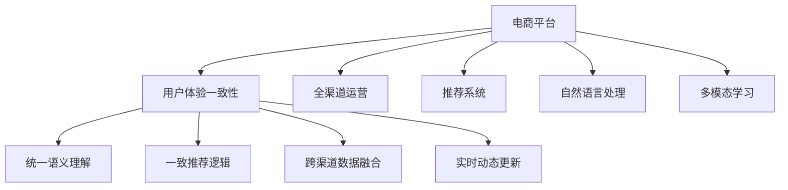

                 

# 大模型如何提升电商平台的全渠道用户体验一致性

> 关键词：电商平台、用户体验、全渠道、大模型、一致性、推荐系统、自然语言处理

## 1. 背景介绍

### 1.1 问题由来

随着互联网的发展和移动设备的普及，电商平台的多渠道运营成为了趋势。在线上购物网站、手机App、社交媒体、即时通讯平台等不同渠道上，用户的行为和需求呈现出多样化的特征。如何保证这些渠道上的用户体验一致性，是电商平台的重大挑战。

传统上，电商平台通过各自渠道独立运营，数据和算法难以统一，导致用户在不同渠道上的体验出现明显差异。例如，一个用户在移动App上浏览商品时可能看到的推荐和价格信息，与在PC网站上看到的信息可能不一致。这样的不一致性不仅影响用户体验，还会导致用户流失，降低平台整体的销售转化率。

大模型技术的兴起，为解决这一问题提供了新的可能。通过预训练和微调大模型，电商平台可以在统一的知识库和语义理解基础上，实现跨渠道的用户体验一致性。

### 1.2 问题核心关键点

电商平台实现全渠道用户体验一致性的关键在于：

1. **统一的语义理解**：不同渠道的用户输入（如搜索、评论、点击等）应该被模型以统一的方式理解和处理。

2. **一致的推荐逻辑**：无论用户通过哪种渠道与电商平台互动，都应该接收到一致的推荐内容和体验。

3. **跨渠道数据融合**：用户在不同渠道上的行为和偏好信息应该被整合，用于提升个性化推荐和用户体验。

4. **实时动态更新**：模型应该能够实时处理新的数据和事件，动态更新推荐内容，保持用户体验的一致性和新鲜感。

### 1.3 问题研究意义

实现全渠道用户体验一致性，不仅可以提升用户满意度，还能显著提升电商平台的销售转化率和用户留存率。此外，通过统一的用户画像和大规模知识库，电商平台还能为营销、广告、客户服务等领域提供更多支持，推动整体业务的发展。

大模型技术在这方面具备独特的优势，通过其在多模态数据处理和自然语言理解上的强大能力，可以更好地理解和回应用户在各个渠道上的需求。因此，大模型如何提升电商平台的全渠道用户体验一致性，成为当前研究的重要课题。

## 2. 核心概念与联系

### 2.1 核心概念概述

为了更好地理解大模型在电商平台全渠道用户体验一致性中的应用，本节将介绍几个密切相关的核心概念：

- **电商平台**：指通过互联网提供商品交易和服务的平台，包括线上和线下两种形式。
- **用户体验一致性**：指无论用户在哪个渠道上与电商平台互动，都能接收到相同或相近的用户体验和服务。
- **全渠道运营**：指电商平台在多个渠道上提供一致的用户体验和服务，以实现数据和服务的全面整合。
- **推荐系统**：基于用户行为和偏好，自动推荐商品、内容等，提升用户体验和转化率。
- **自然语言处理(NLP)**：指通过计算机处理自然语言的技术，包括语义理解、文本生成等，是实现大模型在电商平台应用的基础。
- **多模态学习**：指同时处理文本、图像、语音等多类数据，提升模型的理解能力和泛化能力。

这些概念之间的逻辑关系可以通过以下Mermaid流程图来展示：



这个流程图展示了大模型在电商平台全渠道用户体验一致性中的关键作用：

1. 电商平台通过多渠道运营，在用户输入不同渠道的数据时，需要大模型进行统一语义理解和处理。
2. 推荐系统利用大模型的理解能力，提供一致的推荐内容。
3. 自然语言处理和大模型帮助电商平台整合跨渠道的用户行为和偏好数据。
4. 多模态学习使大模型能够处理多种类型的数据，提升理解和推荐的能力。

这些概念共同构成了电商平台全渠道用户体验一致性的基础框架，使得大模型能够发挥其优势，实现用户在不同渠道上的无缝体验。

## 3. 核心算法原理 & 具体操作步骤

### 3.1 算法原理概述

基于大模型实现电商平台全渠道用户体验一致性的核心思想，是通过统一的知识库和语义理解，在不同渠道上提供一致的推荐和响应。其关键步骤包括：

1. **预训练大模型**：使用大规模无标签文本数据，训练一个强大的预训练语言模型，捕捉自然语言的通用规律和知识。
2. **微调推荐系统**：基于预训练模型，在电商平台的推荐系统中进行微调，使其能够理解用户意图，并根据用户的偏好生成个性化推荐。
3. **跨渠道数据融合**：将用户在不同渠道上的行为和偏好数据，进行整合和分析，生成统一的用户画像。
4. **动态更新模型**：利用新数据不断更新和优化模型，保持其语义理解和推荐能力的时效性和准确性。

### 3.2 算法步骤详解

**Step 1: 准备预训练模型和数据集**
- 选择适合电商场景的预训练语言模型，如BERT、GPT等。
- 准备电商平台的各类数据，包括文本、图片、评分等，用于模型训练和验证。

**Step 2: 设计推荐系统**
- 在预训练模型基础上，设计推荐系统的任务适配层，如分类器、生成器等。
- 定义推荐系统的损失函数，如交叉熵、均方误差等。

**Step 3: 微调推荐系统**
- 使用电商平台的标注数据，对推荐系统进行有监督微调。
- 设置合适的超参数，如学习率、批大小、迭代轮数等。
- 应用正则化技术，如L2正则、Dropout等，防止模型过拟合。

**Step 4: 跨渠道数据整合**
- 将用户在不同渠道上的行为数据进行归一化处理，生成统一的用户行为序列。
- 利用用户行为序列训练大模型，得到用户画像。

**Step 5: 动态更新模型**
- 实时收集新的用户行为数据，将其融入用户画像中。
- 使用新的用户画像对推荐系统进行微调，更新推荐内容。

### 3.3 算法优缺点

基于大模型的电商平台全渠道用户体验一致性方法具有以下优点：

1. **统一语义理解**：通过统一的知识库和语义理解，使得不同渠道上的用户输入被模型以一致的方式处理。
2. **一致推荐逻辑**：基于统一的用户画像，不同渠道上的推荐逻辑一致，提升了用户体验。
3. **跨渠道数据整合**：通过跨渠道数据融合，生成统一的用户画像，提高了个性化推荐的能力。
4. **实时动态更新**：通过动态更新模型，保持推荐内容的实时性和新鲜感，提升了用户体验。

同时，该方法也存在以下局限性：

1. **数据依赖性高**：模型性能高度依赖于标注数据的质量和数量，标注数据不足可能导致模型表现不佳。
2. **计算成本高**：预训练和微调大模型需要大量计算资源，初期投资较大。
3. **模型复杂性**：大模型通常参数量巨大，部署和维护复杂。
4. **可解释性不足**：大模型的决策过程较为复杂，难以提供清晰的解释。

尽管存在这些局限性，但就目前而言，基于大模型的推荐系统仍然是大模型应用的重要范式，特别是在电商领域。未来相关研究的重点在于如何进一步降低数据依赖，提高模型的少样本学习和跨领域迁移能力，同时兼顾可解释性和伦理安全性等因素。

### 3.4 算法应用领域

基于大模型的电商平台全渠道用户体验一致性方法，在多个领域得到了广泛的应用，包括但不限于：

- **商品推荐**：根据用户行为和偏好，在不同渠道上推荐相关商品。
- **个性化内容生成**：根据用户输入，在不同渠道上生成个性化的内容推荐，如文章、视频等。
- **客服智能问答**：利用大模型理解用户意图，在不同渠道上提供一致的智能客服服务。
- **广告投放**：基于用户画像，在不同渠道上投放一致的个性化广告。
- **营销分析**：通过跨渠道数据整合，生成统一的营销分析报告，指导营销策略调整。

除了上述这些经典应用外，大模型方法还在电商平台的个性化推荐、内容创作、流量分析等多个环节发挥着重要作用，推动了电商业务的数字化转型和智能化升级。

## 4. 数学模型和公式 & 详细讲解 & 举例说明

### 4.1 数学模型构建

为了更好地理解大模型在电商平台推荐系统中的应用，本节将使用数学语言对模型进行更严格的描述。

记电商平台的用户行为数据为 $\{x_i\}_{i=1}^N$，其中 $x_i$ 为序列化后的行为数据，如点击、浏览、评分等。假设模型的目标是为用户 $i$ 推荐商品 $y_i$，其预测概率为 $p(y_i|x_i;\theta)$。模型的预测结果与实际标签 $y_i$ 之间的损失函数为：

$$
\mathcal{L}(\theta) = \frac{1}{N} \sum_{i=1}^N \ell(p(y_i|x_i;\theta), y_i)
$$

其中 $\ell$ 为损失函数，如交叉熵损失函数。

### 4.2 公式推导过程

以下我们将以推荐系统的交叉熵损失函数为例，进行详细推导。

假设模型的预测结果为 $\hat{y}_i = \text{softmax}(z_i)$，其中 $z_i$ 为模型的输出。交叉熵损失函数定义为：

$$
\ell(\hat{y}_i, y_i) = -y_i \log \hat{y}_i - (1-y_i) \log (1-\hat{y}_i)
$$

将上述损失函数代入经验风险公式，得：

$$
\mathcal{L}(\theta) = -\frac{1}{N} \sum_{i=1}^N \log \hat{y}_i \delta_{i,y_i}
$$

其中 $\delta_{i,y_i}$ 为标签的one-hot编码，用于对模型输出进行掩码。

在实际应用中，为了避免计算复杂度，我们通常将模型的输出 $\hat{y}_i$ 和损失函数 $\mathcal{L}(\theta)$ 进行一些简化处理，如将交叉熵损失函数转换为对数似然损失函数：

$$
\mathcal{L}(\theta) = -\frac{1}{N} \sum_{i=1}^N y_i \log \hat{y}_i
$$

使用基于梯度的优化算法（如AdamW、SGD等）来近似求解上述最优化问题，最小化损失函数 $\mathcal{L}(\theta)$，得到模型参数 $\theta^*$。

### 4.3 案例分析与讲解

为了更好地理解大模型在电商平台推荐系统中的应用，下面以一个简单的案例进行分析。

假设某电商平台有如下用户行为数据：

| 用户 | 行为 |
|------|------|
| A    | [浏览商品A, 点击商品B, 购买商品C] |
| B    | [浏览商品B, 点击商品A, 点击商品D] |
| C    | [浏览商品C, 点击商品B, 点击商品E] |

我们可以将这些行为序列化，得到：

| 用户 | 行为序列 |
|------|----------|
| A    | [浏览A, 点击B, 购买C] |
| B    | [浏览B, 点击A, 点击D] |
| C    | [浏览C, 点击B, 点击E] |

使用预训练语言模型（如BERT）对行为序列进行编码，得到用户的向量表示 $u_A, u_B, u_C$。将这些向量表示作为输入，通过推荐系统的任务适配层，得到推荐商品的向量表示 $v_A, v_B, v_C$。计算每个用户对每个商品的交叉熵损失，得到总损失函数：

$$
\mathcal{L} = -(y_A \log \hat{y}_{A|C} + y_B \log \hat{y}_{B|A} + y_C \log \hat{y}_{C|B})
$$

其中 $y_A, y_B, y_C$ 为推荐商品的标签，$\hat{y}_{A|C}, \hat{y}_{B|A}, \hat{y}_{C|B}$ 为模型的预测概率。

使用优化算法最小化损失函数 $\mathcal{L}$，更新模型参数 $\theta$，最终得到优化后的推荐系统。

## 5. 项目实践：代码实例和详细解释说明

### 5.1 开发环境搭建

在进行推荐系统开发前，我们需要准备好开发环境。以下是使用Python进行PyTorch开发的环境配置流程：

1. 安装Anaconda：从官网下载并安装Anaconda，用于创建独立的Python环境。

2. 创建并激活虚拟环境：
```bash
conda create -n recommendation-env python=3.8 
conda activate recommendation-env
```

3. 安装PyTorch：根据CUDA版本，从官网获取对应的安装命令。例如：
```bash
conda install pytorch torchvision torchaudio cudatoolkit=11.1 -c pytorch -c conda-forge
```

4. 安装TensorFlow：
```bash
conda install tensorflow -c conda-forge
```

5. 安装相关库：
```bash
pip install numpy pandas scikit-learn torch transformers
```

完成上述步骤后，即可在`recommendation-env`环境中开始推荐系统开发。

### 5.2 源代码详细实现

下面我们以电商平台推荐系统为例，给出使用PyTorch和Transformers库对BERT模型进行推荐系统微调的PyTorch代码实现。

首先，定义推荐系统的数据处理函数：

```python
from transformers import BertTokenizer
from torch.utils.data import Dataset
import torch

class RecommendationDataset(Dataset):
    def __init__(self, behaviors, labels, tokenizer, max_len=128):
        self.behaviors = behaviors
        self.labels = labels
        self.tokenizer = tokenizer
        self.max_len = max_len
        
    def __len__(self):
        return len(self.behaviors)
    
    def __getitem__(self, item):
        behavior = self.behaviors[item]
        label = self.labels[item]
        
        encoding = self.tokenizer(behavior, return_tensors='pt', max_length=self.max_len, padding='max_length', truncation=True)
        input_ids = encoding['input_ids'][0]
        attention_mask = encoding['attention_mask'][0]
        
        # 对标签进行one-hot编码
        encoded_label = [1 if v==label else 0 for v in [0,1]]
        labels = torch.tensor(encoded_label, dtype=torch.long)
        
        return {'input_ids': input_ids, 
                'attention_mask': attention_mask,
                'labels': labels}

# 准备数据集
tokenizer = BertTokenizer.from_pretrained('bert-base-cased')
train_dataset = RecommendationDataset(train_behaviors, train_labels, tokenizer)
test_dataset = RecommendationDataset(test_behaviors, test_labels, tokenizer)
```

然后，定义模型和优化器：

```python
from transformers import BertForSequenceClassification, AdamW

model = BertForSequenceClassification.from_pretrained('bert-base-cased', num_labels=2)

optimizer = AdamW(model.parameters(), lr=2e-5)
```

接着，定义训练和评估函数：

```python
from torch.utils.data import DataLoader
from tqdm import tqdm
from sklearn.metrics import accuracy_score

device = torch.device('cuda') if torch.cuda.is_available() else torch.device('cpu')
model.to(device)

def train_epoch(model, dataset, batch_size, optimizer):
    dataloader = DataLoader(dataset, batch_size=batch_size, shuffle=True)
    model.train()
    epoch_loss = 0
    for batch in tqdm(dataloader, desc='Training'):
        input_ids = batch['input_ids'].to(device)
        attention_mask = batch['attention_mask'].to(device)
        labels = batch['labels'].to(device)
        model.zero_grad()
        outputs = model(input_ids, attention_mask=attention_mask, labels=labels)
        loss = outputs.loss
        epoch_loss += loss.item()
        loss.backward()
        optimizer.step()
    return epoch_loss / len(dataloader)

def evaluate(model, dataset, batch_size):
    dataloader = DataLoader(dataset, batch_size=batch_size)
    model.eval()
    preds, labels = [], []
    with torch.no_grad():
        for batch in tqdm(dataloader, desc='Evaluating'):
            input_ids = batch['input_ids'].to(device)
            attention_mask = batch['attention_mask'].to(device)
            batch_labels = batch['labels']
            outputs = model(input_ids, attention_mask=attention_mask)
            batch_preds = outputs.logits.argmax(dim=2).to('cpu').tolist()
            batch_labels = batch_labels.to('cpu').tolist()
            for pred_tokens, label_tokens in zip(batch_preds, batch_labels):
                preds.append(pred_tokens[:len(label_tokens)])
                labels.append(label_tokens)
                
    print(accuracy_score(labels, preds))
```

最后，启动训练流程并在测试集上评估：

```python
epochs = 5
batch_size = 16

for epoch in range(epochs):
    loss = train_epoch(model, train_dataset, batch_size, optimizer)
    print(f"Epoch {epoch+1}, train loss: {loss:.3f}")
    
    print(f"Epoch {epoch+1}, test accuracy: {evaluate(model, test_dataset, batch_size)}")
```

以上就是使用PyTorch和Transformers库对BERT进行电商平台推荐系统微调的完整代码实现。可以看到，得益于Transformers库的强大封装，我们可以用相对简洁的代码完成BERT模型的加载和微调。

### 5.3 代码解读与分析

让我们再详细解读一下关键代码的实现细节：

**RecommendationDataset类**：
- `__init__`方法：初始化行为数据、标签、分词器等关键组件。
- `__len__`方法：返回数据集的样本数量。
- `__getitem__`方法：对单个样本进行处理，将行为数据输入编码为token ids，将标签转换为one-hot编码，并对其进行定长padding，最终返回模型所需的输入。

**训练和评估函数**：
- 使用PyTorch的DataLoader对数据集进行批次化加载，供模型训练和推理使用。
- 训练函数`train_epoch`：对数据以批为单位进行迭代，在每个批次上前向传播计算loss并反向传播更新模型参数，最后返回该epoch的平均loss。
- 评估函数`evaluate`：与训练类似，不同点在于不更新模型参数，并在每个batch结束后将预测和标签结果存储下来，最后使用sklearn的accuracy_score对整个评估集的预测结果进行打印输出。

**训练流程**：
- 定义总的epoch数和batch size，开始循环迭代
- 每个epoch内，先在训练集上训练，输出平均loss
- 在测试集上评估，输出准确率
- 所有epoch结束后，完成模型训练

可以看到，PyTorch配合Transformers库使得BERT微调的代码实现变得简洁高效。开发者可以将更多精力放在数据处理、模型改进等高层逻辑上，而不必过多关注底层的实现细节。

当然，工业级的系统实现还需考虑更多因素，如模型的保存和部署、超参数的自动搜索、更灵活的任务适配层等。但核心的微调范式基本与此类似。

## 6. 实际应用场景

### 6.1 智能推荐系统

电商平台通过智能推荐系统，可以实现用户在不同渠道上的个性化商品推荐。基于大模型的推荐系统，能够自动理解用户输入，提取用户行为特征，生成统一的推荐逻辑，在不同渠道上提供一致的推荐内容。

例如，用户在移动App上浏览商品时，系统会利用大模型分析用户行为，生成统一的推荐内容。当用户在PC网站上查询相似商品时，系统会继续使用同一套推荐逻辑，提供一致的推荐结果。这样，无论用户通过哪种渠道与电商平台互动，都能接收到相同或相近的推荐内容，提升了用户体验和满意度。

### 6.2 跨渠道数据整合

电商平台可以将用户在不同渠道上的行为数据进行整合，生成统一的用户画像。例如，用户在移动App上浏览商品时留下的点击记录，可以与用户在PC网站上留下的搜索记录和评分数据进行整合，形成一个全面的用户画像。这样，大模型可以通过统一的用户画像，进行跨渠道的用户行为预测和推荐。

例如，一个用户在移动App上点击了某类商品，系统会将其历史行为数据进行整合，生成一个统一的用户画像。当用户在PC网站上查询该类商品时，系统会利用大模型进行行为预测，生成个性化的推荐内容。这样，无论用户通过哪种渠道与电商平台互动，都能接收到一致的推荐内容，提高了个性化推荐的效果。

### 6.3 动态更新推荐系统

电商平台需要实时处理新的用户行为数据，动态更新推荐系统。大模型可以通过持续学习机制，不断吸收新的数据，更新推荐内容，保持推荐的时效性和准确性。

例如，用户在移动App上浏览某类商品时，系统会利用大模型实时分析用户行为，动态更新推荐列表。当用户在PC网站上继续浏览该类商品时，系统会继续使用同一套推荐逻辑，提供最新的推荐内容。这样，无论用户通过哪种渠道与电商平台互动，都能接收到最新的推荐内容，提升了用户体验和满意度。

### 6.4 未来应用展望

随着大模型和推荐系统技术的不断发展，基于大模型的电商平台全渠道用户体验一致性方法将呈现以下几个发展趋势：

1. **多模态推荐系统**：推荐系统不仅仅处理文本数据，还可以处理图像、视频、音频等多类数据，提升推荐的全面性和准确性。例如，电商平台可以利用用户上传的商品图片，进行图像特征提取，生成个性化的推荐内容。

2. **实时动态更新**：推荐系统需要实时处理新的用户行为数据，动态更新推荐内容，保持推荐的时效性和准确性。例如，用户在移动App上浏览商品时，系统会利用大模型实时分析用户行为，动态更新推荐列表。

3. **个性化内容生成**：推荐系统可以基于用户输入，生成个性化的内容推荐，如文章、视频等。例如，电商平台可以利用大模型理解用户意图，生成个性化的内容推荐，提高用户互动的趣味性和多样性。

4. **跨渠道数据融合**：电商平台可以将用户在不同渠道上的行为数据进行整合，生成统一的用户画像，提高个性化推荐的效果。例如，用户在移动App上浏览商品时留下的点击记录，可以与用户在PC网站上留下的搜索记录和评分数据进行整合，形成一个全面的用户画像。

5. **多用户协同推荐**：推荐系统可以利用多用户之间的协同行为，生成更加准确的推荐内容。例如，电商平台可以利用多用户之间的相似行为，进行协同推荐，提高推荐的精准度。

6. **跨平台推荐**：推荐系统可以在不同的平台之间进行数据共享，提升推荐的一致性和准确性。例如，用户在PC网站上浏览商品时，系统可以利用大模型实时分析用户行为，动态更新推荐列表，同时在移动App上提供一致的推荐内容。

综上所述，基于大模型的电商平台全渠道用户体验一致性方法，通过统一的知识库和语义理解，在不同渠道上提供一致的推荐和响应，提升了用户体验和满意度，推动了电商业务的数字化转型和智能化升级。未来，随着技术的发展和应用场景的扩展，大模型将发挥更大的作用，推动电商行业进入全渠道运营的新纪元。

## 7. 工具和资源推荐

### 7.1 学习资源推荐

为了帮助开发者系统掌握大模型在电商平台全渠道用户体验一致性中的应用，这里推荐一些优质的学习资源：

1. 《深度学习理论与实践》系列博文：深入浅出地介绍了深度学习的基本原理和应用场景，适合初学者入门。

2. 《推荐系统实战》课程：由业内专家讲解的推荐系统实战课程，涵盖多种推荐算法和模型，并提供了丰富的代码实现。

3. 《自然语言处理入门与实战》书籍：介绍自然语言处理的基本概念和实践方法，包括语义理解、文本生成等，适合初学者和进阶开发者。

4. Kaggle平台：提供了大量电商推荐系统相关的比赛和数据集，开发者可以通过实战项目提升自己的技能。

5. HuggingFace官方文档：提供了丰富的大模型资源和代码实现，适合进行模型实验和应用开发。

通过对这些资源的学习实践，相信你一定能够快速掌握大模型在电商平台推荐系统中的应用，并用于解决实际的推荐问题。

### 7.2 开发工具推荐

高效的开发离不开优秀的工具支持。以下是几款用于大模型在电商平台推荐系统开发的工具：

1. PyTorch：基于Python的开源深度学习框架，灵活动态的计算图，适合快速迭代研究。

2. TensorFlow：由Google主导开发的开源深度学习框架，生产部署方便，适合大规模工程应用。

3. Transformers库：HuggingFace开发的NLP工具库，集成了众多SOTA语言模型，适合进行推荐系统开发。

4. Weights & Biases：模型训练的实验跟踪工具，可以记录和可视化模型训练过程中的各项指标，方便对比和调优。

5. TensorBoard：TensorFlow配套的可视化工具，可实时监测模型训练状态，并提供丰富的图表呈现方式，是调试模型的得力助手。

6. Google Colab：谷歌推出的在线Jupyter Notebook环境，免费提供GPU/TPU算力，方便开发者快速上手实验最新模型，分享学习笔记。

合理利用这些工具，可以显著提升大模型在电商平台推荐系统开发中的效率，加快创新迭代的步伐。

### 7.3 相关论文推荐

大语言模型和推荐系统的发展源于学界的持续研究。以下是几篇奠基性的相关论文，推荐阅读：

1. Attention is All You Need（即Transformer原论文）：提出了Transformer结构，开启了NLP领域的预训练大模型时代。

2. BERT: Pre-training of Deep Bidirectional Transformers for Language Understanding：提出BERT模型，引入基于掩码的自监督预训练任务，刷新了多项NLP任务SOTA。

3. Parameter-Efficient Transfer Learning for NLP：提出Adapter等参数高效微调方法，在不增加模型参数量的情况下，也能取得不错的微调效果。

4. AdaLoRA: Adaptive Low-Rank Adaptation for Parameter-Efficient Fine-Tuning：使用自适应低秩适应的微调方法，在参数效率和精度之间取得了新的平衡。

这些论文代表了大模型和推荐系统的发展脉络。通过学习这些前沿成果，可以帮助研究者把握学科前进方向，激发更多的创新灵感。

## 8. 总结：未来发展趋势与挑战

### 8.1 总结

本文对基于大模型实现电商平台全渠道用户体验一致性的方法进行了全面系统的介绍。首先阐述了电商平台全渠道运营背景和用户体验一致性的研究意义，明确了大模型在此中的应用价值。其次，从原理到实践，详细讲解了模型的设计、训练和评估方法，给出了推荐系统的完整代码实现。同时，本文还广泛探讨了全渠道运营中的实际应用场景，展示了大模型技术在电商平台的应用潜力。

通过本文的系统梳理，可以看到，基于大模型的推荐系统正在成为电商平台推荐的重要范式，极大地提升了用户体验和销售转化率。得益于其在多模态数据处理和自然语言理解上的强大能力，大模型在电商平台推荐系统中发挥着至关重要的作用。未来，伴随预训练语言模型和推荐系统技术的持续演进，基于大模型的推荐系统必将在更多领域得到应用，推动业务数字化转型。

### 8.2 未来发展趋势

展望未来，大模型在电商平台全渠道用户体验一致性中的应用将呈现以下几个发展趋势：

1. **多模态推荐系统**：推荐系统不仅仅处理文本数据，还可以处理图像、视频、音频等多类数据，提升推荐的全面性和准确性。例如，电商平台可以利用用户上传的商品图片，进行图像特征提取，生成个性化的推荐内容。

2. **实时动态更新**：推荐系统需要实时处理新的用户行为数据，动态更新推荐内容，保持推荐的时效性和准确性。例如，用户在移动App上浏览商品时，系统会利用大模型实时分析用户行为，动态更新推荐列表。

3. **个性化内容生成**：推荐系统可以基于用户输入，生成个性化的内容推荐，如文章、视频等。例如，电商平台可以利用大模型理解用户意图，生成个性化的内容推荐，提高用户互动的趣味性和多样性。

4. **跨渠道数据融合**：电商平台可以将用户在不同渠道上的行为数据进行整合，生成统一的用户画像。例如，用户在移动App上浏览商品时留下的点击记录，可以与用户在PC网站上留下的搜索记录和评分数据进行整合，形成一个全面的用户画像。

5. **多用户协同推荐**：推荐系统可以利用多用户之间的协同行为，生成更加准确的推荐内容。例如，电商平台可以利用多用户之间的相似行为，进行协同推荐，提高推荐的精准度。

6. **跨平台推荐**：推荐系统可以在不同的平台之间进行数据共享，提升推荐的一致性和准确性。例如，用户在PC网站上浏览商品时，系统可以利用大模型实时分析用户行为，动态更新推荐列表，同时在移动App上提供一致的推荐内容。

综上所述，基于大模型的电商平台全渠道用户体验一致性方法，通过统一的知识库和语义理解，在不同渠道上提供一致的推荐和响应，提升了用户体验和满意度，推动了电商业务的数字化转型和智能化升级。未来，随着技术的发展和应用场景的扩展，大模型将发挥更大的作用，推动电商行业进入全渠道运营的新纪元。

### 8.3 面临的挑战

尽管大模型在电商平台推荐系统中展现了巨大的潜力，但在其应用过程中仍面临以下挑战：

1. **数据依赖性高**：模型性能高度依赖于标注数据的质量和数量，标注数据不足可能导致模型表现不佳。如何进一步降低微调对标注样本的依赖，将是一大难题。

2. **计算成本高**：预训练和微调大模型需要大量计算资源，初期投资较大。

3. **模型复杂性**：大模型通常参数量巨大，部署和维护复杂。

4. **可解释性不足**：大模型的决策过程较为复杂，难以提供清晰的解释。

尽管存在这些挑战，但就目前而言，基于大模型的推荐系统仍然是大模型应用的重要范式，特别是在电商领域。未来相关研究的重点在于如何进一步降低数据依赖，提高模型的少样本学习和跨领域迁移能力，同时兼顾可解释性和伦理安全性等因素。

### 8.4 研究展望

面对大模型在电商平台推荐系统中的应用挑战，未来的研究需要在以下几个方面寻求新的突破：

1. **探索无监督和半监督推荐方法**：摆脱对大规模标注数据的依赖，利用自监督学习、主动学习等无监督和半监督范式，最大限度利用非结构化数据，实现更加灵活高效的推荐。

2. **研究参数高效和计算高效的推荐范式**：开发更加参数高效的推荐方法，在固定大部分预训练参数的同时，只更新极少量的任务相关参数。同时优化推荐系统的计算图，减少前向传播和反向传播的资源消耗，实现更加轻量级、实时性的部署。

3. **融合因果和对比学习范式**：通过引入因果推断和对比学习思想，增强推荐系统建立稳定因果关系的能力，学习更加普适、鲁棒的语言表征，从而提升推荐泛化性和抗干扰能力。

4. **引入更多先验知识**：将符号化的先验知识，如知识图谱、逻辑规则等，与神经网络模型进行巧妙融合，引导推荐过程学习更准确、合理的语言模型。同时加强不同模态数据的整合，实现视觉、语音等多模态信息与文本信息的协同建模。

5. **结合因果分析和博弈论工具**：将因果分析方法引入推荐系统，识别出推荐决策的关键特征，增强推荐输出的因果性和逻辑性。借助博弈论工具刻画用户行为，主动探索并规避推荐系统的脆弱点，提高系统稳定性。

6. **纳入伦理道德约束**：在推荐系统训练目标中引入伦理导向的评估指标，过滤和惩罚有偏见、有害的推荐输出，确保推荐内容的安全性和公正性。

这些研究方向的探索，必将引领大模型在电商平台推荐系统中的进一步发展，提升用户体验和转化率，推动电商业务向更加智能化、精准化方向演进。

## 9. 附录：常见问题与解答

**Q1：大模型在电商平台推荐系统中如何处理多模态数据？**

A: 大模型在电商平台推荐系统中处理多模态数据，通常采用以下策略：

1. **特征提取**：对不同模态的数据进行特征提取，得到统一的特征表示。例如，将图像数据转换为视觉特征向量，将文本数据转换为词向量。

2. **融合**：将不同模态的特征表示进行融合，得到统一的特征向量。例如，将视觉特征向量和文本特征向量拼接起来，进行全连接或卷积操作，得到综合特征表示。

3. **交叉验证**：在不同的模态之间进行交叉验证，验证融合后的特征表示的有效性。例如，在推荐系统中，可以设计多模态交叉验证机制，验证推荐结果的准确性和一致性。

**Q2：大模型在电商平台推荐系统中的训练和优化策略有哪些？**

A: 大模型在电商平台推荐系统中的训练和优化策略主要包括以下几点：

1. **交叉熵损失**：使用交叉熵损失函数作为推荐系统的训练目标，衡量模型预测概率与真实标签之间的差异。

2. **AdamW优化器**：使用AdamW优化器进行模型参数的更新，该优化器具有较快的收敛速度和较好的稳定性。

3. **L2正则**：在模型训练中加入L2正则项，防止模型过拟合。

4. **Dropout**：在模型训练中加入Dropout层，随机丢弃部分神经元，防止模型过度依赖某些特征。

5. **Early Stopping**：在模型训练中加入Early Stopping策略，当验证集误差不再提升时停止训练，防止过拟合。

6. **集成学习**：将多个模型的预测结果进行集成，提升推荐结果的准确性和稳定性。例如，在推荐系统中，可以设计多个不同初始化的模型，并使用集成学习的方法，提升推荐结果的准确性和多样性。

这些策略可以结合使用，以达到更好的推荐效果。

**Q3：大模型在电商平台推荐系统中的可解释性如何提升？**

A: 大模型在电商平台推荐系统中的可解释性可以通过以下方式提升：

1. **特征重要性分析**：通过特征重要性分析方法，如LIME、SHAP等，识别影响推荐结果的关键特征，提高模型的可解释性。

2. **模型可视化**：通过模型可视化工具，如TensorBoard等，可视化模型的内部结构和决策过程，帮助开发者和用户理解模型的行为。

3. **解释性模型**：在推荐系统中使用解释性模型，如决策树、线性模型等，提升推荐结果的可解释性。

4. **用户反馈机制**：在推荐系统中引入用户反馈机制，让用户对推荐结果进行打分或评价，进一步优化模型的可解释性和准确性。

这些方法可以结合使用，提升大模型在电商平台推荐系统中的可解释性，增强用户对推荐结果的信任度和满意度。

---

作者：禅与计算机程序设计艺术 / Zen and the Art of Computer Programming

