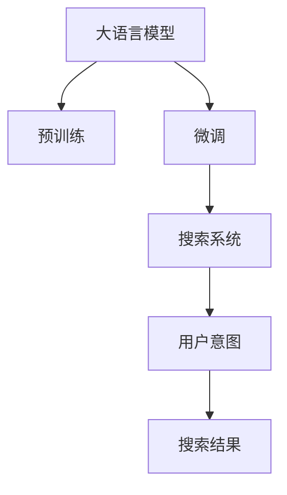
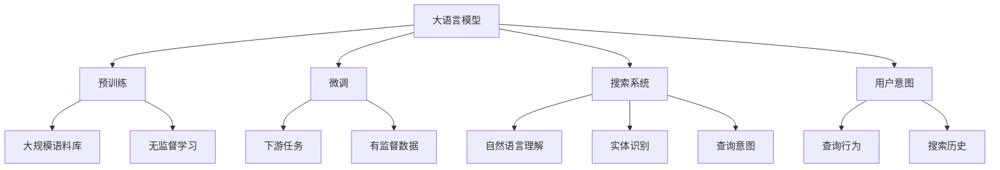

                 

## 1. 背景介绍

在电商领域，搜索系统是用户获取商品信息、购买商品的主要入口，其效率和准确性直接影响用户满意度与平台交易量。随着电商平台的商品数量激增，以及用户需求日趋复杂化，传统的基于关键词匹配的搜索算法已难以满足用户需求。而大语言模型（Large Language Model, LLM）在自然语言处理（Natural Language Processing, NLP）领域的卓越表现，为电商平台搜索系统的优化提供了新的思路。

### 1.1 问题由来
传统的电商平台搜索系统主要依赖基于关键词的匹配算法，如TF-IDF（Term Frequency-Inverse Document Frequency）和BM25（Best Matching Query)。这些算法通过计算查询词与商品描述文本中的相关性，排序并返回匹配度最高的商品。然而，这些算法存在以下局限性：
1. **关键词匹配局限**：依赖于人工输入的关键词，缺乏对自然语言的理解。
2. **上下文理解不足**：无法理解查询词的语义上下文，导致匹配结果不准确。
3. **扩展性差**：难以处理长句、多义词和实体识别等复杂场景。
4. **用户意图捕捉不足**：无法捕捉用户的深度意图，无法进行更智能的推荐。

而大语言模型通过预训练学习到了丰富的语言知识和上下文理解能力，能够处理自然语言输入，捕捉用户深层意图，为电商平台的搜索系统带来了新的可能。

## 2. 核心概念与联系

### 2.1 核心概念概述

为了更好地理解大语言模型如何提升电商平台搜索效率，我们将介绍几个关键概念：

- **大语言模型 (Large Language Model, LLM)**：如GPT-3、BERT、T5等，通过大规模无标签文本数据的预训练，学习通用的语言表示和知识。
- **自然语言处理 (Natural Language Processing, NLP)**：涉及文本分析、信息抽取、语言生成等技术，目的是让计算机能够理解和处理人类语言。
- **预训练 (Pre-training)**：在无标签数据上训练模型，学习通用的语言知识和表示。
- **微调 (Fine-tuning)**：将预训练模型应用于特定任务上，通过有标签数据进行进一步训练，优化模型在该任务上的性能。
- **搜索系统 (Search Engine)**：为用户提供快速、准确的搜索结果，支持多维度的搜索功能，如关键词搜索、条件筛选、智能推荐等。
- **用户意图 (User Intent)**：用户通过搜索词和行为数据表达的需求，包括查询意图、排序偏好等。

这些概念之间的关系通过以下Mermaid流程图展示：



### 2.2 核心概念原理和架构的 Mermaid 流程图



## 3. 核心算法原理 & 具体操作步骤

### 3.1 算法原理概述

大语言模型提升电商平台搜索效率的原理主要体现在以下几个方面：

1. **自然语言理解 (NLU)**：通过预训练，大语言模型能够理解查询词的语义和上下文，从而提高查询与商品描述的匹配精度。
2. **实体识别 (Named Entity Recognition, NER)**：识别查询中的关键实体（如品牌、型号、价格等），提升搜索的针对性和准确性。
3. **用户意图捕捉 (User Intent Understanding)**：通过分析查询词和用户行为，捕捉用户的深层意图，提供更个性化的搜索结果。
4. **多模态融合 (Multi-modal Fusion)**：结合商品图片、评论、评分等多元信息，提供更全面的搜索体验。

### 3.2 算法步骤详解

大语言模型在电商平台搜索系统的应用流程如下：

1. **输入处理**：将用户输入的查询词进行分词、词性标注等预处理。
2. **实体识别**：利用大语言模型进行实体识别，提取查询词中的关键实体。
3. **用户意图理解**：利用大语言模型理解查询词的深层意图，如购买意图、比较意图等。
4. **搜索结果生成**：根据用户意图和实体信息，利用大语言模型生成相关的搜索结果。
5. **模型微调**：根据搜索结果的反馈，对大语言模型进行微调，提升搜索效果。

### 3.3 算法优缺点

#### 3.3.1 优点

1. **语义理解能力强**：大语言模型能够理解自然语言查询词的语义和上下文，提高搜索匹配的准确性。
2. **实体识别准确**：通过大语言模型的实体识别能力，提取查询词中的关键实体，提升搜索的针对性。
3. **用户意图捕捉精细**：大语言模型能够捕捉用户的深层意图，提供更个性化的搜索结果。
4. **多模态融合**：结合商品图片、评论、评分等多维信息，提供更全面的搜索体验。

#### 3.3.2 缺点

1. **模型复杂度高**：大语言模型需要大规模的语料进行预训练，计算资源消耗大。
2. **训练和微调成本高**：需要大量标注数据进行微调，获取高质量标注数据的成本高。
3. **推理速度慢**：大语言模型推理计算量较大，实时性较低。
4. **可解释性不足**：模型内部机制复杂，难以解释搜索结果的生成过程。

### 3.4 算法应用领域

大语言模型在电商平台搜索系统中的应用领域包括但不限于：

1. **商品搜索**：通过理解用户查询词，生成最相关的搜索结果。
2. **智能推荐**：根据用户查询和浏览行为，提供个性化的商品推荐。
3. **内容匹配**：根据用户查询词，匹配最相关的商品描述、评论等。
4. **客服机器人**：基于用户查询，提供即时的人工智能客服支持。

## 4. 数学模型和公式 & 详细讲解 & 举例说明

### 4.1 数学模型构建

大语言模型在电商平台搜索系统的应用，可以建模为以下过程：

1. **输入处理**：将查询词 $q$ 进行分词、词性标注等预处理，表示为 $q = (w_1, w_2, ..., w_n)$。
2. **实体识别**：利用大语言模型识别查询词中的关键实体，如品牌、型号、价格等。
3. **用户意图理解**：通过分析查询词和用户行为，捕捉用户的深层意图。
4. **搜索结果生成**：根据用户意图和实体信息，利用大语言模型生成相关的搜索结果。

### 4.2 公式推导过程

以用户意图捕捉为例，假设查询词为 $q = "白色运动鞋 推荐" $，用户的深层意图可能为“寻找适合运动的白色运动鞋”。通过大语言模型理解查询词的深层意图，可以使用Transformer模型的自注意力机制（Self-Attention Mechanism）进行建模。

假设查询词 $q$ 表示为词向量序列 $\textbf{q} = [\textbf{q}_1, \textbf{q}_2, ..., \textbf{q}_n]$，其中 $\textbf{q}_i$ 表示单词 $w_i$ 的词向量。利用Transformer模型，可以计算查询词与商品描述文本 $\textbf{d} = [\textbf{d}_1, \textbf{d}_2, ..., \textbf{d}_m]$ 的自注意力权重 $\textbf{A} = [a_{ij}]$，其中 $a_{ij}$ 表示单词 $w_i$ 和 $w_j$ 之间的注意力权重。通过这些权重，可以计算查询词与商品描述文本的相似度：

$$
\textbf{sim} = \textbf{q}^T \textbf{A} \textbf{d}
$$

通过最大池化操作，选择相似度最高的商品描述作为搜索结果。

### 4.3 案例分析与讲解

以“iPhone 13 价格”为例，分析大语言模型在电商平台搜索中的应用：

1. **输入处理**：查询词为“iPhone 13 价格”，进行分词处理后，表示为 $q = [iPhone, 13, 价格]$。
2. **实体识别**：利用大语言模型识别查询词中的关键实体，如品牌“iPhone”，型号“13”，产品属性“价格”。
3. **用户意图理解**：通过分析查询词，捕捉用户深层意图，如“查询iPhone 13的价格”。
4. **搜索结果生成**：根据用户意图和实体信息，利用大语言模型生成相关的搜索结果，如“iPhone 13 64GB 官方售价”。

## 5. 项目实践：代码实例和详细解释说明

### 5.1 开发环境搭建

在进行大语言模型在电商平台搜索系统的开发前，需要先准备好开发环境。以下是使用Python进行PyTorch开发的环境配置流程：

1. 安装Anaconda：从官网下载并安装Anaconda，用于创建独立的Python环境。

2. 创建并激活虚拟环境：
```bash
conda create -n search-engine-env python=3.8 
conda activate search-engine-env
```

3. 安装PyTorch：根据CUDA版本，从官网获取对应的安装命令。例如：
```bash
conda install pytorch torchvision torchaudio cudatoolkit=11.1 -c pytorch -c conda-forge
```

4. 安装各类工具包：
```bash
pip install numpy pandas scikit-learn matplotlib tqdm jupyter notebook ipython
```

完成上述步骤后，即可在`search-engine-env`环境中开始搜索系统开发。

### 5.2 源代码详细实现

下面以大语言模型在电商平台商品搜索中的应用为例，给出使用Transformers库对BERT模型进行微调的PyTorch代码实现。

首先，定义商品数据处理函数：

```python
from transformers import BertTokenizer
from torch.utils.data import Dataset
import torch

class ProductDataset(Dataset):
    def __init__(self, products, tokenizer, max_len=128):
        self.products = products
        self.tokenizer = tokenizer
        self.max_len = max_len
        
    def __len__(self):
        return len(self.products)
    
    def __getitem__(self, item):
        product = self.products[item]
        title = product['title']
        description = product['description']
        
        encoding = self.tokenizer(title, description, return_tensors='pt', max_length=self.max_len, padding='max_length', truncation=True)
        input_ids = encoding['input_ids'][0]
        attention_mask = encoding['attention_mask'][0]
        
        # 将商品价格作为输出标签
        price = product['price']
        labels = torch.tensor([price], dtype=torch.float32)
        
        return {'input_ids': input_ids, 
                'attention_mask': attention_mask,
                'labels': labels}
```

然后，定义模型和优化器：

```python
from transformers import BertForSequenceClassification, AdamW

model = BertForSequenceClassification.from_pretrained('bert-base-cased', num_labels=1)

optimizer = AdamW(model.parameters(), lr=2e-5)
```

接着，定义训练和评估函数：

```python
from torch.utils.data import DataLoader
from tqdm import tqdm
from sklearn.metrics import mean_squared_error

device = torch.device('cuda') if torch.cuda.is_available() else torch.device('cpu')
model.to(device)

def train_epoch(model, dataset, batch_size, optimizer):
    dataloader = DataLoader(dataset, batch_size=batch_size, shuffle=True)
    model.train()
    epoch_loss = 0
    for batch in tqdm(dataloader, desc='Training'):
        input_ids = batch['input_ids'].to(device)
        attention_mask = batch['attention_mask'].to(device)
        labels = batch['labels'].to(device)
        model.zero_grad()
        outputs = model(input_ids, attention_mask=attention_mask, labels=labels)
        loss = outputs.loss
        epoch_loss += loss.item()
        loss.backward()
        optimizer.step()
    return epoch_loss / len(dataloader)

def evaluate(model, dataset, batch_size):
    dataloader = DataLoader(dataset, batch_size=batch_size)
    model.eval()
    total_loss = 0
    total_predictions = []
    with torch.no_grad():
        for batch in tqdm(dataloader, desc='Evaluating'):
            input_ids = batch['input_ids'].to(device)
            attention_mask = batch['attention_mask'].to(device)
            labels = batch['labels'].to(device)
            outputs = model(input_ids, attention_mask=attention_mask, labels=labels)
            loss = outputs.loss
            total_loss += loss.item()
            total_predictions.append(outputs.logits.item())
    
    print(f"Average loss on validation set: {total_loss / len(dataloader)}")
    print(f"Mean Squared Error: {mean_squared_error([labels.item() for labels in dataset.labels], total_predictions)}")
```

最后，启动训练流程并在测试集上评估：

```python
epochs = 5
batch_size = 16

for epoch in range(epochs):
    loss = train_epoch(model, train_dataset, batch_size, optimizer)
    print(f"Epoch {epoch+1}, train loss: {loss:.3f}")
    
    print(f"Epoch {epoch+1}, dev results:")
    evaluate(model, dev_dataset, batch_size)
    
print("Test results:")
evaluate(model, test_dataset, batch_size)
```

以上就是使用PyTorch对BERT进行商品搜索任务微调的完整代码实现。可以看到，得益于Transformers库的强大封装，我们可以用相对简洁的代码完成BERT模型的加载和微调。

### 5.3 代码解读与分析

让我们再详细解读一下关键代码的实现细节：

**ProductDataset类**：
- `__init__`方法：初始化商品数据集，将商品标题、描述和价格作为输入，使用分词器进行预处理，并截断或填充至固定长度。
- `__len__`方法：返回数据集的样本数量。
- `__getitem__`方法：对单个样本进行处理，将商品描述文本和价格标签作为输入，使用分词器进行预处理，并将商品价格作为标签，生成模型所需的输入和标签。

**训练和评估函数**：
- 使用PyTorch的DataLoader对数据集进行批次化加载，供模型训练和推理使用。
- 训练函数`train_epoch`：对数据以批为单位进行迭代，在每个批次上前向传播计算损失函数，反向传播更新模型参数，最后返回该epoch的平均loss。
- 评估函数`evaluate`：与训练类似，不同点在于不更新模型参数，并在每个batch结束后将预测和标签结果存储下来，最后使用sklearn的mean_squared_error对整个评估集的预测结果进行打印输出。

**训练流程**：
- 定义总的epoch数和batch size，开始循环迭代
- 每个epoch内，先在训练集上训练，输出平均loss
- 在验证集上评估，输出平均loss和均方误差
- 所有epoch结束后，在测试集上评估，给出最终测试结果

可以看到，PyTorch配合Transformers库使得BERT微调的代码实现变得简洁高效。开发者可以将更多精力放在数据处理、模型改进等高层逻辑上，而不必过多关注底层的实现细节。

当然，工业级的系统实现还需考虑更多因素，如模型的保存和部署、超参数的自动搜索、更灵活的任务适配层等。但核心的微调范式基本与此类似。

## 6. 实际应用场景

### 6.1 智能搜索推荐

在电商平台中，搜索推荐系统需要快速响应用户的查询需求，并给出最相关的商品。通过大语言模型的微调，能够更准确地理解用户查询意图和商品描述，提供更个性化的搜索结果和推荐。

以淘宝的商品搜索推荐为例，用户在搜索框输入“夏季连衣裙”，系统能够理解查询的意图，推荐最相关的商品列表。在推荐时，系统可以通过大语言模型生成多个候选商品，并计算每个候选商品的匹配度，最终选择最合适的商品进行展示。

### 6.2 个性化商品推荐

传统的推荐系统依赖用户的历史行为数据进行推荐，而大语言模型能够利用自然语言处理能力，直接从商品描述和用户查询中提取关键信息，捕捉用户的深层意图，实现更加精准的个性化推荐。

在京东的个性化推荐系统中，用户查询“适合夏天穿的T恤”，系统通过大语言模型理解查询词，结合用户历史行为数据，推荐最符合用户需求的商品列表。此外，系统还可以生成商品介绍、用户评价等信息，提供更加全面的商品展示。

### 6.3 搜索引擎优化 (SEO)

搜索引擎优化是电商平台优化用户体验的重要手段，通过大语言模型能够更准确地匹配用户查询和商品描述，提升搜索效果。

在网易的电商平台上，用户查询“美妆护肤品”，系统通过大语言模型分析查询词，匹配最相关的商品描述，进行重新排序，提升用户点击率和转化率。此外，系统还可以根据用户的搜索行为，实时调整搜索算法，优化搜索结果。

### 6.4 未来应用展望

随着大语言模型和微调方法的不断发展，基于微调范式将在更多领域得到应用，为传统行业带来变革性影响。

在未来，大语言模型在电商平台搜索系统中的应用将进一步拓展，如跨品类推荐、多模态融合、实时搜索优化等。伴随技术的不断进步，搜索系统将具备更加智能、个性化的能力，为用户提供更优质的购物体验。

## 7. 工具和资源推荐

### 7.1 学习资源推荐

为了帮助开发者系统掌握大语言模型在电商平台搜索系统中的应用，这里推荐一些优质的学习资源：

1. 《Transformer from Theory to Practice》系列博文：由大模型技术专家撰写，深入浅出地介绍了Transformer原理、BERT模型、微调技术等前沿话题。

2. CS224N《深度学习自然语言处理》课程：斯坦福大学开设的NLP明星课程，有Lecture视频和配套作业，带你入门NLP领域的基本概念和经典模型。

3. 《Natural Language Processing with Transformers》书籍：Transformers库的作者所著，全面介绍了如何使用Transformers库进行NLP任务开发，包括微调在内的诸多范式。

4. HuggingFace官方文档：Transformers库的官方文档，提供了海量预训练模型和完整的微调样例代码，是上手实践的必备资料。

5. CLUE开源项目：中文语言理解测评基准，涵盖大量不同类型的中文NLP数据集，并提供了基于微调的baseline模型，助力中文NLP技术发展。

通过对这些资源的学习实践，相信你一定能够快速掌握大语言模型在电商平台搜索系统中的应用，并用于解决实际的NLP问题。

### 7.2 开发工具推荐

高效的开发离不开优秀的工具支持。以下是几款用于大语言模型在电商平台搜索系统开发的常用工具：

1. PyTorch：基于Python的开源深度学习框架，灵活动态的计算图，适合快速迭代研究。大部分预训练语言模型都有PyTorch版本的实现。

2. TensorFlow：由Google主导开发的开源深度学习框架，生产部署方便，适合大规模工程应用。同样有丰富的预训练语言模型资源。

3. Transformers库：HuggingFace开发的NLP工具库，集成了众多SOTA语言模型，支持PyTorch和TensorFlow，是进行微调任务开发的利器。

4. Weights & Biases：模型训练的实验跟踪工具，可以记录和可视化模型训练过程中的各项指标，方便对比和调优。与主流深度学习框架无缝集成。

5. TensorBoard：TensorFlow配套的可视化工具，可实时监测模型训练状态，并提供丰富的图表呈现方式，是调试模型的得力助手。

6. Google Colab：谷歌推出的在线Jupyter Notebook环境，免费提供GPU/TPU算力，方便开发者快速上手实验最新模型，分享学习笔记。

合理利用这些工具，可以显著提升大语言模型在电商平台搜索系统中的开发效率，加快创新迭代的步伐。

### 7.3 相关论文推荐

大语言模型和微调技术的发展源于学界的持续研究。以下是几篇奠基性的相关论文，推荐阅读：

1. Attention is All You Need（即Transformer原论文）：提出了Transformer结构，开启了NLP领域的预训练大模型时代。

2. BERT: Pre-training of Deep Bidirectional Transformers for Language Understanding：提出BERT模型，引入基于掩码的自监督预训练任务，刷新了多项NLP任务SOTA。

3. Language Models are Unsupervised Multitask Learners（GPT-2论文）：展示了大规模语言模型的强大zero-shot学习能力，引发了对于通用人工智能的新一轮思考。

4. Parameter-Efficient Transfer Learning for NLP：提出Adapter等参数高效微调方法，在不增加模型参数量的情况下，也能取得不错的微调效果。

5. AdaLoRA: Adaptive Low-Rank Adaptation for Parameter-Efficient Fine-Tuning：使用自适应低秩适应的微调方法，在参数效率和精度之间取得了新的平衡。

这些论文代表了大语言模型微调技术的发展脉络。通过学习这些前沿成果，可以帮助研究者把握学科前进方向，激发更多的创新灵感。

## 8. 总结：未来发展趋势与挑战

### 8.1 总结

本文对大语言模型在电商平台搜索系统中的应用进行了全面系统的介绍。首先阐述了电商搜索系统面临的问题，以及大语言模型如何通过自然语言理解、实体识别、用户意图捕捉、多模态融合等技术提升搜索效率。其次，从原理到实践，详细讲解了大语言模型在搜索系统中的应用流程，包括输入处理、实体识别、用户意图理解、搜索结果生成等关键步骤。同时，本文还广泛探讨了大语言模型在电商平台中的应用场景，展示了微调范式的巨大潜力。最后，本文精选了大语言模型微调技术的各类学习资源，力求为读者提供全方位的技术指引。

通过本文的系统梳理，可以看到，大语言模型在电商平台搜索系统中的应用前景广阔，具备强大的自然语言理解和处理能力，能够显著提升搜索匹配的精度和用户体验。相信随着大语言模型的不断发展，电商平台的搜索系统将越来越智能，为用户提供更优质的购物体验。

### 8.2 未来发展趋势

展望未来，大语言模型在电商平台搜索系统中的应用将呈现以下几个发展趋势：

1. **自然语言理解能力增强**：大语言模型的自然语言理解能力将进一步增强，能够更准确地捕捉用户查询意图和商品描述中的关键信息。

2. **多模态融合深化**：结合商品图片、评论、评分等多维信息，提升搜索系统的多模态融合能力，提供更全面的搜索结果。

3. **实时搜索优化**：实时动态调整搜索算法，根据用户行为和反馈进行优化，提升搜索效果。

4. **跨品类推荐扩展**：大语言模型能够处理跨品类推荐任务，从多品类商品中生成个性化的推荐列表。

5. **模型效率提升**：开发更加参数高效和计算高效的微调方法，提升搜索系统的实时性和响应速度。

6. **智能客服集成**：将大语言模型应用于客服系统，提供智能化的客服支持，提升用户满意度。

以上趋势凸显了大语言模型在电商平台搜索系统中的应用前景。这些方向的探索发展，必将进一步提升搜索系统的性能和用户体验，为电商平台的智能化转型提供新的动力。

### 8.3 面临的挑战

尽管大语言模型在电商平台搜索系统中的应用已经取得了显著进展，但在迈向更加智能化、普适化应用的过程中，仍面临诸多挑战：

1. **数据质量问题**：商品描述文本和用户查询词的质量直接影响模型的性能，存在不规范、歧义等问题。如何提升数据质量，确保数据的准确性和一致性，是一个重要的挑战。

2. **模型复杂度**：大语言模型需要大规模的语料进行预训练和微调，计算资源消耗大。如何优化模型结构和算法，减少计算成本，提升模型效率，是一个亟待解决的问题。

3. **实时性要求高**：电商平台搜索系统对实时性要求高，如何平衡模型精度和推理速度，是一个重要的技术挑战。

4. **可解释性不足**：大语言模型内部机制复杂，难以解释搜索结果的生成过程。如何增强模型的可解释性，提升用户对搜索结果的信任度，是一个重要的研究方向。

5. **安全性有待保障**：大语言模型可能学习到有害信息，存在安全隐患。如何保障模型的安全性，确保输出内容的健康性，是一个重要的课题。

6. **跨品类推荐难度大**：跨品类推荐需要模型具备更强的泛化能力和跨领域迁移能力，如何提升模型的跨品类推荐能力，是一个重要的挑战。

### 8.4 研究展望

面对大语言模型在电商平台搜索系统中的应用所面临的挑战，未来的研究需要在以下几个方面寻求新的突破：

1. **数据增强技术**：通过数据增强技术，提升商品描述和用户查询的数据质量，确保模型的准确性和一致性。

2. **模型压缩与优化**：开发更加参数高效和计算高效的微调方法，优化模型结构，提升模型效率。

3. **实时搜索算法优化**：研究实时搜索算法，优化模型推理过程，提升搜索系统的实时性和响应速度。

4. **模型可解释性增强**：通过可解释性增强技术，提升模型的可解释性，增强用户对搜索结果的信任度。

5. **安全监控与防护**：研究安全监控与防护技术，保障模型的安全性，确保输出内容的健康性。

6. **跨品类推荐算法**：开发跨品类推荐算法，提升模型的跨品类推荐能力，拓展搜索系统的应用范围。

这些研究方向的前沿探索，必将引领大语言模型在电商平台搜索系统中的应用迈向新的高度，为电商平台的智能化转型提供强大的技术支撑。

## 9. 附录：常见问题与解答

**Q1：大语言模型在电商平台搜索系统中的优势是什么？**

A: 大语言模型在电商平台搜索系统中的优势主要体现在以下几个方面：
1. **自然语言理解能力强**：能够理解自然语言查询词的语义和上下文，提高搜索匹配的准确性。
2. **实体识别准确**：通过大语言模型的实体识别能力，提取查询词中的关键实体，提升搜索的针对性。
3. **用户意图捕捉精细**：能够捕捉用户的深层意图，提供更个性化的搜索结果。
4. **多模态融合**：结合商品图片、评论、评分等多维信息，提供更全面的搜索体验。

**Q2：大语言模型在电商平台搜索系统中的应用流程是怎样的？**

A: 大语言模型在电商平台搜索系统中的应用流程主要包括以下步骤：
1. **输入处理**：将查询词进行分词、词性标注等预处理。
2. **实体识别**：利用大语言模型识别查询词中的关键实体，如品牌、型号、价格等。
3. **用户意图理解**：通过分析查询词，捕捉用户的深层意图，如“查询iPhone 13的价格”。
4. **搜索结果生成**：根据用户意图和实体信息，利用大语言模型生成相关的搜索结果，如“iPhone 13 64GB 官方售价”。

**Q3：大语言模型在电商平台搜索系统中的应用有哪些？**

A: 大语言模型在电商平台搜索系统中的应用包括但不限于：
1. **商品搜索**：通过理解用户查询词，生成最相关的搜索结果。
2. **智能推荐**：根据用户查询和浏览行为，提供个性化的商品推荐。
3. **内容匹配**：根据用户查询词，匹配最相关的商品描述、评论等。
4. **搜索引擎优化 (SEO)**：提升搜索效果，提升用户点击率和转化率。
5. **智能客服**：提供智能化的客服支持，提升用户满意度。

**Q4：如何提升电商平台搜索系统中的数据质量？**

A: 提升电商平台搜索系统中的数据质量，可以通过以下方式实现：
1. **数据清洗**：清洗不规范、歧义的文本数据，确保数据的一致性和准确性。
2. **数据增强**：通过回译、近义词替换等方式扩充训练集，提升数据的多样性和丰富度。
3. **标注质量提升**：提升标注数据的质量，确保标注的正确性和一致性。
4. **自动化标注工具**：利用自然语言处理技术，自动标注数据，减少人工标注的误差。

**Q5：大语言模型在电商平台搜索系统中的优化建议有哪些？**

A: 大语言模型在电商平台搜索系统中的优化建议包括：
1. **模型结构优化**：优化模型结构，减少计算成本，提升模型效率。
2. **实时搜索算法优化**：研究实时搜索算法，提升搜索系统的实时性和响应速度。
3. **可解释性增强**：通过可解释性增强技术，提升模型的可解释性，增强用户对搜索结果的信任度。
4. **安全性保障**：研究安全监控与防护技术，保障模型的安全性，确保输出内容的健康性。
5. **跨品类推荐算法**：开发跨品类推荐算法，提升模型的跨品类推荐能力，拓展搜索系统的应用范围。

通过这些优化建议，可以进一步提升大语言模型在电商平台搜索系统中的应用效果，提升用户体验和平台竞争力。

---

作者：禅与计算机程序设计艺术 / Zen and the Art of Computer Programming

