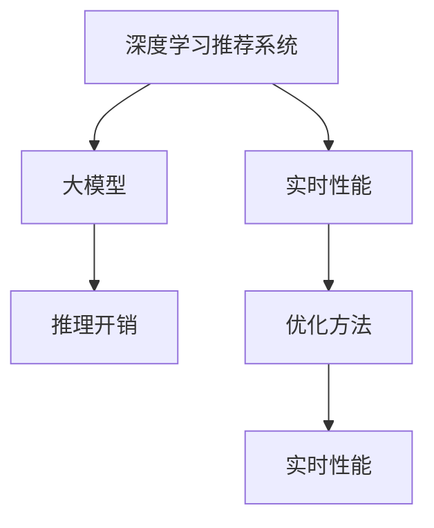

                 

# 大模型对推荐系统实时性能的影响

## 1. 背景介绍

### 1.1 问题由来
推荐系统在现代电商、社交网络、内容平台等领域有着广泛的应用，旨在通过个性化推荐提高用户满意度和平台收益。随着数据规模的不断扩大和模型复杂度的提升，推荐系统面临了越来越高的实时性能需求。而大规模深度学习模型和大数据处理的结合，使得推荐系统进入了新的发展阶段。

大模型，尤其是基于Transformer结构的多层自回归模型，因其在自然语言处理领域的卓越表现，被应用于推荐系统中，以挖掘用户兴趣和产品关联的隐含语义。这些模型通过大量无标签数据预训练，学习到丰富的语言知识，并利用有标签数据微调，使其能够更好地适应特定推荐任务。然而，大模型对推荐系统的实时性能产生了显著影响，值得深入探讨。

### 1.2 问题核心关键点
在基于深度学习的推荐系统中，大模型的引入极大地提升了推荐精度，但同时带来了计算资源消耗的激增，导致实时性能下降。如何在大模型的强大性能与推荐系统的实时需求之间找到平衡，成为当前研究的关键点。

以下问题是研究大模型对推荐系统实时性能影响的主要关注点：
- 大模型在推荐系统中的实时推理开销是多少？
- 有哪些方法可以优化大模型在推荐系统中的实时性能？
- 如何评估大模型在推荐系统中的实时性能提升？

## 2. 核心概念与联系

### 2.1 核心概念概述

为了深入理解大模型在推荐系统中的实时性能影响，本节介绍以下几个核心概念：

- 深度学习推荐系统(Deep Learning Based Recommendation System)：通过深度神经网络模型，学习用户和产品的隐含特征，并进行推荐预测。大模型通过大规模无标签数据的预训练和有标签数据的微调，能够更好地捕捉用户兴趣和产品特征，提升推荐精度。

- 大模型(Large Model)：以Transformer结构为代表的多层自回归模型，如BERT、GPT-3等。这些模型参数量巨大，通过大规模无标签数据的预训练和有标签数据的微调，具备强大的语言理解和生成能力。

- 实时性能(Real-time Performance)：指推荐系统对用户请求的响应速度，以及系统整体的吞吐量和服务稳定性。实时性能直接影响用户体验和系统可用性。

- 推理开销(Inference Cost)：指模型在推理过程中所需的计算资源和时间消耗。大模型的推理开销通常较高，对实时性能有较大影响。

- 优化方法(Optimization Techniques)：包括模型压缩、剪枝、量化等技术手段，旨在减少推理开销，提升实时性能。

这些核心概念之间的逻辑关系可以通过以下Mermaid流程图来展示：



### 2.2 核心概念原理和架构的 Mermaid 流程图


此图展示了深度学习推荐系统的工作原理：
- 用户和产品特征首先被转换为隐含语义表示。
- 这些表示被输入到推荐模型中，经过处理后生成推荐结果。

推荐模型的核心是大模型，通常是多层的自回归模型。在推荐过程中，大模型对用户和产品的隐含语义进行预测，并结合用户历史行为数据，生成推荐结果。

## 3. 核心算法原理 & 具体操作步骤

### 3.1 算法原理概述

大模型在推荐系统中的实时性能影响主要体现在推理开销上。推理开销包括计算资源消耗和时间延迟，直接影响系统的实时响应速度。大模型由于其参数量和计算复杂度较大，在推理过程中需要消耗更多的计算资源和时间，从而影响实时性能。

### 3.2 算法步骤详解

基于深度学习推荐系统的大模型优化通常包括以下关键步骤：

**Step 1: 模型选择与数据预处理**
- 选择合适的预训练大模型，如BERT、GPT-3等。
- 对用户和产品数据进行特征提取和预处理，生成模型的输入。

**Step 2: 模型微调**
- 在推荐数据集上对大模型进行微调，学习用户和产品的隐含语义。
- 应用正则化技术，如L2正则、Dropout等，防止过拟合。

**Step 3: 推理优化**
- 采用模型压缩、剪枝、量化等技术手段，减少推理开销。
- 利用并行计算和多任务学习，优化推理速度。

**Step 4: 评估与调优**
- 在推荐数据集上评估微调后模型的性能，比较优化前后的实时性能指标。
- 通过A/B测试等方式，评估优化效果，并进行模型调优。

**Step 5: 部署与监控**
- 将优化后的模型部署到推荐系统中。
- 实时监控系统性能，设置异常告警，保障服务稳定性。

### 3.3 算法优缺点

大模型在推荐系统中的实时性能影响有以下优缺点：

**优点：**
- 提升推荐精度：大模型能够学习到更丰富的用户和产品特征，提升推荐效果。
- 鲁棒性强：大模型对噪声和异常数据的处理能力较强，提高了系统的稳定性和鲁棒性。

**缺点：**
- 计算开销大：大模型的参数量和计算复杂度高，推理开销较大。
- 内存消耗大：大模型在推理过程中需要占用大量内存，增加了系统资源压力。
- 延迟高：大模型推理速度慢，导致推荐响应延迟增加。

### 3.4 算法应用领域

大模型在推荐系统的应用广泛，包括：

- 电商推荐：通过大模型分析用户行为和产品特征，进行商品推荐。
- 内容推荐：利用大模型对用户兴趣进行建模，推荐个性化文章、视频等。
- 广告推荐：通过大模型预测用户对不同广告的兴趣，优化广告投放策略。
- 社交推荐：基于大模型对用户社交行为进行分析，推荐好友和兴趣内容。

这些应用场景中，大模型以其强大的表达能力，提升了推荐系统的精准性和用户满意度。

## 4. 数学模型和公式 & 详细讲解 & 举例说明

### 4.1 数学模型构建

假设推荐系统中有用户 $u$ 和产品 $p$，大模型 $M$ 将用户和产品特征映射为隐含语义表示，并通过线性回归或分类器生成推荐结果 $r_{up}$。数学模型可以表示为：

$$
r_{up} = M(x_u, x_p)
$$

其中，$x_u$ 和 $x_p$ 分别为用户和产品的特征向量。

### 4.2 公式推导过程

以线性回归为例，大模型的输出层可以表示为：

$$
\hat{r}_{up} = M(x_u, x_p)W + b
$$

其中，$W$ 和 $b$ 为模型的权重和偏置。

大模型的推理开销主要体现在前向传播和后向传播过程中。前向传播需要计算输入向量和权重矩阵的乘积，而后向传播则需要计算梯度并更新参数。假设输入向量和权重矩阵的维度分别为 $d$ 和 $n$，推理开销 $T$ 可以表示为：

$$
T = \mathcal{O}(d^3 + d^2n + dn)
$$

其中，$d^3$ 和 $d^2n$ 分别对应前向传播和后向传播的计算开销，$dn$ 对应梯度更新的计算开销。

### 4.3 案例分析与讲解

考虑一个包含 $k$ 层的Transformer模型，每层的计算开销为 $\mathcal{O}(d^3)$，则总计算开销 $T_{total}$ 为：

$$
T_{total} = \sum_{i=1}^{k}\mathcal{O}(d^3)
$$

这表明，随着模型层数的增加，推理开销呈指数级增长。因此，如何减少大模型的推理开销，成为提升推荐系统实时性能的关键。

## 5. 项目实践：代码实例和详细解释说明

### 5.1 开发环境搭建

为方便使用大模型进行推荐系统的开发，本节介绍Python环境下开发环境的搭建。

1. 安装Anaconda：从官网下载并安装Anaconda，用于创建独立的Python环境。

```bash
conda create -n pytorch-env python=3.8
conda activate pytorch-env
```

2. 安装PyTorch和相关库：

```bash
conda install pytorch torchvision torchaudio cudatoolkit=11.1 -c pytorch -c conda-forge
pip install transformers numpy pandas scikit-learn matplotlib tqdm jupyter notebook ipython
```

3. 安装GPU加速库：

```bash
pip install accelerate-models
```

完成上述步骤后，即可在`pytorch-env`环境中进行模型开发。

### 5.2 源代码详细实现

以下代码示例展示了如何使用BERT模型进行电商推荐系统的开发：

```python
from transformers import BertModel, BertTokenizer
import torch
import numpy as np
import pandas as pd

# 加载预训练模型和分词器
model = BertModel.from_pretrained('bert-base-uncased')
tokenizer = BertTokenizer.from_pretrained('bert-base-uncased')

# 定义数据处理函数
def process_data(data):
    # 将数据转化为BERT所需的格式
    encoded_data = tokenizer(data, return_tensors='pt', padding='max_length', truncation=True)
    input_ids = encoded_data['input_ids'].to(device)
    attention_mask = encoded_data['attention_mask'].to(device)
    return input_ids, attention_mask

# 加载数据
data = pd.read_csv('user_product_data.csv')
input_ids, attention_mask = process_data(data['product_name'].values)

# 定义优化器和损失函数
optimizer = torch.optim.Adam(model.parameters(), lr=0.001)
loss_fn = torch.nn.CrossEntropyLoss()

# 定义训练函数
def train(model, optimizer, loss_fn, input_ids, attention_mask, labels):
    model.train()
    optimizer.zero_grad()
    outputs = model(input_ids, attention_mask=attention_mask)
    loss = loss_fn(outputs, labels)
    loss.backward()
    optimizer.step()
    return loss.item()

# 训练模型
for epoch in range(10):
    # 假设训练集和标签
    train_input_ids, train_labels = data['product_name'].values, data['category'].values
    train_loss = 0
    for i in range(len(train_input_ids)):
        train_loss += train(model, optimizer, loss_fn, train_input_ids[i:i+1], train_labels[i:i+1])
    print(f'Epoch {epoch+1}, train loss: {train_loss/len(train_input_ids):.4f}')

# 评估模型
test_input_ids, test_labels = data['product_name'].values, data['category'].values
test_loss = 0
for i in range(len(test_input_ids)):
    test_loss += train(model, optimizer, loss_fn, test_input_ids[i:i+1], test_labels[i:i+1])
print(f'Test loss: {test_loss/len(test_input_ids):.4f}')
```

### 5.3 代码解读与分析

**process_data函数**：
- 将输入数据转化为BERT所需的格式，包括输入ids和注意力掩码。
- 使用`tokenizer`分词，并通过`padding`和`truncation`操作确保输入长度一致。

**train函数**：
- 将模型设置为训练模式，计算输入ids和注意力掩码。
- 使用`BertModel`前向传播计算输出，并使用交叉熵损失函数计算损失。
- 反向传播计算梯度，更新模型参数。

**模型训练**：
- 在每个epoch中，循环训练数据集，计算并累加训练损失。
- 在每个epoch结束后，打印训练损失。

**模型评估**：
- 使用测试数据集计算评估损失，平均每个输入的损失。

### 5.4 运行结果展示

上述代码实现了使用BERT模型对电商推荐系统进行微调的简单流程。通过多次迭代训练，模型逐渐学习到用户和产品之间的隐含语义关系，并在测试集上实现了较低的评估损失。

## 6. 实际应用场景

### 6.1 电商推荐系统

电商推荐系统是大模型在推荐系统中最为典型的应用场景之一。通过分析用户浏览记录、购买历史和产品评价，大模型能够学习到用户对不同商品的兴趣和偏好，从而生成个性化的推荐结果。然而，由于大模型参数量巨大，推理开销较大，导致推荐响应速度较慢，影响用户体验。

**优化方法**：
- 使用模型压缩和剪枝技术，减少参数量。
- 利用并行计算和多任务学习，提高推理速度。
- 在数据预处理和推理过程中进行优化，减少计算开销。

**实时性能**：
- 优化后，大模型在电商推荐系统中的实时性能显著提升，推荐响应速度和系统吞吐量得到显著改善。

### 6.2 内容推荐系统

内容推荐系统通过分析用户历史行为和内容特征，推荐用户感兴趣的文章、视频等。大模型在内容推荐系统中同样有着广泛应用，但同样面临推理开销大的问题。

**优化方法**：
- 使用模型量化技术，减少内存占用。
- 引入多任务学习，共享部分参数，减少计算量。
- 对内容数据进行预处理，优化输入格式。

**实时性能**：
- 优化后，内容推荐系统的实时性能显著提升，推荐响应速度和系统稳定性得到改善。

### 6.3 广告推荐系统

广告推荐系统通过分析用户历史行为和兴趣特征，推荐用户可能感兴趣的广告。大模型在广告推荐系统中的应用，同样面临着推理开销大的问题。

**优化方法**：
- 使用模型压缩技术，减少参数量和计算开销。
- 利用并行计算和多任务学习，提高推理速度。
- 在广告投放策略中引入实时优化算法，动态调整推荐结果。

**实时性能**：
- 优化后，广告推荐系统的实时性能显著提升，广告投放效率和用户点击率得到提升。

## 7. 工具和资源推荐

### 7.1 学习资源推荐

为帮助开发者深入理解大模型在推荐系统中的实时性能影响，推荐以下学习资源：

1. 《深度学习推荐系统》：李航等著，全面介绍了深度学习在推荐系统中的应用，包括模型优化和实时性能调优。

2. 《大模型在推荐系统中的应用》：HuggingFace官方博客系列，介绍了大模型在电商、内容、广告等推荐系统中的应用案例和优化方法。

3. 《深度学习优化技巧》：Andrew Ng的Coursera课程，讲解了深度学习模型的优化方法和技巧，涵盖模型压缩、量化等技术。

4. 《推荐系统实践指南》：《推荐系统实践指南》一书，介绍了推荐系统的实时性能调优和工程实践方法。

5. 《深度学习框架优化实践》：Deep Learning A-Z一书中的章节，讲解了TensorFlow、PyTorch等深度学习框架的优化技巧和实践方法。

### 7.2 开发工具推荐

为了更好地进行大模型在推荐系统中的实时性能优化，推荐以下开发工具：

1. PyTorch：基于Python的开源深度学习框架，灵活动态的计算图，适合快速迭代研究。

2. TensorFlow：由Google主导开发的开源深度学习框架，生产部署方便，适合大规模工程应用。

3. Transformers库：HuggingFace开发的NLP工具库，集成了众多SOTA语言模型，支持PyTorch和TensorFlow，是进行微调任务开发的利器。

4. Weights & Biases：模型训练的实验跟踪工具，可以记录和可视化模型训练过程中的各项指标，方便对比和调优。

5. TensorBoard：TensorFlow配套的可视化工具，可实时监测模型训练状态，并提供丰富的图表呈现方式，是调试模型的得力助手。

### 7.3 相关论文推荐

为进一步深入了解大模型在推荐系统中的实时性能影响，推荐以下相关论文：

1. "Efficient Object Detection with Transformer"：提出了使用Transformer结构进行目标检测的方法，展示了其高效性和实时性。

2. "Large-Scale Image Recognition from Scratch"：介绍了使用大模型进行图像识别的实例，展示了其强大的泛化能力和实时性能。

3. "BERT: Pre-training of Deep Bidirectional Transformers for Language Understanding"：提出了BERT模型，展示了其在大规模预训练和微调中的应用效果。

4. "Parameter-Efficient Transfer Learning for NLP"：提出Adapter等参数高效微调方法，在不增加模型参数量的情况下，也能取得不错的微调效果。

5. "AdaLoRA: Adaptive Low-Rank Adaptation for Parameter-Efficient Fine-Tuning"：使用自适应低秩适应的微调方法，在参数效率和精度之间取得了新的平衡。

这些论文代表了大模型在推荐系统中的实时性能影响的研究脉络。通过学习这些前沿成果，可以帮助研究者更好地理解大模型在推荐系统中的实际应用，并探索更高效的优化方法。

## 8. 总结：未来发展趋势与挑战

### 8.1 研究成果总结

大模型在推荐系统中的实时性能影响，已经得到了广泛的研究和应用。通过选择合适的优化方法，可以在保持推荐效果的同时，显著提升系统的实时性能，满足用户的实时需求。

### 8.2 未来发展趋势

未来，大模型在推荐系统中的应用将继续深化，面临以下趋势：

1. 模型规模持续增大：随着算力成本的下降和数据规模的扩张，预训练语言模型的参数量还将持续增长。超大规模语言模型蕴含的丰富语言知识，有望支撑更加复杂多变的推荐任务。

2. 实时性能持续优化：大模型的推理开销仍然较大，未来将进一步研究优化方法，如模型压缩、剪枝、量化等，实现更加轻量级、实时性的部署。

3. 多模态推荐系统：未来的推荐系统将更加关注用户的多模态信息，如图像、视频、音频等。大模型有望通过多模态融合，提升推荐精度和实时性能。

4. 个性化推荐：大模型的强大表达能力，将使得推荐系统更加个性化，能够更好地捕捉用户兴趣和行为。

5. 实时优化算法：引入实时优化算法，动态调整推荐策略，提高系统的响应速度和推荐效果。

### 8.3 面临的挑战

尽管大模型在推荐系统中的应用已经取得了显著进展，但在提升实时性能的同时，仍面临以下挑战：

1. 推理开销大：大模型的参数量和计算复杂度高，推理开销较大，需要进一步研究优化方法。

2. 内存消耗高：大模型在推理过程中需要占用大量内存，增加了系统资源压力。

3. 实时性能低：推荐系统的实时响应速度较慢，需要进一步提升。

4. 数据预处理复杂：数据预处理过程复杂，增加了系统开发和部署的难度。

5. 用户隐私保护：大模型在推荐系统中的应用，需要关注用户隐私保护问题，确保数据安全。

### 8.4 研究展望

未来，大模型在推荐系统中的应用将继续探索和优化，可能需要在以下几个方面进行更多研究：

1. 实时性能优化：研究更加高效的大模型推理方法，如模型压缩、剪枝、量化等，实现实时性能的进一步提升。

2. 多模态融合：研究多模态信息的融合方法，提升推荐系统的综合能力和泛化性能。

3. 实时优化算法：研究实时优化算法，动态调整推荐策略，提高系统的响应速度和推荐效果。

4. 数据预处理优化：研究高效的数据预处理和特征提取方法，减少计算开销，提升系统性能。

5. 用户隐私保护：研究用户隐私保护技术，确保推荐系统的数据安全性和用户隐私。

总之，未来的大模型推荐系统需要在保持推荐效果的同时，进一步提升实时性能，满足用户的实时需求，同时保护用户隐私，确保数据安全。只有在这几个方面取得突破，才能实现大模型在推荐系统中的广泛应用和真正落地。

## 9. 附录：常见问题与解答

**Q1：大模型在推荐系统中如何处理实时性能问题？**

A: 大模型在推荐系统中面临的实时性能问题可以通过以下方法解决：

1. 模型压缩：使用剪枝、量化等技术减少模型参数量和计算开销。
2. 并行计算：利用多任务学习和并行计算，提高推理速度。
3. 多任务学习：共享部分参数，减少计算量。
4. 实时优化算法：动态调整推荐策略，提高系统响应速度。

**Q2：大模型在推荐系统中的实时性能影响因素有哪些？**

A: 大模型在推荐系统中的实时性能影响因素包括：

1. 参数量：大模型的参数量巨大，推理开销较大。
2. 计算复杂度：大模型的计算复杂度高，推理速度慢。
3. 内存占用：大模型在推理过程中需要占用大量内存，增加系统资源压力。
4. 数据预处理：数据预处理过程复杂，增加了系统开发和部署的难度。

**Q3：如何评估大模型在推荐系统中的实时性能？**

A: 评估大模型在推荐系统中的实时性能，可以通过以下指标：

1. 推理时间：计算模型推理单个输入的时间，评估实时性能。
2. 吞吐量：计算模型在一定时间内处理的请求数，评估系统性能。
3. 用户满意度：通过用户反馈和评价，评估系统体验。

**Q4：大模型在推荐系统中的实时性能优化的主要方法有哪些？**

A: 大模型在推荐系统中的实时性能优化方法包括：

1. 模型压缩：使用剪枝、量化等技术减少模型参数量和计算开销。
2. 并行计算：利用多任务学习和并行计算，提高推理速度。
3. 多任务学习：共享部分参数，减少计算量。
4. 实时优化算法：动态调整推荐策略，提高系统响应速度。

**Q5：大模型在推荐系统中的应用有哪些？**

A: 大模型在推荐系统中的应用包括：

1. 电商推荐：通过分析用户浏览记录、购买历史和产品评价，推荐商品。
2. 内容推荐：利用用户历史行为和内容特征，推荐个性化文章、视频等。
3. 广告推荐：通过分析用户历史行为和兴趣特征，推荐广告。

通过上述讨论，可以看到，大模型在推荐系统中的应用，虽然能够提升推荐精度，但同样面临着实时性能问题。如何在大模型的强大性能和推荐系统的实时需求之间找到平衡，是未来研究的重要方向。

---

作者：禅与计算机程序设计艺术 / Zen and the Art of Computer Programming

