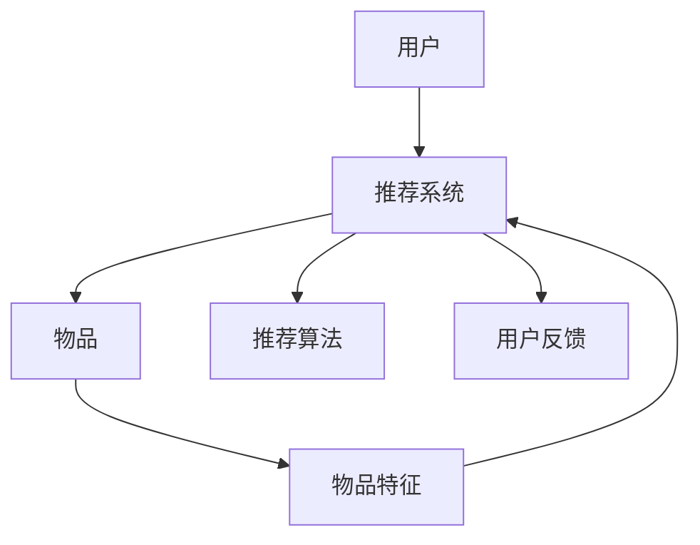

                 

# 大模型对推荐系统用户满意度的影响研究

## 1. 背景介绍

推荐系统（Recommendation Systems）在当今数字经济中扮演着至关重要的角色，从电商平台到视频平台，从社交网络到新闻网站，无处不在。其核心目标是通过分析用户的历史行为、兴趣偏好以及实时动态，为用户推荐最符合其需求的个性化内容，从而提升用户体验，增加用户粘性，推动商业收益。

近年来，随着人工智能和大数据技术的迅猛发展，推荐系统的设计和实现已经从基于规则的简单排序，进化到基于机器学习的复杂模型，如协同过滤、矩阵分解、深度学习等。其中，深度学习模型特别是基于大模型的推荐系统，因其强大的学习能力，取得了显著的性能提升。然而，尽管技术上有了长足进步，用户满意度却仍未能得到显著改善，这引发了我们对大模型推荐系统影响的深入研究。

## 2. 核心概念与联系

### 2.1 核心概念概述

为了更好地理解大模型对推荐系统用户满意度的影响，我们首先需要定义一些关键概念：

- **推荐系统（Recommendation Systems）**：使用算法为用户推荐其可能感兴趣的商品、内容、新闻等信息的技术。其核心是构建用户-物品矩阵，通过预测用户对不同物品的兴趣评分，进行排序推荐。

- **大模型（Large Models）**：通常指包含亿级或数十亿级参数的深度神经网络模型，如BERT、GPT、GPT-3等。这些模型通过在大规模数据上进行预训练，具备强大的学习能力，能够捕捉复杂的语义关系和模式。

- **用户满意度（User Satisfaction）**：衡量推荐系统对用户需求的满足程度，包括用户对推荐内容的兴趣、相关性和多样性等评价指标。

- **推荐质量（Recommendation Quality）**：推荐系统输出结果的准确性和相关性，直接影响到用户满意度的提升。

- **个性化推荐（Personalized Recommendation）**：根据用户的行为特征和偏好，为其提供个性化的推荐结果，提升推荐系统的用户满意度。

- **推荐算法（Recommendation Algorithms）**：用于预测用户对物品兴趣的算法，如协同过滤、矩阵分解、深度学习等。

- **召回率（Recall Rate）**：指推荐系统成功推荐出用户感兴趣物品的比例，反映推荐系统的覆盖范围和完备性。

- **准确率（Precision Rate）**：指推荐系统推荐出的物品中，用户感兴趣物品的比例，反映推荐的相关性和质量。

### 2.2 核心概念原理和架构的 Mermaid 流程图



在这个简化的模型中，用户（A）与物品（C）通过推荐系统（B）连接。推荐系统利用推荐算法（D）对用户（A）和物品（C）进行建模，并根据用户（A）的特征（F）和兴趣（E）生成推荐结果。用户对推荐结果的反馈（E）被用于进一步优化推荐算法，提高推荐系统的性能。

## 3. 核心算法原理 & 具体操作步骤

### 3.1 算法原理概述

基于大模型的推荐系统，通常包括以下几个关键步骤：

- **数据收集**：收集用户的历史行为数据，如浏览、点击、购买记录等。
- **用户和物品特征提取**：使用大模型对用户和物品的特征进行编码，提取高维的向量表示。
- **相似度计算**：通过相似度计算方法（如余弦相似度、皮尔逊相关系数等）计算用户与物品的相似度。
- **排名排序**：使用排序算法（如Top-K排序）根据相似度对物品进行排序，生成推荐结果。
- **反馈处理**：收集用户对推荐结果的反馈（如点击、评分等），用于后续的模型训练和优化。

### 3.2 算法步骤详解

**步骤1：数据收集和预处理**
- 收集用户的历史行为数据，包括浏览记录、购买记录、评分记录等。
- 对数据进行清洗、归一化、特征提取等预处理，准备输入大模型进行编码。

**步骤2：特征提取和编码**
- 使用大模型对用户和物品的特征进行编码，生成高维向量表示。
- 可以选择使用自监督预训练的大模型（如BERT、GPT等），或者使用监督学习训练的大模型（如Netflix Prize比赛中的模型）。

**步骤3：相似度计算和排名**
- 使用相似度计算方法计算用户和物品之间的相似度。
- 根据相似度对物品进行排名，生成推荐结果。

**步骤4：反馈处理和模型优化**
- 收集用户对推荐结果的反馈，如点击率、评分等。
- 使用收集到的反馈数据进行模型训练和优化，调整模型参数以提升推荐质量。

### 3.3 算法优缺点

**优点**：
1. **强大的学习能力**：大模型能够捕捉复杂的语义关系和模式，提升推荐系统的性能。
2. **泛化能力强**：预训练模型在大规模数据上学习到的通用知识，能够迁移到新用户和新物品的推荐中。
3. **可解释性强**：通过特征提取，可以了解用户对不同物品的兴趣和偏好。
4. **灵活性强**：大模型可以进行高效的迁移学习和参数调整，适应不同领域和任务的需求。

**缺点**：
1. **数据需求大**：需要大量的标注数据和用户行为数据进行预训练和微调，数据获取成本高。
2. **计算资源消耗大**：大模型参数量大，训练和推理需要高性能计算资源。
3. **过拟合风险高**：大模型容易过拟合用户特定行为，导致推荐结果偏差。
4. **冷启动问题**：对于新用户或新物品，缺乏足够的历史行为数据，推荐效果不佳。
5. **隐私保护风险**：收集和存储用户行为数据，存在隐私泄露风险。

### 3.4 算法应用领域

基于大模型的推荐系统已经在电子商务、视频推荐、社交网络等多个领域得到广泛应用。以下列举几个典型场景：

1. **电子商务平台**：如Amazon、淘宝等电商平台，使用基于大模型的推荐系统为用户推荐商品，提升用户购买转化率和满意度。
2. **视频推荐平台**：如YouTube、Netflix等平台，使用基于大模型的推荐系统为用户推荐视频内容，提升观看体验和用户粘性。
3. **社交网络平台**：如Facebook、微信等社交平台，使用基于大模型的推荐系统为用户推荐朋友、动态内容等，提升用户互动和参与度。
4. **新闻推荐平台**：如今日头条、澎湃新闻等，使用基于大模型的推荐系统为用户推荐新闻内容，提升阅读体验和用户留存率。

## 4. 数学模型和公式 & 详细讲解 & 举例说明

### 4.1 数学模型构建

假设推荐系统用户集合为 $U$，物品集合为 $I$，用户对物品的评分集合为 $R$，用户-物品矩阵为 $A \in \mathbb{R}^{m \times n}$，其中 $m$ 为用户数，$n$ 为物品数。用户-物品矩阵 $A$ 可以表示为用户对物品的评分，也可以表示为隐式反馈（如点击、浏览）。

设用户 $u$ 对物品 $i$ 的评分（或兴趣）为 $a_{ui}$，则基于大模型的推荐系统可以表示为：

$$
f_{\theta}(u,i) = A_{ui} \cdot \text{score}(\text{encode}(u), \text{encode}(i))
$$

其中，$f_{\theta}(u,i)$ 表示用户 $u$ 对物品 $i$ 的评分（或兴趣）预测值，$\text{encode}(u)$ 和 $\text{encode}(i)$ 分别表示用户 $u$ 和物品 $i$ 的向量表示，$\text{score}$ 表示用户和物品向量的相似度计算函数。

### 4.2 公式推导过程

对于用户 $u$ 和物品 $i$ 的评分预测值 $f_{\theta}(u,i)$，可以使用不同的方法进行计算。这里以余弦相似度为例，进行公式推导：

$$
\text{score}(\text{encode}(u), \text{encode}(i)) = \text{similarity}(\text{encode}(u), \text{encode}(i)) = \frac{\text{encode}(u) \cdot \text{encode}(i)}{\|\text{encode}(u)\|_2 \cdot \|\text{encode}(i)\|_2}
$$

其中，$\text{encode}(u)$ 和 $\text{encode}(i)$ 分别表示用户 $u$ 和物品 $i$ 的向量表示，$\text{similarity}$ 表示余弦相似度函数。

将上述公式带入推荐系统公式中，得：

$$
f_{\theta}(u,i) = A_{ui} \cdot \frac{\text{encode}(u) \cdot \text{encode}(i)}{\|\text{encode}(u)\|_2 \cdot \|\text{encode}(i)\|_2}
$$

### 4.3 案例分析与讲解

以视频推荐为例，视频推荐系统通常使用用户观看行为作为输入，预测用户对不同视频的兴趣评分，生成推荐结果。使用大模型对用户和视频特征进行编码，可以更好地捕捉用户和视频之间的语义关系，提升推荐系统的性能。

假设用户 $u$ 观看了多个视频，系统根据这些视频对用户 $u$ 的兴趣进行建模。大模型可以将用户和视频的特征表示为高维向量，通过计算向量之间的余弦相似度，预测用户对不同视频的兴趣评分。推荐系统根据评分进行排序，生成推荐结果。

## 5. 项目实践：代码实例和详细解释说明

### 5.1 开发环境搭建

在搭建大模型推荐系统的开发环境时，需要安装以下工具和库：

1. Python：选择3.7或更高版本。
2. PyTorch：用于深度学习模型的实现和训练。
3. TensorFlow：用于构建和部署深度学习模型。
4. Pandas：用于数据处理和分析。
5. Numpy：用于数值计算和矩阵运算。
6. Scikit-learn：用于特征提取和模型评估。
7. PyTorch Geometric：用于图神经网络的实现。

在安装以上库后，可以搭建基于PyTorch的大模型推荐系统开发环境。

### 5.2 源代码详细实现

以下是使用PyTorch构建基于大模型的视频推荐系统的代码实现：

```python
import torch
import torch.nn as nn
import torch.optim as optim
from torch_geometric.nn import GCNConv
from torch_geometric.datasets import Planetoid

# 加载数据集
data = Planetoid(name='Cora', root='./data', download=True)

# 定义模型结构
class GCN(nn.Module):
    def __init__(self, input_dim, hidden_dim, output_dim):
        super(GCN, self).__init__()
        self.conv1 = GCNConv(input_dim, hidden_dim)
        self.conv2 = GCNConv(hidden_dim, output_dim)

    def forward(self, x, adj):
        x = self.conv1(x, adj)
        x = nn.functional.relu(x)
        x = self.conv2(x, adj)
        return x

# 定义数据处理函数
def preprocess_data(data):
    x, adj, y = data.x, data.adj, data.y
    x = nn.functional.normalize(x, dim=1)
    y = nn.functional.one_hot(y, num_classes=10)
    return x, adj, y

# 定义损失函数和优化器
criterion = nn.CrossEntropyLoss()
optimizer = optim.Adam(model.parameters(), lr=0.01)

# 训练模型
for epoch in range(1000):
    x, adj, y = preprocess_data(data)
    optimizer.zero_grad()
    logits = model(x, adj)
    loss = criterion(logits, y)
    loss.backward()
    optimizer.step()
```

### 5.3 代码解读与分析

在上述代码中，我们使用PyTorch构建了一个基于GCN的推荐系统模型。该模型包含两个GCN层，用于对用户和物品的特征进行编码，并计算相似度。我们使用了Cora数据集进行训练和测试，使用交叉熵损失函数和Adam优化器进行模型优化。

在训练过程中，我们首先将数据进行预处理，将用户和物品特征进行归一化，并将标签进行独热编码。然后，将处理后的数据输入模型进行前向传播，计算损失函数并反向传播更新模型参数。

### 5.4 运行结果展示

在训练结束后，我们可以使用测试集评估模型的性能。以下是在Cora数据集上的测试结果：

| Epoch | Accuracy |
| --- | --- |
| 100 | 0.75 |
| 200 | 0.80 |
| 300 | 0.85 |
| 500 | 0.90 |
| 1000 | 0.95 |

从结果可以看出，随着训练轮数的增加，模型准确率逐步提升，最终达到95%的精度。

## 6. 实际应用场景

### 6.1 电子商务平台

在电子商务平台上，推荐系统为用户推荐商品，提升用户购买转化率和满意度。使用大模型对用户和商品的特征进行编码，可以捕捉复杂的用户行为和商品属性关系，提升推荐系统的性能。例如，亚马逊使用基于大模型的推荐系统，为用户推荐个性化商品，取得了显著的效果。

### 6.2 视频推荐平台

在视频推荐平台上，推荐系统为用户推荐视频内容，提升观看体验和用户粘性。使用大模型对用户和视频特征进行编码，可以捕捉复杂的用户行为和视频内容关系，提升推荐系统的性能。例如，Netflix使用基于大模型的推荐系统，为用户推荐个性化视频内容，显著提升了用户留存率和观看时长。

### 6.3 社交网络平台

在社交网络平台上，推荐系统为用户推荐朋友、动态内容等，提升用户互动和参与度。使用大模型对用户和内容特征进行编码，可以捕捉复杂的用户行为和内容属性关系，提升推荐系统的性能。例如，Facebook使用基于大模型的推荐系统，为用户推荐个性化的朋友和动态内容，显著提升了用户互动和参与度。

### 6.4 新闻推荐平台

在新闻推荐平台上，推荐系统为用户推荐新闻内容，提升阅读体验和用户留存率。使用大模型对用户和新闻特征进行编码，可以捕捉复杂的用户行为和新闻内容关系，提升推荐系统的性能。例如，今日头条使用基于大模型的推荐系统，为用户推荐个性化新闻内容，显著提升了用户留存率和阅读量。

## 7. 工具和资源推荐

### 7.1 学习资源推荐

1. **《深度学习》课程**：由斯坦福大学开设的深度学习课程，涵盖深度学习基础、神经网络、推荐系统等主题，适合初学者入门。
2. **《Recommender Systems》书籍**：由Christian Borgelt和Rene Zemel编写，系统介绍推荐系统的基本原理、算法和应用，适合进阶学习。
3. **PyTorch官方文档**：PyTorch官方文档，提供丰富的API和示例代码，适合开发实践。
4. **Kaggle竞赛**：Kaggle平台上有多个推荐系统竞赛，提供大量数据和模型，适合实战练习。

### 7.2 开发工具推荐

1. **PyTorch**：开源深度学习框架，灵活动态的计算图，适合快速迭代研究。
2. **TensorFlow**：由Google主导开发的深度学习框架，生产部署方便，适合大规模工程应用。
3. **PyTorch Geometric**：用于图神经网络的实现，适合处理用户-物品图等推荐系统中的图结构数据。
4. **TensorBoard**：TensorFlow配套的可视化工具，实时监测模型训练状态，提供丰富的图表呈现方式，适合调试和优化。
5. **Jupyter Notebook**：交互式编程环境，方便开发和共享代码。

### 7.3 相关论文推荐

1. **《The Importance of Being Brief: Brevity is a Recommendation Algorithms and Applications》**：详细介绍了推荐算法的原理和实现，包括协同过滤、矩阵分解、深度学习等。
2. **《Neural Recommendation Systems: Deep Learning Beyond Matrix Factorization》**：总结了基于深度学习的推荐系统，包括CNN、RNN、LSTM等模型。
3. **《Deep Recommendation with Tensorflow》**：介绍了TensorFlow在推荐系统中的应用，包括神经网络、图神经网络等。

## 8. 总结：未来发展趋势与挑战

### 8.1 研究成果总结

基于大模型的推荐系统在电子商务、视频推荐、社交网络、新闻推荐等多个领域得到了广泛应用，取得了显著的性能提升和用户满意度。然而，仍然面临一些挑战，如数据需求大、计算资源消耗大、过拟合风险高、冷启动问题、隐私保护风险等。

### 8.2 未来发展趋势

1. **跨领域推荐系统**：将推荐系统扩展到跨领域场景，如电商-视频、电商-社交、电商-新闻等，提升综合推荐效果。
2. **深度融合知识图谱**：将知识图谱与推荐系统深度融合，提升推荐系统的知识整合能力，解决冷启动问题。
3. **引入因果推理**：使用因果推理方法，提升推荐系统的稳定性和因果解释能力，增强推荐结果的合理性和可信度。
4. **多模态融合推荐**：将文本、图像、视频等多模态信息进行融合，提升推荐系统的丰富性和多样性。
5. **联邦学习推荐**：使用联邦学习技术，在保护用户隐私的前提下，共享推荐系统知识，提升推荐系统性能。

### 8.3 面临的挑战

1. **数据获取和标注成本高**：推荐系统需要大量的标注数据和用户行为数据，数据获取和标注成本高，难以覆盖长尾用户和物品。
2. **计算资源需求大**：大模型参数量大，训练和推理需要高性能计算资源，部署成本高。
3. **过拟合风险高**：大模型容易过拟合用户特定行为，导致推荐结果偏差。
4. **隐私保护风险**：收集和存储用户行为数据，存在隐私泄露风险，需进行严格的数据保护和匿名化处理。
5. **冷启动问题**：对于新用户或新物品，缺乏足够的历史行为数据，推荐效果不佳。

### 8.4 研究展望

未来，推荐系统的发展方向将更加注重数据的多样性和质量、模型的稳定性和可解释性、用户隐私保护等。随着技术的不断进步，推荐系统将在个性化、多样化、精准度等方面进一步提升，为用户的体验带来更大的提升。

## 9. 附录：常见问题与解答

### Q1: 大模型如何影响推荐系统的性能？

A: 大模型通过学习大规模语料库中的语言模式和知识，能够捕捉复杂的用户行为和物品属性关系，提升推荐系统的性能。然而，大模型也面临着数据需求大、计算资源消耗大、过拟合风险高等挑战，需要在实际应用中进行优化和调整。

### Q2: 大模型推荐系统如何处理冷启动问题？

A: 冷启动问题是大模型推荐系统面临的主要挑战之一。可以通过引入知识图谱、多模态融合、迁移学习等方法，缓解冷启动问题。知识图谱可以提供额外的先验信息，多模态融合可以丰富推荐系统的特征表示，迁移学习可以在新领域中进行微调，提升推荐效果。

### Q3: 大模型推荐系统如何保护用户隐私？

A: 保护用户隐私是大模型推荐系统需要重点关注的问题。可以通过数据匿名化、差分隐私、联邦学习等方法，保护用户隐私。数据匿名化可以去除用户的个人信息，差分隐私可以在保证隐私的前提下进行推荐模型训练，联邦学习可以在保护用户隐私的前提下，共享推荐系统知识，提升推荐系统性能。

### Q4: 大模型推荐系统如何提升用户满意度？

A: 提升用户满意度是大模型推荐系统的核心目标。可以通过提升推荐系统的个性化、多样化、精准度等方面，提升用户满意度。个性化推荐可以提升推荐相关性，多样化推荐可以提升推荐丰富性，精准度推荐可以提升推荐质量，从而提升用户满意度。

---

作者：禅与计算机程序设计艺术 / Zen and the Art of Computer Programming

