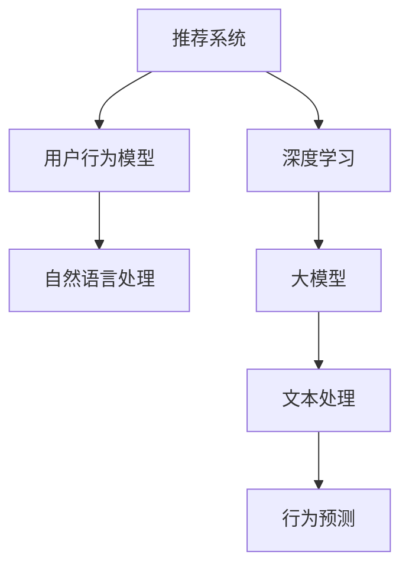

                 

# 大模型对推荐系统用户行为理解的深化

## 1. 背景介绍

### 1.1 问题由来

随着互联网技术的飞速发展，推荐系统已经成为用户获取信息、发现商品和服务的重要手段。然而，当前的推荐算法往往局限于对用户历史行为数据的学习和挖掘，忽略了用户深层行为模式和心理特征的探索。这使得推荐系统难以充分理解用户真实需求，导致推荐结果与用户预期不符，降低了用户体验和系统的转化率。

### 1.2 问题核心关键点

推荐系统之所以无法深入理解用户行为，主要原因在于：
1. 数据稀疏性：用户行为数据通常稀疏且难以获取，导致推荐算法在用户行为表示和特征提取上存在局限。
2. 行为模式复杂性：用户行为不仅受个人兴趣影响，还受到情境、情绪、社交等多方面因素的干扰，难以用单一模型进行刻画。
3. 用户心理特征难建模：用户行为背后的心理动机、偏好倾向等主观因素难以用客观数据进行建模和预测。
4. 跨场景适应性不足：现有的推荐算法往往在不同场景下表现不稳定，难以实现跨场景的泛化与适应。

因此，如何构建更加深刻、全面、灵活的推荐模型，理解用户的深层行为模式和心理特征，是推荐系统研究的重要课题。

## 2. 核心概念与联系

### 2.1 核心概念概述

为更好地理解推荐系统如何通过大模型深化对用户行为的理解，本节将介绍几个关键概念：

- 推荐系统(Recommendation System)：通过算法推荐给用户最相关、最有价值的商品或服务，提升用户体验和平台收益的系统。
- 用户行为模型(User Behavior Model)：描述用户与商品互动行为的模型，如点击、购买、评分等行为，用于推断用户偏好和预测行为。
- 深度学习(Deep Learning)：基于多层神经网络，通过大量数据训练，自动学习特征表示和模式识别，适用于处理高维、复杂数据。
- 自然语言处理(Natural Language Processing, NLP)：让机器理解、处理、生成自然语言的技术，可以应用于用户评论、描述等文本数据的处理。
- 大模型(Large Model)：以自回归模型(GPT)或自编码模型(BERT)为代表的大规模预训练模型，具备强大的语言理解能力和知识表示能力。

这些核心概念之间的逻辑关系可以通过以下Mermaid流程图来展示：



这个流程图展示了大模型在推荐系统中的应用场景：

1. 推荐系统使用深度学习模型对用户行为进行建模，推断用户偏好。
2. 用户行为模型需要自然语言处理技术，处理用户评论、描述等文本数据，提取有用特征。
3. 深度学习模型通常使用大模型进行预训练，学习通用的语言表示。
4. 大模型具备文本处理能力，可以用于文本数据的特征提取和行为预测。

## 3. 核心算法原理 & 具体操作步骤
### 3.1 算法原理概述

基于大模型的推荐系统，旨在通过预训练模型学习用户行为的多层次、多角度特征，提升对用户行为的理解和预测能力。具体而言，该方法的核心思想如下：

1. 使用大模型对用户评论、描述等文本数据进行预训练，学习用户行为的语义特征。
2. 构建多模态特征表示，将文本数据与其他行为数据(如点击、购买、评分等)进行融合，形成更全面的用户行为描述。
3. 应用注意力机制和交互模型，捕捉用户与商品之间的动态关系，理解用户行为模式。
4. 引入协同过滤、集成学习等方法，提升推荐系统的泛化能力和鲁棒性。

通过这些步骤，大模型推荐系统能够更深刻地理解用户行为，提供更个性化、高精度的推荐结果。

### 3.2 算法步骤详解

基于大模型的推荐系统构建一般包括以下几个关键步骤：

**Step 1: 准备数据集**

- 收集用户的评论、描述、评分、点击等行为数据，构建推荐系统的训练数据集。
- 清洗和预处理数据，处理缺失值、异常值，保证数据的质量和一致性。

**Step 2: 预训练语言模型**

- 使用大模型对用户行为文本数据进行预训练，学习用户的语义特征。
- 预训练模型通常为自回归或自编码模型，如BERT、GPT等，可以使用开源预训练模型，也可以通过迁移学习技术对其微调。

**Step 3: 特征提取**

- 将预训练模型作为特征提取器，将文本数据转化为向量表示。
- 同时，将用户行为数据转化为数字向量，如点击序列、评分矩阵等。

**Step 4: 融合多模态特征**

- 将文本特征与行为特征进行拼接、组合或加权，形成多模态用户行为描述。
- 多模态特征可以采用多种融合方式，如特征堆叠、融合网络等。

**Step 5: 行为建模与预测**

- 基于多模态特征，构建行为建模模块，如深度神经网络、注意力模型等。
- 模型训练时，使用交叉熵、均方误差等损失函数，最小化预测误差。

**Step 6: 集成与优化**

- 应用协同过滤、集成学习等技术，提升模型的泛化能力和鲁棒性。
- 引入正则化、对抗训练等技术，防止模型过拟合。

**Step 7: 评估与部署**

- 在验证集和测试集上评估模型性能，使用指标如准确率、召回率、F1-score等。
- 将训练好的模型部署到生产环境中，实现实时推荐服务。

以上是基于大模型的推荐系统构建的一般流程。在实际应用中，还需要根据具体任务的特点，对各个环节进行优化和调整，以达到最佳效果。

### 3.3 算法优缺点

基于大模型的推荐系统具有以下优点：
1. 语言理解能力强：大模型具备强大的语义理解能力，能够深入分析用户评论、描述等文本数据，提取有用特征。
2. 多模态特征表示：结合文本数据和行为数据，形成更全面、准确的用户行为描述，提升推荐准确性。
3. 模型泛化能力强：多模态特征和注意力机制能够捕捉用户行为的多层次、多角度关系，增强模型的泛化能力。
4. 可解释性强：大模型通常有明确的层次结构和逻辑关系，可解释性较强，方便理解和调试推荐模型。

但该方法也存在一些缺点：
1. 计算成本高：大模型训练和推理资源消耗较大，需要高性能计算资源。
2. 数据依赖性强：对标注数据和高质量文本数据的依赖性较强，数据获取难度较大。
3. 模型复杂度高：大模型参数量大，模型结构复杂，训练和调试难度较大。

## 4. 数学模型和公式 & 详细讲解 & 举例说明
### 4.1 数学模型构建

本节将使用数学语言对基于大模型的推荐系统构建过程进行更加严格的刻画。

假设用户行为数据集为 $D=\{(x_i, y_i)\}_{i=1}^N$，其中 $x_i$ 为行为序列，$y_i$ 为行为结果(如购买、点击等)。用户行为文本数据集为 $D_t=\{(x_{ti}, y_{ti})\}_{i=1}^M$，其中 $x_{ti}$ 为文本内容，$y_{ti}$ 为文本标签(如情感极性、主题等)。

定义预训练语言模型为 $M_{\theta}:\mathcal{X} \rightarrow \mathcal{Y}$，其中 $\mathcal{X}$ 为输入空间，$\mathcal{Y}$ 为输出空间，$\theta \in \mathbb{R}^d$ 为模型参数。定义行为建模模型为 $F_{\phi}:\mathcal{X} \rightarrow \mathcal{Y}$，其中 $\mathcal{X}$ 为输入空间，$\mathcal{Y}$ 为输出空间，$\phi \in \mathbb{R}^{d'}$ 为行为建模模型参数。

定义行为预测损失函数为 $\ell(F_{\phi}(x_i), y_i)$，在数据集 $D$ 上的经验风险为：

$$
\mathcal{L}(\phi) = \frac{1}{N} \sum_{i=1}^N \ell(F_{\phi}(x_i), y_i)
$$

其中 $\ell$ 为行为预测损失函数，如均方误差、交叉熵等。

在训练过程中，行为建模模型 $F_{\phi}$ 与语言模型 $M_{\theta}$ 联合优化，最小化损失函数：

$$
\mathcal{L}(\phi, \theta) = \mathcal{L}(F_{\phi}, M_{\theta}) + \lambda \mathcal{L}(M_{\theta})
$$

其中 $\mathcal{L}(F_{\phi})$ 为行为预测损失，$\mathcal{L}(M_{\theta})$ 为语言模型损失，$\lambda$ 为行为预测和语言模型损失的平衡因子。

### 4.2 公式推导过程

以下我们以基于大模型的推荐系统为例，推导其中的数学公式。

假设用户行为序列为 $x_i=[x_{i1}, x_{i2}, \cdots, x_{in}]$，表示用户在 $n$ 个时刻的行为，如点击、购买、评分等。使用大模型对用户行为序列进行预训练，学习其语义表示 $H_i = M_{\theta}(x_i)$，其中 $H_i \in \mathbb{R}^d$。

定义行为预测模型 $F_{\phi}$ 为多层感知器(MLP)，其输入为 $H_i$，输出为预测结果 $y_i \in [0, 1]$，表示用户是否进行了某项行为。假设 $F_{\phi}$ 包括 $L$ 个全连接层，每层包含 $d'$ 个神经元，则：

$$
H_i \rightarrow M_1 \rightarrow M_2 \rightarrow \cdots \rightarrow M_L \rightarrow y_i
$$

其中 $M_i$ 为全连接层，权重矩阵为 $W_i \in \mathbb{R}^{d' \times d'}$，偏置向量为 $b_i \in \mathbb{R}^{d'}$。

行为预测模型的损失函数为均方误差：

$$
\ell(F_{\phi}(x_i), y_i) = \frac{1}{2}(y_i - F_{\phi}(x_i))^2
$$

将其代入经验风险公式，得：

$$
\mathcal{L}(\phi) = \frac{1}{N} \sum_{i=1}^N \ell(F_{\phi}(x_i), y_i) = \frac{1}{N} \sum_{i=1}^N \frac{1}{2}(y_i - F_{\phi}(H_i))^2
$$

将 $F_{\phi}$ 的权重矩阵 $W_i$ 和偏置向量 $b_i$ 作为待优化参数，使用梯度下降算法进行模型训练。梯度下降算法的更新公式为：

$$
\begin{aligned}
W_i & \leftarrow W_i - \eta \nabla_{W_i}\mathcal{L}(\phi, \theta) \\
b_i & \leftarrow b_i - \eta \nabla_{b_i}\mathcal{L}(\phi, \theta)
\end{aligned}
$$

其中 $\eta$ 为学习率。

在计算梯度时，需要将行为预测模型 $F_{\phi}$ 与预训练语言模型 $M_{\theta}$ 的参数共享，从而共同优化。语言模型的损失函数为：

$$
\mathcal{L}(M_{\theta}) = -\frac{1}{N} \sum_{i=1}^N \log P(H_i \mid x_i)
$$

其中 $P(H_i \mid x_i)$ 为 $M_{\theta}$ 在输入 $x_i$ 上的条件概率分布。

### 4.3 案例分析与讲解

**案例：电商推荐系统**

电商推荐系统通常需要根据用户的浏览、点击、购买等行为，推荐用户可能感兴趣的商品。用户行为数据包括用户的点击序列、评分记录等。通过用户行为文本数据，如产品描述、用户评论，提取用户的语义特征，提升推荐准确性。

具体实现步骤如下：
1. 收集用户的行为数据和文本数据，构建训练数据集。
2. 使用大模型对文本数据进行预训练，学习用户的语义特征。
3. 将预训练模型作为行为建模模型的输入，构建多模态特征表示。
4. 应用深度神经网络进行行为建模和预测，最小化预测误差。
5. 引入协同过滤、集成学习等技术，提升模型的泛化能力和鲁棒性。
6. 在验证集和测试集上评估模型性能，部署到生产环境中。

## 5. 项目实践：代码实例和详细解释说明
### 5.1 开发环境搭建

在进行推荐系统开发前，我们需要准备好开发环境。以下是使用Python进行PyTorch开发的环境配置流程：

1. 安装Anaconda：从官网下载并安装Anaconda，用于创建独立的Python环境。

2. 创建并激活虚拟环境：
```bash
conda create -n pytorch-env python=3.8 
conda activate pytorch-env
```

3. 安装PyTorch：根据CUDA版本，从官网获取对应的安装命令。例如：
```bash
conda install pytorch torchvision torchaudio cudatoolkit=11.1 -c pytorch -c conda-forge
```

4. 安装Transformers库：
```bash
pip install transformers
```

5. 安装各类工具包：
```bash
pip install numpy pandas scikit-learn matplotlib tqdm jupyter notebook ipython
```

完成上述步骤后，即可在`pytorch-env`环境中开始推荐系统开发。

### 5.2 源代码详细实现

下面我们以电商推荐系统为例，给出使用Transformers库对预训练BERT模型进行推荐系统构建的PyTorch代码实现。

首先，定义推荐系统数据处理函数：

```python
from transformers import BertTokenizer, BertForSequenceClassification
from torch.utils.data import Dataset
import torch

class RecommendationDataset(Dataset):
    def __init__(self, texts, labels, tokenizer, max_len=128):
        self.texts = texts
        self.labels = labels
        self.tokenizer = tokenizer
        self.max_len = max_len
        
    def __len__(self):
        return len(self.texts)
    
    def __getitem__(self, item):
        text = self.texts[item]
        label = self.labels[item]
        
        encoding = self.tokenizer(text, return_tensors='pt', max_length=self.max_len, padding='max_length', truncation=True)
        input_ids = encoding['input_ids'][0]
        attention_mask = encoding['attention_mask'][0]
        
        # 将标签编码
        encoded_label = [1 if label == 'buy' else 0]
        encoded_label.extend([0] * (self.max_len - len(encoded_label)))
        labels = torch.tensor(encoded_label, dtype=torch.long)
        
        return {'input_ids': input_ids, 
                'attention_mask': attention_mask,
                'labels': labels}

# 标签与id的映射
label2id = {'buy': 1, 'notbuy': 0}
id2label = {v: k for k, v in label2id.items()}

# 创建dataset
tokenizer = BertTokenizer.from_pretrained('bert-base-cased')

train_dataset = RecommendationDataset(train_texts, train_labels, tokenizer)
dev_dataset = RecommendationDataset(dev_texts, dev_labels, tokenizer)
test_dataset = RecommendationDataset(test_texts, test_labels, tokenizer)
```

然后，定义模型和优化器：

```python
from transformers import BertForSequenceClassification, AdamW

model = BertForSequenceClassification.from_pretrained('bert-base-cased', num_labels=len(label2id))

optimizer = AdamW(model.parameters(), lr=2e-5)
```

接着，定义训练和评估函数：

```python
from torch.utils.data import DataLoader
from tqdm import tqdm
from sklearn.metrics import classification_report

device = torch.device('cuda') if torch.cuda.is_available() else torch.device('cpu')
model.to(device)

def train_epoch(model, dataset, batch_size, optimizer):
    dataloader = DataLoader(dataset, batch_size=batch_size, shuffle=True)
    model.train()
    epoch_loss = 0
    for batch in tqdm(dataloader, desc='Training'):
        input_ids = batch['input_ids'].to(device)
        attention_mask = batch['attention_mask'].to(device)
        labels = batch['labels'].to(device)
        model.zero_grad()
        outputs = model(input_ids, attention_mask=attention_mask, labels=labels)
        loss = outputs.loss
        epoch_loss += loss.item()
        loss.backward()
        optimizer.step()
    return epoch_loss / len(dataloader)

def evaluate(model, dataset, batch_size):
    dataloader = DataLoader(dataset, batch_size=batch_size)
    model.eval()
    preds, labels = [], []
    with torch.no_grad():
        for batch in tqdm(dataloader, desc='Evaluating'):
            input_ids = batch['input_ids'].to(device)
            attention_mask = batch['attention_mask'].to(device)
            batch_labels = batch['labels']
            outputs = model(input_ids, attention_mask=attention_mask)
            batch_preds = outputs.logits.argmax(dim=2).to('cpu').tolist()
            batch_labels = batch_labels.to('cpu').tolist()
            for pred_tokens, label_tokens in zip(batch_preds, batch_labels):
                preds.append(pred_tokens[:len(label_tokens)])
                labels.append(label_tokens)
                
    print(classification_report(labels, preds))
```

最后，启动训练流程并在测试集上评估：

```python
epochs = 5
batch_size = 16

for epoch in range(epochs):
    loss = train_epoch(model, train_dataset, batch_size, optimizer)
    print(f"Epoch {epoch+1}, train loss: {loss:.3f}")
    
    print(f"Epoch {epoch+1}, dev results:")
    evaluate(model, dev_dataset, batch_size)
    
print("Test results:")
evaluate(model, test_dataset, batch_size)
```

以上就是使用PyTorch对BERT进行电商推荐系统构建的完整代码实现。可以看到，得益于Transformers库的强大封装，我们可以用相对简洁的代码完成BERT模型的加载和推荐系统构建。

### 5.3 代码解读与分析

让我们再详细解读一下关键代码的实现细节：

**RecommendationDataset类**：
- `__init__`方法：初始化文本、标签、分词器等关键组件。
- `__len__`方法：返回数据集的样本数量。
- `__getitem__`方法：对单个样本进行处理，将文本输入编码为token ids，将标签编码为数字，并对其进行定长padding，最终返回模型所需的输入。

**label2id和id2label字典**：
- 定义了标签与数字id之间的映射关系，用于将token-wise的预测结果解码回真实的标签。

**训练和评估函数**：
- 使用PyTorch的DataLoader对数据集进行批次化加载，供模型训练和推理使用。
- 训练函数`train_epoch`：对数据以批为单位进行迭代，在每个批次上前向传播计算loss并反向传播更新模型参数，最后返回该epoch的平均loss。
- 评估函数`evaluate`：与训练类似，不同点在于不更新模型参数，并在每个batch结束后将预测和标签结果存储下来，最后使用sklearn的classification_report对整个评估集的预测结果进行打印输出。

**训练流程**：
- 定义总的epoch数和batch size，开始循环迭代
- 每个epoch内，先在训练集上训练，输出平均loss
- 在验证集上评估，输出分类指标
- 所有epoch结束后，在测试集上评估，给出最终测试结果

可以看到，PyTorch配合Transformers库使得BERT电商推荐系统的代码实现变得简洁高效。开发者可以将更多精力放在数据处理、模型改进等高层逻辑上，而不必过多关注底层的实现细节。

当然，工业级的系统实现还需考虑更多因素，如模型的保存和部署、超参数的自动搜索、更灵活的任务适配层等。但核心的微调范式基本与此类似。

## 6. 实际应用场景
### 6.1 智能客服系统

基于大模型的推荐系统，可以广泛应用于智能客服系统的构建。传统客服往往需要配备大量人力，高峰期响应缓慢，且一致性和专业性难以保证。而使用推荐系统推荐答案，可以大幅提升客服系统的自动化和智能化水平。

在技术实现上，可以收集企业内部的历史客服对话记录，将问题和最佳答复构建成监督数据，在此基础上对预训练推荐模型进行微调。微调后的推荐模型能够自动推荐最合适的答案模板，实现高效自动化客服。

### 6.2 金融舆情监测

金融机构需要实时监测市场舆论动向，以便及时应对负面信息传播，规避金融风险。传统的人工监测方式成本高、效率低，难以应对网络时代海量信息爆发的挑战。基于大模型的推荐系统，可以实时推荐市场分析报告，预警潜在风险。

具体而言，可以收集金融领域相关的新闻、报道、评论等文本数据，并对其进行主题标注和情感标注。在此基础上对预训练推荐模型进行微调，使其能够自动推荐与最新舆情相关的市场分析报告，帮助金融机构快速应对潜在风险。

### 6.3 个性化推荐系统

当前的推荐系统往往只依赖用户的历史行为数据进行物品推荐，难以深入理解用户的真实兴趣偏好。基于大模型的推荐系统，可以更好地挖掘用户行为背后的语义信息，从而提供更个性化、高精度的推荐内容。

在实践中，可以收集用户浏览、点击、评论、分享等行为数据，提取和用户交互的物品标题、描述、标签等文本内容。将文本内容作为模型输入，用户的后续行为（如是否点击、购买等）作为监督信号，在此基础上微调预训练语言模型。微调后的模型能够从文本内容中准确把握用户的兴趣点。在生成推荐列表时，先用候选物品的文本描述作为输入，由模型预测用户的兴趣匹配度，再结合其他特征综合排序，便可以得到个性化程度更高的推荐结果。

### 6.4 未来应用展望

随着大模型和推荐系统的不断发展，基于大模型的推荐系统将在更多领域得到应用，为传统行业带来变革性影响。

在智慧医疗领域，基于大模型的推荐系统可以帮助医生进行病例推荐、药物推荐等，提升诊疗效率和治疗效果。

在智能教育领域，推荐系统可应用于作业批改、学情分析、知识推荐等方面，因材施教，促进教育公平，提高教学质量。

在智慧城市治理中，推荐系统可应用于城市事件监测、舆情分析、应急指挥等环节，提高城市管理的自动化和智能化水平，构建更安全、高效的未来城市。

此外，在企业生产、社会治理、文娱传媒等众多领域，基于大模型的推荐系统也将不断涌现，为经济社会发展注入新的动力。相信随着技术的日益成熟，推荐系统必将在更广阔的应用领域大放异彩，深刻影响人类的生产生活方式。

## 7. 工具和资源推荐
### 7.1 学习资源推荐

为了帮助开发者系统掌握大模型推荐系统的理论基础和实践技巧，这里推荐一些优质的学习资源：

1. 《推荐系统设计与实战》系列博文：由推荐系统专家撰写，深入浅出地介绍了推荐系统的基本概念、算法设计、工程实现等内容。

2. 《深度学习与推荐系统》课程：斯坦福大学开设的推荐系统经典课程，涵盖了推荐系统的主要理论和算法，适合深度学习初学者和推荐系统从业者。

3. 《Deep Learning for Recommendations》书籍：由推荐系统领域知名学者撰写，全面介绍了推荐系统的主要算法和技术，是学习推荐系统的经典教材。

4. Kaggle推荐系统竞赛：参与实际推荐系统竞赛，积累实战经验，提升系统设计和调优能力。

5. RecSys会议论文：RecSys会议是推荐系统领域最重要的学术会议，每年都会发布最新的研究成果和前沿技术，是学习推荐系统的权威资源。

通过对这些资源的学习实践，相信你一定能够快速掌握大模型推荐系统的精髓，并用于解决实际的推荐问题。
###  7.2 开发工具推荐

高效的开发离不开优秀的工具支持。以下是几款用于大模型推荐系统开发的常用工具：

1. PyTorch：基于Python的开源深度学习框架，灵活动态的计算图，适合快速迭代研究。大部分预训练语言模型都有PyTorch版本的实现。

2. TensorFlow：由Google主导开发的开源深度学习框架，生产部署方便，适合大规模工程应用。同样有丰富的预训练语言模型资源。

3. Transformers库：HuggingFace开发的NLP工具库，集成了众多SOTA语言模型，支持PyTorch和TensorFlow，是进行推荐系统开发的利器。

4. Weights & Biases：模型训练的实验跟踪工具，可以记录和可视化模型训练过程中的各项指标，方便对比和调优。与主流深度学习框架无缝集成。

5. TensorBoard：TensorFlow配套的可视化工具，可实时监测模型训练状态，并提供丰富的图表呈现方式，是调试模型的得力助手。

6. Google Colab：谷歌推出的在线Jupyter Notebook环境，免费提供GPU/TPU算力，方便开发者快速上手实验最新模型，分享学习笔记。

合理利用这些工具，可以显著提升大模型推荐系统的开发效率，加快创新迭代的步伐。

### 7.3 相关论文推荐

大模型和推荐系统的发展源于学界的持续研究。以下是几篇奠基性的相关论文，推荐阅读：

1. Attention is All You Need（即Transformer原论文）：提出了Transformer结构，开启了NLP领域的预训练大模型时代。

2. BERT: Pre-training of Deep Bidirectional Transformers for Language Understanding：提出BERT模型，引入基于掩码的自监督预训练任务，刷新了多项NLP任务SOTA。

3. Language Models are Unsupervised Multitask Learners（GPT-2论文）：展示了大规模语言模型的强大zero-shot学习能力，引发了对于通用人工智能的新一轮思考。

4. Multi-Task Learning of NLP Tasks with Contextualized Embeddings：提出BERT多任务学习框架，提升推荐系统的泛化能力和效果。

5. Contextualized Word Representations：通过Transformer模型，将上下文信息融入到词嵌入表示中，提升推荐系统的性能。

这些论文代表了大模型和推荐系统的研究进展。通过学习这些前沿成果，可以帮助研究者把握学科前进方向，激发更多的创新灵感。

## 8. 总结：未来发展趋势与挑战

### 8.1 总结

本文对基于大模型的推荐系统进行了全面系统的介绍。首先阐述了大模型推荐系统的问题由来和核心关键点，明确了推荐系统如何通过大模型深化对用户行为的理解。其次，从原理到实践，详细讲解了推荐系统的数学模型和算法步骤，给出了推荐系统开发的完整代码实例。同时，本文还广泛探讨了大模型推荐系统在智能客服、金融舆情、个性化推荐等多个行业领域的应用前景，展示了推荐系统技术的广泛应用。

通过本文的系统梳理，可以看到，基于大模型的推荐系统正成为推荐系统研究的重要方向，极大地拓展了推荐系统的应用边界，提高了推荐系统的精度和效率。未来，伴随大模型和推荐系统的持续演进，推荐系统必将在更多领域得到应用，为人类社会的智能化转型提供新的助力。

### 8.2 未来发展趋势

展望未来，大模型推荐系统将呈现以下几个发展趋势：

1. 模型规模持续增大。随着算力成本的下降和数据规模的扩张，预训练语言模型的参数量还将持续增长。超大规模语言模型蕴含的丰富语言知识，有望支撑更加复杂多变的推荐场景。

2. 推荐技术融合多模态。结合文本、图像、音频等多模态数据，构建更全面、准确的用户行为表示，提升推荐系统的泛化能力和效果。

3. 推荐系统个性化深入。利用大模型学习用户的语义特征和行为模式，提升个性化推荐的效果。同时引入生成对抗网络(GAN)等技术，生成更具多样性的推荐内容。

4. 推荐系统跨领域泛化。通过迁移学习、多任务学习等技术，使推荐系统具备跨领域泛化能力，适应不同领域的推荐需求。

5. 推荐系统实时性提升。引入在线学习、增量学习等技术，使推荐系统具备实时推荐能力，满足用户即时需求。

6. 推荐系统可解释性增强。引入因果分析、规则推理等技术，提升推荐系统的可解释性，帮助用户理解推荐结果背后的逻辑和依据。

以上趋势凸显了大模型推荐系统的前景广阔。这些方向的探索发展，必将进一步提升推荐系统的性能和应用范围，为人类认知智能的进化带来深远影响。

### 8.3 面临的挑战

尽管大模型推荐系统已经取得了瞩目成就，但在迈向更加智能化、普适化应用的过程中，它仍面临着诸多挑战：

1. 数据获取困难。高质量标注数据的获取和处理成本较高，难以构建大规模的推荐数据集。如何降低数据获取成本，是推荐系统面临的重要挑战。

2. 数据分布不均衡。推荐数据集的分布往往不均衡，不同领域和场景的推荐任务需求不同，导致推荐系统在实际应用中效果不理想。如何提高推荐系统的泛化能力，适应不同领域的需求，是推荐系统研究的重点。

3. 计算资源消耗高。大模型推荐系统对计算资源的需求较高，如何优化模型结构，减少资源消耗，提高系统效率，是推荐系统研究的难点。

4. 模型鲁棒性不足。推荐系统面对新数据和新场景时，泛化性能往往不稳定，推荐结果的鲁棒性不足。如何提高推荐系统的鲁棒性，防止模型过拟合，是推荐系统研究的重要课题。

5. 模型可解释性不足。大模型推荐系统的决策过程难以解释，难以理解推荐结果背后的逻辑和依据。如何提升推荐系统的可解释性，增强用户信任，是推荐系统研究的方向。

6. 模型偏见和公平性问题。大模型推荐系统可能会学习到有偏见的数据，导致推荐结果不公平。如何识别和消除模型偏见，提升推荐系统的公平性，是推荐系统研究的重要方向。

这些挑战凸显了大模型推荐系统研究的复杂性和多样性，需要综合应用数据挖掘、机器学习、运筹学等多个领域的知识，才能更好地应对。相信随着技术的不断进步，这些挑战终将一一被克服，大模型推荐系统必将在更广阔的应用领域大放异彩。

### 8.4 未来突破

面对大模型推荐系统所面临的种种挑战，未来的研究需要在以下几个方面寻求新的突破：

1. 探索无监督和半监督推荐方法。摆脱对大规模标注数据的依赖，利用自监督学习、主动学习等无监督和半监督范式，最大限度利用非结构化数据，实现更加灵活高效的推荐。

2. 研究参数高效和计算高效的推荐算法。开发更加参数高效的推荐算法，在固定大部分预训练参数的同时，只更新极少量的推荐参数。同时优化推荐算法的计算图，减少前向传播和反向传播的资源消耗，实现更加轻量级、实时性的部署。

3. 引入因果推断和对比学习范式。通过引入因果推断和对比学习思想，增强推荐系统建立稳定因果关系的能力，学习更加普适、鲁棒的用户行为表示。

4. 引入更多先验知识。将符号化的先验知识，如知识图谱、逻辑规则等，与推荐系统模型进行巧妙融合，引导推荐过程学习更准确、合理的用户行为表示。

5. 结合因果分析和博弈论工具。将因果分析方法引入推荐系统，识别出推荐结果的关键特征，增强推荐系统的因果性和逻辑性。借助博弈论工具刻画用户与推荐系统之间的交互过程，主动探索并规避推荐系统的脆弱点，提高系统稳定性。

6. 纳入伦理道德约束。在推荐系统的设计目标中引入伦理导向的评估指标，过滤和惩罚有偏见、有害的推荐结果，确保推荐系统的公平性和安全性。

这些研究方向的探索，必将引领大模型推荐系统迈向更高的台阶，为构建安全、可靠、可解释、可控的智能推荐系统铺平道路。面向未来，大模型推荐系统还需要与其他人工智能技术进行更深入的融合，如知识表示、因果推理、强化学习等，多路径协同发力，共同推动推荐系统技术的发展。只有勇于创新、敢于突破，才能不断拓展推荐系统的边界，让智能技术更好地造福人类社会。

## 9. 附录：常见问题与解答

**Q1：大模型推荐系统是否适用于所有推荐场景？**

A: 大模型推荐系统在大多数推荐场景中都能取得不错的效果，特别是对于数据量较小的任务。但对于一些特定领域的任务，如医学、法律等，仅依靠通用语料预训练的模型可能难以很好地适应。此时需要在特定领域语料上进一步预训练，再进行推荐系统构建。

**Q2：推荐系统如何优化参数高效性？**

A: 推荐系统优化参数高效性主要通过以下几种方法：
1. 参数剪枝：去除不重要的参数，减少模型复杂度。
2. 低秩分解：对模型参数进行低秩分解，减少参数数量。
3. 特征选择：选取对推荐效果有贡献的特征，减少模型规模。
4. 数据增强：通过数据增强技术，扩充训练集，减少参数需求。

**Q3：推荐系统如何进行实时推荐？**

A: 推荐系统实现实时推荐主要通过以下几种方法：
1. 在线学习：在实时数据上不断更新模型参数，保证模型持续学习。
2. 增量学习：在每次用户行为后，更新模型参数，保证模型实时更新。
3. 缓存机制：将部分已知的推荐结果缓存，实时检索并返回。

**Q4：推荐系统如何增强推荐结果的可解释性？**

A: 推荐系统增强推荐结果的可解释性主要通过以下几种方法：
1. 因果分析：分析推荐结果的因果关系，解释推荐逻辑。
2. 规则推理：引入规则推理系统，解释推荐依据。
3. 用户反馈：收集用户反馈，优化推荐结果，增强可解释性。

**Q5：推荐系统如何应对数据分布不均衡问题？**

A: 推荐系统应对数据分布不均衡问题主要通过以下几种方法：
1. 重采样：对数据集进行重采样，平衡不同类别的数据量。
2. 数据增强：通过数据增强技术，扩充少数类别的数据。
3. 多任务学习：将多个推荐任务联合训练，提升模型泛化能力。

**Q6：推荐系统如何识别和消除模型偏见？**

A: 推荐系统识别和消除模型偏见主要通过以下几种方法：
1. 偏见检测：检测模型中的偏见，识别出有偏见的数据。
2. 公平性约束：在模型设计中引入公平性约束，防止推荐结果不公平。
3. 数据清洗：清洗有偏见的数据，防止模型学习到有害信息。

**Q7：推荐系统如何提高推荐结果的鲁棒性？**

A: 推荐系统提高推荐结果的鲁棒性主要通过以下几种方法：
1. 对抗训练：引入对抗样本，增强模型鲁棒性。
2. 模型集成：使用多个模型进行联合推荐，提升鲁棒性。
3. 数据增强：通过数据增强技术，扩充训练集，增强模型的泛化能力。

这些技术手段的结合使用，可以显著提升推荐系统的性能和鲁棒性，更好地应对实际应用中的各种挑战。

---

作者：禅与计算机程序设计艺术 / Zen and the Art of Computer Programming

