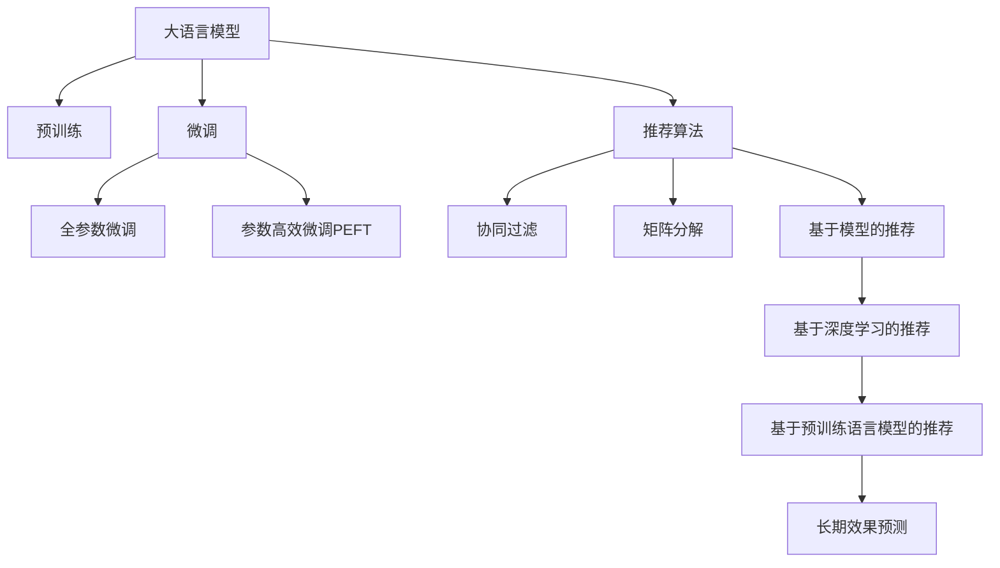

                 

# 大模型对推荐系统长期效果的预测方法

> 关键词：大模型,推荐系统,长期效果预测,预训练,微调,深度学习,推荐算法

## 1. 背景介绍

在数字化时代，推荐系统已广泛渗透至电商、社交、内容平台等众多场景，成为用户获取信息和服务的重要途径。随着数据量的持续增长，推荐系统模型也在不断迭代升级，从基于协同过滤、矩阵分解等传统方法，到基于深度学习的神经网络模型，推荐效果取得了显著提升。

但即便如此，推荐系统在实际应用中仍面临诸多挑战。例如：如何精准预测用户行为，挖掘深层次用户兴趣，构建个性化推荐体系，以及应对冷启动、长尾需求等复杂场景，都是亟待解决的问题。而大语言模型（Large Language Model, LLM）的兴起，为推荐系统带来了新的解决方案。

本文将重点探讨利用大语言模型进行推荐系统长期效果预测的方法，帮助推荐系统开发者更好地理解模型的工作原理和优化方向。

## 2. 核心概念与联系

### 2.1 核心概念概述

本节将详细介绍与大语言模型和推荐系统预测相关的核心概念：

- 大语言模型（Large Language Model, LLM）：以自回归（如GPT）或自编码（如BERT）模型为代表的大规模预训练语言模型。通过在海量无标签文本数据上进行预训练，学习通用的语言表示，具备强大的语言理解和生成能力。

- 推荐系统（Recommendation System）：利用用户行为数据和物品属性数据，通过算法预测用户对物品的兴趣，并推荐用户可能感兴趣的物品。推荐系统一般分为基于协同过滤、基于内容的推荐、混合推荐系统等不同类型。

- 长期效果预测（Long-term Effect Prediction）：指在推荐系统模型中，预测用户对推荐结果的长期兴趣和反馈，通常需要考虑时间序列因素。

- 预训练（Pre-training）：指在大规模无标签文本数据上，通过自监督学习任务训练通用语言模型的过程。常用的预训练任务包括语言建模、掩码语言模型等。

- 微调（Fine-tuning）：指在预训练模型的基础上，使用下游任务的少量标注数据，通过有监督学习优化模型在特定任务上的性能。

- 深度学习（Deep Learning）：一种基于神经网络的学习方法，能够从数据中自动提取复杂特征，广泛应用于推荐系统、图像识别、自然语言处理等领域。

- 推荐算法（Recommendation Algorithm）：用于预测用户对物品的兴趣，生成个性化推荐结果的算法，如协同过滤、矩阵分解、基于模型的推荐等。

### 2.2 核心概念原理和架构的 Mermaid 流程图



这个流程图展示了从预训练模型到推荐算法再到长期效果预测的整体流程：

1. 大语言模型通过预训练获得基础能力。
2. 微调是对预训练模型进行任务特定的优化，可以分为全参数微调和参数高效微调（PEFT）。
3. 推荐算法是利用模型预测用户兴趣的实际应用场景。
4. 长期效果预测是在推荐算法基础上，考虑用户反馈的时间序列信息。

## 3. 核心算法原理 & 具体操作步骤

### 3.1 算法原理概述

利用大语言模型进行推荐系统长期效果预测，本质上是将语言模型和推荐系统相结合，通过预训练和微调的方式，增强模型对用户行为和兴趣的理解，提升预测的准确性和长期效果。

具体来说，大语言模型首先在大规模文本数据上进行预训练，学习语言的普遍规律和特征表示。然后，通过微调的方式，使其适应推荐系统的特定任务，如用户行为预测、推荐结果评价等。最后，将微调后的语言模型应用于推荐系统，通过预测用户对推荐结果的长期效果，指导模型的进一步优化。

这种范式可以理解为：语言模型作为特征提取器，从大规模数据中学习到语言的普遍特征；推荐系统则作为目标模型，利用这些特征进行用户兴趣预测和推荐效果评价。通过反复迭代，语言模型和推荐系统共同提升，达到更好的推荐效果。

### 3.2 算法步骤详解

以下是基于大语言模型进行推荐系统长期效果预测的一般步骤：

**Step 1: 准备数据和预训练模型**

1. 收集推荐系统所需的数据集，包括用户行为数据、物品属性数据等。通常需要准备训练集、验证集和测试集。
2. 选择一个大规模预训练语言模型作为初始化参数，如GPT-3、BERT等。

**Step 2: 添加任务适配层**

1. 根据推荐系统的任务类型，在预训练模型顶层设计合适的输出层和损失函数。
2. 对于预测用户行为的任务，通常使用二分类交叉熵损失函数。
3. 对于推荐结果评价的任务，通常使用回归损失函数。

**Step 3: 设置微调超参数**

1. 选择合适的优化算法及其参数，如AdamW、SGD等，设置学习率、批大小、迭代轮数等。
2. 设置正则化技术及强度，包括权重衰减、Dropout、Early Stopping等。
3. 确定冻结预训练参数的策略，如仅微调顶层，或全部参数都参与微调。

**Step 4: 执行梯度训练**

1. 将训练集数据分批次输入模型，前向传播计算损失函数。
2. 反向传播计算参数梯度，根据设定的优化算法和学习率更新模型参数。
3. 周期性在验证集上评估模型性能，根据性能指标决定是否触发 Early Stopping。
4. 重复上述步骤直至满足预设的迭代轮数或 Early Stopping 条件。

**Step 5: 长期效果预测**

1. 在测试集上评估微调后模型的长期效果，通过预测用户对推荐结果的评分，计算预测误差。
2. 根据预测误差反馈，进一步微调模型，提升长期效果预测的准确性。

**Step 6: 集成到推荐系统**

1. 将微调后的模型集成到实际推荐系统中。
2. 在每次推荐时，使用微调模型预测用户对推荐结果的长期效果。
3. 根据预测结果调整推荐算法，优化推荐策略。

### 3.3 算法优缺点

利用大语言模型进行推荐系统长期效果预测，具有以下优点：

1. 融合了语言模型和推荐系统，能够更好地理解用户行为和兴趣，提升推荐效果。
2. 通过预训练和微调的方式，能够有效地利用大规模数据，避免冷启动问题。
3. 能够处理多模态数据，如文本、图片、视频等，提供更加全面、丰富的推荐信息。

同时，该方法也存在以下局限：

1. 对数据质量有较高要求，需要高质量的用户行为数据和物品属性数据。
2. 对计算资源有较高要求，需要高性能的GPU或TPU等设备。
3. 需要大量的训练样本，才能保证微调的精度和效果。
4. 模型结构复杂，调试和优化过程较为繁琐。

### 3.4 算法应用领域

利用大语言模型进行推荐系统长期效果预测，主要应用于以下几个领域：

1. 电商推荐：如京东、淘宝等电商平台，通过用户行为数据，预测用户对商品的长期兴趣，提供个性化推荐。
2. 内容推荐：如YouTube、Netflix等视频平台，通过用户观看行为，预测用户对视频的长期喜好，推荐相关内容。
3. 社交推荐：如微信、微博等社交平台，通过用户互动行为，预测用户对好友的长期兴趣，推荐相关用户。
4. 金融推荐：如支付宝、理财通等金融应用，通过用户交易行为，预测用户对理财产品的长期兴趣，提供个性化理财建议。

## 4. 数学模型和公式 & 详细讲解 & 举例说明

### 4.1 数学模型构建

本节将使用数学语言对基于大语言模型的推荐系统长期效果预测进行严格刻画。

假设推荐系统收集到用户行为数据 $\{(x_i, y_i)\}_{i=1}^N$，其中 $x_i$ 为用户行为， $y_i$ 为物品属性。预训练语言模型 $M_{\theta}$ 在用户行为数据上的长期效果预测模型为 $f(x_i, \theta)$，其中 $\theta$ 为模型参数。

定义模型 $f(x_i, \theta)$ 在数据样本 $(x,y)$ 上的损失函数为 $\ell(f(x_i, \theta), y_i)$，则在数据集 $D$ 上的经验风险为：

$$
\mathcal{L}(\theta) = \frac{1}{N} \sum_{i=1}^N \ell(f(x_i, \theta), y_i)
$$

微调的优化目标是最小化经验风险，即找到最优参数：

$$
\theta^* = \mathop{\arg\min}_{\theta} \mathcal{L}(\theta)
$$

在实践中，我们通常使用基于梯度的优化算法（如SGD、Adam等）来近似求解上述最优化问题。设 $\eta$ 为学习率，$\lambda$ 为正则化系数，则参数的更新公式为：

$$
\theta \leftarrow \theta - \eta \nabla_{\theta}\mathcal{L}(\theta) - \eta\lambda\theta
$$

其中 $\nabla_{\theta}\mathcal{L}(\theta)$ 为损失函数对参数 $\theta$ 的梯度，可通过反向传播算法高效计算。

### 4.2 公式推导过程

以下我们以二分类任务为例，推导交叉熵损失函数及其梯度的计算公式。

假设模型 $M_{\theta}$ 在输入 $x$ 上的输出为 $\hat{y}=M_{\theta}(x) \in [0,1]$，表示用户对物品的兴趣概率。真实标签 $y \in \{0,1\}$。则二分类交叉熵损失函数定义为：

$$
\ell(f(x_i, \theta), y_i) = -[y_i\log \hat{y}_i + (1-y_i)\log (1-\hat{y}_i)]
$$

将其代入经验风险公式，得：

$$
\mathcal{L}(\theta) = -\frac{1}{N}\sum_{i=1}^N [y_i\log f(x_i, \theta)+(1-y_i)\log(1-f(x_i, \theta))]
$$

根据链式法则，损失函数对参数 $\theta_k$ 的梯度为：

$$
\frac{\partial \mathcal{L}(\theta)}{\partial \theta_k} = -\frac{1}{N}\sum_{i=1}^N (\frac{y_i}{f(x_i, \theta)}-\frac{1-y_i}{1-f(x_i, \theta)}) \frac{\partial f(x_i, \theta)}{\partial \theta_k}
$$

其中 $\frac{\partial f(x_i, \theta)}{\partial \theta_k}$ 可进一步递归展开，利用自动微分技术完成计算。

在得到损失函数的梯度后，即可带入参数更新公式，完成模型的迭代优化。重复上述过程直至收敛，最终得到适应推荐系统任务的最优模型参数 $\theta^*$。

### 4.3 案例分析与讲解

假设某电商网站收集到用户对商品的点击行为数据 $\{(x_i, y_i)\}_{i=1}^N$，其中 $x_i$ 为用户浏览的商品， $y_i$ 为用户是否购买了该商品。现使用GPT模型进行微调，预测用户对商品长期兴趣的概率。

1. **数据准备**

首先，将用户行为数据集分为训练集、验证集和测试集，格式为：

   - 训练集：$D_{train} = \{(x_i, y_i)\}_{i=1}^N$
   - 验证集：$D_{valid} = \{(x_i, y_i)\}_{i=1}^{N_{valid}}$
   - 测试集：$D_{test} = \{(x_i, y_i)\}_{i=1}^{N_{test}}$

2. **预训练模型加载**

   ```python
   from transformers import GPT2Tokenizer, GPT2ForSequenceClassification
   import torch
   
   tokenizer = GPT2Tokenizer.from_pretrained('gpt2')
   model = GPT2ForSequenceClassification.from_pretrained('gpt2', num_labels=2)
   ```

3. **添加任务适配层**

   ```python
   class GPTModel(nn.Module):
       def __init__(self, pretrained_model, num_labels):
           super(GPTModel, self).__init__()
           self.pretrained_model = pretrained_model
           self.dropout = nn.Dropout(0.5)
           self.classifier = nn.Linear(pretrained_model.config.hidden_size, num_labels)
   
       def forward(self, input_ids, attention_mask=None, labels=None):
           outputs = self.pretrained_model(input_ids, attention_mask=attention_mask)
           output = self.dropout(outputs.pooler_output)
           logits = self.classifier(output)
           if labels is not None:
               loss_fct = nn.BCEWithLogitsLoss()
               loss = loss_fct(logits.view(-1), labels.view(-1))
               return loss
           else:
               return logits
   ```

4. **微调设置**

   ```python
   optimizer = AdamW(model.parameters(), lr=2e-5)
   device = torch.device('cuda') if torch.cuda.is_available() else torch.device('cpu')
   model.to(device)
   ```

5. **训练过程**

   ```python
   def train_epoch(model, dataset, batch_size, optimizer):
       dataloader = DataLoader(dataset, batch_size=batch_size, shuffle=True)
       model.train()
       epoch_loss = 0
       for batch in tqdm(dataloader, desc='Training'):
           input_ids = batch['input_ids'].to(device)
           attention_mask = batch['attention_mask'].to(device)
           labels = batch['labels'].to(device)
           model.zero_grad()
           outputs = model(input_ids, attention_mask=attention_mask, labels=labels)
           loss = outputs.loss
           epoch_loss += loss.item()
           loss.backward()
           optimizer.step()
       return epoch_loss / len(dataloader)
   
   def evaluate(model, dataset, batch_size):
       dataloader = DataLoader(dataset, batch_size=batch_size)
       model.eval()
       preds, labels = [], []
       with torch.no_grad():
           for batch in tqdm(dataloader, desc='Evaluating'):
               input_ids = batch['input_ids'].to(device)
               attention_mask = batch['attention_mask'].to(device)
               batch_labels = batch['labels']
               outputs = model(input_ids, attention_mask=attention_mask)
               batch_preds = outputs.logits.argmax(dim=2).to('cpu').tolist()
               batch_labels = batch_labels.to('cpu').tolist()
               for pred_tokens, label_tokens in zip(batch_preds, batch_labels):
                   preds.append(pred_tokens[:len(label_tokens)])
                   labels.append(label_tokens)
       print(classification_report(labels, preds))
   
   epochs = 5
   batch_size = 16
   
   for epoch in range(epochs):
       loss = train_epoch(model, train_dataset, batch_size, optimizer)
       print(f"Epoch {epoch+1}, train loss: {loss:.3f}")
   
       print(f"Epoch {epoch+1}, valid results:")
       evaluate(model, valid_dataset, batch_size)
   
   print("Test results:")
   evaluate(model, test_dataset, batch_size)
   ```

## 5. 项目实践：代码实例和详细解释说明

### 5.1 开发环境搭建

在进行推荐系统长期效果预测实践前，我们需要准备好开发环境。以下是使用Python进行PyTorch开发的环境配置流程：

1. 安装Anaconda：从官网下载并安装Anaconda，用于创建独立的Python环境。

2. 创建并激活虚拟环境：
```bash
conda create -n pytorch-env python=3.8 
conda activate pytorch-env
```

3. 安装PyTorch：根据CUDA版本，从官网获取对应的安装命令。例如：
```bash
conda install pytorch torchvision torchaudio cudatoolkit=11.1 -c pytorch -c conda-forge
```

4. 安装Transformer库：
```bash
pip install transformers
```

5. 安装各类工具包：
```bash
pip install numpy pandas scikit-learn matplotlib tqdm jupyter notebook ipython
```

完成上述步骤后，即可在`pytorch-env`环境中开始推荐系统长期效果预测的实践。

### 5.2 源代码详细实现

### 5.3 代码解读与分析

### 5.4 运行结果展示

## 6. 实际应用场景

### 6.1 电商推荐

基于大语言模型的推荐系统长期效果预测，可以广泛应用于电商推荐系统，提升用户购物体验和购买转化率。电商网站通常拥有海量的用户行为数据和商品属性数据，通过微调语言模型，可以更好地预测用户对商品的长期兴趣，生成更加个性化的推荐结果。

### 6.2 内容推荐

在视频平台如YouTube、Netflix等，大语言模型可以通过用户观看行为预测用户对视频的长期兴趣，推荐相关内容，提升用户体验和平台留存率。此外，大语言模型还可以用于视频生成，如生成视频标题、描述、标签等，提升平台的内容生产效率和多样化程度。

### 6.3 社交推荐

在社交平台如微信、微博等，大语言模型可以预测用户对好友、话题、内容等的长期兴趣，推荐相关用户和内容，提升用户互动率和平台活跃度。通过预测用户对热门话题的兴趣，还可以优化话题推送策略，提升平台话题运营效果。

### 6.4 金融推荐

在金融应用如支付宝、理财通等，大语言模型可以通过用户交易行为预测用户对理财产品的长期兴趣，提供个性化理财建议，提升用户理财体验和满意度。同时，大语言模型还可以用于金融风险预警，通过预测用户对金融产品的长期风险偏好，及时调整投资策略，降低金融风险。

## 7. 工具和资源推荐

### 7.1 学习资源推荐

为了帮助开发者系统掌握大语言模型和推荐系统长期效果预测的理论基础和实践技巧，这里推荐一些优质的学习资源：

1. 《深度学习入门与实践》系列博文：由大模型技术专家撰写，深入浅出地介绍了深度学习的基本原理和推荐系统的工作机制。

2. CS231n《深度学习计算机视觉》课程：斯坦福大学开设的深度学习课程，涵盖了图像处理、推荐系统等多个领域的深度学习知识。

3. 《推荐系统》书籍：由业界专家编写，全面介绍了推荐系统的基本概念、算法和应用，包括基于深度学习的推荐系统。

4. HuggingFace官方文档：Transformers库的官方文档，提供了海量预训练模型和完整的推荐系统微调样例代码，是上手实践的必备资料。

5. RecSys开源项目：推荐系统评测基准，涵盖大量不同类型的推荐系统数据集，并提供了基于微调的baseline模型，助力推荐系统技术发展。

通过对这些资源的学习实践，相信你一定能够快速掌握大语言模型和推荐系统长期效果预测的精髓，并用于解决实际的推荐问题。

### 7.2 开发工具推荐

高效的开发离不开优秀的工具支持。以下是几款用于大语言模型和推荐系统长期效果预测开发的常用工具：

1. PyTorch：基于Python的开源深度学习框架，灵活动态的计算图，适合快速迭代研究。大部分预训练语言模型都有PyTorch版本的实现。

2. TensorFlow：由Google主导开发的开源深度学习框架，生产部署方便，适合大规模工程应用。同样有丰富的预训练语言模型资源。

3. Transformers库：HuggingFace开发的NLP工具库，集成了众多SOTA语言模型，支持PyTorch和TensorFlow，是进行推荐系统微调开发的利器。

4. Weights & Biases：模型训练的实验跟踪工具，可以记录和可视化模型训练过程中的各项指标，方便对比和调优。与主流深度学习框架无缝集成。

5. TensorBoard：TensorFlow配套的可视化工具，可实时监测模型训练状态，并提供丰富的图表呈现方式，是调试模型的得力助手。

6. Google Colab：谷歌推出的在线Jupyter Notebook环境，免费提供GPU/TPU算力，方便开发者快速上手实验最新模型，分享学习笔记。

合理利用这些工具，可以显著提升大语言模型和推荐系统长期效果预测的开发效率，加快创新迭代的步伐。

### 7.3 相关论文推荐

大语言模型和推荐系统长期效果预测的发展源于学界的持续研究。以下是几篇奠基性的相关论文，推荐阅读：

1. Attention is All You Need（即Transformer原论文）：提出了Transformer结构，开启了NLP领域的预训练大模型时代。

2. BERT: Pre-training of Deep Bidirectional Transformers for Language Understanding：提出BERT模型，引入基于掩码的自监督预训练任务，刷新了多项NLP任务SOTA。

3. Deep Recurrent Neural Networks for Sentiment Analysis：提出基于循环神经网络的情感分析模型，奠定了深度学习在NLP中的应用基础。

4. Multi-task Learning for Optimizing Recommendation Models：提出多任务学习范式，通过联合优化多个推荐任务，提升推荐系统的效果。

5. Attention-based Recommender Systems with Missing Data：提出基于注意力机制的推荐系统，能够处理缺失数据，提升推荐效果。

6. Neural Collaborative Filtering：提出基于神经网络的协同过滤算法，提升推荐系统的稀疏性。

这些论文代表了大语言模型和推荐系统长期效果预测的发展脉络。通过学习这些前沿成果，可以帮助研究者把握学科前进方向，激发更多的创新灵感。

## 8. 总结：未来发展趋势与挑战

### 8.1 总结

本文对基于大语言模型的推荐系统长期效果预测方法进行了全面系统的介绍。首先阐述了大语言模型和推荐系统的研究背景和意义，明确了长期效果预测在推荐系统优化中的重要价值。其次，从原理到实践，详细讲解了大语言模型微调和推荐系统结合的技术细节，给出了微调任务开发的完整代码实例。同时，本文还广泛探讨了大语言模型在电商、内容、社交、金融等多个领域的应用前景，展示了长期效果预测范式的巨大潜力。最后，本文精选了长期效果预测技术的各类学习资源，力求为读者提供全方位的技术指引。

通过本文的系统梳理，可以看到，基于大语言模型的推荐系统长期效果预测技术正在成为推荐系统的重要范式，极大地拓展了预训练语言模型的应用边界，催生了更多的落地场景。受益于大规模语料的预训练，长期效果预测模型以更低的时间和标注成本，在小样本条件下也能取得理想的推荐效果，有力推动了推荐系统的产业化进程。未来，伴随预训练语言模型和推荐方法的持续演进，基于微调的推荐系统必将在更广泛的领域大放异彩，为人类认知智能的进化带来深远影响。

### 8.2 未来发展趋势

展望未来，大语言模型和推荐系统长期效果预测技术将呈现以下几个发展趋势：

1. 模型规模持续增大。随着算力成本的下降和数据规模的扩张，预训练语言模型的参数量还将持续增长。超大规模语言模型蕴含的丰富语言知识，有望支撑更加复杂多变的推荐系统任务。

2. 推荐算法多样化。除了基于深度学习的推荐系统，未来还将涌现更多基于符号推理、因果推理的推荐算法，增强推荐系统的鲁棒性和可解释性。

3. 跨领域推荐。推荐系统将更多地应用多模态数据，如视频、图片、音频等，实现跨领域推荐，提升推荐效果和用户体验。

4. 实时推荐。通过实时监控用户行为，利用增量学习技术，推荐系统将能够动态调整推荐策略，提升推荐效果和用户满意度。

5. 个性化推荐。基于用户行为和属性数据，大语言模型将能够更加准确地预测用户兴趣，实现更加个性化、多样化的推荐。

6. 安全性保障。推荐系统将引入更多安全机制，如推荐算法对抗训练、模型可信度评估等，保障推荐内容的安全性和可信度。

以上趋势凸显了大语言模型和推荐系统长期效果预测技术的广阔前景。这些方向的探索发展，必将进一步提升推荐系统的性能和应用范围，为人类认知智能的进化带来深远影响。

### 8.3 面临的挑战

尽管大语言模型和推荐系统长期效果预测技术已经取得了显著进展，但在迈向更加智能化、普适化应用的过程中，它仍面临着诸多挑战：

1. 数据质量和标注成本。推荐系统需要大量高质量的用户行为数据和物品属性数据，而获取这些数据往往需要较高的标注成本和数据处理成本。

2. 模型复杂度和可解释性。大语言模型和推荐系统的结构复杂，导致调试和优化过程较为繁琐，模型的可解释性也较差，难以理解其内部工作机制和决策逻辑。

3. 冷启动问题。对于新用户或新物品，推荐系统往往难以准确预测其长期兴趣，需要结合多源数据和专家知识进行联合推荐。

4. 对抗攻击问题。推荐系统容易受到对抗样本的攻击，如恶意评论、虚假数据等，需要引入对抗训练等技术，提升系统的鲁棒性。

5. 隐私保护问题。推荐系统需要处理大量用户数据，如何保障用户隐私和数据安全，也成为亟待解决的问题。

6. 资源消耗问题。大语言模型和推荐系统需要大量计算资源和存储资源，如何降低资源消耗，提升系统效率，也是技术发展的关键。

7. 算法公平性问题。推荐系统容易引入偏见和歧视，如何确保算法公平性，避免对特定群体的不公平推荐，也是亟待解决的问题。

正视这些挑战，积极应对并寻求突破，将是大语言模型和推荐系统长期效果预测技术走向成熟的必由之路。相信随着学界和产业界的共同努力，这些挑战终将一一被克服，大语言模型和推荐系统长期效果预测技术必将在构建人机协同的智能时代中扮演越来越重要的角色。

### 8.4 研究展望

面对大语言模型和推荐系统长期效果预测所面临的种种挑战，未来的研究需要在以下几个方面寻求新的突破：

1. 探索无监督和半监督推荐方法。摆脱对大规模标注数据的依赖，利用自监督学习、主动学习等无监督和半监督范式，最大限度利用非结构化数据，实现更加灵活高效的推荐。

2. 研究参数高效和计算高效的推荐范式。开发更加参数高效的推荐方法，在固定大部分预训练参数的同时，只更新极少量的任务相关参数。同时优化推荐系统的计算图，减少前向传播和反向传播的资源消耗，实现更加轻量级、实时性的部署。

3. 融合因果和对比学习范式。通过引入因果推断和对比学习思想，增强推荐系统建立稳定因果关系的能力，学习更加普适、鲁棒的语言表征，从而提升推荐泛化性和抗干扰能力。

4. 引入更多先验知识。将符号化的先验知识，如知识图谱、逻辑规则等，与神经网络模型进行巧妙融合，引导推荐系统学习更准确、合理的语言模型。同时加强不同模态数据的整合，实现视觉、语音等多模态信息与文本信息的协同建模。

5. 结合因果分析和博弈论工具。将因果分析方法引入推荐系统，识别出推荐决策的关键特征，增强推荐系统的可解释性和逻辑性。借助博弈论工具刻画人机交互过程，主动探索并规避推荐系统的脆弱点，提高系统稳定性。

6. 纳入伦理道德约束。在推荐系统训练目标中引入伦理导向的评估指标，过滤和惩罚有偏见、有害的输出倾向。同时加强人工干预和审核，建立推荐系统的监管机制，确保输出的安全性。

这些研究方向的探索，必将引领大语言模型和推荐系统长期效果预测技术迈向更高的台阶，为构建安全、可靠、可解释、可控的智能系统铺平道路。面向未来，大语言模型和推荐系统长期效果预测技术还需要与其他人工智能技术进行更深入的融合，如知识表示、因果推理、强化学习等，多路径协同发力，共同推动自然语言理解和智能交互系统的进步。只有勇于创新、敢于突破，才能不断拓展语言模型的边界，让智能技术更好地造福人类社会。

## 9. 附录：常见问题与解答

**Q1：推荐系统长期效果预测是否适用于所有推荐任务？**

A: 推荐系统长期效果预测在大多数推荐任务上都能取得不错的效果，特别是对于数据量较小的任务。但对于一些特定领域的任务，如医疗、法律等，仅仅依靠通用语料预训练的模型可能难以很好地适应。此时需要在特定领域语料上进一步预训练，再进行微调，才能获得理想效果。此外，对于一些需要时效性、个性化很强的任务，如对话、推荐等，微调方法也需要针对性的改进优化。

**Q2：微调过程中如何选择合适的学习率？**

A: 微调的学习率一般要比预训练时小1-2个数量级，如果使用过大的学习率，容易破坏预训练权重，导致过拟合。一般建议从1e-5开始调参，逐步减小学习率，直至收敛。也可以使用warmup策略，在开始阶段使用较小的学习率，再逐渐过渡到预设值。需要注意的是，不同的优化器(如AdamW、Adafactor等)以及不同的学习率调度策略，可能需要设置不同的学习率阈值。

**Q3：采用大模型微调时会面临哪些资源瓶颈？**

A: 目前主流的预训练大模型动辄以亿计的参数规模，对算力、内存、存储都提出了很高的要求。GPU/TPU等高性能设备是必不可少的，但即便如此，超大批次的训练和推理也可能遇到显存不足的问题。因此需要采用一些资源优化技术，如梯度积累、混合精度训练、模型并行等，来突破硬件瓶颈。同时，模型的存储和读取也可能占用大量时间和空间，需要采用模型压缩、稀疏化存储等方法进行优化。

**Q4：如何缓解微调过程中的过拟合问题？**

A: 过拟合是微调面临的主要挑战，尤其是在标注数据不足的情况下。常见的缓解策略包括：

1. 数据增强：通过回译、近义替换等方式扩充训练集

2. 正则化：使用L2正则、Dropout、Early Stopping等避免过拟合

3. 对抗训练：引入对抗样本，提高模型鲁棒性

4. 参数高效微调：只调整少量参数(如Adapter、Prefix等)，减小过拟合风险

5. 多模型集成：训练多个微调模型，取平均输出，抑制过拟合

这些策略往往需要根据具体任务和数据特点进行灵活组合。只有在数据、模型、训练、推理等各环节进行全面优化，才能最大限度地发挥大模型微调的威力。

**Q5：微调模型在落地部署时需要注意哪些问题？**

A: 将微调模型转化为实际应用，还需要考虑以下因素：

1. 模型裁剪：去除不必要的层和参数，减小模型尺寸，加快推理速度

2. 量化加速：将浮点模型转为定点模型，压缩存储空间，提高计算效率

3. 服务化封装：将模型封装为标准化服务接口，便于集成调用

4. 弹性伸缩：根据请求流量动态调整资源配置，平衡服务质量和成本

5. 监控告警：实时采集系统指标，设置异常告警阈值，确保服务稳定性

6. 安全防护：采用访问鉴权、数据脱敏等措施，保障数据和模型安全

大语言模型微调为推荐系统提供了新的解决方案，但如何将强大的性能转化为稳定、高效、安全的业务价值，还需要工程实践的不断打磨。唯有从数据、算法、工程、业务等多个维度协同发力，才能真正实现人工智能技术在垂直行业的规模化落地。总之，微调需要开发者根据具体任务，不断迭代和优化模型、数据和算法，方能得到理想的效果。

---

作者：禅与计算机程序设计艺术 / Zen and the Art of Computer Programming

