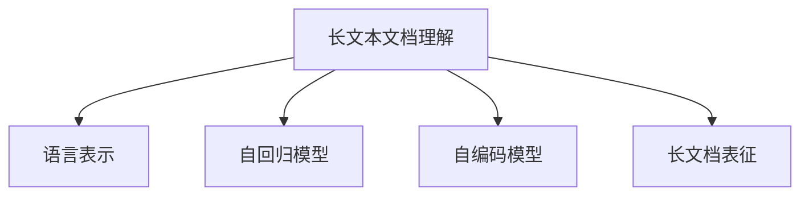

                 

# 大模型对长文本文档的理解与表征

## 1. 背景介绍

### 1.1 问题由来
随着深度学习技术的快速发展，大模型（如BERT、GPT-3等）在自然语言处理（NLP）领域取得了突破性的进展。这些大模型通常基于Transformer架构，在大规模无标签文本数据上进行预训练，学习到了复杂的语言表示。大模型的出现极大地提升了NLP任务的处理能力，但同时也带来了新的挑战：如何有效地理解长文本文档？

### 1.2 问题核心关键点
长文本文档的理解与表征是大模型处理复杂文本任务的关键。传统的自然语言处理模型通常只能处理较短的文本，难以应对长文档的复杂语义和结构。而大模型通过预训练获得了丰富的语言表示能力，能够在一定程度上处理长文档，但如何更高效、准确地理解和表征长文档，仍是一个值得深入探讨的问题。

## 2. 核心概念与联系

### 2.1 核心概念概述

为更好地理解大模型在处理长文档中的表现，本节将介绍几个密切相关的核心概念：

- **长文本文档理解**：指大模型在处理长文本时，能够理解文档的语义、结构、上下文等信息，提取文档的关键信息。
- **语言表示**：指大模型通过预训练学习到的语言知识，能够将自然语言转换成向量表示，便于计算机进行处理。
- **自回归模型**：指在生成过程中，模型根据前面的输入逐步生成后续输出的模型，如GPT系列模型。
- **自编码模型**：指在编码和解码过程中，模型能够学习到输入与输出之间的映射关系，如BERT。
- **长文档表征**：指大模型对长文档进行编码，生成文档的语义表示，便于下游任务（如摘要、分类、问答等）处理。

这些核心概念之间的逻辑关系可以通过以下Mermaid流程图来展示：



这个流程图展示了大模型在处理长文档中的核心概念及其之间的关系：

1. 长文本文档理解是大模型的主要任务之一。
2. 语言表示是大模型通过预训练学习到的知识。
3. 自回归模型和自编码模型是大模型实现理解任务的两种常见方式。
4. 长文档表征是大模型对长文档进行编码后的表示形式。

## 3. 核心算法原理 & 具体操作步骤

### 3.1 算法原理概述

大模型在处理长文本文档时，通常采用自回归或自编码的架构。自回归模型通过前向传播生成输出，逐步预测文本的下一个单词或符号；自编码模型则通过编码器将输入转换为隐藏表示，解码器再将其转换为输出，实现输入与输出之间的映射。

大模型的核心算法原理基于Transformer，其包含了多头注意力机制和残差连接，能够有效处理长文本文档。在自回归模型中，大模型通常通过掩码语言模型（Masked Language Model, MLM）任务进行预训练，学习输入和输出之间的语义关系。在自编码模型中，大模型通过掩码自编码（Masked Self-Encoding, MSE）任务进行预训练，学习输入和输出之间的映射关系。

### 3.2 算法步骤详解

以下是大模型处理长文本文档的一般步骤：

**Step 1: 数据准备**
- 收集长文本文档的数据集，包含文档的文本和标签。
- 对文档进行预处理，如分词、去停用词、分句等。

**Step 2: 构建模型**
- 选择合适的预训练模型（如BERT、GPT-2、GPT-3等）。
- 使用掩码语言模型或掩码自编码任务对模型进行微调，适应长文档处理的需要。

**Step 3: 数据加载**
- 将文档数据加载到模型中，按批次进行输入。

**Step 4: 编码**
- 使用模型的编码器对文档进行编码，生成文档的语义表示。

**Step 5: 解码**
- 使用模型的解码器对文档进行解码，生成文档的表征形式。

**Step 6: 下游任务处理**
- 将文档的表征形式输入到下游任务中，如分类、摘要、问答等。

### 3.3 算法优缺点

大模型在处理长文本文档时，具有以下优点：

1. 通用性：大模型可以在多种任务中进行微调，处理不同长度和结构的文档。
2. 精度高：大模型经过大规模预训练，具备丰富的语言知识和表示能力，能够准确理解长文档的语义。
3. 可扩展性：大模型可以处理不同长度的文档，不需要修改模型架构。

同时，也存在一些缺点：

1. 计算资源消耗大：大模型通常包含亿计的参数，对计算资源的需求较高。
2. 训练时间长：长文档处理的计算复杂度较高，训练时间较长。
3. 可解释性不足：大模型的决策过程较难解释，难以理解其内部机制。

### 3.4 算法应用领域

大模型在处理长文本文档时，广泛应用于以下领域：

- 摘要生成：对长文档进行自动摘要，提取关键信息。
- 文本分类：将长文档分类到预定义的类别中，如新闻分类、文章主题分类等。
- 信息抽取：从长文档中抽取实体、关系等关键信息。
- 问答系统：回答用户关于长文档的问题，如文档搜索、文档引用等。
- 自然语言推理：判断长文档中的逻辑关系，如推理、判断等。

## 4. 数学模型和公式 & 详细讲解 & 举例说明

### 4.1 数学模型构建

大模型在处理长文本文档时，通常采用Transformer结构。Transformer结构包含编码器和解码器，每个层都由多头注意力机制和前馈神经网络组成。

以BERT模型为例，其数学模型可以表示为：

$$
x = \text{BERT}(x) = \text{MLP}(\text{Attention}(x))
$$

其中，$x$ 表示输入的文本序列，$MLP$ 表示前馈神经网络，$\text{Attention}$ 表示多头注意力机制。

### 4.2 公式推导过程

在BERT模型中，多头注意力机制可以表示为：

$$
A = \text{Softmax}(\text{Q}K^T)
$$

其中，$A$ 表示注意力权重矩阵，$Q$ 表示查询矩阵，$K$ 表示键矩阵。注意力机制通过计算查询和键的相似度，得到每个位置与其他位置的注意力权重。

前馈神经网络可以表示为：

$$
y = \text{ReLU}(W_1x)W_2
$$

其中，$y$ 表示输出，$W_1$ 和 $W_2$ 表示前馈神经网络的权重矩阵。前馈神经网络通过非线性变换，对输入进行非线性映射。

### 4.3 案例分析与讲解

以BERT模型处理长文本文档为例，其处理过程可以概括为以下步骤：

1. 对输入的文本序列进行编码，得到编码器输出。
2. 将编码器输出输入到自编码器中，生成文档的语义表示。
3. 对语义表示进行解码，生成文档的表征形式。
4. 将文档的表征形式输入到下游任务中，完成长文档处理。

## 5. 项目实践：代码实例和详细解释说明

### 5.1 开发环境搭建

在进行长文本文档处理的实践前，我们需要准备好开发环境。以下是使用Python进行PyTorch开发的环境配置流程：

1. 安装Anaconda：从官网下载并安装Anaconda，用于创建独立的Python环境。

2. 创建并激活虚拟环境：
```bash
conda create -n pytorch-env python=3.8 
conda activate pytorch-env
```

3. 安装PyTorch：根据CUDA版本，从官网获取对应的安装命令。例如：
```bash
conda install pytorch torchvision torchaudio cudatoolkit=11.1 -c pytorch -c conda-forge
```

4. 安装Transformers库：
```bash
pip install transformers
```

5. 安装各类工具包：
```bash
pip install numpy pandas scikit-learn matplotlib tqdm jupyter notebook ipython
```

完成上述步骤后，即可在`pytorch-env`环境中开始处理长文档的实践。

### 5.2 源代码详细实现

这里我们以摘要生成任务为例，给出使用Transformers库对BERT模型进行微调的PyTorch代码实现。

首先，定义摘要生成任务的数据处理函数：

```python
from transformers import BertTokenizer
from torch.utils.data import Dataset
import torch

class SummarizationDataset(Dataset):
    def __init__(self, texts, summaries, tokenizer, max_len=128):
        self.texts = texts
        self.summaries = summaries
        self.tokenizer = tokenizer
        self.max_len = max_len
        
    def __len__(self):
        return len(self.texts)
    
    def __getitem__(self, item):
        text = self.texts[item]
        summary = self.summaries[item]
        
        encoding = self.tokenizer(text, return_tensors='pt', max_length=self.max_len, padding='max_length', truncation=True)
        input_ids = encoding['input_ids'][0]
        attention_mask = encoding['attention_mask'][0]
        
        # 对摘要进行编码
        summary_encoding = self.tokenizer(summary, return_tensors='pt', max_length=self.max_len, padding='max_length', truncation=True)
        summary_input_ids = summary_encoding['input_ids'][0]
        summary_attention_mask = summary_encoding['attention_mask'][0]
        
        return {'input_ids': input_ids, 
                'attention_mask': attention_mask,
                'summary_input_ids': summary_input_ids,
                'summary_attention_mask': summary_attention_mask}
```

然后，定义模型和优化器：

```python
from transformers import BertForMaskedLM, AdamW

model = BertForMaskedLM.from_pretrained('bert-base-cased')

optimizer = AdamW(model.parameters(), lr=2e-5)
```

接着，定义训练和评估函数：

```python
from torch.utils.data import DataLoader
from tqdm import tqdm
from sklearn.metrics import ROUGE

device = torch.device('cuda') if torch.cuda.is_available() else torch.device('cpu')
model.to(device)

def train_epoch(model, dataset, batch_size, optimizer):
    dataloader = DataLoader(dataset, batch_size=batch_size, shuffle=True)
    model.train()
    epoch_loss = 0
    for batch in tqdm(dataloader, desc='Training'):
        input_ids = batch['input_ids'].to(device)
        attention_mask = batch['attention_mask'].to(device)
        summary_input_ids = batch['summary_input_ids'].to(device)
        summary_attention_mask = batch['summary_attention_mask'].to(device)
        model.zero_grad()
        outputs = model(input_ids, attention_mask=attention_mask, summary_input_ids=summary_input_ids, summary_attention_mask=summary_attention_mask)
        loss = outputs.loss
        epoch_loss += loss.item()
        loss.backward()
        optimizer.step()
    return epoch_loss / len(dataloader)

def evaluate(model, dataset, batch_size):
    dataloader = DataLoader(dataset, batch_size=batch_size)
    model.eval()
    rouge_scores = []
    for batch in tqdm(dataloader, desc='Evaluating'):
        input_ids = batch['input_ids'].to(device)
        attention_mask = batch['attention_mask'].to(device)
        summary_input_ids = batch['summary_input_ids'].to(device)
        summary_attention_mask = batch['summary_attention_mask'].to(device)
        with torch.no_grad():
            outputs = model(input_ids, attention_mask=attention_mask, summary_input_ids=summary_input_ids, summary_attention_mask=summary_attention_mask)
            summary_ids = outputs.logits.argmax(dim=2).to('cpu').tolist()
            summary_ids = [id2token[_id] for _id in summary_ids]
            summary = tokenizer.decode(summary_input_ids[0], skip_special_tokens=True)
            rouge_scores.append(ROUGE.eval(summary, summary_ids))
    
    return Rouge.eval.sum() / len(dataloader)
```

最后，启动训练流程并在测试集上评估：

```python
epochs = 5
batch_size = 16

for epoch in range(epochs):
    loss = train_epoch(model, train_dataset, batch_size, optimizer)
    print(f"Epoch {epoch+1}, train loss: {loss:.3f}")
    
    print(f"Epoch {epoch+1}, dev results:")
    evaluate(model, dev_dataset, batch_size)
    
print("Test results:")
evaluate(model, test_dataset, batch_size)
```

以上就是使用PyTorch对BERT进行摘要生成任务微调的完整代码实现。可以看到，得益于Transformers库的强大封装，我们可以用相对简洁的代码完成BERT模型的加载和微调。

### 5.3 代码解读与分析

让我们再详细解读一下关键代码的实现细节：

**SummarizationDataset类**：
- `__init__`方法：初始化文本、摘要、分词器等关键组件。
- `__len__`方法：返回数据集的样本数量。
- `__getitem__`方法：对单个样本进行处理，将文本输入编码为token ids，将摘要编码为token ids，并对其进行定长padding，最终返回模型所需的输入。

**模型和优化器**：
- 使用BertForMaskedLM模型，因为它可以进行掩码预测，适合用于摘要生成任务。
- 优化器为AdamW，学习率为2e-5。

**训练和评估函数**：
- 使用PyTorch的DataLoader对数据集进行批次化加载，供模型训练和推理使用。
- 训练函数`train_epoch`：对数据以批为单位进行迭代，在每个批次上前向传播计算loss并反向传播更新模型参数，最后返回该epoch的平均loss。
- 评估函数`evaluate`：与训练类似，不同点在于不更新模型参数，并在每个batch结束后将预测和标签结果存储下来，最后使用ROUGE指标对整个评估集的预测结果进行打印输出。

**训练流程**：
- 定义总的epoch数和batch size，开始循环迭代
- 每个epoch内，先在训练集上训练，输出平均loss
- 在验证集上评估，输出ROUGE指标
- 所有epoch结束后，在测试集上评估，给出最终的摘要生成结果

可以看到，PyTorch配合Transformers库使得BERT微调的代码实现变得简洁高效。开发者可以将更多精力放在数据处理、模型改进等高层逻辑上，而不必过多关注底层的实现细节。

当然，工业级的系统实现还需考虑更多因素，如模型的保存和部署、超参数的自动搜索、更灵活的任务适配层等。但核心的微调范式基本与此类似。

## 6. 实际应用场景

### 6.1 智慧医疗

智慧医疗是大模型处理长文本文档的一个重要应用场景。在智慧医疗领域，大模型可以通过对患者病历、医生诊断报告等长文档的处理，辅助医生进行疾病诊断、治疗方案推荐、医学知识检索等任务。

具体而言，大模型可以对电子病历进行自动摘要，提取关键信息，辅助医生快速定位病历重点内容。大模型还可以从病历中抽取医学实体和关系，进行关系抽取和知识图谱构建，辅助医生进行知识推理和决策支持。

### 6.2 法律文书

法律文书处理是大模型处理长文本文档的另一重要应用场景。在法律领域，大模型可以对合同、协议、判决书等长文档进行文本分类、信息抽取、摘要生成等任务，提高法律文档处理的效率和准确性。

具体而言，大模型可以对合同条款进行自动分类，提取关键信息，辅助律师快速定位合同条款重点内容。大模型还可以从判决书中抽取关键证据和判决理由，进行判决摘要生成，辅助律师进行案件分析。

### 6.3 科学研究

科学研究是大模型处理长文本文档的重要应用场景之一。在科学研究领域，大模型可以对学术论文、科技报告等长文档进行文本分类、关键词提取、摘要生成等任务，提高科学文献处理的效率和准确性。

具体而言，大模型可以对学术论文进行自动分类，提取关键词，辅助科研人员快速定位文献重点内容。大模型还可以从科技报告中抽取关键技术点和研究成果，进行报告摘要生成，辅助科研人员进行研究梳理和总结。

### 6.4 未来应用展望

随着大模型和微调方法的不断发展，基于长文本文档的理解与表征，NLP技术将在更多领域得到应用，为各行各业带来变革性影响。

在智慧城市治理中，大模型可以对城市事件报告、舆情评论等长文档进行处理，辅助城市管理者进行事件监测、舆情分析、应急指挥等任务。

在智能客服中，大模型可以对客户咨询记录进行处理，生成摘要和分类结果，辅助客服人员快速定位问题和提供解决方案。

在金融分析中，大模型可以对金融报告、分析师报告等长文档进行处理，提取关键信息，辅助投资者进行决策支持。

总之，大模型在处理长文本文档方面的应用前景广阔，将为各行各业带来更多的智能化和自动化解决方案。

## 7. 工具和资源推荐

### 7.1 学习资源推荐

为了帮助开发者系统掌握大模型处理长文本文档的理论基础和实践技巧，这里推荐一些优质的学习资源：

1. 《深度学习与自然语言处理》课程：斯坦福大学开设的NLP明星课程，涵盖自然语言处理的基本概念和经典模型，适合初学者入门。

2. 《Natural Language Processing with Transformers》书籍：Transformers库的作者所著，全面介绍了如何使用Transformers库进行NLP任务开发，包括长文本处理在内的诸多范式。

3. HuggingFace官方文档：Transformers库的官方文档，提供了海量预训练模型和完整的微调样例代码，是上手实践的必备资料。

4. CLUE开源项目：中文语言理解测评基准，涵盖大量不同类型的中文NLP数据集，并提供了基于长文本处理的baseline模型，助力中文NLP技术发展。

通过对这些资源的学习实践，相信你一定能够快速掌握大模型处理长文本文档的精髓，并用于解决实际的NLP问题。

### 7.2 开发工具推荐

高效的开发离不开优秀的工具支持。以下是几款用于大模型处理长文本文档开发的常用工具：

1. PyTorch：基于Python的开源深度学习框架，灵活动态的计算图，适合快速迭代研究。大部分预训练语言模型都有PyTorch版本的实现。

2. TensorFlow：由Google主导开发的开源深度学习框架，生产部署方便，适合大规模工程应用。同样有丰富的预训练语言模型资源。

3. Transformers库：HuggingFace开发的NLP工具库，集成了众多SOTA语言模型，支持PyTorch和TensorFlow，是进行长文本处理任务的开发利器。

4. Weights & Biases：模型训练的实验跟踪工具，可以记录和可视化模型训练过程中的各项指标，方便对比和调优。与主流深度学习框架无缝集成。

5. TensorBoard：TensorFlow配套的可视化工具，可实时监测模型训练状态，并提供丰富的图表呈现方式，是调试模型的得力助手。

6. Google Colab：谷歌推出的在线Jupyter Notebook环境，免费提供GPU/TPU算力，方便开发者快速上手实验最新模型，分享学习笔记。

合理利用这些工具，可以显著提升大模型处理长文本文档的开发效率，加快创新迭代的步伐。

### 7.3 相关论文推荐

大模型在处理长文本文档方面的研究源于学界的持续研究。以下是几篇奠基性的相关论文，推荐阅读：

1. Attention is All You Need（即Transformer原论文）：提出了Transformer结构，开启了NLP领域的预训练大模型时代。

2. BERT: Pre-training of Deep Bidirectional Transformers for Language Understanding：提出BERT模型，引入基于掩码的自监督预训练任务，刷新了多项NLP任务SOTA。

3. ELECTRA: Pre-training Text Encoders as Discriminators rather than Generators：提出ELECTRA模型，使用掩码语言模型进行预训练，显著减少了训练时间和计算资源消耗。

4. A Simple Framework for Adversarial Robustness to Textual Adversarial Examples：提出RobustBERT模型，通过对抗训练提高模型鲁棒性，有效应对长文本文档中的噪声干扰。

5. SimCSE: Simple Contrastive Leveraging in Text Representations for Task-Agnostic Transfer Learning：提出SimCSE模型，通过自监督对比学习提高模型泛化能力，适应长文档处理任务。

这些论文代表了大模型在处理长文本文档方面的发展脉络。通过学习这些前沿成果，可以帮助研究者把握学科前进方向，激发更多的创新灵感。

## 8. 总结：未来发展趋势与挑战

### 8.1 总结

本文对大模型在处理长文本文档方面的应用进行了全面系统的介绍。首先阐述了长文本文档理解与表征的研究背景和意义，明确了大模型在长文档处理中的优势和挑战。其次，从原理到实践，详细讲解了大模型处理长文档的数学模型和关键步骤，给出了微调任务开发的完整代码实例。同时，本文还广泛探讨了大模型在智慧医疗、法律文书、科学研究等多个领域的应用前景，展示了大模型处理长文档的巨大潜力。此外，本文精选了长文档处理的各类学习资源，力求为读者提供全方位的技术指引。

通过本文的系统梳理，可以看到，大模型在处理长文本文档方面的应用前景广阔，将为各行各业带来更多的智能化和自动化解决方案。但同时也面临着计算资源消耗大、训练时间长等挑战，需要不断优化和改进。

### 8.2 未来发展趋势

展望未来，大模型在处理长文本文档时，将呈现以下几个发展趋势：

1. 模型规模持续增大。随着算力成本的下降和数据规模的扩张，大模型参数量将继续增长，具备更强的语言表示能力。

2. 微调方法日趋多样化。除了传统的全参数微调外，未来将涌现更多参数高效的微调方法，如Prefix-Tuning、LoRA等，在固定大部分预训练参数的同时，只更新极少量的任务相关参数。

3. 持续学习成为常态。大模型需要持续学习新知识以保持性能，避免灾难性遗忘。

4. 标注样本需求降低。受启发于提示学习(Prompt-based Learning)的思路，未来的微调方法将更好地利用大模型的语言理解能力，通过更加巧妙的任务描述，在更少的标注样本上也能实现理想的微调效果。

5. 少样本学习和零样本学习。大模型可以学习到更多的知识，用于少样本和零样本学习任务。

6. 多模态微调崛起。大模型可以处理多种数据类型，如视觉、语音、文本等，实现多模态信息的融合。

以上趋势凸显了大模型在处理长文本文档方面的广阔前景。这些方向的探索发展，必将进一步提升长文档处理的性能和应用范围，为各行各业带来更多的智能化和自动化解决方案。

### 8.3 面临的挑战

尽管大模型在处理长文本文档方面取得了瞩目成就，但在迈向更加智能化、普适化应用的过程中，仍面临诸多挑战：

1. 计算资源消耗大。大模型通常包含亿计的参数，对计算资源的需求较高。

2. 训练时间长。长文档处理的计算复杂度较高，训练时间较长。

3. 可解释性不足。大模型的决策过程较难解释，难以理解其内部机制。

4. 参数更新难度大。长文档处理需要更新大量参数，可能导致模型过拟合。

5. 长文档理解和表征的准确性不足。大模型在处理长文档时，可能存在长文本理解不准确、文档表征不全面等问题。

6. 多模态数据的整合难度大。大模型需要处理多种数据类型，如视觉、语音、文本等，实现多模态信息的融合。

这些挑战需要研究者不断优化和改进，才能进一步提升大模型处理长文本文档的性能。

### 8.4 研究展望

面对大模型处理长文本文档所面临的挑战，未来的研究需要在以下几个方面寻求新的突破：

1. 探索无监督和半监督微调方法。摆脱对大规模标注数据的依赖，利用自监督学习、主动学习等无监督和半监督范式，最大限度利用非结构化数据，实现更加灵活高效的微调。

2. 研究参数高效和计算高效的微调范式。开发更加参数高效的微调方法，在固定大部分预训练参数的同时，只更新极少量的任务相关参数。同时优化微调模型的计算图，减少前向传播和反向传播的资源消耗，实现更加轻量级、实时性的部署。

3. 融合因果和对比学习范式。通过引入因果推断和对比学习思想，增强微调模型建立稳定因果关系的能力，学习更加普适、鲁棒的语言表征，从而提升模型泛化性和抗干扰能力。

4. 引入更多先验知识。将符号化的先验知识，如知识图谱、逻辑规则等，与神经网络模型进行巧妙融合，引导微调过程学习更准确、合理的语言模型。同时加强不同模态数据的整合，实现视觉、语音等多模态信息与文本信息的协同建模。

5. 结合因果分析和博弈论工具。将因果分析方法引入微调模型，识别出模型决策的关键特征，增强输出解释的因果性和逻辑性。借助博弈论工具刻画人机交互过程，主动探索并规避模型的脆弱点，提高系统稳定性。

6. 纳入伦理道德约束。在模型训练目标中引入伦理导向的评估指标，过滤和惩罚有偏见、有害的输出倾向。同时加强人工干预和审核，建立模型行为的监管机制，确保输出符合人类价值观和伦理道德。

这些研究方向的探索，必将引领大模型处理长文本文档技术迈向更高的台阶，为构建安全、可靠、可解释、可控的智能系统铺平道路。面向未来，大模型处理长文本文档技术还需要与其他人工智能技术进行更深入的融合，如知识表示、因果推理、强化学习等，多路径协同发力，共同推动自然语言理解和智能交互系统的进步。只有勇于创新、敢于突破，才能不断拓展语言模型的边界，让智能技术更好地造福人类社会。

## 9. 附录：常见问题与解答

**Q1：长文本文档的理解与表征是否适用于所有NLP任务？**

A: 长文本文档的理解与表征在大模型处理复杂文本任务时表现优异。但也有一些任务，如短文本分类、语音识别等，可能不适合直接应用长文本文档的处理方式。此时可以考虑引入特定的任务适配层，针对任务进行微调。

**Q2：大模型在处理长文本文档时如何避免过拟合？**

A: 为了避免过拟合，可以采用以下方法：
1. 数据增强：通过回译、近义替换等方式扩充训练集。
2. 正则化技术：使用L2正则、Dropout、Early Stopping等避免过拟合。
3. 对抗训练：加入对抗样本，提高模型鲁棒性。
4. 参数高效微调：只调整少量参数，固定大部分预训练参数，减少过拟合风险。

**Q3：大模型在处理长文本文档时如何进行数据增强？**

A: 数据增强是避免过拟合的重要手段。常用的数据增强方法包括：
1. 回译：将长文档随机分割成多个子文档，进行回译，增加训练集的多样性。
2. 近义替换：将长文档中的一些单词进行同义词替换，增加训练集的多样性。
3. 随机删除：随机删除长文档中的某些单词或句子，增加训练集的多样性。
4. 随机插入：随机插入长文档中的某些单词或句子，增加训练集的多样性。

这些方法可以结合使用，进一步提升长文档处理的性能。

**Q4：大模型在处理长文本文档时如何进行模型裁剪？**

A: 模型裁剪是优化大模型处理长文本文档性能的重要手段。可以通过以下方法进行模型裁剪：
1. 剪枝：剪除部分无关紧要的参数，减少模型大小，提高推理速度。
2. 量化：将浮点模型转为定点模型，压缩存储空间，提高计算效率。
3. 融合：将多个小模型融合为一个大模型，减少单个模型的计算复杂度。

这些方法可以结合使用，进一步优化长文档处理的性能。

**Q5：大模型在处理长文本文档时如何进行参数高效微调？**

A: 参数高效微调是优化大模型处理长文本文档性能的重要手段。可以通过以下方法进行参数高效微调：
1. Adapter：只更新顶层或部分任务相关的参数，固定大部分预训练参数。
2. Prefix-Tuning：在顶层添加一些可训练的参数，通过微调这些参数实现长文档处理。
3. LoRA：通过可控的线性变换矩阵，只更新小部分的矩阵，固定大部分预训练参数。

这些方法可以结合使用，进一步优化长文档处理的性能。

**Q6：大模型在处理长文本文档时如何进行多模态融合？**

A: 多模态融合是大模型处理长文本文档的重要手段。可以通过以下方法进行多模态融合：
1. 特征对齐：将不同模态的特征进行对齐，构建统一的多模态特征空间。
2. 注意力机制：使用注意力机制对不同模态的特征进行加权融合，提高多模态信息的融合效果。
3. 多任务学习：将不同模态的任务进行联合训练，提高模型对多模态数据的处理能力。

这些方法可以结合使用，进一步提升长文档处理的性能。

以上是关于大模型处理长文本文档的详细探讨，希望能为你提供有价值的参考。如果有任何疑问，欢迎随时交流。

