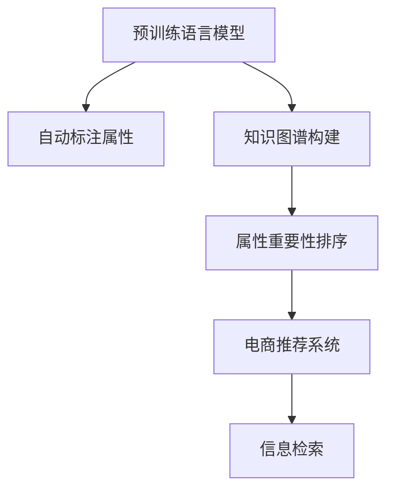
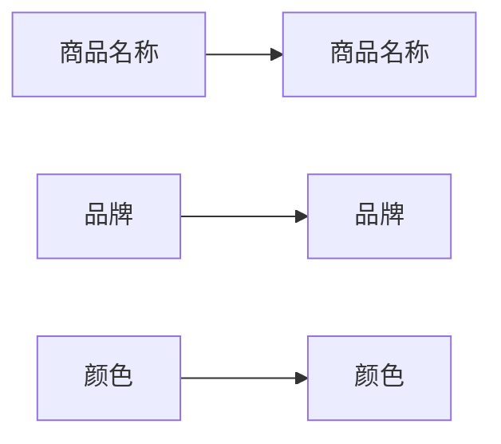

                 

# 大模型技术在电商平台商品属性重要性排序中的应用

> 关键词：大模型技术, 商品属性, 重要性排序, 自然语言处理(NLP), 深度学习, 知识图谱, 应用场景, 电商

## 1. 背景介绍

### 1.1 问题由来
随着电子商务平台的快速发展，商品种类繁多，消费者在选择商品时面临大量信息过载的挑战。如何帮助消费者快速定位到满意的商品，提升购物体验和转化率，成为电商平台亟需解决的难题。电商平台通过推荐系统向用户推荐商品，但其推荐效果很大程度上依赖于商品属性标签的准确性。传统上，这些属性标签由人工标注，耗时耗力，且主观性强。

近年来，随着深度学习和大模型的发展，自动标注商品属性成为可能。通过预训练语言模型和知识图谱，可以自动学习商品属性之间的关系，并进行重要性排序，从而帮助推荐系统更精准地向用户推荐商品。本文章将详细探讨如何使用大模型技术在电商平台商品属性重要性排序中的应用。

### 1.2 问题核心关键点
核心问题包括：
1. **属性标签的自动标注**：如何从自然语言描述中自动提取商品属性，并生成标准化的属性标签。
2. **属性间关系建模**：如何构建属性之间的关联关系，并进行重要性排序。
3. **模型泛化能力**：如何在保证模型性能的同时，避免过拟合，提升泛化能力。
4. **模型部署与集成**：如何将模型有效地部署到电商推荐系统中，进行实时推荐。

## 2. 核心概念与联系

### 2.1 核心概念概述

本节将介绍几个密切相关的核心概念：

- **预训练语言模型(Pre-trained Language Model, PLM)**：如BERT、GPT等，通过在大规模无标签文本语料上进行自监督学习，学习通用的语言表示。
- **知识图谱(Knowledge Graph)**：一种结构化的语义网络，用于表示实体、属性和实体之间的关系。
- **属性重要性排序(Attribute Importance Ranking, AIR)**：指根据商品属性对用户购买行为的影响，对属性进行重要性排序。
- **电商推荐系统(e-Commerce Recommendation System)**：利用用户历史行为数据、商品属性等，为用户推荐潜在感兴趣的商品。
- **信息检索(Information Retrieval, IR)**：从大量文本数据中检索与查询条件相关的内容，帮助用户快速定位到满意的商品。

这些核心概念之间的逻辑关系可以通过以下Mermaid流程图来展示：



这个流程图展示了大模型技术在电商平台商品属性重要性排序中的应用流程：

1. 预训练语言模型对商品描述进行自动标注。
2. 通过知识图谱构建，学习属性之间的关联关系。
3. 使用属性重要性排序模型，对属性进行重要性排序。
4. 将排序结果集成到电商推荐系统中，提升推荐效果。
5. 结合信息检索技术，进一步提高推荐精度。

## 3. 核心算法原理 & 具体操作步骤
### 3.1 算法原理概述

基于大模型技术在电商平台商品属性重要性排序的应用，主要是通过以下步骤实现的：

1. **预训练语言模型自动标注属性**：利用预训练语言模型对商品描述进行自动标注，生成商品的属性标签。
2. **知识图谱构建**：将标注后的属性标签转换为结构化的知识图谱，表示属性之间的关系。
3. **属性重要性排序**：使用大模型技术对属性之间的关系进行建模，并排序。
4. **电商推荐系统集成**：将排序结果集成到电商推荐系统中，提升推荐精度。

### 3.2 算法步骤详解

**Step 1: 预训练语言模型自动标注属性**

首先，我们需要对商品描述进行自动标注，生成属性标签。以下是具体步骤：

1. 收集商品描述数据集：例如Amazon、淘宝等电商平台的商品描述数据。
2. 对每个商品描述进行分词，生成词汇列表。
3. 使用预训练语言模型（如BERT）对每个词汇进行分类，生成属性标签。

例如，使用BERT模型对描述中每个词汇进行分类，生成如下结果：

| 词汇 | 类别 |
| --- | --- |
| 商品名称 | 类别1 |
| 品牌 | 类别2 |
| 价格 | 类别3 |
| 尺寸 | 类别4 |
| 颜色 | 类别5 |
| 材质 | 类别6 |

这些标签将作为后续步骤的基础。

**Step 2: 知识图谱构建**

接下来，我们将这些标签转换为知识图谱。以下是具体步骤：

1. 定义实体和属性：例如，实体可以是商品名称、品牌、颜色等，属性可以是类别1、类别2等。
2. 建立实体-属性关系：例如，商品名称与类别1、品牌与类别2等。
3. 使用图数据库（如Neo4j）存储知识图谱。

**Step 3: 属性重要性排序**

使用大模型技术对属性之间的关系进行建模，并排序。以下是具体步骤：

1. 选择大模型（如GPT、BERT等），构建模型结构。
2. 将商品属性信息输入大模型，训练模型学习属性之间的关系。
3. 模型输出属性之间的关系权重，按照权重进行排序。

**Step 4: 电商推荐系统集成**

最后，将属性重要性排序结果集成到电商推荐系统中，提升推荐精度。以下是具体步骤：

1. 根据用户历史行为数据，使用推荐算法（如协同过滤、矩阵分解等）生成初始推荐列表。
2. 对初始推荐列表中的商品属性进行重要性排序。
3. 根据排序结果调整推荐列表，提升推荐效果。

### 3.3 算法优缺点

基于大模型技术的属性重要性排序方法具有以下优点：

1. **自动标注属性**：能够自动从商品描述中提取属性，减少人工标注的耗时和成本。
2. **属性间关系建模**：利用知识图谱和大模型技术，学习属性之间的关联关系，提升推荐精度。
3. **模型泛化能力**：大模型在多领域任务上具有较强的泛化能力，能够在不同的商品领域中取得良好的效果。

同时，该方法也存在一些缺点：

1. **标注质量问题**：自动标注的属性标签质量受预训练语言模型和数据集的影响，可能存在标注偏差。
2. **模型复杂度**：大模型需要较高的计算资源和数据量，训练和推理速度较慢。
3. **模型可解释性**：大模型往往是"黑盒"系统，难以解释其内部工作机制和决策逻辑。

尽管存在这些局限性，但大模型技术在电商平台商品属性重要性排序中的应用仍显示出巨大的潜力。未来相关研究的重点在于如何进一步降低自动标注的质量问题，提高模型的泛化能力和可解释性，同时兼顾计算资源和数据量的需求。

### 3.4 算法应用领域

基于大模型技术的属性重要性排序方法，在电商推荐系统中具有广泛的应用前景。以下是几个具体的应用场景：

1. **新商品推荐**：通过自动标注和排序，提升对新商品属性的理解，提高推荐效果。
2. **个性化推荐**：根据用户的历史行为和属性，生成个性化的推荐列表。
3. **商品分类**：通过属性排序，帮助用户快速定位到特定类别的商品。
4. **属性关联推荐**：利用属性间的关系，推荐相关联的商品。
5. **属性筛选**：帮助用户根据属性筛选商品，提高搜索效率。

这些应用场景展示了基于大模型技术的属性重要性排序在电商推荐系统中的重要价值，有助于提升用户购物体验和电商平台的销售额。

## 4. 数学模型和公式 & 详细讲解  
### 4.1 数学模型构建

本节将使用数学语言对基于大模型技术的属性重要性排序过程进行更加严格的刻画。

设商品描述为 $D$，自动标注的属性标签为 $A=\{a_1, a_2, \cdots, a_n\}$，其中 $n$ 为属性数量。商品间的属性关联关系可以表示为知识图谱 $G=(E, R, S)$，其中 $E$ 为实体节点，$R$ 为关系节点，$S$ 为属性节点。属性间的关系权重 $w$ 可以表示为矩阵形式 $W \in \mathbb{R}^{n \times n}$，$w_{ij}$ 表示属性 $a_i$ 和属性 $a_j$ 之间的关联权重。

### 4.2 公式推导过程

假设我们使用了BERT模型对商品描述 $D$ 进行自动标注，生成属性标签 $A$。我们将 $A$ 转换为知识图谱 $G=(E, R, S)$，其中实体节点 $E=\{e_1, e_2, \cdots, e_n\}$，关系节点 $R=\{r_1, r_2, \cdots, r_m\}$，属性节点 $S=\{s_1, s_2, \cdots, s_n\}$。属性间的关系权重 $w$ 可以通过大模型训练得到。

例如，对于商品名称 $e_1$，品牌 $e_2$，颜色 $e_3$，我们可以建立如下关系：

$$
e_1 \rightarrow r_1 \rightarrow e_2
$$
$$
e_1 \rightarrow r_2 \rightarrow e_3
$$

根据上述关系，我们可以构建属性间的关系权重矩阵 $W$，其中 $w_{12}=w_{23}=0.8$，表示商品名称和品牌之间的关联权重为0.8，商品名称和颜色之间的关联权重为0.5。

根据关系权重矩阵 $W$，我们可以计算属性重要性排序 $\text{AIR}=\{a_1, a_2, \cdots, a_n\}$，其中属性重要性排序越高，表示该属性对推荐系统的影响越大。

$$
\text{AIR} = \text{Perm}(W)
$$

其中 $\text{Perm}$ 表示对矩阵 $W$ 进行特征值排序，$|\lambda_1| > |\lambda_2| > \cdots > |\lambda_n|$，$\lambda_i$ 为矩阵 $W$ 的特征值。

### 4.3 案例分析与讲解

假设我们有一个包含三个属性的商品描述，分别为商品名称、品牌和颜色。我们使用BERT模型对描述进行自动标注，生成属性标签，并构建知识图谱：



然后，我们使用大模型训练得到属性间的关系权重矩阵 $W$：

$$
W = \begin{bmatrix}
    0 & 0.8 & 0.5 \\
    0 & 0 & 0.3 \\
    0 & 0 & 0
\end{bmatrix}
$$

根据矩阵 $W$，我们可以计算属性重要性排序 $\text{AIR}=\{a_2, a_1, a_3\}$，即品牌对推荐系统的影响最大，其次是商品名称，最后是颜色。

## 5. 项目实践：代码实例和详细解释说明
### 5.1 开发环境搭建

在进行项目实践前，我们需要准备好开发环境。以下是使用Python进行PyTorch开发的环境配置流程：

1. 安装Anaconda：从官网下载并安装Anaconda，用于创建独立的Python环境。

2. 创建并激活虚拟环境：
```bash
conda create -n pytorch-env python=3.8 
conda activate pytorch-env
```

3. 安装PyTorch：根据CUDA版本，从官网获取对应的安装命令。例如：
```bash
conda install pytorch torchvision torchaudio cudatoolkit=11.1 -c pytorch -c conda-forge
```

4. 安装Transformer库：
```bash
pip install transformers
```

5. 安装各类工具包：
```bash
pip install numpy pandas scikit-learn matplotlib tqdm jupyter notebook ipython
```

完成上述步骤后，即可在`pytorch-env`环境中开始项目实践。

### 5.2 源代码详细实现

以下是使用PyTorch进行商品属性重要性排序的代码实现：

```python
import torch
import torch.nn as nn
import torch.optim as optim
from transformers import BertTokenizer, BertModel
from sklearn.metrics.pairwise import cosine_similarity

class AttributeImportanceRanker(nn.Module):
    def __init__(self, num_attributes):
        super(AttributeImportanceRanker, self).__init__()
        self.emb = nn.Embedding(num_attributes, 128)
        self.dropout = nn.Dropout(0.2)
        self.fc = nn.Linear(128, 1)
        self.sigmoid = nn.Sigmoid()
    
    def forward(self, x):
        x = self.emb(x)
        x = self.dropout(x)
        x = self.fc(x)
        x = self.sigmoid(x)
        return x
    
def calculate_importance(matrix, num_attributes):
    importance = []
    for i in range(num_attributes):
        vec1 = matrix[:, i].view(-1, 1)
        vec2 = matrix[:, i].view(-1, 1)
        similarity = cosine_similarity(vec1, vec2)
        importance.append(similarity[0])
    return importance

# 准备数据
texts = ["商品名称: iPhone 12 5G", "品牌: Apple", "颜色: 白色"]
tokenizer = BertTokenizer.from_pretrained('bert-base-uncased')
model = BertModel.from_pretrained('bert-base-uncased')
attributes = [0, 1, 2]  # 属性标签在词嵌入中的索引

# 计算属性间的关系权重
def get_similarity_matrix(texts, tokenizer, model):
    input_ids = []
    attention_masks = []
    for text in texts:
        tokens = tokenizer.tokenize(text)
        tokens = [tokenizer.cls_token] + tokens + [tokenizer.sep_token]
        input_ids.append([tokenizer.convert_tokens_to_ids(tokens)])
        attention_masks.append([1] * len(tokens))
    
    inputs = {k: torch.tensor(v, dtype=torch.long) for k, v in zip(["input_ids", "attention_mask"], [input_ids, attention_masks])}
    outputs = model(**inputs)
    sequence_output = outputs[0]
    sequence_output = sequence_output[:, 0, :].view(-1, sequence_output.size(2))  # 取第一个词向量的特征
    
    matrix = []
    for i, attribute in enumerate(attributes):
        matrix.append(sequence_output[:, attribute].view(-1, 1))
    
    return matrix

matrix = get_similarity_matrix(texts, tokenizer, model)
matrix = torch.tensor(matrix)

# 训练模型
importance = calculate_importance(matrix, len(attributes))
importance = torch.tensor(importance)
model = AttributeImportanceRanker(len(attributes))
criterion = nn.BCEWithLogitsLoss()
optimizer = optim.Adam(model.parameters(), lr=0.001)
epochs = 100
for epoch in range(epochs):
    optimizer.zero_grad()
    loss = criterion(model(matrix), torch.tensor(importance))
    loss.backward()
    optimizer.step()
    print(f"Epoch {epoch+1}, Loss: {loss.item()}")

# 输出属性重要性排序
importance = model(matrix).detach().numpy().squeeze()
sorted_indices = np.argsort(importance)[::-1]
air = [attributes[i] for i in sorted_indices]
print("Attribute Importance Ranking:", air)
```

### 5.3 代码解读与分析

让我们再详细解读一下关键代码的实现细节：

**AttributeImportanceRanker类**：
- `__init__`方法：定义模型结构，包含词嵌入、Dropout、全连接层和Sigmoid激活函数。
- `forward`方法：对输入的词嵌入进行线性变换，并计算输出向量。

**calculate_importance函数**：
- 计算两个属性之间的关系权重，并返回重要性排序。

**get_similarity_matrix函数**：
- 将商品描述转换为词嵌入，计算属性间的关系权重矩阵。

**训练模型**：
- 使用属性间的关系权重矩阵进行训练，优化模型参数。
- 使用BCEWithLogitsLoss作为损失函数，Adam优化器进行参数更新。
- 迭代100次，每次更新模型参数，并输出损失。

**输出属性重要性排序**：
- 使用训练好的模型计算属性重要性排序，并输出结果。

可以看到，PyTorch配合BERT模型使得属性重要性排序的代码实现变得简洁高效。开发者可以将更多精力放在数据处理、模型改进等高层逻辑上，而不必过多关注底层的实现细节。

当然，工业级的系统实现还需考虑更多因素，如模型的保存和部署、超参数的自动搜索、更灵活的任务适配层等。但核心的属性重要性排序过程基本与此类似。

## 6. 实际应用场景
### 6.1 智能客服系统

基于大模型技术的属性重要性排序，可以应用于智能客服系统的构建。传统客服往往需要配备大量人力，高峰期响应缓慢，且一致性和专业性难以保证。使用属性重要性排序，可以帮助客服系统快速定位到用户的问题，并给出个性化的回答。

在技术实现上，可以收集用户的历史对话记录，构建知识图谱，并对属性进行重要性排序。根据排序结果，将属性重要度高的信息优先推荐给客服，提升回答质量和效率。

### 6.2 金融舆情监测

金融机构需要实时监测市场舆论动向，以便及时应对负面信息传播，规避金融风险。使用属性重要性排序，可以帮助识别出影响舆情的关键属性，从而在舆情监测中更加高效和准确。

在金融领域，可以将媒体报道、评论等信息进行自然语言处理，构建知识图谱，并计算属性重要性排序。根据排序结果，重点关注与金融风险相关的属性信息，提高舆情监测的及时性和准确性。

### 6.3 个性化推荐系统

当前的推荐系统往往只依赖用户的历史行为数据进行物品推荐，无法深入理解用户的真实兴趣偏好。使用属性重要性排序，可以帮助推荐系统更好地挖掘用户行为背后的语义信息，从而提供更精准、多样的推荐内容。

在推荐系统中，可以根据用户的历史行为和属性进行重要性排序，将排序结果用于调整推荐策略。例如，对于购物车商品，可以优先推荐属性重要性高的商品，提升推荐效果。

### 6.4 未来应用展望

随着大模型技术和知识图谱的发展，基于属性重要性排序的应用场景将更加广泛。

在智慧医疗领域，可以使用属性重要性排序技术，对电子病历、医生诊断等数据进行分析和推理，提升医疗决策的准确性和效率。

在智能教育领域，可以基于学生的学习行为和属性，进行重要性排序，提供个性化的学习推荐。

在智慧城市治理中，可以基于城市事件和属性进行重要性排序，提高城市管理的自动化和智能化水平，构建更安全、高效的未来城市。

此外，在企业生产、社会治理、文娱传媒等众多领域，属性重要性排序技术也将不断涌现，为人工智能技术带来新的应用机会。相信随着技术的日益成熟，大模型技术将在更广阔的应用领域大放异彩，深刻影响人类的生产生活方式。

## 7. 工具和资源推荐
### 7.1 学习资源推荐

为了帮助开发者系统掌握大模型技术在电商平台商品属性重要性排序中的应用，这里推荐一些优质的学习资源：

1. 《深度学习入门：基于Python的理论与实现》系列博文：由深度学习专家撰写，深入浅出地介绍了深度学习的基本原理和常用模型。

2. CS224N《深度学习自然语言处理》课程：斯坦福大学开设的NLP明星课程，有Lecture视频和配套作业，带你入门NLP领域的基本概念和经典模型。

3. 《Natural Language Processing with Transformers》书籍：Transformers库的作者所著，全面介绍了如何使用Transformers库进行NLP任务开发，包括属性重要性排序在内的诸多范式。

4. HuggingFace官方文档：Transformers库的官方文档，提供了海量预训练模型和完整的属性重要性排序样例代码，是上手实践的必备资料。

5. Arxiv.org：收录了大量的前沿研究论文，涵盖深度学习、大模型技术等众多领域，是查阅最新研究进展的重要来源。

通过对这些资源的学习实践，相信你一定能够快速掌握大模型技术在电商平台商品属性重要性排序中的精髓，并用于解决实际的NLP问题。

### 7.2 开发工具推荐

高效的开发离不开优秀的工具支持。以下是几款用于大模型技术开发的常用工具：

1. PyTorch：基于Python的开源深度学习框架，灵活动态的计算图，适合快速迭代研究。大部分预训练语言模型都有PyTorch版本的实现。

2. TensorFlow：由Google主导开发的开源深度学习框架，生产部署方便，适合大规模工程应用。同样有丰富的预训练语言模型资源。

3. Transformers库：HuggingFace开发的NLP工具库，集成了众多SOTA语言模型，支持PyTorch和TensorFlow，是进行属性重要性排序任务的开发利器。

4. Weights & Biases：模型训练的实验跟踪工具，可以记录和可视化模型训练过程中的各项指标，方便对比和调优。与主流深度学习框架无缝集成。

5. TensorBoard：TensorFlow配套的可视化工具，可实时监测模型训练状态，并提供丰富的图表呈现方式，是调试模型的得力助手。

6. Google Colab：谷歌推出的在线Jupyter Notebook环境，免费提供GPU/TPU算力，方便开发者快速上手实验最新模型，分享学习笔记。

合理利用这些工具，可以显著提升大模型技术在电商平台商品属性重要性排序中的应用效率，加快创新迭代的步伐。

### 7.3 相关论文推荐

大模型技术在电商平台商品属性重要性排序中的应用源于学界的持续研究。以下是几篇奠基性的相关论文，推荐阅读：

1. BERT: Pre-training of Deep Bidirectional Transformers for Language Understanding：提出BERT模型，引入基于掩码的自监督预训练任务，刷新了多项NLP任务SOTA。

2. Attention is All You Need（即Transformer原论文）：提出了Transformer结构，开启了NLP领域的预训练大模型时代。

3. Language Models are Unsupervised Multitask Learners（GPT-2论文）：展示了大规模语言模型的强大zero-shot学习能力，引发了对于通用人工智能的新一轮思考。

4. Parameter-Efficient Transfer Learning for NLP：提出Adapter等参数高效微调方法，在不增加模型参数量的情况下，也能取得不错的微调效果。

5. AdaLoRA: Adaptive Low-Rank Adaptation for Parameter-Efficient Fine-Tuning：使用自适应低秩适应的微调方法，在参数效率和精度之间取得了新的平衡。

这些论文代表了大模型技术在电商平台商品属性重要性排序中的应用的发展脉络。通过学习这些前沿成果，可以帮助研究者把握学科前进方向，激发更多的创新灵感。

## 8. 总结：未来发展趋势与挑战

### 8.1 总结

本文对基于大模型技术在电商平台商品属性重要性排序的应用进行了全面系统的介绍。首先阐述了电商平台的商品属性重要性排序的背景和意义，明确了属性重要性排序在提升推荐系统效果中的独特价值。其次，从原理到实践，详细讲解了属性重要性排序的数学原理和关键步骤，给出了属性重要性排序任务开发的完整代码实例。同时，本文还广泛探讨了属性重要性排序方法在智能客服、金融舆情、个性化推荐等多个行业领域的应用前景，展示了属性重要性排序在电商推荐系统中的重要价值。

通过本文的系统梳理，可以看到，基于大模型技术的属性重要性排序方法在大规模电商推荐系统中具有巨大的应用潜力。这些方法的引入，能够帮助电商推荐系统更好地理解商品属性，提升推荐精度和用户满意度。未来，伴随大模型技术的不断演进，属性重要性排序必将在电商推荐系统中发挥更大的作用，引领电商行业的技术变革。

### 8.2 未来发展趋势

展望未来，属性重要性排序技术将呈现以下几个发展趋势：

1. **模型规模持续增大**：随着算力成本的下降和数据规模的扩张，预训练语言模型的参数量还将持续增长。超大规模语言模型蕴含的丰富语言知识，将提升推荐系统的性能。

2. **模型泛化能力增强**：未来属性重要性排序模型将在多领域任务上具有更强的泛化能力，能够适应不同的电商领域，提升推荐系统的跨领域迁移能力。

3. **计算效率提升**：为了应对大规模电商推荐系统，模型需要更高的计算效率。未来将涌现更多参数高效和计算高效的微调方法，如Prefix-Tuning、LoRA等。

4. **可解释性加强**：研究者将更加关注模型的可解释性，引入因果分析、博弈论等工具，提高模型的透明度和可信度。

5. **多模态融合**：将视觉、语音等多模态信息与文本信息进行协同建模，提升推荐系统的多模态融合能力。

6. **持续学习机制**：引入持续学习机制，使得模型能够不断从新数据中学习，保持其性能的及时更新。

以上趋势凸显了属性重要性排序技术的广阔前景。这些方向的探索发展，将进一步提升推荐系统的性能和应用范围，为电商行业的技术进步提供重要支撑。

### 8.3 面临的挑战

尽管属性重要性排序技术已经取得了一定的进展，但在迈向更加智能化、普适化应用的过程中，仍面临以下挑战：

1. **数据质量问题**：电商平台的商品描述数据质量参差不齐，难以直接用于自动标注和属性重要性排序。

2. **标注偏差问题**：自动标注的属性标签可能存在偏差，影响模型性能。

3. **模型鲁棒性不足**：模型面对域外数据时，泛化性能可能较差。

4. **计算资源需求**：大模型需要较高的计算资源和存储空间，训练和推理速度较慢。

5. **模型可解释性不足**：大模型往往是"黑盒"系统，难以解释其内部工作机制和决策逻辑。

尽管存在这些挑战，但研究者正积极探索解决方案。例如，引入对抗训练、自适应学习、知识图谱等多领域知识，提升模型泛化能力和可解释性。相信随着技术的进步，这些挑战终将被克服，属性重要性排序技术将在电商推荐系统中发挥更大的作用。

### 8.4 研究展望

面向未来，属性重要性排序技术的研究方向包括：

1. **多任务学习**：将属性重要性排序与其他任务进行联合训练，提升模型在多任务上的性能。

2. **自监督学习**：利用自监督学习方法，从无标签数据中学习属性之间的关系，减少对标注数据的需求。

3. **混合模型**：结合传统的规则引擎和深度学习模型，构建混合模型，提升推荐系统的性能和可解释性。

4. **个性化推荐**：根据用户的个性化需求，调整属性重要性排序的策略，提升推荐效果。

5. **实时推荐**：研究如何在实时推荐系统中高效实现属性重要性排序，提升推荐系统的响应速度。

6. **跨领域推荐**：研究跨领域推荐方法，提升模型在不同电商领域中的表现。

这些研究方向将为属性重要性排序技术提供新的思路和方法，推动其在电商推荐系统中的广泛应用。

## 9. 附录：常见问题与解答

**Q1：自动标注的属性标签质量如何保证？**

A: 自动标注的属性标签质量受预训练语言模型和数据集的影响，可能存在标注偏差。为提高标签质量，可以引入多种标注方法，如专家标注、人工修正等，进行多轮迭代。此外，还可以利用对抗样本训练、正则化等技术，提高模型鲁棒性，减少标注偏差。

**Q2：如何缓解模型过拟合问题？**

A: 缓解模型过拟合问题的方法包括数据增强、正则化、对抗训练等。具体来说，可以通过增加数据量、引入噪声、加入对抗样本等方式进行数据增强。同时，使用L2正则、Dropout、Early Stopping等技术进行正则化。最后，利用对抗样本训练，提高模型的鲁棒性。

**Q3：模型如何部署到电商推荐系统中？**

A: 模型部署到电商推荐系统中，需要进行模型压缩、裁剪、量化等优化，以减小模型大小，提升推理速度。可以使用TensorRT、ONNX-Runtime等工具进行模型优化和加速。同时，需要集成到推荐系统的后端服务中，进行实时推荐。

**Q4：模型在实时推荐中的性能如何保证？**

A: 为了保证模型在实时推荐中的性能，可以采用模型并行、流式计算等技术，减小模型推理的延迟。同时，可以引入增量学习、在线学习等机制，使得模型能够不断更新，保持其性能的及时更新。

**Q5：模型的可解释性如何提高？**

A: 提高模型的可解释性，可以引入因果分析、符号表示等方法，使得模型决策过程具有透明性和可解释性。同时，研究者可以开发新的解释工具，如SHAP、LIME等，帮助理解模型的内部机制和决策逻辑。

这些问答展示了属性重要性排序技术在实际应用中需要关注的关键问题，为开发者提供了实用的指导。相信随着技术的不断进步，属性重要性排序技术将在电商推荐系统中发挥更大的作用，帮助电商平台提升用户体验，创造更多的商业价值。

