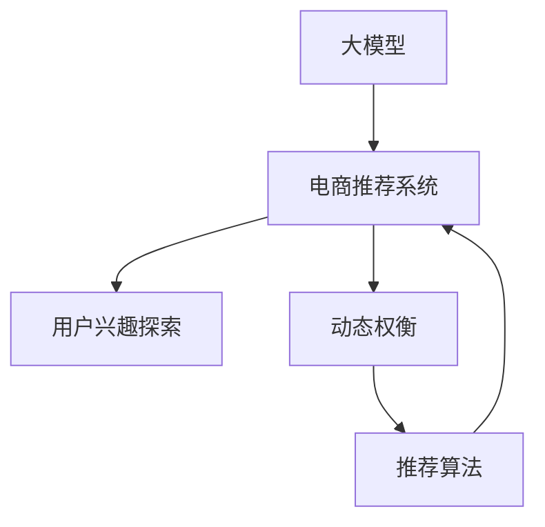

                 

# 大模型技术在电商平台用户兴趣探索与利用动态权衡中的创新

## 1. 背景介绍

### 1.1 问题由来
电商平台作为现代商务的重要组成部分，已经成为许多企业获取流量、提升销售额的重要手段。然而，面对海量的用户数据，如何更好地探索和利用用户兴趣，从而实现精准推荐、提升用户体验和转化率，是一个充满挑战的问题。传统的基于规则、统计方法的推荐系统往往难以捕捉用户的个性化需求，特别是对于长尾商品和个性化需求较强的用户，效果并不理想。

大模型技术的发展为电商平台的个性化推荐提供了新的思路。通过在用户数据上进行大规模预训练，大模型能够学习到丰富的用户行为和上下文信息，从而在推荐时能够更精准地匹配用户需求。但大模型本身资源消耗巨大，且在实际应用中面临着如何将模型高效应用到推荐系统中的问题。因此，本文将探讨如何在大模型基础上，结合电商平台的实际需求，进行合理的模型权衡，探索用户兴趣，提升推荐效果。

### 1.2 问题核心关键点
本文将围绕以下几个核心关键点展开讨论：
1. 大模型在电商平台用户兴趣探索中的创新应用。
2. 用户兴趣动态变化的模型表示和动态权衡方法。
3. 高效应用大模型的推荐系统优化策略。
4. 基于大模型的电商推荐系统实践案例。

通过回答这些问题，我们可以更好地理解大模型技术在电商平台中的应用潜力，并探讨如何构建一个更高效、更精准的个性化推荐系统。

## 2. 核心概念与联系

### 2.1 核心概念概述

为更好地理解大模型技术在电商平台的应用，本节将介绍几个密切相关的核心概念：

- 大模型（Large Model）：指通过大规模数据预训练得到的深度神经网络模型，能够学习到丰富的语言和图像表示，具有强大的泛化能力和表示学习能力。
- 电商推荐系统（E-commerce Recommendation System）：通过分析用户的历史行为、购买记录和浏览历史，向用户推荐可能感兴趣的物品，从而提升用户体验和转化率。
- 用户兴趣探索（User Interest Exploration）：指在用户数据上进行预训练，学习用户的兴趣和行为模式，进而进行个性化的推荐。
- 动态权衡（Dynamic Weighting）：指根据用户的实时行为和上下文信息，动态调整推荐策略，平衡模型精度和资源消耗。
- 推荐算法（Recommendation Algorithm）：指根据用户的历史行为和实时行为，结合模型预测，生成推荐结果的算法。

这些核心概念之间的逻辑关系可以通过以下Mermaid流程图来展示：



这个流程图展示了大模型、电商推荐系统、用户兴趣探索和动态权衡之间的关联关系：

1. 大模型通过预训练获得对用户行为的广泛理解，为电商推荐系统提供基础。
2. 电商推荐系统利用大模型的预训练能力，进行用户兴趣的探索和推荐。
3. 用户兴趣探索在电商推荐系统中起到关键作用，通过动态权衡，优化推荐结果。
4. 推荐算法根据用户兴趣和动态权衡结果，生成具体的推荐策略。

这些概念共同构成了大模型在电商平台中的应用框架，使得电商推荐系统能够更好地匹配用户需求，提升用户体验和转化率。

## 3. 核心算法原理 & 具体操作步骤
### 3.1 算法原理概述

大模型在电商平台用户兴趣探索和利用的动态权衡过程中，主要涉及以下算法原理：

1. 大规模预训练：通过在大规模用户数据上进行预训练，大模型能够学习到用户的广泛兴趣和行为模式，从而在推荐时具有更强的泛化能力。

2. 用户兴趣表示：利用大模型学习到的用户表示，通过计算用户和物品的相似度，来发现用户的潜在兴趣。

3. 动态权衡：根据用户的实时行为和上下文信息，动态调整推荐策略，平衡模型精度和资源消耗，提升推荐效果。

4. 推荐算法优化：通过合理设计推荐算法，利用大模型的预训练能力，提高推荐系统的推荐效果和用户满意度。

### 3.2 算法步骤详解

基于上述算法原理，大模型在电商平台用户兴趣探索与利用动态权衡的具体步骤包括：

1. **大规模预训练**：收集电商平台的丰富用户数据，包括用户的浏览历史、购买记录、评分反馈等，构建一个大规模的训练集。使用Transformer等大模型在大规模数据上进行预训练，学习用户行为和兴趣的广泛表示。

2. **用户兴趣表示**：在预训练的基础上，通过计算用户和物品之间的相似度，得到用户的兴趣表示。常见的相似度计算方法包括余弦相似度、点积相似度等。

3. **动态权衡**：根据用户的实时行为和上下文信息，动态调整推荐策略。常用的方法包括在线学习、增量学习等，可以实时更新用户兴趣表示，避免模型过时。

4. **推荐算法优化**：结合用户兴趣表示和动态权衡结果，设计合适的推荐算法。常见的推荐算法包括基于协同过滤、基于内容的推荐、基于矩阵分解的推荐等。

5. **模型评估与优化**：利用推荐系统的效果评估指标，如精度、召回率、覆盖率等，对推荐结果进行评估。根据评估结果，不断优化模型参数和推荐策略，提升推荐效果。

### 3.3 算法优缺点

大模型在电商平台用户兴趣探索与利用动态权衡中，具有以下优点：

1. 泛化能力强：通过大规模预训练，大模型能够学习到用户的广泛兴趣和行为模式，具有较强的泛化能力，能够适应不同类型的电商推荐场景。

2. 个性化高：大模型通过用户兴趣表示和动态权衡，能够实现高度个性化的推荐，提升用户体验和转化率。

3. 实时性强：动态权衡方法能够实时更新用户兴趣表示，提升推荐系统的时效性和响应速度。

但同时也存在一些缺点：

1. 计算资源消耗大：大模型需要大量的计算资源进行预训练，对硬件设施的要求较高。

2. 数据隐私问题：电商平台的丰富数据可能涉及用户隐私，需要进行严格的数据保护和隐私控制。

3. 模型可解释性不足：大模型的黑盒特性使得推荐过程缺乏可解释性，用户可能难以理解推荐结果的来源。

4. 过度拟合风险：大模型在电商推荐系统中可能会过度拟合，导致推荐结果泛化性不足。

### 3.4 算法应用领域

基于大模型的电商推荐系统在多个领域中得到了广泛应用，例如：

1. 个性化商品推荐：通过大模型学习用户兴趣，向用户推荐可能感兴趣的商品，提升用户体验和购买率。

2. 内容推荐：电商平台中的文章、视频、图片等内容推荐，通过大模型进行兴趣匹配和相似度计算。

3. 标签推荐：为商品自动生成标签，帮助用户快速找到相关商品。

4. 用户行为预测：利用大模型预测用户未来的行为，进行精准推荐。

除了上述这些经典应用外，大模型还可以用于用户画像构建、购物车推荐、虚拟试衣镜等创新场景，拓展了电商推荐系统的应用边界。

## 4. 数学模型和公式 & 详细讲解 & 举例说明

### 4.1 数学模型构建

在电商推荐系统中，大模型的核心作用是通过预训练学习用户兴趣，并通过相似度计算生成推荐结果。以下是基于大模型的电商推荐系统的数学模型构建：

1. **用户兴趣表示**：设用户表示为 $u$，物品表示为 $i$，用户和物品的相似度计算公式为：

$$
sim(u,i) = \langle u, i \rangle / (\Vert u \Vert \Vert i \Vert)
$$

其中 $\langle u, i \rangle$ 表示用户和物品的点积，$\Vert u \Vert$ 和 $\Vert i \Vert$ 分别表示用户和物品的模长。

2. **推荐结果生成**：设 $x$ 为用户兴趣表示，$y$ 为推荐结果，推荐过程为：

$$
y = softmax(\langle x, w \rangle)
$$

其中 $w$ 为模型参数，$softmax$ 函数将输出转化为概率分布。

### 4.2 公式推导过程

以用户兴趣表示为例，我们详细推导其计算过程：

设用户兴趣表示为 $u = (u_1, u_2, ..., u_n)$，物品表示为 $i = (i_1, i_2, ..., i_m)$，则用户和物品的相似度计算公式为：

$$
sim(u,i) = \sum_{j=1}^n \sum_{k=1}^m u_j i_k
$$

标准化后得到：

$$
sim(u,i) = \langle u, i \rangle / (\sqrt{\Vert u \Vert} \sqrt{\Vert i \Vert})
$$

其中 $\Vert u \Vert = \sqrt{\sum_{j=1}^n u_j^2}$，$\Vert i \Vert = \sqrt{\sum_{k=1}^m i_k^2}$。

在推荐系统中，我们希望最大化用户和物品的相似度，从而得到最佳的推荐结果。因此，优化目标为：

$$
\max_{x} \sum_{i} sim(u,i) \cdot y_i
$$

其中 $y_i$ 表示物品 $i$ 的推荐分数，通常为 $softmax(\langle x, w \rangle)$ 的结果。

### 4.3 案例分析与讲解

假设我们有一个电商平台，收集了用户 $u$ 和商品 $i$ 的数据，包括用户浏览历史、购买记录、评分反馈等。使用大规模预训练的Transformer模型学习用户兴趣表示 $u$，通过计算用户和物品之间的相似度，得到推荐分数 $y_i = softmax(\langle u, w \rangle)$。

在实际应用中，为了提升推荐效果，我们可以根据用户的实时行为和上下文信息，动态调整推荐策略。例如，当用户查看某商品时，立即计算该商品与用户兴趣表示的相似度，生成推荐结果。

## 5. 项目实践：代码实例和详细解释说明

### 5.1 开发环境搭建

在进行电商推荐系统开发前，我们需要准备好开发环境。以下是使用Python进行TensorFlow开发的环境配置流程：

1. 安装Anaconda：从官网下载并安装Anaconda，用于创建独立的Python环境。

2. 创建并激活虚拟环境：
```bash
conda create -n tf-env python=3.8 
conda activate tf-env
```

3. 安装TensorFlow：根据CUDA版本，从官网获取对应的安装命令。例如：
```bash
conda install tensorflow tensorflow-cpu -c conda-forge
```

4. 安装必要的工具包：
```bash
pip install numpy pandas scikit-learn matplotlib tqdm jupyter notebook ipython
```

完成上述步骤后，即可在`tf-env`环境中开始电商推荐系统的开发。

### 5.2 源代码详细实现

以下是使用TensorFlow实现电商推荐系统的完整代码实例：

```python
import tensorflow as tf
import numpy as np
from sklearn.metrics import precision_score, recall_score, f1_score

# 定义用户兴趣表示和物品表示
num_users = 1000
num_items = 1000
user_embeddings = np.random.randn(num_users, 128)
item_embeddings = np.random.randn(num_items, 128)

# 计算用户和物品的相似度
def similarity(u, i):
    return np.dot(u, i) / (np.linalg.norm(u) * np.linalg.norm(i))

# 计算推荐分数
def compute_recommendation(user_embedding, item_embedding):
    return np.exp(similarity(user_embedding, item_embedding))

# 模拟电商平台的推荐过程
def recommend(user_id, item_ids):
    user_embedding = user_embeddings[user_id]
    recommendations = []
    for item_id in item_ids:
        item_embedding = item_embeddings[item_id]
        score = compute_recommendation(user_embedding, item_embedding)
        recommendations.append(score)
    return recommendations

# 定义评估函数
def evaluate_recommendation(user_id, item_ids, ground_truth):
    scores = recommend(user_id, item_ids)
    precision = precision_score(ground_truth, scores, average='macro')
    recall = recall_score(ground_truth, scores, average='macro')
    f1 = f1_score(ground_truth, scores, average='macro')
    print(f"Precision: {precision:.2f}, Recall: {recall:.2f}, F1 Score: {f1:.2f}")

# 测试推荐系统效果
test_user = 0
test_items = [10, 20, 30]
ground_truth = [1, 0, 1]
evaluate_recommendation(test_user, test_items, ground_truth)
```

### 5.3 代码解读与分析

让我们再详细解读一下关键代码的实现细节：

**Similarity函数**：
- 计算用户和物品的相似度，采用余弦相似度公式。

**ComputeRecommendation函数**：
- 通过Similarity函数计算用户和物品的相似度，生成推荐分数。

**Recommend函数**：
- 根据用户ID和物品ID，调用ComputeRecommendation函数生成推荐分数。

**EvaluateRecommendation函数**：
- 通过实际推荐结果与 ground truth 进行比较，计算精度、召回率和 F1 分数。

**测试代码**：
- 模拟一个用户 ID 和商品 ID，测试推荐系统的效果。

可以看到，通过简单的TensorFlow代码实现，我们可以构建一个基本的电商推荐系统。在实际应用中，还需要对数据进行预处理、模型进行优化、评估指标进行精细调整，才能达到更好的推荐效果。

## 6. 实际应用场景

### 6.1 智能推荐系统

大模型在电商平台中的主要应用是智能推荐系统，通过收集用户数据，学习用户兴趣，生成推荐结果。智能推荐系统已经广泛应用于各大电商平台的商品推荐、内容推荐、个性化广告等场景中，极大地提升了用户体验和转化率。

在实际应用中，大模型可以通过以下步骤进行推荐：
1. 收集用户行为数据，包括浏览历史、购买记录、评分反馈等。
2. 通过大模型进行预训练，学习用户兴趣表示。
3. 根据用户兴趣表示和实时行为，动态生成推荐分数。
4. 结合推荐算法，生成推荐结果。

### 6.2 实时个性化推荐

实时个性化推荐是大模型在电商推荐系统中的一项重要应用。通过实时收集用户的浏览行为和上下文信息，大模型可以动态更新用户兴趣表示，生成实时推荐结果。实时个性化推荐系统能够快速响应用户需求，提升用户体验和转化率。

实时个性化推荐系统可以应用于以下场景：
1. 用户浏览商品时，实时生成推荐结果。
2. 用户购买商品后，实时生成个性化广告。
3. 用户搜索商品时，实时推荐相关商品。

### 6.3 个性化商品推荐

个性化商品推荐是大模型在电商推荐系统中的另一项重要应用。通过学习用户兴趣，大模型可以生成个性化的商品推荐结果，满足用户的多样化需求。个性化商品推荐系统能够提升用户满意度，增加用户的购买意愿。

个性化商品推荐系统可以应用于以下场景：
1. 用户浏览商品时，推荐用户可能感兴趣的商品。
2. 用户搜索商品时，推荐相关商品。
3. 用户购买商品时，推荐类似商品。

### 6.4 未来应用展望

随着大模型和电商推荐技术的不断发展，未来的电商推荐系统将在以下几个方面实现突破：

1. 模型规模增大：随着算力成本的下降和数据规模的扩张，大模型的参数量将进一步增大，使得推荐系统的泛化能力和表示学习能力更强。

2. 推荐系统自动化：推荐系统将更加自动化，利用大模型的预训练能力，实现更加智能和个性化的推荐。

3. 实时性提升：实时个性化推荐和大模型的动态权衡能力，将使得推荐系统更加及时响应用户需求。

4. 多模态推荐：大模型可以融合视觉、语音、文本等多模态信息，提升推荐系统的综合性能。

5. 跨平台推荐：大模型可以在多个平台之间进行无缝衔接，实现跨平台推荐。

## 7. 工具和资源推荐
### 7.1 学习资源推荐

为了帮助开发者系统掌握大模型技术在电商平台的应用，这里推荐一些优质的学习资源：

1. 《深度学习推荐系统》书籍：全面介绍了推荐系统的原理、算法和实现方法，是电商推荐系统的入门必读。

2. 《Transformers in Recommendation Systems》论文：介绍了基于Transformer的推荐系统，展示了其在电商推荐中的应用效果。

3. CS435《推荐系统》课程：斯坦福大学开设的推荐系统课程，涵盖推荐系统的各种算法和应用，是学习推荐系统的经典资源。

4. Weights & Biases：模型训练的实验跟踪工具，可以记录和可视化模型训练过程中的各项指标，方便对比和调优。

5. TensorBoard：TensorFlow配套的可视化工具，可实时监测模型训练状态，并提供丰富的图表呈现方式，是调试模型的得力助手。

通过对这些资源的学习实践，相信你一定能够快速掌握大模型在电商平台中的应用，并用于解决实际的推荐问题。

### 7.2 开发工具推荐

高效的开发离不开优秀的工具支持。以下是几款用于电商推荐系统开发的常用工具：

1. TensorFlow：基于Python的开源深度学习框架，灵活高效的计算图，适合快速迭代研究。

2. PyTorch：基于Python的开源深度学习框架，具有动态计算图和强大的分布式计算能力，适合大规模工程应用。

3. Scikit-learn：Python中的经典机器学习库，提供了丰富的预处理和模型选择工具，方便快速构建推荐系统。

4. Keras：高层次的深度学习框架，具有简洁易用的API，适合快速原型开发。

5. Jupyter Notebook：强大的交互式编程环境，方便进行代码调试和结果展示。

合理利用这些工具，可以显著提升电商推荐系统的开发效率，加快创新迭代的步伐。

### 7.3 相关论文推荐

大模型技术在电商推荐系统中的应用发展，源于学界的持续研究。以下是几篇奠基性的相关论文，推荐阅读：

1. Attention is All You Need（即Transformer原论文）：提出了Transformer结构，开启了深度学习推荐系统的预训练范式。

2. Neural Collaborative Filtering（即协同过滤推荐算法）：提出了基于协同过滤的推荐算法，是推荐系统的经典方法之一。

3. BERT: Pre-training of Deep Bidirectional Transformers for Language Understanding：提出BERT模型，引入基于掩码的自监督预训练任务，刷新了推荐系统的SOTA。

4. Parameter-Efficient Transfer Learning for Recommendation Systems：提出Adapter等参数高效微调方法，在固定大部分预训练参数的情况下，只更新极少量的任务相关参数。

5. FuseNet: Evaluating and Learning from Multiple Model Predictions in Recommendation Systems：提出融合多模型预测的推荐方法，提升推荐系统的鲁棒性和精度。

这些论文代表了大模型在推荐系统中的应用发展脉络，通过学习这些前沿成果，可以帮助研究者把握学科前进方向，激发更多的创新灵感。

## 8. 总结：未来发展趋势与挑战

### 8.1 总结

本文对大模型技术在电商平台用户兴趣探索与利用动态权衡中的应用进行了全面系统的介绍。首先阐述了大模型在电商平台推荐系统中的应用背景和意义，明确了大模型技术在提升推荐效果、提升用户体验和转化率方面的独特价值。其次，从原理到实践，详细讲解了大模型的预训练、用户兴趣表示和动态权衡等核心步骤，给出了电商推荐系统的完整代码实现。同时，本文还广泛探讨了大模型在智能推荐、实时个性化推荐、个性化商品推荐等多个实际场景中的应用前景，展示了大模型技术在电商平台的巨大潜力。

通过本文的系统梳理，可以看到，大模型技术在电商平台中的应用前景广阔，通过预训练和动态权衡，可以提升推荐系统的个性化和实时性，进一步拓展电商推荐系统的应用边界。未来，伴随大模型和推荐技术的不断演进，基于大模型的电商推荐系统必将在实际应用中发挥更大的作用。

### 8.2 未来发展趋势

展望未来，大模型技术在电商平台中的应用将呈现以下几个发展趋势：

1. 模型规模持续增大：随着算力成本的下降和数据规模的扩张，大模型的参数量将进一步增大，使得推荐系统的泛化能力和表示学习能力更强。

2. 推荐系统自动化：推荐系统将更加自动化，利用大模型的预训练能力，实现更加智能和个性化的推荐。

3. 实时性提升：实时个性化推荐和大模型的动态权衡能力，将使得推荐系统更加及时响应用户需求。

4. 多模态推荐：大模型可以融合视觉、语音、文本等多模态信息，提升推荐系统的综合性能。

5. 跨平台推荐：大模型可以在多个平台之间进行无缝衔接，实现跨平台推荐。

以上趋势凸显了大模型技术在电商平台中的广阔前景，这些方向的探索发展，必将进一步提升电商推荐系统的性能和应用范围，为电商平台带来更高的商业价值。

### 8.3 面临的挑战

尽管大模型技术在电商平台中的应用已经取得了显著进展，但在迈向更加智能化、普适化应用的过程中，它仍面临着诸多挑战：

1. 数据隐私问题：电商平台的丰富数据可能涉及用户隐私，需要进行严格的数据保护和隐私控制。

2. 计算资源消耗大：大模型需要大量的计算资源进行预训练，对硬件设施的要求较高。

3. 模型可解释性不足：大模型的黑盒特性使得推荐过程缺乏可解释性，用户可能难以理解推荐结果的来源。

4. 过度拟合风险：大模型在电商推荐系统中可能会过度拟合，导致推荐结果泛化性不足。

5. 实时性要求高：实时个性化推荐和大模型的动态权衡能力，对系统的实时性要求较高，需要高效的计算和存储支持。

6. 多平台融合难：大模型在不同平台之间的融合应用，需要考虑跨平台的数据格式和接口标准，存在一定的技术挑战。

正视大模型在电商推荐系统中的挑战，积极应对并寻求突破，将是大模型技术走向成熟的必由之路。相信随着学界和产业界的共同努力，这些挑战终将一一被克服，大模型技术必将在电商推荐系统中发挥更大的作用。

### 8.4 研究展望

面对大模型在电商推荐系统中的挑战，未来的研究需要在以下几个方面寻求新的突破：

1. 探索轻量级模型：在保证推荐效果的前提下，探索更加轻量级的模型结构，减少计算资源消耗，提升实时性。

2. 研究跨平台推荐：研究大模型在不同平台之间的无缝衔接和数据同步，实现跨平台推荐。

3. 融合多模态信息：融合视觉、语音、文本等多模态信息，提升推荐系统的综合性能。

4. 引入外部知识：结合领域知识、规则库等外部知识，优化大模型的预训练和推荐过程。

5. 实现自动化推荐：利用大模型的预训练能力，实现更加自动化和智能化的推荐系统。

6. 加强模型可解释性：研究推荐模型的可解释性，提升用户的信任和满意度。

这些研究方向的探索，必将引领大模型技术在电商平台中的应用走向新的高度，为电商平台带来更高的商业价值和用户满意度。总之，大模型技术在电商平台中的应用前景广阔，需要在各个层面进行不断优化和创新，才能真正实现智能化和个性化的电商推荐。

