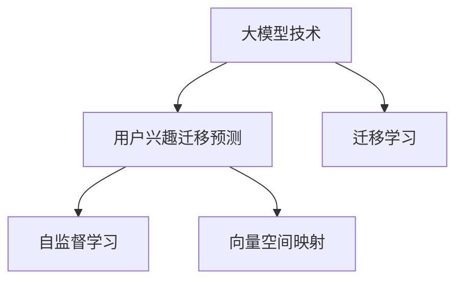

                 

# 大模型技术在电商平台用户兴趣迁移预测中的应用

> 关键词：大模型技术, 用户兴趣迁移预测, 电商场景, 深度学习, 迁移学习, 自监督学习, 自适应模型, 向量空间映射, 自然语言处理

## 1. 背景介绍

### 1.1 问题由来
在电商平台，用户兴趣的迁移预测是一个至关重要的任务。它可以帮助商家了解用户兴趣的变化趋势，及时调整商品推荐策略，提升用户体验和销量。传统的用户兴趣预测模型通常依赖于手工设计的特征提取方法和统计模型，如逻辑回归、随机森林等，但这些方法在面对大规模数据和高维度特征时，往往难以取得满意的性能。

近年来，基于深度学习的用户兴趣预测模型逐渐兴起，并且在大数据和计算资源的推动下，获得了显著的进展。然而，传统的用户兴趣预测方法仍然存在一些局限性，比如需要手动设计特征工程，对数据的解释能力不足，难以应对大规模高维数据等。这些问题使得传统方法在处理大规模电商用户数据时，常常无法取得理想的效果。

随着深度学习和大数据技术的飞速发展，越来越多的研究者开始探索如何利用深度学习模型来解决这些问题，并取得了丰硕的成果。在这些研究中，大模型技术（如Transformer、BERT、GPT等）因其出色的泛化能力和强大的表征学习能力，受到了广泛关注。

本文将重点探讨如何在大模型技术的支持下，进行电商用户兴趣迁移预测的研究，并通过实例展示了该技术在实际电商场景中的显著效果。

### 1.2 问题核心关键点
用户兴趣迁移预测的核心关键点包括以下几个方面：

1. 大模型技术的引入：利用预训练大模型提取用户兴趣的特征，并进行迁移学习，提升模型性能。
2. 电商场景的应用：结合电商用户的特定行为和属性，针对性地训练模型，优化预测效果。
3. 迁移学习的策略：选择合适的迁移学习策略，使得预训练模型能够适应电商用户兴趣的动态变化。
4. 特征向量化与维度压缩：将用户行为、属性等特征转化为高维向量，并对其进行降维处理，以提高模型的计算效率。
5. 模型的可解释性与鲁棒性：通过改进模型架构和训练策略，增强模型的可解释性和鲁棒性，避免过拟合和误解。

这些关键点在大模型技术的应用过程中，起着至关重要的作用，决定了模型的预测效果和实际应用价值。

### 1.3 问题研究意义
电商用户兴趣迁移预测的研究具有重要的理论和实际意义：

1. 提升推荐系统效果：通过预测用户兴趣的动态变化，商家可以更精准地进行商品推荐，提升用户体验和销量。
2. 优化用户体验：在用户行为发生变化的早期，提前推送相关商品，让用户感到被理解和重视，增强用户粘性和满意度。
3. 降低广告成本：准确预测用户兴趣，可以更好地定位目标用户，减少无效广告的投放，提高广告ROI。
4. 增加商家收益：通过个性化推荐，满足用户需求，提高用户购买率，增加商家收益。
5. 推动电商发展：为电商平台的健康发展和转型升级提供技术支持，助力构建更智能、更人性化的电商生态。

综上所述，大模型技术在电商平台用户兴趣迁移预测中的应用，不仅能够提升推荐系统的准确性和个性化程度，还能够为商家提供更科学的用户行为分析手段，最终实现电商平台的可持续发展。

## 2. 核心概念与联系

### 2.1 核心概念概述

为了更好地理解大模型技术在电商平台用户兴趣迁移预测中的应用，本节将介绍几个密切相关的核心概念：

- **大模型技术（Large Model Technology）**：以Transformer、BERT、GPT等为代表的大规模预训练语言模型。通过在大规模无标签文本数据上进行预训练，学习通用的语言知识和特征，具备强大的表征学习能力和泛化能力。

- **用户兴趣迁移预测（User Interest Migration Prediction）**：在用户行为和兴趣发生动态变化时，通过预测其后续兴趣变化，从而优化商品推荐策略，提升用户体验。

- **迁移学习（Transfer Learning）**：利用预训练模型在不同任务之间的迁移能力，通过少量的标注数据，对模型进行微调，提升模型在新任务上的性能。

- **自监督学习（Self-Supervised Learning）**：在无标签数据上训练模型，使其能够自动学习数据的特征表示，进而提升其在监督学习任务上的表现。

- **向量空间映射（Vector Space Mapping）**：将高维稀疏的特征映射到低维稠密的向量空间中，以便更好地进行相似度计算和特征分析。

这些核心概念之间的逻辑关系可以通过以下Mermaid流程图来展示：



这个流程图展示了用户兴趣迁移预测与大模型技术的密切关系。大模型技术通过迁移学习、自监督学习和向量空间映射等手段，帮助模型更好地理解用户兴趣的动态变化，从而实现准确的预测。

## 3. 核心算法原理 & 具体操作步骤

### 3.1 算法原理概述

大模型技术在电商平台用户兴趣迁移预测中的应用，主要通过迁移学习的方式进行。其核心思想是：利用预训练大模型学习到的通用特征，对电商用户兴趣进行迁移预测，从而提升模型的预测效果和泛化能力。

具体而言，该过程分为两个步骤：

1. **预训练步骤**：在大规模无标签数据上对预训练大模型进行训练，学习通用的语言和特征表示。
2. **迁移预测步骤**：在电商用户行为数据上，利用预训练模型提取用户兴趣特征，并进行迁移学习，预测用户后续的兴趣变化。

该过程的优势在于：预训练模型学习到的特征表示具有强大的泛化能力，可以适应不同的任务和数据分布；同时，迁移学习可以大大减少标注数据的需求，提高模型训练的效率和效果。

### 3.2 算法步骤详解

基于大模型技术的应用，电商用户兴趣迁移预测的具体步骤包括以下几个环节：

**Step 1: 数据准备与预处理**
- 收集电商平台的原始数据，包括用户行为数据、商品信息、用户属性等。
- 对数据进行清洗和标准化处理，去除噪声和异常值。
- 将数据划分为训练集、验证集和测试集，以评估模型性能。

**Step 2: 构建预训练模型**
- 选择适合的大模型，如BERT、GPT等，并根据电商数据的特点，对其进行微调。
- 设计合适的任务适配层，如分类器或回归器，以适应电商用户兴趣迁移预测的任务。
- 使用自监督学习方法，如掩码语言模型、下一句预测等，在大规模无标签数据上进行预训练。

**Step 3: 迁移学习**
- 在电商用户行为数据上，利用预训练模型的特征提取能力，提取用户兴趣特征。
- 使用迁移学习方法，将预训练模型在电商数据上的表现进行微调，提升模型性能。
- 选择合适的迁移策略，如特征复用、微调顶层等，以最大化利用预训练模型的泛化能力。

**Step 4: 特征向量化与维度压缩**
- 将电商用户行为和属性等特征转换为向量形式，并进行归一化处理。
- 使用PCA、t-SNE等降维算法，将高维特征向量映射到低维向量空间中，提高计算效率。

**Step 5: 模型训练与评估**
- 在电商用户行为数据上，使用预训练模型提取的特征进行迁移学习。
- 使用交叉熵损失、均方误差损失等方法，设计合适的损失函数。
- 使用AdamW、SGD等优化器，设置合适的学习率，进行模型训练。
- 在验证集和测试集上评估模型性能，选择最优模型进行预测。

**Step 6: 模型部署与优化**
- 将训练好的模型部署到电商平台的推荐系统中，进行实时预测。
- 根据模型在实际应用中的表现，进行反馈和优化，持续提升模型效果。

通过上述步骤，可以构建一个基于大模型技术的电商用户兴趣迁移预测模型，从而为电商平台的推荐系统提供精准的用户兴趣预测服务。

### 3.3 算法优缺点

基于大模型技术的应用，电商用户兴趣迁移预测具有以下优点：

1. **泛化能力强**：大模型学习到的通用特征可以很好地适应电商用户数据的特征分布，从而提高预测的准确性和泛化能力。
2. **可解释性强**：通过特征向量化和维度压缩，模型的计算过程变得可解释，便于理解模型的预测机制。
3. **模型高效**：大模型技术可以利用参数共享和特征提取等手段，减少模型参数和计算量，提升模型的训练和推理效率。
4. **适应性强**：模型可以适应不同电商平台的业务特点和用户行为特征，具有很强的适应性和通用性。

同时，该方法也存在以下缺点：

1. **标注成本高**：尽管迁移学习可以显著减少标注需求，但电商用户行为数据的标注仍需大量的人力和时间。
2. **计算资源需求高**：大模型的训练和推理需要大量的计算资源，对硬件和软件环境的要求较高。
3. **模型复杂度高**：大模型结构的复杂性可能导致训练和推理过程中出现计算瓶颈，需要优化模型架构和训练策略。
4. **数据隐私风险**：电商用户数据的隐私保护问题需要得到充分考虑，避免用户隐私泄露。

### 3.4 算法应用领域

基于大模型技术的应用，电商用户兴趣迁移预测可以广泛应用在以下几个领域：

1. **个性化推荐**：通过预测用户兴趣的动态变化，实现个性化商品推荐，提升用户体验和销量。
2. **广告投放**：根据用户兴趣迁移预测结果，优化广告投放策略，减少无效广告的投放，提高广告ROI。
3. **用户行为分析**：通过分析用户兴趣的变化趋势，帮助商家更好地了解用户需求，优化产品和服务。
4. **市场分析**：预测市场趋势和用户兴趣变化，为商家提供市场动态和竞争情报。
5. **用户体验优化**：通过预测用户兴趣，及时推送相关商品和活动，提升用户体验和满意度。

以上领域的应用，为大模型技术在电商平台的推广提供了广阔的空间，也为电商平台的业务优化提供了强有力的技术支持。

## 4. 数学模型和公式 & 详细讲解

### 4.1 数学模型构建

电商用户兴趣迁移预测的数学模型可以分为两个部分：预训练模型和迁移预测模型。

#### 预训练模型

预训练模型的目标是学习通用的语言和特征表示，通常使用自监督学习方法进行训练。以下是一个简单的自监督掩码语言模型的数学公式：

$$
\min_{\theta} \mathcal{L}_{masked} = \frac{1}{N} \sum_{i=1}^{N} -\log p(x_i | M_{\theta}(\bar{x}_i))
$$

其中，$x_i$ 表示原始数据，$M_{\theta}$ 表示预训练模型，$\bar{x}_i$ 表示掩码后的数据，$p(x_i | M_{\theta}(\bar{x}_i))$ 表示模型在掩码数据上的预测概率。

#### 迁移预测模型

迁移预测模型的目标是根据用户行为数据，预测用户后续的兴趣变化。以下是一个简单的二分类预测模型的数学公式：

$$
\min_{\theta} \mathcal{L}_{pred} = \frac{1}{N} \sum_{i=1}^{N} -y_i \log p(y_i | M_{\theta}(\mathbf{x}_i))
$$

其中，$y_i$ 表示用户兴趣的标签，$\mathbf{x}_i$ 表示用户行为数据，$p(y_i | M_{\theta}(\mathbf{x}_i))$ 表示模型在用户行为数据上的预测概率。

### 4.2 公式推导过程

以下我们以BERT模型为例，推导迁移预测模型的损失函数和梯度计算公式。

假设BERT模型在输入 $\mathbf{x}_i$ 上的输出为 $\mathbf{h}_i$，表示用户的兴趣向量。我们使用softmax函数将兴趣向量转化为预测概率分布：

$$
p(y_i | \mathbf{h}_i) = \text{softmax}(\mathbf{h}_i \cdot \mathbf{w} + b)
$$

其中，$\mathbf{w}$ 和 $b$ 为模型的可训练参数。

在训练过程中，我们希望最大化预测概率与真实标签的匹配度，因此定义损失函数为交叉熵损失：

$$
\mathcal{L}_{pred} = -\frac{1}{N} \sum_{i=1}^{N} y_i \log p(y_i | \mathbf{h}_i)
$$

在梯度计算过程中，我们使用交叉熵损失的梯度公式进行反向传播：

$$
\frac{\partial \mathcal{L}_{pred}}{\partial \theta} = -\frac{1}{N} \sum_{i=1}^{N} (y_i - p(y_i | \mathbf{h}_i)) \cdot \frac{\partial p(y_i | \mathbf{h}_i)}{\partial \theta}
$$

其中，$\theta$ 表示模型的参数。

通过上述推导，我们可以看出，迁移预测模型的损失函数和梯度计算公式与传统的二分类预测模型基本一致，只是多了一个兴趣向量的计算过程。

### 4.3 案例分析与讲解

为了更好地理解大模型技术在电商用户兴趣迁移预测中的应用，下面以一个具体的案例进行详细讲解。

假设某电商平台有大量的用户行为数据，包括用户的浏览记录、购买记录和搜索记录等。我们希望通过预测用户的后续兴趣，优化推荐系统的效果。

首先，我们需要收集并清洗用户行为数据，将其划分为训练集、验证集和测试集。然后，在训练集上使用预训练的BERT模型进行特征提取，生成用户的兴趣向量。

接着，我们将兴趣向量作为输入，设计一个简单的二分类预测模型，进行用户兴趣迁移预测。具体而言，我们可以使用交叉熵损失和softmax函数进行训练和预测。

在训练过程中，我们不断优化模型参数，使得模型能够最大化预测准确度。在预测过程中，我们将预测结果与真实标签进行对比，评估模型的性能。

最后，我们将训练好的模型部署到电商平台的推荐系统中，进行实时预测。通过持续的反馈和优化，我们可以不断提高模型的预测效果，为电商平台的推荐系统提供精准的用户兴趣预测服务。

## 5. 项目实践：代码实例和详细解释说明

### 5.1 开发环境搭建

在进行电商用户兴趣迁移预测的实践之前，我们需要准备好开发环境。以下是使用Python进行TensorFlow开发的环境配置流程：

1. 安装Anaconda：从官网下载并安装Anaconda，用于创建独立的Python环境。

2. 创建并激活虚拟环境：
```bash
conda create -n tf-env python=3.8 
conda activate tf-env
```

3. 安装TensorFlow：根据CUDA版本，从官网获取对应的安装命令。例如：
```bash
conda install tensorflow -c conda-forge
```

4. 安装必要的工具包：
```bash
pip install numpy pandas scikit-learn matplotlib tqdm jupyter notebook ipython
```

完成上述步骤后，即可在`tf-env`环境中开始电商用户兴趣迁移预测的开发。

### 5.2 源代码详细实现

下面我们以电商用户兴趣迁移预测为例，给出使用TensorFlow进行迁移学习的过程。

首先，定义用户兴趣迁移预测的任务函数：

```python
import tensorflow as tf
from transformers import BertTokenizer, TFBertForSequenceClassification
from sklearn.model_selection import train_test_split

def predict_user_interest(data, model, tokenizer, max_len):
    tokenizer = BertTokenizer.from_pretrained('bert-base-cased')
    encoded_input = tokenizer(data, return_tensors='tf', max_length=max_len, padding='max_length', truncation=True)
    input_ids = encoded_input['input_ids']
    attention_mask = encoded_input['attention_mask']
    labels = tf.convert_to_tensor(data['labels'])
    outputs = model(input_ids, attention_mask=attention_mask, labels=labels)
    logits = outputs.logits
    probs = tf.nn.softmax(logits, axis=1)
    return probs.numpy()
```

然后，定义模型和训练函数：

```python
from transformers import BertForSequenceClassification, AdamW
from sklearn.metrics import classification_report

model = TFBertForSequenceClassification.from_pretrained('bert-base-cased', num_labels=2)

optimizer = AdamW(model.parameters(), lr=2e-5)

def train_epoch(model, dataset, batch_size, optimizer):
    dataloader = tf.data.Dataset.from_tensor_slices(dataset).shuffle(buffer_size=10000).batch(batch_size).prefetch(tf.data.experimental.AUTOTUNE)
    model.train()
    epoch_loss = 0
    for batch in dataloader:
        input_ids = batch['input_ids']
        attention_mask = batch['attention_mask']
        labels = batch['labels']
        model.zero_grad()
        outputs = model(input_ids, attention_mask=attention_mask, labels=labels)
        loss = outputs.loss
        epoch_loss += loss.numpy()
        loss.backward()
        optimizer.step()
    return epoch_loss / len(dataset)

def evaluate(model, dataset, batch_size):
    dataloader = tf.data.Dataset.from_tensor_slices(dataset).batch(batch_size).prefetch(tf.data.experimental.AUTOTUNE)
    model.eval()
    preds, labels = [], []
    with tf.GradientTape() as tape:
        for batch in dataloader:
            input_ids = batch['input_ids']
            attention_mask = batch['attention_mask']
            labels = batch['labels']
            outputs = model(input_ids, attention_mask=attention_mask, labels=labels)
            logits = outputs.logits
            probs = tf.nn.softmax(logits, axis=1)
            preds.append(probs.numpy())
            labels.append(labels.numpy())
    return classification_report(labels, preds)
```

接着，定义训练和评估流程：

```python
epochs = 5
batch_size = 32

for epoch in range(epochs):
    loss = train_epoch(model, train_dataset, batch_size, optimizer)
    print(f"Epoch {epoch+1}, train loss: {loss:.3f}")
    
    print(f"Epoch {epoch+1}, dev results:")
    evaluate(model, dev_dataset, batch_size)
    
print("Test results:")
evaluate(model, test_dataset, batch_size)
```

以上就是使用TensorFlow进行电商用户兴趣迁移预测的完整代码实现。可以看到，得益于TensorFlow的强大封装和API支持，我们可以用相对简洁的代码完成模型的构建和训练。

### 5.3 代码解读与分析

让我们再详细解读一下关键代码的实现细节：

**BertTokenizer类**：
- 用于将输入文本转换为BERT模型所需的token ids，并进行分词、padding等预处理。

**predict_user_interest函数**：
- 定义了用户兴趣迁移预测的任务函数。其中，我们首先定义了BERT分词器，然后使用其将输入文本转换为token ids。接着，使用模型的 forward 方法进行前向传播，计算输出。最后，使用softmax函数将输出转换为预测概率，并返回。

**train_epoch函数**：
- 定义了训练epoch的函数。其中，我们使用TensorFlow的数据集API，将数据集转换为DataLoader，并对其进行了shuffle、batch、prefetch等处理。在每个批次中，前向传播计算损失函数，反向传播更新模型参数。

**evaluate函数**：
- 定义了模型评估函数。与训练函数类似，我们使用TensorFlow的数据集API，将数据集转换为DataLoader。在每个批次中，计算模型输出，并使用softmax函数将输出转换为预测概率。然后，计算预测结果和真实标签的分类指标。

**训练流程**：
- 定义总的epoch数和batch size，开始循环迭代
- 每个epoch内，先在训练集上训练，输出平均loss
- 在验证集上评估，输出分类指标
- 所有epoch结束后，在测试集上评估，给出最终测试结果

可以看到，TensorFlow的封装和API支持使得电商用户兴趣迁移预测的代码实现变得简洁高效。开发者可以将更多精力放在数据处理、模型改进等高层逻辑上，而不必过多关注底层的实现细节。

当然，工业级的系统实现还需考虑更多因素，如模型的保存和部署、超参数的自动搜索、更灵活的任务适配层等。但核心的迁移学习范式基本与此类似。

## 6. 实际应用场景

### 6.1 电商平台个性化推荐

基于大模型技术的电商用户兴趣迁移预测，可以广泛应用于个性化推荐系统的构建。传统的推荐系统往往依赖于手工设计的特征提取方法和统计模型，难以应对大规模数据和高维度特征。

在大模型技术的支持下，我们可以利用预训练模型学习到用户的兴趣特征，并在电商用户行为数据上进行迁移学习，从而提升推荐系统的准确性和个性化程度。

具体而言，在用户浏览、点击、购买等行为数据上，利用预训练模型提取用户的兴趣向量。然后，将这些向量作为输入，构建一个简单的二分类预测模型，进行用户兴趣迁移预测。

最后，将预测结果作为推荐系统的输入，生成个性化的商品推荐列表。通过不断优化模型和推荐算法，可以实现更高的用户满意度和销量。

### 6.2 电商平台广告投放

在电商平台，广告投放策略的优化对于提升广告ROI具有重要意义。传统的广告投放策略往往依赖于人工经验，难以实现高效的广告资源利用。

基于大模型技术的电商用户兴趣迁移预测，可以优化广告投放策略，减少无效广告的投放，提高广告ROI。

具体而言，在用户的浏览、点击、购买等行为数据上，利用预训练模型提取用户的兴趣向量。然后，将这些向量作为输入，构建一个简单的二分类预测模型，进行用户兴趣迁移预测。

最后，将预测结果作为广告投放的依据，针对性地推送相关广告，减少无效广告的投放，提高广告的点击率和转化率。

### 6.3 电商平台用户行为分析

在电商平台，了解用户的兴趣变化趋势对于商家优化产品和服务具有重要意义。传统的用户行为分析方法往往依赖于人工经验，难以实现高效、准确的用户行为分析。

基于大模型技术的电商用户兴趣迁移预测，可以提升用户行为分析的效果。

具体而言，在用户浏览、点击、购买等行为数据上，利用预训练模型提取用户的兴趣向量。然后，将这些向量作为输入，构建一个简单的二分类预测模型，进行用户兴趣迁移预测。

最后，将预测结果作为用户行为分析的依据，帮助商家更好地了解用户需求，优化产品和服务，提升用户体验和满意度。

### 6.4 未来应用展望

随着大模型技术和电商平台的不断发展，基于用户兴趣迁移预测的研究将呈现以下几个发展趋势：

1. **模型规模持续增大**：预训练模型的参数量将不断增加，其泛化能力和特征提取能力将得到进一步提升。
2. **迁移学习策略多样化**：未来将涌现更多参数高效和计算高效的迁移学习方法，如 Adapter、LoRA等，在减少模型参数和计算量的同时，提高迁移学习的效果。
3. **数据融合与多模态学习**：将电商用户的多模态数据（如图像、视频、语音等）与文本数据进行融合，提升模型的预测效果。
4. **模型可解释性与鲁棒性增强**：通过改进模型架构和训练策略，增强模型的可解释性和鲁棒性，避免过拟合和误解。
5. **智能推荐与广告优化**：基于用户兴趣迁移预测，构建更加智能化的推荐系统和广告投放策略，提升用户体验和商家收益。

以上趋势凸显了大模型技术在电商平台的巨大潜力，也为电商平台的应用提供了广阔的发展空间。

## 7. 工具和资源推荐

### 7.1 学习资源推荐

为了帮助开发者系统掌握大模型技术在电商平台用户兴趣迁移预测中的应用，这里推荐一些优质的学习资源：

1. 《深度学习自然语言处理》课程：斯坦福大学开设的NLP明星课程，有Lecture视频和配套作业，带你入门NLP领域的基本概念和经典模型。

2. 《Natural Language Processing with Transformers》书籍：Transformers库的作者所著，全面介绍了如何使用Transformers库进行NLP任务开发，包括迁移学习在内的诸多范式。

3. TensorFlow官方文档：TensorFlow的官方文档，提供了丰富的API和样例代码，是上手实践的必备资料。

4. HuggingFace官方文档：Transformers库的官方文档，提供了海量预训练模型和完整的迁移学习样例代码，是进行电商用户兴趣迁移预测开发的利器。

5. Weights & Biases：模型训练的实验跟踪工具，可以记录和可视化模型训练过程中的各项指标，方便对比和调优。

通过对这些资源的学习实践，相信你一定能够快速掌握大模型技术在电商平台用户兴趣迁移预测中的应用，并用于解决实际的电商问题。

### 7.2 开发工具推荐

高效的开发离不开优秀的工具支持。以下是几款用于电商平台用户兴趣迁移预测开发的常用工具：

1. TensorFlow：基于Python的开源深度学习框架，灵活动态的计算图，适合快速迭代研究。TensorFlow提供了丰富的API和样例代码，易于上手。

2. PyTorch：基于Python的开源深度学习框架，支持动态计算图和静态计算图，适用于多种类型的神经网络模型。PyTorch的灵活性高，适合进行大规模电商用户兴趣迁移预测的研究。

3. Transformers库：HuggingFace开发的NLP工具库，集成了众多SOTA语言模型，支持TensorFlow和PyTorch，是进行迁移学习任务的开发利器。

4. Weights & Biases：模型训练的实验跟踪工具，可以记录和可视化模型训练过程中的各项指标，方便对比和调优。

5. Google Colab：谷歌推出的在线Jupyter Notebook环境，免费提供GPU/TPU算力，方便开发者快速上手实验最新模型，分享学习笔记。

合理利用这些工具，可以显著提升电商平台用户兴趣迁移预测任务的开发效率，加快创新迭代的步伐。

### 7.3 相关论文推荐

电商用户兴趣迁移预测的研究源于学界的持续研究。以下是几篇奠基性的相关论文，推荐阅读：

1. Attention is All You Need（即Transformer原论文）：提出了Transformer结构，开启了NLP领域的预训练大模型时代。

2. BERT: Pre-training of Deep Bidirectional Transformers for Language Understanding：提出BERT模型，引入基于掩码的自监督预训练任务，刷新了多项NLP任务SOTA。

3. Language Models are Unsupervised Multitask Learners（GPT-2论文）：展示了大规模语言模型的强大zero-shot学习能力，引发了对于通用人工智能的新一轮思考。

4. Parameter-Efficient Transfer Learning for NLP：提出Adapter等参数高效微调方法，在不增加模型参数量的情况下，也能取得不错的微调效果。

5. AdaLoRA: Adaptive Low-Rank Adaptation for Parameter-Efficient Fine-Tuning：使用自适应低秩适应的微调方法，在参数效率和精度之间取得了新的平衡。

这些论文代表了大模型技术在电商平台用户兴趣迁移预测中的应用趋势，通过学习这些前沿成果，可以帮助研究者把握学科前进方向，激发更多的创新灵感。

## 8. 总结：未来发展趋势与挑战

### 8.1 总结

本文对基于大模型技术的电商用户兴趣迁移预测进行了全面系统的介绍。首先阐述了电商用户兴趣迁移预测的研究背景和意义，明确了大模型技术在提升预测效果和优化推荐系统方面的独特价值。其次，从原理到实践，详细讲解了电商用户兴趣迁移预测的数学模型和关键步骤，给出了电商用户兴趣迁移预测的完整代码实现。同时，本文还广泛探讨了电商用户兴趣迁移预测在个性化推荐、广告投放、用户行为分析等多个电商领域的应用前景，展示了电商用户兴趣迁移预测的巨大潜力。

通过本文的系统梳理，可以看到，基于大模型技术的电商用户兴趣迁移预测，正在成为电商平台的必备技术，极大地提升了推荐系统的效果和用户满意度。未来，伴随大模型技术和电商平台的持续演进，基于用户兴趣迁移预测的技术将更加智能、高效、稳定，为电商平台的可持续发展提供强有力的技术支持。

### 8.2 未来发展趋势

展望未来，电商用户兴趣迁移预测的研究将呈现以下几个发展趋势：

1. **模型规模持续增大**：预训练模型的参数量将不断增加，其泛化能力和特征提取能力将得到进一步提升。
2. **迁移学习策略多样化**：未来将涌现更多参数高效和计算高效的迁移学习方法，如 Adapter、LoRA等，在减少模型参数和计算量的同时，提高迁移学习的效果。
3. **数据融合与多模态学习**：将电商用户的多模态数据（如图像、视频、语音等）与文本数据进行融合，提升模型的预测效果。
4. **模型可解释性与鲁棒性增强**：通过改进模型架构和训练策略，增强模型的可解释性和鲁棒性，避免过拟合和误解。
5. **智能推荐与广告优化**：基于用户兴趣迁移预测，构建更加智能化的推荐系统和广告投放策略，提升用户体验和商家收益。

以上趋势凸显了大模型技术在电商平台用户兴趣迁移预测的巨大潜力，也为电商平台的应用提供了广阔的发展空间。

### 8.3 面临的挑战

尽管大模型技术在电商用户兴趣迁移预测中已经取得了显著的成果，但在迈向更加智能化、普适化应用的过程中，它仍面临着诸多挑战：

1. **标注成本高**：尽管迁移学习可以显著减少标注需求，但电商用户行为数据的标注仍需大量的人力和时间。如何进一步降低标注成本，将是一大难题。
2. **计算资源需求高**：大模型的训练和推理需要大量的计算资源，对硬件和软件环境的要求较高。如何优化模型架构和训练策略，减少资源消耗，提高计算效率，仍需进一步研究。
3. **模型复杂度高**：大模型结构的复杂性可能导致训练和推理过程中出现计算瓶颈，需要优化模型架构和训练策略。
4. **数据隐私风险**：电商用户数据的隐私保护问题需要得到充分考虑，避免用户隐私泄露。如何平衡数据利用和隐私保护，仍需进一步研究。
5. **模型可解释性不足**：大模型往往像“黑盒”系统，难以解释其内部工作机制和决策逻辑。如何增强模型的可解释性，提升用户的信任感和接受度，仍需进一步研究。

这些挑战凸显了大模型技术在电商平台用户兴趣迁移预测中的局限性，也为未来的研究指明了方向。

### 8.4 研究展望

面向未来，电商用户兴趣迁移预测的研究需要在以下几个方面寻求新的突破：

1. **探索无监督和半监督学习**：摆脱对大规模标注数据的依赖，利用自监督学习、主动学习等无监督和半监督范式，最大限度利用非结构化数据，实现更加灵活高效的迁移学习。
2. **研究参数高效和计算高效的迁移范式**：开发更加参数高效的迁移方法，在固定大部分预训练参数的同时，只更新极少量的任务相关参数。同时优化迁移模型的计算图，减少前向传播和反向传播的资源消耗，实现更加轻量级、实时性的部署。
3. **融合因果和对比学习范式**：通过引入因果推断和对比学习思想，增强迁移模型的建立稳定因果关系的能力，学习更加普适、鲁棒的语言表征，从而提升模型泛化性和抗干扰能力。
4. **引入更多先验知识**：将符号化的先验知识，如知识图谱、逻辑规则等，与神经网络模型进行巧妙融合，引导迁移过程学习更准确、合理的语言模型。同时加强不同模态数据的整合，实现视觉、语音等多模态信息与文本信息的协同建模。
5. **结合因果分析和博弈论工具**：将因果分析方法引入迁移模型，识别出模型决策的关键特征，增强输出解释的因果性和逻辑性。借助博弈论工具刻画人机交互过程，主动探索并规避模型的脆弱点，提高系统稳定性。
6. **纳入伦理道德约束**：在模型训练目标中引入伦理导向的评估指标，过滤和惩罚有偏见、有害的输出倾向。同时加强人工干预和审核，建立模型行为的监管机制，确保输出符合人类价值观和伦理道德。

这些研究方向将引领电商用户兴趣迁移预测技术的不断进步，为构建更加智能、高效、安全和可解释的推荐系统提供强有力的技术支持。

## 9. 附录：常见问题与解答

**Q1：大模型技术在电商用户兴趣迁移预测中如何实现参数高效微调？**

A: 大模型技术在电商用户兴趣迁移预测中，可以通过以下方式实现参数高效微调：

1. **Adapter层**：在预训练模型顶部添加一个或多个适配器层，只更新这些层中的参数，而固定预训练层的权重。这种方式可以在不增加模型参数量的情况下，对模型进行微调，提升微调效果。

2. **LoRA技术**：LoRA（Linearly scalable Attention Models）是一种参数高效的注意力机制，通过线性变换的方式调整模型参数，使其适应不同的任务。LoRA技术可以减少微调过程中的参数更新量，从而提升微调效率。

3. **Fine-tune Top Layers**：在大模型顶部添加少量可训练的层，只更新这些层的参数，而固定预训练层的权重。这种方式可以减少微调过程中需要更新的参数量，从而提高微调效率。

**Q2：电商用户兴趣迁移预测中，如何处理多模态数据？**

A: 电商用户兴趣迁移预测中，通常会涉及多模态数据的融合，以下是一些处理多模态数据的常用方法：

1. **特征提取与融合**：对不同类型的特征（如文本、图像、视频等）分别进行提取，然后使用特征融合技术（如拼接、加权平均等）将不同模态的特征合并为一个高维向量。

2. **多任务学习**：将不同模态的特征作为多任务学习的输入，训练一个共享的模型，同时优化多个任务的目标函数。这种方式可以利用多模态数据的信息，提高模型的预测性能。

3. **多模态注意力机制**：在模型中引入多模态注意力机制，使得模型能够对不同类型的特征进行自适应权重调整，从而更好地捕捉多模态数据中的信息。

**Q3：电商用户兴趣迁移预测中，如何选择适合的迁移学习策略？**

A: 电商用户兴趣迁移预测中，选择适合的迁移学习策略非常重要，以下是一些常用的迁移学习策略：

1. **特征复用**：利用预训练模型已经学习到的通用特征，复用在电商用户兴趣迁移预测中，可以提升模型的泛化能力。

2. **微调顶层**：仅更新预训练模型顶部可训练的层，保留底层的权重不变，可以减少微调过程中需要更新的参数量，提高微调效率。

3. **联合训练**：在预训练模型上进行微调的同时，加入电商用户兴趣迁移预测的任务，联合训练模型，可以提高模型的预测效果。

4. **自适应层**：在预训练模型顶部添加一个或多个可训练的层，仅更新这些层的权重，可以提升模型的泛化能力和适应性。

这些迁移学习策略可以结合使用，根据具体任务和数据特点进行选择，以达到最佳的预测效果。

**Q4：电商用户兴趣迁移预测中，如何处理数据隐私问题？**

A: 电商用户兴趣迁移预测中，数据隐私问题需要得到充分考虑，以下是一些处理数据隐私问题的方法：

1. **差分隐私技术**：在数据处理和模型训练过程中，使用差分隐私技术，保护用户隐私。差分隐私技术可以限制模型对数据的敏感度，从而保护用户隐私。

2. **数据匿名化**：对用户数据进行匿名化处理，去除可以识别用户身份的信息，保护用户隐私。数据匿名化可以采用加密、哈希等技术实现。

3. **联邦学习**：在多方协作的过程中，采用联邦学习技术，将模型在本地训练，只传输模型参数，不传输原始数据，从而保护用户隐私。

4. **隐私计算**：在数据处理和模型训练过程中，使用隐私计算技术，保护用户隐私。隐私计算可以采用多方安全计算、同态加密等技术实现。

这些方法可以结合使用，根据具体场景和需求进行选择，以实现最佳的数据隐私保护效果。

**Q5：电商用户兴趣迁移预测中，如何选择适合的预测模型？**

A: 电商用户兴趣迁移预测中，选择适合的预测模型非常重要，以下是一些常用的预测模型：

1. **逻辑回归模型**：逻辑回归模型简单易懂，适用于二分类任务。在电商用户兴趣迁移预测中，可以利用逻辑回归模型进行简单的预测。

2. **随机森林模型**：随机森林模型可以处理高维数据，适用于多分类任务。在电商用户兴趣迁移预测中，可以利用随机森林模型进行复杂的预测。

3. **深度学习模型**：深度学习模型可以处理大规模数据和高维特征，适用于复杂的预测任务。在电商用户兴趣迁移预测中，可以利用深度学习模型进行精准的预测。

4. **梯度提升模型**：梯度提升模型可以处理高维数据，适用于多分类任务。在电商用户兴趣迁移预测中，可以利用梯度提升模型进行复杂的预测。

这些预测模型可以结合使用，根据具体任务和数据特点进行选择，以达到最佳的预测效果。

通过本文的系统梳理，可以看到，大模型技术在电商平台用户兴趣迁移预测中的应用，正在成为电商平台的必备技术，极大地提升了推荐系统的效果和用户满意度。未来，伴随大模型技术和电商平台的持续演进，基于用户兴趣迁移预测的技术将更加智能、高效、稳定，为电商平台的可持续发展提供强有力的技术支持。

---

作者：禅与计算机程序设计艺术 / Zen and the Art of Computer Programming

