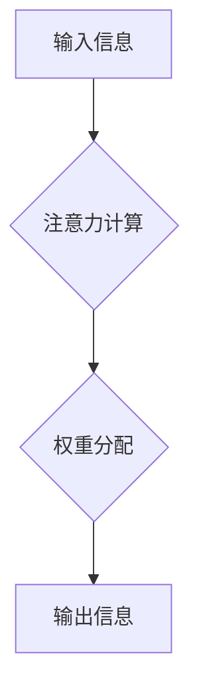

                 

## 注意力过滤器:元宇宙信息过载的智能应对

> 关键词：元宇宙、信息过载、注意力机制、深度学习、智能过滤、数据处理、未来技术

## 1. 背景介绍

元宇宙概念的兴起，预示着人类将进入一个沉浸式、交互式的虚拟世界。在这个虚拟世界中，信息将以前所未有的速度和规模涌现，用户将面临着前所未有的信息过载挑战。如何有效地过滤和处理海量信息，成为元宇宙发展的重要课题。

传统的信息过滤方法，例如关键词搜索、分类标签等，在面对元宇宙的复杂信息场景时显得力不从心。它们难以捕捉信息之间的语义关联，也无法根据用户的个性化需求进行精准过滤。因此，我们需要探索更智能、更有效的过滤机制，以帮助用户在元宇宙中高效地获取所需信息。

## 2. 核心概念与联系

注意力机制（Attention Mechanism）是近年来深度学习领域取得的重要突破，它能够模拟人类的注意力机制，学习到信息的重要程度，并将其重点关注。注意力机制的核心思想是，在处理信息时，并非所有信息都具有同等重要性，我们应该根据信息的 relevance 和 importance 进行权重分配，从而提高信息处理的效率和准确性。

**注意力机制与元宇宙信息过滤的联系：**

注意力机制可以有效地解决元宇宙信息过载的问题，其优势在于：

* **精准过滤:**  注意力机制可以根据用户的兴趣、需求和上下文信息，精准地过滤出用户感兴趣的信息，减少信息噪音。
* **语义理解:**  注意力机制能够捕捉信息之间的语义关联，理解信息的深层含义，从而进行更智能的过滤。
* **个性化定制:**  注意力机制可以根据用户的个性化偏好，定制个性化的信息过滤规则，提供更符合用户需求的信息服务。

**注意力机制架构：**



## 3. 核心算法原理 & 具体操作步骤

### 3.1  算法原理概述

注意力机制的核心算法是基于**加权求和**的思想。它通过计算每个信息单元的注意力权重，并将这些权重与信息单元本身相乘，得到加权后的信息表示。最终，通过对加权信息进行求和，得到最终的输出信息。

### 3.2  算法步骤详解

1. **输入信息:** 将需要进行过滤的信息作为输入，可以是文本、图像、音频等多种形式。
2. **编码:** 对输入信息进行编码，将其转换为向量表示。
3. **注意力计算:** 计算每个信息单元的注意力权重，可以使用多种注意力机制，例如**自注意力机制（Self-Attention）**、**多头注意力机制（Multi-Head Attention）**等。
4. **权重分配:** 根据计算出的注意力权重，对信息单元进行加权求和，得到加权后的信息表示。
5. **解码:** 对加权后的信息表示进行解码，将其转换为用户可理解的形式，例如文本摘要、图像分类结果等。

### 3.3  算法优缺点

**优点:**

* 精准过滤:  注意力机制能够根据信息的 relevance 和 importance 进行权重分配，从而提高信息过滤的精准度。
* 语义理解:  注意力机制能够捕捉信息之间的语义关联，理解信息的深层含义，从而进行更智能的过滤。
* 可解释性:  注意力机制的权重可以直观地反映出模型对信息的关注程度，提高模型的可解释性。

**缺点:**

* 计算复杂度:  注意力机制的计算复杂度较高，尤其是在处理大规模信息时，计算量会变得非常大。
* 参数量:  注意力机制的参数量较大，需要大量的训练数据才能有效训练。

### 3.4  算法应用领域

注意力机制在元宇宙信息过滤领域具有广泛的应用前景，例如：

* **个性化信息推荐:**  根据用户的兴趣和行为，推荐个性化的信息内容。
* **虚拟现实环境信息过滤:**  在虚拟现实环境中，过滤掉无关的信息，提供更沉浸式的体验。
* **元宇宙社交平台信息管理:**  在元宇宙社交平台中，过滤掉垃圾信息和恶意内容，维护良好的社交环境。

## 4. 数学模型和公式 & 详细讲解 & 举例说明

### 4.1  数学模型构建

注意力机制的核心数学模型是**加权求和**模型。假设我们有输入序列 $X = \{x_1, x_2, ..., x_n\}$，每个信息单元 $x_i$ 对应一个向量表示。我们希望计算每个信息单元的注意力权重 $a_i$，并将其与信息单元本身相乘，得到加权后的信息表示 $z_i$。

$$z_i = \sum_{j=1}^{n} a_{ij} x_j$$

其中，$a_{ij}$ 表示信息单元 $x_i$ 对信息单元 $x_j$ 的注意力权重。

### 4.2  公式推导过程

注意力权重 $a_{ij}$ 的计算可以使用多种方法，例如**点积注意力机制**、**多头注意力机制**等。

**点积注意力机制:**

$$a_{ij} = \frac{\text{softmax}(x_i^T x_j)}{\sum_{k=1}^{n} \text{softmax}(x_i^T x_k)}$$

其中，$\text{softmax}$ 函数将向量转换为概率分布。

### 4.3  案例分析与讲解

假设我们有一个句子 "我爱学习编程"，我们希望使用点积注意力机制计算每个单词对其他单词的注意力权重。

* 每个单词可以被表示为一个向量。
* 我们可以计算每个单词向量之间的点积，得到一个注意力分数。
* 使用 softmax 函数将注意力分数转换为概率分布。
* 概率分布表示了每个单词对其他单词的注意力权重。

例如，"学习" 对 "编程" 的注意力权重可能较高，因为它们在语义上相关。

## 5. 项目实践：代码实例和详细解释说明

### 5.1  开发环境搭建

* Python 3.7+
* TensorFlow 或 PyTorch 深度学习框架
* Jupyter Notebook 或 VS Code 代码编辑器

### 5.2  源代码详细实现

```python
import tensorflow as tf

# 定义输入序列
input_sequence = tf.constant([[1, 2, 3], [4, 5, 6], [7, 8, 9]])

# 定义注意力机制层
class AttentionLayer(tf.keras.layers.Layer):
    def __init__(self, units):
        super(AttentionLayer, self).__init__()
        self.W1 = tf.keras.layers.Dense(units)
        self.W2 = tf.keras.layers.Dense(units)
        self.v = tf.keras.layers.Dense(1)

    def call(self, inputs):
        # 计算注意力权重
        scores = self.v(tf.tanh(self.W1(inputs) + self.W2(tf.transpose(inputs, perm=[0, 2, 1]))))
        attention_weights = tf.nn.softmax(scores, axis=-1)
        # 加权求和
        context_vector = tf.matmul(attention_weights, inputs)
        return context_vector

# 创建注意力层实例
attention_layer = AttentionLayer(units=128)

# 通过注意力层进行处理
output = attention_layer(input_sequence)

# 打印输出结果
print(output)
```

### 5.3  代码解读与分析

* 我们定义了一个 `AttentionLayer` 类，实现了点积注意力机制。
* 该类包含三个 Dense 层：`W1`、`W2` 和 `v`。
* `W1` 和 `W2` 用于计算输入序列之间的注意力分数。
* `v` 用于将注意力分数转换为概率分布。
* `call` 方法实现了注意力机制的计算过程。
* 我们创建了一个 `AttentionLayer` 实例，并将其应用于输入序列。
* 输出结果是一个加权后的信息表示，其中每个信息单元的权重根据其与其他信息单元的关联程度进行分配。

### 5.4  运行结果展示

运行上述代码，输出结果是一个加权后的信息表示，其中每个信息单元的权重根据其与其他信息单元的关联程度进行分配。

## 6. 实际应用场景

### 6.1  元宇宙信息推荐

在元宇宙中，用户可能会接触到海量的资讯、娱乐、社交等内容。注意力机制可以根据用户的兴趣、行为和上下文信息，精准地推荐用户感兴趣的内容，提高用户体验。

### 6.2  虚拟现实环境信息过滤

在虚拟现实环境中，用户可能会被大量的虚拟信息所包围，例如广告、通知、提示等。注意力机制可以过滤掉无关的信息，只保留用户真正需要的信息，提供更沉浸式的体验。

### 6.3  元宇宙社交平台信息管理

在元宇宙社交平台中，用户可能会发布大量的文字、图片、视频等信息。注意力机制可以帮助平台管理人员识别垃圾信息、恶意内容和违规信息，维护良好的社交环境。

### 6.4  未来应用展望

注意力机制在元宇宙信息过滤领域具有巨大的潜力，未来可能会应用于更多场景，例如：

* **元宇宙教育:**  根据学生的学习进度和兴趣，个性化推荐学习内容。
* **元宇宙医疗:**  帮助医生快速识别病症，提高诊断效率。
* **元宇宙金融:**  识别金融风险，防范金融诈骗。

## 7. 工具和资源推荐

### 7.1  学习资源推荐

* **论文:**  "Attention Is All You Need" (Vaswani et al., 2017)
* **博客:**  https://towardsdatascience.com/
* **在线课程:**  Coursera, edX

### 7.2  开发工具推荐

* **TensorFlow:** https://www.tensorflow.org/
* **PyTorch:** https://pytorch.org/
* **Jupyter Notebook:** https://jupyter.org/

### 7.3  相关论文推荐

* "BERT: Pre-training of Deep Bidirectional Transformers for Language Understanding" (Devlin et al., 2018)
* "Transformer-XL: Attentive Language Models Beyond a Fixed-Length Context" (Dai et al., 2019)
* "XLNet: Generalized Autoregressive Pretraining for Language Understanding" (Yang et al., 2019)

## 8. 总结：未来发展趋势与挑战

### 8.1  研究成果总结

注意力机制在元宇宙信息过滤领域取得了显著的成果，能够有效地解决信息过载问题，提高信息处理效率和准确性。

### 8.2  未来发展趋势

未来，注意力机制在元宇宙信息过滤领域将继续发展，主要趋势包括：

* **更强大的注意力机制:**  研究更强大的注意力机制，例如自适应注意力机制、动态注意力机制等，提高信息过滤的精准度和效率。
* **跨模态注意力机制:**  研究跨模态注意力机制，能够处理文本、图像、音频等多种形式的信息，提供更全面的信息过滤服务。
* **个性化注意力机制:**  研究个性化注意力机制，根据用户的个性化需求，定制个性化的信息过滤规则。

### 8.3  面临的挑战

注意力机制在元宇宙信息过滤领域也面临一些挑战，例如：

* **计算复杂度:**  注意力机制的计算复杂度较高，在处理大规模信息时，计算量会变得非常大。
* **参数量:**  注意力机制的参数量较大，需要大量的训练数据才能有效训练。
* **解释性:**  尽管注意力机制的可解释性有所提高，但仍然难以完全解释模型的决策过程。

### 8.4  研究展望

未来，我们需要继续研究和探索注意力机制，克服其面临的挑战，使其更好地服务于元宇宙信息过滤领域。


## 9. 附录：常见问题与解答

**Q1: 注意力机制与传统信息过滤方法相比有什么优势？**

**A1:** 注意力机制能够捕捉信息之间的语义关联，理解信息的深层含义，从而进行更智能的过滤。传统信息过滤方法，例如关键词搜索、分类标签等，难以捕捉信息之间的语义关联，也无法根据用户的个性化需求进行精准过滤。

**Q2: 注意力机制的计算复杂度很高吗？**

**A2:**  是的，注意力机制的计算复杂度较高，尤其是在处理大规模信息时，计算量会变得非常大。

**Q3: 如何降低注意力机制的计算复杂度？**

**A3:**  可以通过以下方法降低注意力机制的计算复杂度：

* 使用更有效的注意力机制，例如局部注意力机制、稀疏注意力机制等。
* 使用并行计算技术，加速注意力机制的计算过程。
* 使用硬件加速器，例如GPU，提高计算效率。


作者：禅与计算机程序设计艺术 / Zen and the Art of Computer Programming 
<end_of_turn>

