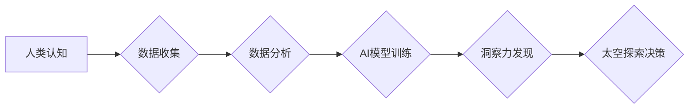

                 

## 洞察力与太空探索：跨越认知边界的能力

> 关键词：人工智能、洞察力、太空探索、认知边界、深度学习、数据分析、预测模型

### 1. 背景介绍

人类对宇宙的探索源远流长，从古人仰望星空，到现代探测器穿梭星际，我们始终渴望揭开宇宙的奥秘。然而，太空探索并非仅仅是技术上的挑战，更是一种认知的突破。它要求我们拥有超越现有认知边界的洞察力，才能有效地理解宇宙的规律，并找到通往未知的道路。

近年来，人工智能（AI）技术突飞猛进，特别是深度学习的兴起，为太空探索带来了前所未有的机遇。AI算法能够从海量数据中提取隐藏的模式和规律，帮助我们更深入地理解宇宙，并做出更精准的预测。

### 2. 核心概念与联系

**2.1 认知边界**

认知边界是指人类理解和感知世界的极限。它受限于我们的感官、思维模式和知识体系。在太空探索中，我们常常面临着未知的挑战和复杂的现象，这些都可能超出我们的认知边界。

**2.2 洞察力**

洞察力是指能够识别隐藏的模式、关系和趋势的能力。它需要我们跳出固有的思维框架，进行深入的思考和分析。在太空探索中，洞察力可以帮助我们发现新的规律，并找到解决问题的关键。

**2.3 人工智能**

人工智能是指模拟人类智能的计算机系统。深度学习作为人工智能的重要分支，能够通过学习海量数据，自动提取特征和构建模型，从而实现对复杂问题的理解和解决。

**2.4 数据驱动**

数据驱动是指利用数据来指导决策和行动。在太空探索中，大量的观测数据、实验数据和模拟数据为AI算法提供了训练和验证的素材。通过对数据的分析和挖掘，我们可以获得对宇宙的更深入的理解。

**2.5 流程图**



### 3. 核心算法原理 & 具体操作步骤

**3.1 算法原理概述**

深度学习算法的核心原理是利用多层神经网络来模拟人类大脑的学习过程。每个神经元都连接着其他神经元，并通过权重来调节信号的传递强度。通过训练，神经网络可以自动学习数据的特征和模式，从而实现对复杂问题的理解和预测。

**3.2 算法步骤详解**

1. **数据预处理:** 将原始数据进行清洗、转换和特征提取，使其适合深度学习算法的训练。
2. **网络结构设计:** 根据任务需求设计神经网络的结构，包括神经元的数量、连接方式和激活函数等。
3. **模型训练:** 使用训练数据训练神经网络，通过调整神经元的权重，使模型能够准确地预测目标变量。
4. **模型评估:** 使用测试数据评估模型的性能，并根据评估结果进行模型调优。
5. **模型部署:** 将训练好的模型部署到实际应用场景中，用于预测和决策。

**3.3 算法优缺点**

**优点:**

* 能够处理海量数据，并自动提取特征。
* 能够学习复杂非线性关系。
* 性能优于传统机器学习算法。

**缺点:**

* 需要大量的训练数据。
* 训练过程耗时且资源消耗大。
* 模型解释性较差。

**3.4 算法应用领域**

* **图像识别:** 用于识别物体、场景和人脸。
* **自然语言处理:** 用于文本分类、机器翻译和对话系统。
* **语音识别:** 用于语音转文本和语音控制。
* **预测分析:** 用于预测未来趋势和事件。

### 4. 数学模型和公式 & 详细讲解 & 举例说明

**4.1 数学模型构建**

深度学习模型通常采用多层感知机（MLP）或卷积神经网络（CNN）等结构。

**MLP** 模型的数学模型可以表示为：

$$
y = f(W_L \cdot \sigma(W_{L-1} \cdot \sigma(... \cdot W_1 \cdot x)...) + b_L)
$$

其中：

* $x$ 是输入数据。
* $W_i$ 是第 $i$ 层神经网络的权重矩阵。
* $b_i$ 是第 $i$ 层神经网络的偏置向量。
* $\sigma$ 是激活函数，例如ReLU或Sigmoid。
* $f$ 是输出层激活函数。
* $y$ 是模型输出。

**CNN** 模型的数学模型则更加复杂，涉及卷积、池化和全连接层等操作。

**4.2 公式推导过程**

深度学习模型的训练过程基于梯度下降算法。目标函数通常是预测误差的平方和，即均方误差（MSE）。

$$
MSE = \frac{1}{N} \sum_{i=1}^{N} (y_i - \hat{y}_i)^2
$$

其中：

* $N$ 是样本数量。
* $y_i$ 是第 $i$ 个样本的真实值。
* $\hat{y}_i$ 是第 $i$ 个样本的预测值。

通过计算梯度，更新权重和偏置，使模型的预测误差最小化。

**4.3 案例分析与讲解**

例如，在图像识别任务中，我们可以使用CNN模型识别猫的图像。训练数据包括大量猫的图像和对应的标签。通过训练，CNN模型可以学习到猫的特征，并能够准确地识别新的猫图像。

### 5. 项目实践：代码实例和详细解释说明

**5.1 开发环境搭建**

可以使用Python语言和深度学习框架TensorFlow或PyTorch搭建开发环境。

**5.2 源代码详细实现**

以下是一个使用TensorFlow实现图像识别模型的简单代码示例：

```python
import tensorflow as tf

# 定义模型结构
model = tf.keras.models.Sequential([
    tf.keras.layers.Conv2D(32, (3, 3), activation='relu', input_shape=(28, 28, 1)),
    tf.keras.layers.MaxPooling2D((2, 2)),
    tf.keras.layers.Conv2D(64, (3, 3), activation='relu'),
    tf.keras.layers.MaxPooling2D((2, 2)),
    tf.keras.layers.Flatten(),
    tf.keras.layers.Dense(10, activation='softmax')
])

# 编译模型
model.compile(optimizer='adam',
              loss='sparse_categorical_crossentropy',
              metrics=['accuracy'])

# 训练模型
model.fit(x_train, y_train, epochs=5)

# 评估模型
loss, accuracy = model.evaluate(x_test, y_test)
print('Test loss:', loss)
print('Test accuracy:', accuracy)
```

**5.3 代码解读与分析**

这段代码定义了一个简单的CNN模型，用于识别手写数字。模型包含两层卷积层、两层最大池化层、一层全连接层和一层输出层。

**5.4 运行结果展示**

训练完成后，我们可以使用测试数据评估模型的性能。模型的准确率通常会达到较高的水平。

### 6. 实际应用场景

**6.1 天体识别和分类**

AI算法可以帮助天文学家识别和分类不同的天体，例如恒星、星系和星云。

**6.2 遥感图像分析**

AI算法可以分析遥感图像，识别地表变化、监测环境污染和预测自然灾害。

**6.3 航天器自主导航**

AI算法可以帮助航天器自主导航，避开障碍物和完成任务。

**6.4 探索未知星球**

AI算法可以帮助科学家分析未知星球的土壤、大气和水资源，为未来的探测任务提供参考。

**6.5 未来应用展望**

随着AI技术的不断发展，其在太空探索中的应用将更加广泛和深入。例如，AI可以帮助我们探索更遥远的星系，寻找生命的迹象，甚至实现人类移民太空的梦想。

### 7. 工具和资源推荐

**7.1 学习资源推荐**

* **书籍:**

    * 深度学习 (Deep Learning) - Ian Goodfellow, Yoshua Bengio, Aaron Courville
    * 人工智能：一种现代方法 (Artificial Intelligence: A Modern Approach) - Stuart Russell, Peter Norvig

* **在线课程:**

    * TensorFlow 官方教程: https://www.tensorflow.org/tutorials
    * PyTorch 官方教程: https://pytorch.org/tutorials/

**7.2 开发工具推荐**

* **TensorFlow:** https://www.tensorflow.org/
* **PyTorch:** https://pytorch.org/
* **Keras:** https://keras.io/

**7.3 相关论文推荐**

* **ImageNet Classification with Deep Convolutional Neural Networks** - Alex Krizhevsky, Ilya Sutskever, Geoffrey E. Hinton
* **Attention Is All You Need** - Ashish Vaswani, Noam Shazeer, Niki Parmar, Jakob Uszkoreit, Llion Jones, Aidan N. Gomez, Łukasz Kaiser, Illia Polosukhin

### 8. 总结：未来发展趋势与挑战

**8.1 研究成果总结**

近年来，AI技术在太空探索领域取得了显著的进展，例如图像识别、遥感分析和自主导航等。这些成果为我们更好地理解宇宙、探索未知提供了新的工具和方法。

**8.2 未来发展趋势**

未来，AI技术在太空探索中的应用将更加广泛和深入，例如：

* **更强大的AI模型:** 随着计算能力的提升，我们将能够训练更强大的AI模型，使其能够处理更复杂的任务。
* **更智能的机器人:** AI技术将赋予机器人更强的自主性和智能，使其能够在太空环境中更有效地完成任务。
* **更精准的预测:** AI算法能够从海量数据中提取更精准的预测信息，帮助我们更好地规划太空探索任务。

**8.3 面临的挑战**

尽管AI技术在太空探索领域展现了巨大的潜力，但也面临着一些挑战：

* **数据获取和处理:** 太空环境下数据获取和处理面临着诸多困难，例如通信延迟、数据量大等。
* **模型解释性和可信度:** 深度学习模型的内部机制复杂，难以解释其决策过程，这可能会影响其在太空探索中的可信度。
* **伦理和安全问题:** AI技术在太空探索中的应用也引发了一些伦理和安全问题，例如自主武器系统、数据隐私等。

**8.4 研究展望**

未来，我们需要继续加强对AI技术的研发和应用，并积极应对其带来的挑战。同时，还需要加强跨学科合作，整合不同领域的知识和资源，才能更好地利用AI技术，推动太空探索事业的发展。

### 9. 附录：常见问题与解答

**Q1: AI技术在太空探索中有哪些优势？**

A1: AI技术能够处理海量数据，自动提取特征，并进行精准的预测，为太空探索提供了强大的工具和方法。

**Q2: 深度学习模型的训练需要哪些数据？**

A2: 深度学习模型的训练需要大量的标记数据，例如图像、文本、音频等。

**Q3: 如何解决AI模型在太空环境下的数据获取和处理问题？**

A3: 可以采用数据压缩、边缘计算等技术，提高数据传输效率和处理能力。

**作者：禅与计算机程序设计艺术 / Zen and the Art of Computer Programming**


<end_of_turn>

