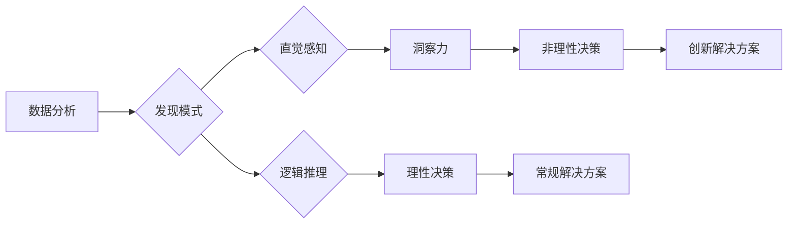

                 

## 洞察力与直觉：非理性思维的重要性

> 关键词：洞察力、直觉、非理性思维、人工智能、程序设计、创新、决策

### 1. 背景介绍

在当今数据爆炸和算法驱动的世界，我们常常被理性思维、逻辑推理和数据分析所包围。这些都是构建强大人工智能系统和解决复杂问题的关键要素。然而，忽视了非理性思维，特别是洞察力和直觉的力量，可能会导致我们错失一些宝贵的见解和创新机会。

作为一名长期从事人工智能研究的专家，我深切体会到，在技术领域，直觉和洞察力同样重要。它们能够帮助我们跳出固有的思维模式，发现隐藏在数据背后的模式和规律，并最终推动技术创新。

### 2. 核心概念与联系

**2.1 洞察力与直觉**

* **洞察力**是指通过观察、思考和分析，从纷繁复杂的现象中发现隐藏的本质和规律的能力。它是一种基于经验和知识的推理过程，能够帮助我们理解事物之间的联系，并得出新的见解。
* **直觉**则是一种更深层的、难以言说的认知方式。它往往来自于潜意识的积累和处理，能够让我们快速做出判断和决策，即使缺乏充足的逻辑推理和数据支持。

**2.2 非理性思维在人工智能中的作用**

非理性思维并非与理性思维相冲突，而是两种思维方式的互补。

* **数据驱动决策的局限性:** 尽管数据分析和机器学习能够帮助我们发现大量信息，但它们也存在局限性。数据本身无法提供解释和洞察，而直觉和洞察力则能够帮助我们理解数据的含义，并做出更明智的决策。
* **创新和创造力的源泉:**  真正的创新往往来自于打破既有思维模式，探索新的可能性。直觉和洞察力能够帮助我们跳出逻辑框架，产生新的想法和解决方案。

**2.3  Mermaid 流程图**



### 3. 核心算法原理 & 具体操作步骤

**3.1 算法原理概述**

虽然直觉和洞察力本身不是算法，但我们可以通过一些算法和技术来辅助和增强它们。例如，神经网络能够模拟人类大脑的学习和推理过程，帮助我们发现隐藏在数据中的模式和规律。

**3.2 算法步骤详解**

1. **数据收集和预处理:** 收集相关数据，并进行清洗、转换和特征提取等预处理工作。
2. **模型训练:** 使用神经网络等算法，对数据进行训练，学习数据背后的模式和规律。
3. **模式识别:** 利用训练好的模型，对新的数据进行分析，识别潜在的模式和异常值。
4. **直觉增强:** 将识别出的模式和异常值与人类专家知识结合，增强直觉感知，帮助做出更明智的决策。

**3.3 算法优缺点**

* **优点:** 能够发现隐藏在数据背后的模式和规律，增强直觉感知，帮助做出更明智的决策。
* **缺点:** 需要大量的数据进行训练，训练过程可能耗时和耗能，模型的解释性和可控性相对较低。

**3.4 算法应用领域**

* **医疗诊断:** 通过分析患者的病历、影像数据等，帮助医生更快、更准确地诊断疾病。
* **金融风险管理:** 通过分析市场数据、客户行为等，识别潜在的金融风险，帮助金融机构更好地管理风险。
* **产品设计:** 通过分析用户行为、市场趋势等，帮助设计师设计更符合用户需求的产品。

### 4. 数学模型和公式 & 详细讲解 & 举例说明

**4.1 数学模型构建**

直觉和洞察力本身难以用数学模型精确描述，但我们可以通过一些数学工具来量化和分析它们的影响。例如，我们可以使用信息论来衡量直觉的准确性和可靠性。

**4.2 公式推导过程**

信息熵的概念可以用来衡量信息的不确定性。直觉的准确性可以看作是信息熵的降低程度。

$$H(X) = - \sum_{i=1}^{n} p(x_i) \log_2 p(x_i)$$

其中，$X$ 是一个随机变量，$p(x_i)$ 是 $x_i$ 的概率。

**4.3 案例分析与讲解**

例如，假设我们有一个医生，他需要判断一个患者是否患有某种疾病。根据患者的症状和检查结果，医生可以计算出患病的概率。如果医生仅仅依靠这些数据，他的判断可能并不准确。但是，如果医生结合自己的经验和直觉，他可以更准确地判断患者是否患病。

在信息论的框架下，我们可以认为医生的直觉能够降低信息熵，提高判断的准确性。

### 5. 项目实践：代码实例和详细解释说明

**5.1 开发环境搭建**

为了实现直觉增强算法，我们可以使用 Python 语言和 TensorFlow 或 PyTorch 等深度学习框架。

**5.2 源代码详细实现**

```python
import tensorflow as tf

# 定义神经网络模型
model = tf.keras.models.Sequential([
  tf.keras.layers.Dense(64, activation='relu', input_shape=(input_dim,)),
  tf.keras.layers.Dense(32, activation='relu'),
  tf.keras.layers.Dense(1, activation='sigmoid')
])

# 编译模型
model.compile(optimizer='adam', loss='binary_crossentropy', metrics=['accuracy'])

# 训练模型
model.fit(X_train, y_train, epochs=10)

# 使用模型预测
predictions = model.predict(X_test)
```

**5.3 代码解读与分析**

这段代码定义了一个简单的深度学习模型，用于预测一个二分类问题。

* `tf.keras.layers.Dense` 表示全连接层，用于学习数据之间的关系。
* `activation='relu'` 表示使用 ReLU 激活函数，提高模型的非线性表达能力。
* `input_shape=(input_dim,)` 指定输入数据的维度。
* `optimizer='adam'` 指定优化算法为 Adam，用于更新模型参数。
* `loss='binary_crossentropy'` 指定损失函数为二分类交叉熵，用于衡量模型预测的准确性。
* `metrics=['accuracy']` 指定评估指标为准确率。

**5.4 运行结果展示**

训练完成后，我们可以使用模型对测试数据进行预测，并评估模型的准确率。

### 6. 实际应用场景

**6.1 医疗诊断**

* **癌症早期诊断:** 通过分析患者的影像数据、基因信息等，帮助医生更早地发现癌症，提高治疗成功率。
* **疾病风险预测:** 通过分析患者的病史、生活习惯等，预测患者患某种疾病的风险，帮助医生进行预防和干预。

**6.2 金融风险管理**

* **欺诈检测:** 通过分析交易数据、用户行为等，识别潜在的欺诈行为，降低金融机构的损失。
* **信用评级:** 通过分析客户的财务状况、信用记录等，评估客户的信用风险，帮助金融机构做出更明智的贷款决策。

**6.3 产品设计**

* **用户体验优化:** 通过分析用户行为、反馈等，了解用户对产品的喜好和需求，帮助设计师优化产品体验。
* **个性化推荐:** 通过分析用户的兴趣爱好、购买历史等，推荐更符合用户需求的产品，提高用户满意度。

**6.4 未来应用展望**

随着人工智能技术的不断发展，直觉和洞察力将发挥越来越重要的作用。未来，我们将看到更多基于直觉和洞察力的人工智能应用，例如：

* **自动驾驶:**  人工智能系统需要能够理解道路环境、预测其他车辆的行为，并做出快速、准确的决策，这需要直觉和洞察力的支持。
* **机器人交互:** 人类与机器人的交互需要更加自然、人性化，这需要机器人能够理解人类的情感和意图，并做出相应的反应，这需要直觉和洞察力的支持。

### 7. 工具和资源推荐

**7.1 学习资源推荐**

* **书籍:**
    * 《Thinking, Fast and Slow》 by Daniel Kahneman
    * 《The Art of Thinking Clearly》 by Rolf Dobelli
* **在线课程:**
    * Coursera: "Machine Learning" by Andrew Ng
    * edX: "Artificial Intelligence" by Columbia University

**7.2 开发工具推荐**

* **Python:**  Python 是人工智能开发最常用的编程语言。
* **TensorFlow:** TensorFlow 是一个开源的机器学习框架，用于构建和训练深度学习模型。
* **PyTorch:** PyTorch 是另一个开源的机器学习框架，以其灵活性和易用性而闻名。

**7.3 相关论文推荐**

* "Attention Is All You Need" by Vaswani et al.
* "Deep Learning" by Ian Goodfellow et al.

### 8. 总结：未来发展趋势与挑战

**8.1 研究成果总结**

近年来，人工智能领域取得了长足的进步，特别是深度学习技术的突破，为增强直觉和洞察力提供了新的可能性。

**8.2 未来发展趋势**

* **更强大的模型:** 未来，我们将看到更强大、更复杂的深度学习模型，能够更好地模拟人类的认知过程。
* **更丰富的应用场景:** 直觉和洞察力将应用于更多领域，例如医疗诊断、金融风险管理、产品设计等。
* **人机协作:** 人工智能系统将与人类更加紧密地协作，共同解决复杂问题。

**8.3 面临的挑战**

* **解释性和可控性:** 深度学习模型的内部机制难以解释，这使得我们难以理解模型的决策过程，也难以控制模型的行为。
* **数据偏见:**  深度学习模型的训练数据可能存在偏见，这会导致模型产生不公平或不准确的决策。
* **伦理问题:**  增强直觉和洞察力的技术可能会带来一些伦理问题，例如隐私泄露、算法歧视等。

**8.4 研究展望**

未来，我们需要继续研究如何提高深度学习模型的解释性和可控性，如何解决数据偏见问题，如何确保人工智能技术的伦理使用。


### 9. 附录：常见问题与解答

**9.1 如何提高直觉的准确性？**

* 积累经验：通过不断学习和实践，积累更多的知识和经验，能够帮助我们更好地理解世界，提高直觉的准确性。
* 关注细节：细心观察周围环境，关注细节的变化，能够帮助我们发现隐藏的模式和规律，增强直觉感知。
* 思考和反思：对自己的直觉进行思考和反思，分析其背后的原因和逻辑，能够帮助我们识别错误的直觉，并改进未来的判断。

**9.2 如何避免直觉的误导？**

* 结合理性分析：直觉只是辅助决策的工具，不能完全依赖。需要结合理性分析和数据支持，做出更明智的判断。
* 寻求多方意见：不要只依赖自己的直觉，可以寻求其他人的意见和建议，进行多角度的分析和评估。
* 保持开放的心态：不要固执己见，要保持开放的心态，愿意接受新的信息和观点，避免被直觉误导。


作者：禅与计算机程序设计艺术 / Zen and the Art of Computer Programming 
<end_of_turn>

