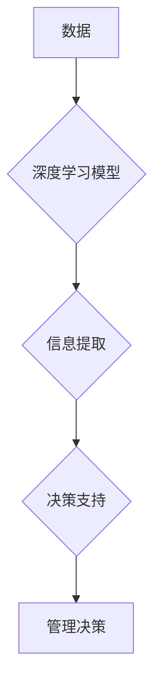

                 

## 深度思考:管理者洞悉关键信息的关键

> 关键词：数据分析、信息提取、决策支持、人工智能、机器学习、深度学习、可视化

## 1. 背景介绍

在当今信息爆炸的时代，管理者面临着海量数据的挑战。如何从纷繁复杂的数字海洋中提取关键信息，洞察趋势，做出明智的决策，成为管理者成功的关键。传统的分析方法往往难以应对数据规模和复杂性的增长，而人工智能技术为管理者提供了全新的视角和工具。

深度学习作为人工智能领域的重要分支，凭借其强大的数据处理能力和模式识别能力，在信息提取、数据分析和决策支持方面展现出巨大的潜力。本文将深入探讨深度学习在管理者洞察关键信息方面的应用，帮助管理者理解其原理、应用场景和未来发展趋势。

## 2. 核心概念与联系

### 2.1 深度学习

深度学习是一种基于人工神经网络的机器学习方法，其核心在于构建多层神经网络，通过层层叠加的非线性变换，学习数据中的复杂特征和模式。与传统机器学习方法相比，深度学习能够自动提取特征，无需人工特征工程，从而更有效地处理高维数据和复杂关系。

### 2.2 信息提取

信息提取是指从 unstructured 数据中抽取结构化信息的过程，例如从文本中提取关键实体、关系和事件。深度学习在信息提取领域取得了显著进展，例如使用 Recurrent Neural Networks (RNN) 和 Transformer 模型进行文本分类、命名实体识别和关系抽取。

### 2.3 决策支持

决策支持是指利用数据分析和模型预测，为管理者提供决策建议的过程。深度学习可以帮助管理者构建更精准的预测模型，例如预测客户行为、市场趋势和风险事件，从而支持更明智的决策。

**核心概念与联系流程图**



## 3. 核心算法原理 & 具体操作步骤

### 3.1 算法原理概述

深度学习算法的核心是神经网络，其结构由多个层组成，每层包含多个神经元。神经元之间通过连接权重进行信息传递，通过训练过程不断调整权重，使得网络能够学习数据中的模式和关系。

常见的深度学习算法包括：

* **卷积神经网络 (CNN)**：擅长处理图像和视频数据，通过卷积操作提取图像特征。
* **循环神经网络 (RNN)**：擅长处理序列数据，例如文本和语音，能够捕捉时间序列中的依赖关系。
* **Transformer**：一种新型的序列模型，通过注意力机制学习长距离依赖关系，在自然语言处理领域取得了突破性进展。

### 3.2 算法步骤详解

深度学习算法的训练过程通常包括以下步骤：

1. **数据预处理**: 将原始数据清洗、转换和格式化，使其适合深度学习模型的输入。
2. **模型构建**: 根据任务需求选择合适的深度学习模型架构，并定义模型参数。
3. **模型训练**: 使用训练数据训练模型，通过反向传播算法不断调整模型参数，使得模型能够准确地预测目标变量。
4. **模型评估**: 使用测试数据评估模型的性能，例如准确率、召回率和 F1-score。
5. **模型部署**: 将训练好的模型部署到实际应用场景中，用于预测和决策。

### 3.3 算法优缺点

**优点**:

* **自动特征提取**: 深度学习模型能够自动学习数据中的特征，无需人工特征工程。
* **处理高维数据**: 深度学习模型能够有效地处理高维数据，例如图像、文本和音频。
* **高精度**: 深度学习模型在许多任务中能够达到很高的精度。

**缺点**:

* **数据依赖**: 深度学习模型需要大量的训练数据才能达到最佳性能。
* **训练时间长**: 深度学习模型的训练时间通常较长，需要强大的计算资源。
* **可解释性低**: 深度学习模型的决策过程相对复杂，难以解释其决策依据。

### 3.4 算法应用领域

深度学习在信息提取和决策支持领域有着广泛的应用，例如：

* **客户关系管理 (CRM)**：预测客户行为、识别潜在客户、个性化营销。
* **风险管理**: 识别欺诈行为、预测信用风险、评估投资风险。
* **市场分析**: 分析市场趋势、预测产品销量、识别竞争对手。
* **人力资源管理**: 筛选简历、预测员工离职率、评估员工绩效。

## 4. 数学模型和公式 & 详细讲解 & 举例说明

### 4.1 数学模型构建

深度学习模型的核心是神经网络，其数学模型可以表示为一系列的线性变换和非线性激活函数。

**线性变换**:

$$
y = Wx + b
$$

其中，$x$ 是输入向量，$W$ 是权重矩阵，$b$ 是偏置向量，$y$ 是线性变换后的输出向量。

**非线性激活函数**:

激活函数的作用是引入非线性，使得神经网络能够学习复杂的数据模式。常见的激活函数包括 sigmoid 函数、ReLU 函数和 tanh 函数。

### 4.2 公式推导过程

深度学习模型的训练过程基于梯度下降算法，其目标是找到最优的模型参数，使得模型的预测结果与真实值之间的误差最小化。

**损失函数**:

$$
L(W, b) = \frac{1}{N} \sum_{i=1}^{N} loss(y_i, \hat{y}_i)
$$

其中，$N$ 是样本数量，$y_i$ 是真实值，$\hat{y}_i$ 是模型预测值，$loss(y_i, \hat{y}_i)$ 是单个样本的损失函数。

**梯度下降**:

$$
W = W - \alpha \frac{\partial L(W, b)}{\partial W}
$$

$$
b = b - \alpha \frac{\partial L(W, b)}{\partial b}
$$

其中，$\alpha$ 是学习率，$\frac{\partial L(W, b)}{\partial W}$ 和 $\frac{\partial L(W, b)}{\partial b}$ 是损失函数对权重和偏置的梯度。

### 4.3 案例分析与讲解

例如，在文本分类任务中，可以使用深度学习模型将文本句子映射到不同的类别。

**数据**:

训练数据包含许多文本句子和对应的类别标签。

**模型**:

可以使用 RNN 或 Transformer 模型构建文本分类模型。

**训练**:

使用梯度下降算法训练模型，使得模型能够准确地预测文本句子的类别。

**评估**:

使用测试数据评估模型的性能，例如准确率和 F1-score。

## 5. 项目实践：代码实例和详细解释说明

### 5.1 开发环境搭建

深度学习项目开发通常需要以下环境：

* **操作系统**: Linux 或 macOS
* **编程语言**: Python
* **深度学习框架**: TensorFlow、PyTorch 或 Keras
* **GPU**: 加速深度学习模型训练

### 5.2 源代码详细实现

以下是一个使用 TensorFlow 实现文本分类的简单代码示例：

```python
import tensorflow as tf

# 定义模型
model = tf.keras.Sequential([
    tf.keras.layers.Embedding(input_dim=10000, output_dim=128),
    tf.keras.layers.LSTM(128),
    tf.keras.layers.Dense(num_classes, activation='softmax')
])

# 编译模型
model.compile(optimizer='adam',
              loss='sparse_categorical_crossentropy',
              metrics=['accuracy'])

# 训练模型
model.fit(x_train, y_train, epochs=10)

# 评估模型
loss, accuracy = model.evaluate(x_test, y_test)
print('Loss:', loss)
print('Accuracy:', accuracy)
```

### 5.3 代码解读与分析

* **Embedding 层**: 将文本词向量化，将每个词映射到一个低维向量空间。
* **LSTM 层**: 捕捉文本序列中的时间依赖关系。
* **Dense 层**: 全连接层，将 LSTM 输出映射到类别概率。
* **编译模型**: 选择优化器、损失函数和评估指标。
* **训练模型**: 使用训练数据训练模型，更新模型参数。
* **评估模型**: 使用测试数据评估模型性能。

### 5.4 运行结果展示

训练完成后，可以查看模型的损失值和准确率，评估模型的性能。

## 6. 实际应用场景

### 6.1 客户关系管理 (CRM)

深度学习可以帮助企业更好地理解客户行为，预测客户需求，提供个性化服务。例如，可以使用深度学习模型分析客户的购买历史、浏览记录和社交媒体行为，预测客户的购买意愿，并推荐合适的商品或服务。

### 6.2 风险管理

深度学习可以帮助企业识别和评估风险，降低风险损失。例如，可以使用深度学习模型分析金融交易数据，识别欺诈行为；分析网络流量数据，预测网络攻击；分析客户信用数据，预测信用风险。

### 6.3 市场分析

深度学习可以帮助企业分析市场趋势，预测产品销量，识别竞争对手。例如，可以使用深度学习模型分析社交媒体数据，了解消费者对产品的评价和反馈；分析搜索引擎数据，预测产品的市场需求；分析竞争对手的产品和营销策略，制定相应的应对措施。

### 6.4 未来应用展望

随着深度学习技术的不断发展，其在管理者洞察关键信息方面的应用将更加广泛和深入。例如，可以使用深度学习模型分析大规模的传感器数据，预测设备故障，实现智能维护；分析医疗影像数据，辅助医生诊断疾病；分析法律文本数据，辅助律师进行法律分析。

## 7. 工具和资源推荐

### 7.1 学习资源推荐

* **书籍**:
    * 深度学习 (Deep Learning) - Ian Goodfellow, Yoshua Bengio, Aaron Courville
    * 深度学习实战 (Deep Learning with Python) - Francois Chollet
* **在线课程**:
    * Coursera: 深度学习 Specialization
    * Udacity: 深度学习 Nanodegree
    * fast.ai: 深度学习课程

### 7.2 开发工具推荐

* **深度学习框架**: TensorFlow、PyTorch、Keras
* **数据处理工具**: Pandas、NumPy
* **可视化工具**: Matplotlib、Seaborn

### 7.3 相关论文推荐

* **Attention Is All You Need**: https://arxiv.org/abs/1706.03762
* **BERT: Pre-training of Deep Bidirectional Transformers for Language Understanding**: https://arxiv.org/abs/1810.04805

## 8. 总结：未来发展趋势与挑战

### 8.1 研究成果总结

深度学习在信息提取和决策支持领域取得了显著进展，为管理者洞察关键信息提供了强大的工具。

### 8.2 未来发展趋势

* **模型更强大**: 深度学习模型将更加强大，能够处理更复杂的数据，学习更复杂的模式。
* **应用更广泛**: 深度学习的应用将更加广泛，覆盖更多领域，例如医疗、金融、教育等。
* **解释性更强**: 深度学习模型的解释性将更加强，能够更好地解释其决策依据。

### 8.3 面临的挑战

* **数据隐私**: 深度学习模型需要大量的训练数据，如何保护数据隐私是一个重要的挑战。
* **算法可解释性**: 深度学习模型的决策过程相对复杂，难以解释其决策依据，这可能会导致管理者对模型结果缺乏信任。
* **计算资源**: 深度学习模型的训练需要大量的计算资源，这可能会限制其应用范围。

### 8.4 研究展望

未来，研究者将继续探索深度学习在信息提取和决策支持方面的应用，解决上述挑战，推动深度学习技术在管理领域更广泛的应用。

## 9. 附录：常见问题与解答

### 9.1 如何选择合适的深度学习模型？

选择合适的深度学习模型取决于具体的应用场景和数据特点。例如，对于文本分类任务，可以使用 RNN 或 Transformer 模型；对于图像识别任务，可以使用 CNN 模型。

### 9.2 如何处理数据不平衡问题？

数据不平衡是指训练数据中不同类别样本数量不均衡的情况。可以使用数据增广、权重调整等方法来处理数据不平衡问题。

### 9.3 如何评估深度学习模型的性能？

可以使用准确率、召回率、F1-score等指标来评估深度学习模型的性能。

### 9.4 如何部署深度学习模型？

可以使用 TensorFlow Serving、PyTorch Serve 等工具来部署深度学习模型。


作者：禅与计算机程序设计艺术 / Zen and the Art of Computer Programming 
<end_of_turn>

