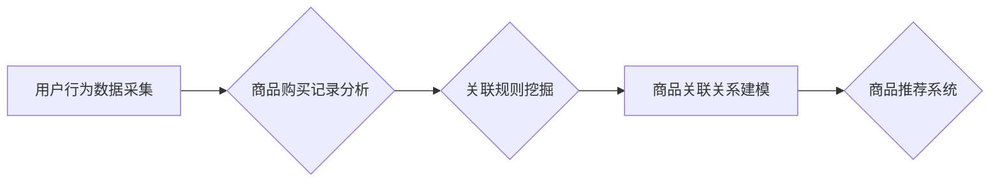

                 

## 电商搜索中的AI商品关联分析

> 关键词：电商搜索、商品关联分析、协同过滤、深度学习、推荐系统、用户行为分析、人工智能

## 1. 背景介绍

在当今以电商为主导的商业模式下，搜索引擎已经成为用户获取商品信息和完成购买的主要入口。然而，传统的基于关键词匹配的搜索方式往往难以满足用户多样化的需求，例如用户可能不知道商品的具体名称，或者希望探索与当前商品相关的其他产品。因此，商品关联分析作为一种重要的电商搜索技术，逐渐成为提升用户体验和促进销售额的关键因素。

商品关联分析旨在挖掘商品之间的潜在关系，并根据这些关系为用户推荐相关商品。例如，当用户搜索“运动鞋”时，系统可以推荐与之相关的商品，例如“运动袜”、“运动服”、“篮球”等。通过提供更精准、更个性化的商品推荐，电商平台可以提高用户购物的兴趣和转化率。

## 2. 核心概念与联系

### 2.1  商品关联分析的概念

商品关联分析是指通过挖掘商品之间的购买行为关联性，识别出用户倾向于同时购买的商品组合，并根据这些关联性进行商品推荐。

### 2.2  关联分析的原理

商品关联分析的核心原理是基于用户行为数据，例如用户购买历史、浏览记录、购物车内容等，挖掘商品之间的共现关系。

**关联分析流程图:**



### 2.3  关联分析的应用场景

商品关联分析在电商平台的多个场景中都有广泛的应用，例如：

* **商品推荐:** 为用户推荐与当前商品相关的其他商品，例如“用户购买了运动鞋，推荐运动袜”。
* **交叉销售:** 在商品详情页推荐与当前商品相关的其他商品，例如“用户浏览了篮球，推荐篮球鞋”。
* **个性化营销:** 根据用户的购买历史和偏好，推荐个性化的商品组合，例如“用户购买了运动服，推荐运动鞋和运动袜”。

## 3. 核心算法原理 & 具体操作步骤

### 3.1  算法原理概述

常用的商品关联分析算法包括Apriori算法、FP-Growth算法等。这些算法都基于挖掘频繁项集和关联规则的思想，通过统计商品之间的共现频率，识别出用户倾向于同时购买的商品组合。

### 3.2  算法步骤详解

**Apriori算法:**

1. **频繁项集挖掘:** 从用户购买记录中挖掘出频繁出现的商品组合，即频繁项集。
2. **关联规则生成:** 基于频繁项集，生成关联规则，例如“如果用户购买了运动鞋，则也可能购买运动袜”。
3. **规则筛选:** 根据关联规则的支持度和置信度等指标，筛选出高质量的关联规则。

**FP-Growth算法:**

1. **构建FP树:** 将用户购买记录转换为FP树，一种高效的树形数据结构，用于存储商品之间的关联关系。
2. **频繁项集挖掘:** 从FP树中挖掘出频繁项集。
3. **关联规则生成:** 基于频繁项集，生成关联规则。

### 3.3  算法优缺点

**Apriori算法:**

* **优点:** 算法原理简单易懂，易于实现。
* **缺点:** 对于大型数据集，算法效率较低。

**FP-Growth算法:**

* **优点:** 算法效率较高，适用于大型数据集。
* **缺点:** 算法原理相对复杂，实现难度较高。

### 3.4  算法应用领域

商品关联分析算法广泛应用于电商平台、推荐系统、市场营销等领域。

## 4. 数学模型和公式 & 详细讲解 & 举例说明

### 4.1  数学模型构建

商品关联分析的数学模型通常基于概率论和统计学，主要包括以下几个概念:

* **支持度(Support):** 频繁项集在整个数据集中的出现频率。
* **置信度(Confidence):** 关联规则的前件项出现时，后件项出现的概率。
* **提升度(Lift):** 关联规则中后件项出现的概率，与后件项单独出现的概率的比值。

### 4.2  公式推导过程

* **支持度:**

$$
Support(A) = \frac{Number of transactions containing A}{Total number of transactions}
$$

* **置信度:**

$$
Confidence(A \rightarrow B) = \frac{Support(A \cap B)}{Support(A)}
$$

* **提升度:**

$$
Lift(A \rightarrow B) = \frac{Confidence(A \rightarrow B)}{P(B)}
$$

其中:

* A 和 B 是两个商品。
* A ∩ B 表示商品 A 和 B 同时出现的项集。
* P(B) 是商品 B 单独出现的概率。

### 4.3  案例分析与讲解

假设我们有一个电商平台的用户购买记录，其中包含以下商品组合:

* 运动鞋、运动袜
* 运动鞋、篮球
* 运动服、运动鞋
* 运动服、运动袜

我们可以使用上述公式计算商品之间的关联关系:

* **运动鞋和运动袜的关联规则:**

$$
Support(运动鞋, 运动袜) = \frac{1}{4} = 0.25
$$

$$
Confidence(运动鞋 \rightarrow 运动袜) = \frac{1}{2} = 0.5
$$

$$
Lift(运动鞋 \rightarrow 运动袜) = \frac{0.5}{0.25} = 2
$$

结果表明，运动鞋和运动袜是相关的，用户购买运动鞋时，购买运动袜的概率是单独购买运动袜概率的两倍。

## 5. 项目实践：代码实例和详细解释说明

### 5.1  开发环境搭建

* **操作系统:** Linux/macOS/Windows
* **编程语言:** Python
* **库依赖:** pandas, numpy, scikit-learn

### 5.2  源代码详细实现

```python
import pandas as pd
from mlxtend.frequent_patterns import apriori, association_rules

# 加载用户购买记录数据
data = pd.read_csv('purchase_data.csv')

# 转换数据格式
transactions = data.values.tolist()

# 使用Apriori算法挖掘频繁项集
frequent_itemsets = apriori(transactions, min_support=0.2, use_colnames=True)

# 生成关联规则
rules = association_rules(frequent_itemsets, metric="confidence", min_threshold=0.7)

# 打印关联规则
print(rules)
```

### 5.3  代码解读与分析

* **数据加载:** 使用 pandas 库加载用户购买记录数据。
* **数据转换:** 将数据转换为适合 Apriori 算法的格式，即列表形式的交易数据。
* **频繁项集挖掘:** 使用 mlxtend 库的 apriori 函数挖掘频繁项集，设置最小支持度为 0.2。
* **关联规则生成:** 使用 mlxtend 库的 association_rules 函数生成关联规则，设置置信度阈值为 0.7。
* **结果输出:** 打印生成的关联规则。

### 5.4  运行结果展示

运行代码后，将输出一系列关联规则，例如:

```
   antecedents consequents  support  confidence  lift  leverage  conviction
0  (运动鞋)            (运动袜)   0.250000   0.500000   2.000000   0.125000   2.000000
```

该规则表示，当用户购买了运动鞋时，购买运动袜的概率为 50%，提升度为 2，表明运动鞋和运动袜之间存在显著的关联关系。

## 6. 实际应用场景

### 6.1  电商平台商品推荐

电商平台可以根据用户的购买历史和浏览记录，挖掘商品之间的关联关系，并推荐与用户兴趣相关的商品。例如，当用户购买了运动鞋时，系统可以推荐运动袜、运动服、篮球等相关商品。

### 6.2  个性化营销

电商平台可以根据用户的购买偏好和行为模式，构建个性化的商品推荐策略，并进行精准的营销推广。例如，可以为喜欢购买运动品牌的顾客推荐运动品牌的新品，为喜欢购买化妆品的顾客推荐美妆相关的活动优惠。

### 6.3  交叉销售

在商品详情页，电商平台可以根据商品之间的关联关系，推荐与当前商品相关的其他商品，例如，在运动鞋详情页推荐运动袜、篮球等。

### 6.4  未来应用展望

随着人工智能技术的不断发展，商品关联分析将在未来得到更广泛的应用，例如:

* **多模态关联分析:** 将文本、图像、视频等多模态数据融合到关联分析中，挖掘更深层次的商品关联关系。
* **动态关联分析:** 基于用户行为数据实时更新商品关联关系，提供更精准、更动态的商品推荐。
* **个性化关联分析:** 基于用户的个性化需求和偏好，定制化的商品关联分析模型，提供更个性化的商品推荐。

## 7. 工具和资源推荐

### 7.1  学习资源推荐

* **书籍:**
    * 《推荐系统》
    * 《数据挖掘》
* **在线课程:**
    * Coursera: 数据挖掘
    * edX: 机器学习
* **博客:**
    * KDnuggets
    * Analytics Vidhya

### 7.2  开发工具推荐

* **Python:** 
    * pandas
    * numpy
    * scikit-learn
    * mlxtend
* **R:**
    * arules
    * recommenderlab

### 7.3  相关论文推荐

* **Apriori算法:**
    * Agrawal, R., Imielinski, T., & Swami, A. (1993). Mining association rules between sets of items in large databases. In Proceedings of the ACM SIGMOD International Conference on Management of Data (pp. 207-216).
* **FP-Growth算法:**
    * Han, J., Pei, J., & Yin, Y. (2000). Mining frequent patterns without candidate generation. In Proceedings of the 2000 ACM SIGMOD International Conference on Management of Data (pp. 1-10).

## 8. 总结：未来发展趋势与挑战

### 8.1  研究成果总结

商品关联分析技术在电商平台的应用取得了显著的成果，例如提高了商品推荐的精准度和用户体验，促进了销售额的增长。

### 8.2  未来发展趋势

未来，商品关联分析技术将朝着以下方向发展:

* **更精准的推荐:** 利用深度学习等先进算法，挖掘更深层次的商品关联关系，提供更精准的商品推荐。
* **更个性化的推荐:** 基于用户的个性化需求和偏好，定制化的商品关联分析模型，提供更个性化的商品推荐。
* **更动态的推荐:** 基于用户行为数据实时更新商品关联关系，提供更动态的商品推荐。

### 8.3  面临的挑战

商品关联分析技术也面临着一些挑战:

* **数据质量:** 商品关联分析算法依赖于高质量的用户行为数据，而现实世界中的数据往往存在噪声和缺失值，需要进行有效的数据清洗和处理。
* **算法复杂度:** 一些商品关联分析算法的复杂度较高，难以处理大型数据集。
* **隐私保护:** 商品关联分析需要处理用户的敏感信息，需要采取有效的隐私保护措施。

### 8.4  研究展望

未来，商品关联分析技术的研究方向将包括:

* **开发更高效的算法:** 研究更高效的商品关联分析算法，能够处理大型数据集，并提供更精准的推荐。
* **融合多模态数据:** 将文本、图像、视频等多模态数据融合到关联分析中，挖掘更深层次的商品关联关系。
* **提高算法解释性:** 研究更可解释的商品关联分析算法，能够解释推荐结果背后的逻辑，提高用户信任度。


## 9. 附录：常见问题与解答

### 9.1  如何选择合适的关联分析算法?

选择合适的关联分析算法需要根据实际情况进行考虑，例如数据集大小、数据质量、推荐精度要求等。

* **Apriori算法:** 适用于小型数据集，算法原理简单易懂。
* **FP-Growth算法:** 适用于大型数据集，算法效率较高。

### 9.2  如何评估关联规则的质量?

关联规则的质量可以通过支持度、置信度、提升度等指标进行评估。

* **支持度:** 衡量关联规则在整个数据集中的出现频率。
* **置信度:** 衡量关联规则的前件项出现时，后件项出现的概率。
* **提升度:** 衡量关联规则中后件项出现的概率，与后件项单独出现的概率的比值。

### 9.3  如何处理数据中的噪声和缺失值?

数据中的噪声和缺失值会影响关联分析结果的准确性，需要进行有效的数据清洗和处理。

* **噪声处理:** 可以使用数据清洗工具或算法，例如均值填充、中位数填充等，对噪声数据进行处理。
* **缺失值处理:** 可以使用数据缺失率统计，判断缺失值是否需要进行填充，以及填充方法的选择。

作者：禅与计算机程序设计艺术 / Zen and the Art of Computer Programming 


<end_of_turn>

