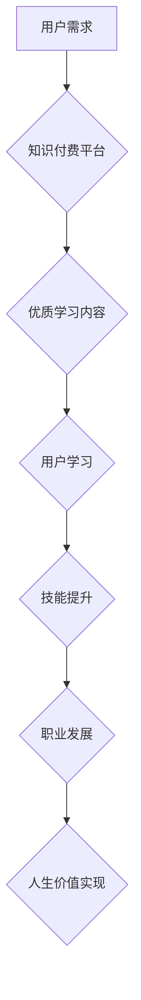

                 

## 知识付费让程序员实现人生价值

> 关键词：程序员、知识付费、人生价值、技术成长、职业发展、技能提升、社区建设、未来趋势

### 1. 背景介绍

在当今科技飞速发展的时代，程序员作为数字时代的基石，肩负着构建未来世界的重任。然而，技术迭代日新月异，学习曲线陡峭，程序员面临着持续学习和进阶的挑战。传统教育模式难以满足快速变化的市场需求，而知识付费模式的兴起为程序员提供了新的学习和成长路径。

知识付费，是指通过付费获取知识、技能和服务的商业模式。它打破了传统教育的时空限制，让学习变得更加灵活、个性化和高效。对于程序员而言，知识付费提供了以下优势：

* **精准学习:**  知识付费平台提供丰富的课程和资源，涵盖各个编程语言、框架和技术领域，程序员可以根据自身需求和目标进行精准学习。
* **高效提升:**  知识付费课程通常由经验丰富的行业专家授课，内容紧凑、实用，能够帮助程序员快速提升技能水平。
* **互动交流:**  许多知识付费平台提供在线社区和论坛，程序员可以与老师和同龄人交流学习，共同进步。
* **成本效益:**  相对于传统教育，知识付费的成本相对较低，并且可以根据自身学习进度和需求灵活选择付费方式。

### 2. 核心概念与联系

知识付费的核心概念是将知识和技能作为商品，通过付费的方式提供给学习者。它建立在以下几个关键要素之上：

* **内容价值:**  知识付费平台需要提供高质量、有价值的学习内容，才能吸引用户付费。
* **知识产权:**  知识付费平台需要保护知识产权，确保知识内容的独特性和可持续性。
* **用户体验:**  知识付费平台需要提供良好的用户体验，包括易于使用的界面、便捷的支付方式和高效的学习服务。
* **社区建设:**  知识付费平台需要构建活跃的学习社区，促进用户之间的交流和互动，形成良性循环。

**Mermaid 流程图**



### 3. 核心算法原理 & 具体操作步骤

知识付费平台的运营离不开一系列算法的支撑，这些算法负责内容推荐、用户匹配、学习进度分析等关键环节。

#### 3.1  算法原理概述

* **协同过滤算法:**  根据用户的历史学习行为和相似用户的信息，推荐相关的学习内容。
* **内容基准算法:**  根据学习内容的主题、标签和关键词，推荐与用户兴趣相符的内容。
* **深度学习算法:**  利用神经网络模型，分析用户学习数据，预测用户的学习偏好和未来需求。

#### 3.2  算法步骤详解

* **数据收集:**  收集用户学习行为、兴趣偏好、学习进度等数据。
* **数据预处理:**  对收集到的数据进行清洗、转换和特征提取。
* **模型训练:**  利用机器学习算法，训练推荐模型。
* **模型评估:**  评估模型的推荐效果，并进行调整优化。
* **内容推荐:**  根据用户的特征和模型预测，推荐相关的学习内容。

#### 3.3  算法优缺点

* **优点:**  能够精准推荐用户感兴趣的内容，提高学习效率。
* **缺点:**  需要大量的数据进行训练，算法模型的复杂度较高，容易出现冷启动问题。

#### 3.4  算法应用领域

* **内容推荐系统:**  推荐新闻、视频、书籍等内容。
* **电商平台:**  推荐商品、服务和优惠活动。
* **社交网络:**  推荐好友、群组和话题。

### 4. 数学模型和公式 & 详细讲解 & 举例说明

知识付费平台的运营涉及到许多数学模型和公式，例如用户行为分析模型、学习进度预测模型、内容推荐模型等。

#### 4.1  数学模型构建

用户行为分析模型可以利用马尔科夫链模型来预测用户的学习路径和行为模式。

#### 4.2  公式推导过程

马尔科夫链模型的转移概率矩阵可以表示为：

$$P = \begin{bmatrix}
p_{11} & p_{12} & \cdots & p_{1N} \\
p_{21} & p_{22} & \cdots & p_{2N} \\
\vdots & \vdots & \ddots & \vdots \\
p_{N1} & p_{N2} & \cdots & p_{NN}
\end{bmatrix}$$

其中，$p_{ij}$ 表示用户从状态 $i$ 转移到状态 $j$ 的概率。

#### 4.3  案例分析与讲解

假设一个用户学习了以下课程：

* 课程 A
* 课程 B
* 课程 C
* 课程 A

根据马尔科夫链模型，我们可以计算用户从课程 A 转移到课程 B 的概率，以及用户从课程 B 转移到课程 C 的概率等。

### 5. 项目实践：代码实例和详细解释说明

以下是一个简单的知识付费平台推荐算法的代码实例，使用 Python 语言实现：

#### 5.1  开发环境搭建

* Python 3.x
* Pandas
* Scikit-learn

#### 5.2  源代码详细实现

```python
import pandas as pd
from sklearn.metrics.pairwise import cosine_similarity

# 加载用户学习数据
data = pd.read_csv('user_learning_data.csv')

# 计算用户之间的相似度
user_similarity = cosine_similarity(data)

# 获取用户 A 的学习历史
user_A_history = data.loc[data['user_id'] == 'A', 'course_id'].values

# 推荐与用户 A 相似用户的学习内容
similar_users = user_similarity[data['user_id'] == 'A'].argsort()[:-6:-1]
recommended_courses = data.loc[similar_users, 'course_id'].unique()

# 打印推荐结果
print(f'推荐给用户 A 的课程：{recommended_courses}')
```

#### 5.3  代码解读与分析

* 该代码首先加载用户学习数据，然后使用余弦相似度计算用户之间的相似度。
* 接着，获取用户 A 的学习历史，并根据用户相似度推荐与用户 A 相似用户的学习内容。
* 最后，打印推荐结果。

#### 5.4  运行结果展示

运行结果将显示出与用户 A 相似用户的学习内容，这些内容可能对用户 A 具有参考价值。

### 6. 实际应用场景

知识付费模式在程序员领域有着广泛的应用场景：

* **在线编程课程:**  许多在线教育平台提供编程语言、框架和技术领域的课程，例如 Udemy、Coursera、Codecademy 等。
* **技术博客和论坛:**  一些技术博客和论坛提供付费会员服务，会员可以获得更深入的技术内容、社区支持和职业发展指导。
* **技术社区和社群:**  一些技术社区和社群提供付费会员服务，会员可以参与线下活动、获得行业资源和与专家交流的机会。
* **技术咨询和辅导:**  一些程序员提供技术咨询和辅导服务，帮助其他程序员解决技术难题和提升技能水平。

### 6.4  未来应用展望

未来，知识付费模式将更加深入地融入程序员的学习和成长路径，以下是一些未来应用展望：

* **个性化学习:**  利用人工智能技术，提供更加个性化的学习方案和推荐内容。
* **沉浸式学习:**  利用虚拟现实和增强现实技术，打造更加沉浸式的学习体验。
* **元宇宙学习:**  在元宇宙环境中，程序员可以与其他学习者互动交流，共同学习和探索。
* **跨界学习:**  知识付费平台将更加注重跨界学习，帮助程序员学习其他领域的知识和技能，拓展职业发展空间。

### 7. 工具和资源推荐

#### 7.1  学习资源推荐

* **Udemy:**  https://www.udemy.com/
* **Coursera:**  https://www.coursera.org/
* **Codecademy:**  https://www.codecademy.com/
* **GitHub:**  https://github.com/

#### 7.2  开发工具推荐

* **Python:**  https://www.python.org/
* **Git:**  https://git-scm.com/
* **VS Code:**  https://code.visualstudio.com/

#### 7.3  相关论文推荐

* **Collaborative Filtering for Recommender Systems**
* **Deep Learning for Recommender Systems**
* **The Netflix Prize: A Case Study in Recommender Systems**

### 8. 总结：未来发展趋势与挑战

知识付费模式为程序员提供了新的学习和成长路径，但也面临着一些挑战：

#### 8.1  研究成果总结

* 知识付费平台能够提供精准的学习内容推荐，提高学习效率。
* 知识付费模式能够促进程序员之间的交流和互动，形成良性循环。
* 知识付费平台需要不断创新，提供更加个性化、沉浸式和跨界学习体验。

#### 8.2  未来发展趋势

* **人工智能驱动的个性化学习:**  利用人工智能技术，提供更加个性化的学习方案和推荐内容。
* **沉浸式和元宇宙学习:**  利用虚拟现实和增强现实技术，打造更加沉浸式的学习体验。
* **跨界学习和职业发展:**  知识付费平台将更加注重跨界学习，帮助程序员学习其他领域的知识和技能，拓展职业发展空间。

#### 8.3  面临的挑战

* **内容质量和原创性:**  知识付费平台需要提供高质量、有价值的学习内容，并确保知识内容的独特性和可持续性。
* **用户信任和数据安全:**  知识付费平台需要建立用户信任，保护用户数据安全。
* **商业模式和盈利模式:**  知识付费平台需要探索更加可持续的商业模式和盈利模式。

#### 8.4  研究展望

* **探索更有效的推荐算法:**  研究更有效的推荐算法，提高推荐精准度和用户体验。
* **构建更完善的学习社区:**  构建更完善的学习社区，促进用户之间的交流和互动，形成良性循环。
* **研究知识付费模式对程序员职业发展的影响:**  研究知识付费模式对程序员职业发展的影响，为程序员提供更加有效的职业发展指导。

### 9. 附录：常见问题与解答

* **Q: 如何选择合适的知识付费平台？**
* **A:**  选择知识付费平台时，需要考虑平台的课程质量、用户评价、价格和服务等因素。

* **Q: 如何保证知识付费内容的质量？**
* **A:**  优质的知识付费平台会邀请经验丰富的行业专家授课，并对课程内容进行严格审核。

* **Q: 如何避免知识付费平台的虚假宣传？**
* **A:**  选择正规的知识付费平台，阅读课程介绍和用户评价，并注意平台的退款政策。


作者：禅与计算机程序设计艺术 / Zen and the Art of Computer Programming 
<end_of_turn>

