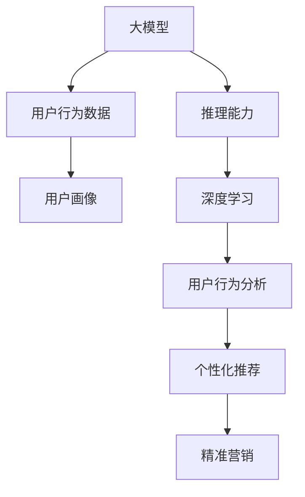
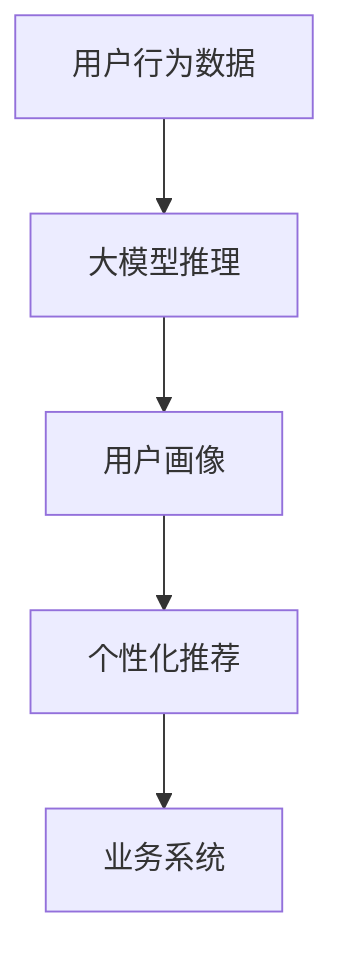

                 

# 大模型推理能力在用户行为建模中的应用

> 关键词：大模型推理,用户行为建模,自然语言处理(NLP),推荐系统,深度学习

## 1. 背景介绍

### 1.1 问题由来
在互联网时代，用户行为数据如搜索记录、点击流、评论等蕴含着丰富的价值信息，成为各大平台竞争的关键资源。然而，这些数据的海量、多维特性使得传统的数据建模和分析方法难以适应。随着大模型技术的崛起，使用深度学习模型进行用户行为建模已成为新的研究热点。

深度学习模型可以自动学习高维数据中的隐式特征，挖掘出数据背后的复杂规律，因此能够更高效地处理和分析用户行为数据。其中，大模型（Large Model）以其庞大的参数量和强大的推理能力，在推荐系统、内容分发、广告投放等场景中表现出色，逐渐成为用户行为建模的重要工具。

### 1.2 问题核心关键点
大模型在用户行为建模中的主要作用是通过对用户行为数据的深度推理，学习用户的行为模式、兴趣偏好、潜在需求等信息，并结合外部知识库、规则库等专家知识，构建高精度的用户画像，实现个性化推荐、精准营销等业务应用。

具体而言，大模型推理能力在用户行为建模中的应用包括以下几个关键点：

1. **用户行为表示学习**：将用户行为数据转化为高维向量表示，供大模型进行深度推理。
2. **个性化推荐预测**：利用大模型的推理能力，对用户未来行为进行预测，提供个性化推荐。
3. **兴趣演化追踪**：通过持续的用户行为记录，捕捉用户兴趣的动态变化，实现精准营销。
4. **用户行为分析**：对用户行为进行深入分析，挖掘出背后的规律和模式。

## 2. 核心概念与联系

### 2.1 核心概念概述

为了更好地理解大模型推理能力在用户行为建模中的应用，本节将介绍几个核心概念：

- **大模型（Large Model）**：指包含大量参数（通常是亿级别）的深度神经网络模型。这些模型通常以自回归或自编码的形式，通过在大规模数据上进行预训练，学习到丰富的语言表示。
- **用户行为数据（User Behavior Data）**：指用户在互联网平台上的行为记录，如搜索、点击、购买、评论等，可以用于分析用户的兴趣偏好和行为模式。
- **用户画像（User Profile）**：基于用户行为数据和外部知识库，构建的详细用户档案，用于个性化推荐、精准营销等业务应用。
- **推理能力（Inference Capability）**：指模型根据输入数据进行深度计算，输出合理预测结果的能力。
- **深度学习（Deep Learning）**：利用多层神经网络结构，学习数据中的隐式特征，从而实现对复杂数据的高效建模和分析。

这些核心概念之间的关系可以用以下Mermaid流程图来表示：



### 2.2 核心概念原理和架构的 Mermaid 流程图

以下是一个简单的Mermaid流程图，展示了从用户行为数据到个性化推荐的主要流程：



这个流程图展示了用户行为数据通过大模型进行推理，生成用户画像，最终用于个性化推荐的过程。

## 3. 核心算法原理 & 具体操作步骤
### 3.1 算法原理概述

大模型推理能力在用户行为建模中的应用，主要基于深度学习和大规模数据训练。具体来说，大模型通过在大规模标注数据上预训练，学习到丰富的语言表示和隐式特征。然后，将用户行为数据输入模型进行推理，得到用户画像，用于个性化推荐等业务应用。

### 3.2 算法步骤详解

基于大模型的用户行为建模，通常包括以下几个关键步骤：

**Step 1: 数据预处理**
- 收集用户行为数据，并进行数据清洗和标准化处理。
- 将行为数据转化为大模型可以接受的形式，如TensorFlow、PyTorch格式。

**Step 2: 模型训练**
- 选择合适的预训练模型（如BERT、GPT等），并在大规模数据上进行微调。
- 设计适合用户行为建模的损失函数和优化器，如交叉熵、Adam等。
- 使用用户行为数据训练模型，不断优化模型参数，提升推理精度。

**Step 3: 推理计算**
- 将用户当前行为数据输入训练好的模型，进行推理计算。
- 模型输出用户画像，用于个性化推荐、精准营销等业务应用。

**Step 4: 业务应用**
- 结合用户画像和外部知识库，进行个性化推荐和精准营销。
- 持续收集用户反馈和行为数据，动态更新用户画像，保证模型效果。

### 3.3 算法优缺点

大模型推理能力在用户行为建模中的应用，有以下优点：

1. **高精度推理**：大模型强大的推理能力，能够学习到用户行为数据中的复杂规律，提升推荐的准确性。
2. **实时响应**：大模型通常采用分布式计算，可以在线实时进行推理，满足个性化推荐对实时性的要求。
3. **动态更新**：模型可以动态更新用户画像，捕捉用户兴趣的动态变化，提供更精准的推荐。

同时，该方法也存在一些缺点：

1. **高资源需求**：大模型的参数量大，对算力、内存、存储等资源需求较高，初期投入较大。
2. **数据依赖性强**：模型的效果很大程度上依赖于数据质量和数量，难以处理小样本数据。
3. **可解释性不足**：大模型作为"黑盒"模型，推理过程缺乏可解释性，难以调试和优化。
4. **泛化能力有限**：模型在不同领域和场景中的泛化能力有限，需要针对具体任务进行模型设计和微调。

尽管存在这些局限性，但就目前而言，大模型推理能力在用户行为建模中的应用仍是大数据时代的重要范式，广泛应用于个性化推荐、精准营销等领域，取得了显著的成效。

### 3.4 算法应用领域

基于大模型的用户行为建模，已经在推荐系统、内容分发、广告投放等多个领域得到广泛应用，具体包括：

- **个性化推荐**：通过分析用户历史行为数据，预测用户未来可能感兴趣的商品或服务，实现精准推荐。
- **内容分发**：利用用户行为数据，预测用户对不同内容的偏好，实现内容的智能分发和推荐。
- **广告投放**：分析用户行为数据，优化广告投放策略，提高广告点击率和转化率。
- **客户服务**：根据用户行为数据，预测用户的服务需求，实现智能客服和个性化推荐。
- **营销活动**：分析用户行为数据，制定精准的营销策略，提升用户转化率和满意度。

此外，大模型推理能力还在社交网络、金融交易、医疗健康等更多领域，推动了数据驱动的业务应用。随着大模型技术的不断发展，未来在用户行为建模中的应用前景将更加广阔。

## 4. 数学模型和公式 & 详细讲解  
### 4.1 数学模型构建

在用户行为建模中，大模型通常被用于学习用户行为数据的语义表示，并将学习到的表示用于推荐预测等任务。以下以推荐系统为例，介绍基于大模型的推荐模型构建方法。

假设用户行为数据由 $(x_i, y_i)$ 表示，其中 $x_i$ 为输入特征，$y_i$ 为真实标签（推荐结果）。我们希望利用大模型 $M_{\theta}$ 学习到用户行为数据的语义表示，用于推荐预测。

定义推荐模型的损失函数为 $\mathcal{L}(\theta)$，用于衡量模型的预测输出与真实标签之间的差异。常见的损失函数包括交叉熵损失、均方误差损失等。

在得到损失函数之后，我们可以使用梯度下降等优化算法，最小化损失函数，从而训练出推荐模型。

### 4.2 公式推导过程

以下是推荐模型的交叉熵损失函数及其梯度计算过程的公式推导：

$$
\mathcal{L}(\theta) = -\frac{1}{N}\sum_{i=1}^N y_i \log M_{\theta}(x_i)
$$

其中 $M_{\theta}(x_i)$ 为模型在输入 $x_i$ 上的输出，$y_i$ 为真实标签。

对损失函数求导，得到模型参数 $\theta$ 的梯度：

$$
\frac{\partial \mathcal{L}(\theta)}{\partial \theta} = -\frac{1}{N}\sum_{i=1}^N \frac{y_i}{M_{\theta}(x_i)} \frac{\partial M_{\theta}(x_i)}{\partial \theta}
$$

其中 $\frac{\partial M_{\theta}(x_i)}{\partial \theta}$ 为模型对输入 $x_i$ 的梯度，可以通过反向传播算法计算得到。

### 4.3 案例分析与讲解

以某电商平台的推荐系统为例，分析大模型的推理能力在用户行为建模中的应用。

首先，收集用户的行为数据，如浏览、点击、购买记录等，并将其转化为大模型可以接受的形式，如TensorFlow或PyTorch格式。

然后，选择合适的预训练模型（如BERT），在电商数据集上进行微调，设计交叉熵损失函数和Adam优化器。使用电商用户的行为数据训练模型，不断优化模型参数，提升推荐精度。

最后，将用户当前浏览、点击等行为数据输入训练好的模型，进行推理计算，输出推荐结果。结合用户画像和外部知识库，进行个性化推荐和精准营销。

## 5. 项目实践：代码实例和详细解释说明
### 5.1 开发环境搭建

在进行用户行为建模和大模型推理的开发实践前，需要准备好开发环境。以下是使用Python进行PyTorch开发的环境配置流程：

1. 安装Anaconda：从官网下载并安装Anaconda，用于创建独立的Python环境。

2. 创建并激活虚拟环境：
```bash
conda create -n pytorch-env python=3.8 
conda activate pytorch-env
```

3. 安装PyTorch：根据CUDA版本，从官网获取对应的安装命令。例如：
```bash
conda install pytorch torchvision torchaudio cudatoolkit=11.1 -c pytorch -c conda-forge
```

4. 安装Transformers库：
```bash
pip install transformers
```

5. 安装各类工具包：
```bash
pip install numpy pandas scikit-learn matplotlib tqdm jupyter notebook ipython
```

完成上述步骤后，即可在`pytorch-env`环境中开始开发实践。

### 5.2 源代码详细实现

下面我们以推荐系统为例，给出使用Transformers库对BERT模型进行推荐预测的PyTorch代码实现。

首先，定义推荐模型的数据处理函数：

```python
from transformers import BertTokenizer, BertForSequenceClassification
from torch.utils.data import Dataset
import torch

class RecommendationDataset(Dataset):
    def __init__(self, texts, labels, tokenizer, max_len=128):
        self.texts = texts
        self.labels = labels
        self.tokenizer = tokenizer
        self.max_len = max_len
        
    def __len__(self):
        return len(self.texts)
    
    def __getitem__(self, item):
        text = self.texts[item]
        label = self.labels[item]
        
        encoding = self.tokenizer(text, return_tensors='pt', max_length=self.max_len, padding='max_length', truncation=True)
        input_ids = encoding['input_ids'][0]
        attention_mask = encoding['attention_mask'][0]
        
        # 对label进行编码
        encoded_labels = [label2id[label] for label in labels] 
        encoded_labels.extend([label2id['']]*(self.max_len - len(encoded_labels)))
        labels = torch.tensor(encoded_labels, dtype=torch.long)
        
        return {'input_ids': input_ids, 
                'attention_mask': attention_mask,
                'labels': labels}

# 标签与id的映射
label2id = {'Positive': 0, 'Negative': 1}
id2label = {v: k for k, v in label2id.items()}

# 创建dataset
tokenizer = BertTokenizer.from_pretrained('bert-base-cased')

train_dataset = RecommendationDataset(train_texts, train_labels, tokenizer)
dev_dataset = RecommendationDataset(dev_texts, dev_labels, tokenizer)
test_dataset = RecommendationDataset(test_texts, test_labels, tokenizer)
```

然后，定义模型和优化器：

```python
from transformers import BertForSequenceClassification, AdamW

model = BertForSequenceClassification.from_pretrained('bert-base-cased', num_labels=len(label2id))

optimizer = AdamW(model.parameters(), lr=2e-5)
```

接着，定义训练和评估函数：

```python
from torch.utils.data import DataLoader
from tqdm import tqdm
from sklearn.metrics import classification_report

device = torch.device('cuda') if torch.cuda.is_available() else torch.device('cpu')
model.to(device)

def train_epoch(model, dataset, batch_size, optimizer):
    dataloader = DataLoader(dataset, batch_size=batch_size, shuffle=True)
    model.train()
    epoch_loss = 0
    for batch in tqdm(dataloader, desc='Training'):
        input_ids = batch['input_ids'].to(device)
        attention_mask = batch['attention_mask'].to(device)
        labels = batch['labels'].to(device)
        model.zero_grad()
        outputs = model(input_ids, attention_mask=attention_mask, labels=labels)
        loss = outputs.loss
        epoch_loss += loss.item()
        loss.backward()
        optimizer.step()
    return epoch_loss / len(dataloader)

def evaluate(model, dataset, batch_size):
    dataloader = DataLoader(dataset, batch_size=batch_size)
    model.eval()
    preds, labels = [], []
    with torch.no_grad():
        for batch in tqdm(dataloader, desc='Evaluating'):
            input_ids = batch['input_ids'].to(device)
            attention_mask = batch['attention_mask'].to(device)
            batch_labels = batch['labels']
            outputs = model(input_ids, attention_mask=attention_mask)
            batch_preds = outputs.logits.argmax(dim=2).to('cpu').tolist()
            batch_labels = batch_labels.to('cpu').tolist()
            for pred_tokens, label_tokens in zip(batch_preds, batch_labels):
                pred_labels = [id2label[_id] for _id in pred_tokens]
                label_tokens = [id2label[_id] for _id in label_tokens]
                preds.append(pred_labels[:len(label_tokens)])
                labels.append(label_tokens)
                
    print(classification_report(labels, preds))
```

最后，启动训练流程并在测试集上评估：

```python
epochs = 5
batch_size = 16

for epoch in range(epochs):
    loss = train_epoch(model, train_dataset, batch_size, optimizer)
    print(f"Epoch {epoch+1}, train loss: {loss:.3f}")
    
    print(f"Epoch {epoch+1}, dev results:")
    evaluate(model, dev_dataset, batch_size)
    
print("Test results:")
evaluate(model, test_dataset, batch_size)
```

以上就是使用PyTorch对BERT进行推荐预测的完整代码实现。可以看到，得益于Transformers库的强大封装，我们可以用相对简洁的代码完成BERT模型的加载和微调。

### 5.3 代码解读与分析

让我们再详细解读一下关键代码的实现细节：

**RecommendationDataset类**：
- `__init__`方法：初始化训练集和验证集，将文本和标签转化为模型可接受的形式。
- `__len__`方法：返回数据集的样本数量。
- `__getitem__`方法：对单个样本进行处理，将文本输入编码为token ids，将标签编码为数字，并对其进行定长padding。

**label2id和id2label字典**：
- 定义了标签与数字id之间的映射关系，用于将模型输出解码为真实的推荐结果。

**训练和评估函数**：
- 使用PyTorch的DataLoader对数据集进行批次化加载，供模型训练和推理使用。
- 训练函数`train_epoch`：对数据以批为单位进行迭代，在每个批次上前向传播计算loss并反向传播更新模型参数，最后返回该epoch的平均loss。
- 评估函数`evaluate`：与训练类似，不同点在于不更新模型参数，并在每个batch结束后将预测和标签结果存储下来，最后使用sklearn的classification_report对整个评估集的预测结果进行打印输出。

**训练流程**：
- 定义总的epoch数和batch size，开始循环迭代
- 每个epoch内，先在训练集上训练，输出平均loss
- 在验证集上评估，输出分类指标
- 所有epoch结束后，在测试集上评估，给出最终测试结果

可以看到，PyTorch配合Transformers库使得BERT微调的代码实现变得简洁高效。开发者可以将更多精力放在数据处理、模型改进等高层逻辑上，而不必过多关注底层的实现细节。

当然，工业级的系统实现还需考虑更多因素，如模型的保存和部署、超参数的自动搜索、更灵活的任务适配层等。但核心的微调范式基本与此类似。

## 6. 实际应用场景
### 6.1 智能推荐系统

智能推荐系统是用户行为建模和大模型推理能力的重要应用场景。传统推荐系统通常依赖用户历史行为数据进行推荐，难以处理冷启动用户和新需求。而大模型通过深度推理，能够捕捉用户兴趣的动态变化，实现冷启动推荐和新需求推荐。

在实际应用中，推荐系统通常采用以下步骤：

1. 收集用户的行为数据，如浏览、点击、购买记录等，并进行数据清洗和标准化处理。
2. 将行为数据转化为大模型可以接受的形式，如TensorFlow或PyTorch格式。
3. 选择合适的预训练模型（如BERT），在电商数据集上进行微调，设计交叉熵损失函数和Adam优化器。
4. 使用电商用户的行为数据训练模型，不断优化模型参数，提升推荐精度。
5. 将用户当前浏览、点击等行为数据输入训练好的模型，进行推理计算，输出推荐结果。
6. 结合用户画像和外部知识库，进行个性化推荐和精准营销。

通过大模型推理能力，智能推荐系统能够在短时间内快速响应用户需求，提供个性化的推荐服务。这种推荐方式不仅能够提升用户体验，还能增加用户粘性和消费金额，成为电商平台的重要竞争力。

### 6.2 广告投放优化

广告投放优化是大模型推理能力在广告领域的重要应用。传统广告投放通常采用人工经验和A/B测试等方法，难以实时动态调整投放策略。而大模型通过深度推理，能够实时分析用户行为数据，优化广告投放策略，提高广告点击率和转化率。

在实际应用中，广告投放优化通常采用以下步骤：

1. 收集用户的行为数据，如浏览、点击、购买记录等，并进行数据清洗和标准化处理。
2. 将行为数据转化为大模型可以接受的形式，如TensorFlow或PyTorch格式。
3. 选择合适的预训练模型（如BERT），在广告数据集上进行微调，设计交叉熵损失函数和Adam优化器。
4. 使用广告用户的行为数据训练模型，不断优化模型参数，提升广告投放效果。
5. 将用户当前浏览、点击等行为数据输入训练好的模型，进行推理计算，输出推荐结果。
6. 结合用户画像和外部知识库，进行实时动态的广告投放策略调整。

通过大模型推理能力，广告投放优化能够实时动态调整投放策略，根据用户行为数据进行精准投放，提高广告效果和投放效率。这种广告投放方式不仅能够提升广告主的ROI，还能提升用户体验和品牌认知度，成为广告投放的重要工具。

### 6.3 客户服务优化

客户服务优化是大模型推理能力在客服领域的重要应用。传统客服系统通常采用人工客服和FAQ机器人等方法，难以快速响应客户需求。而大模型通过深度推理，能够实时分析用户行为数据，优化客服系统，提高客户满意度。

在实际应用中，客户服务优化通常采用以下步骤：

1. 收集用户的客服咨询记录，并进行数据清洗和标准化处理。
2. 将咨询记录转化为大模型可以接受的形式，如TensorFlow或PyTorch格式。
3. 选择合适的预训练模型（如BERT），在客服数据集上进行微调，设计交叉熵损失函数和Adam优化器。
4. 使用客服用户的行为数据训练模型，不断优化模型参数，提升客服系统效果。
5. 将用户当前咨询记录输入训练好的模型，进行推理计算，输出推荐结果。
6. 结合用户画像和外部知识库，进行实时动态的客服系统优化。

通过大模型推理能力，客户服务优化能够实时动态优化客服系统，根据用户行为数据进行精准回答，提高客户满意度。这种客服系统不仅能够提升客户体验，还能降低人工客服成本，成为客服系统的重要工具。

## 7. 工具和资源推荐
### 7.1 学习资源推荐

为了帮助开发者系统掌握大模型推理能力在用户行为建模中的应用，这里推荐一些优质的学习资源：

1. 《深度学习理论与实践》系列博文：由大模型技术专家撰写，深入浅出地介绍了深度学习理论和实践，涵盖了大模型推理等前沿话题。

2. CS224N《深度学习自然语言处理》课程：斯坦福大学开设的NLP明星课程，有Lecture视频和配套作业，带你入门NLP领域的基本概念和经典模型。

3. 《Natural Language Processing with Transformers》书籍：Transformers库的作者所著，全面介绍了如何使用Transformers库进行NLP任务开发，包括大模型推理在内的诸多范式。

4. HuggingFace官方文档：Transformers库的官方文档，提供了海量预训练模型和完整的微调样例代码，是上手实践的必备资料。

5. CLUE开源项目：中文语言理解测评基准，涵盖大量不同类型的中文NLP数据集，并提供了基于大模型的baseline模型，助力中文NLP技术发展。

通过对这些资源的学习实践，相信你一定能够快速掌握大模型推理能力在用户行为建模中的应用，并用于解决实际的NLP问题。

### 7.2 开发工具推荐

高效的开发离不开优秀的工具支持。以下是几款用于大模型推理能力在用户行为建模中开发的常用工具：

1. PyTorch：基于Python的开源深度学习框架，灵活动态的计算图，适合快速迭代研究。大部分预训练语言模型都有PyTorch版本的实现。

2. TensorFlow：由Google主导开发的开源深度学习框架，生产部署方便，适合大规模工程应用。同样有丰富的预训练语言模型资源。

3. Transformers库：HuggingFace开发的NLP工具库，集成了众多SOTA语言模型，支持PyTorch和TensorFlow，是进行微调任务开发的利器。

4. Weights & Biases：模型训练的实验跟踪工具，可以记录和可视化模型训练过程中的各项指标，方便对比和调优。与主流深度学习框架无缝集成。

5. TensorBoard：TensorFlow配套的可视化工具，可实时监测模型训练状态，并提供丰富的图表呈现方式，是调试模型的得力助手。

6. Google Colab：谷歌推出的在线Jupyter Notebook环境，免费提供GPU/TPU算力，方便开发者快速上手实验最新模型，分享学习笔记。

合理利用这些工具，可以显著提升大模型推理能力在用户行为建模中的开发效率，加快创新迭代的步伐。

### 7.3 相关论文推荐

大模型推理能力在用户行为建模的发展源于学界的持续研究。以下是几篇奠基性的相关论文，推荐阅读：

1. Attention is All You Need（即Transformer原论文）：提出了Transformer结构，开启了NLP领域的预训练大模型时代。

2. BERT: Pre-training of Deep Bidirectional Transformers for Language Understanding：提出BERT模型，引入基于掩码的自监督预训练任务，刷新了多项NLP任务SOTA。

3. Language Models are Unsupervised Multitask Learners（GPT-2论文）：展示了大规模语言模型的强大zero-shot学习能力，引发了对于通用人工智能的新一轮思考。

4. Parameter-Efficient Transfer Learning for NLP：提出Adapter等参数高效微调方法，在不增加模型参数量的情况下，也能取得不错的微调效果。

5. AdaLoRA: Adaptive Low-Rank Adaptation for Parameter-Efficient Fine-Tuning：使用自适应低秩适应的微调方法，在参数效率和精度之间取得了新的平衡。

6. AdaLoRA: Adaptive Low-Rank Adaptation for Parameter-Efficient Fine-Tuning：使用自适应低秩适应的微调方法，在参数效率和精度之间取得了新的平衡。

这些论文代表了大模型推理能力在用户行为建模的发展脉络。通过学习这些前沿成果，可以帮助研究者把握学科前进方向，激发更多的创新灵感。

## 8. 总结：未来发展趋势与挑战

### 8.1 总结

本文对大模型推理能力在用户行为建模中的应用进行了全面系统的介绍。首先阐述了大模型和用户行为建模的研究背景和意义，明确了推理能力在提升推荐精度、优化广告投放、提高客服系统等方面的独特价值。其次，从原理到实践，详细讲解了大模型的推理过程和关键步骤，给出了用户行为建模和大模型推理的完整代码实例。同时，本文还广泛探讨了大模型推理能力在推荐系统、广告投放、客户服务等多个领域的应用前景，展示了推理范式的巨大潜力。此外，本文精选了推理能力的各类学习资源，力求为读者提供全方位的技术指引。

通过本文的系统梳理，可以看到，大模型推理能力在用户行为建模中的应用正成为NLP领域的重要范式，广泛应用于推荐系统、广告投放、客户服务等领域，取得了显著的成效。未来，伴随大模型技术的不断发展，推理能力在用户行为建模中的应用将更加广泛，进一步推动NLP技术的产业化进程。

### 8.2 未来发展趋势

展望未来，大模型推理能力在用户行为建模将呈现以下几个发展趋势：

1. **推理模型的规模增大**：随着算力成本的下降和数据规模的扩张，大模型的参数量和推理能力将进一步提升。超大规模语言模型蕴含的丰富知识，将带来更精准的推荐效果。

2. **推理过程的计算优化**：为了提高推理效率，推理模型的计算图将被不断优化，如梯度积累、混合精度训练等技术将被更广泛地应用。

3. **多模态推理的拓展**：推理能力将不仅仅局限于文本数据，将进一步拓展到图像、视频、语音等多模态数据，实现视觉、语音、文本的综合推理。

4. **深度学习与因果推理的融合**：深度推理将与因果推理、强化学习等技术进一步融合，提升推理模型的鲁棒性和可解释性。

5. **用户行为预测的精细化**：随着深度学习算法的进步，用户行为的预测精度将不断提升，推荐系统将更加精准、个性化。

6. **跨领域推理的通用化**：大模型推理能力将不仅应用于特定领域，将进一步拓展到多个领域，形成跨领域的通用推理模型。

以上趋势凸显了大模型推理能力在用户行为建模中的广阔前景。这些方向的探索发展，必将进一步提升推荐系统的性能和用户满意度，推动NLP技术在更广泛的业务场景中应用。

### 8.3 面临的挑战

尽管大模型推理能力在用户行为建模中取得了显著成效，但在实际应用中仍面临一些挑战：

1. **数据质量与标注成本**：高质量标注数据的获取成本较高，用户行为数据的清洗和标准化处理也需要大量时间和资源。

2. **模型资源需求高**：大模型的参数量大，对算力、内存、存储等资源需求较高，初期投入较大。

3. **推理过程的透明性不足**：大模型作为"黑盒"模型，推理过程缺乏可解释性，难以调试和优化。

4. **多模态数据融合难度大**：图像、视频、语音等多模态数据的整合和融合，仍存在技术和工程上的困难。

5. **跨领域推理能力有限**：大模型在不同领域和场景中的泛化能力有限，需要针对具体任务进行模型设计和微调。

尽管存在这些挑战，但就目前而言，大模型推理能力在用户行为建模中的应用仍是大数据时代的重要范式，广泛应用于推荐系统、广告投放、客户服务等领域，取得了显著的成效。未来，伴随技术的进步和更多实践的积累，这些挑战将逐步被克服，大模型推理能力在用户行为建模中的应用将更加广泛和深入。

### 8.4 研究展望

面对大模型推理能力在用户行为建模中面临的挑战，未来的研究需要在以下几个方面寻求新的突破：

1. **无监督和半监督推理**：探索无监督和半监督推理方法，降低对标注数据的依赖，利用非结构化数据进行推理。

2. **参数高效推理**：开发更加参数高效的推理方法，在固定大部分预训练参数的情况下，只更新极少量的任务相关参数。

3. **多模态推理**：研究多模态数据融合技术，提升视觉、语音、文本的综合推理能力。

4. **跨领域推理**：设计跨领域推理模型，提升大模型在不同领域和场景中的泛化能力。

5. **可解释性推理**：研究推理过程的可解释性技术，提升模型的透明性和可调试性。

6. **伦理与安全性**：设计伦理导向的推理模型，避免模型输出偏见和有害信息，确保模型的安全性和可信性。

这些研究方向的探索，必将引领大模型推理能力在用户行为建模中迈向更高的台阶，为构建安全、可靠、可解释、可控的智能系统铺平道路。面向未来，大模型推理能力在用户行为建模技术还需要与其他人工智能技术进行更深入的融合，如知识表示、因果推理、强化学习等，多路径协同发力，共同推动自然语言理解和智能交互系统的进步。只有勇于创新、敢于突破，才能不断拓展语言模型的边界，让智能技术更好地造福人类社会。

## 9. 附录：常见问题与解答

**Q1：大模型推理能力是否适用于所有NLP任务？**

A: 大模型推理能力在大多数NLP任务上都能取得不错的效果，特别是对于数据量较大的任务。但对于一些特定领域的任务，如医学、法律等，仅靠通用语料预训练的模型可能难以很好地适应。此时需要在特定领域语料上进一步预训练，再进行推理。此外，对于一些需要时效性、个性化很强的任务，如对话、推荐等，推理能力也需要针对性的改进优化。

**Q2：推理过程中如何优化计算效率？**

A: 推理过程的计算优化可以通过以下几种方式：
1. 梯度积累：使用多个batch的梯度进行更新，降低每次迭代对内存的占用。
2. 混合精度训练：将浮点模型转为定点模型，压缩存储空间，提高计算效率。
3. 模型裁剪：去除不必要的层和参数，减小模型尺寸，加快推理速度。
4. 分布式计算：使用多台机器进行并行计算，提高推理速度。
5. 硬件加速：使用GPU、TPU等硬件加速推理过程。

这些优化方式可以结合使用，进一步提升大模型推理能力的应用效率。

**Q3：推理模型的训练过程中如何控制过拟合？**

A: 推理模型的训练过程中，可以通过以下几种方式控制过拟合：
1. 数据增强：通过回译、近义替换等方式扩充训练集。
2. 正则化：使用L2正则、Dropout等方法防止模型过度适应小样本数据。
3. 对抗训练：加入对抗样本，提高模型鲁棒性。
4. 早停机制：在验证集性能不再提升时，停止训练。
5. 学习率调度：逐步减小学习率，避免模型过拟合。

这些方法可以结合使用，最大限度地防止过拟合，提高模型泛化能力。

**Q4：推理模型的输出如何解释？**

A: 推理模型的输出解释通常需要借助工具和技术，以下几种方式可以提供一定程度的解释：
1. 特征重要性分析：使用SHAP、LIME等工具，分析模型对输入特征的敏感度。
2. 可视化方法：通过Attention、 heatmap等方法，可视化模型的推理过程。
3. 用户交互设计：设计良好的用户界面，通过示例数据展示模型的推理过程。
4. 模型集成：通过多种模型的集成，提供多样化的解释结果。

这些方法可以结合使用，提升模型的可解释性和用户满意度。

**Q5：推理模型在不同领域的应用效果如何？**

A: 推理模型在不同领域的应用效果存在差异，主要取决于领域的特点和数据的质量。例如：
1. 推荐系统：推理模型在推荐系统中的应用效果显著，能够提供个性化的推荐服务。
2. 广告投放：推理模型在广告投放中的应用效果显著，能够优化广告投放策略，提高广告点击率和转化率。
3. 客服系统：推理模型在客服系统中的应用效果显著，能够提升客服系统的响应速度和用户满意度。
4. 内容分发：推理模型在内容分发中的应用效果显著，能够提高内容推荐的精准度。

需要注意的是，推理模型在不同领域的应用效果还受限于数据质量和领域特点，需要根据具体情况进行优化和调整。

**Q6：推理模型如何应对数据分布的变化？**

A: 推理模型应对数据分布的变化，可以通过以下几种方式：
1. 持续学习：通过不断更新模型参数，适应数据分布的变化。
2. 自适应训练：使用自适应训练技术，如AdaLoRA等，优化模型参数，提升模型适应新数据的能力。
3. 动态数据采集：根据用户行为数据的变化，动态采集新数据，更新训练集。
4. 模型融合：将多个推理模型进行融合，提升模型的泛化能力。

这些方法可以结合使用，提高推理模型应对数据分布变化的能力。

**Q7：推理模型如何提升用户满意度？**

A: 推理模型提升用户满意度的方法包括以下几个方面：
1. 个性化推荐：通过推理模型对用户兴趣进行精准预测，提供个性化的推荐服务。
2. 实时响应：通过推理模型实现实时动态的业务应用，提升用户体验。
3. 多模态数据融合：通过融合视觉、语音、文本等多种数据，提升推理模型的准确性和全面性。
4. 用户反馈机制：建立用户反馈机制，及时调整推理模型的参数，优化模型性能。
5. 透明性设计：通过设计良好的用户界面，提高用户对模型的信任度和满意度。

这些方法可以结合使用，提升推理模型在实际应用中的用户满意度。

---

作者：禅与计算机程序设计艺术 / Zen and the Art of Computer Programming

