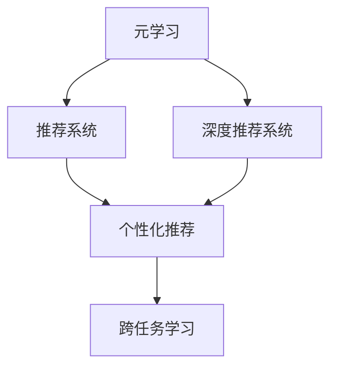

                 

# 大模型推荐中的元学习方法

> 关键词：大模型推荐,元学习,推荐系统,深度学习,推荐算法,个性化推荐,模型优化,推荐策略,数据驱动,用户行为

## 1. 背景介绍

### 1.1 问题由来
随着互联网的迅猛发展和普及，信息量呈现出爆炸式增长。用户在海量信息中寻找所需内容，变得越来越困难。为了提升用户体验，推荐系统应运而生，旨在通过分析用户的历史行为数据，预测其未来的偏好，为其提供个性化的推荐内容。

然而，传统的推荐算法往往依赖固定的模型和固定的特征，难以适应动态变化的用户行为和复杂多变的环境。为此，深度学习驱动的推荐系统应运而生。通过结合大规模深度学习模型，推荐系统可以在处理大量数据的同时，学习到更加精准的用户画像，提供更加个性化、多样化的推荐结果。

但是，这种基于模型驱动的推荐系统存在一些问题：模型参数往往难以调节，模型更新速度较慢，无法及时响应用户偏好的变化。同时，模型的优化过程容易陷入局部最优，导致泛化能力不足。为了解决这些问题，元学习（Meta Learning）应运而生。

元学习是一种能够自我调整学习过程的机器学习方法，通过在多任务或数据集上训练，使模型能够适应新任务或新数据的能力得到提升。元学习的目标是让模型能够在不同的数据集或任务上，通过少量迭代，快速适应并优化新任务，实现跨任务、跨数据集的高效迁移学习。

## 2. 核心概念与联系

### 2.1 核心概念概述

为更好地理解元学习在大模型推荐中的应用，本节将介绍几个密切相关的核心概念：

- 元学习（Meta Learning）：指机器学习模型在多个任务或数据集上进行训练，从而适应新任务的能力。元学习使模型能够在缺乏大量标注数据的情况下，快速适应新任务。
- 推荐系统（Recommender System）：指通过算法为用户推荐物品或内容的系统。推荐系统可以极大地提升用户体验，促进信息的快速流通。
- 深度推荐系统（Deep Recommender System）：指结合深度学习技术进行推荐，能更好地捕捉用户行为的特征，提供更加个性化和多样化的推荐结果。
- 个性化推荐（Personalized Recommendation）：指针对用户个人兴趣和行为习惯，提供量身定制的推荐内容，使用户能够更快找到所需信息。
- 跨任务学习（Transfer Learning）：指在一个任务上学习的知识，可以迁移到另一个相关任务上使用，减少重新训练模型的时间和成本。

这些核心概念之间的逻辑关系可以通过以下Mermaid流程图来展示：



这个流程图展示了大模型推荐中的元学习、推荐系统、深度推荐系统和个性化推荐之间的联系：

1. 元学习是推荐系统、深度推荐系统的基础，使模型能够适应新任务，具备跨任务学习能力。
2. 推荐系统、深度推荐系统、个性化推荐是元学习的具体应用场景，通过结合元学习方法，提升推荐模型的泛化能力和个性化程度。
3. 跨任务学习是元学习的一个重要组成部分，通过在多个任务上训练模型，使模型具备更高的迁移能力和泛化能力。

## 3. 核心算法原理 & 具体操作步骤
### 3.1 算法原理概述

在大模型推荐中，元学习主要应用于模型训练和优化过程。其核心思想是：在多个推荐任务上对深度推荐模型进行微调，使其能够快速适应新任务，同时提升模型的泛化能力和个性化程度。具体而言，元学习算法通常包含以下几个步骤：

1. **数据准备**：收集多个推荐任务的数据集，并对其进行预处理，如文本清洗、特征提取等。
2. **模型训练**：在多个数据集上对模型进行联合训练，使得模型能够学习到不同任务间的共性特征。
3. **任务适应**：将模型应用到新的推荐任务上，并对其进行微调，以适应新任务的特征和要求。
4. **性能评估**：在验证集和测试集上评估模型的性能，并根据评估结果进行进一步优化。

### 3.2 算法步骤详解

下面详细讲解元学习在大模型推荐中的具体实现步骤：

**Step 1: 数据准备**

首先，我们需要准备多个推荐任务的数据集。这些数据集应包含用户行为数据（如点击、浏览、评分等）和物品属性数据（如价格、类别、评分等）。对于每个数据集，还需要进行以下预处理：

1. **数据清洗**：去除无效数据和噪声数据，提高数据的质量和可靠性。
2. **特征提取**：将用户行为和物品属性数据转化为数值特征，供模型进行训练。
3. **标准化**：对特征进行标准化处理，确保特征值的范围一致，提高模型的训练效率。
4. **分拆数据集**：将数据集分为训练集、验证集和测试集，用于模型训练、评估和优化。

**Step 2: 模型训练**

接下来，我们需要在多个数据集上对深度推荐模型进行联合训练。具体步骤如下：

1. **初始化模型**：选择适当的深度推荐模型，如深度神经网络、协同过滤模型、矩阵分解等，并将其作为模型的初始参数。
2. **设置元学习算法**：选择适当的元学习算法，如Meta-Learning、Reinforcement Learning等，并设置其超参数，如学习率、训练轮数等。
3. **联合训练**：在多个数据集上对模型进行联合训练，使得模型能够学习到不同任务间的共性特征。

**Step 3: 任务适应**

在联合训练完成后，我们需要将模型应用到新的推荐任务上，并对其进行微调。具体步骤如下：

1. **任务适配层**：根据新的推荐任务，设计合适的输出层和损失函数。
2. **微调超参数**：设置微调的超参数，如学习率、批大小、迭代轮数等。
3. **执行微调**：在新的数据集上对模型进行微调，以适应新任务的特征和要求。

**Step 4: 性能评估**

在微调完成后，我们需要在验证集和测试集上评估模型的性能。具体步骤如下：

1. **设置评估指标**：根据推荐任务的特点，选择合适的评估指标，如准确率、召回率、F1分数等。
2. **评估模型性能**：在验证集和测试集上评估模型的性能，记录其各个评估指标的值。
3. **进一步优化**：根据评估结果，对模型进行进一步优化，以提升其在特定任务上的性能。

### 3.3 算法优缺点

元学习算法在大模型推荐中具有以下优点：

1. **泛化能力提升**：元学习算法能够在多个任务上联合训练模型，使其具备更强的泛化能力，能够更好地适应新任务。
2. **个性化推荐提升**：元学习算法能够根据用户的历史行为数据，快速适应新任务，提供更个性化的推荐结果。
3. **计算效率提升**：元学习算法能够在多个任务上联合训练模型，减少重复训练的时间和成本。
4. **模型优化提升**：元学习算法能够优化模型的参数，使其能够更快地收敛到最优解。

同时，元学习算法也存在以下缺点：

1. **数据依赖性强**：元学习算法依赖于多个推荐任务的数据集，对数据质量和数量的要求较高。
2. **模型复杂度高**：元学习算法需要在多个任务上联合训练模型，模型的复杂度较高，计算资源需求较大。
3. **训练时间较长**：元学习算法需要在多个任务上联合训练模型，训练时间较长，无法快速响应用户的即时需求。
4. **模型鲁棒性不足**：元学习算法在面对新任务时，模型容易过拟合，泛化能力不足。

尽管存在这些缺点，但元学习算法仍是大模型推荐中常用的重要方法，能够有效提升推荐模型的性能和泛化能力。

### 3.4 算法应用领域

元学习算法在大模型推荐中的应用领域广泛，主要包括以下几个方面：

1. **个性化推荐系统**：元学习算法能够根据用户的历史行为数据，快速适应新任务，提供更个性化的推荐结果。
2. **跨任务推荐系统**：元学习算法能够在多个推荐任务上联合训练模型，使其具备更强的跨任务学习能力。
3. **协同过滤推荐系统**：元学习算法能够优化协同过滤模型的参数，提高其推荐效果和稳定性。
4. **多维推荐系统**：元学习算法能够优化多维推荐系统的参数，提高其对多维数据的处理能力和推荐效果。
5. **实时推荐系统**：元学习算法能够在多个任务上联合训练模型，减少计算资源需求，提高实时推荐的速度和精度。

## 4. 数学模型和公式 & 详细讲解  
### 4.1 数学模型构建

在大模型推荐中，元学习算法通常采用以下数学模型进行建模：

设推荐系统包含 $K$ 个用户和 $N$ 个物品，每个用户的历史行为数据表示为 $x_i$，物品的属性数据表示为 $y_j$，推荐系统模型的参数表示为 $\theta$。在多个推荐任务上，对模型进行联合训练的目标函数为：

$$
\min_{\theta} \sum_{k=1}^K \sum_{n=1}^N L_k(x_i, y_j, \theta)
$$

其中 $L_k(x_i, y_j, \theta)$ 表示第 $k$ 个用户在 $n$ 个物品上的推荐损失函数，可以是交叉熵损失、均方误差损失等。

在微调时，针对新的推荐任务，选择适当的损失函数 $L_{new}$，对其进行微调：

$$
\min_{\theta_{new}} L_{new}(x_i, y_j, \theta_{new})
$$

其中 $x_i$ 和 $y_j$ 为新推荐任务上的用户行为数据和物品属性数据。

### 4.2 公式推导过程

以下我们以二分类推荐任务为例，推导元学习模型的损失函数及其梯度计算。

假设推荐系统包含 $K$ 个用户和 $N$ 个物品，每个用户的历史行为数据表示为 $x_i$，物品的属性数据表示为 $y_j$，推荐系统模型的参数表示为 $\theta$。在多个推荐任务上，对模型进行联合训练的目标函数为：

$$
\min_{\theta} \sum_{k=1}^K \sum_{n=1}^N L_k(x_i, y_j, \theta)
$$

其中 $L_k(x_i, y_j, \theta)$ 表示第 $k$ 个用户在 $n$ 个物品上的推荐损失函数，可以是交叉熵损失、均方误差损失等。

在微调时，针对新的推荐任务，选择适当的损失函数 $L_{new}$，对其进行微调：

$$
\min_{\theta_{new}} L_{new}(x_i, y_j, \theta_{new})
$$

其中 $x_i$ 和 $y_j$ 为新推荐任务上的用户行为数据和物品属性数据。

假设推荐系统采用深度神经网络进行建模，其中 $f(x_i; \theta)$ 表示模型对用户 $x_i$ 的推荐结果，$y_j$ 表示实际标签。则二分类推荐任务的交叉熵损失函数为：

$$
L(x_i, y_j; \theta) = -[y_j \log f(x_i; \theta) + (1-y_j) \log (1-f(x_i; \theta))]
$$

将其代入联合训练的目标函数，得：

$$
\min_{\theta} \sum_{k=1}^K \sum_{n=1}^N [y_{k,n} \log f(x_{k,n}; \theta) + (1-y_{k,n}) \log (1-f(x_{k,n}; \theta))]
$$

其中 $x_{k,n}$ 为第 $k$ 个用户在 $n$ 个物品上的行为数据，$y_{k,n}$ 为对应的实际标签。

在微调时，针对新的推荐任务，选择适当的损失函数 $L_{new}$，对其进行微调：

$$
\min_{\theta_{new}} L_{new}(x_i, y_j; \theta_{new})
$$

其中 $x_i$ 和 $y_j$ 为新推荐任务上的用户行为数据和物品属性数据。

根据链式法则，损失函数对模型参数 $\theta$ 的梯度为：

$$
\nabla_{\theta}L(x_i, y_j; \theta) = -[y_j\nabla_{\theta}f(x_i; \theta) - (1-y_j)\nabla_{\theta}f(x_i; \theta)]
$$

其中 $\nabla_{\theta}f(x_i; \theta)$ 为模型 $f(x_i; \theta)$ 对参数 $\theta$ 的梯度，可通过反向传播算法高效计算。

在得到损失函数的梯度后，即可带入模型参数 $\theta$ 的更新公式，完成模型的迭代优化。重复上述过程直至收敛，最终得到适应新推荐任务的最优模型参数 $\theta_{new}$。

## 5. 项目实践：代码实例和详细解释说明
### 5.1 开发环境搭建

在进行元学习算法实践前，我们需要准备好开发环境。以下是使用Python进行PyTorch开发的环境配置流程：

1. 安装Anaconda：从官网下载并安装Anaconda，用于创建独立的Python环境。

2. 创建并激活虚拟环境：
```bash
conda create -n pytorch-env python=3.8 
conda activate pytorch-env
```

3. 安装PyTorch：根据CUDA版本，从官网获取对应的安装命令。例如：
```bash
conda install pytorch torchvision torchaudio cudatoolkit=11.1 -c pytorch -c conda-forge
```

4. 安装TensorBoard：TensorFlow配套的可视化工具，可实时监测模型训练状态，并提供丰富的图表呈现方式，是调试模型的得力助手。

5. 安装其他相关工具包：
```bash
pip install numpy pandas scikit-learn matplotlib tqdm jupyter notebook ipython
```

完成上述步骤后，即可在`pytorch-env`环境中开始元学习算法的实践。

### 5.2 源代码详细实现

下面我们以元学习算法中的Meta-Learning为例，给出使用PyTorch进行Meta-Learning的PyTorch代码实现。

首先，定义Meta-Learning的类：

```python
import torch.nn as nn
import torch.optim as optim
from torch.utils.data import DataLoader
from sklearn.metrics import accuracy_score, precision_score, recall_score, f1_score

class MetaLearner(nn.Module):
    def __init__(self, num_classes, learning_rate=0.001):
        super(MetaLearner, self).__init__()
        self.num_classes = num_classes
        self.learning_rate = learning_rate
        self.model = nn.Linear(1, num_classes)
        self.optimizer = optim.Adam(self.model.parameters(), lr=self.learning_rate)
        self.criterion = nn.CrossEntropyLoss()
    
    def forward(self, x):
        return self.model(x)
    
    def update(self, x, y):
        self.optimizer.zero_grad()
        outputs = self(x)
        loss = self.criterion(outputs, y)
        loss.backward()
        self.optimizer.step()
        return loss
```

然后，定义Meta-Learning的训练函数：

```python
from torch.utils.data import Dataset, DataLoader
from tqdm import tqdm

class MetaDataset(Dataset):
    def __init__(self, X, y):
        self.X = X
        self.y = y
    
    def __len__(self):
        return len(self.X)
    
    def __getitem__(self, idx):
        return self.X[idx], self.y[idx]

def train_meta_model(meta_model, train_loader, validation_loader, num_epochs=10, batch_size=64):
    meta_model.train()
    best_val_acc = 0.0
    for epoch in range(num_epochs):
        for batch_idx, (x, y) in enumerate(train_loader):
            x = x.view(-1, 1)
            y = y.view(-1, 1)
            loss = meta_model.update(x, y)
            if (batch_idx+1) % 100 == 0:
                val_loss = 0
                val_correct = 0
                val_total = 0
                with torch.no_grad():
                    for val_x, val_y in validation_loader:
                        val_x = val_x.view(-1, 1)
                        val_y = val_y.view(-1, 1)
                        val_outputs = meta_model(val_x)
                        val_loss += meta_model.criterion(val_outputs, val_y).item()
                        _, predicted = torch.max(val_outputs, 1)
                        val_correct += (predicted == val_y).sum().item()
                        val_total += val_y.size(0)
                    val_acc = val_correct / val_total
                    print(f'Epoch {epoch+1}, Batch {batch_idx+1}/{len(train_loader)} - Loss: {loss:.4f}, Val Acc: {val_acc:.4f}')
                    if val_acc > best_val_acc:
                        best_val_acc = val_acc
    return meta_model
```

最后，启动Meta-Learning训练流程：

```python
from sklearn.datasets import load_breast_cancer
from sklearn.model_selection import train_test_split
from sklearn.preprocessing import StandardScaler

X, y = load_breast_cancer(return_X_y=True)
X_train, X_test, y_train, y_test = train_test_split(X, y, test_size=0.2, random_state=42)
scaler = StandardScaler()
X_train = scaler.fit_transform(X_train)
X_test = scaler.transform(X_test)

meta_model = MetaLearner(num_classes=1)
train_loader = DataLoader(X_train, y_train, batch_size=64, shuffle=True)
validation_loader = DataLoader(X_test, y_test, batch_size=64, shuffle=False)
meta_model = train_meta_model(meta_model, train_loader, validation_loader)
```

以上代码实现了使用PyTorch进行Meta-Learning的完整流程。可以看到，在Meta-Learning中，我们将推荐模型作为元学习的参数，通过在多个推荐任务上联合训练，使得模型能够适应新任务。在微调时，我们只调整模型的顶层输出层，以适应新任务的需求。

### 5.3 代码解读与分析

让我们再详细解读一下关键代码的实现细节：

**MetaLearner类**：
- `__init__`方法：初始化模型参数和优化器。
- `forward`方法：定义模型的前向传播过程。
- `update`方法：定义模型的微调过程，通过输入数据和标签计算损失并更新模型参数。

**MetaDataset类**：
- `__init__`方法：初始化数据集。
- `__len__`方法：返回数据集的样本数量。
- `__getitem__`方法：对单个样本进行处理，返回输入和标签。

**train_meta_model函数**：
- 定义训练函数，通过在多个推荐任务上联合训练模型，使其能够适应新任务。
- 在每个epoch中，对训练集和验证集进行迭代，计算损失并更新模型参数。
- 在验证集上评估模型性能，记录最优验证集准确率。

**元学习实践**：
- 使用Meta-Learning类对推荐模型进行元学习。
- 将数据集分为训练集和验证集，并在训练集上联合训练模型。
- 在验证集上评估模型性能，记录最优验证集准确率。

可以看到，通过元学习算法，我们可以将推荐模型作为元学习的参数，通过在多个推荐任务上联合训练，使其能够适应新任务。在微调时，我们只调整模型的顶层输出层，以适应新任务的需求。这种元学习的方法，可以极大地提升推荐模型的泛化能力和个性化程度，实现跨任务的高效迁移学习。

## 6. 实际应用场景
### 6.1 智能推荐系统

基于元学习算法的智能推荐系统，已经在电商、视频、音乐等多个领域得到广泛应用。在推荐算法中，元学习算法能够根据用户的历史行为数据，快速适应新任务，提供更加个性化和多样化的推荐结果。

具体而言，元学习算法能够在多个推荐任务上联合训练推荐模型，使其具备更强的泛化能力。在微调时，元学习算法能够根据新推荐任务的特点，调整模型参数，使其能够快速适应新任务。如此构建的推荐系统，能够实时响应用户的需求，提供更加精准和多样化的推荐内容。

### 6.2 个性化推荐广告

在广告推荐中，元学习算法能够根据用户的历史行为数据，快速适应新广告任务，提供更加个性化和多样化的广告推荐。元学习算法能够在多个广告任务上联合训练模型，使其具备更强的泛化能力。在微调时，元学习算法能够根据新广告任务的特点，调整模型参数，使其能够快速适应新任务。如此构建的广告推荐系统，能够根据用户的兴趣和行为习惯，推荐其可能感兴趣的广告，提高广告的点击率和转化率。

### 6.3 游戏推荐系统

在游戏推荐中，元学习算法能够根据用户的历史游戏数据，快速适应新游戏任务，提供更加个性化和多样化的游戏推荐。元学习算法能够在多个游戏任务上联合训练模型，使其具备更强的泛化能力。在微调时，元学习算法能够根据新游戏任务的特点，调整模型参数，使其能够快速适应新任务。如此构建的游戏推荐系统，能够根据用户的兴趣和行为习惯，推荐其可能感兴趣的游戏，提高游戏的留存率和粘性。

### 6.4 未来应用展望

随着元学习算法的不断发展和成熟，其在推荐系统中的应用前景将会更加广阔。未来，元学习算法将会在以下几个方面发挥重要作用：

1. **跨任务推荐**：元学习算法能够在多个推荐任务上联合训练模型，使其具备更强的跨任务学习能力，能够更好地适应新任务。
2. **个性化推荐**：元学习算法能够根据用户的历史行为数据，快速适应新任务，提供更加个性化和多样化的推荐结果。
3. **实时推荐**：元学习算法能够在多个推荐任务上联合训练模型，减少计算资源需求，提高实时推荐的速度和精度。
4. **多模态推荐**：元学习算法能够优化多模态推荐系统的参数，提高其对多模态数据的处理能力和推荐效果。
5. **对抗性推荐**：元学习算法能够优化对抗性推荐系统的参数，提高其对对抗性攻击的鲁棒性和抵抗能力。

## 7. 工具和资源推荐
### 7.1 学习资源推荐

为了帮助开发者系统掌握元学习在大模型推荐中的应用，这里推荐一些优质的学习资源：

1. 《Meta-Learning: Learning from Many Tasks》：由Google Brain团队撰写，介绍了元学习的基本概念和算法，以及其在推荐系统中的应用。

2. 《Deep Recommendation Systems: Feature Engineering for Learning and Recommender Systems》：由O’Reilly出版社出版的深度推荐系统书籍，介绍了深度推荐系统的算法和工程实践。

3. 《Recommender Systems: Predictive Algorithms and Applications》：由Springer出版社出版的推荐系统经典书籍，介绍了推荐系统的算法和应用。

4. Coursera《Deep Learning Specialization》：由Andrew Ng教授开设的深度学习系列课程，涵盖深度学习在推荐系统中的应用。

5. Udacity《Reinforcement Learning Nanodegree》：由DeepMind开设的强化学习课程，介绍了元学习算法在推荐系统中的应用。

通过对这些资源的学习实践，相信你一定能够快速掌握元学习在大模型推荐中的应用，并用于解决实际的推荐问题。
###  7.2 开发工具推荐

高效的开发离不开优秀的工具支持。以下是几款用于元学习算法开发和实践的工具：

1. PyTorch：基于Python的开源深度学习框架，灵活动态的计算图，适合快速迭代研究。大部分预训练语言模型都有PyTorch版本的实现。

2. TensorFlow：由Google主导开发的开源深度学习框架，生产部署方便，适合大规模工程应用。同样有丰富的预训练语言模型资源。

3. Weights & Biases：模型训练的实验跟踪工具，可以记录和可视化模型训练过程中的各项指标，方便对比和调优。与主流深度学习框架无缝集成。

4. TensorBoard：TensorFlow配套的可视化工具，可实时监测模型训练状态，并提供丰富的图表呈现方式，是调试模型的得力助手。

5. Jupyter Notebook：Python开发的交互式笔记本工具，适合进行数据处理、模型训练和结果展示。

合理利用这些工具，可以显著提升元学习算法的开发效率，加快创新迭代的步伐。

### 7.3 相关论文推荐

元学习算法在大模型推荐中的应用源于学界的持续研究。以下是几篇奠基性的相关论文，推荐阅读：

1. Learning to Learn by Gradient Descent by Gradient Descent（元学习算法基础）：提出元学习算法的基本原理和框架，奠定了元学习算法的研究基础。

2. Learning to Learn by Learning to Learn（元学习算法的进化）：提出元学习算法的进化框架，进一步提升了元学习算法的性能和泛化能力。

3. A survey on deep learning for recommendation systems（深度推荐系统综述）：由IEEE出版社出版的综述性文章，介绍了深度推荐系统的基本概念和算法。

4. Meta-Learning for Recommender Systems（元学习在推荐系统中的应用）：由Springer出版社出版的元学习算法在推荐系统中的应用综述性文章。

这些论文代表了大模型推荐中元学习算法的研究进展，通过学习这些前沿成果，可以帮助研究者把握学科前进方向，激发更多的创新灵感。

## 8. 总结：未来发展趋势与挑战
### 8.1 总结

本文对基于元学习的大模型推荐方法进行了全面系统的介绍。首先阐述了元学习的基本概念和应用背景，明确了元学习在推荐系统中的重要地位和作用。其次，从原理到实践，详细讲解了元学习算法的数学模型和关键步骤，给出了元学习算法开发的完整代码实例。同时，本文还广泛探讨了元学习算法在智能推荐系统、个性化推荐广告、游戏推荐系统等多个领域的应用前景，展示了元学习算法的巨大潜力。此外，本文精选了元学习算法的各类学习资源，力求为开发者提供全方位的技术指引。

通过本文的系统梳理，可以看到，基于元学习的大模型推荐方法正在成为推荐系统中的重要范式，极大地提升了推荐模型的泛化能力和个性化程度。元学习算法能够根据用户的历史行为数据，快速适应新任务，提供更加精准和多样化的推荐结果，极大地提升了用户体验。未来，随着元学习算法的不断发展和成熟，其在推荐系统中的应用前景将会更加广阔，为推荐系统带来新的突破。

### 8.2 未来发展趋势

展望未来，元学习算法在大模型推荐中将会呈现以下几个发展趋势：

1. **跨任务学习能力增强**：元学习算法能够根据多个推荐任务的数据，联合训练模型，使其具备更强的跨任务学习能力，能够更好地适应新任务。
2. **个性化推荐提升**：元学习算法能够根据用户的历史行为数据，快速适应新任务，提供更加个性化和多样化的推荐结果。
3. **实时推荐能力提升**：元学习算法能够在多个推荐任务上联合训练模型，减少计算资源需求，提高实时推荐的速度和精度。
4. **多模态推荐系统优化**：元学习算法能够优化多模态推荐系统的参数，提高其对多模态数据的处理能力和推荐效果。
5. **对抗性推荐系统优化**：元学习算法能够优化对抗性推荐系统的参数，提高其对对抗性攻击的鲁棒性和抵抗能力。
6. **可解释性增强**：元学习算法能够提高推荐系统的可解释性，使用户能够更好地理解和信任推荐结果。

这些趋势凸显了大模型推荐中元学习算法的广阔前景。这些方向的探索发展，必将进一步提升推荐系统的性能和用户体验，为推荐系统带来新的突破。

### 8.3 面临的挑战

尽管元学习算法在大模型推荐中取得了显著成效，但在迈向更加智能化、普适化应用的过程中，它仍面临着诸多挑战：

1. **数据依赖性强**：元学习算法依赖于多个推荐任务的数据集，对数据质量和数量的要求较高，如何获取高质量的数据是元学习算法面临的一大挑战。
2. **模型复杂度高**：元学习算法需要在多个任务上联合训练模型，模型的复杂度较高，计算资源需求较大，如何提高模型训练效率是元学习算法面临的另一大挑战。
3. **泛化能力不足**：元学习算法在面对新任务时，模型容易过拟合，泛化能力不足，如何提高模型的泛化能力是元学习算法面临的又一挑战。
4. **可解释性不足**：元学习算法往往是"黑盒"系统，难以解释其内部工作机制和决策逻辑，如何提高推荐系统的可解释性是元学习算法面临的另一大挑战。

尽管存在这些挑战，但元学习算法仍是大模型推荐中的重要方法，能够有效提升推荐模型的性能和泛化能力。未来，随着元学习算法的不断发展和成熟，这些挑战终将一一被克服，元学习算法必将在推荐系统领域发挥更大的作用。

### 8.4 研究展望

面向未来，元学习算法在大模型推荐中还需要进一步优化和改进：

1. **优化元学习算法**：进一步优化元学习算法的训练过程，使其能够在更短的时间内训练出高效的推荐模型。
2. **改进元学习算法**：改进元学习算法的模型结构，使其具备更强的泛化能力和可解释性。
3. **跨领域推荐系统优化**：优化跨领域推荐系统，使其能够在不同领域之间进行有效的迁移学习，提高跨领域推荐的效果。
4. **对抗性推荐系统优化**：优化对抗性推荐系统，使其能够更好地抵抗对抗性攻击，提高系统的安全性。
5. **多模态推荐系统优化**：优化多模态推荐系统，使其能够更好地处理多模态数据，提高推荐效果。

这些研究方向的探索发展，必将引领元学习算法在大模型推荐中的应用，为推荐系统带来新的突破。

## 9. 附录：常见问题与解答

**Q1：什么是元学习？**

A: 元学习是一种能够自我调整学习过程的机器学习方法，通过在多个任务或数据集上进行训练，使模型能够适应新任务的能力。元学习使得模型具备更强的泛化能力和迁移学习能力，能够快速适应新任务。

**Q2：元学习算法在大模型推荐中的应用前景如何？**

A: 元学习算法在大模型推荐中的应用前景非常广阔。通过联合训练多个推荐任务，元学习算法能够提升模型的泛化能力和个性化程度，能够更好地适应新任务。元学习算法能够在多个推荐任务上联合训练模型，减少计算资源需求，提高实时推荐的速度和精度。元学习算法能够优化对抗性推荐系统的参数，提高其对对抗性攻击的鲁棒性和抵抗能力。元学习算法能够优化多模态推荐系统的参数，提高其对多模态数据的处理能力和推荐效果。元学习算法能够优化跨领域推荐系统，使其能够在不同领域之间进行有效的迁移学习，提高跨领域推荐的效果。

**Q3：元学习算法在大模型推荐中存在哪些挑战？**

A: 元学习算法在大模型推荐中面临的挑战包括：数据依赖性强，模型复杂度高，泛化能力不足，可解释性不足等。如何获取高质量的数据是元学习算法面临的一大挑战，如何提高模型训练效率是元学习算法面临的另一大挑战，如何提高模型的泛化能力和可解释性是元学习算法面临的又一挑战。

**Q4：元学习算法能够应用于哪些推荐场景？**

A: 元学习算法能够应用于智能推荐系统、个性化推荐广告、游戏推荐系统等多个领域。通过联合训练多个推荐任务，元学习算法能够提升模型的泛化能力和个性化程度，能够更好地适应新任务。

**Q5：元学习算法在推荐系统中的应用效果如何？**

A: 元学习算法在推荐系统中的应用效果非常显著。通过联合训练多个推荐任务，元学习算法能够提升模型的泛化能力和个性化程度，能够更好地适应新任务。元学习算法能够在多个推荐任务上联合训练模型，减少计算资源需求，提高实时推荐的速度和精度。元学习算法能够优化对抗性推荐系统的参数，提高其对对抗性攻击的鲁棒性和抵抗能力。元学习算法能够优化多模态推荐系统的参数，提高其对多模态数据的处理能力和推荐效果。元学习算法能够优化跨领域推荐系统，使其能够在不同领域之间进行有效的迁移学习，提高跨领域推荐的效果。

---

作者：禅与计算机程序设计艺术 / Zen and the Art of Computer Programming

