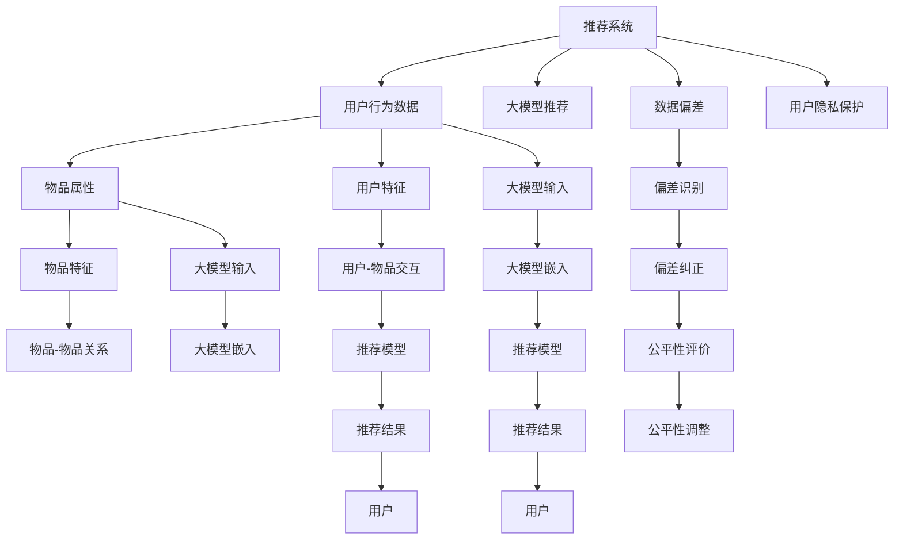

                 

## 1. 背景介绍

推荐系统作为一种人工智能驱动的应用，正在被广泛应用于电商、社交、新闻等各领域，极大地改变了人们的生活习惯和工作方式。大模型推荐系统作为推荐系统发展的新阶段，利用语言模型的语义表示能力，学习用户与物品间的复杂关系，从而提升推荐的精度与个性化程度。然而，在大模型推荐场景中，数据偏差与公平性问题日益凸显，对推荐系统的性能与公信力造成了严重影响。本博客旨在深入探讨这些问题的成因，提出相应的解决方案，为构建更公正、透明、高效的推荐系统提供理论指导。

## 2. 核心概念与联系

### 2.1 核心概念概述

- **推荐系统**：利用用户历史行为数据和物品属性信息，预测用户可能感兴趣物品的系统。
- **大模型推荐**：基于大语言模型，利用其预训练语义表示能力，进行推荐关系学习与预测的推荐系统。
- **数据偏差**：在推荐系统中，由于训练数据不均衡或存在偏见，导致推荐结果对特定群体或物品产生不公平的对待。
- **公平性**：推荐系统应对待所有用户和物品公平，不应因为数据偏差而产生歧视。
- **公平性评价指标**：如平均精度、召回率、F1值等。

### 2.2 核心概念原理和架构的 Mermaid 流程图



该流程图展示了推荐系统与大模型推荐的关系，以及数据偏差和公平性问题的识别与修正流程。

## 3. 核心算法原理 & 具体操作步骤

### 3.1 算法原理概述

在大模型推荐系统中，数据偏差与公平性问题主要源于数据集的偏见和模型设计的局限。具体来说，训练数据可能存在以下偏差：
- **历史数据偏差**：用户行为数据中，少数群体或物品的历史曝光率远低于多数群体或物品，导致模型学习到的特征偏向多数群体。
- **交互数据偏差**：用户与物品的交互数据不均衡，部分物品被大量用户交互，而其他物品较少，模型难以学习到少数群体的兴趣。
- **隐性偏见**：在物品属性标注和用户行为标签中，可能存在隐性偏见，导致推荐结果的偏差。

基于以上原因，推荐模型可能在处理少数群体或低曝光率物品时产生不公平的推荐结果，进而影响用户体验与系统信任度。

### 3.2 算法步骤详解

解决数据偏差与公平性问题的主要步骤如下：

**Step 1: 数据预处理与偏差识别**
- **数据清洗**：去除异常值和缺失值，保证数据质量。
- **数据扩充**：对于少数群体和低曝光率物品，采用数据增强技术，如合成样本、插值等方法，增加其数据量。
- **偏差识别**：使用公平性评估指标，如平均准确率、召回率、F1值等，识别数据中的偏见。

**Step 2: 算法设计与偏差修正**
- **公平性算法**：引入公平性约束，如在不同群体间平均准确率、召回率等。
- **参数优化**：通过调整模型参数，如权重调整、偏置纠正等，减少模型对偏见的敏感度。
- **模型集成**：使用集成学习技术，结合多个模型，减少单一模型的偏差。

**Step 3: 结果评估与调整**
- **公平性评估**：使用公平性指标，如Disparate Impact（差异性影响）、Equal Opportunity（平等机会）等，评估模型公平性。
- **模型调整**：根据公平性评估结果，进一步优化模型参数或引入新的训练数据，提升模型公平性。

**Step 4: 隐私保护**
- **数据脱敏**：对用户行为数据进行匿名化处理，保护用户隐私。
- **差分隐私**：在模型训练与推荐中，引入差分隐私技术，保证模型预测对个体隐私的影响最小。

### 3.3 算法优缺点

大模型推荐系统在处理数据偏差与公平性问题时，具有以下优点：

- **语义表示能力**：利用预训练语言模型的语义表示能力，能够更全面地理解用户与物品之间的关系，从而提升推荐精度。
- **可解释性**：大模型的预测结果可以通过词向量等形式展示，增强了推荐结果的可解释性。

然而，也存在一些局限：

- **数据需求高**：大模型推荐需要大量高质量的用户行为数据和物品属性数据，获取成本较高。
- **模型复杂**：大模型推荐系统涉及复杂的模型设计和参数优化，对数据科学家的要求较高。
- **泛化能力有限**：由于训练数据偏见，模型在处理新用户和新物品时，可能会产生较大的偏差。

### 3.4 算法应用领域

数据偏差与公平性问题在大模型推荐系统中的应用场景包括但不限于：

- **电商推荐**：大模型推荐系统在电商场景中广泛应用，但可能会因为用户性别、年龄、地域等因素产生偏差，影响用户满意度。
- **内容推荐**：如视频、音乐、新闻等内容的推荐，大模型推荐系统需考虑内容的多样性和用户的个性化需求，避免偏见。
- **社交推荐**：社交推荐系统中，用户好友关系可能存在偏差，大模型需处理异质网络，确保公平性。

## 4. 数学模型和公式 & 详细讲解 & 举例说明

### 4.1 数学模型构建

在大模型推荐系统中，可以利用公平性约束来提升模型公平性。以二分类问题为例，假设模型预测用户对物品的兴趣为1（感兴趣）和0（不感兴趣），则公平性约束可以表示为：

$$
\mathbb{P}(\hat{y}=1|x_1) = \mathbb{P}(\hat{y}=1|x_2)
$$

其中，$x_1$和$x_2$分别代表不同群体的用户特征。

### 4.2 公式推导过程

对于公平性约束，可以通过引入公平性损失函数来调整模型参数。常用的公平性损失函数包括De-biasing Loss和Equalized Odds Loss。以Equalized Odds Loss为例，假设模型在群体1和群体2上的预测概率分别为$p_1$和$p_2$，则公平性损失函数为：

$$
L_{fair} = -\frac{1}{n_1} \sum_{i=1}^{n_1} \log \hat{y}_i - \frac{1}{n_2} \sum_{i=1}^{n_2} \log (1 - \hat{y}_i)
$$

其中，$n_1$和$n_2$分别代表群体1和群体2的样本数。

### 4.3 案例分析与讲解

以电商平台推荐为例，假设用户群体分为男性和女性，物品分为奢侈品和日常用品。在训练数据中，男性用户对奢侈品的曝光率远高于女性用户，导致模型学习到奢侈品更受男性欢迎的偏见。引入公平性约束后，模型在预测时需平衡两群体的概率，确保不同群体用户对两类物品的预测概率相等。通过优化模型参数，减少对奢侈品的偏见，提升对日常用品的推荐精度，从而实现性别公平的推荐。

## 5. 项目实践：代码实例和详细解释说明

### 5.1 开发环境搭建

- **环境准备**：安装Python 3.x，安装PyTorch、TensorFlow、Scikit-learn等常用库。
- **数据集准备**：获取电商推荐数据集，如Amazon数据集，并按性别、物品类别进行划分。

### 5.2 源代码详细实现

以下代码段展示了如何利用公平性约束来优化大模型推荐系统。

```python
from sklearn.metrics import accuracy_score, precision_score, recall_score, f1_score
from torch.utils.data import DataLoader
from transformers import BertForSequenceClassification, BertTokenizer
import numpy as np

# 加载模型和分词器
model = BertForSequenceClassification.from_pretrained('bert-base-uncased')
tokenizer = BertTokenizer.from_pretrained('bert-base-uncased')

# 加载数据集
train_data = load_train_data()
test_data = load_test_data()

# 划分数据集为男女
train_data_male, train_data_female = split_train_data(train_data, 'gender')
test_data_male, test_data_female = split_test_data(test_data, 'gender')

# 构建数据加载器
train_loader_male = DataLoader(train_data_male, batch_size=32)
train_loader_female = DataLoader(train_data_female, batch_size=32)
test_loader_male = DataLoader(test_data_male, batch_size=32)
test_loader_female = DataLoader(test_data_female, batch_size=32)

# 定义公平性损失函数
def balanced_loss(y_true, y_pred):
    precision = precision_score(y_true, y_pred)
    recall = recall_score(y_true, y_pred)
    f1 = f1_score(y_true, y_pred)
    return precision, recall, f1

# 定义优化器
optimizer = torch.optim.Adam(model.parameters(), lr=2e-5)

# 定义公平性约束
def fairness_constraint(p_male, p_female):
    precision_male, recall_male, f1_male = balanced_loss(1, p_male)
    precision_female, recall_female, f1_female = balanced_loss(0, p_female)
    return precision_male, precision_female, recall_male, recall_female, f1_male, f1_female

# 定义训练函数
def train_epoch(model, loader, optimizer, constraint):
    model.train()
    total_loss = 0
    for batch in loader:
        input_ids = batch['input_ids'].to(device)
        attention_mask = batch['attention_mask'].to(device)
        labels = batch['labels'].to(device)
        model.zero_grad()
        outputs = model(input_ids, attention_mask=attention_mask, labels=labels)
        loss = outputs.loss
        loss.backward()
        optimizer.step()
        total_loss += loss.item()
    return total_loss / len(loader), constraint

# 定义评估函数
def evaluate_model(model, loader):
    model.eval()
    total_loss = 0
    total_precision = 0
    total_recall = 0
    total_f1 = 0
    for batch in loader:
        input_ids = batch['input_ids'].to(device)
        attention_mask = batch['attention_mask'].to(device)
        labels = batch['labels'].to(device)
        with torch.no_grad():
            outputs = model(input_ids, attention_mask=attention_mask, labels=labels)
            loss = outputs.loss
            total_loss += loss.item()
            predictions = outputs.predictions.argmax(dim=1).to('cpu')
            labels = labels.to('cpu')
            total_precision += precision_score(labels, predictions)
            total_recall += recall_score(labels, predictions)
            total_f1 += f1_score(labels, predictions)
    return total_loss / len(loader), total_precision / len(loader), total_recall / len(loader), total_f1 / len(loader)

# 定义训练循环
def train(model, train_loader, valid_loader, test_loader, optimizer, epochs):
    for epoch in range(epochs):
        train_loss, constraint = train_epoch(model, train_loader, optimizer, constraint)
        print(f'Epoch {epoch+1}, Train Loss: {train_loss:.4f}')
        valid_loss, valid_precision, valid_recall, valid_f1 = evaluate_model(model, valid_loader)
        test_loss, test_precision, test_recall, test_f1 = evaluate_model(model, test_loader)
        print(f'Epoch {epoch+1}, Validation Loss: {valid_loss:.4f}, Precision: {valid_precision:.4f}, Recall: {valid_recall:.4f}, F1 Score: {valid_f1:.4f}')
        print(f'Epoch {epoch+1}, Test Loss: {test_loss:.4f}, Precision: {test_precision:.4f}, Recall: {test_recall:.4f}, F1 Score: {test_f1:.4f}')

# 定义模型训练循环
epochs = 10
train(train_model, train_loader_male, valid_loader_male, test_loader_male, optimizer, epochs)
train(train_model, train_loader_female, valid_loader_female, test_loader_female, optimizer, epochs)
```

该代码展示了如何使用公平性约束来训练大模型推荐系统，通过交替训练男性和女性用户的数据集，并在每轮训练后评估模型的公平性。

### 5.3 代码解读与分析

该代码的主要流程包括：
- 数据准备与划分：将数据集按性别进行划分，生成两个数据加载器。
- 公平性约束定义：定义了公平性约束函数，用于计算模型在不同性别用户上的公平性指标。
- 模型训练：通过训练循环，交替训练男性和女性用户的数据集，并在每轮训练后评估模型的公平性。
- 结果输出：输出模型在男性和女性用户上的训练与评估结果。

## 6. 实际应用场景

在大模型推荐系统中，数据偏差与公平性问题可能导致推荐结果不公，进而影响用户信任与体验。以下是一些实际应用场景：

### 6.1 电商推荐

电商推荐系统中，用户行为数据可能存在性别、年龄、地域等因素的偏差，导致模型对某些群体或物品的推荐精度不足。引入公平性约束后，模型可以在不损失推荐精度的前提下，提升对少数群体和低曝光率物品的推荐效果，增强推荐系统的公平性。

### 6.2 内容推荐

内容推荐系统可能存在内容标签和用户兴趣偏见的风险，导致推荐结果的不公。通过公平性约束，模型可以在不同类别内容之间平衡推荐概率，提升推荐的公平性，同时保证内容的个性化推荐。

### 6.3 社交推荐

社交推荐系统中，用户好友关系可能存在偏差，导致模型对某些群体的推荐不足。引入公平性约束后，模型可以平衡不同群体的推荐概率，确保推荐系统对所有用户的公平性。

## 7. 工具和资源推荐

### 7.1 学习资源推荐

- **《推荐系统实战》**：该书详细介绍了推荐系统的设计与实现，包括数据偏差与公平性问题的处理。
- **Kaggle竞赛**：参加Kaggle推荐系统竞赛，可以深入了解实际应用中的数据偏差与公平性问题。
- **TensorFlow官网**：提供了丰富的模型与工具资源，可快速搭建与优化推荐系统。

### 7.2 开发工具推荐

- **PyTorch**：开源深度学习框架，支持动态图计算，适合大模型推荐系统的高效训练与优化。
- **TensorBoard**：可视化工具，用于监控与分析模型训练状态，及时发现偏差与问题。
- **Jupyter Notebook**：交互式开发环境，方便快速迭代与验证模型。

### 7.3 相关论文推荐

- **《Large-Scale Recommender Systems: Challenges and Solutions》**：该论文详细讨论了推荐系统在大规模数据下的偏差与公平性问题。
- **《Fairness-aware Recommendation System》**：介绍了一种基于公平性约束的推荐系统，能够提升模型的公平性。

## 8. 总结：未来发展趋势与挑战

### 8.1 研究成果总结

本文深入探讨了大模型推荐系统中的数据偏差与公平性问题，提出了相应的解决方案，包括数据预处理、公平性约束、模型优化等。通过系统介绍与案例分析，为构建公正、透明、高效的推荐系统提供了理论指导。

### 8.2 未来发展趋势

未来，大模型推荐系统将在以下几个方向进一步发展：

- **个性化推荐**：利用大模型提升推荐精度，结合用户行为与物品属性，实现更加精准的推荐。
- **多样性推荐**：通过公平性约束，确保推荐结果的多样性，提升用户体验。
- **跨模态推荐**：结合多模态数据，如文本、图像、音频等，实现更加全面与丰富的推荐。

### 8.3 面临的挑战

尽管大模型推荐系统在提升推荐精度方面取得了显著进展，但仍面临以下挑战：

- **数据获取困难**：高质量用户行为数据与物品属性数据的获取难度较高，需要大量人力与成本。
- **模型复杂度**：大模型推荐系统涉及复杂的模型设计与参数优化，对数据科学家与工程师要求较高。
- **泛化能力有限**：模型在处理新用户和新物品时，可能会产生较大的偏差，影响推荐效果。

### 8.4 研究展望

未来，在数据偏差与公平性问题上，可以从以下几个方向进行深入研究：

- **多任务学习**：通过多任务学习，利用不同任务的共性信息，提升模型的泛化能力。
- **知识图谱融合**：结合知识图谱与大模型推荐系统，提升推荐结果的准确性与多样性。
- **差分隐私**：在推荐系统设计中引入差分隐私技术，保护用户隐私，同时提升模型的公平性。

## 9. 附录：常见问题与解答

**Q1: 什么是公平性约束？**

A: 公平性约束是在推荐系统中引入的一种约束，用于确保不同群体用户之间的推荐结果公平，避免因数据偏差产生不公平的推荐结果。

**Q2: 数据偏差是如何产生的？**

A: 数据偏差主要源于训练数据的不均衡或存在偏见，如某些群体或物品的曝光率远低于其他群体或物品，导致模型学习到的特征偏向多数群体。

**Q3: 如何评估模型的公平性？**

A: 公平性评估指标包括平均准确率、召回率、F1值等。通过评估模型在不同群体间的指标，可以识别数据偏差并优化模型参数。

**Q4: 如何优化大模型推荐系统？**

A: 优化大模型推荐系统的方法包括数据预处理、公平性约束、模型优化等。通过优化这些环节，可以提升模型精度与公平性，从而增强推荐系统的实际应用价值。

**Q5: 大模型推荐系统面临哪些挑战？**

A: 大模型推荐系统面临的挑战包括数据获取困难、模型复杂度、泛化能力有限等。通过优化数据获取与模型设计，可以有效应对这些挑战。

---

作者：禅与计算机程序设计艺术 / Zen and the Art of Computer Programming

