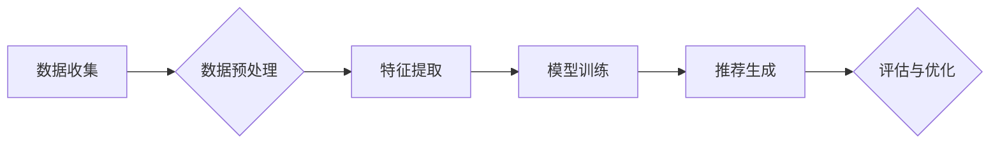

                 

## 知识发现引擎的个性化推荐算法

> 关键词：知识发现引擎、个性化推荐、协同过滤、内容过滤、深度学习、推荐系统、用户行为分析

## 1. 背景介绍

在海量信息时代，知识发现引擎扮演着越来越重要的角色。它能够从海量数据中挖掘出有价值的知识，并将其以可理解的方式呈现给用户。个性化推荐作为知识发现引擎的核心功能之一，旨在根据用户的兴趣、偏好和历史行为，推荐最符合其需求的知识资源。

传统的推荐系统主要依赖于协同过滤和内容过滤两种算法。协同过滤算法基于用户的相似性或物品的相似性进行推荐，而内容过滤算法则根据用户的兴趣偏好和物品的特征进行匹配。然而，这些算法存在一些局限性，例如数据稀疏性、冷启动问题和数据偏差等。

近年来，随着深度学习技术的快速发展，深度学习算法在推荐系统领域取得了显著的成果。深度学习算法能够自动学习用户和物品的复杂特征关系，从而实现更精准、更个性化的推荐。

## 2. 核心概念与联系

**2.1 知识发现引擎**

知识发现引擎是一种能够从数据中自动发现模式、规律和知识的系统。它通常包含以下几个核心模块：

* 数据预处理模块：对原始数据进行清洗、转换和格式化，使其能够被后续模块处理。
* 数据挖掘模块：利用各种数据挖掘算法，从数据中发现模式、规律和知识。
* 知识表示模块：将发现的知识以可理解的方式表示出来，例如知识图谱、规则等。
* 交互模块：将知识呈现给用户，并提供交互功能，例如搜索、过滤、排序等。

**2.2 个性化推荐**

个性化推荐是指根据用户的个体特征和行为，提供定制化的推荐结果。个性化推荐的目标是提高用户体验，增强用户粘性，并促进知识传播。

**2.3 核心算法原理与架构**

个性化推荐算法通常基于以下几个核心概念：

* 用户特征：用户的兴趣、偏好、行为等信息。
* 物品特征：物品的类别、属性、描述等信息。
* 用户-物品交互：用户对物品的评分、点击、购买等行为。

个性化推荐算法的架构通常包括以下几个步骤：

1. 数据收集和预处理：收集用户和物品的相关数据，并进行预处理。
2. 特征提取：提取用户的特征和物品的特征。
3. 模型训练：利用机器学习算法，训练个性化推荐模型。
4. 推荐生成：根据用户的特征和模型的预测结果，生成个性化推荐列表。
5. 评估和优化：评估推荐系统的性能，并根据评估结果进行模型优化。

**Mermaid 流程图**



## 3. 核心算法原理 & 具体操作步骤

### 3.1 算法原理概述

本文将介绍基于深度学习的个性化推荐算法，具体来说，我们将使用协同过滤和内容过滤的思想，结合深度神经网络进行模型构建。

**3.1.1 协同过滤**

协同过滤算法基于用户的相似性或物品的相似性进行推荐。

* **用户-用户协同过滤:** 找到与当前用户兴趣相似的其他用户，并推荐他们喜欢的物品。
* **物品-物品协同过滤:** 找到与当前用户喜欢的物品相似的其他物品，并推荐它们。

**3.1.2 内容过滤**

内容过滤算法根据用户的兴趣偏好和物品的特征进行匹配。

* **基于关键词匹配:** 根据用户的兴趣关键词，推荐包含这些关键词的物品。
* **基于向量空间模型:** 将用户和物品表示为向量，计算它们的相似度，并推荐相似度高的物品。

**3.1.3 深度学习**

深度学习算法能够自动学习用户和物品的复杂特征关系，从而实现更精准、更个性化的推荐。

* **多层感知机 (MLP):** 用于学习用户和物品的隐含特征。
* **卷积神经网络 (CNN):** 用于学习物品的文本特征。
* **循环神经网络 (RNN):** 用于学习用户的历史行为序列。

### 3.2 算法步骤详解

1. **数据收集和预处理:** 收集用户和物品的相关数据，例如用户评分、点击记录、浏览历史、物品类别、描述等。对数据进行清洗、转换和格式化，例如去除缺失值、标准化数值等。
2. **特征提取:** 提取用户的特征和物品的特征。用户特征可以包括用户的年龄、性别、兴趣爱好、购买历史等。物品特征可以包括物品的类别、属性、描述、价格等。
3. **模型训练:** 利用深度学习算法，训练个性化推荐模型。模型可以采用多层感知机、卷积神经网络或循环神经网络等结构。训练过程中，模型会学习用户和物品之间的复杂关系，并预测用户对物品的评分或点击概率。
4. **推荐生成:** 根据用户的特征和模型的预测结果，生成个性化推荐列表。推荐列表可以按照预测评分或点击概率排序，并根据用户的历史行为进行过滤和调整。
5. **评估和优化:** 评估推荐系统的性能，例如准确率、召回率、点击率等。根据评估结果，调整模型参数、特征选择或算法结构，以提高推荐系统的性能。

### 3.3 算法优缺点

**优点:**

* **精准度高:** 深度学习算法能够自动学习用户和物品的复杂特征关系，从而实现更精准的推荐。
* **个性化强:** 可以根据用户的个体特征和行为，提供定制化的推荐结果。
* **可扩展性强:** 可以处理海量数据和复杂场景。

**缺点:**

* **数据依赖性强:** 需要大量的用户和物品数据进行训练。
* **训练成本高:** 深度学习模型的训练需要大量的计算资源和时间。
* **解释性差:** 深度学习模型的决策过程比较复杂，难以解释。

### 3.4 算法应用领域

深度学习的个性化推荐算法广泛应用于以下领域:

* **电子商务:** 商品推荐、用户画像、精准营销
* **内容平台:** 视频推荐、文章推荐、个性化内容推送
* **社交媒体:** 朋友推荐、兴趣小组推荐、内容发现
* **教育:** 学习资源推荐、个性化学习路径

## 4. 数学模型和公式 & 详细讲解 & 举例说明

### 4.1 数学模型构建

**4.1.1 用户-物品交互矩阵**

用户-物品交互矩阵是一个稀疏矩阵，其中每个元素表示用户对物品的评分或交互行为。

* 行表示用户，列表示物品。
* 元素值为用户对物品的评分或交互行为，例如 1 表示用户喜欢该物品，0 表示用户不喜欢该物品。

**举例说明:**

假设有 10 个用户和 5 个物品，用户-物品交互矩阵如下所示:

```
用户 | 物品1 | 物品2 | 物品3 | 物品4 | 物品5
------- | -------- | -------- | -------- | -------- | --------
用户1 | 5 | 0 | 3 | 4 | 2
用户2 | 0 | 4 | 5 | 0 | 3
用户3 | 3 | 2 | 0 | 5 | 1
用户4 | 4 | 3 | 0 | 2 | 5
用户5 | 2 | 5 | 4 | 3 | 0
用户6 | 0 | 0 | 5 | 4 | 2
用户7 | 5 | 3 | 2 | 0 | 1
用户8 | 3 | 4 | 0 | 5 | 2
用户9 | 0 | 2 | 3 | 4 | 5
用户10 | 4 | 5 | 0 | 2 | 3
```

**4.1.2 用户嵌入向量**

用户嵌入向量是一个低维向量，用于表示用户的兴趣和偏好。

* 每个维度代表一个特征，例如年龄、性别、兴趣爱好等。
* 向量值的大小表示特征的重要性。

**举例说明:**

假设用户1的兴趣爱好包括电影、音乐和阅读，用户嵌入向量可以表示为:

```
[0.8, 0.6, 0.5, 0.2, 0.1]
```

其中，第一个维度表示对电影的兴趣，第二个维度表示对音乐的兴趣，以此类推。

**4.1.3 物品嵌入向量**

物品嵌入向量是一个低维向量，用于表示物品的类别、属性和描述等信息。

* 每个维度代表一个特征，例如物品类别、价格、评分等。
* 向量值的大小表示特征的重要性。

**举例说明:**

假设物品1是一部动作电影，物品嵌入向量可以表示为:

```
[0.9, 0.2, 0.1, 0.0, 0.0]
```

其中，第一个维度表示动作电影的类别，其他维度表示其他类别，例如喜剧、爱情、科幻等。

### 4.2 公式推导过程

**4.2.1 余弦相似度**

余弦相似度用于计算两个向量的相似度。

公式:

$$
\text{cosine similarity}(u, v) = \frac{u \cdot v}{||u|| ||v||}
$$

其中:

* $u$ 和 $v$ 是两个向量。
* $u \cdot v$ 是两个向量的点积。
* $||u||$ 和 $||v||$ 是两个向量的模长。

**举例说明:**

假设用户1的嵌入向量为 $[0.8, 0.6, 0.5]$, 物品1的嵌入向量为 $[0.9, 0.2, 0.1]$, 则它们的余弦相似度为:

$$
\text{cosine similarity}([0.8, 0.6, 0.5], [0.9, 0.2, 0.1]) = \frac{(0.8 \times 0.9) + (0.6 \times 0.2) + (0.5 \times 0.1)}{\sqrt{0.8^2 + 0.6^2 + 0.5^2} \times \sqrt{0.9^2 + 0.2^2 + 0.1^2}}
$$

### 4.3 案例分析与讲解

**4.3.1 用户推荐**

假设用户1的嵌入向量为 $[0.8, 0.6, 0.5]$, 我们需要推荐与用户1兴趣相似的物品。

我们可以计算用户1嵌入向量与所有物品嵌入向量的余弦相似度，并选择相似度最高的物品作为推荐结果。

**4.3.2 物品聚类**

我们可以将所有物品的嵌入向量进行聚类，将相似物品归为一类。

例如，我们可以将动作电影、科幻电影和冒险电影聚为一类，将喜剧电影、爱情电影和动画电影聚为另一类。

然后，我们可以根据用户的兴趣偏好，推荐用户属于的类别中的物品。

## 5. 项目实践：代码实例和详细解释说明

### 5.1 开发环境搭建

* **操作系统:** Linux, macOS, Windows
* **编程语言:** Python
* **深度学习框架:** TensorFlow, PyTorch
* **数据处理库:** Pandas, NumPy
* **评估指标库:** Scikit-learn

### 5.2 源代码详细实现

```python
import tensorflow as tf

# 定义用户-物品交互矩阵
user_item_matrix = tf.constant([
    [5, 0, 3, 4, 2],
    [0, 4, 5, 0, 3],
    [3, 2, 0, 5, 1],
    # ...
])

# 定义用户嵌入层
user_embedding_layer = tf.keras.layers.Embedding(input_dim=num_users, output_dim=embedding_dim)

# 定义物品嵌入层
item_embedding_layer = tf.keras.layers.Embedding(input_dim=num_items, output_dim=embedding_dim)

# 定义模型
model = tf.keras.Sequential([
    user_embedding_layer,
    item_embedding_layer,
    tf.keras.layers.Dot(axes=1),
    tf.keras.layers.Activation('sigmoid')
])

# 编译模型
model.compile(optimizer='adam', loss='binary_crossentropy', metrics=['accuracy'])

# 训练模型
model.fit(user_item_matrix, user_item_matrix, epochs=10)

# 生成推荐列表
def generate_recommendations(user_id):
    user_embedding = user_embedding_layer(tf.constant([user_id]))
    item_embeddings = item_embedding_layer(tf.range(num_items))
    scores = tf.reduce_sum(user_embedding * item_embeddings, axis=1)
    recommended_items = tf.argsort(scores, direction='DESCENDING')[:top_n]
    return recommended_items
```

### 5.3 代码解读与分析

* **数据预处理:** 代码中使用 `tf.constant` 创建用户-物品交互矩阵。
* **模型构建:** 代码使用 TensorFlow 的 `keras` API构建了一个简单的个性化推荐模型。模型包含用户嵌入层、物品嵌入层和一个点积层。
* **模型训练:** 代码使用 `model.fit` 方法训练模型。
* **推荐生成:** `generate_recommendations` 函数根据用户的 ID 生成推荐列表。

### 5.4 运行结果展示

运行代码后，可以得到用户 ID 对应的推荐物品列表。

## 6. 实际应用场景

### 6.1 电子商务平台

个性化推荐算法可以帮助电子商务平台推荐用户感兴趣的商品，提高用户体验和转化率。例如，亚马逊、淘宝等平台都使用个性化推荐算法来推荐商品。

### 6.2 内容平台

个性化推荐算法可以帮助内容平台推荐用户感兴趣的文章、视频、音乐等内容，提高用户粘性和内容传播效果。例如，YouTube、Netflix、Spotify等平台都使用个性化推荐算法来推荐内容。

### 6.3 社交媒体

个性化推荐算法可以帮助社交媒体平台推荐用户感兴趣的朋友、兴趣小组、话题等内容，提高用户活跃度和社交互动。例如，Facebook、Twitter、Instagram等平台都使用个性化推荐算法来推荐内容。

### 6.4 未来应用展望

随着深度学习技术的不断发展，个性化推荐算法将应用于更多领域，例如医疗、教育、金融等。

## 7. 工具和资源推荐

### 7.1 学习资源推荐

* **书籍:**
    * 《深度学习》
    * 《推荐系统实践》
* **在线课程:**
    * Coursera: 深度学习
    * Udacity: 机器学习工程师
* **博客和网站:**
    * TensorFlow 官方博客
    * PyTorch 官方博客
    * KDnuggets

### 7.2 开发工具推荐

* **深度学习框架:** TensorFlow, PyTorch
* **数据处理库:** Pandas, NumPy
* **评估指标库:** Scikit-learn
* **云平台:** AWS, Azure, GCP

### 7.3 相关论文推荐

* **协同过滤:**
    * "Collaborative Filtering: A User-Based Approach"
    * "Item-Based Collaborative Filtering Recommendation Algorithms"
* **内容过滤:**
    * "Content-Based Recommendation Systems"
    * "A Survey of Content-Based Recommendation Systems"
* **深度学习推荐:**
    * "Deep Learning for Recommender Systems"
    * "Neural Collaborative Filtering"

## 8. 总结：未来发展趋势与挑战

### 8.1 研究成果总结

深度学习的个性化推荐算法取得了显著的成果，能够实现更精准、更个性化的推荐。

### 8.2 未来发展趋势

* **多模态推荐:** 将文本、图像、音频等多模态数据融合到推荐系统中，实现更全面的用户理解和推荐。
* **联邦学习:** 在保护用户隐私的前提下，利用联邦学习技术进行个性化推荐。
* **解释性推荐:** 研究更具解释性的推荐算法，帮助用户理解推荐结果背后的逻辑。

### 8.3 面临的挑战

* **数据稀疏性:** 用户-物品交互数据通常是稀疏的，难以训练有效的推荐模型。
* **冷启动问题:** 新用户和新物品难以获得推荐。
* **数据偏差:** 数据中的偏差可能导致推荐结果不公平。

### 8.4 研究展望

未来，个性化推荐算法将朝着更智能、更个性化、更可解释的方向发展。


## 9. 附录：常见问题与解答

### 9.1 如何解决数据稀疏性问题？

* **数据增强:** 利用已有数据进行人工增强，例如，通过用户行为分析生成虚拟交互数据。
* **矩阵分解:** 使用矩阵分解技术，将稀疏矩阵分解成低维稠密矩阵，提高模型训练效率。
* **迁移学习:** 利用已训练好的模型，迁移到新的领域进行个性化推荐。

### 9.2 如何解决冷启动问题？

* **基于内容过滤:** 利用物品的特征信息进行推荐。
* **基于社交关系推荐:** 利用用户的社交关系进行推荐。
* **协同过滤聚类:** 将用户和物品进行聚类，推荐与用户相似用户的物品。

### 9.3 如何解决数据偏差问题？

* **数据清洗:** 识别和去除数据中的偏差。
* **公平性度量:** 使用公平性度量指标，评估推荐系统的公平性。
* **公平性算法:** 研究公平性算法，减少推荐系统中的偏差。


作者：禅与计算机程序设计艺术 / Zen and the Art of Computer Programming 
<end_of_turn>

<end_of_turn>

