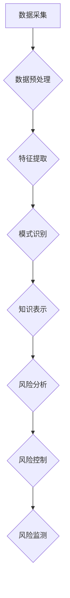

                 

## 知识发现引擎：助力金融行业的风险管理

> 关键词：知识发现引擎、金融风险管理、机器学习、数据挖掘、模式识别、预测分析、风险评估

## 1. 背景介绍

金融行业作为经济发展的重要支柱，其稳定性与健康发展关系着整个社会经济的稳定。然而，金融市场瞬息万变，各种风险也层出不穷，例如信用风险、市场风险、操作风险等。传统的风险管理方法往往依赖于经验和主观判断，难以应对复杂多变的金融环境。

随着大数据时代的到来，金融机构积累了海量的数据资产。这些数据蕴藏着丰富的风险信息，但如何有效地挖掘和利用这些信息，提升风险管理水平，成为了一个重要的挑战。知识发现引擎 (Knowledge Discovery Engine，KDE) 正是在此背景下应运而生。

KDE 是一种利用机器学习、数据挖掘等技术，从海量数据中发现隐藏的知识和模式的智能系统。它能够帮助金融机构识别潜在的风险，预测未来的风险趋势，并为风险控制提供科学依据。

## 2. 核心概念与联系

### 2.1  知识发现引擎 (KDE)

KDE 是一个综合性的数据分析系统，它将数据预处理、特征提取、模式识别、知识表示等多个环节有机结合，最终将发现的知识以可理解的形式呈现给用户。

### 2.2  金融风险管理

金融风险管理是指金融机构为了规避和控制各种风险，采取的措施和策略。它包括风险识别、风险评估、风险控制和风险监测等环节。

### 2.3  核心概念联系

KDE 可以有效地支持金融风险管理的各个环节。

* **风险识别:** KDE 可以从海量交易数据、客户数据、市场数据等中识别出潜在的风险信号，例如异常交易、信用违约、市场波动等。
* **风险评估:** KDE 可以利用机器学习算法对风险进行量化评估，并给出风险等级和风险概率。
* **风险控制:** KDE 可以根据风险评估结果，制定相应的风险控制措施，例如调整投资组合、提高信用评级、加强风控监控等。
* **风险监测:** KDE 可以持续监控市场变化和客户行为，及时发现新的风险，并对风险控制措施进行调整。

**Mermaid 流程图**



## 3. 核心算法原理 & 具体操作步骤

### 3.1  算法原理概述

KDE 中常用的算法包括：

* **关联规则挖掘:** 用于发现数据中隐藏的关联关系，例如哪些客户同时购买了哪些产品。
* **分类算法:** 用于将数据分类到不同的类别，例如判断客户是否会违约。
* **聚类算法:** 用于将数据聚类到不同的组，例如将客户根据他们的投资行为进行分组。
* **预测算法:** 用于预测未来的趋势，例如预测股票价格的走势。

### 3.2  算法步骤详解

以关联规则挖掘为例，其具体操作步骤如下：

1. **数据预处理:** 清洗数据，去除重复数据、缺失数据等，并将数据转换为适合算法处理的格式。
2. **频繁项集挖掘:** 找出数据中频繁出现的项集，例如频繁购买的商品组合。
3. **关联规则生成:** 从频繁项集中生成关联规则，例如“购买牛奶的人也经常购买面包”。
4. **规则评估:** 对生成的规则进行评估，例如规则的支持度、置信度等，筛选出具有实际意义的规则。

### 3.3  算法优缺点

**关联规则挖掘算法:**

* **优点:** 可以发现数据中隐藏的关联关系，帮助理解客户行为和市场趋势。
* **缺点:** 容易产生大量的规则，需要进行筛选和评估，才能得到有价值的知识。

### 3.4  算法应用领域

关联规则挖掘算法广泛应用于：

* **市场营销:** 发现客户购买行为的关联关系，进行精准营销。
* **推荐系统:** 根据用户的历史购买记录，推荐相关的商品或服务。
* **欺诈检测:** 发现异常交易模式，识别欺诈行为。

## 4. 数学模型和公式 & 详细讲解 & 举例说明

### 4.1  数学模型构建

关联规则挖掘算法通常使用支持度和置信度来评估规则的价值。

* **支持度:** 规则在数据库中出现的频率。
* **置信度:** 给定 antecedent (前件) 的条件下， consequent (后件) 出现的概率。

### 4.2  公式推导过程

* **支持度:**

$$
Support(A \rightarrow B) = \frac{Count(A \cup B)}{Total Count}
$$

* **置信度:**

$$
Confidence(A \rightarrow B) = \frac{Count(A \cap B)}{Count(A)}
$$

其中：

* $A \rightarrow B$ 表示关联规则。
* $Count(A \cup B)$ 表示包含 $A$ 和 $B$ 的记录数。
* $Total Count$ 表示数据库中总的记录数。
* $Count(A \cap B)$ 表示同时包含 $A$ 和 $B$ 的记录数。
* $Count(A)$ 表示包含 $A$ 的记录数。

### 4.3  案例分析与讲解

假设数据库中包含以下交易记录：

| 交易ID | 商品A | 商品B |
|---|---|---|
| 1 | √ | √ |
| 2 | √ |  |
| 3 |  | √ |
| 4 | √ | √ |
| 5 | √ |  |

其中，商品A 和商品B 是两个关联的商品。

* **支持度:**

$$
Support(A \rightarrow B) = \frac{Count(A \cup B)}{Total Count} = \frac{3}{5} = 0.6
$$

* **置信度:**

$$
Confidence(A \rightarrow B) = \frac{Count(A \cap B)}{Count(A)} = \frac{3}{4} = 0.75
$$

结果表明，商品A 和商品B 同时出现的频率为 0.6，在购买了商品A 的情况下，购买商品B 的概率为 0.75。

## 5. 项目实践：代码实例和详细解释说明

### 5.1  开发环境搭建

* **操作系统:** Linux 或 Windows
* **编程语言:** Python
* **库依赖:** pandas, scikit-learn, matplotlib

### 5.2  源代码详细实现

```python
import pandas as pd
from sklearn.feature_extraction.text import TfidfVectorizer
from sklearn.metrics.pairwise import cosine_similarity

# 加载数据
data = pd.read_csv('transaction_data.csv')

# 数据预处理
# ...

# 特征提取
vectorizer = TfidfVectorizer()
tfidf_matrix = vectorizer.fit_transform(data['description'])

# 计算余弦相似度
similarity_matrix = cosine_similarity(tfidf_matrix)

# 寻找关联规则
# ...

# 结果展示
# ...
```

### 5.3  代码解读与分析

* **数据加载:** 使用 pandas 库加载交易数据。
* **数据预处理:** 对数据进行清洗、转换等操作，使其适合算法处理。
* **特征提取:** 使用 TF-IDF 向量化技术将文本数据转换为数值向量。
* **余弦相似度计算:** 计算不同交易记录之间的余弦相似度，衡量其相似程度。
* **关联规则寻找:** 使用 Apriori 算法或 FP-Growth 算法等寻找关联规则。
* **结果展示:** 将发现的关联规则以可视化的形式展示给用户。

### 5.4  运行结果展示

运行代码后，可以得到以下结果：

* **关联规则列表:** 列出所有发现的关联规则，并附带支持度和置信度。
* **可视化图表:** 使用散点图、热力图等方式展示关联规则之间的关系。

## 6. 实际应用场景

KDE 在金融风险管理领域有着广泛的应用场景：

* **信用风险管理:** 利用客户交易数据、信用报告等信息，识别潜在的违约客户，并进行信用评分。
* **市场风险管理:** 分析市场数据，预测股票价格、汇率等金融资产的波动趋势，帮助金融机构规避市场风险。
* **操作风险管理:** 分析员工行为、交易记录等信息，识别潜在的操作风险，并制定相应的控制措施。
* **反欺诈管理:** 利用交易数据、客户行为等信息，识别异常交易模式，防止欺诈行为的发生。

### 6.4  未来应用展望

随着人工智能技术的不断发展，KDE 在金融风险管理领域的应用将更加广泛和深入。例如：

* **个性化风险管理:** 基于客户的个人特征和行为模式，提供个性化的风险管理方案。
* **实时风险监测:** 利用实时数据流，实现对风险的实时监测和预警。
* **智能风控决策:** 利用机器学习算法，自动生成风险控制策略，提高风控决策的效率和准确性。

## 7. 工具和资源推荐

### 7.1  学习资源推荐

* **书籍:**
    * 《数据挖掘：概念与技术》
    * 《机器学习》
    * 《模式识别》
* **在线课程:**
    * Coursera: 数据挖掘与机器学习
    * edX: 人工智能导论
    * Udemy: 数据科学与机器学习

### 7.2  开发工具推荐

* **Python:** 广泛应用于数据挖掘和机器学习领域，拥有丰富的库和工具。
* **R:** 专门用于统计分析和数据可视化的语言，也支持数据挖掘和机器学习。
* **Spark:** 大数据处理框架，可以用于处理海量数据。

### 7.3  相关论文推荐

* **Association Rule Mining: A Survey**
* **Knowledge Discovery in Databases: Principles, Techniques, and Applications**
* **Machine Learning for Financial Risk Management**

## 8. 总结：未来发展趋势与挑战

### 8.1  研究成果总结

KDE 在金融风险管理领域取得了显著的成果，能够有效地识别风险、评估风险和控制风险。

### 8.2  未来发展趋势

* **模型更加智能化:** 利用深度学习等先进算法，构建更加智能化的风险模型。
* **数据融合更加深入:** 将来自不同来源的数据融合在一起，构建更加全面的风险画像。
* **应用场景更加广泛:** 将 KDE 应用到更多金融领域的风险管理场景。

### 8.3  面临的挑战

* **数据质量问题:** 金融数据往往存在不完整、不准确、不一致等问题，需要进行有效的清洗和处理。
* **算法解释性问题:** 一些机器学习算法的决策过程难以解释，这可能会导致金融机构难以信任和接受这些算法。
* **监管合规问题:** 金融行业受到严格的监管，KDE 的应用需要符合相关的监管要求。

### 8.4  研究展望

未来，KDE 将继续朝着更加智能化、自动化、可解释的方向发展，为金融行业提供更加精准、高效的风险管理解决方案。

## 9. 附录：常见问题与解答

* **Q1: KDE 的应用范围有哪些？**

A1: KDE 可以应用于金融风险管理的各个环节，例如信用风险管理、市场风险管理、操作风险管理、反欺诈管理等。

* **Q2: KDE 的优势是什么？**

A2: KDE 可以帮助金融机构识别潜在的风险、预测未来的风险趋势、并为风险控制提供科学依据。

* **Q3: 如何选择合适的 KDE 算法？**

A3: 选择合适的 KDE 算法需要根据具体的应用场景和数据特点进行选择。

* **Q4: 如何评估 KDE 的效果？**

A4: 可以通过评估 KDE 的准确率、召回率、F1-score 等指标来评估其效果。


作者：禅与计算机程序设计艺术 / Zen and the Art of Computer Programming 
<end_of_turn>

