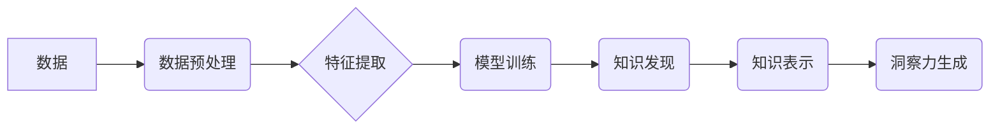

                 

## 知识发现引擎：知识与洞察力的协同发展

> 关键词：知识发现引擎、数据挖掘、机器学习、深度学习、知识图谱、洞察力、人工智能

### 1. 背景介绍

在海量数据时代，数据已成为企业和社会最重要的资产。然而，数据的价值并不在于其本身，而在于从中发现有价值的知识和洞察力。知识发现引擎 (Knowledge Discovery Engine, KDE) 正是帮助我们从海量数据中挖掘知识和洞察力的关键工具。

传统的数据库系统擅长于数据存储和查询，但对于复杂的数据分析和知识提取能力有限。随着数据量的爆炸式增长和分析需求的日益复杂，传统的数据库系统已难以满足需求。知识发现引擎应运而生，它利用人工智能、机器学习、数据挖掘等技术，从海量数据中发现隐藏的模式、趋势和关系，并将其转化为可理解和可利用的知识。

### 2. 核心概念与联系

知识发现引擎的核心概念包括：

* **数据挖掘 (Data Mining):** 从大规模数据中发现模式、趋势和关系。
* **机器学习 (Machine Learning):** 利用算法从数据中学习，提高预测和决策能力。
* **深度学习 (Deep Learning):** 一种更高级的机器学习方法，利用多层神经网络模拟人类大脑的学习过程。
* **知识图谱 (Knowledge Graph):** 以节点和边表示知识的结构化表示形式，能够更好地组织和推理知识。

这些概念相互关联，共同构成了知识发现引擎的强大体系。

**Mermaid 流程图**



### 3. 核心算法原理 & 具体操作步骤

#### 3.1  算法原理概述

知识发现引擎的核心算法包括分类、回归、聚类、关联规则挖掘等。这些算法利用统计学、概率论和机器学习等原理，从数据中发现隐藏的模式和关系。

* **分类算法:** 用于将数据点分类到预定义的类别中，例如垃圾邮件分类、图像识别等。
* **回归算法:** 用于预测连续值，例如房价预测、股票价格预测等。
* **聚类算法:** 用于将数据点分组到相似的类别中，例如客户群分析、异常检测等。
* **关联规则挖掘算法:** 用于发现数据点之间的关联关系，例如市场篮子分析、推荐系统等。

#### 3.2  算法步骤详解

以分类算法为例，其基本步骤包括：

1. **数据预处理:** 清洗、转换和格式化数据，使其适合算法训练。
2. **特征提取:** 从原始数据中提取有用的特征，用于训练模型。
3. **模型训练:** 利用训练数据训练分类模型，学习数据之间的关系。
4. **模型评估:** 使用测试数据评估模型的性能，例如准确率、召回率等。
5. **模型部署:** 将训练好的模型部署到实际应用场景中，用于预测新的数据点。

#### 3.3  算法优缺点

不同的算法具有不同的优缺点，需要根据具体应用场景选择合适的算法。

* **分类算法:** 优点：能够准确地将数据点分类到预定义的类别中。缺点：对数据质量要求较高，容易受到噪声数据的影响。
* **回归算法:** 优点：能够预测连续值，适用于预测性分析。缺点：对数据分布的假设较为严格。
* **聚类算法:** 优点：能够发现数据中的隐含结构，适用于无监督学习。缺点：聚类结果难以解释，对参数设置较为敏感。
* **关联规则挖掘算法:** 优点：能够发现数据点之间的关联关系，适用于市场分析和推荐系统。缺点：容易产生冗余规则，对数据量要求较高。

#### 3.4  算法应用领域

知识发现引擎的算法广泛应用于各个领域，例如：

* **商业智能:** 客户分析、市场营销、风险管理等。
* **医疗保健:** 疾病诊断、药物研发、患者管理等。
* **金融:** 欺诈检测、信用评分、投资决策等。
* **教育:** 学生成绩预测、个性化学习推荐等。

### 4. 数学模型和公式 & 详细讲解 & 举例说明

#### 4.1  数学模型构建

知识发现引擎的算法通常基于数学模型，例如线性回归、逻辑回归、支持向量机等。这些模型通过数学公式来描述数据之间的关系。

#### 4.2  公式推导过程

以线性回归为例，其目标是找到一条直线，使得预测值与真实值之间的误差最小。

**公式:**

$$
y = \beta_0 + \beta_1 x + \epsilon
$$

其中：

* $y$ 是预测值
* $x$ 是输入特征
* $\beta_0$ 是截距
* $\beta_1$ 是斜率
* $\epsilon$ 是误差项

**推导过程:**

线性回归模型的目标函数是均方误差 (MSE)，即预测值与真实值之间的平方差的平均值。

$$
MSE = \frac{1}{n} \sum_{i=1}^{n} (y_i - \hat{y}_i)^2
$$

其中：

* $n$ 是样本数量
* $y_i$ 是真实值
* $\hat{y}_i$ 是预测值

通过最小化 MSE，可以得到最佳的 $\beta_0$ 和 $\beta_1$ 值。

#### 4.3  案例分析与讲解

假设我们想要预测房屋价格，输入特征是房屋面积，真实价格和预测价格如下表所示：

| 房屋面积 (平方米) | 真实价格 (万元) | 预测价格 (万元) |
|---|---|---|
| 60 | 100 | 95 |
| 80 | 150 | 148 |
| 100 | 200 | 195 |
| 120 | 250 | 242 |

我们可以使用线性回归模型来拟合数据，得到以下回归方程：

$$
y = 80 + 1.5x
$$

其中：

* $y$ 是房屋价格 (万元)
* $x$ 是房屋面积 (平方米)

根据这个方程，我们可以预测新房子的价格。例如，如果一个房屋面积为 150 平方米，则其预测价格为：

$$
y = 80 + 1.5 * 150 = 330
$$

### 5. 项目实践：代码实例和详细解释说明

#### 5.1  开发环境搭建

* 操作系统：Windows/macOS/Linux
* Python 版本：3.6+
* 必要的库：pandas、scikit-learn、matplotlib等

#### 5.2  源代码详细实现

```python
import pandas as pd
from sklearn.linear_model import LinearRegression
from sklearn.model_selection import train_test_split
import matplotlib.pyplot as plt

# 加载数据
data = pd.read_csv('house_price.csv')

# 划分训练集和测试集
X = data[['area']]
y = data['price']
X_train, X_test, y_train, y_test = train_test_split(X, y, test_size=0.2, random_state=42)

# 创建线性回归模型
model = LinearRegression()

# 训练模型
model.fit(X_train, y_train)

# 预测测试集数据
y_pred = model.predict(X_test)

# 评估模型性能
print('Coefficients:', model.coef_)
print('Intercept:', model.intercept_)
print('R-squared:', model.score(X_test, y_test))

# 可视化结果
plt.scatter(X_test, y_test, color='blue')
plt.plot(X_test, y_pred, color='red')
plt.xlabel('房屋面积 (平方米)')
plt.ylabel('房屋价格 (万元)')
plt.title('房屋价格预测')
plt.show()
```

#### 5.3  代码解读与分析

* 首先，我们加载数据并划分训练集和测试集。
* 然后，我们创建线性回归模型并训练模型。
* 接着，我们使用训练好的模型预测测试集数据。
* 最后，我们评估模型性能并可视化结果。

#### 5.4  运行结果展示

运行代码后，会输出模型的系数、截距、R-squared 值以及绘制房屋面积与价格之间的预测曲线图。

### 6. 实际应用场景

知识发现引擎在各个领域都有广泛的应用场景，例如：

* **商业智能:** 通过分析客户购买行为、市场趋势等数据，帮助企业制定更有效的营销策略、优化产品设计、降低运营成本。
* **医疗保健:** 通过分析患者病历、基因信息等数据，帮助医生进行更精准的诊断、制定个性化的治疗方案、预测疾病风险。
* **金融:** 通过分析交易数据、信用评分等数据，帮助银行进行更精准的风险评估、制定更有效的贷款策略、预防金融欺诈。

### 6.4  未来应用展望

随着人工智能、机器学习等技术的不断发展，知识发现引擎的应用场景将更加广泛，例如：

* **个性化推荐:** 基于用户行为数据，为用户提供更精准的商品、服务推荐。
* **智能决策支持:** 基于数据分析结果，为企业和个人提供更智能的决策建议。
* **自动驾驶:** 基于路况数据、车辆传感器数据等，帮助自动驾驶系统做出更安全、更智能的决策。

### 7. 工具和资源推荐

#### 7.1  学习资源推荐

* **书籍:**
    * 《数据挖掘：概念与技术》
    * 《机器学习》
    * 《深度学习》
* **在线课程:**
    * Coursera: 数据科学、机器学习
    * edX: 数据挖掘、人工智能
    * Udemy: 数据分析、Python编程

#### 7.2  开发工具推荐

* **Python:** 广泛应用于数据科学和机器学习领域，拥有丰富的库和工具。
* **R:** 专注于统计分析和数据可视化，适合进行数据探索和分析。
* **Spark:** 大数据处理框架，可以处理海量数据。

#### 7.3  相关论文推荐

* **《A Survey of Knowledge Discovery and Data Mining》**
* **《Deep Learning》**
* **《Knowledge Graphs》**

### 8. 总结：未来发展趋势与挑战

#### 8.1  研究成果总结

知识发现引擎已经取得了显著的成果，在各个领域都有广泛的应用。

#### 8.2  未来发展趋势

* **更强大的算法:** 随着人工智能、机器学习等技术的不断发展，知识发现引擎的算法将更加强大，能够发现更复杂、更深层的知识。
* **更智能的应用:** 知识发现引擎将更加智能化，能够自动发现问题、提出解决方案，并与人类进行交互。
* **更广泛的应用场景:** 知识发现引擎将应用于更多领域，例如医疗保健、教育、金融等。

#### 8.3  面临的挑战

* **数据质量问题:** 知识发现引擎的性能依赖于数据质量，而现实世界的数据往往存在噪声、缺失值等问题。
* **算法解释性问题:** 一些深度学习算法的决策过程难以解释，这使得其应用受到限制。
* **伦理问题:** 知识发现引擎可能会被用于侵犯隐私、进行歧视等不道德的行为，需要制定相应的伦理规范。

#### 8.4  研究展望

未来，知识发现引擎的研究将更加注重以下方面：

* **开发更鲁棒、更解释性的算法。**
* **解决数据质量问题，提高数据可信度。**
* **制定相应的伦理规范，确保知识发现引擎的健康发展。**

### 9. 附录：常见问题与解答

* **什么是知识发现引擎？**

知识发现引擎是一种利用人工智能、机器学习等技术，从海量数据中发现有价值的知识和洞察力的工具。

* **知识发现引擎有哪些应用场景？**

知识发现引擎广泛应用于各个领域，例如商业智能、医疗保健、金融等。

* **如何选择合适的知识发现引擎？**

选择合适的知识发现引擎需要根据具体应用场景、数据类型、算法需求等因素进行综合考虑。


作者：禅与计算机程序设计艺术 / Zen and the Art of Computer Programming 
<end_of_turn>

