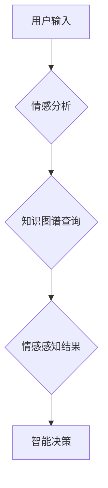

                 

## 知识的情感维度：理性思考中的感性因素

> 关键词：人工智能、情感计算、知识图谱、理性思考、感性因素、决策支持、伦理问题

## 1. 背景介绍

在当今数据爆炸的时代，人工智能（AI）正以惊人的速度发展，其应用领域不断拓展，从医疗诊断到金融预测，再到自动驾驶，AI无处不在。然而，我们常常忽略一个关键问题：AI的决策是否仅仅基于纯粹的逻辑推理，还是蕴含着某种情感因素？

传统人工智能模型主要基于逻辑推理和数据分析，强调理性思考和客观决策。然而，人类的决策并非完全理性，情感因素往往扮演着重要的角色。我们的情绪、价值观、信念等都会影响我们的判断和选择。

近年来，情感计算（Affective Computing）领域兴起，旨在研究计算机如何理解、模拟和响应人类的情感。这为我们提供了新的视角，让我们开始思考如何将情感因素融入到人工智能系统中。

## 2. 核心概念与联系

### 2.1 情感计算与知识图谱

情感计算旨在理解和模拟人类的情感，它涉及到自然语言处理、机器学习、心理学等多个领域。知识图谱（Knowledge Graph）则是一种数据结构，用于表示知识的结构化表示，它可以存储和推理各种知识，包括事实、概念、关系等。

将情感计算与知识图谱相结合，可以构建更加智能和人性化的AI系统。

**Mermaid 流程图：**



### 2.2 理性思考与感性因素

理性思考强调逻辑推理和客观分析，而感性因素则更注重主观体验和情感判断。两者并非对立，而是相互补充。

在实际决策中，理性思考提供框架和依据，而感性因素则为决策注入情感色彩和人性化。

## 3. 核心算法原理 & 具体操作步骤

### 3.1 算法原理概述

情感分析算法旨在从文本、语音、图像等数据中识别和理解人类的情感。常用的情感分析算法包括：

* **基于规则的方法：** 这种方法依赖于预先定义的规则和情感词典，通过匹配关键词和词性来判断情感倾向。
* **基于机器学习的方法：** 这种方法利用机器学习算法，从大量的标注数据中学习情感分类模型，能够识别更复杂的感情表达。
* **深度学习方法：** 深度学习方法利用神经网络结构，能够自动学习情感特征，并实现更精准的情感识别。

### 3.2 算法步骤详解

以基于机器学习的情感分析算法为例，其具体操作步骤如下：

1. **数据收集和预处理：** 收集包含情感信息的文本数据，并进行清洗、分词、词干提取等预处理操作。
2. **特征提取：** 从预处理后的文本数据中提取情感特征，例如词频、情感词典匹配、词向量表示等。
3. **模型训练：** 利用机器学习算法，例如支持向量机（SVM）、随机森林（RF）、深度神经网络（DNN）等，训练情感分类模型。
4. **模型评估：** 使用测试数据评估模型的性能，例如准确率、召回率、F1-score等指标。
5. **模型部署：** 将训练好的模型部署到实际应用场景中，用于情感分析任务。

### 3.3 算法优缺点

**优点：**

* 能够识别更复杂的感情表达。
* 性能优于基于规则的方法。
* 可以根据数据不断学习和改进。

**缺点：**

* 需要大量的标注数据进行训练。
* 对数据质量要求较高。
* 难以解释模型的决策过程。

### 3.4 算法应用领域

情感分析算法广泛应用于以下领域：

* **社交媒体监控：** 分析用户对品牌、产品、事件等的情感态度。
* **客户服务：** 自动识别客户的投诉、建议和反馈。
* **市场营销：** 了解消费者对广告和产品的反应。
* **医疗保健：** 识别患者的情绪状态，辅助诊断和治疗。

## 4. 数学模型和公式 & 详细讲解 & 举例说明

### 4.1 数学模型构建

情感分析算法通常使用概率模型来表示情感分类问题。例如，可以使用贝叶斯网络来表示不同情感类别之间的概率关系。

**贝叶斯网络：**

贝叶斯网络是一种概率图模型，用于表示随机变量之间的依赖关系。

**公式：**

$$P(C|F) = \frac{P(F|C)P(C)}{P(F)}$$

其中：

* $C$ 表示情感类别。
* $F$ 表示特征向量。
* $P(C|F)$ 表示给定特征向量 $F$ 的情况下，情感类别 $C$ 的概率。
* $P(F|C)$ 表示给定情感类别 $C$ 的情况下，特征向量 $F$ 的概率。
* $P(C)$ 表示情感类别 $C$ 的先验概率。
* $P(F)$ 表示特征向量 $F$ 的边缘概率。

### 4.2 公式推导过程

贝叶斯公式的推导过程基于概率论的基本定理。

**推导过程：**

$$P(C|F) = \frac{P(F|C)P(C)}{P(F)}$$

$$P(F) = \sum_{c} P(F|c)P(c)$$

### 4.3 案例分析与讲解

假设我们有一个情感分析模型，需要判断一段文本的情感类别。

**文本：** “今天天气真好，心情也很好！”

**特征向量：** 包含“天气”、“心情”、“好”等情感词的词频信息。

**模型预测：** 根据贝叶斯公式和训练数据，模型预测该文本的情感类别为“正面”。

## 5. 项目实践：代码实例和详细解释说明

### 5.1 开发环境搭建

* Python 3.x
* NLTK 自然语言处理库
* Scikit-learn 机器学习库
* TensorFlow 深度学习库

### 5.2 源代码详细实现

```python
import nltk
from sklearn.model_selection import train_test_split
from sklearn.linear_model import LogisticRegression
from sklearn.metrics import accuracy_score

# 数据加载和预处理
# ...

# 特征提取
def extract_features(text):
    # ...

# 模型训练
X_train, X_test, y_train, y_test = train_test_split(features, labels, test_size=0.2)
model = LogisticRegression()
model.fit(X_train, y_train)

# 模型评估
y_pred = model.predict(X_test)
accuracy = accuracy_score(y_test, y_pred)
print(f"Accuracy: {accuracy}")

# 模型部署
# ...
```

### 5.3 代码解读与分析

* 数据加载和预处理：加载情感标注数据，并进行清洗、分词、词干提取等预处理操作。
* 特征提取：从文本数据中提取情感特征，例如词频、情感词典匹配、词向量表示等。
* 模型训练：使用机器学习算法，例如逻辑回归，训练情感分类模型。
* 模型评估：使用测试数据评估模型的性能，例如准确率。
* 模型部署：将训练好的模型部署到实际应用场景中，用于情感分析任务。

### 5.4 运行结果展示

运行代码后，可以得到模型的准确率，以及预测结果。

## 6. 实际应用场景

### 6.1 情感分析在社交媒体监控中的应用

社交媒体平台上每天产生海量的用户数据，其中包含大量的文本信息，例如评论、帖子、微博等。通过情感分析算法，可以对这些文本数据进行分析，识别用户对品牌、产品、事件等的情感态度。

例如，一家公司可以利用情感分析算法监控用户对其产品的评论，了解用户对产品的满意度，并及时改进产品。

### 6.2 情感分析在客户服务中的应用

客户服务部门每天需要处理大量的客户咨询和投诉。通过情感分析算法，可以自动识别客户的情绪状态，例如愤怒、沮丧、高兴等。

例如，当客户表达愤怒情绪时，客服人员可以及时调整语气和方式，更好地解决客户问题。

### 6.3 情感分析在市场营销中的应用

市场营销人员需要了解消费者对广告和产品的反应。通过情感分析算法，可以分析消费者对广告和产品的评论，了解他们的情感倾向。

例如，广告公司可以利用情感分析算法评估广告的吸引力，并根据结果进行调整。

### 6.4 未来应用展望

随着人工智能技术的不断发展，情感分析算法将应用于更多领域，例如：

* **医疗保健：** 识别患者的情绪状态，辅助诊断和治疗。
* **教育：** 了解学生的学习情绪，提供个性化学习建议。
* **人机交互：** 开发更加人性化的智能助手和虚拟角色。

## 7. 工具和资源推荐

### 7.1 学习资源推荐

* **书籍：**
    * 《情感计算》
    * 《深度学习》
* **在线课程：**
    * Coursera 上的“情感计算”课程
    * edX 上的“机器学习”课程

### 7.2 开发工具推荐

* **Python：** 广泛用于情感分析开发，拥有丰富的库和工具。
* **NLTK：** 自然语言处理库，提供文本预处理、词性标注等功能。
* **Scikit-learn：** 机器学习库，提供各种分类算法和评估指标。
* **TensorFlow：** 深度学习库，用于训练和部署深度学习模型。

### 7.3 相关论文推荐

* **“A Survey of Sentiment Analysis”**
* **“Deep Learning for Sentiment Analysis”**

## 8. 总结：未来发展趋势与挑战

### 8.1 研究成果总结

情感计算领域取得了显著进展，情感分析算法的性能不断提升，应用场景也越来越广泛。

### 8.2 未来发展趋势

* **多模态情感分析：** 将文本、语音、图像等多种模态数据融合，实现更加全面的情感理解。
* **跨语言情感分析：** 突破语言障碍，实现跨语言的情感分析。
* **解释性情感分析：** 提高模型的透明度，解释模型的决策过程。

### 8.3 面临的挑战

* **数据标注问题：** 情感分析算法需要大量的标注数据，数据标注成本高，效率低。
* **情感表达的复杂性：** 人类情感表达复杂多样，难以用简单的规则或模型完全捕捉。
* **伦理问题：** 情感分析技术可能被用于监控和控制用户，需要谨慎考虑其伦理 implications。

### 8.4 研究展望

未来，情感计算将继续朝着更加智能、人性化、可解释的方向发展，为我们提供更加深刻的理解和体验人类情感。

## 9. 附录：常见问题与解答

**Q1：情感分析算法的准确率如何？**

A1：情感分析算法的准确率取决于多种因素，例如数据质量、算法模型、特征提取方法等。目前，先进的情感分析算法的准确率可以达到 80% 以上。

**Q2：情感分析算法有哪些应用场景？**

A2：情感分析算法广泛应用于社交媒体监控、客户服务、市场营销、医疗保健、教育等领域。

**Q3：如何选择合适的算法模型？**

A3：选择合适的算法模型需要根据具体应用场景和数据特点进行选择。例如，对于文本数据，可以使用逻辑回归、支持向量机、深度神经网络等算法模型。

**Q4：情感分析算法有哪些伦理问题？**

A4：情感分析技术可能被用于监控和控制用户，需要谨慎考虑其伦理 implications。例如，企业可以使用情感分析技术监控员工的情绪状态，这可能会侵犯员工的隐私。

**Q5：如何学习情感分析技术？**

A5：可以通过阅读书籍、参加在线课程、学习开源代码等方式学习情感分析技术。


作者：禅与计算机程序设计艺术 / Zen and the Art of Computer Programming 
<end_of_turn>

