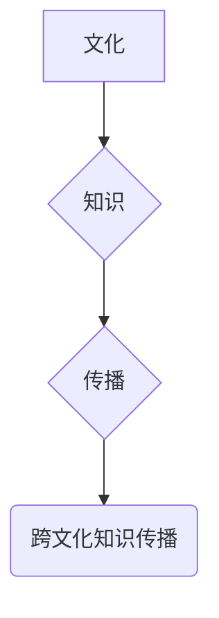

                 

## 知识的跨文化传播：全球化时代的挑战

> 关键词：跨文化传播、知识共享、全球化、技术障碍、语言差异、文化差异、认知偏差、信息过滤、人工智能、机器翻译

## 1. 背景介绍

在当今全球化时代，信息技术飞速发展，网络连接世界各地，知识的跨文化传播变得前所未有的便捷。然而，尽管技术进步为跨文化知识交流提供了强大的工具，但文化差异、语言障碍、认知偏差等因素仍然构成了跨文化知识传播的重大挑战。

### 1.1 全球化背景下知识传播的意义

全球化进程加速，世界各国经济、文化、政治等领域相互交融，知识的跨文化传播对于促进国际合作、推动经济发展、促进文化交流具有重要意义。

* **促进经济发展:** 知识是生产力的源泉，跨文化知识传播可以帮助各国分享先进技术和经验，促进经济增长。
* **推动文化交流:** 不同文化背景下的知识和思想碰撞，可以促进相互理解，增进文化交流，构建更加包容和多元的社会。
* **解决全球性问题:** 全球性问题如气候变化、传染病等需要全球合作解决，跨文化知识传播可以帮助各国分享应对策略，共同应对挑战。

### 1.2 跨文化知识传播面临的挑战

尽管知识传播的便利性提高，但跨文化传播仍然面临着诸多挑战：

* **语言障碍:** 不同语言之间的差异是跨文化知识传播的主要障碍，即使使用机器翻译，也难以完全准确地传达文化内涵和语义。
* **文化差异:** 不同文化背景下的人们对知识的理解和接受程度不同，文化差异会导致知识传播的偏差和误解。
* **认知偏差:** 人们在接收信息时会受到自身认知模式的影响，容易产生认知偏差，导致对跨文化知识的理解不全面。
* **信息过滤:** 不同国家和地区的媒体和信息渠道存在差异，信息过滤现象可能导致跨文化知识传播不均衡。

## 2. 核心概念与联系

跨文化知识传播的核心概念包括：

* **文化:** 指特定社会群体共同的价值观、信仰、习俗、行为规范等。
* **知识:** 指对世界和自身有理解和认识的体系，包括事实、概念、技能、经验等。
* **传播:** 指知识从一个主体传递到另一个主体的过程。

跨文化知识传播是一个复杂的过程，涉及到文化、知识、传播等多方面的因素相互作用。

**Mermaid 流程图:**



## 3. 核心算法原理 & 具体操作步骤

跨文化知识传播涉及到多种算法和技术，例如机器翻译、自然语言处理、知识图谱等。

### 3.1 算法原理概述

* **机器翻译:** 利用计算机算法将一种语言自动翻译成另一种语言。
* **自然语言处理:** 研究计算机如何理解、处理和生成人类语言。
* **知识图谱:** 将知识表示为图结构，方便知识的组织、检索和推理。

### 3.2 算法步骤详解

* **机器翻译:**
    1. 将源语言文本进行分词和词性标注。
    2. 利用统计模型或神经网络模型将源语言词语映射到目标语言词语。
    3. 将目标语言词语重新组合成完整的句子。
* **自然语言处理:**
    1. 文本预处理: 去除停用词、标点符号等，进行词干提取、词义消歧等操作。
    2. 语义分析: 分析文本的句法结构和语义关系。
    3. 情感分析: 分析文本表达的情感倾向。
* **知识图谱:**
    1. 知识抽取: 从文本中提取实体和关系。
    2. 知识表示: 将实体和关系表示为图结构。
    3. 知识推理: 利用图结构进行知识推理和问答。

### 3.3 算法优缺点

* **机器翻译:**
    * 优点: 可以快速高效地将文本翻译成另一种语言。
    * 缺点: 翻译质量仍然存在一定差距，难以完全准确地传达文化内涵和语义。
* **自然语言处理:**
    * 优点: 可以帮助计算机理解和处理人类语言，为跨文化知识传播提供支持。
    * 缺点: 自然语言的复杂性和多样性使得自然语言处理任务非常具有挑战性。
* **知识图谱:**
    * 优点: 可以将知识组织和表示为图结构，方便知识的检索和推理。
    * 缺点: 知识图谱的构建需要大量的人工标注和维护。

### 3.4 算法应用领域

* **机器翻译:** 在线翻译、字幕翻译、文档翻译等。
* **自然语言处理:** 聊天机器人、搜索引擎、文本摘要等。
* **知识图谱:** 知识管理、问答系统、推荐系统等。

## 4. 数学模型和公式 & 详细讲解 & 举例说明

跨文化知识传播涉及到信息论、统计学、机器学习等数学模型和公式。

### 4.1 数学模型构建

* **信息熵:** 用于度量信息的不确定性，可以用来衡量跨文化知识传播的难度。
* **贝叶斯定理:** 用于计算条件概率，可以用来评估跨文化知识传播的准确性。
* **机器学习算法:** 可以用来学习跨文化知识传播的规律，提高传播效率。

### 4.2 公式推导过程

* **信息熵公式:**

$$H(X) = - \sum_{i=1}^{n} p(x_i) \log_2 p(x_i)$$

其中，$X$ 是随机变量，$p(x_i)$ 是 $x_i$ 的概率。

* **贝叶斯定理公式:**

$$P(A|B) = \frac{P(B|A)P(A)}{P(B)}$$

其中，$A$ 和 $B$ 是两个事件，$P(A|B)$ 是事件 $A$ 在事件 $B$ 发生的条件概率。

### 4.3 案例分析与讲解

* **信息熵:** 假设有两个语言，语言 $A$ 和语言 $B$，它们的词汇量分别为 $n_A$ 和 $n_B$。如果 $n_A > n_B$，则语言 $A$ 的信息熵 $H(A)$ 大于语言 $B$ 的信息熵 $H(B)$，这意味着语言 $A$ 的知识表达能力更强，跨文化知识传播的难度也更大。
* **贝叶斯定理:** 假设有一个机器翻译系统，它将源语言文本翻译成目标语言文本。如果该系统在翻译特定类型的文本时准确率为 $P(B|A)$，而该类型的文本在所有文本中所占比例为 $P(A)$，则该系统在翻译所有文本时的准确率为 $P(A|B)$。

## 5. 项目实践：代码实例和详细解释说明

跨文化知识传播的项目实践可以利用机器翻译、自然语言处理、知识图谱等技术。

### 5.1 开发环境搭建

* **操作系统:** Linux 或 Windows
* **编程语言:** Python
* **开发工具:** Jupyter Notebook、VS Code

### 5.2 源代码详细实现

以下是一个简单的机器翻译代码实例，使用 Google Translate API 进行翻译：

```python
from googletrans import Translator

translator = Translator()

text = "Hello, world!"

translation = translator.translate(text, dest='zh-CN')

print(translation.text)
```

### 5.3 代码解读与分析

* **导入库:** 首先导入 `googletrans` 库，该库提供了 Google Translate API 的接口。
* **创建翻译对象:** 创建一个 `Translator` 对象，用于进行翻译操作。
* **设置翻译文本:** 设置需要翻译的文本，以及目标语言。
* **执行翻译:** 调用 `translate()` 方法进行翻译，返回翻译结果。
* **打印翻译结果:** 打印翻译后的文本。

### 5.4 运行结果展示

```
你好，世界！
```

## 6. 实际应用场景

跨文化知识传播在各个领域都有广泛的应用场景。

### 6.1 教育领域

* **在线课程翻译:** 将在线课程内容翻译成不同语言，方便全球学生学习。
* **跨文化学习平台:** 建立跨文化学习平台，促进不同文化背景的学生交流学习。

### 6.2 商业领域

* **国际市场营销:** 将营销材料翻译成目标语言，方便推广产品和服务。
* **跨国合作:** 利用机器翻译和自然语言处理技术，帮助跨国团队进行高效沟通。

### 6.3 政府领域

* **国际外交:** 利用机器翻译技术，帮助外交官进行跨文化沟通。
* **国际合作:** 利用知识图谱技术，帮助政府部门了解不同国家的政策和法规。

### 6.4 未来应用展望

随着人工智能技术的不断发展，跨文化知识传播将更加便捷高效。未来，我们可以期待以下应用场景：

* **个性化知识推荐:** 根据用户的文化背景和兴趣爱好，推荐个性化的知识内容。
* **跨文化协作平台:** 建立跨文化协作平台，方便不同文化背景的人员进行协同工作。
* **虚拟文化体验:** 利用虚拟现实技术，提供沉浸式的跨文化体验。

## 7. 工具和资源推荐

### 7.1 学习资源推荐

* **Coursera:** 提供机器翻译、自然语言处理等相关课程。
* **edX:** 提供知识图谱、人工智能等相关课程。
* **GitHub:** 提供开源机器翻译、自然语言处理、知识图谱工具和代码。

### 7.2 开发工具推荐

* **Google Translate API:** 提供机器翻译服务。
* **spaCy:** 自然语言处理库。
* **Neo4j:** 知识图谱数据库。

### 7.3 相关论文推荐

* **Neural Machine Translation by Jointly Learning to Align and Translate**
* **BERT: Pre-training of Deep Bidirectional Transformers for Language Understanding**
* **Knowledge Graph Embedding: A Survey**

## 8. 总结：未来发展趋势与挑战

跨文化知识传播在全球化时代具有重要意义，但仍然面临着诸多挑战。未来，人工智能技术将继续推动跨文化知识传播的发展，但同时也需要解决以下问题：

### 8.1 研究成果总结

* **机器翻译:** 神经网络模型的应用提高了机器翻译的准确性。
* **自然语言处理:** 深度学习技术在自然语言理解和生成方面取得了突破。
* **知识图谱:** 知识图谱技术可以帮助组织和表示跨文化知识。

### 8.2 未来发展趋势

* **更准确的机器翻译:** 利用深度学习技术，开发更准确、更自然流畅的机器翻译系统。
* **更智能的自然语言处理:** 开发更智能的自然语言处理系统，能够理解和生成更复杂的语言。
* **更丰富的知识图谱:** 建立更丰富的跨文化知识图谱，涵盖更广泛的领域和文化背景。

### 8.3 面临的挑战

* **文化差异:** 不同文化背景下的人们对知识的理解和接受程度不同，需要开发更有效的跨文化知识传播方法。
* **信息过滤:** 不同国家和地区的媒体和信息渠道存在差异，需要解决信息过滤问题，确保跨文化知识传播的公平性和客观性。
* **伦理问题:** 人工智能技术在跨文化知识传播中的应用可能引发伦理问题，需要制定相应的伦理规范和法律法规。

### 8.4 研究展望

未来，跨文化知识传播的研究将更加注重以下方面：

* **跨文化理解:** 开发能够理解和尊重不同文化差异的跨文化知识传播系统。
* **个性化知识推荐:** 根据用户的文化背景和兴趣爱好，推荐个性化的跨文化知识内容。
* **跨文化协作:** 建立跨文化协作平台，方便不同文化背景的人员进行协同工作。


## 9. 附录：常见问题与解答

### 9.1 如何提高机器翻译的准确性？

* 使用高质量的训练数据。
* 利用深度学习技术，开发更复杂的机器翻译模型。
* 结合语义分析和上下文理解技术，提高翻译的准确性和自然度。

### 9.2 如何解决跨文化知识传播中的信息过滤问题？

* 建立开放、透明的跨文化知识传播平台。
* 鼓励多方参与，提供多元化的知识内容。
* 利用算法技术，识别和过滤虚假信息和偏见信息。

### 9.3 人工智能技术在跨文化知识传播中的伦理问题有哪些？

* 数据隐私保护: 跨文化知识传播系统可能需要收集和使用用户的个人数据，需要确保数据的安全性和隐私性。
* 算法偏见: 人工智能算法可能存在偏见，导致跨文化知识传播不公平。
* 知识控制: 跨文化知识传播系统可能被用于控制和操纵信息，需要防止滥用。


作者：禅与计算机程序设计艺术 / Zen and the Art of Computer Programming<end_of_turn>

