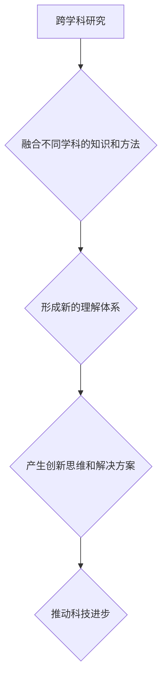

                 

## 知识的边界：跨学科研究与创新思维的碰撞

> 关键词：跨学科研究、创新思维、人工智能、机器学习、深度学习、数据科学、算法设计

### 1. 背景介绍

在当今科技飞速发展的时代，知识的边界日益模糊，学科之间的交叉融合成为推动创新和解决复杂问题的关键。人工智能（AI）作为一门跨学科的领域，融合了计算机科学、数学、统计学、心理学等多个学科的知识和方法，其发展离不开跨学科研究的推动。

传统的学科划分往往导致知识孤岛的形成，阻碍了不同领域之间的交流和合作。而跨学科研究则打破了这种壁垒，鼓励不同领域的专家学者共同探讨问题，融合各自的专业知识和经验，从而产生新的见解和突破。

### 2. 核心概念与联系

跨学科研究的核心在于将不同学科的知识和方法有机地结合起来，形成一个新的、更全面的理解体系。

**2.1 跨学科研究的类型**

跨学科研究可以分为以下几种类型：

* **多学科研究:** 多个学科的专家学者各自独立地进行研究，最后将研究成果整合在一起。
* **交叉学科研究:** 不同学科的专家学者共同参与研究，相互借鉴和融合，形成一个新的研究领域。
* **融合学科研究:** 不同学科的知识和方法完全融合在一起，形成一个全新的学科体系。

**2.2 跨学科研究的优势**

跨学科研究具有以下优势：

* **更全面的视角:** 不同学科的专家学者可以从不同的角度看待问题，从而获得更全面的理解。
* **更创新的解决方案:** 融合不同学科的知识和方法，可以产生更创新的解决方案。
* **更强的竞争力:** 跨学科研究可以帮助企业和机构在竞争中获得优势。

**2.3 跨学科研究的挑战**

跨学科研究也面临着一些挑战：

* **学科壁垒:** 不同学科的专家学者之间存在着思维方式和语言习惯的差异，这可能会导致沟通和合作的困难。
* **资源分配:** 跨学科研究需要整合来自不同学科的资源，这可能会面临资源分配的挑战。
* **评价标准:** 跨学科研究成果的评价标准往往比较模糊，这可能会导致研究成果的推广和应用受到限制。

**Mermaid 流程图**



### 3. 核心算法原理 & 具体操作步骤

**3.1 算法原理概述**

深度学习算法是人工智能领域的核心算法之一，它能够从海量数据中自动学习特征，并进行复杂的模式识别和预测。深度学习算法的核心是多层神经网络，它由多个神经元组成的层级结构组成，每个神经元都连接着其他神经元，并通过权重进行信息传递。

**3.2 算法步骤详解**

深度学习算法的训练过程可以概括为以下步骤：

1. **数据预处理:** 将原始数据进行清洗、转换和格式化，使其适合深度学习算法的训练。
2. **网络结构设计:** 根据具体任务需求，设计深度神经网络的结构，包括神经元的数量、连接方式和激活函数等。
3. **参数初始化:** 为神经网络中的权重和偏置赋予初始值。
4. **前向传播:** 将输入数据通过神经网络进行传递，计算输出结果。
5. **反向传播:** 计算输出结果与真实值的误差，并根据误差反向调整神经网络的权重和偏置。
6. **优化算法:** 使用优化算法，例如梯度下降法，不断调整神经网络的权重和偏置，使其能够更好地拟合数据。
7. **模型评估:** 使用测试数据评估模型的性能，并根据评估结果进行模型调优。

**3.3 算法优缺点**

**优点:**

* **强大的学习能力:** 深度学习算法能够从海量数据中自动学习特征，并进行复杂的模式识别和预测。
* **高精度:** 深度学习算法在许多任务中都能够达到很高的精度。
* **可扩展性:** 深度学习算法可以很容易地扩展到更大的数据集和更复杂的模型。

**缺点:**

* **数据依赖:** 深度学习算法需要大量的训练数据才能达到良好的性能。
* **计算资源消耗:** 深度学习算法的训练过程需要大量的计算资源。
* **可解释性差:** 深度学习算法的决策过程比较复杂，难以解释其背后的原因。

**3.4 算法应用领域**

深度学习算法在各个领域都有广泛的应用，例如：

* **计算机视觉:** 图像识别、物体检测、图像分割、人脸识别等。
* **自然语言处理:** 文本分类、情感分析、机器翻译、语音识别等。
* **语音合成:** 生成逼真的语音。
* **医疗诊断:** 辅助医生进行疾病诊断。
* **金融预测:** 预测股票价格、风险评估等。

### 4. 数学模型和公式 & 详细讲解 & 举例说明

**4.1 数学模型构建**

深度学习算法的核心是多层神经网络，其数学模型可以表示为一个复杂的函数映射关系。

假设一个深度神经网络有 L 层，每层有 N_l 个神经元，则该网络的输出可以表示为：

$$
y = f_L(W_L f_{L-1}(...f_1(x)))
$$

其中：

* $x$ 是输入数据。
* $f_l$ 是第 l 层神经网络的激活函数。
* $W_l$ 是第 l 层神经网络的权重矩阵。
* $y$ 是网络的输出。

**4.2 公式推导过程**

神经网络的训练过程本质上是通过优化网络参数来最小化预测误差的过程。常用的优化算法是梯度下降法，其核心思想是沿着梯度方向调整网络参数，使得误差函数不断减小。

梯度下降法的更新公式为：

$$
W_{l} = W_{l} - \eta \frac{\partial L}{\partial W_{l}}
$$

其中：

* $W_{l}$ 是第 l 层神经网络的权重矩阵。
* $\eta$ 是学习率。
* $\frac{\partial L}{\partial W_{l}}$ 是误差函数 $L$ 对 $W_{l}$ 的梯度。

**4.3 案例分析与讲解**

以图像分类为例，假设我们使用一个深度神经网络来识别猫和狗的图像。

训练过程中，我们将大量的猫和狗的图像作为训练数据，并使用梯度下降法来优化网络参数。

网络的输出层有两个神经元，分别对应猫和狗的类别。

当输入一张猫的图像时，网络的输出层应该将猫的概率输出较高，而狗的概率输出较低。

通过不断调整网络参数，使得网络的输出结果与真实标签尽可能一致，从而实现图像分类的任务。

### 5. 项目实践：代码实例和详细解释说明

**5.1 开发环境搭建**

深度学习算法的开发通常需要使用 Python 语言和相关的深度学习框架，例如 TensorFlow 或 PyTorch。

需要安装 Python 语言环境、深度学习框架和必要的库。

**5.2 源代码详细实现**

以下是一个使用 TensorFlow 实现图像分类的简单代码示例：

```python
import tensorflow as tf

# 定义模型结构
model = tf.keras.models.Sequential([
  tf.keras.layers.Conv2D(32, (3, 3), activation='relu', input_shape=(28, 28, 1)),
  tf.keras.layers.MaxPooling2D((2, 2)),
  tf.keras.layers.Conv2D(64, (3, 3), activation='relu'),
  tf.keras.layers.MaxPooling2D((2, 2)),
  tf.keras.layers.Flatten(),
  tf.keras.layers.Dense(10, activation='softmax')
])

# 编译模型
model.compile(optimizer='adam',
              loss='sparse_categorical_crossentropy',
              metrics=['accuracy'])

# 训练模型
model.fit(x_train, y_train, epochs=5)

# 评估模型
loss, accuracy = model.evaluate(x_test, y_test)
print('Test loss:', loss)
print('Test accuracy:', accuracy)
```

**5.3 代码解读与分析**

这段代码定义了一个简单的卷积神经网络模型，用于图像分类任务。

模型包含两层卷积层、两层最大池化层、一层全连接层和一层输出层。

模型使用 Adam 优化器、交叉熵损失函数和准确率作为评估指标。

代码还展示了模型的训练和评估过程。

**5.4 运行结果展示**

训练完成后，可以将模型应用于新的图像数据进行分类。

模型的输出结果将是一个概率分布，表示图像属于不同类别的概率。

### 6. 实际应用场景

深度学习算法在各个领域都有广泛的应用，例如：

**6.1 医疗诊断**

深度学习算法可以辅助医生进行疾病诊断，例如识别肿瘤、检测眼底疾病等。

**6.2 金融预测**

深度学习算法可以用于预测股票价格、风险评估等金融任务。

**6.3 自动驾驶**

深度学习算法是自动驾驶汽车的核心技术之一，用于识别道路场景、预测车辆运动等。

**6.4 人工智能客服**

深度学习算法可以用于构建人工智能客服系统，自动回答用户问题、提供个性化服务等。

**6.5 内容推荐**

深度学习算法可以用于个性化内容推荐，例如推荐电影、音乐、商品等。

**6.6 未来应用展望**

随着深度学习算法的不断发展，其应用场景将更加广泛，例如：

* **个性化教育:** 根据学生的学习情况，提供个性化的学习方案。
* **精准医疗:** 根据患者的基因信息和病史，制定个性化的治疗方案。
* **科学发现:** 帮助科学家发现新的物理规律、化学物质等。

### 7. 工具和资源推荐

**7.1 学习资源推荐**

* **书籍:**
    * 深度学习 (Deep Learning) - Ian Goodfellow, Yoshua Bengio, Aaron Courville
    * 构建深度学习模型 (Hands-On Machine Learning with Scikit-Learn, Keras & TensorFlow) - Aurélien Géron
* **在线课程:**
    * 深度学习 Specialization - Andrew Ng (Coursera)
    * fast.ai - Practical Deep Learning for Coders
* **博客和网站:**
    * TensorFlow Blog
    * PyTorch Blog
    * Towards Data Science

**7.2 开发工具推荐**

* **深度学习框架:** TensorFlow, PyTorch, Keras
* **编程语言:** Python
* **数据处理工具:** Pandas, NumPy
* **可视化工具:** Matplotlib, Seaborn

**7.3 相关论文推荐**

* **AlexNet:** ImageNet Classification with Deep Convolutional Neural Networks
* **VGGNet:** Very Deep Convolutional Networks for Large-Scale Image Recognition
* **ResNet:** Deep Residual Learning for Image Recognition
* **InceptionNet:** Inception-v3, Inception-ResNet v2

### 8. 总结：未来发展趋势与挑战

**8.1 研究成果总结**

近年来，深度学习算法取得了显著的进展，在图像识别、自然语言处理、语音识别等领域取得了突破性的成果。

**8.2 未来发展趋势**

未来，深度学习算法将朝着以下方向发展：

* **模型更深更广:** 探索更深层次、更广阔结构的神经网络模型。
* **数据更丰富更智能:** 利用更多类型、更高质量的数据进行训练，并开发更智能的数据处理方法。
* **算法更高效更鲁棒:** 研发更有效的训练算法和更鲁棒的模型，使其能够更好地应对复杂场景。
* **解释性更强:** 研究更有效的解释深度学习模型决策的方法，提高模型的可解释性。

**8.3 面临的挑战**

深度学习算法也面临着一些挑战：

* **数据获取和标注:** 训练深度学习模型需要大量的标注数据，获取和标注数据成本高昂。
* **计算资源:** 训练深度学习模型需要大量的计算资源，这对于资源有限的机构和个人来说是一个挑战。
* **模型可解释性:** 深度学习模型的决策过程比较复杂，难以解释其背后的原因，这可能会导致模型的应用受到限制。

**8.4 研究展望**

未来，跨学科研究将继续推动深度学习算法的发展，并将其应用于更多领域。

例如，将深度学习算法与生物学、心理学、社会学等学科结合，可以开发出更智能、更安全的AI系统。


### 9. 附录：常见问题与解答

**9.1 如何选择合适的深度学习框架？**

选择深度学习框架需要根据具体任务需求和个人经验进行选择。

TensorFlow 和 PyTorch 是目前最流行的深度学习框架，它们都具有强大的功能和活跃的社区支持。

**9.2 如何处理深度学习模型的过拟合问题？**

过拟合是指模型在训练数据上表现很好，但在测试数据上表现较差。

常用的处理过拟合的方法包括：

* **增加训练数据量:** 更多的训练数据可以帮助模型更好地泛化。
* **使用正则化技术:** 正则化技术可以惩罚模型的复杂度，防止模型过拟合。
* **使用 dropout 技术:** dropout 技术可以随机丢弃一部分神经元，防止模型过于依赖某些神经元。
* **使用交叉验证:** 交叉验证可以评估模型在不同数据集上的性能，并选择最优的模型。

**9.3 如何评估深度学习模型的性能？**

常用的评估指标包括：

* **准确率:** 模型正确分类的样本比例。
* **召回率:** 模型识别出所有正样本的比例。
* **F1-score:** 准确率和召回率的调和平均值。
* **AUC:** 曲线下面积，用于评估模型的二分类能力。


作者：禅与计算机程序设计艺术 / Zen and the Art of Computer Programming<end_of_turn>

