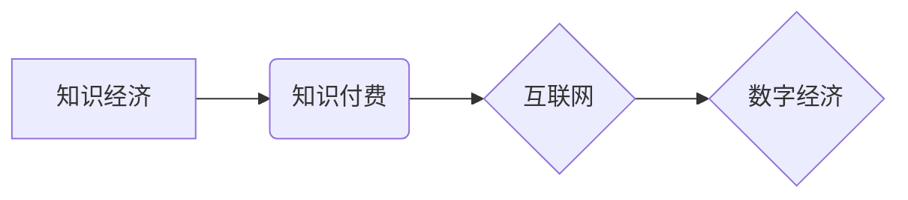

                 

## 知识经济时代下的知识付费发展趋势

> 关键词：知识付费、知识经济、在线教育、内容创作、数字经济、订阅模式、知识产权

### 1. 背景介绍

随着科技进步和互联网的普及，人类社会正从工业经济向知识经济转型。知识成为生产和发展的核心要素，对个人和社会都具有至关重要的意义。知识付费作为一种新型的商业模式，应运而生，并在知识经济时代迅速发展。

知识付费是指知识产权持有者通过付费的方式，向用户提供知识、技能、经验等方面的服务。它打破了传统知识传播的壁垒，让知识更加易于获取和分享，同时也为知识创作者提供了新的收入来源。

近年来，知识付费市场呈现出蓬勃发展的态势。在线教育平台、知识社区、付费内容订阅等模式层出不穷，吸引了大量用户和创作者参与其中。

### 2. 核心概念与联系

**2.1 知识经济**

知识经济是指以知识、技术、信息为主要生产要素，以创新和创造为核心驱动的经济模式。它强调知识的积累、应用和传播，并以知识的价值创造和分享为目标。

**2.2 知识付费**

知识付费是指知识产权持有者通过付费的方式，向用户提供知识、技能、经验等方面的服务。它是一种商业模式，旨在将知识的价值转化为经济效益。

**2.3 互联网与数字经济**

互联网和数字经济为知识付费的发展提供了重要的基础和条件。互联网提供了便捷的知识传播平台，数字经济则促进了知识的数字化和可交易性。

**2.4 核心概念关系图**



### 3. 核心算法原理 & 具体操作步骤

**3.1 算法原理概述**

知识付费平台的运营需要依靠一系列算法来实现内容推荐、用户匹配、付费交易等功能。这些算法通常基于机器学习、数据挖掘等技术，通过分析用户行为、内容特征等数据，为用户提供个性化的服务。

**3.2 算法步骤详解**

1. **数据采集:** 收集用户行为数据、内容特征数据等。
2. **数据预处理:** 对数据进行清洗、转换、特征提取等处理。
3. **模型训练:** 利用机器学习算法，训练推荐、匹配、交易等模型。
4. **模型评估:** 对模型进行评估，并根据评估结果进行调整和优化。
5. **模型部署:** 将训练好的模型部署到生产环境中，为用户提供服务。

**3.3 算法优缺点**

**优点:**

* **个性化推荐:** 算法可以根据用户的兴趣和需求，推荐个性化的知识内容。
* **精准匹配:** 算法可以根据用户的技能水平和学习目标，匹配合适的知识课程和导师。
* **提高效率:** 算法可以自动完成内容推荐、用户匹配等任务，提高平台运营效率。

**缺点:**

* **数据依赖:** 算法的性能依赖于数据的质量和数量。
* **算法偏差:** 算法可能存在偏差，导致推荐结果不准确或不公平。
* **隐私安全:** 数据采集和使用需要考虑用户隐私安全问题。

**3.4 算法应用领域**

* **在线教育:** 推荐课程、匹配学员、个性化学习路径。
* **知识社区:** 推荐内容、匹配用户、促进互动交流。
* **付费内容订阅:** 推荐订阅内容、个性化内容推送。

### 4. 数学模型和公式 & 详细讲解 & 举例说明

**4.1 数学模型构建**

知识付费平台的推荐算法通常基于协同过滤模型。协同过滤模型通过分析用户对不同知识内容的评分或行为，预测用户对其他知识内容的兴趣。

**4.2 公式推导过程**

协同过滤模型的推荐公式可以表示为：

$$
r_{ui} = \mu + b_u + b_i + \sigma \cdot \sum_{j \in N(u)} \frac{r_{uj} - \mu - b_u - b_j}{\sqrt{\sum_{k \in N(u)} (r_{uk} - \mu - b_u - b_k)^2}}
$$

其中：

* $r_{ui}$ 表示用户 $u$ 对知识内容 $i$ 的评分或行为。
* $\mu$ 表示全局平均评分。
* $b_u$ 表示用户 $u$ 的偏差。
* $b_i$ 表示知识内容 $i$ 的偏差。
* $\sigma$ 表示协同过滤参数。
* $N(u)$ 表示与用户 $u$ 有交互的用户集合。

**4.3 案例分析与讲解**

假设用户 $A$ 对知识内容 $X$ 和 $Y$ 都评分很高，而用户 $B$ 对知识内容 $Y$ 和 $Z$ 都评分很高。根据协同过滤模型，可以推测用户 $A$ 可能对知识内容 $Z$ 也感兴趣。

### 5. 项目实践：代码实例和详细解释说明

**5.1 开发环境搭建**

* Python 3.x
* TensorFlow 或 PyTorch
* Jupyter Notebook

**5.2 源代码详细实现**

```python
import tensorflow as tf

# 定义模型
model = tf.keras.Sequential([
    tf.keras.layers.Dense(64, activation='relu'),
    tf.keras.layers.Dense(10, activation='softmax')
])

# 编译模型
model.compile(optimizer='adam',
              loss='sparse_categorical_crossentropy',
              metrics=['accuracy'])

# 训练模型
model.fit(X_train, y_train, epochs=10)

# 预测结果
predictions = model.predict(X_test)
```

**5.3 代码解读与分析**

* 代码使用 TensorFlow 库构建了一个简单的深度学习模型。
* 模型包含两层全连接层，激活函数分别为 ReLU 和 Softmax。
* 模型使用 Adam 优化器，损失函数为稀疏类别交叉熵，评价指标为准确率。
* 模型使用训练数据进行训练，并使用测试数据进行预测。

**5.4 运行结果展示**

运行结果展示模型的训练过程和预测结果，例如准确率、损失值等指标。

### 6. 实际应用场景

**6.1 在线教育平台**

* 推荐课程：根据用户的学习目标、兴趣和水平，推荐合适的课程。
* 个性化学习路径：根据用户的学习进度和表现，定制个性化的学习路径。
* 匹配导师：根据用户的学习需求，匹配合适的导师进行一对一指导。

**6.2 知识社区**

* 推荐内容：根据用户的兴趣和阅读历史，推荐相关的文章、视频和讨论话题。
* 匹配用户：根据用户的兴趣和专业领域，匹配具有共同兴趣的用户进行交流。
* 促进互动交流：通过推荐和匹配，促进用户之间的互动交流，构建知识共享社区。

**6.3 付费内容订阅**

* 推荐订阅内容：根据用户的兴趣和阅读习惯，推荐相关的付费内容订阅服务。
* 个性化内容推送：根据用户的订阅内容和阅读偏好，推送个性化的内容推送。
* 提升用户粘性：通过个性化推荐和推送，提升用户对平台的粘性，促进付费转化。

**6.4 未来应用展望**

* **人工智能驱动的个性化学习:** 利用人工智能技术，实现更加个性化的学习体验，帮助用户更高效地掌握知识。
* **沉浸式学习体验:** 通过虚拟现实、增强现实等技术，打造更加沉浸式的学习体验，提高学习兴趣和效果。
* **跨学科知识融合:** 打破学科之间的壁垒，促进跨学科知识的融合，培养更加全面的人才。

### 7. 工具和资源推荐

**7.1 学习资源推荐**

* **在线课程:** Coursera、edX、Udacity 等平台提供丰富的在线课程，涵盖人工智能、机器学习、数据科学等领域。
* **书籍:** 《深度学习》、《机器学习实战》、《Python编程》等书籍，为学习人工智能和机器学习提供基础知识和实践经验。
* **开源项目:** TensorFlow、PyTorch、Scikit-learn 等开源项目，提供丰富的代码示例和学习资源。

**7.2 开发工具推荐**

* **Python:** 作为人工智能和机器学习的常用编程语言，Python 提供丰富的库和框架，方便开发和部署模型。
* **Jupyter Notebook:** 用于编写和运行 Python 代码的交互式笔记本环境，方便进行数据分析和模型实验。
* **TensorFlow/PyTorch:** 深度学习框架，用于构建和训练深度学习模型。

**7.3 相关论文推荐**

* **《Attention Is All You Need》:** 介绍了 Transformer 模型，是一种强大的自然语言处理模型。
* **《ImageNet Classification with Deep Convolutional Neural Networks》:** 介绍了 AlexNet 模型，标志着深度学习在图像识别领域的突破。
* **《Deep Learning》:** 深度学习领域的经典著作，由 Ian Goodfellow、Yoshua Bengio 和 Aaron Courville 共同撰写。

### 8. 总结：未来发展趋势与挑战

**8.1 研究成果总结**

知识付费平台的发展取得了显著成果，为知识传播和价值创造提供了新的模式。人工智能技术在知识推荐、用户匹配、付费交易等方面发挥着重要作用，提升了平台的效率和用户体验。

**8.2 未来发展趋势**

* **更加个性化的学习体验:** 利用人工智能技术，实现更加个性化的学习体验，帮助用户更高效地掌握知识。
* **沉浸式学习体验:** 通过虚拟现实、增强现实等技术，打造更加沉浸式的学习体验，提高学习兴趣和效果。
* **跨学科知识融合:** 打破学科之间的壁垒，促进跨学科知识的融合，培养更加全面的人才。

**8.3 面临的挑战**

* **数据安全和隐私保护:** 知识付费平台需要处理大量用户数据，需要加强数据安全和隐私保护措施。
* **算法公平性和可解释性:** 算法可能存在偏差，导致推荐结果不准确或不公平，需要提高算法的公平性和可解释性。
* **知识产权保护:** 知识付费平台需要建立有效的知识产权保护机制，保障知识创作者的权益。

**8.4 研究展望**

未来，知识付费平台将继续发展和完善，为用户提供更加优质的知识服务。研究者将继续探索人工智能技术在知识付费领域的应用，推动知识经济的健康发展。

### 9. 附录：常见问题与解答

**9.1 如何选择合适的知识付费平台？**

选择知识付费平台时，可以考虑以下因素：

* 平台的口碑和信誉
* 平台提供的课程质量和内容丰富度
* 平台的学习模式和互动机制
* 平台的收费标准和服务保障

**9.2 如何保护知识付费平台上的知识产权？**

知识付费平台通常会采取以下措施保护知识产权：

* 知识产权登记和注册
* 内容版权保护
* 侵权举报机制
* 法律追究

**9.3 如何提高知识付费平台的学习效果？**

提高知识付费平台的学习效果，可以采取以下措施：

* 制定学习计划，并坚持执行
* 积极参与互动交流，与老师和同学交流学习心得
* 利用平台提供的学习资源，进行深入学习
* 将所学知识应用到实际工作中，巩固学习成果


作者：禅与计算机程序设计艺术 / Zen and the Art of Computer Programming 
<end_of_turn>

