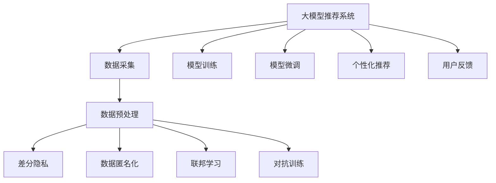

                 

# 大模型推荐系统的隐私保护问题

## 1. 背景介绍

在互联网时代，推荐系统已经成为了用户获取信息、享受个性化服务的重要工具。推荐算法通过分析用户的历史行为和兴趣，为用户推荐感兴趣的内容。然而，推荐系统在为用户创造便利的同时，也带来了隐私保护问题。用户数据不仅包括浏览记录、搜索记录、购买记录等显性数据，还包括IP地址、地理位置、社交网络关系等隐性数据。如何在充分利用用户数据的同时，保障用户的隐私，是大模型推荐系统设计时必须考虑的关键问题。

本文将从大模型推荐系统的原理、隐私保护策略、实际应用场景等方面进行深入探讨，旨在帮助开发者更好地理解隐私保护问题，设计出更加安全、可靠、可信的推荐系统。

## 2. 核心概念与联系

### 2.1 核心概念概述

为更好地理解大模型推荐系统的隐私保护问题，本节将介绍几个关键概念：

- 大模型推荐系统(Large Model Recommendation System)：基于预训练大模型（如BERT、GPT等）的推荐系统，通过优化模型结构、参数，提升推荐精度和效果。
- 隐私保护(Privacy Preservation)：在推荐系统开发和应用中，确保用户数据和隐私不被滥用，采取一系列技术和法律手段，保障用户权益。
- 数据匿名化(Data Anonymization)：通过对原始数据进行处理，使其无法直接关联到个人身份，从而保护用户隐私。
- 差分隐私(Differential Privacy)：通过在数据发布和处理过程中引入一定量的噪声，保证个体数据泄露的概率被限制在特定范围内。
- 联邦学习(Federated Learning)：在分布式环境中，通过本地数据训练模型，避免集中式训练中的隐私泄露问题，适用于推荐系统中的个性化推荐。
- 对抗训练(Adversarial Training)：通过生成对抗性样本，提升模型对抗攻击的能力，避免推荐系统中可能出现的恶意攻击。

这些核心概念之间的逻辑关系可以通过以下Mermaid流程图来展示：



这个流程图展示了从数据采集到模型训练和推荐的全流程，并指出了在各环节可以应用的不同隐私保护策略。

## 3. 核心算法原理 & 具体操作步骤
### 3.1 算法原理概述

大模型推荐系统的核心思想是：通过大规模预训练模型的迁移学习，在大规模数据上学习通用的用户行为表示，然后根据用户的兴趣和行为，为用户推荐相关内容。推荐系统的关键步骤包括数据采集、预处理、模型训练、个性化推荐等。

隐私保护在大模型推荐系统中具有重要意义，主要体现在以下几方面：

1. **数据隐私保护**：在数据采集和预处理阶段，需要对用户数据进行匿名化处理，避免用户隐私泄露。
2. **模型隐私保护**：在模型训练和推荐过程中，需要防止模型参数被恶意篡改，保护模型的安全性。
3. **用户隐私保护**：在个性化推荐过程中，需要避免对用户行为进行过度追踪和分析，保护用户的隐私权益。

### 3.2 算法步骤详解

**Step 1: 数据采集**

数据采集是大模型推荐系统的基础。用户数据通常通过网络日志、应用日志、交易数据等方式获取。为了保护用户隐私，数据采集阶段需要采用以下隐私保护策略：

1. **数据匿名化**：在数据采集阶段，需要对用户数据进行去标识化处理，确保数据无法直接关联到用户身份。
2. **差分隐私**：在数据发布和处理过程中，引入一定的噪声，确保个体数据泄露的概率被限制在特定范围内。
3. **联邦学习**：在分布式环境中，通过本地数据训练模型，避免集中式训练中的隐私泄露问题。

**Step 2: 数据预处理**

数据预处理阶段，需要对采集到的数据进行清洗、归一化、特征提取等处理。隐私保护在大数据预处理中至关重要：

1. **数据去重去噪**：去除重复和噪声数据，避免隐私泄露。
2. **特征选择**：选择对推荐结果有显著影响的特征，避免对隐私敏感特征的过度关注。
3. **数据分割**：将数据分成训练集和测试集，避免模型训练中的隐私泄露。

**Step 3: 模型训练**

模型训练是大模型推荐系统的核心。在训练过程中，隐私保护主要通过以下策略实现：

1. **差分隐私**：在模型训练过程中，加入差分隐私机制，限制模型参数的隐私泄露。
2. **联邦学习**：在分布式环境中，通过本地数据训练模型，避免集中式训练中的隐私泄露问题。
3. **对抗训练**：通过生成对抗性样本，提升模型对抗攻击的能力，避免推荐系统中可能出现的恶意攻击。

**Step 4: 个性化推荐**

个性化推荐是大模型推荐系统的最终目标。隐私保护策略在推荐过程中同样重要：

1. **用户隐私保护**：在推荐过程中，避免对用户行为进行过度追踪和分析，保护用户的隐私权益。
2. **推荐算法透明**：确保推荐算法的透明性，让用户了解推荐结果的生成机制。
3. **推荐结果匿名**：在推荐结果中，去除用户个人信息，避免隐私泄露。

### 3.3 算法优缺点

大模型推荐系统具有以下优点：

1. **推荐精度高**：基于大规模预训练模型，可以学习到丰富的用户行为表示，提高推荐精度。
2. **泛化能力强**：预训练模型在多个领域任务上都有良好表现，可以迁移到推荐系统中。
3. **可扩展性好**：大模型推荐系统可以根据实际需求，增加或减少特征，提升系统的灵活性和可扩展性。

同时，该方法也存在一些缺点：

1. **数据依赖性强**：推荐系统的效果高度依赖于数据质量，需要大量高质量数据。
2. **模型复杂度高**：大模型推荐系统需要高性能计算资源，训练和推理复杂度高。
3. **隐私保护难度大**：隐私保护策略需要合理设计和实施，否则可能导致用户隐私泄露。
4. **冷启动问题**：新用户的推荐需要依赖于历史行为数据，难以解决冷启动问题。

### 3.4 算法应用领域

大模型推荐系统已经在诸多领域得到了广泛应用，例如：

- 电商推荐：为用户推荐商品、优惠活动等。
- 视频推荐：为用户推荐电影、电视剧、综艺节目等。
- 音乐推荐：为用户推荐歌曲、专辑等。
- 新闻推荐：为用户推荐新闻文章、热门话题等。
- 社交推荐：为用户推荐朋友、兴趣群组等。

除了这些主流领域外，大模型推荐系统还被创新性地应用到更多场景中，如可控内容推荐、个性化广告推荐等，为用户带来更加精准、多样化的推荐内容。

## 4. 数学模型和公式 & 详细讲解 & 举例说明
### 4.1 数学模型构建

大模型推荐系统的核心是利用预训练模型，学习用户行为表示，并根据用户兴趣推荐相关内容。以下是一个简单的推荐系统数学模型：

假设用户$u$的历史行为表示为$\boldsymbol{x}_u$，其向量表示形式为：

$$
\boldsymbol{x}_u = [x_{u1}, x_{u2}, ..., x_{un}]
$$

其中$x_{i}$表示用户$u$在商品$i$上的行为评分。假设每个商品的向量表示为$\boldsymbol{v}_i$，其向量表示形式为：

$$
\boldsymbol{v}_i = [v_{i1}, v_{i2}, ..., v_{in}]
$$

其中$v_{j}$表示商品$i$在特征$j$上的评分。假设用户和商品的相似度表示为$\boldsymbol{w}$，其向量表示形式为：

$$
\boldsymbol{w} = [w_{1}, w_{2}, ..., w_{n}]
$$

其中$w_{k}$表示特征$k$对用户和商品相似度的影响权重。则推荐模型可以表示为：

$$
\boldsymbol{y}_u = \boldsymbol{V}^T \boldsymbol{w} \otimes \boldsymbol{x}_u
$$

其中$\boldsymbol{y}_u$表示用户$u$对商品$i$的推荐得分，$\boldsymbol{V}$表示商品向量矩阵，$\otimes$表示向量的外积操作。

### 4.2 公式推导过程

推荐模型的推导过程主要涉及向量运算和相似度计算。以基于余弦相似度的推荐模型为例，推导过程如下：

1. **用户行为表示**：假设用户$u$的历史行为表示为$\boldsymbol{x}_u$，其向量表示形式为：

$$
\boldsymbol{x}_u = [x_{u1}, x_{u2}, ..., x_{un}]
$$

2. **商品向量表示**：假设每个商品的向量表示为$\boldsymbol{v}_i$，其向量表示形式为：

$$
\boldsymbol{v}_i = [v_{i1}, v_{i2}, ..., v_{in}]
$$

3. **用户-商品相似度计算**：假设用户$u$和商品$i$的相似度为$sim(u, i)$，则余弦相似度计算公式为：

$$
sim(u, i) = \frac{\boldsymbol{x}_u \cdot \boldsymbol{v}_i}{\|\boldsymbol{x}_u\| \cdot \|\boldsymbol{v}_i\|}
$$

其中$\cdot$表示向量的点积运算，$\|\boldsymbol{x}_u\|$和$\|\boldsymbol{v}_i\|$表示向量的范数。

4. **推荐得分计算**：假设推荐模型输出的推荐得分为$\boldsymbol{y}_u$，则推荐得分计算公式为：

$$
\boldsymbol{y}_u = \boldsymbol{V}^T \boldsymbol{w} \otimes sim(u, i)
$$

其中$\boldsymbol{V}$表示商品向量矩阵，$\boldsymbol{w}$表示相似度权重向量，$\otimes$表示向量与标量的外积操作。

### 4.3 案例分析与讲解

**案例1：电商推荐系统**

电商推荐系统通过分析用户历史购买和浏览记录，为用户推荐可能感兴趣的商品。例如，Amazon推荐系统可以根据用户的历史浏览和购买记录，预测用户可能感兴趣的商品，并通过邮件推送给用户。

在电商推荐系统中，数据采集阶段需要进行用户行为数据的匿名化处理，避免隐私泄露。模型训练阶段可以采用差分隐私机制，限制模型参数的隐私泄露。个性化推荐阶段需要保护用户隐私，避免对用户行为进行过度追踪和分析。

**案例2：视频推荐系统**

视频推荐系统通过分析用户的历史观看记录，为用户推荐可能感兴趣的视频。例如，Netflix推荐系统可以根据用户的历史观看记录，预测用户可能喜欢的电影或电视剧，并推荐给用户。

在视频推荐系统中，数据采集阶段需要进行视频观看记录的匿名化处理，避免隐私泄露。模型训练阶段可以采用差分隐私机制，限制模型参数的隐私泄露。个性化推荐阶段需要保护用户隐私，避免对用户观看行为进行过度追踪和分析。

## 5. 项目实践：代码实例和详细解释说明
### 5.1 开发环境搭建

在进行推荐系统开发前，我们需要准备好开发环境。以下是使用Python进行PyTorch开发的环境配置流程：

1. 安装Anaconda：从官网下载并安装Anaconda，用于创建独立的Python环境。

2. 创建并激活虚拟环境：
```bash
conda create -n pytorch-env python=3.8 
conda activate pytorch-env
```

3. 安装PyTorch：根据CUDA版本，从官网获取对应的安装命令。例如：
```bash
conda install pytorch torchvision torchaudio cudatoolkit=11.1 -c pytorch -c conda-forge
```

4. 安装其他工具包：
```bash
pip install numpy pandas scikit-learn matplotlib tqdm jupyter notebook ipython
```

完成上述步骤后，即可在`pytorch-env`环境中开始推荐系统开发。

### 5.2 源代码详细实现

下面我们以视频推荐系统为例，给出使用PyTorch和Transformers库对BERT模型进行推荐系统开发的PyTorch代码实现。

首先，定义推荐模型的输入输出：

```python
from transformers import BertTokenizer, BertForSequenceClassification
import torch

class RecommendationModel(torch.nn.Module):
    def __init__(self, num_classes):
        super(RecommendationModel, self).__init__()
        self.bert = BertForSequenceClassification.from_pretrained('bert-base-cased', num_labels=num_classes)
    
    def forward(self, input_ids, attention_mask):
        outputs = self.bert(input_ids, attention_mask=attention_mask)
        return outputs.logits
```

然后，定义推荐系统的训练和评估函数：

```python
from torch.utils.data import Dataset, DataLoader
from tqdm import tqdm
from sklearn.metrics import roc_auc_score

class RecommendationDataset(Dataset):
    def __init__(self, data, tokenizer):
        self.data = data
        self.tokenizer = tokenizer
    
    def __len__(self):
        return len(self.data)
    
    def __getitem__(self, item):
        text = self.data[item]['text']
        label = self.data[item]['label']
        
        encoding = self.tokenizer(text, return_tensors='pt', max_length=128, padding='max_length', truncation=True)
        input_ids = encoding['input_ids']
        attention_mask = encoding['attention_mask']
        
        return {'input_ids': input_ids,
                'attention_mask': attention_mask,
                'label': label}

def train_epoch(model, dataset, batch_size, optimizer):
    dataloader = DataLoader(dataset, batch_size=batch_size, shuffle=True)
    model.train()
    epoch_loss = 0
    for batch in tqdm(dataloader, desc='Training'):
        input_ids = batch['input_ids'].to(device)
        attention_mask = batch['attention_mask'].to(device)
        labels = batch['label'].to(device)
        model.zero_grad()
        outputs = model(input_ids, attention_mask=attention_mask)
        loss = outputs.loss
        epoch_loss += loss.item()
        loss.backward()
        optimizer.step()
    return epoch_loss / len(dataloader)

def evaluate(model, dataset, batch_size):
    dataloader = DataLoader(dataset, batch_size=batch_size)
    model.eval()
    preds, labels = [], []
    with torch.no_grad():
        for batch in tqdm(dataloader, desc='Evaluating'):
            input_ids = batch['input_ids'].to(device)
            attention_mask = batch['attention_mask'].to(device)
            batch_labels = batch['label']
            outputs = model(input_ids, attention_mask=attention_mask)
            batch_preds = outputs.logits.argmax(dim=1).to('cpu').tolist()
            batch_labels = batch_labels.to('cpu').tolist()
            for pred, label in zip(batch_preds, batch_labels):
                preds.append(pred)
                labels.append(label)
                
    return roc_auc_score(labels, preds)
```

最后，启动训练流程并在测试集上评估：

```python
from transformers import BertTokenizer, BertForSequenceClassification, AdamW
from transformers import pipeline
import numpy as np

device = torch.device('cuda') if torch.cuda.is_available() else torch.device('cpu')
tokenizer = BertTokenizer.from_pretrained('bert-base-cased')
model = RecommendationModel(num_classes=2).to(device)
optimizer = AdamW(model.parameters(), lr=2e-5)

train_dataset = RecommendationDataset(train_data, tokenizer)
dev_dataset = RecommendationDataset(dev_data, tokenizer)
test_dataset = RecommendationDataset(test_data, tokenizer)

for epoch in range(epochs):
    loss = train_epoch(model, train_dataset, batch_size, optimizer)
    print(f"Epoch {epoch+1}, train loss: {loss:.3f}")
    
    print(f"Epoch {epoch+1}, dev AUC: {evaluate(model, dev_dataset, batch_size)}")
    
print(f"Test AUC: {evaluate(model, test_dataset, batch_size)}")
```

以上就是使用PyTorch和Transformers库对BERT模型进行视频推荐系统微调的完整代码实现。可以看到，使用PyTorch和Transformers库，可以很方便地实现推荐系统的微调。

### 5.3 代码解读与分析

让我们再详细解读一下关键代码的实现细节：

**RecommendationModel类**：
- `__init__`方法：初始化BERT模型，并将其作为推荐模型的核心。
- `forward`方法：定义前向传播，将输入编码后，通过BERT模型输出推荐得分。

**RecommendationDataset类**：
- `__init__`方法：初始化数据集，包括数据和分词器。
- `__len__`方法：返回数据集的样本数量。
- `__getitem__`方法：对单个样本进行处理，将文本输入编码为token ids，将标签转换为二分类形式，并对其进行定长padding，最终返回模型所需的输入。

**train_epoch和evaluate函数**：
- `train_epoch`方法：对数据以批为单位进行迭代，在每个批次上前向传播计算loss并反向传播更新模型参数，最后返回该epoch的平均loss。
- `evaluate`方法：与训练类似，不同点在于不更新模型参数，并在每个batch结束后将预测和标签结果存储下来，最后使用sklearn的roc_auc_score对整个评估集的预测结果进行打印输出。

**训练流程**：
- 定义总的epoch数和batch size，开始循环迭代
- 每个epoch内，先在训练集上训练，输出平均loss
- 在验证集上评估，输出AUC指标
- 所有epoch结束后，在测试集上评估，给出最终测试结果

可以看到，PyTorch和Transformers库使得推荐系统微调的代码实现变得简洁高效。开发者可以将更多精力放在数据处理、模型改进等高层逻辑上，而不必过多关注底层的实现细节。

## 6. 实际应用场景
### 6.1 电商推荐

电商推荐系统通过分析用户的历史购买和浏览记录，为用户推荐可能感兴趣的商品。推荐系统可以帮助电商平台提升用户留存率和销售额，降低用户流失率。

在电商推荐系统中，隐私保护尤为重要。电商平台需要收集用户行为数据，如浏览记录、购买记录等，这些数据可能包含用户的隐私信息。为了保护用户隐私，电商平台需要在数据采集阶段进行数据匿名化处理，避免用户隐私泄露。在模型训练阶段可以采用差分隐私机制，限制模型参数的隐私泄露。在个性化推荐阶段需要保护用户隐私，避免对用户行为进行过度追踪和分析。

### 6.2 视频推荐

视频推荐系统通过分析用户的历史观看记录，为用户推荐可能感兴趣的视频。视频推荐系统可以帮助视频平台提高用户粘性，增加广告收入。

在视频推荐系统中，隐私保护同样重要。视频平台需要收集用户观看数据，如观看时间、观看次数等，这些数据可能包含用户的隐私信息。为了保护用户隐私，视频平台需要在数据采集阶段进行数据匿名化处理，避免用户隐私泄露。在模型训练阶段可以采用差分隐私机制，限制模型参数的隐私泄露。在个性化推荐阶段需要保护用户隐私，避免对用户观看行为进行过度追踪和分析。

### 6.3 社交推荐

社交推荐系统通过分析用户的社交网络关系，为用户推荐可能感兴趣的朋友、群组等。社交推荐系统可以帮助社交平台增加用户活跃度，提升用户留存率。

在社交推荐系统中，隐私保护也至关重要。社交平台需要收集用户的社交网络数据，如好友关系、群组关系等，这些数据可能包含用户的隐私信息。为了保护用户隐私，社交平台需要在数据采集阶段进行数据匿名化处理，避免用户隐私泄露。在模型训练阶段可以采用差分隐私机制，限制模型参数的隐私泄露。在个性化推荐阶段需要保护用户隐私，避免对用户社交行为进行过度追踪和分析。

### 6.4 未来应用展望

随着大模型推荐系统技术的不断发展，推荐系统将在更多领域得到应用，为各行业带来变革性影响。

在智慧医疗领域，推荐系统可以根据患者的病历数据，推荐合适的医生、医院、药品等，提高医疗服务的个性化水平，提升患者满意度。

在智能教育领域，推荐系统可以根据学生的学习记录和行为数据，推荐合适的学习资源、课程、老师等，帮助学生制定个性化学习计划，提升学习效果。

在智慧城市治理中，推荐系统可以根据城市运行数据，推荐合适的交通路线、公共设施等，提高城市管理的智能化水平，提升居民生活质量。

除了这些主流领域外，大模型推荐系统还被创新性地应用到更多场景中，如金融推荐、娱乐推荐、健康推荐等，为用户带来更加精准、多样化的推荐内容。

## 7. 工具和资源推荐
### 7.1 学习资源推荐

为了帮助开发者系统掌握大模型推荐系统的理论基础和实践技巧，这里推荐一些优质的学习资源：

1. 《推荐系统理论与实践》系列博文：由推荐系统领域专家撰写，深入浅出地介绍了推荐系统的基本原理和算法设计。

2. 《深度学习推荐系统》课程：由清华大学开设的深度学习课程，讲解了推荐系统的主要算法和实现方法。

3. 《推荐系统实战》书籍：详细介绍了推荐系统的开发流程和实战案例，适合动手实践。

4. Kaggle竞赛：参加推荐系统相关的Kaggle竞赛，实战练习推荐系统算法，提升实战能力。

5. GitHub开源项目：在GitHub上搜索推荐系统相关项目，参考开源代码和算法实现。

通过对这些资源的学习实践，相信你一定能够快速掌握大模型推荐系统的精髓，并用于解决实际的推荐问题。

### 7.2 开发工具推荐

高效的开发离不开优秀的工具支持。以下是几款用于大模型推荐系统开发的常用工具：

1. PyTorch：基于Python的开源深度学习框架，灵活易用，适合推荐系统开发。

2. TensorFlow：由Google主导开发的开源深度学习框架，生产部署方便，适合大规模工程应用。

3. TensorBoard：TensorFlow配套的可视化工具，可实时监测模型训练状态，提供丰富的图表呈现方式，帮助调优。

4. Weights & Biases：模型训练的实验跟踪工具，记录和可视化模型训练过程中的各项指标，帮助比较和优化。

5. Amazon SageMaker：AWS推出的机器学习平台，支持大规模推荐系统开发和部署。

合理利用这些工具，可以显著提升大模型推荐系统开发效率，加快创新迭代的步伐。

### 7.3 相关论文推荐

大模型推荐系统的研究发展源于学界的持续研究。以下是几篇奠基性的相关论文，推荐阅读：

1. Matrix Factorization Techniques for Recommender Systems（矩阵分解推荐系统）：提出矩阵分解方法，实现推荐系统。

2. Deep Collaborative Filtering（深度协同过滤）：提出基于深度学习的协同过滤算法，提高推荐精度。

3. Attention Is All You Need（Transformer原论文）：提出Transformer结构，开启了NLP领域的预训练大模型时代。

4. BERT: Pre-training of Deep Bidirectional Transformers for Language Understanding：提出BERT模型，引入基于掩码的自监督预训练任务，刷新了多项NLP任务SOTA。

5. Parameter-Efficient Transfer Learning for NLP（参数高效迁移学习）：提出 Adapter等参数高效微调方法，在不增加模型参数量的情况下，也能取得不错的微调效果。

这些论文代表了大模型推荐系统的发展脉络。通过学习这些前沿成果，可以帮助研究者把握学科前进方向，激发更多的创新灵感。

## 8. 总结：未来发展趋势与挑战
### 8.1 总结

本文对大模型推荐系统的隐私保护问题进行了全面系统的介绍。首先阐述了大模型推荐系统的原理、隐私保护策略、实际应用场景等方面。通过深入讲解大模型推荐系统在电商推荐、视频推荐、社交推荐等实际应用场景中的隐私保护策略，展示了隐私保护在大模型推荐系统中的重要性。

通过本文的系统梳理，可以看到，大模型推荐系统在为用户推荐个性化内容的同时，也需要面对数据隐私、模型隐私、用户隐私等众多挑战。只有在各环节采取合理的隐私保护策略，才能真正实现推荐系统的安全、可靠、可信。未来，随着大模型推荐技术的不断发展，隐私保护问题将愈发重要，研究者需要不断探索新的隐私保护技术，以保障用户权益。

### 8.2 未来发展趋势

展望未来，大模型推荐系统将呈现以下几个发展趋势：

1. **数据隐私保护技术进步**：隐私保护技术将不断进步，数据匿名化、差分隐私等方法将得到更广泛的应用。数据采集、存储、处理等各个环节都将引入隐私保护措施，保障用户隐私。

2. **模型隐私保护技术提升**：基于差分隐私、联邦学习等技术，大模型推荐系统的模型隐私保护能力将得到提升。通过在模型训练和推荐过程中引入隐私保护机制，避免模型参数的泄露。

3. **用户隐私保护技术创新**：用户隐私保护技术将不断创新，推荐系统将更加注重用户行为隐私的保护。通过匿名化处理、透明度设计等手段，确保用户隐私不被滥用。

4. **推荐算法透明化**：推荐算法的透明化将逐渐成为趋势，用户需要了解推荐结果的生成机制，增强对系统的信任。推荐系统的推荐理由、算法细节等都将更加透明。

5. **推荐结果匿名化**：推荐结果的匿名化将逐渐成为标准，在推荐结果中去除用户个人信息，避免隐私泄露。

以上趋势凸显了大模型推荐系统隐私保护技术的广阔前景。这些方向的探索发展，必将进一步提升推荐系统的性能和应用范围，为经济社会发展注入新的动力。

### 8.3 面临的挑战

尽管大模型推荐系统在隐私保护方面已经取得了不少进展，但在迈向更加智能化、普适化应用的过程中，它仍面临着诸多挑战：

1. **数据隐私保护技术复杂**：数据隐私保护技术涉及数据匿名化、差分隐私、联邦学习等多个方面，技术复杂度高。如何设计合理的隐私保护方案，需要多学科知识的支持。

2. **模型隐私保护难度大**：在分布式环境中，如何设计联邦学习算法，保证模型参数的隐私保护，避免数据泄露风险，是一个重大挑战。

3. **用户隐私保护难平衡**：在个性化推荐过程中，如何保护用户隐私和推荐效果之间的平衡，是一个复杂的问题。过度保护隐私可能导致推荐精度下降，而过度追求推荐精度又可能带来隐私风险。

4. **推荐算法透明性不足**：许多推荐算法都是黑盒模型，用户难以理解其推荐过程，难以对其行为进行控制。

5. **推荐结果匿名化技术有待提升**：推荐结果匿名化技术还不够成熟，如何在推荐结果中去除用户个人信息，同时保留推荐信息，是一个难点。

正视推荐系统面临的这些挑战，积极应对并寻求突破，将是大模型推荐系统隐私保护技术走向成熟的必由之路。相信随着学界和产业界的共同努力，这些挑战终将一一被克服，大模型推荐系统必将在构建人机协同的智能推荐中扮演越来越重要的角色。

### 8.4 研究展望

面对大模型推荐系统隐私保护所面临的种种挑战，未来的研究需要在以下几个方面寻求新的突破：

1. **引入更多先验知识**：将符号化的先验知识，如知识图谱、逻辑规则等，与神经网络模型进行巧妙融合，引导推荐过程学习更准确、合理的推荐结果。

2. **融合因果分析和博弈论工具**：将因果分析方法引入推荐模型，识别出推荐过程中的关键特征，增强推荐结果的因果性和逻辑性。

3. **纳入伦理道德约束**：在推荐系统设计过程中，引入伦理导向的评估指标，过滤和惩罚有害的推荐结果，确保推荐系统的公平性和安全性。

4. **多模态数据融合**：将视觉、语音、文本等多模态数据进行融合，提升推荐系统的准确性和多样性。

5. **隐私保护技术创新**：继续探索新的隐私保护技术，如联邦学习、差分隐私、区块链等，提升隐私保护的效果和效率。

这些研究方向的探索，必将引领大模型推荐系统隐私保护技术迈向更高的台阶，为构建安全、可靠、可信的智能推荐系统铺平道路。面向未来，大模型推荐系统需要在隐私保护技术方面不断创新，才能更好地服务用户，提升推荐系统的效果和可信度。

## 9. 附录：常见问题与解答

**Q1：推荐系统为什么需要考虑隐私保护问题？**

A: 推荐系统需要收集用户的行为数据，如浏览记录、购买记录等，这些数据可能包含用户的隐私信息。如果推荐系统未能妥善处理用户数据，可能导致用户隐私泄露，甚至带来安全隐患。因此，在推荐系统设计过程中，隐私保护是必须考虑的关键问题。

**Q2：推荐系统如何实现隐私保护？**

A: 推荐系统实现隐私保护主要通过以下几种手段：

1. **数据匿名化**：在数据采集阶段，对用户数据进行去标识化处理，确保数据无法直接关联到用户身份。
2. **差分隐私**：在数据发布和处理过程中，引入一定的噪声，限制模型参数的隐私泄露。
3. **联邦学习**：在分布式环境中，通过本地数据训练模型，避免集中式训练中的隐私泄露问题。
4. **对抗训练**：通过生成对抗性样本，提升模型对抗攻击的能力，避免推荐系统中可能出现的恶意攻击。
5. **用户隐私保护**：在个性化推荐过程中，避免对用户行为进行过度追踪和分析，保护用户的隐私权益。

**Q3：推荐系统在隐私保护过程中需要注意哪些问题？**

A: 推荐系统在隐私保护过程中需要注意以下问题：

1. **数据隐私保护**：在数据采集和预处理阶段，需要对用户数据进行匿名化处理，避免用户隐私泄露。
2. **模型隐私保护**：在模型训练和推荐过程中，需要防止模型参数被恶意篡改，保护模型的安全性。
3. **用户隐私保护**：在个性化推荐过程中，需要避免对用户行为进行过度追踪和分析，保护用户的隐私权益。

**Q4：推荐系统如何处理冷启动问题？**

A: 冷启动问题指新用户或新商品缺乏历史行为数据，难以进行推荐。推荐系统可以通过以下方式处理冷启动问题：

1. **基于内容的推荐**：根据商品的属性特征进行推荐，无需历史行为数据。
2. **基于用户的推荐**：根据用户的兴趣点进行推荐，可以使用协同过滤、内容过滤等方法。
3. **基于模型的推荐**：使用深度学习模型进行推荐，通过输入少量用户和商品的特征，进行预测。

**Q5：推荐系统如何提升推荐精度？**

A: 推荐系统可以通过以下方式提升推荐精度：

1. **特征工程**：选择对推荐结果有显著影响的特征，提升模型预测能力。
2. **模型优化**：使用先进的深度学习模型，如BERT、GPT等，提升模型性能。
3. **数据增强**：通过数据增强技术，如对抗样本生成、数据扩充等，提升模型泛化能力。
4. **超参数调优**：通过超参数调优，寻找最优模型参数，提升推荐效果。

这些技术手段的合理应用，可以显著提升推荐系统的推荐精度和用户体验。

**Q6：推荐系统如何保护用户隐私？**

A: 推荐系统可以通过以下方式保护用户隐私：

1. **数据匿名化**：在数据采集阶段，对用户数据进行去标识化处理，确保数据无法直接关联到用户身份。
2. **差分隐私**：在数据发布和处理过程中，引入一定的噪声，限制模型参数的隐私泄露。
3. **联邦学习**：在分布式环境中，通过本地数据训练模型，避免集中式训练中的隐私泄露问题。
4. **对抗训练**：通过生成对抗性样本，提升模型对抗攻击的能力，避免推荐系统中可能出现的恶意攻击。
5. **用户隐私保护**：在个性化推荐过程中，避免对用户行为进行过度追踪和分析，保护用户的隐私权益。

合理设计这些隐私保护策略，可以显著提升推荐系统的可信度和安全性。

---

作者：禅与计算机程序设计艺术 / Zen and the Art of Computer Programming

