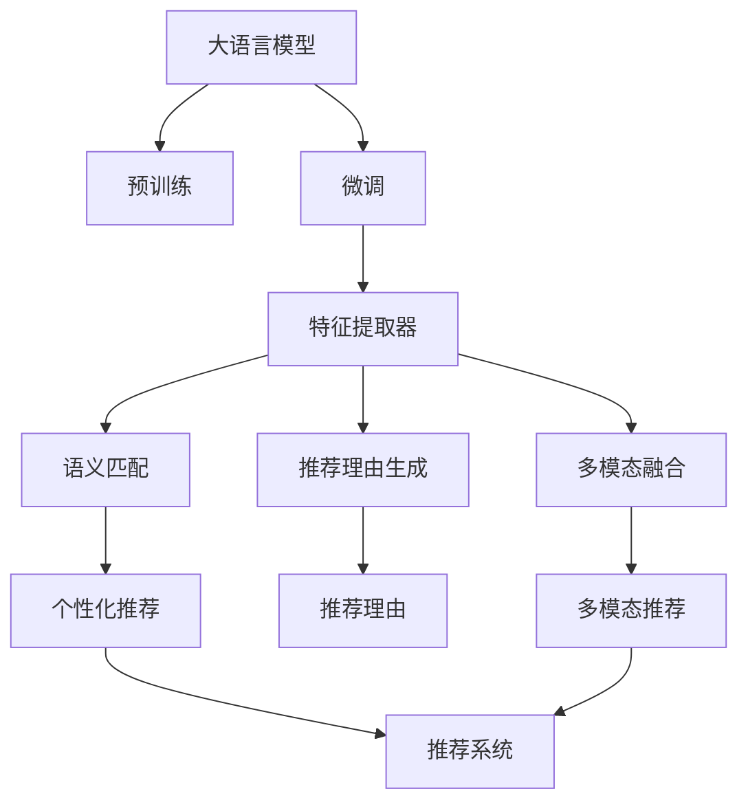

                 

## 1. 背景介绍

### 1.1 问题由来
推荐系统是现代互联网应用中最为重要的一环，它通过为用户推荐其感兴趣的内容，极大提升了用户体验。传统推荐系统多采用协同过滤、基于内容的推荐等方法，但这些方法存在数据稀疏、可扩展性差、冷启动问题等局限。基于深度学习的推荐系统（如基于矩阵分解、神经网络等）虽在数据丰富场景中取得了不错的效果，但在个性化需求高、数据稀疏等场景中仍显不足。

近年来，大语言模型（Large Language Model, LLM）在自然语言处理领域取得了巨大突破，而其强大的语义理解能力使其在推荐系统中得到了广泛应用。基于大语言模型的推荐系统，通过学习语言与推荐内容的语义关系，实现了语义推理推荐，显著提升了推荐的个性化程度和效果。

### 1.2 问题核心关键点
1. **大模型推荐框架**：大语言模型在推荐系统中主要应用于特征抽取、语义匹配、生成推荐理由等环节。以BERT、GPT等预训练语言模型作为特征提取器，通过微调或接口适配，可以高效提取文本数据的语义信息。

2. **特征表示与匹配**：推荐系统通过学习用户与物品之间的语义相似度，实现推荐。语言模型可以提取更为丰富的特征，增强特征表示能力。

3. **推荐理由生成**：推荐理由生成是推荐系统的重要环节，大模型可生成基于语义推理的推荐理由，提升推荐的说服力。

4. **多模态融合**：大模型可以融合文本、图像、音频等多模态信息，丰富推荐内容，提升推荐效果。

5. **模型优化与调优**：大模型推荐系统需要针对具体应用场景进行调优，如优化训练损失、引入更多正则化、调整模型超参数等。

6. **推理与部署**：大模型推荐系统在推理时需要考虑计算资源和部署效率，通过模型剪枝、推理优化等技术提升系统效率。

## 2. 核心概念与联系

### 2.1 核心概念概述

为更好地理解大模型推荐系统的原理和优化方法，本节将介绍几个关键概念：

- **大语言模型(Large Language Model, LLM)**：以BERT、GPT等深度神经网络模型为代表的大规模预训练语言模型。通过在大规模无标签文本语料上进行预训练，学习通用的语言表示，具备强大的语言理解和生成能力。

- **预训练(Pre-training)**：指在大规模无标签文本语料上，通过自监督学习任务训练通用语言模型的过程。常见的预训练任务包括掩码语言模型、下一句预测等。

- **微调(Fine-tuning)**：指在预训练模型的基础上，使用下游任务的少量标注数据，通过有监督地训练优化模型在特定任务上的性能。

- **迁移学习(Transfer Learning)**：指将一个领域学习到的知识，迁移应用到另一个不同但相关的领域的学习范式。大模型的预训练-微调过程即是一种典型的迁移学习方式。

- **特征提取器**：大模型在推荐系统中主要用作特征提取器，通过输入推荐内容或用户数据，提取语义特征，用于特征匹配或生成推荐理由。

- **语义匹配**：通过学习推荐内容与用户语义之间的匹配关系，实现个性化推荐。

- **推荐理由生成**：基于大模型的语义理解能力，生成推荐理由，解释推荐决策。

- **多模态融合**：结合文本、图像、音频等多种数据源，提升推荐系统的效果。

- **模型优化与调优**：针对具体任务和数据特点进行模型超参数调整、损失函数优化等，提升模型效果。

- **推理与部署**：将模型封装为服务，优化推理速度和内存使用，确保高效部署。

这些概念之间的逻辑关系可以通过以下Mermaid流程图来展示：



这个流程图展示了从预训练大模型到推荐系统输出的全流程，展示了各个组件之间的紧密联系。

## 3. 核心算法原理 & 具体操作步骤
### 3.1 算法原理概述

大模型在推荐系统中的应用，主要基于特征提取和语义匹配两个核心步骤。其中，大模型的预训练过程为推荐系统提供了通用的语言表示，而微调过程则用于增强模型在特定推荐任务上的性能。

**3.1.1 特征提取**
大语言模型在推荐系统中的主要作用是特征提取，即通过输入推荐内容或用户数据，提取其语义特征。这一过程通常通过预训练语言模型来实现，如BERT、GPT等。

特征提取的具体流程如下：
1. 输入推荐内容和用户数据，通过大语言模型的预训练权重，计算出推荐内容的语义表示和用户的语义表示。
2. 使用余弦相似度、欧式距离等方法，计算推荐内容与用户语义表示之间的匹配度。
3. 将匹配度作为推荐分数，用于排序并推荐。

**3.1.2 语义匹配**
推荐系统的核心任务是通过匹配用户和物品的语义相似度，实现个性化推荐。这一过程通常通过微调大语言模型来实现，使其学习特定领域的语义关系。

语义匹配的具体流程如下：
1. 输入推荐内容和用户数据，通过微调后的语言模型，计算出推荐内容与用户语义表示之间的匹配度。
2. 使用损失函数，最小化推荐分数与真实标签之间的差距。
3. 通过优化算法，如Adam、SGD等，更新模型参数，提升匹配精度。

### 3.2 算法步骤详解

基于大语言模型的推荐系统一般包括以下几个关键步骤：

**Step 1: 准备预训练模型和数据集**
- 选择合适的预训练语言模型 $M_{\theta}$ 作为初始化参数，如 BERT、GPT等。
- 准备推荐任务的数据集，包括用户和推荐内容，划分为训练集、验证集和测试集。一般要求数据与预训练数据的分布不要差异过大。

**Step 2: 添加任务适配层**
- 根据推荐任务类型，在预训练模型顶层设计合适的输出层和损失函数。
- 对于推荐任务，通常使用softmax分类器输出推荐分数，并以交叉熵损失函数作为目标。
- 引入softmax和交叉熵函数：
  $$
  \text{softmax}(\vec{a})_j = \frac{e^{a_j}}{\sum_{k=1}^K e^{a_k}}
  $$
  $$
  \text{cross-entropy} = -\frac{1}{N} \sum_{i=1}^N \sum_{j=1}^K y_{ij} \log \text{softmax}(\vec{a}_i)_j
  $$

**Step 3: 设置微调超参数**
- 选择合适的优化算法及其参数，如 AdamW、SGD 等，设置学习率、批大小、迭代轮数等。
- 设置正则化技术及强度，包括权重衰减、Dropout、Early Stopping 等。
- 确定冻结预训练参数的策略，如仅微调顶层，或全部参数都参与微调。

**Step 4: 执行梯度训练**
- 将训练集数据分批次输入模型，前向传播计算损失函数。
- 反向传播计算参数梯度，根据设定的优化算法和学习率更新模型参数。
- 周期性在验证集上评估模型性能，根据性能指标决定是否触发 Early Stopping。
- 重复上述步骤直到满足预设的迭代轮数或 Early Stopping 条件。

**Step 5: 测试和部署**
- 在测试集上评估微调后模型 $M_{\hat{\theta}}$ 的性能，对比微调前后的精度提升。
- 使用微调后的模型对新样本进行推理预测，集成到实际的应用系统中。
- 持续收集新的数据，定期重新微调模型，以适应数据分布的变化。

以上是基于大语言模型的推荐系统的一般流程。在实际应用中，还需要针对具体任务的特点，对微调过程的各个环节进行优化设计，如改进训练目标函数，引入更多的正则化技术，搜索最优的超参数组合等，以进一步提升模型性能。

### 3.3 算法优缺点

大语言模型在推荐系统中的应用具有以下优点：
1. 特征表示能力强：通过预训练，模型具备强大的语义理解能力，能够提取更加丰富的特征。
2. 可解释性好：基于自然语言理解，推荐理由生成可解释性强，便于用户理解。
3. 模型泛化能力强：大模型在多个领域表现出色，可以通过微调快速适应新场景。
4. 数据适应性好：大模型对稀疏数据有较强的适应性，能够在数据稀疏场景下仍取得良好效果。

同时，该方法也存在一些局限性：
1. 计算资源消耗大：大模型通常参数量庞大，训练和推理需要高性能硬件支持。
2. 时间开销大：训练和推理时间较长，部署效率较低。
3. 微调过程复杂：需要合适的超参数调整，优化过程较为复杂。
4. 推荐效果受数据质量影响大：推荐效果高度依赖于训练数据的质量和数量。
5. 存在偏见：大模型可能存在性别、种族等偏见，需注意这些潜在的偏见问题。

尽管存在这些局限性，但大语言模型在推荐系统中的应用已经展现出巨大的潜力，未来相关研究将进一步优化其应用过程，提高推荐效果，降低计算成本。

### 3.4 算法应用领域

大语言模型在推荐系统中得到了广泛的应用，覆盖了推荐内容生成、推荐理由生成、多模态推荐等多个方面，具体应用如下：

**内容生成**：通过学习用户历史行为和兴趣，生成个性化的推荐内容。

**理由生成**：通过微调大语言模型，生成推荐理由，解释推荐决策，增强推荐的说服力。

**多模态推荐**：结合图像、音频、视频等多种数据源，提升推荐效果。

**推荐引擎优化**：通过微调大语言模型，优化推荐引擎的匹配算法和推荐策略。

**知识图谱融合**：将知识图谱与语言模型结合，生成基于知识的推荐。

这些应用场景展示了大语言模型在推荐系统中的广泛应用和巨大潜力。随着技术的发展，相信大语言模型将在推荐系统中发挥更加重要的作用。

## 4. 数学模型和公式 & 详细讲解
### 4.1 数学模型构建

本节将使用数学语言对基于大语言模型的推荐系统进行更加严格的刻画。

记预训练语言模型为 $M_{\theta}$，输入为推荐内容和用户数据，输出为推荐分数，目标为最大化交叉熵损失函数：

$$
\mathcal{L}(\theta) = -\frac{1}{N} \sum_{i=1}^N \sum_{j=1}^K y_{ij} \log \text{softmax}(\vec{a}_i)_j
$$

其中，$\vec{a}_i$ 为推荐内容与用户数据的语义表示向量，$y_{ij}$ 为推荐内容 $j$ 是否被用户 $i$ 选中的一维向量，$K$ 为推荐内容数量。

### 4.2 公式推导过程

以下是详细推导：
1. 输入推荐内容和用户数据，通过预训练语言模型计算出语义表示向量：
  $$
  \vec{a} = M_{\theta}(x_u, x_i)
  $$
  其中 $x_u$ 为用户数据，$x_i$ 为推荐内容。
2. 使用softmax函数将语义表示向量转化为推荐分数：
  $$
  \text{softmax}(\vec{a})_j = \frac{e^{a_j}}{\sum_{k=1}^K e^{a_k}}
  $$
3. 计算交叉熵损失函数：
  $$
  \mathcal{L}(\theta) = -\frac{1}{N} \sum_{i=1}^N \sum_{j=1}^K y_{ij} \log \text{softmax}(\vec{a}_i)_j
  $$

### 4.3 案例分析与讲解

以基于BERT的推荐系统为例，分析其特征提取和语义匹配过程。

**特征提取**：
1. 输入用户数据 $x_u$ 和推荐内容 $x_i$。
2. 使用BERT模型计算出用户和推荐内容的语义表示向量：
  $$
  \vec{a_u}, \vec{a_i} = \text{BERT}(x_u, x_i)
  $$
3. 计算推荐分数：
  $$
  \text{scores}_{uj} = \vec{a_u} \cdot \vec{a_i}_j
  $$
  其中 $\cdot$ 表示向量点积。

**语义匹配**：
1. 将推荐分数作为模型输出，用于排序推荐。
2. 使用softmax函数将推荐分数转化为概率分布：
  $$
  \text{prob}(uj) = \text{softmax}(\vec{a_u} \cdot \vec{a_i})
  $$
3. 使用交叉熵损失函数，最小化模型预测与真实标签之间的差距：
  $$
  \mathcal{L}(\theta) = -\frac{1}{N} \sum_{i=1}^N \sum_{j=1}^K y_{ij} \log \text{softmax}(\vec{a}_i)_j
  $$

## 5. 项目实践：代码实例和详细解释说明
### 5.1 开发环境搭建

在进行推荐系统开发前，我们需要准备好开发环境。以下是使用Python进行PyTorch开发的环境配置流程：

1. 安装Anaconda：从官网下载并安装Anaconda，用于创建独立的Python环境。

2. 创建并激活虚拟环境：
  ```bash
  conda create -n pytorch-env python=3.8 
  conda activate pytorch-env
  ```

3. 安装PyTorch：根据CUDA版本，从官网获取对应的安装命令。例如：
  ```bash
  conda install pytorch torchvision torchaudio cudatoolkit=11.1 -c pytorch -c conda-forge
  ```

4. 安装Transformers库：
  ```bash
  pip install transformers
  ```

5. 安装各类工具包：
  ```bash
  pip install numpy pandas scikit-learn matplotlib tqdm jupyter notebook ipython
  ```

完成上述步骤后，即可在`pytorch-env`环境中开始推荐系统开发。

### 5.2 源代码详细实现

下面我们以基于BERT的推荐系统为例，给出使用Transformers库进行微调的PyTorch代码实现。

首先，定义推荐任务的数据处理函数：

```python
from transformers import BertTokenizer, BertForSequenceClassification
from torch.utils.data import Dataset
import torch

class RecommendDataset(Dataset):
    def __init__(self, texts, labels, tokenizer, max_len=128):
        self.texts = texts
        self.labels = labels
        self.tokenizer = tokenizer
        self.max_len = max_len
        
    def __len__(self):
        return len(self.texts)
    
    def __getitem__(self, item):
        text = self.texts[item]
        label = self.labels[item]
        
        encoding = self.tokenizer(text, return_tensors='pt', max_length=self.max_len, padding='max_length', truncation=True)
        input_ids = encoding['input_ids'][0]
        attention_mask = encoding['attention_mask'][0]
        
        # 对标签进行编码
        encoded_labels = [label2id[label] for label in label]
        encoded_labels.extend([label2id['O']] * (self.max_len - len(encoded_labels)))
        labels = torch.tensor(encoded_labels, dtype=torch.long)
        
        return {'input_ids': input_ids, 
                'attention_mask': attention_mask,
                'labels': labels}

# 标签与id的映射
label2id = {'O': 0, 'B': 1, 'I': 2}
id2label = {v: k for k, v in label2id.items()}

# 创建dataset
tokenizer = BertTokenizer.from_pretrained('bert-base-cased')

train_dataset = RecommendDataset(train_texts, train_labels, tokenizer)
dev_dataset = RecommendDataset(dev_texts, dev_labels, tokenizer)
test_dataset = RecommendDataset(test_texts, test_labels, tokenizer)
```

然后，定义模型和优化器：

```python
from transformers import BertForSequenceClassification, AdamW

model = BertForSequenceClassification.from_pretrained('bert-base-cased', num_labels=len(label2id))

optimizer = AdamW(model.parameters(), lr=2e-5)
```

接着，定义训练和评估函数：

```python
from torch.utils.data import DataLoader
from tqdm import tqdm
from sklearn.metrics import classification_report

device = torch.device('cuda') if torch.cuda.is_available() else torch.device('cpu')
model.to(device)

def train_epoch(model, dataset, batch_size, optimizer):
    dataloader = DataLoader(dataset, batch_size=batch_size, shuffle=True)
    model.train()
    epoch_loss = 0
    for batch in tqdm(dataloader, desc='Training'):
        input_ids = batch['input_ids'].to(device)
        attention_mask = batch['attention_mask'].to(device)
        labels = batch['labels'].to(device)
        model.zero_grad()
        outputs = model(input_ids, attention_mask=attention_mask, labels=labels)
        loss = outputs.loss
        epoch_loss += loss.item()
        loss.backward()
        optimizer.step()
    return epoch_loss / len(dataloader)

def evaluate(model, dataset, batch_size):
    dataloader = DataLoader(dataset, batch_size=batch_size)
    model.eval()
    preds, labels = [], []
    with torch.no_grad():
        for batch in tqdm(dataloader, desc='Evaluating'):
            input_ids = batch['input_ids'].to(device)
            attention_mask = batch['attention_mask'].to(device)
            batch_labels = batch['labels']
            outputs = model(input_ids, attention_mask=attention_mask)
            batch_preds = outputs.logits.argmax(dim=2).to('cpu').tolist()
            batch_labels = batch_labels.to('cpu').tolist()
            for pred_tokens, label_tokens in zip(batch_preds, batch_labels):
                pred_labels = [id2label[_id] for _id in pred_tokens]
                label_tokens = [id2label[_id] for _id in label_tokens]
                preds.append(pred_labels[:len(label_tokens)])
                labels.append(label_tokens)
                
    print(classification_report(labels, preds))
```

最后，启动训练流程并在测试集上评估：

```python
epochs = 5
batch_size = 16

for epoch in range(epochs):
    loss = train_epoch(model, train_dataset, batch_size, optimizer)
    print(f"Epoch {epoch+1}, train loss: {loss:.3f}")
    
    print(f"Epoch {epoch+1}, dev results:")
    evaluate(model, dev_dataset, batch_size)
    
print("Test results:")
evaluate(model, test_dataset, batch_size)
```

以上就是使用PyTorch对BERT进行推荐系统微调的完整代码实现。可以看到，得益于Transformers库的强大封装，我们可以用相对简洁的代码完成BERT模型的加载和微调。

### 5.3 代码解读与分析

让我们再详细解读一下关键代码的实现细节：

**RecommendDataset类**：
- `__init__`方法：初始化文本、标签、分词器等关键组件。
- `__len__`方法：返回数据集的样本数量。
- `__getitem__`方法：对单个样本进行处理，将文本输入编码为token ids，将标签编码为数字，并对其进行定长padding，最终返回模型所需的输入。

**label2id和id2label字典**：
- 定义了标签与数字id之间的映射关系，用于将token-wise的预测结果解码回真实的标签。

**训练和评估函数**：
- 使用PyTorch的DataLoader对数据集进行批次化加载，供模型训练和推理使用。
- 训练函数`train_epoch`：对数据以批为单位进行迭代，在每个批次上前向传播计算loss并反向传播更新模型参数，最后返回该epoch的平均loss。
- 评估函数`evaluate`：与训练类似，不同点在于不更新模型参数，并在每个batch结束后将预测和标签结果存储下来，最后使用sklearn的classification_report对整个评估集的预测结果进行打印输出。

**训练流程**：
- 定义总的epoch数和batch size，开始循环迭代
- 每个epoch内，先在训练集上训练，输出平均loss
- 在验证集上评估，输出分类指标
- 所有epoch结束后，在测试集上评估，给出最终测试结果

可以看到，PyTorch配合Transformers库使得BERT微调的代码实现变得简洁高效。开发者可以将更多精力放在数据处理、模型改进等高层逻辑上，而不必过多关注底层的实现细节。

当然，工业级的系统实现还需考虑更多因素，如模型的保存和部署、超参数的自动搜索、更灵活的任务适配层等。但核心的微调范式基本与此类似。

## 6. 实际应用场景
### 6.1 智能客服系统

基于大语言模型的推荐系统，可以应用于智能客服系统的构建。传统客服往往需要配备大量人力，高峰期响应缓慢，且一致性和专业性难以保证。而使用推荐系统推荐相关问题解决方案，可以显著提升客服效率，提升用户满意度。

在技术实现上，可以收集企业内部的历史客服对话记录，将问题和最佳答复构建成推荐样本，使用微调后的推荐系统对用户输入的问题进行推荐，帮助用户快速找到解决方案。同时，还可以通过实时监测用户反馈，不断优化推荐模型。

### 6.2 个性化推荐系统

当前的推荐系统往往只依赖用户的历史行为数据进行物品推荐，无法深入理解用户的真实兴趣偏好。基于大语言模型推荐系统可以更好地挖掘用户行为背后的语义信息，从而提供更精准、多样的推荐内容。

在实践中，可以收集用户浏览、点击、评论、分享等行为数据，提取和用户交互的物品标题、描述、标签等文本内容。将文本内容作为模型输入，用户的后续行为（如是否点击、购买等）作为监督信号，在此基础上微调预训练语言模型。微调后的模型能够从文本内容中准确把握用户的兴趣点。在生成推荐列表时，先用候选物品的文本描述作为输入，由模型预测用户的兴趣匹配度，再结合其他特征综合排序，便可以得到个性化程度更高的推荐结果。

### 6.3 社交网络内容推荐

社交网络平台通过推荐系统向用户推荐内容，增强用户粘性，提高平台活跃度。传统的推荐系统多基于用户历史行为进行推荐，缺乏对内容的理解。而使用大语言模型推荐系统，可以更深入地理解推荐内容，提升推荐的准确性和多样性。

具体而言，可以收集用户在平台上的互动数据，包括点赞、评论、分享等行为，提取相关文本内容。使用微调后的推荐系统对推荐内容进行语义匹配，生成推荐理由，向用户推荐相关内容。同时，可以通过用户反馈对推荐系统进行优化，不断提升推荐效果。

### 6.4 未来应用展望

随着大语言模型推荐技术的发展，其在推荐系统中的应用将越来越广泛。未来的推荐系统将更多地结合用户语义、物品语义等多方面信息，实现更加精准的推荐。

在智慧医疗领域，推荐系统可应用于医生推荐、药品推荐等方面，帮助医生制定更加合理的治疗方案，推荐合适的药品。

在智能教育领域，推荐系统可应用于教材推荐、课后习题推荐等方面，提升学习效率。

在智能交通领域，推荐系统可应用于路线推荐、安全警示等方面，提高出行安全性。

此外，在金融、娱乐、能源等众多领域，基于大语言模型的推荐系统也将不断涌现，为各行各业带来新的应用场景和机遇。相信随着技术的不断成熟，大语言模型推荐系统必将在更多领域得到应用，提升各行业的智能化水平。

## 7. 工具和资源推荐
### 7.1 学习资源推荐

为了帮助开发者系统掌握大语言模型推荐技术的理论基础和实践技巧，这里推荐一些优质的学习资源：

1. 《推荐系统实战》书籍：全面介绍了推荐系统的基本概念、算法实现和工程实践，适合对推荐系统感兴趣的开发者。

2. 《深度学习推荐系统：理论、算法与应用》书籍：系统讲解了深度学习在推荐系统中的应用，包括基于内容的推荐、协同过滤推荐等。

3. 《自然语言处理与推荐系统》课程：将自然语言处理技术与推荐系统相结合，介绍了基于大语言模型的推荐系统。

4. Kaggle推荐系统竞赛：通过实际竞赛项目，理解推荐系统在实际应用中的挑战和解决方案。

5. Coursera《推荐系统》课程：由斯坦福大学教授主讲，详细讲解了推荐系统的原理和实现。

通过对这些资源的学习实践，相信你一定能够快速掌握大语言模型推荐技术的精髓，并用于解决实际的推荐问题。

### 7.2 开发工具推荐

高效的开发离不开优秀的工具支持。以下是几款用于大语言模型推荐系统开发的常用工具：

1. PyTorch：基于Python的开源深度学习框架，灵活动态的计算图，适合快速迭代研究。大部分预训练语言模型都有PyTorch版本的实现。

2. TensorFlow：由Google主导开发的开源深度学习框架，生产部署方便，适合大规模工程应用。同样有丰富的预训练语言模型资源。

3. Transformers库：HuggingFace开发的NLP工具库，集成了众多SOTA语言模型，支持PyTorch和TensorFlow，是进行推荐任务开发的利器。

4. Weights & Biases：模型训练的实验跟踪工具，可以记录和可视化模型训练过程中的各项指标，方便对比和调优。与主流深度学习框架无缝集成。

5. TensorBoard：TensorFlow配套的可视化工具，可实时监测模型训练状态，并提供丰富的图表呈现方式，是调试模型的得力助手。

6. Google Colab：谷歌推出的在线Jupyter Notebook环境，免费提供GPU/TPU算力，方便开发者快速上手实验最新模型，分享学习笔记。

合理利用这些工具，可以显著提升大语言模型推荐任务的开发效率，加快创新迭代的步伐。

### 7.3 相关论文推荐

大语言模型推荐技术的发展源于学界的持续研究。以下是几篇奠基性的相关论文，推荐阅读：

1. Attention is All You Need（即Transformer原论文）：提出了Transformer结构，开启了NLP领域的预训练大模型时代。

2. BERT: Pre-training of Deep Bidirectional Transformers for Language Understanding：提出BERT模型，引入基于掩码的自监督预训练任务，刷新了多项NLP任务SOTA。

3. Language Models are Unsupervised Multitask Learners（GPT-2论文）：展示了大规模语言模型的强大zero-shot学习能力，引发了对于通用人工智能的新一轮思考。

4. Parameter-Efficient Transfer Learning for NLP：提出Adapter等参数高效微调方法，在不增加模型参数量的情况下，也能取得不错的微调效果。

5. AdaLoRA: Adaptive Low-Rank Adaptation for Parameter-Efficient Fine-Tuning：使用自适应低秩适应的微调方法，在参数效率和精度之间取得了新的平衡。

这些论文代表了大语言模型推荐技术的发展脉络。通过学习这些前沿成果，可以帮助研究者把握学科前进方向，激发更多的创新灵感。

## 8. 总结：未来发展趋势与挑战
### 8.1 总结

本文对基于大语言模型的推荐系统进行了全面系统的介绍。首先阐述了推荐系统和大语言模型的研究背景和意义，明确了推荐系统和大语言模型相结合的优势。其次，从原理到实践，详细讲解了推荐系统在大语言模型上的实现方法，给出了推荐系统开发的完整代码实例。同时，本文还广泛探讨了推荐系统在大语言模型中的应用场景，展示了其巨大的潜力和广阔的应用前景。此外，本文精选了推荐系统的各类学习资源，力求为开发者提供全方位的技术指引。

通过本文的系统梳理，可以看到，基于大语言模型的推荐系统正在成为推荐系统的重要范式，极大地拓展了推荐系统的应用边界，提升了推荐的个性化程度和效果。未来，伴随大语言模型推荐技术的发展，推荐系统必将在更多领域得到应用，提升各行业的智能化水平。

### 8.2 未来发展趋势

展望未来，大语言模型推荐技术将呈现以下几个发展趋势：

1. 模型规模持续增大。随着算力成本的下降和数据规模的扩张，预训练语言模型的参数量还将持续增长。超大规模语言模型蕴含的丰富语言知识，有望支撑更加复杂多变的推荐任务。

2. 推荐效果更加个性化。未来推荐系统将更多地结合用户语义、物品语义等多方面信息，实现更加精准的推荐。

3. 多模态融合更加深入。推荐系统将更多地融合视觉、音频、文本等多模态信息，提升推荐效果。

4. 推荐系统更多样化。未来推荐系统将不仅限于商品推荐，还可能应用于知识推荐、服务推荐等领域。

5. 推荐理由生成更加丰富。未来推荐系统将更多地生成个性化的推荐理由，提升推荐的说服力。

6. 推荐系统智能化。未来推荐系统将更多地融入人工智能技术，实现更加智能化的推荐。

以上趋势凸显了大语言模型推荐技术的广阔前景。这些方向的探索发展，必将进一步提升推荐系统的性能和应用范围，为各行业带来新的应用场景和机遇。

### 8.3 面临的挑战

尽管大语言模型推荐技术已经取得了瞩目成就，但在迈向更加智能化、普适化应用的过程中，它仍面临着诸多挑战：

1. 计算资源消耗大。大语言模型通常参数量庞大，训练和推理需要高性能硬件支持。

2. 时间开销大。训练和推理时间较长，部署效率较低。

3. 推荐效果受数据质量影响大。推荐效果高度依赖于训练数据的质量和数量。

4. 存在偏见。大模型可能存在性别、种族等偏见，需注意这些潜在的偏见问题。

5. 可解释性不足。推荐系统的决策过程缺乏可解释性，难以对其推理逻辑进行分析和调试。

尽管存在这些局限性，但大语言模型在推荐系统中的应用已经展现出巨大的潜力，未来相关研究将进一步优化其应用过程，提高推荐效果，降低计算成本。

### 8.4 研究展望

面对大语言模型推荐所面临的挑战，未来的研究需要在以下几个方面寻求新的突破：

1. 探索无监督和半监督推荐方法。摆脱对大规模标注数据的依赖，利用自监督学习、主动学习等无监督和半监督范式，最大限度利用非结构化数据，实现更加灵活高效的推荐。

2. 研究参数高效和计算高效的推荐范式。开发更加参数高效的推荐方法，在固定大部分预训练参数的同时，只更新极少量的任务相关参数。同时优化推荐模型的计算图，减少前向传播和反向传播的资源消耗，实现更加轻量级、实时性的部署。

3. 引入更多先验知识。将符号化的先验知识，如知识图谱、逻辑规则等，与神经网络模型进行巧妙融合，引导推荐过程学习更准确、合理的语义表示。

4. 结合因果分析和博弈论工具。将因果分析方法引入推荐系统，识别出推荐决策的关键特征，增强推荐的说服力。借助博弈论工具刻画人机交互过程，主动探索并规避推荐的脆弱点，提高系统稳定性。

5. 纳入伦理道德约束。在推荐模型训练目标中引入伦理导向的评估指标，过滤和惩罚有偏见、有害的输出倾向。同时加强人工干预和审核，建立推荐模型的监管机制，确保推荐内容的安全性。

这些研究方向的探索，必将引领大语言模型推荐技术迈向更高的台阶，为构建智能、安全、可控的推荐系统铺平道路。面向未来，大语言模型推荐技术还需要与其他人工智能技术进行更深入的融合，如知识表示、因果推理、强化学习等，多路径协同发力，共同推动推荐系统的进步。

## 9. 附录：常见问题与解答

**Q1：推荐系统如何使用大语言模型进行特征提取？**

A: 大语言模型在推荐系统中主要用作特征提取器，通过输入推荐内容或用户数据，提取语义特征。具体步骤如下：
1. 输入推荐内容和用户数据，通过大语言模型的预训练权重，计算出推荐内容的语义表示和用户的语义表示。
2. 使用余弦相似度、欧式距离等方法，计算推荐内容与用户语义表示之间的匹配度。
3. 将匹配度作为推荐分数，用于排序并推荐。

**Q2：推荐系统的训练目标函数是什么？**

A: 推荐系统的训练目标函数通常为交叉熵损失函数，即最小化推荐分数与真实标签之间的差距。对于二分类推荐任务，目标函数为：
$$
\mathcal{L}(\theta) = -\frac{1}{N} \sum_{i=1}^N \sum_{j=1}^K y_{ij} \log \text{softmax}(\vec{a}_i)_j
$$
其中 $\vec{a}_i$ 为推荐内容与用户数据的语义表示向量，$y_{ij}$ 为推荐内容 $j$ 是否被用户 $i$ 选中的一维向量，$K$ 为推荐内容数量。

**Q3：推荐系统的评估指标有哪些？**

A: 推荐系统的评估指标包括但不限于：
1. 准确率（Accuracy）：预测正确的推荐数量占总推荐数量的比例。
2. 召回率（Recall）：预测正确的推荐数量占实际正确推荐的数量的比例。
3. 精确率（Precision）：预测正确的推荐数量占推荐总数的比例。
4. F1值（F1 Score）：精确率和召回率的调和平均。
5. ROC-AUC（Receiver Operating Characteristic-Area Under Curve）：ROC曲线下的面积，用于评估二分类推荐系统的性能。
6. NDCG（Normalized Discounted Cumulative Gain）：用于评估推荐系统的排序效果。

**Q4：推荐系统如何进行推荐理由生成？**

A: 推荐理由生成是推荐系统的重要环节，用于解释推荐决策。大语言模型可以通过微调生成推荐理由，具体步骤如下：
1. 输入推荐内容和用户数据，通过微调后的语言模型，计算出推荐内容与用户语义表示之间的匹配度。
2. 将匹配度作为模型输出，用于排序推荐。
3. 使用softmax函数将匹配度转化为概率分布：
  $$
  \text{prob}(uj) = \text{softmax}(\vec{a}_u \cdot \vec{a}_i)
  $$
4. 生成推荐理由，解释推荐决策：
  $$
  \text{reason}(uj) = \text{reason\_model}(\vec{a}_u, \vec{a}_i)
  $$
其中 $\text{reason\_model}$ 为推荐理由生成模型。

**Q5：推荐系统如何应对冷启动问题？**

A: 冷启动问题是推荐系统常见的挑战之一，指新用户或新物品在推荐系统中缺乏足够的历史数据。大语言模型可以通过以下方式应对冷启动问题：
1. 使用协同过滤算法，根据用户历史行为推荐新物品。
2. 使用基于内容的推荐算法，根据物品特征推荐新用户。
3. 使用混合推荐算法，结合多种推荐方法，提升推荐效果。

**Q6：推荐系统如何处理长尾物品？**

A: 长尾物品指数量众多但分布稀疏的物品，在推荐系统中难以获得足够的曝光率。大语言模型可以通过以下方式处理长尾物品：
1. 使用增量学习算法，不断更新推荐模型，覆盖更多长尾物品。
2. 使用负采样技术，减少训练集规模，提升模型训练效率。
3. 使用多臂赌博机算法，优化推荐策略，提升长尾物品的推荐效果。

通过以上技术手段，大语言模型推荐系统可以在推荐长尾物品时取得更好的效果。

---

作者：禅与计算机程序设计艺术 / Zen and the Art of Computer Programming

