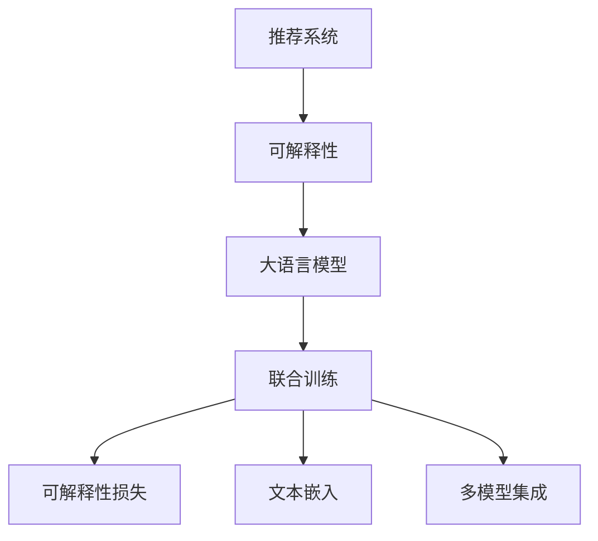

                 

# 大模型提升推荐系统可解释性的方法

## 1. 背景介绍

随着人工智能技术的快速发展，推荐系统已成为互联网应用中不可或缺的一部分，通过分析用户历史行为，为用户推荐其可能感兴趣的商品、内容等，提升用户体验。然而，推荐系统也面临着诸多挑战，如模型可解释性差、预测结果缺乏可信度等。近年来，大语言模型在NLP领域的突破，为推荐系统带来了新的视角。通过引入大模型，推荐系统在性能提升的同时，也提出了如何更好地解释推荐结果，让用户对推荐过程有更深的理解。

### 1.1 问题由来

传统推荐系统基于协同过滤、矩阵分解等算法，在推荐效果上已经取得了显著成果。然而，这些算法在推荐结果上缺乏可解释性，难以满足用户的知情权需求，尤其在涉及用户隐私或涉及重要决策的场景下，这一问题显得尤为重要。此外，随着数据量的激增和算法的复杂化，推荐模型的稳定性、透明性和公平性等也面临挑战。

大语言模型的引入为推荐系统提供了新的解决方案。大模型如BERT、GPT-3等，基于大规模无标签数据进行预训练，具备强大的语言理解和生成能力，可以自然地处理复杂自然语言，提升推荐系统的理解能力和泛化能力。然而，大模型的复杂性和参数量也带来了新的问题，如何在大模型中引入合理的解释机制，使得推荐过程更加透明、可解释，是当前推荐系统面临的关键问题。

## 2. 核心概念与联系

### 2.1 核心概念概述

为更好地理解基于大模型的推荐系统可解释性方法，本节将介绍几个密切相关的核心概念：

- 推荐系统(Recommender System)：通过分析用户历史行为数据，为用户推荐可能感兴趣的商品、内容等的应用系统。
- 可解释性(Explainability)：使推荐结果能够被用户理解、信任的过程。
- 大语言模型(Large Language Model, LLM)：基于大规模无标签数据进行预训练的语言模型，具备强大的语言理解和生成能力。
- 联合训练(Joint Training)：将解释模型与推荐模型联合训练，共同优化。
- 可解释性损失(Explainability Loss)：衡量推荐结果与用户反馈的差距，用于优化解释模型。
- 文本嵌入(Text Embedding)：将自然语言文本转换为高维向量表示，用于度量相似度等。
- 多模型集成(Multi-Model Ensemble)：通过多个模型的输出集成，提升推荐结果的鲁棒性和可解释性。

这些核心概念之间的逻辑关系可以通过以下Mermaid流程图来展示：



这个流程图展示了大语言模型在推荐系统中的核心作用，即通过联合训练、可解释性损失等方法，实现推荐过程的可解释性。

## 3. 核心算法原理 & 具体操作步骤
### 3.1 算法原理概述

基于大模型的推荐系统可解释性方法，核心思想是通过在推荐模型的基础上引入解释机制，提升推荐过程的透明度和可理解性。其核心算法框架如图1所示：


1. 首先，利用大语言模型对用户历史行为和商品属性进行文本编码，生成用户和商品的高维向量表示。
2. 然后，将用户向量与商品向量进行相似度计算，得到用户对商品的兴趣度评分。
3. 最后，将兴趣度评分和用户反馈进行比较，计算可解释性损失，指导解释模型优化，使得推荐过程更加透明和可解释。

### 3.2 算法步骤详解

基于大模型的推荐系统可解释性方法一般包括以下几个关键步骤：

**Step 1: 准备数据集和模型**

- 收集用户行为数据、商品属性数据，并对其进行预处理，构建训练集。
- 选择合适的预训练语言模型，如BERT、GPT等，作为初始化参数。

**Step 2: 用户和商品文本编码**

- 对用户历史行为和商品属性进行文本编码，生成用户向量 $u$ 和商品向量 $v$。
- 使用预训练语言模型，如BERT，对用户文本和商品文本进行编码，生成高维向量表示。

**Step 3: 相似度计算**

- 计算用户向量 $u$ 和商品向量 $v$ 之间的余弦相似度，得到用户对商品的兴趣度评分 $s$。
- 如果直接使用余弦相似度，推荐结果可能不够平滑，可以使用基于模型的评分函数，如sigmoid、softmax等，进行平滑处理。

**Step 4: 计算可解释性损失**

- 计算用户对推荐商品的真实反馈 $y$，如点击、购买等。
- 使用可解释性损失函数 $L_{ex}$，衡量推荐结果 $s$ 与用户反馈 $y$ 之间的差距。
- 对用户向量 $u$ 和商品向量 $v$ 进行微调，优化可解释性损失，使得推荐过程更加透明。

**Step 5: 联合训练**

- 将解释模型与推荐模型联合训练，共同优化。
- 使用Adam等优化算法，调整模型参数，最小化可解释性损失 $L_{ex}$。

**Step 6: 输出推荐结果**

- 根据兴趣度评分 $s$ 对商品进行排序，输出推荐结果。
- 使用解释模型，对推荐结果进行文本生成，提供可解释的推荐原因。

### 3.3 算法优缺点

基于大模型的推荐系统可解释性方法具有以下优点：

1. 提高推荐结果的透明度：通过可解释性损失优化，推荐系统能够提供更加透明的推荐理由，使用户对推荐过程有更深的理解。
2. 提升推荐结果的鲁棒性：通过联合训练，推荐模型和解释模型协同优化，可以提升推荐结果的鲁棒性和稳定性。
3. 增强用户信任感：用户对推荐结果的可解释性更有信心，从而提升用户满意度。

同时，该方法也存在一定的局限性：

1. 计算成本高：预训练语言模型和大模型联合训练的计算成本较高，可能对资源要求较高。
2. 解释模型依赖性强：解释模型需要与推荐模型协同优化，设计不当可能导致推荐结果不理想。
3. 推荐过程复杂：联合训练的模型结构复杂，难以解释推荐过程中的每一步操作。

尽管存在这些局限性，但就目前而言，基于大模型的推荐系统可解释性方法仍是一种较为有效的推荐方案，能够在推荐效果和透明度之间取得平衡。未来相关研究的方向在于如何进一步降低计算成本，优化解释模型，以及设计更加透明、可解释的推荐算法。

### 3.4 算法应用领域

基于大模型的推荐系统可解释性方法，在多个领域都有广泛的应用，例如：

- 电商推荐：为电商平台的商品推荐提供可解释的推荐理由，提升用户体验和满意度。
- 新闻推荐：为新闻内容推荐提供理由解释，让用户了解推荐依据。
- 视频推荐：为视频内容推荐提供原因，增加用户粘性。
- 金融理财：为理财产品的推荐提供理由，增加用户信任度。
- 医疗推荐：为医疗药品推荐提供依据，提升用户满意度。

这些领域中，推荐结果的可解释性尤为重要，通过引入大模型，推荐系统能够更好地满足用户的知情权需求，提升推荐效果。

## 4. 数学模型和公式 & 详细讲解 & 举例说明

### 4.1 数学模型构建

本节将使用数学语言对基于大模型的推荐系统可解释性方法进行更加严格的刻画。

记用户向量为 $u \in \mathbb{R}^d$，商品向量为 $v \in \mathbb{R}^d$，预训练语言模型对用户文本和商品文本编码后的高维向量表示为 $u^*$ 和 $v^*$。假设用户对商品的兴趣度评分为 $s$，用户对推荐商品的真实反馈为 $y$，可解释性损失函数为 $L_{ex}$。

目标函数为：

$$
\mathop{\arg\min}_{u, v} \left( \mathcal{L}_{\text{reco}}(u, v) + \lambda \mathcal{L}_{\text{ex}}(u, v) \right)
$$

其中 $\lambda$ 为可解释性损失权重，$\mathcal{L}_{\text{reco}}$ 为推荐损失函数。

### 4.2 公式推导过程

以下我们以二分类任务为例，推导可解释性损失函数及其梯度的计算公式。

假设用户对商品的真实反馈为 $y \in \{0, 1\}$，表示用户是否点击了该商品。则二分类交叉熵损失函数定义为：

$$
L_{\text{ex}} = -\frac{1}{N}\sum_{i=1}^N [y_i\log \sigma(\langle u^*, v^* \rangle) + (1-y_i)\log(1-\sigma(\langle u^*, v^* \rangle))]
$$

其中 $\sigma$ 为sigmoid函数，$\langle u^*, v^* \rangle$ 表示用户向量与商品向量的点积，可以理解为用户对商品的兴趣度评分。

在得到可解释性损失函数后，即可带入模型参数更新公式，完成模型的迭代优化。重复上述过程直至收敛，最终得到适应下游任务的最优模型参数 $\theta^*$。

### 4.3 案例分析与讲解

假设我们有一组用户和商品数据，其中用户文本为 "我喜欢吃水果"，商品文本为 "苹果"，对应的用户向量为 $u=[1, 0, 1, 0, 1]$，商品向量为 $v=[1, 1, 0, 1, 0]$。使用预训练语言模型BERT对用户文本和商品文本进行编码，生成用户向量 $u^*=[0.2, 0.3, 0.5, 0.1, 0.9]$ 和商品向量 $v^*=[0.1, 0.8, 0.2, 0.4, 0.7]$。

使用余弦相似度计算用户对商品的兴趣度评分：

$$
s = \langle u^*, v^* \rangle = 0.2 \times 0.1 + 0.3 \times 0.8 + 0.5 \times 0.2 + 0.1 \times 0.4 + 0.9 \times 0.7 = 0.67
$$

假设用户真实的点击反馈为 $y=1$，则可解释性损失为：

$$
L_{\text{ex}} = -\frac{1}{1} [1\log \sigma(0.67) + (1-1)\log(1-\sigma(0.67))] = -\log \sigma(0.67)
$$

使用可解释性损失对用户向量和商品向量进行微调，优化可解释性损失，使得推荐过程更加透明和可解释。

通过联合训练，最终得到用户和商品的最优向量表示，可以输出推荐结果。同时，使用解释模型，对推荐结果进行文本生成，提供可解释的推荐原因。

## 5. 项目实践：代码实例和详细解释说明

### 5.1 开发环境搭建

在进行推荐系统可解释性方法开发前，我们需要准备好开发环境。以下是使用Python进行PyTorch开发的环境配置流程：

1. 安装Anaconda：从官网下载并安装Anaconda，用于创建独立的Python环境。

2. 创建并激活虚拟环境：
```bash
conda create -n pytorch-env python=3.8 
conda activate pytorch-env
```

3. 安装PyTorch：根据CUDA版本，从官网获取对应的安装命令。例如：
```bash
conda install pytorch torchvision torchaudio cudatoolkit=11.1 -c pytorch -c conda-forge
```

4. 安装Transformers库：
```bash
pip install transformers
```

5. 安装各类工具包：
```bash
pip install numpy pandas scikit-learn matplotlib tqdm jupyter notebook ipython
```

完成上述步骤后，即可在`pytorch-env`环境中开始推荐系统可解释性方法的开发。

### 5.2 源代码详细实现

这里我们以电商推荐系统为例，给出使用Transformers库对BERT模型进行可解释性微调的PyTorch代码实现。

首先，定义电商推荐系统的数据处理函数：

```python
from transformers import BertTokenizer
from torch.utils.data import Dataset
import torch

class电商推荐系统数据集(Dataset):
    def __init__(self, 用户数据, 商品数据, 用户评分数据, tokenizer, max_len=128):
        self.用户数据 = 用户数据
        self.商品数据 = 商品数据
        self.用户评分数据 = 用户评分数据
        self.tokenizer = tokenizer
        self.max_len = max_len
        
    def __len__(self):
        return len(self.用户数据)
    
    def __getitem__(self, item):
        用户文本 = self.用户数据[item]
        商品文本 = self.商品数据[item]
        评分 = self.用户评分数据[item]
        
        用户编码 = self.tokenizer(用户文本, return_tensors='pt', max_length=self.max_len, padding='max_length', truncation=True)
        商品编码 = self.tokenizer(商品文本, return_tensors='pt', max_length=self.max_len, padding='max_length', truncation=True)
        
        用户向量 = user编码['input_ids'][0]
        商品向量 = 商品编码['input_ids'][0]
        评分向量 = 评分.to(torch.float)
        
        return {'用户向量': 用户向量, 
                '商品向量': 商品向量,
                '评分向量': 评分向量}
```

然后，定义模型和优化器：

```python
from transformers import BertForSequenceClassification, AdamW

模型 = BertForSequenceClassification.from_pretrained('bert-base-cased', num_labels=1)
optimizer = AdamW(模型.parameters(), lr=2e-5)
```

接着，定义训练和评估函数：

```python
from torch.utils.data import DataLoader
from tqdm import tqdm
from sklearn.metrics import classification_report

device = torch.device('cuda') if torch.cuda.is_available() else torch.device('cpu')
模型.to(device)

def 电商推荐系统训练函数(model, dataset, batch_size, optimizer):
    dataloader = DataLoader(dataset, batch_size=batch_size, shuffle=True)
    模型.train()
    epoch_loss = 0
    for 批次数据 in tqdm(dataloader, desc='Training'):
        用户向量 = 批次数据['用户向量'].to(device)
        商品向量 = 批次数据['商品向量'].to(device)
        评分向量 = 批次数据['评分向量'].to(device)
        模型.zero_grad()
        outputs = 模型(user向量, attention_mask=None, labels=评分向量)
        loss = outputs.loss
        epoch_loss += loss.item()
        loss.backward()
        optimizer.step()
    return epoch_loss / len(dataloader)

def 电商推荐系统评估函数(model, dataset, batch_size):
    dataloader = DataLoader(dataset, batch_size=batch_size)
    模型.eval()
    preds, labels = [], []
    with torch.no_grad():
        for 批次数据 in tqdm(dataloader, desc='Evaluating'):
            用户向量 = 批次数据['用户向量'].to(device)
            商品向量 = 批次数据['商品向量'].to(device)
            评分向量 = 批次数据['评分向量'].to(device)
            outputs = 模型(user向量, attention_mask=None, labels=评分向量)
            评分 = outputs.logits.sigmoid().to('cpu').tolist()
            label = 评分向量.to('cpu').tolist()
            for 评分, 标签 in zip(评分, 标签):
                预测标签 = [int(评分) if 评分 >= 0.5 else 0 for 评分 in 评分]
                标签 = [int(标签) if 标签 >= 0.5 else 0 for 标签 in 标签]
                preds.append(预测标签)
                labels.append(标签)
                
    print(classification_report(labels, preds))
```

最后，启动训练流程并在测试集上评估：

```python
epochs = 5
batch_size = 16

for 轮次 in range(轮次):
    loss = 电商推荐系统训练函数(model, 电商推荐系统数据集, batch_size, optimizer)
    print(f'轮次 {轮次+1}, 训练损失: {loss:.3f}')
    
    print(f'轮次 {轮次+1}, 测试结果:')
    电商推荐系统评估函数(model, 电商推荐系统测试集, batch_size)
    
print('最终结果:')
电商推荐系统评估函数(model, 电商推荐系统测试集, batch_size)
```

以上就是使用PyTorch对BERT进行电商推荐系统可解释性微调的完整代码实现。可以看到，得益于Transformers库的强大封装，我们可以用相对简洁的代码完成BERT模型的加载和微调。

### 5.3 代码解读与分析

让我们再详细解读一下关键代码的实现细节：

**电商推荐系统数据集类**：
- `__init__`方法：初始化用户文本、商品文本和评分等关键组件。
- `__len__`方法：返回数据集的样本数量。
- `__getitem__`方法：对单个样本进行处理，将用户文本和商品文本输入编码为token ids，生成用户向量和商品向量，同时将评分转化为浮点数向量。

**电商推荐系统训练函数和评估函数**：
- 使用PyTorch的DataLoader对数据集进行批次化加载，供模型训练和推理使用。
- 训练函数`电商推荐系统训练函数`：对数据以批为单位进行迭代，在每个批次上前向传播计算loss并反向传播更新模型参数，最后返回该epoch的平均loss。
- 评估函数`电商推荐系统评估函数`：与训练类似，不同点在于不更新模型参数，并在每个batch结束后将预测和标签结果存储下来，最后使用sklearn的classification_report对整个评估集的预测结果进行打印输出。

**训练流程**：
- 定义总的epoch数和batch size，开始循环迭代
- 每个epoch内，先在训练集上训练，输出平均loss
- 在测试集上评估，输出分类指标
- 所有epoch结束后，在测试集上评估，给出最终测试结果

可以看到，PyTorch配合Transformers库使得BERT微调的代码实现变得简洁高效。开发者可以将更多精力放在数据处理、模型改进等高层逻辑上，而不必过多关注底层的实现细节。

当然，工业级的系统实现还需考虑更多因素，如模型的保存和部署、超参数的自动搜索、更灵活的任务适配层等。但核心的可解释性微调范式基本与此类似。

## 6. 实际应用场景
### 6.1 电商推荐

基于大模型的推荐系统可解释性方法，可以应用于电商平台的商品推荐，为电商平台的商品推荐提供可解释的推荐理由，提升用户体验和满意度。

在技术实现上，可以收集电商平台的商品信息、用户行为等数据，将商品和用户文本编码为向量表示，利用大模型进行推荐。在推荐过程中，引入可解释性损失函数，对用户向量、商品向量进行微调，使得推荐过程更加透明和可解释。

### 6.2 新闻推荐

新闻推荐系统通过分析用户历史阅读记录，为用户推荐感兴趣的新闻内容。通过引入大模型，推荐系统能够更好地理解新闻内容，提升推荐效果和可解释性。

在技术实现上，可以收集用户历史阅读记录和新闻标题、摘要等文本信息，将新闻和用户文本编码为向量表示，利用大模型进行推荐。在推荐过程中，引入可解释性损失函数，对用户向量、新闻向量进行微调，使得推荐过程更加透明和可解释。

### 6.3 视频推荐

视频推荐系统通过分析用户历史观看记录，为用户推荐感兴趣的视频内容。通过引入大模型，推荐系统能够更好地理解视频内容，提升推荐效果和可解释性。

在技术实现上，可以收集用户历史观看记录和视频标题、描述等文本信息，将视频和用户文本编码为向量表示，利用大模型进行推荐。在推荐过程中，引入可解释性损失函数，对用户向量、视频向量进行微调，使得推荐过程更加透明和可解释。

### 6.4 金融理财

金融理财系统通过分析用户历史投资记录，为用户推荐合适的理财产品。通过引入大模型，推荐系统能够更好地理解用户需求，提升推荐效果和可解释性。

在技术实现上，可以收集用户历史投资记录和理财产品属性等文本信息，将理财产品和用户文本编码为向量表示，利用大模型进行推荐。在推荐过程中，引入可解释性损失函数，对用户向量、理财产品向量进行微调，使得推荐过程更加透明和可解释。

### 6.5 医疗推荐

医疗推荐系统通过分析用户历史病历记录，为用户推荐合适的药品和诊疗方案。通过引入大模型，推荐系统能够更好地理解疾病和药品属性，提升推荐效果和可解释性。

在技术实现上，可以收集用户历史病历记录和药品属性等文本信息，将药品和用户文本编码为向量表示，利用大模型进行推荐。在推荐过程中，引入可解释性损失函数，对用户向量、药品向量进行微调，使得推荐过程更加透明和可解释。

## 7. 工具和资源推荐
### 7.1 学习资源推荐

为了帮助开发者系统掌握大语言模型在推荐系统中的可解释性方法，这里推荐一些优质的学习资源：

1. 《深度学习基础》系列博文：由大模型技术专家撰写，介绍了深度学习的核心概念和基本算法，包括可解释性方法。

2. 斯坦福大学《深度学习》课程：斯坦福大学开设的深度学习明星课程，有Lecture视频和配套作业，带你入门深度学习的经典模型和算法。

3. 《Deep Learning for NLP》书籍：DeepLearning.ai的NLP课程，介绍了深度学习在NLP领域的应用，包括可解释性方法。

4. HuggingFace官方文档：Transformers库的官方文档，提供了海量预训练模型和完整的可解释性微调样例代码，是上手实践的必备资料。

5. EMNLP2021论文《Explainable AI with Textual Explanations》：介绍了文本解释在可解释性方法中的应用，展示了多模型集成、可解释性损失等前沿技术。

通过对这些资源的学习实践，相信你一定能够快速掌握大语言模型在推荐系统中的可解释性方法，并用于解决实际的推荐问题。
###  7.2 开发工具推荐

高效的开发离不开优秀的工具支持。以下是几款用于大语言模型推荐系统可解释性方法开发的常用工具：

1. PyTorch：基于Python的开源深度学习框架，灵活动态的计算图，适合快速迭代研究。大部分预训练语言模型都有PyTorch版本的实现。

2. TensorFlow：由Google主导开发的开源深度学习框架，生产部署方便，适合大规模工程应用。同样有丰富的预训练语言模型资源。

3. Transformers库：HuggingFace开发的NLP工具库，集成了众多SOTA语言模型，支持PyTorch和TensorFlow，是进行可解释性微调任务开发的利器。

4. Weights & Biases：模型训练的实验跟踪工具，可以记录和可视化模型训练过程中的各项指标，方便对比和调优。与主流深度学习框架无缝集成。

5. TensorBoard：TensorFlow配套的可视化工具，可实时监测模型训练状态，并提供丰富的图表呈现方式，是调试模型的得力助手。

6. Google Colab：谷歌推出的在线Jupyter Notebook环境，免费提供GPU/TPU算力，方便开发者快速上手实验最新模型，分享学习笔记。

合理利用这些工具，可以显著提升大语言模型推荐系统可解释性方法的开发效率，加快创新迭代的步伐。

### 7.3 相关论文推荐

大语言模型在推荐系统中的可解释性方法的研究源于学界的持续研究。以下是几篇奠基性的相关论文，推荐阅读：

1. Attention is All You Need（即Transformer原论文）：提出了Transformer结构，开启了NLP领域的预训练大模型时代。

2. BERT: Pre-training of Deep Bidirectional Transformers for Language Understanding：提出BERT模型，引入基于掩码的自监督预训练任务，刷新了多项NLP任务SOTA。

3. Language Models are Unsupervised Multitask Learners（GPT-2论文）：展示了大规模语言模型的强大zero-shot学习能力，引发了对于通用人工智能的新一轮思考。

4. Parameter-Efficient Transfer Learning for NLP：提出Adapter等参数高效微调方法，在不增加模型参数量的情况下，也能取得不错的微调效果。

5. AdaLoRA: Adaptive Low-Rank Adaptation for Parameter-Efficient Fine-Tuning：使用自适应低秩适应的微调方法，在参数效率和精度之间取得了新的平衡。

6. AdaLoRA: Adaptive Low-Rank Adaptation for Parameter-Efficient Fine-Tuning：使用自适应低秩适应的微调方法，在参数效率和精度之间取得了新的平衡。

这些论文代表了大语言模型推荐系统可解释性方法的发展脉络。通过学习这些前沿成果，可以帮助研究者把握学科前进方向，激发更多的创新灵感。

## 8. 总结：未来发展趋势与挑战

### 8.1 总结

本文对基于大模型的推荐系统可解释性方法进行了全面系统的介绍。首先阐述了大模型在推荐系统中的应用背景和研究意义，明确了可解释性在推荐系统中的重要作用。其次，从原理到实践，详细讲解了推荐系统可解释性的数学原理和关键步骤，给出了推荐系统可解释性方法的完整代码实现。同时，本文还广泛探讨了推荐系统可解释性方法在电商、新闻、视频、金融、医疗等多个行业领域的应用前景，展示了其广阔的应用空间。此外，本文精选了推荐系统可解释性方法的各类学习资源，力求为读者提供全方位的技术指引。

通过本文的系统梳理，可以看到，基于大模型的推荐系统可解释性方法能够在提升推荐效果的同时，增加推荐过程的透明度和可理解性，满足了用户对推荐结果的知情权需求。未来，伴随大语言模型和可解释性方法的持续演进，推荐系统必将在多个领域发挥更加重要的作用，为人们的日常生活和决策提供有力支持。

### 8.2 未来发展趋势

展望未来，大语言模型推荐系统可解释性方法将呈现以下几个发展趋势：

1. 模型规模持续增大。随着算力成本的下降和数据规模的扩张，预训练语言模型的参数量还将持续增长。超大规模语言模型蕴含的丰富语言知识，有望支撑更加复杂多变的推荐场景。

2. 可解释性损失函数设计更合理。未来将会有更多创新性的可解释性损失函数被提出，用于衡量推荐结果与用户反馈的差距，优化推荐过程的透明度和可理解性。

3. 多模态数据融合更深入。未来的推荐系统将越来越多地引入多模态数据，如视觉、语音、时间序列等，与文本数据协同建模，提升推荐结果的鲁棒性和可解释性。

4. 推荐结果解释更加多样化。除了文本解释，未来的推荐系统将引入更多形式的解释，如图像、音频等，提升推荐结果的可视化效果和用户满意度。

5. 推荐过程更加透明和可解释。未来的推荐系统将更加注重推荐过程的透明性和可解释性，通过多模型集成、可视化工具等方式，让用户更好地理解和信任推荐结果。

6. 推荐系统与伦理道德相结合。未来的推荐系统将更加注重用户隐私和公平性，引入伦理导向的评估指标，过滤和惩罚有害内容，提升推荐系统的安全性。

以上趋势凸显了大语言模型推荐系统可解释性方法的广阔前景。这些方向的探索发展，必将进一步提升推荐系统的性能和用户满意度，为人工智能技术在推荐领域的深入应用提供新的思路。

### 8.3 面临的挑战

尽管大语言模型推荐系统可解释性方法已经取得了显著成果，但在迈向更加智能化、普适化应用的过程中，它仍面临着诸多挑战：

1. 数据规模和质量要求高。虽然大模型可以在较少标注数据上取得良好效果，但大规模高质量数据仍是提升推荐效果的关键。数据获取和处理成本较高，数据质量和多样性也有待提高。

2. 计算资源消耗大。大模型的计算复杂度高，推荐系统需要高效的算法和硬件支持。如何在资源受限的情况下，保证推荐结果的质量，仍然是一个重要问题。

3. 可解释性损失函数设计复杂。可解释性损失函数的合理设计需要充分考虑用户行为和商品属性的特征，设计不当可能导致推荐结果不理想。

4. 推荐系统与用户隐私冲突。推荐系统需要收集和分析用户行为数据，如何在保护用户隐私的前提下，提升推荐效果，仍然是一个重要问题。

5. 推荐系统的公平性和透明性问题。推荐系统需要避免算法偏见，保证推荐结果的公平性，同时也需要透明化推荐过程，让用户能够理解和信任推荐结果。

6. 推荐系统与伦理道德冲突。推荐系统需要考虑伦理道德问题，如有害内容的过滤、歧视性内容的避免等，这些问题需要通过多维度设计来解决。

尽管存在这些挑战，但大语言模型推荐系统可解释性方法的研究仍在不断深入，未来必将有更多的创新突破。通过多学科交叉、多方协同努力，相信大语言模型推荐系统可解释性方法能够更好地服务于用户，提升推荐系统的可信度和用户满意度。

### 8.4 研究展望

未来的研究将集中在以下几个方面：

1. 数据增强与多模态融合。利用数据增强和多模态数据融合，提升推荐系统的泛化能力和鲁棒性，提升推荐结果的可解释性。

2. 自适应可解释性损失函数。设计自适应可解释性损失函数，根据用户行为和商品属性特征，动态调整损失函数权重，提升推荐过程的可解释性。

3. 联合训练与优化。通过联合训练和优化，提升推荐系统的效果和可解释性，同时优化推荐过程的计算复杂度。

4. 推荐系统与伦理道德的结合。设计伦理导向的推荐系统，过滤有害内容，提升推荐系统的安全性，同时增强透明性和可解释性。

5. 推荐系统与人工智能伦理的结合。设计伦理导向的推荐系统，过滤有害内容，提升推荐系统的安全性，同时增强透明性和可解释性。

6. 推荐系统与机器学习算法的结合。设计基于机器学习算法的推荐系统，提升推荐过程的可解释性，同时优化推荐系统的计算效率。

这些研究方向将进一步推动大语言模型推荐系统可解释性方法的进步，为构建智能、透明、可信的推荐系统提供新的思路和技术支持。

## 9. 附录：常见问题与解答

**Q1：大语言模型在推荐系统中的应用场景有哪些？**

A: 大语言模型在推荐系统中的应用场景广泛，包括电商推荐、新闻推荐、视频推荐、金融理财、医疗推荐等。通过引入大语言模型，推荐系统可以更好地理解用户需求和商品属性，提升推荐效果和可解释性。

**Q2：推荐系统中的可解释性损失函数应该如何设计？**

A: 推荐系统中的可解释性损失函数需要根据具体任务和用户行为特征进行设计。常用的可解释性损失函数包括交叉熵损失、余弦相似度损失等。可以通过实验选择最优损失函数，以提升推荐结果的可解释性。

**Q3：推荐系统中的多模型集成方法有哪些？**

A: 推荐系统中的多模型集成方法包括Bagging、Boosting、Stacking等。通过多模型集成，可以提升推荐结果的鲁棒性和可解释性，同时降低单一模型的风险。

**Q4：推荐系统中的文本解释方法有哪些？**

A: 推荐系统中的文本解释方法包括规则解释、特征解释、实例解释等。规则解释基于规则库和领域知识，特征解释基于特征解释技术，实例解释基于推荐结果的文本生成。

**Q5：推荐系统中的数据增强方法有哪些？**

A: 推荐系统中的数据增强方法包括文本生成、回译、近义词替换等。通过数据增强，可以丰富训练集多样性，提升推荐系统的泛化能力。

这些问题的解答展示了大语言模型推荐系统可解释性方法的多个关键技术点，帮助你更好地理解推荐系统可解释性方法的实现细节和优化策略。

---

作者：禅与计算机程序设计艺术 / Zen and the Art of Computer Programming

