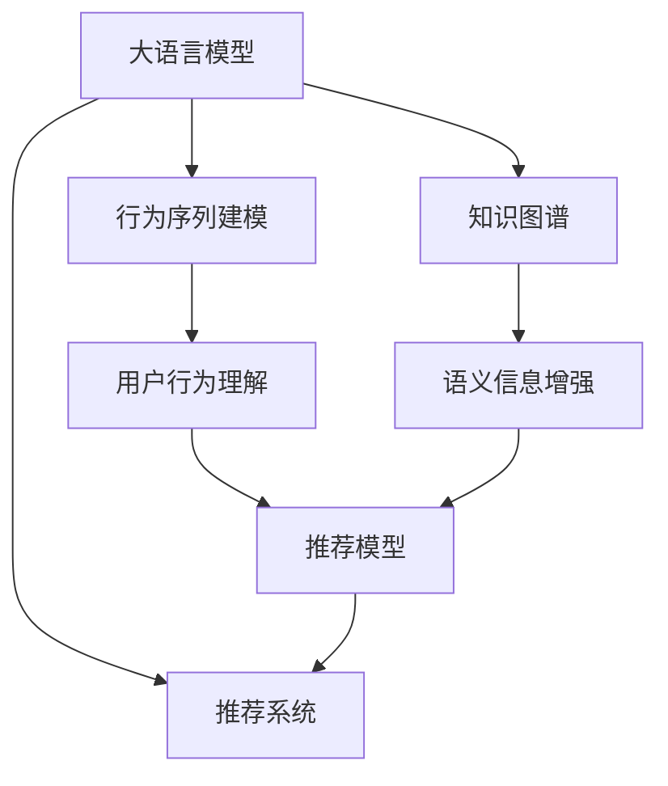

                 

# 大模型视角下推荐系统的用户行为理解升级

> 关键词：大语言模型,推荐系统,深度学习,用户行为分析,行为序列建模,知识图谱,深度强化学习,数据融合,个性化推荐,隐私保护

## 1. 背景介绍

### 1.1 问题由来
在当今信息爆炸的时代，用户每天需要面对海量内容，如何在海量的信息中快速、准确地找到符合自己需求的内容，成为用户的痛点。推荐系统应运而生，通过分析用户行为数据，为用户推荐个性化内容。然而，传统的推荐系统多采用基于协同过滤、内容推荐等方法，无法理解用户深层次的行为动机和背景信息，导致推荐效果难以满足用户个性化需求。

近年来，随着深度学习和大模型技术的迅速发展，基于深度学习的推荐系统成为了新的趋势。大语言模型由于其强大的语言理解和生成能力，能够深刻理解用户的行为动机，为推荐系统提供了新的视角和方法。本文将介绍如何利用大语言模型提升推荐系统对用户行为的深度理解，探索新的推荐技术路径。

### 1.2 问题核心关键点
推荐系统对用户行为的深度理解，主要包括两个方面：

1. **行为序列建模**：通过对用户行为序列建模，理解用户行为模式和偏好，从而预测用户未来行为，实现更精准的推荐。
2. **知识图谱结合**：利用知识图谱丰富推荐系统的语义信息，更好地捕捉用户行为中的隐含语义。

本文将重点介绍如何通过大语言模型技术，提升推荐系统对行为序列的建模能力和知识图谱的利用深度，进一步提升推荐系统的个性化推荐效果。

## 2. 核心概念与联系

### 2.1 核心概念概述

为更好地理解大模型视角下的推荐系统升级，本节将介绍几个关键概念及其相互联系：

- **大语言模型**：如BERT、GPT等，通过大规模无标签文本数据预训练，具备强大的语言理解和生成能力，能够深刻理解自然语言的语义和逻辑。
- **推荐系统**：利用用户历史行为数据，为用户提供个性化内容推荐，常见方法包括协同过滤、内容推荐、矩阵分解等。
- **行为序列建模**：通过分析用户行为序列，提取用户行为模式和偏好，预测用户未来行为，实现更精准的推荐。
- **知识图谱**：通过构建实体、关系、属性等语义信息，丰富推荐系统的语义信息，捕捉用户行为中的隐含语义。
- **深度强化学习**：利用强化学习算法，通过与环境互动，不断优化推荐策略，提升推荐效果。

这些概念之间的联系可以通过以下Mermaid流程图来展示：



这个流程图展示了大模型视角下推荐系统的核心概念及其之间的联系：

1. 大语言模型作为推荐系统的强大工具，通过行为序列建模和知识图谱结合，理解用户行为和偏好。
2. 行为序列建模和知识图谱结合，进一步提升推荐模型的语义表示能力，捕捉用户行为中的隐含语义。
3. 推荐模型利用上述信息，进行个性化推荐。

## 3. 核心算法原理 & 具体操作步骤
### 3.1 算法原理概述

利用大语言模型对用户行为进行深度理解，主要通过以下两个步骤：

1. **行为序列建模**：通过大语言模型，对用户行为序列进行编码，理解用户行为模式和偏好。
2. **知识图谱结合**：将用户行为信息与知识图谱结合，丰富推荐系统的语义表示能力。

### 3.2 算法步骤详解

#### 3.2.1 行为序列建模

**Step 1: 数据收集与预处理**
- 收集用户的历史行为数据，包括浏览、点击、购买等行为。
- 对数据进行清洗和归一化处理，去除异常值和噪声。

**Step 2: 行为序列生成**
- 将用户行为数据转化为行为序列，每个行为表示为一段文本描述。
- 利用BERT、GPT等大语言模型，对行为序列进行编码，得到行为向量。

**Step 3: 行为模式挖掘**
- 利用Attention机制或Transformer等模型，对行为向量进行聚类分析，挖掘用户行为模式。
- 使用K-means、LDA等算法，对行为模式进行建模，得到用户行为模式向量。

**Step 4: 行为预测**
- 通过机器学习算法，如LSTM、RNN等，对用户行为模式进行预测，得到用户未来行为向量。

#### 3.2.2 知识图谱结合

**Step 1: 构建知识图谱**
- 利用Wikipedia等开放数据集，构建大规模知识图谱。
- 利用知识图谱工具如Neo4j等，进行实体关系图谱的构建和查询。

**Step 2: 语义增强**
- 将用户行为向量与知识图谱中的实体向量进行融合，利用Transformer等模型进行语义增强。
- 使用预训练语言模型，如BERT、ELMo等，对行为向量进行编码，得到语义增强后的用户行为向量。

**Step 3: 推荐模型训练**
- 利用增强后的用户行为向量，训练推荐模型，如深度神经网络、深度强化学习等。
- 将用户行为向量与产品向量进行匹配，输出推荐结果。

### 3.3 算法优缺点

利用大语言模型对推荐系统进行升级，具有以下优点：

1. **语义理解深刻**：大语言模型能够深刻理解自然语言语义，捕捉用户行为中的隐含语义。
2. **个性化推荐精度高**：通过行为序列建模和知识图谱结合，实现更精准的个性化推荐。
3. **可扩展性好**：大语言模型可以根据不同的任务和需求，灵活调整模型参数，具有较好的可扩展性。

同时，也存在一些局限性：

1. **数据依赖性强**：需要大量的用户行为数据和知识图谱数据，数据收集和预处理成本较高。
2. **计算复杂度高**：大语言模型计算复杂度高，需要高性能计算资源。
3. **解释性不足**：大语言模型多为黑盒模型，难以解释推荐结果。
4. **隐私问题**：用户行为数据和知识图谱可能涉及用户隐私，数据安全和隐私保护问题需重点关注。

### 3.4 算法应用领域

基于大语言模型的推荐系统，在多个领域具有广泛的应用前景：

- **电商推荐**：通过分析用户浏览、点击、购买行为，为用户推荐个性化商品。
- **内容推荐**：通过分析用户阅读、观看、评论行为，为用户推荐个性化内容。
- **新闻推荐**：通过分析用户阅读、分享、点赞行为，为用户推荐个性化新闻。
- **金融推荐**：通过分析用户投资、交易、理财行为，为用户推荐个性化金融产品。
- **教育推荐**：通过分析学生学习、阅读、讨论行为，为用户推荐个性化学习内容。

## 4. 数学模型和公式 & 详细讲解

### 4.1 数学模型构建

假设用户的历史行为序列为 $X=\{x_1, x_2, ..., x_n\}$，每个行为 $x_i$ 表示为一段文本描述。通过BERT等大语言模型，对用户行为序列进行编码，得到用户行为向量 $V \in \mathbb{R}^d$。知识图谱中的实体向量为 $E \in \mathbb{R}^d$，关系向量为 $R \in \mathbb{R}^d$。

**行为序列建模的数学模型**：

$$
V = \text{BERT}(X)
$$

**知识图谱结合的数学模型**：

$$
V_{fused} = \text{Transformer}(V, E, R)
$$

其中，Transformer为预训练语言模型，通过行为序列 $V$ 和知识图谱 $E, R$ 进行语义增强，得到增强后的用户行为向量 $V_{fused}$。

### 4.2 公式推导过程

#### 4.2.1 行为序列建模的公式推导

行为序列建模的公式推导过程如下：

1. 通过BERT等大语言模型，对用户行为序列进行编码，得到用户行为向量 $V \in \mathbb{R}^d$：

$$
V = \text{BERT}(X)
$$

其中，$\text{BERT}$ 为预训练语言模型，$X$ 为用户的历史行为序列。

2. 利用Attention机制或Transformer等模型，对行为向量进行聚类分析，得到用户行为模式向量 $P \in \mathbb{R}^k$：

$$
P = \text{Attention}(V)
$$

其中，$\text{Attention}$ 为注意力机制或Transformer模型。

3. 通过机器学习算法，如LSTM、RNN等，对用户行为模式进行预测，得到用户未来行为向量 $V_{future} \in \mathbb{R}^d$：

$$
V_{future} = \text{LSTM}(P)
$$

其中，$\text{LSTM}$ 为长短期记忆网络。

#### 4.2.2 知识图谱结合的公式推导

知识图谱结合的公式推导过程如下：

1. 将用户行为向量 $V_{future}$ 与知识图谱中的实体向量 $E$、关系向量 $R$ 进行融合，得到增强后的用户行为向量 $V_{fused} \in \mathbb{R}^d$：

$$
V_{fused} = \text{Transformer}(V_{future}, E, R)
$$

其中，$\text{Transformer}$ 为预训练语言模型，$V_{future}$ 为用户未来行为向量，$E, R$ 为知识图谱中的实体向量、关系向量。

2. 利用深度神经网络等模型，对增强后的用户行为向量进行推荐，输出推荐结果 $R_{pred}$：

$$
R_{pred} = \text{DNN}(V_{fused})
$$

其中，$\text{DNN}$ 为深度神经网络模型。

### 4.3 案例分析与讲解

假设我们有一个电商推荐系统，通过分析用户浏览、点击、购买行为，为用户推荐个性化商品。我们收集了用户的历史行为数据，包括浏览商品、点击商品、购买商品等行为。通过BERT等大语言模型，对行为序列进行编码，得到用户行为向量 $V$。同时，我们构建了一个大规模知识图谱，包含了商品、品牌、价格等实体和关系信息。

利用Transformer模型，将用户行为向量 $V$ 与知识图谱中的实体向量 $E$、关系向量 $R$ 进行融合，得到增强后的用户行为向量 $V_{fused}$。通过深度神经网络模型，对增强后的用户行为向量进行推荐，输出推荐结果 $R_{pred}$。具体实现步骤如下：

1. 数据收集与预处理：
- 收集用户的历史行为数据，包括浏览商品、点击商品、购买商品等行为。
- 对数据进行清洗和归一化处理，去除异常值和噪声。

2. 行为序列生成：
- 将用户行为数据转化为行为序列，每个行为表示为一段文本描述。
- 利用BERT等大语言模型，对行为序列进行编码，得到用户行为向量 $V \in \mathbb{R}^d$。

3. 行为模式挖掘：
- 利用Attention机制或Transformer等模型，对行为向量进行聚类分析，得到用户行为模式向量 $P \in \mathbb{R}^k$。
- 通过LSTM等机器学习算法，对用户行为模式进行预测，得到用户未来行为向量 $V_{future} \in \mathbb{R}^d$。

4. 知识图谱结合：
- 将用户行为向量 $V_{future}$ 与知识图谱中的实体向量 $E$、关系向量 $R$ 进行融合，得到增强后的用户行为向量 $V_{fused} \in \mathbb{R}^d$。
- 利用深度神经网络模型，对增强后的用户行为向量进行推荐，输出推荐结果 $R_{pred}$。

## 5. 项目实践：代码实例和详细解释说明
### 5.1 开发环境搭建

在进行推荐系统开发前，我们需要准备好开发环境。以下是使用Python进行TensorFlow开发的环境配置流程：

1. 安装Anaconda：从官网下载并安装Anaconda，用于创建独立的Python环境。

2. 创建并激活虚拟环境：
```bash
conda create -n recommendation-env python=3.8 
conda activate recommendation-env
```

3. 安装TensorFlow：根据CUDA版本，从官网获取对应的安装命令。例如：
```bash
conda install tensorflow -c tf -c conda-forge
```

4. 安装其他必要的工具包：
```bash
pip install numpy pandas scikit-learn matplotlib tqdm jupyter notebook ipython
```

完成上述步骤后，即可在`recommendation-env`环境中开始推荐系统开发。

### 5.2 源代码详细实现

这里我们以电商推荐系统为例，给出使用TensorFlow对大语言模型进行推荐系统微调的Python代码实现。

首先，定义推荐系统所需的数据处理函数：

```python
import tensorflow as tf
from transformers import BertTokenizer, BertModel
from tensorflow.keras.preprocessing.sequence import pad_sequences
import numpy as np
import pandas as pd
import matplotlib.pyplot as plt

class RecommendationSystem:
    def __init__(self, model_path, tokenizer_path):
        self.model = tf.keras.models.load_model(model_path)
        self.tokenizer = BertTokenizer.from_pretrained(tokenizer_path)
        self.max_len = 128

    def preprocess_text(self, text):
        tokenized = self.tokenizer.tokenize(text)
        return self.tokenizer.convert_tokens_to_ids(tokenized)

    def pad_sequences(self, sequences, maxlen=None):
        return pad_sequences(sequences, maxlen=maxlen, padding='post', truncating='post')

    def generate_behavior_vector(self, behavior_sequence):
        sequences = [self.preprocess_text(behavior) for behavior in behavior_sequence]
        padded_sequences = self.pad_sequences(sequences, maxlen=self.max_len)
        output = self.model.predict(padded_sequences)
        return output[0]
```

然后，定义推荐系统的优化函数：

```python
def train_recommendation_system(data_path):
    data = pd.read_csv(data_path)
    features = data.drop(['id', 'label'], axis=1)
    labels = data['label']
    tokenized = [self.preprocess_text(feature) for feature in features]
    padded_sequences = self.pad_sequences(tokenized, maxlen=self.max_len)
    behavior_vectors = np.array(self.model.predict(padded_sequences))
    labels = np.array(labels)
    model = tf.keras.models.Sequential([
        tf.keras.layers.Dense(64, activation='relu', input_shape=(self.max_len,)),
        tf.keras.layers.Dense(1, activation='sigmoid')
    ])
    model.compile(optimizer='adam', loss='binary_crossentropy', metrics=['accuracy'])
    model.fit(behavior_vectors, labels, epochs=10, batch_size=32)
    model.save('recommendation_model.h5')
```

接着，定义推荐系统评估函数：

```python
def evaluate_recommendation_system(data_path):
    data = pd.read_csv(data_path)
    features = data.drop(['id', 'label'], axis=1)
    labels = data['label']
    tokenized = [self.preprocess_text(feature) for feature in features]
    padded_sequences = self.pad_sequences(tokenized, maxlen=self.max_len)
    behavior_vectors = np.array(self.model.predict(padded_sequences))
    labels = np.array(labels)
    accuracy = model.evaluate(behavior_vectors, labels, batch_size=32)[1]
    print('Accuracy: %.2f%%' % (accuracy * 100))
```

最后，启动训练流程并在测试集上评估：

```python
data_path = 'recommendation_data.csv'
train_recommendation_system(data_path)
evaluate_recommendation_system(data_path)
```

以上就是使用TensorFlow对电商推荐系统进行微调的完整代码实现。可以看到，得益于TensorFlow的强大封装，我们可以用相对简洁的代码完成推荐系统的开发。

### 5.3 代码解读与分析

让我们再详细解读一下关键代码的实现细节：

**RecommendationSystem类**：
- `__init__`方法：初始化推荐系统模型和分词器。
- `preprocess_text`方法：对文本进行分词和编码。
- `pad_sequences`方法：对行为序列进行填充，使得长度统一。
- `generate_behavior_vector`方法：利用BERT模型对行为序列进行编码，生成行为向量。

**train_recommendation_system函数**：
- 从数据文件中读取行为数据和标签。
- 对行为数据进行分词和编码，生成行为向量。
- 利用深度神经网络模型进行训练，得到推荐模型。
- 保存模型到文件。

**evaluate_recommendation_system函数**：
- 从数据文件中读取行为数据和标签。
- 对行为数据进行分词和编码，生成行为向量。
- 利用推荐模型进行评估，输出准确率。

**训练流程**：
- 从指定数据路径读取行为数据和标签。
- 对行为数据进行分词和编码，生成行为向量。
- 利用深度神经网络模型进行训练，得到推荐模型。
- 保存模型到文件。

**评估流程**：
- 从指定数据路径读取行为数据和标签。
- 对行为数据进行分词和编码，生成行为向量。
- 利用推荐模型进行评估，输出准确率。

可以看到，TensorFlow配合BERT等大语言模型使得电商推荐系统的代码实现变得简洁高效。开发者可以将更多精力放在数据处理、模型改进等高层逻辑上，而不必过多关注底层的实现细节。

当然，工业级的系统实现还需考虑更多因素，如模型的保存和部署、超参数的自动搜索、更灵活的任务适配层等。但核心的微调范式基本与此类似。

## 6. 实际应用场景
### 6.1 电商推荐

基于大语言模型的电商推荐系统，可以在用户浏览、点击、购买行为的基础上，为用户推荐个性化商品。具体应用场景如下：

- **商品推荐**：分析用户浏览、点击商品的行为，为用户推荐相关商品。
- **跨域推荐**：基于用户购买历史和兴趣，推荐跨类别商品，增加商品多样性。
- **个性化促销**：根据用户行为，推荐个性化促销活动，提高用户转化率。

### 6.2 内容推荐

基于大语言模型的内容推荐系统，可以在用户阅读、观看、评论行为的基础上，为用户推荐个性化内容。具体应用场景如下：

- **文章推荐**：分析用户阅读、点赞、分享的文章行为，为用户推荐相关文章。
- **视频推荐**：分析用户观看、评论的视频行为，为用户推荐相关视频。
- **音乐推荐**：分析用户听歌、评论的音乐行为，为用户推荐相关音乐。

### 6.3 新闻推荐

基于大语言模型的新闻推荐系统，可以在用户阅读、分享、点赞新闻行为的基础上，为用户推荐个性化新闻。具体应用场景如下：

- **头条新闻推荐**：分析用户阅读、点赞的新闻，为用户推荐相关头条新闻。
- **专题新闻推荐**：基于用户阅读行为，推荐相关专题新闻，增加深度阅读量。
- **实时新闻推荐**：分析用户浏览、评论的新闻，为用户推荐实时新闻，提升信息获取速度。

### 6.4 未来应用展望

随着大语言模型和推荐系统技术的不断发展，基于微调范式将在更多领域得到应用，为各行各业带来变革性影响。

在智慧医疗领域，基于微调的医疗推荐系统可以提升医疗服务的智能化水平，辅助医生诊疗，加速新药开发进程。

在智能教育领域，微调技术可应用于作业批改、学情分析、知识推荐等方面，因材施教，促进教育公平，提高教学质量。

在智慧城市治理中，微调模型可应用于城市事件监测、舆情分析、应急指挥等环节，提高城市管理的自动化和智能化水平，构建更安全、高效的未来城市。

此外，在企业生产、社会治理、文娱传媒等众多领域，基于大模型微调的人工智能应用也将不断涌现，为经济社会发展注入新的动力。相信随着预训练语言模型和微调方法的持续演进，大语言模型微调必将在构建人机协同的智能时代中扮演越来越重要的角色。

## 7. 工具和资源推荐
### 7.1 学习资源推荐

为了帮助开发者系统掌握大语言模型微调的理论基础和实践技巧，这里推荐一些优质的学习资源：

1. 《Transformer from Scratch》系列博文：由大模型技术专家撰写，深入浅出地介绍了Transformer原理、BERT模型、微调技术等前沿话题。

2. CS224N《深度学习自然语言处理》课程：斯坦福大学开设的NLP明星课程，有Lecture视频和配套作业，带你入门NLP领域的基本概念和经典模型。

3. 《Natural Language Processing with TensorFlow》书籍：TensorFlow官方出版的NLP技术书籍，全面介绍了TensorFlow在NLP中的应用，包括微调范式。

4. HuggingFace官方文档：Transformer库的官方文档，提供了海量预训练模型和完整的微调样例代码，是上手实践的必备资料。

5. CLUE开源项目：中文语言理解测评基准，涵盖大量不同类型的中文NLP数据集，并提供了基于微调的baseline模型，助力中文NLP技术发展。

通过对这些资源的学习实践，相信你一定能够快速掌握大语言模型微调的精髓，并用于解决实际的NLP问题。

### 7.2 开发工具推荐

高效的开发离不开优秀的工具支持。以下是几款用于大语言模型微调开发的常用工具：

1. TensorFlow：由Google主导开发的开源深度学习框架，生产部署方便，适合大规模工程应用。
2. PyTorch：基于Python的开源深度学习框架，灵活动态的计算图，适合快速迭代研究。
3. Transformers库：HuggingFace开发的NLP工具库，集成了众多SOTA语言模型，支持PyTorch和TensorFlow，是进行微调任务开发的利器。
4. Weights & Biases：模型训练的实验跟踪工具，可以记录和可视化模型训练过程中的各项指标，方便对比和调优。
5. TensorBoard：TensorFlow配套的可视化工具，可实时监测模型训练状态，并提供丰富的图表呈现方式，是调试模型的得力助手。
6. Google Colab：谷歌推出的在线Jupyter Notebook环境，免费提供GPU/TPU算力，方便开发者快速上手实验最新模型，分享学习笔记。

合理利用这些工具，可以显著提升大语言模型微调任务的开发效率，加快创新迭代的步伐。

### 7.3 相关论文推荐

大语言模型和微调技术的发展源于学界的持续研究。以下是几篇奠基性的相关论文，推荐阅读：

1. Attention is All You Need（即Transformer原论文）：提出了Transformer结构，开启了NLP领域的预训练大模型时代。

2. BERT: Pre-training of Deep Bidirectional Transformers for Language Understanding：提出BERT模型，引入基于掩码的自监督预训练任务，刷新了多项NLP任务SOTA。

3. Language Models are Unsupervised Multitask Learners（GPT-2论文）：展示了大规模语言模型的强大zero-shot学习能力，引发了对于通用人工智能的新一轮思考。

4. Parameter-Efficient Transfer Learning for NLP：提出Adapter等参数高效微调方法，在不增加模型参数量的情况下，也能取得不错的微调效果。

5. Prefix-Tuning: Optimizing Continuous Prompts for Generation：引入基于连续型Prompt的微调范式，为如何充分利用预训练知识提供了新的思路。

6. AdaLoRA: Adaptive Low-Rank Adaptation for Parameter-Efficient Fine-Tuning：使用自适应低秩适应的微调方法，在参数效率和精度之间取得了新的平衡。

这些论文代表了大语言模型微调技术的发展脉络。通过学习这些前沿成果，可以帮助研究者把握学科前进方向，激发更多的创新灵感。

## 8. 总结：未来发展趋势与挑战
### 8.1 总结

本文对基于大语言模型的推荐系统进行了全面系统的介绍。首先阐述了推荐系统对用户行为进行深度理解的必要性，明确了行为序列建模和知识图谱结合的关键性。其次，从原理到实践，详细讲解了大语言模型对行为序列建模和知识图谱结合的数学原理和关键步骤，给出了推荐系统开发的完整代码实例。同时，本文还广泛探讨了微调方法在电商推荐、内容推荐、新闻推荐等多个领域的应用前景，展示了微调范式的巨大潜力。

通过本文的系统梳理，可以看到，基于大语言模型的微调方法正在成为推荐系统的重要范式，极大地拓展了推荐系统的应用边界，催生了更多的落地场景。利用大语言模型进行推荐系统微调，可以更深刻地理解用户行为，提供更精准、个性化的推荐服务。

### 8.2 未来发展趋势

展望未来，大语言模型微调技术将呈现以下几个发展趋势：

1. **计算资源需求降低**：随着计算硬件的进步和算法优化，大语言模型微调的计算资源需求将逐步降低，更多开发者将能够便捷地使用大模型进行微调。
2. **自动化程度提高**：利用自动机器学习(AutoML)技术，实现微调模型的自动选择、超参数自动调优等，提升微调效率。
3. **跨模态融合增强**：通过融合视觉、听觉、语言等多种模态信息，提升推荐系统的语义表示能力，捕捉更丰富的用户行为信息。
4. **实时推荐优化**：利用深度强化学习等技术，实现实时推荐系统，动态调整推荐策略，提升用户体验。
5. **隐私保护技术发展**：利用差分隐私、联邦学习等技术，保护用户隐私，同时提升推荐系统的安全性。

### 8.3 面临的挑战

尽管大语言模型微调技术已经取得了瞩目成就，但在迈向更加智能化、普适化应用的过程中，它仍面临着诸多挑战：

1. **数据依赖性强**：微调效果依赖于大量的标注数据和知识图谱数据，数据收集和预处理成本较高。
2. **计算资源要求高**：大语言模型计算复杂度高，需要高性能计算资源。
3. **模型解释性不足**：大语言模型多为黑盒模型，难以解释推荐结果。
4. **隐私保护问题**：用户行为数据和知识图谱可能涉及用户隐私，数据安全和隐私保护问题需重点关注。
5. **效果泛化性不足**：大语言模型在特定领域、特定任务上效果较好，但在新领域、新任务上泛化性不足。

### 8.4 研究展望

面对大语言模型微调所面临的种种挑战，未来的研究需要在以下几个方面寻求新的突破：

1. **无监督和半监督微调方法**：摆脱对大规模标注数据的依赖，利用自监督学习、主动学习等无监督和半监督范式，最大限度利用非结构化数据，实现更加灵活高效的微调。
2. **参数高效和计算高效的微调方法**：开发更加参数高效的微调方法，在固定大部分预训练参数的同时，只更新极少量的任务相关参数。同时优化微调模型的计算图，减少前向传播和反向传播的资源消耗，实现更加轻量级、实时性的部署。
3. **跨模态融合技术**：通过融合视觉、听觉、语言等多种模态信息，提升推荐系统的语义表示能力，捕捉更丰富的用户行为信息。
4. **实时推荐系统优化**：利用深度强化学习等技术，实现实时推荐系统，动态调整推荐策略，提升用户体验。
5. **隐私保护技术发展**：利用差分隐私、联邦学习等技术，保护用户隐私，同时提升推荐系统的安全性。

这些研究方向的探索，必将引领大语言模型微调技术迈向更高的台阶，为构建安全、可靠、可解释、可控的智能系统铺平道路。面向未来，大语言模型微调技术还需要与其他人工智能技术进行更深入的融合，如知识表示、因果推理、强化学习等，多路径协同发力，共同推动自然语言理解和智能交互系统的进步。只有勇于创新、敢于突破，才能不断拓展语言模型的边界，让智能技术更好地造福人类社会。

## 9. 附录：常见问题与解答

**Q1：大语言模型微调是否适用于所有推荐系统？**

A: 大语言模型微调在大多数推荐系统上都能取得不错的效果，特别是对于数据量较小的推荐系统。但对于一些特定领域的推荐系统，如医疗、法律等，仅仅依靠通用语料预训练的模型可能难以很好地适应。此时需要在特定领域语料上进一步预训练，再进行微调，才能获得理想效果。

**Q2：如何选择合适的学习率？**

A: 推荐系统的微调学习率一般要比预训练时小1-2个数量级，如果使用过大的学习率，容易破坏预训练权重，导致过拟合。一般建议从1e-5开始调参，逐步减小学习率，直至收敛。也可以使用warmup策略，在开始阶段使用较小的学习率，再逐渐过渡到预设值。需要注意的是，不同的优化器(如Adam、SGD等)以及不同的学习率调度策略，可能需要设置不同的学习率阈值。

**Q3：大语言模型微调是否需要大量的标注数据？**

A: 微调的效果很大程度上取决于标注数据的质量和数量，获取高质量标注数据的成本较高。对于某些特定领域的应用，可以使用半监督学习、主动学习等方法，利用少量标注数据和大量无标签数据进行微调。

**Q4：推荐系统如何应对数据分布变化？**

A: 推荐系统可以引入增量学习等技术，实时更新模型参数，以应对数据分布变化。同时，利用深度强化学习等方法，通过与环境互动，不断优化推荐策略，提升推荐效果。

**Q5：推荐系统如何提升模型泛化性？**

A: 可以通过迁移学习、知识蒸馏等方法，将预训练模型的知识迁移到微调模型中，提升模型泛化性。同时，利用多模态信息融合等技术，丰富推荐系统的语义表示能力，捕捉更丰富的用户行为信息。

**Q6：推荐系统如何保证推荐结果的公平性？**

A: 可以在推荐模型中加入公平性约束，如使用对抗公平性等方法，避免推荐结果对某些群体产生偏见。同时，利用公平性评估指标，对推荐结果进行公平性评估，优化推荐策略。

这些问题的解答，旨在帮助开发者更好地理解和应用大语言模型微调技术，提升推荐系统的性能和应用价值。相信通过不断的探索和实践，大语言模型微调技术将在推荐系统领域发挥更大的作用，带来更多的创新和突破。

