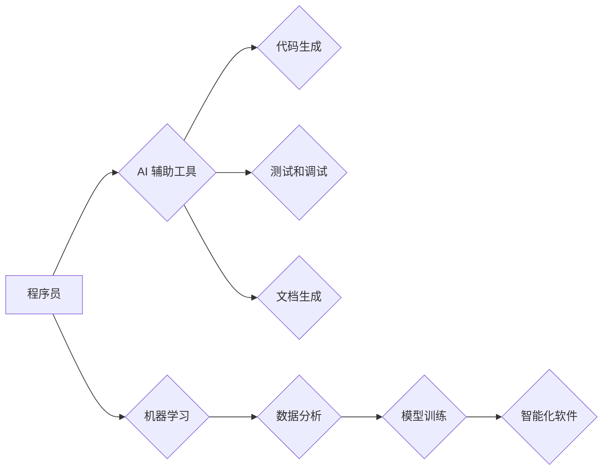

                 

## 程序员如何应对人工智能带来的挑战

> 关键词：人工智能、程序员、自动化、迁移学习、新技能、职业发展、伦理、未来趋势

### 1. 背景介绍

人工智能（AI）正以惊人的速度发展，其影响力正在深刻地改变着各个行业，包括软件开发领域。从代码生成到软件测试，AI 正在自动化越来越多的任务，这给程序员带来了前所未有的机遇和挑战。

一方面，AI 可以帮助程序员提高效率，解放他们从重复性、低价值的工作中解放出来，专注于更具创造性和战略性的任务。另一方面，AI 也可能导致一些程序员工作岗位的消失，迫使他们重新评估自己的技能和职业发展方向。

### 2. 核心概念与联系

**2.1  人工智能 (AI)**

人工智能是指模拟人类智能行为的计算机系统。这些系统能够学习、推理、解决问题和做出决策，就像人类一样。

**2.2  机器学习 (ML)**

机器学习是人工智能的一个子领域，它使计算机能够从数据中学习，无需明确编程。通过分析大量数据，机器学习算法可以识别模式、做出预测并改进其性能。

**2.3  深度学习 (DL)**

深度学习是机器学习的一个更高级的子领域，它使用多层神经网络来模拟大脑的结构和功能。深度学习算法能够处理更复杂的数据，并取得更优异的性能。

**2.4  自然语言处理 (NLP)**

自然语言处理是人工智能的一个分支，它专注于使计算机能够理解和处理人类语言。NLP 算法可以用于文本分析、机器翻译、语音识别等任务。

**2.5  计算机视觉 (CV)**

计算机视觉是人工智能的一个分支，它使计算机能够“看到”和理解图像和视频。CV 算法可以用于图像识别、物体检测、人脸识别等任务。

**2.6  AI 与程序员的关系**

AI 正在改变程序员的工作方式，以下是一些关键联系：

* **自动化:** AI 可以自动化许多重复性任务，例如代码生成、测试和部署。
* **协作:** AI 可以作为程序员的助手，提供代码建议、错误检测和文档生成等帮助。
* **新工具:** AI 正在催生新的开发工具和平台，例如代码生成器、AI 驱动的调试器和测试工具。
* **新技能:** 程序员需要学习新的技能，例如机器学习、深度学习和自然语言处理，才能与 AI 协同工作。

**Mermaid 流程图**



### 3. 核心算法原理 & 具体操作步骤

**3.1  算法原理概述**

机器学习算法的核心原理是通过学习数据中的模式来进行预测或分类。这些算法可以分为监督学习、无监督学习和强化学习三大类。

* **监督学习:** 算法在已标记的数据集上进行训练，学习输入和输出之间的关系。例如，图像分类算法可以被训练识别不同类型的物体。
* **无监督学习:** 算法在未标记的数据集上进行训练，学习数据中的潜在结构和模式。例如，聚类算法可以将数据点分组到不同的类别。
* **强化学习:** 算法通过与环境交互，学习如何最大化奖励。例如，游戏 AI 可以通过玩游戏学习如何获得更高的分数。

**3.2  算法步骤详解**

一个典型的机器学习算法训练流程包括以下步骤：

1. **数据收集和预处理:** 收集相关数据并进行清洗、转换和特征工程等预处理操作。
2. **模型选择:** 根据任务类型选择合适的机器学习算法。
3. **模型训练:** 使用训练数据训练模型，调整模型参数以最小化预测误差。
4. **模型评估:** 使用测试数据评估模型的性能，例如准确率、召回率和 F1 分数。
5. **模型调优:** 根据评估结果调整模型参数或选择其他算法，以提高模型性能。
6. **模型部署:** 将训练好的模型部署到实际应用场景中。

**3.3  算法优缺点**

不同的机器学习算法具有不同的优缺点，需要根据具体任务选择合适的算法。

* **优点:**

    * 自动化学习：无需手动编程，算法可以自动从数据中学习。
    * 适应性强：可以适应不断变化的数据分布。
    * 性能优异：在某些任务上可以取得比传统算法更好的性能。

* **缺点:**

    * 数据依赖：算法性能依赖于训练数据的质量和数量。
    * 黑盒效应：一些算法的决策过程难以解释。
    * 计算资源需求高：训练大型模型可能需要大量的计算资源。

**3.4  算法应用领域**

机器学习算法广泛应用于各个领域，例如：

* **图像识别:** 人脸识别、物体检测、图像分类。
* **自然语言处理:** 机器翻译、文本摘要、情感分析。
* **推荐系统:** 产品推荐、内容推荐、个性化服务。
* **金融领域:** 欺诈检测、风险评估、信用评分。
* **医疗领域:** 疾病诊断、药物研发、医疗影像分析。

### 4. 数学模型和公式 & 详细讲解 & 举例说明

**4.1  数学模型构建**

机器学习算法通常基于数学模型，这些模型可以用来表示数据之间的关系和预测未来结果。常见的数学模型包括线性回归、逻辑回归、支持向量机、决策树等。

**4.2  公式推导过程**

每个算法都有其特定的公式和推导过程。例如，线性回归的目标是找到一条直线，使得这条直线与数据点之间的误差最小。

**线性回归损失函数:**

$$
J(\theta) = \frac{1}{2m} \sum_{i=1}^{m} (h_\theta(x^{(i)}) - y^{(i)})^2
$$

其中：

* $J(\theta)$ 是损失函数，表示模型预测误差的平方和。
* $\theta$ 是模型参数。
* $m$ 是训练样本的数量。
* $h_\theta(x^{(i)})$ 是模型对第 $i$ 个样本的预测值。
* $y^{(i)}$ 是第 $i$ 个样本的真实值。

**4.3  案例分析与讲解**

假设我们有一个数据集，包含房屋面积和房屋价格的信息。我们可以使用线性回归模型来预测房屋价格。

* **输入特征:** 房屋面积
* **输出目标:** 房屋价格

通过训练线性回归模型，我们可以得到一条直线，这条直线可以用来预测给定房屋面积的房屋价格。

### 5. 项目实践：代码实例和详细解释说明

**5.1  开发环境搭建**

* Python 3.x
* TensorFlow 或 PyTorch 等深度学习框架
* Jupyter Notebook 或 VS Code 等代码编辑器

**5.2  源代码详细实现**

```python
import tensorflow as tf

# 定义模型
model = tf.keras.models.Sequential([
  tf.keras.layers.Dense(64, activation='relu', input_shape=(1,)),
  tf.keras.layers.Dense(1)
])

# 编译模型
model.compile(optimizer='adam', loss='mse')

# 训练模型
model.fit(x_train, y_train, epochs=100)

# 预测
predictions = model.predict(x_test)
```

**5.3  代码解读与分析**

* 我们使用 TensorFlow 框架构建了一个简单的线性回归模型。
* 模型包含两层神经网络，第一层有 64 个神经元，使用 ReLU 激活函数，输入维度为 1。
* 第二层只有一个神经元，输出房屋价格。
* 我们使用 Adam 优化器和均方误差损失函数训练模型。
* 训练模型 100 个 epochs。
* 最后，我们使用训练好的模型预测测试数据。

**5.4  运行结果展示**

训练完成后，我们可以评估模型的性能，例如使用均方根误差 (RMSE) 来衡量预测误差。

### 6. 实际应用场景

**6.1  代码生成**

AI 可以生成代码片段，帮助程序员提高开发效率。例如，GitHub Copilot 是一个基于 OpenAI Codex 的代码生成工具，可以根据代码上下文生成代码建议。

**6.2  代码测试**

AI 可以自动生成测试用例，帮助程序员提高代码质量。例如，DeepCode 是一个基于机器学习的代码测试工具，可以识别代码中的潜在 bug。

**6.3  代码优化**

AI 可以分析代码，并提供优化建议，例如减少代码冗余、提高代码性能。例如，IntelliJ IDEA 中的 AI-powered Code Completion 功能可以帮助程序员编写更简洁、高效的代码。

**6.4  未来应用展望**

AI 将在软件开发领域发挥越来越重要的作用，例如：

* **更智能的代码助手:** AI 助手将能够更好地理解程序员的需求，并提供更精准、更有用的代码建议。
* **自动化的软件开发流程:** AI 将能够自动化更多软件开发流程，例如代码生成、测试、部署等，从而大幅提高开发效率。
* **个性化的开发体验:** AI 将能够根据程序员的习惯和偏好，提供个性化的开发体验。

### 7. 工具和资源推荐

**7.1  学习资源推荐**

* **在线课程:** Coursera、edX、Udacity 等平台提供丰富的机器学习和深度学习课程。
* **书籍:** 《深度学习》、《机器学习实战》等书籍是学习 AI 的经典教材。
* **开源项目:** TensorFlow、PyTorch 等开源项目提供了丰富的学习资源和实践案例。

**7.2  开发工具推荐**

* **Jupyter Notebook:** 用于编写和运行 Python 代码的交互式笔记本环境。
* **VS Code:** 功能强大的代码编辑器，支持多种编程语言和插件。
* **GitHub Copilot:** 基于 OpenAI Codex 的代码生成工具。
* **DeepCode:** 基于机器学习的代码测试工具。

**7.3  相关论文推荐**

* **《ImageNet Classification with Deep Convolutional Neural Networks》**
* **《Attention Is All You Need》**
* **《BERT: Pre-training of Deep Bidirectional Transformers for Language Understanding》**

### 8. 总结：未来发展趋势与挑战

**8.1  研究成果总结**

近年来，AI 领域取得了令人瞩目的进展，例如图像识别、自然语言处理和机器翻译等领域取得了突破性进展。

**8.2  未来发展趋势**

* **更强大的模型:** 研究人员正在开发更强大、更复杂的 AI 模型，例如 Transformer 模型和生成式对抗网络 (GAN)。
* **更广泛的应用:** AI 将应用于更多领域，例如医疗、教育、金融等。
* **更智能的交互:** AI 将能够与人类进行更自然、更智能的交互。

**8.3  面临的挑战**

* **数据隐私和安全:** AI 算法依赖于大量数据，如何保护数据隐私和安全是一个重要挑战。
* **算法偏见:** AI 算法可能存在偏见，导致不公平的结果。
* **伦理问题:** AI 的发展引发了许多伦理问题，例如人工智能的责任和人工智能的控制。

**8.4  研究展望**

未来，AI 研究将继续朝着更安全、更可靠、更可解释的方向发展。

### 9. 附录：常见问题与解答

**9.1  AI 会取代程序员吗？**

AI 可能会改变程序员的工作方式，但不会完全取代程序员。AI 可以自动化一些重复性任务，但仍然需要程序员进行设计、规划、测试和维护。

**9.2  如何学习 AI 相关技能？**

可以通过在线课程、书籍、开源项目等方式学习 AI 相关技能。

**9.3  AI 的发展对社会有什么影响？**

AI 的发展对社会的影响是多方面的，既有积极的一面，也有消极的一面。AI 可以提高效率、创造新的价值，但也可能导致失业、加剧社会不平等。


作者：禅与计算机程序设计艺术 / Zen and the Art of Computer Programming 
<end_of_turn>

