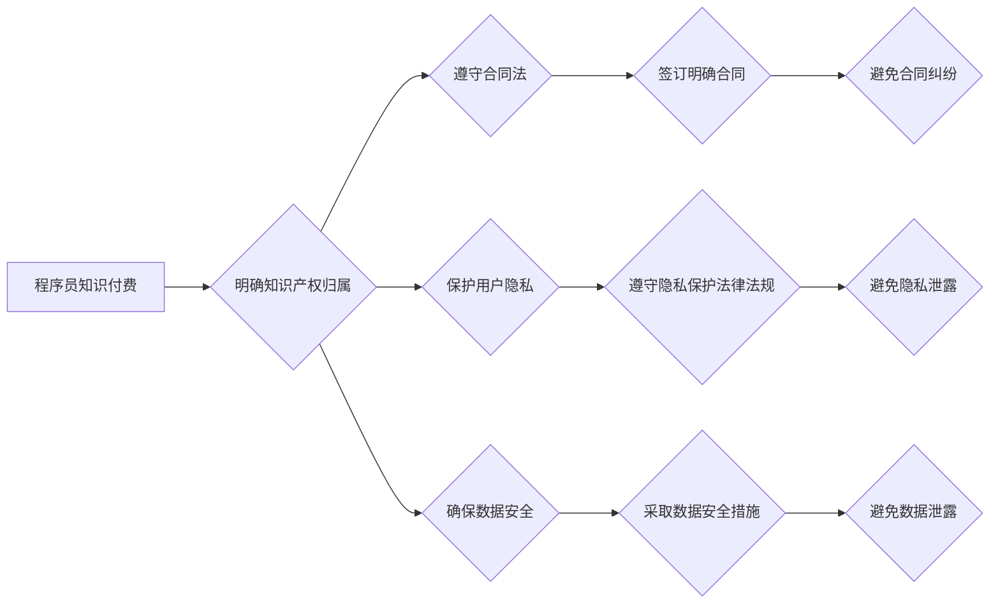

                 

## 程序员知识付费的法律风险防范策略

> 关键词：知识付费、程序员、法律风险、版权、侵权、合同、隐私、数据安全

## 1. 背景介绍

近年来，随着互联网技术的快速发展和知识经济的兴起，知识付费模式在各个领域蓬勃发展，程序员知识付费也不例外。程序员凭借其专业技能和经验，通过线上课程、视频教程、技术博客等形式，向其他程序员提供知识和技能培训服务，获得了巨大的经济效益。然而，在知识付费的快速发展过程中，也伴随着一些法律风险，这些风险如果不及时防范，可能会给程序员带来经济损失、声誉损害甚至刑事责任。

## 2. 核心概念与联系

**2.1 知识付费的核心概念**

知识付费是指以知识、技能、经验等为核心内容，通过付费的方式向用户提供学习、提升和服务的商业模式。

**2.2 程序员知识付费的模式**

程序员知识付费主要采取以下几种模式：

* **线上课程:** 通过视频、文字、代码等形式，教授程序员特定技术或技能。
* **技术博客:** 程序员分享自己的技术经验、项目案例和学习心得，通过广告、会员订阅等方式获取收益。
* **技术咨询:** 程序员为其他程序员提供一对一技术咨询服务，解决技术难题。
* **开源项目:** 程序员开发开源软件，通过捐赠、赞助等方式获取收益。

**2.3 程序员知识付费的法律风险**

程序员知识付费涉及到版权、侵权、合同、隐私、数据安全等多个法律领域，存在以下风险：

* **版权侵权:** 未经授权使用他人知识产权，例如代码、文档、图片等，构成版权侵权。
* **商业秘密泄露:**  在知识付费过程中，程序员可能会披露自己的商业秘密，例如技术方案、客户信息等，导致商业秘密泄露。
* **合同纠纷:**  程序员与用户之间可能存在合同纠纷，例如课程内容不符、服务质量问题等。
* **隐私泄露:**  程序员在收集用户数据时，需要注意保护用户的隐私信息，避免泄露用户个人信息。
* **数据安全:**  程序员需要确保用户数据安全，防止数据被盗用或泄露。

**2.4  程序员知识付费的法律风险防范策略**

程序员知识付费的法律风险防范策略主要包括以下几个方面：

* **明确知识产权归属:**  程序员应明确自己所提供的知识产权的归属，并采取措施保护自己的知识产权。
* **遵守合同法:**  程序员应与用户签订明确的合同，明确双方权利义务，避免合同纠纷。
* **保护用户隐私:**  程序员应遵守相关法律法规，保护用户的隐私信息，避免隐私泄露。
* **确保数据安全:**  程序员应采取措施确保用户数据的安全，防止数据被盗用或泄露。

**2.5  程序员知识付费的法律风险防范策略流程图**



## 3. 核心算法原理 & 具体操作步骤

**3.1 算法原理概述**

知识付费平台的运营需要涉及到一些核心算法，例如推荐算法、内容审核算法、用户画像算法等。这些算法的原理和实现方式直接影响到平台的运营效果和用户体验。

**3.2 算法步骤详解**

* **推荐算法:**  根据用户的历史行为、兴趣偏好等信息，推荐用户可能感兴趣的课程或内容。
* **内容审核算法:**  对用户上传的内容进行自动审核，过滤违规内容，例如色情、暴力、垃圾信息等。
* **用户画像算法:**  通过分析用户的行为数据，构建用户的画像，例如用户的年龄、性别、职业、兴趣爱好等。

**3.3 算法优缺点**

* **推荐算法:**  优点是能够提高用户粘性，促进用户付费；缺点是容易陷入推荐偏差，导致用户体验下降。
* **内容审核算法:**  优点是能够有效过滤违规内容，维护平台秩序；缺点是容易出现误判，导致良性内容被误删。
* **用户画像算法:**  优点是能够帮助平台更好地了解用户需求，提供个性化服务；缺点是容易侵犯用户隐私，需要谨慎使用。

**3.4 算法应用领域**

* **电商平台:**  推荐商品、个性化广告
* **社交媒体平台:**  推荐好友、内容
* **教育平台:**  推荐课程、学习资源
* **新闻平台:**  推荐新闻资讯

## 4. 数学模型和公式 & 详细讲解 & 举例说明

**4.1 数学模型构建**

知识付费平台的运营可以构建数学模型来分析用户行为、预测收益等。例如，可以构建用户参与度模型，预测用户是否会购买课程，以及购买课程的金额。

**4.2 公式推导过程**

用户参与度模型可以采用Logistic回归模型，其公式如下：

$$P(y=1|x) = \frac{1}{1 + e^{-(w_0 + w_1x_1 + w_2x_2 + ... + w_nx_n)}}$$

其中：

* $P(y=1|x)$ 表示用户购买课程的概率
* $x_1, x_2, ..., x_n$ 表示用户的特征，例如年龄、性别、职业、兴趣爱好等
* $w_0, w_1, w_2, ..., w_n$ 表示模型参数

**4.3 案例分析与讲解**

假设一个知识付费平台要预测用户是否购买编程课程，可以收集用户的年龄、性别、职业、兴趣爱好等数据，构建用户参与度模型。通过训练模型，得到模型参数，然后可以将新用户的特征输入模型，预测其购买课程的概率。

## 5. 项目实践：代码实例和详细解释说明

**5.1 开发环境搭建**

* Python 3.x
* TensorFlow 或 PyTorch
* Jupyter Notebook

**5.2 源代码详细实现**

```python
# 导入必要的库
import tensorflow as tf

# 定义模型结构
model = tf.keras.models.Sequential([
    tf.keras.layers.Dense(64, activation='relu', input_shape=(5,)),
    tf.keras.layers.Dense(32, activation='relu'),
    tf.keras.layers.Dense(1, activation='sigmoid')
])

# 编译模型
model.compile(optimizer='adam',
              loss='binary_crossentropy',
              metrics=['accuracy'])

# 训练模型
model.fit(X_train, y_train, epochs=10)

# 评估模型
loss, accuracy = model.evaluate(X_test, y_test)
print('Loss:', loss)
print('Accuracy:', accuracy)
```

**5.3 代码解读与分析**

* 代码首先导入必要的库，例如 TensorFlow。
* 然后定义模型结构，使用多层神经网络。
* 接着编译模型，选择优化器、损失函数和评估指标。
* 训练模型，使用训练数据进行训练。
* 最后评估模型，使用测试数据评估模型的性能。

**5.4 运行结果展示**

训练完成后，可以查看模型的损失值和准确率，评估模型的性能。

## 6. 实际应用场景

**6.1 在线教育平台**

* 推荐课程
* 个性化学习路径
* 课程质量评估

**6.2 技术博客平台**

* 推荐技术文章
* 用户兴趣分析
* 内容创作指导

**6.3 技术社区平台**

* 推荐技术讨论
* 用户身份识别
* 社区活跃度分析

**6.4 未来应用展望**

* 人工智能辅助编程
* 代码自动生成
* 智能代码审查

## 7. 工具和资源推荐

**7.1 学习资源推荐**

* TensorFlow 官方文档: https://www.tensorflow.org/
* PyTorch 官方文档: https://pytorch.org/
* 机器学习课程: https://www.coursera.org/learn/machine-learning

**7.2 开发工具推荐**

* Jupyter Notebook: https://jupyter.org/
* VS Code: https://code.visualstudio.com/

**7.3 相关论文推荐**

* Deep Learning (Goodfellow, Bengio, Courville)
* Hands-On Machine Learning with Scikit-Learn, Keras & TensorFlow (Aurélien Géron)

## 8. 总结：未来发展趋势与挑战

**8.1 研究成果总结**

程序员知识付费的法律风险防范策略已经取得了一些成果，例如建立了知识产权保护机制、完善了合同法律法规、加强了用户隐私保护等。

**8.2 未来发展趋势**

* **人工智能技术应用:**  人工智能技术将更加广泛地应用于知识付费平台，例如推荐算法、内容审核算法、用户画像算法等。
* **个性化服务:**  知识付费平台将更加注重用户个性化需求，提供更加个性化的学习内容和服务。
* **跨界融合:**  知识付费平台将与其他行业融合，例如电商、社交媒体、游戏等，形成新的商业模式。

**8.3 面临的挑战**

* **法律法规完善:**  知识付费领域法律法规还不完善，需要进一步完善，规范平台运营。
* **数据安全:**  用户数据安全是一个重要的挑战，需要加强数据安全技术和管理。
* **内容质量:**  知识付费平台需要保证内容质量，避免低质量内容泛滥。

**8.4 研究展望**

未来，需要进一步研究知识付费平台的法律风险防范策略，探索新的技术手段和管理模式，促进知识付费行业健康发展。

## 9. 附录：常见问题与解答

**9.1 如何保护知识产权？**

程序员可以采取以下措施保护知识产权：

* **申请专利:**  对具有创新性的技术进行专利申请，获得法律保护。
* **注册版权:**  对代码、文档等作品进行版权注册，明确著作权归属。
* **使用版权声明:**  在知识付费内容中添加版权声明，明确著作权人。

**9.2 如何避免合同纠纷？**

程序员应与用户签订明确的合同，明确双方权利义务，避免合同纠纷。合同应包含以下内容：

* **服务内容:**  明确提供哪些服务，服务内容的范围和标准。
* **价格和支付方式:**  明确服务价格和支付方式。
* **知识产权归属:**  明确知识产权归属。
* **责任和免责:**  明确双方责任和免责范围。
* **争议解决:**  明确争议解决方式。

**9.3 如何保护用户隐私？**

程序员应遵守相关法律法规，保护用户的隐私信息，避免泄露用户个人信息。可以采取以下措施：

* **收集必要信息:**  仅收集必要的用户数据，避免过度收集。
* **加密存储:**  对用户数据进行加密存储，防止数据泄露。
* **匿名化处理:**  对用户数据进行匿名化处理，保护用户隐私。
* **获得用户同意:**  在收集用户数据前，应征得用户的明确同意。


作者：禅与计算机程序设计艺术 / Zen and the Art of Computer Programming 
<end_of_turn>

