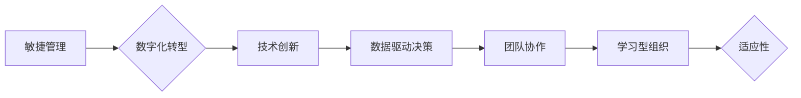

                 

## 管理者如何应对快速变化的商业环境

> 关键词：敏捷管理、数字化转型、技术创新、数据驱动决策、团队协作、适应性、学习型组织、未来趋势

## 1. 背景介绍

当今世界，商业环境变化之快令人目眩。新兴技术、市场需求的波动、全球化竞争加剧，都对企业提出了前所未有的挑战。传统的管理模式和思维方式已难以适应这种快速变化的节奏，企业需要拥抱新的理念和方法，才能在激烈的竞争中立于不败之地。

对于管理者而言，应对快速变化的商业环境是至关重要的生存技能。他们需要具备敏锐的洞察力，及时识别趋势和机会；需要灵活的决策能力，快速调整策略和行动；需要强大的领导力，带领团队克服挑战，实现持续发展。

## 2. 核心概念与联系

**2.1 敏捷管理**

敏捷管理是一种以迭代和协作为核心的管理方法，强调快速响应变化、持续改进和客户价值最大化。它源于软件开发领域，但其核心价值观和原则已逐渐被广泛应用于各个行业。

**2.2 数字化转型**

数字化转型是指企业利用数字化技术和手段，重构业务模式、优化运营流程、提升客户体验和创造新的价值。它涉及到各个层面，包括组织架构、流程管理、技术基础设施、数据分析和人才培养。

**2.3 技术创新**

技术创新是企业持续发展的动力源泉。它需要企业不断探索新的技术、应用新技术、开发新产品和服务，以满足不断变化的市场需求和客户期望。

**2.4 数据驱动决策**

数据驱动决策是指利用数据分析和洞察，为决策提供科学依据。在数据爆炸的时代，企业需要建立完善的数据收集、存储、分析和应用体系，才能做出更准确、更有效的决策。

**2.5 团队协作**

团队协作是企业应对快速变化的商业环境的关键。它需要企业建立高效的沟通机制、营造良好的合作氛围、激发团队成员的创造力和协作精神。

**2.6 学习型组织**

学习型组织是指能够持续学习、适应和改进的组织。它需要企业建立学习文化、鼓励员工学习和成长、促进知识共享和经验积累。

**2.7 适应性**

适应性是指企业能够快速调整策略和行动，应对变化的市场环境和客户需求的能力。它需要企业具备敏锐的感知能力、灵活的决策机制和高效的执行力。

**Mermaid 流程图**



## 3. 核心算法原理 & 具体操作步骤

**3.1 算法原理概述**

在快速变化的商业环境中，管理者需要快速分析大量数据，做出明智的决策。数据分析算法可以帮助管理者识别趋势、发现模式、预测未来，从而做出更准确的决策。

**3.2 算法步骤详解**

1. **数据收集:** 收集相关数据，包括内部数据和外部数据。
2. **数据清洗:** 清理数据，去除噪声和异常值。
3. **数据分析:** 使用数据分析算法，例如回归分析、聚类分析、分类分析等，对数据进行分析。
4. **结果解读:** 解释分析结果，并将其转化为可操作的建议。
5. **决策执行:** 根据分析结果，制定决策并执行。

**3.3 算法优缺点**

**优点:**

* 可以帮助管理者快速分析大量数据，识别趋势和模式。
* 可以提高决策的准确性和效率。
* 可以帮助企业更好地了解客户和市场。

**缺点:**

* 需要一定的技术基础，才能理解和应用数据分析算法。
* 数据质量会影响分析结果的准确性。
* 数据分析结果需要结合实际情况进行解读和决策。

**3.4 算法应用领域**

数据分析算法广泛应用于各个行业，例如：

* **金融行业:** 风险评估、欺诈检测、客户画像
* **零售行业:** 商品推荐、库存管理、促销策略
* **医疗行业:** 疾病诊断、药物研发、患者管理
* **制造业:** 质量控制、生产优化、设备维护

## 4. 数学模型和公式 & 详细讲解 & 举例说明

**4.1 数学模型构建**

在数据分析中，数学模型可以用来描述数据之间的关系，并进行预测。常见的数学模型包括线性回归模型、逻辑回归模型、支持向量机模型等。

**4.2 公式推导过程**

例如，线性回归模型的目标是找到一条直线，能够最佳地拟合数据点。模型的公式如下：

$$y = mx + c$$

其中，$y$ 是预测值，$x$ 是输入变量，$m$ 是斜率，$c$ 是截距。

**4.3 案例分析与讲解**

假设我们有一组数据，记录了房屋面积和房屋价格的关系。我们可以使用线性回归模型来预测房屋价格。

首先，我们需要收集数据，并绘制散点图。然后，我们可以使用线性回归算法，找到最佳的直线拟合数据。最后，我们可以使用这个模型来预测新的房屋价格。

## 5. 项目实践：代码实例和详细解释说明

**5.1 开发环境搭建**

可以使用 Python 语言和 Scikit-learn 库来实现数据分析项目。

**5.2 源代码详细实现**

```python
from sklearn.linear_model import LinearRegression
import pandas as pd

# 加载数据
data = pd.read_csv('house_data.csv')

# 训练模型
model = LinearRegression()
model.fit(data[['面积']], data[['价格']])

# 预测价格
new_area = 100
predicted_price = model.predict([[new_area]])
print(predicted_price)
```

**5.3 代码解读与分析**

这段代码首先加载了房屋面积和房屋价格的数据。然后，它使用线性回归模型来训练模型。最后，它使用训练好的模型来预测新的房屋价格。

**5.4 运行结果展示**

运行代码后，会输出预测的房屋价格。

## 6. 实际应用场景

**6.1 市场分析**

数据分析可以帮助企业分析市场趋势、竞争对手情况、客户需求等，从而制定更有效的市场策略。

**6.2 产品开发**

数据分析可以帮助企业了解客户对产品的需求和反馈，从而开发更符合市场需求的产品。

**6.3 运营优化**

数据分析可以帮助企业优化运营流程、提高效率、降低成本。

**6.4 未来应用展望**

随着人工智能和机器学习技术的不断发展，数据分析将在未来发挥更重要的作用。例如，企业可以使用人工智能技术自动分析数据，并生成更精准的预测和建议。

## 7. 工具和资源推荐

**7.1 学习资源推荐**

* **书籍:** 《数据科学实战》、《Python数据分析手册》
* **在线课程:** Coursera、edX、Udacity

**7.2 开发工具推荐**

* **Python:** 数据分析的常用语言
* **Scikit-learn:** 数据分析和机器学习库
* **Pandas:** 数据处理和分析库
* **Matplotlib:** 数据可视化库

**7.3 相关论文推荐**

* 《The Elements of Statistical Learning》
* 《Pattern Recognition and Machine Learning》

## 8. 总结：未来发展趋势与挑战

**8.1 研究成果总结**

数据分析技术已经取得了长足的进步，并在各个行业得到了广泛应用。

**8.2 未来发展趋势**

* 人工智能和机器学习技术的融合将进一步提高数据分析的效率和准确性。
* 数据可视化技术将更加丰富和直观，帮助管理者更好地理解数据。
* 数据分析将更加注重个性化和定制化，满足不同用户的需求。

**8.3 面临的挑战**

* 数据质量问题仍然是一个挑战，需要不断改进数据收集、清洗和处理的方法。
* 数据隐私和安全问题需要得到重视，需要制定相应的法律法规和技术措施。
* 数据分析人才短缺是一个普遍问题，需要加强人才培养和引进。

**8.4 研究展望**

未来，数据分析技术将继续发展，并对商业环境产生更深远的影响。管理者需要不断学习和提升自己的数据分析能力，才能在竞争激烈的市场中立于不败之地。

## 9. 附录：常见问题与解答

**9.1 如何选择合适的算法？**

选择合适的算法取决于具体的业务需求和数据特点。例如，如果需要预测连续变量，可以使用回归算法；如果需要分类数据，可以使用分类算法。

**9.2 如何评估算法的性能？**

可以使用准确率、召回率、F1-score等指标来评估算法的性能。

**9.3 如何处理缺失数据？**

可以使用平均值、中位数或其他方法来填充缺失数据。

**9.4 如何防止过拟合？**

可以使用正则化技术、交叉验证等方法来防止过拟合。


作者：禅与计算机程序设计艺术 / Zen and the Art of Computer Programming 
<end_of_turn>

