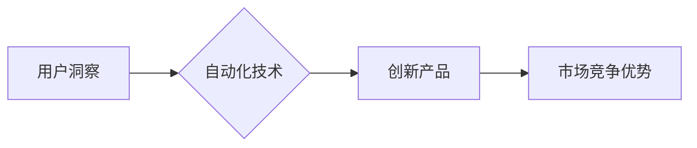

                 

## 自动化创业中的用户洞察与创新

> 关键词：用户洞察、自动化、创业、创新、数据分析、机器学习、人工智能、产品开发

## 1. 背景介绍

在当今数字化时代，创业者面临着前所未有的机遇和挑战。一方面，科技的飞速发展为创业提供了强大的工具和平台，另一方面，市场竞争日益激烈，用户需求日益多元化，创业者需要更加精准地洞察用户需求，并快速迭代创新产品以获得成功。

自动化技术作为科技发展的重要趋势，正在深刻地改变着创业模式和产品开发流程。从自动化的市场调研和用户分析，到自动化的产品设计和测试，自动化技术为创业者提供了高效、精准的工具，帮助他们更快地了解用户需求，并开发出更符合用户期望的产品。

## 2. 核心概念与联系

### 2.1 用户洞察

用户洞察是指通过收集、分析和解读用户行为、需求、痛点等信息，深入了解用户的心理、需求和期望，从而为产品开发和营销提供指导的洞察力。

### 2.2 自动化

自动化是指利用技术手段，使原本需要人工完成的任务自动执行，从而提高效率、降低成本和风险。

### 2.3 创新

创新是指创造出新的产品、服务、商业模式或流程，并将其付诸实践，从而带来新的价值和效益。

**核心概念联系图**



## 3. 核心算法原理 & 具体操作步骤

### 3.1 算法原理概述

在自动化创业中，常用的算法原理包括：

* **机器学习**: 利用算法从数据中学习模式，并根据学习到的模式进行预测或分类。
* **自然语言处理**: 处理和理解人类语言，例如文本分析、情感分析等。
* **数据挖掘**: 从海量数据中发现隐藏的模式和规律。

### 3.2 算法步骤详解

以用户洞察为例，利用机器学习算法进行用户行为分析的具体步骤如下：

1. **数据收集**: 收集用户行为数据，例如用户访问网站的页面、点击的链接、浏览的时间等。
2. **数据预处理**: 对收集到的数据进行清洗、转换和格式化，使其适合机器学习算法的训练。
3. **特征工程**: 从原始数据中提取有价值的特征，例如用户年龄、性别、兴趣爱好等。
4. **模型训练**: 选择合适的机器学习算法，并利用训练数据训练模型。
5. **模型评估**: 利用测试数据评估模型的性能，例如准确率、召回率等。
6. **模型部署**: 将训练好的模型部署到生产环境中，用于实时分析用户行为。

### 3.3 算法优缺点

**优点**:

* 自动化分析用户行为，提高效率和准确性。
* 发现隐藏的模式和趋势，提供更深入的用户洞察。
* 支持数据驱动的决策，降低风险。

**缺点**:

* 需要大量的训练数据，数据质量直接影响模型性能。
* 模型训练和部署需要一定的技术门槛。
* 算法本身存在局限性，无法完全替代人类的判断和理解。

### 3.4 算法应用领域

* **用户画像**: 建立用户画像，了解用户特征、行为和偏好。
* **个性化推荐**: 根据用户喜好推荐相关产品或服务。
* **用户行为分析**: 分析用户行为模式，发现潜在问题和改进机会。
* **市场调研**: 自动化收集和分析市场数据，了解市场趋势和竞争对手情况。

## 4. 数学模型和公式 & 详细讲解 & 举例说明

### 4.1 数学模型构建

用户行为分析模型通常基于概率统计模型，例如贝叶斯网络、隐马尔可夫模型等。

**贝叶斯网络**:

贝叶斯网络是一种概率图模型，用于表示随机变量之间的依赖关系。

**隐马尔可夫模型**:

隐马尔可夫模型是一种用于序列数据建模的概率模型，可以用来预测用户未来的行为。

### 4.2 公式推导过程

由于篇幅限制，此处不再详细推导公式，可参考相关机器学习书籍和论文。

### 4.3 案例分析与讲解

假设我们想要预测用户是否会购买某个产品。我们可以利用用户历史购买记录、浏览记录、评价等数据训练一个分类模型，例如逻辑回归模型。

**逻辑回归模型**:

$$
P(y=1|x) = \frac{1}{1+e^{-(w^Tx+b)}}
$$

其中：

* $P(y=1|x)$ 是用户购买产品的概率。
* $x$ 是用户的特征向量，例如年龄、性别、购买历史等。
* $w$ 是模型参数向量。
* $b$ 是模型偏置项。

通过训练模型，我们可以得到 $w$ 和 $b$ 的值，然后利用这些值预测新用户的购买概率。

## 5. 项目实践：代码实例和详细解释说明

### 5.1 开发环境搭建

* Python 3.x
* Jupyter Notebook
* scikit-learn

### 5.2 源代码详细实现

```python
from sklearn.linear_model import LogisticRegression
from sklearn.model_selection import train_test_split
from sklearn.metrics import accuracy_score

# 加载数据
data = ...

# 分割数据
X_train, X_test, y_train, y_test = train_test_split(data[:, :-1], data[:, -1], test_size=0.2)

# 创建模型
model = LogisticRegression()

# 训练模型
model.fit(X_train, y_train)

# 预测结果
y_pred = model.predict(X_test)

# 计算准确率
accuracy = accuracy_score(y_test, y_pred)
print(f"准确率: {accuracy}")
```

### 5.3 代码解读与分析

* 使用 `train_test_split` 函数将数据分为训练集和测试集。
* 使用 `LogisticRegression` 类创建逻辑回归模型。
* 使用 `fit` 方法训练模型。
* 使用 `predict` 方法预测测试集的标签。
* 使用 `accuracy_score` 函数计算模型的准确率。

### 5.4 运行结果展示

运行结果会显示模型的准确率，例如：

```
准确率: 0.85
```

## 6. 实际应用场景

### 6.1 产品推荐

利用用户行为数据，例如浏览历史、购买记录等，训练推荐模型，为用户推荐个性化的产品。

### 6.2 个性化营销

根据用户画像，例如年龄、性别、兴趣爱好等，进行精准的营销推广，提高营销效果。

### 6.3 用户服务

利用聊天机器人等技术，自动回复用户常见问题，提高用户服务效率。

### 6.4 未来应用展望

随着人工智能技术的不断发展，自动化创业将更加深入地融入到各个环节，例如产品设计、开发、测试、运营等。

## 7. 工具和资源推荐

### 7.1 学习资源推荐

* **书籍**:
    * 《Python机器学习实战》
    * 《深入理解机器学习》
* **在线课程**:
    * Coursera: 机器学习
    * edX: 人工智能

### 7.2 开发工具推荐

* **Python**: 
    * scikit-learn
    * TensorFlow
    * PyTorch
* **数据可视化工具**:
    * Matplotlib
    * Seaborn

### 7.3 相关论文推荐

* **《机器学习》**: Tom Mitchell
* **《深度学习》**: Ian Goodfellow, Yoshua Bengio, Aaron Courville

## 8. 总结：未来发展趋势与挑战

### 8.1 研究成果总结

自动化创业为创业者提供了强大的工具和方法，帮助他们更快地了解用户需求，并开发出更符合用户期望的产品。

### 8.2 未来发展趋势

* **更智能的自动化**: 利用更先进的人工智能算法，实现更智能的自动化，例如自动生成产品原型、自动测试产品功能等。
* **更个性化的体验**: 利用用户数据，为用户提供更个性化的产品和服务体验。
* **更协作的开发**: 利用自动化工具，提高开发团队的协作效率，加速产品开发周期。

### 8.3 面临的挑战

* **数据隐私**: 如何保护用户数据隐私，是自动化创业面临的重要挑战。
* **算法偏见**: 算法本身可能存在偏见，需要不断改进算法模型，避免算法歧视。
* **伦理问题**: 自动化创业可能带来一些伦理问题，例如自动决策的透明度和责任归属等，需要社会共同探讨和解决。

### 8.4 研究展望

未来，自动化创业将继续朝着更智能、更个性化、更协作的方向发展。研究者需要不断探索新的算法和技术，解决自动化创业面临的挑战，并推动自动化创业的健康发展。

## 9. 附录：常见问题与解答

* **Q1: 如何收集用户数据？**

* **A1:** 可以通过网站分析工具、用户行为跟踪、问卷调查等方式收集用户数据。

* **Q2: 如何保证数据安全？**

* **A2:** 需要采取相应的安全措施，例如加密传输、数据脱敏等，保护用户数据安全。

* **Q3: 如何避免算法偏见？**

* **A3:** 需要使用多样化的训练数据，并不断评估和改进算法模型，避免算法歧视。


作者：禅与计算机程序设计艺术 / Zen and the Art of Computer Programming 
<end_of_turn>

