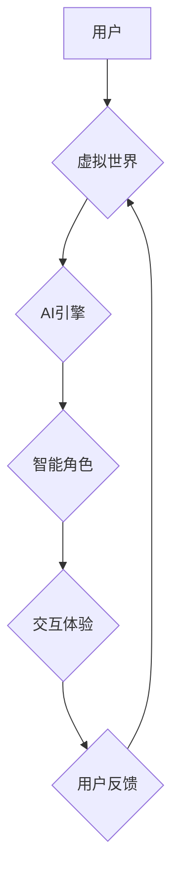

                 

## 虚拟世界编年史：AI创造的架空历史

> 关键词：虚拟现实、人工智能、模拟世界、深度学习、神经网络、虚拟经济、伦理困境

### 1. 背景介绍

人类自古以来就对虚拟世界充满着憧憬。从神话传说中的仙境到科幻小说中的星际旅行，我们一直渴望探索超越现实的全新世界。随着科技的进步，虚拟现实 (VR) 和增强现实 (AR) 技术的蓬勃发展，虚拟世界不再是遥不可及的梦想，而是逐渐成为现实。

然而，仅仅依靠现有的技术，我们只能创造出有限的虚拟体验。真正令人惊叹的虚拟世界，需要具备以下几个关键要素：

* **高度逼真：** 虚拟世界需要能够模拟现实世界中各种感官体验，包括视觉、听觉、触觉、嗅觉和味觉。
* **智能交互：** 虚拟世界中的角色和环境需要具备一定的智能，能够与用户进行自然、流畅的交互。
* **开放性：** 虚拟世界应该是一个开放的平台，用户可以自由地创造、探索和分享。
* **持久性：** 虚拟世界中的变化和事件应该能够持久保存，即使用户离开虚拟世界，这些变化也应该能够保留下来。

这些要素的实现需要突破现有的技术瓶颈，而人工智能 (AI) 正是关键。

### 2. 核心概念与联系

AI 可以赋予虚拟世界以智能，使其更加逼真、交互性更强。

**核心概念：**

* **虚拟世界：** 一个由计算机模拟的虚拟环境，用户可以通过虚拟现实设备或其他方式与之交互。
* **人工智能：** 能够模拟人类智能的行为机器。

**联系：**

AI 可以用于构建虚拟世界中的各种智能角色，例如虚拟助手、NPC (非玩家角色) 和游戏角色。这些角色可以根据用户的行为和对话进行反应，提供更逼真的交互体验。

**Mermaid 流程图：**



### 3. 核心算法原理 & 具体操作步骤

#### 3.1  算法原理概述

构建虚拟世界中的智能角色，需要用到多种 AI 算法，例如：

* **自然语言处理 (NLP)：** 用于理解和生成人类语言，使角色能够与用户进行自然对话。
* **机器学习 (ML)：** 用于训练角色的行为模式和知识库，使其能够做出更智能的反应。
* **深度学习 (DL)：** 用于模拟人类大脑的学习过程，使角色能够学习和进化。

#### 3.2  算法步骤详解

1. **数据收集和预处理：** 收集大量文本数据和交互数据，并进行预处理，例如清洗、标注和格式化。
2. **模型训练：** 使用机器学习算法训练 NLP 模型，例如 BERT 或 GPT-3，使其能够理解和生成人类语言。
3. **知识库构建：** 构建角色的知识库，包含角色的背景信息、技能、兴趣爱好等。
4. **行为模式训练：** 使用机器学习算法训练角色的行为模式，例如对话风格、反应速度、决策机制等。
5. **仿真测试：** 在虚拟环境中进行仿真测试，评估角色的智能水平和交互体验。
6. **模型优化：** 根据测试结果，对模型进行优化，例如调整参数、增加数据、改进算法等。

#### 3.3  算法优缺点

**优点：**

* 可以构建更加逼真的虚拟角色，提供更沉浸式的交互体验。
* 可以根据用户的行为和对话进行个性化定制，提高用户满意度。
* 可以不断学习和进化，使虚拟角色更加智能。

**缺点：**

* 需要大量的训练数据和计算资源。
* 训练过程复杂，需要专业的技术人员。
* 存在伦理风险，例如角色的意识觉醒和行为失控。

#### 3.4  算法应用领域

* **游戏开发：** 构建更加智能和逼真的游戏角色。
* **虚拟助手：** 开发更加智能和人性化的虚拟助手。
* **教育培训：** 创建虚拟场景进行沉浸式教育和培训。
* **医疗保健：** 模拟医疗场景进行手术训练和疾病诊断。

### 4. 数学模型和公式 & 详细讲解 & 举例说明

#### 4.1  数学模型构建

虚拟世界中的智能角色可以被建模为一个复杂的动态系统，其行为可以由一系列数学公式和模型来描述。例如，角色的决策过程可以被建模为一个马尔可夫决策过程 (MDP)，其中角色在不同的状态下选择不同的动作，以最大化其奖励。

#### 4.2  公式推导过程

MDP 的核心公式是 Bellman 方程，它描述了角色在不同状态下选择不同动作的期望回报。

$$
V(s) = \max_a \sum_{s'} P(s' | s, a) [R(s, a, s') + \gamma V(s')]
$$

其中：

* $V(s)$ 是角色在状态 $s$ 下的期望回报。
* $a$ 是角色可以选择的动作。
* $s'$ 是角色在执行动作 $a$ 后可能进入的下一个状态。
* $P(s' | s, a)$ 是角色从状态 $s$ 执行动作 $a$ 后进入状态 $s'$ 的概率。
* $R(s, a, s')$ 是角色在状态 $s$ 执行动作 $a$ 后进入状态 $s'$ 的奖励。
* $\gamma$ 是折扣因子，用于权衡未来回报与当前回报。

#### 4.3  案例分析与讲解

例如，在一个简单的虚拟世界中，角色可以选择向左或向右移动。每个方向都有不同的奖励和风险。通过使用 Bellman 方程，我们可以计算出角色在每个状态下选择哪个方向可以获得最大的期望回报。

### 5. 项目实践：代码实例和详细解释说明

#### 5.1  开发环境搭建

构建虚拟世界中的智能角色，需要使用 Python 语言和相关的 AI 库，例如 TensorFlow 或 PyTorch。

#### 5.2  源代码详细实现

```python
import tensorflow as tf

# 定义模型结构
model = tf.keras.Sequential([
    tf.keras.layers.Embedding(input_dim=vocab_size, output_dim=embedding_dim),
    tf.keras.layers.LSTM(units=128),
    tf.keras.layers.Dense(units=vocab_size, activation='softmax')
])

# 编译模型
model.compile(optimizer='adam', loss='sparse_categorical_crossentropy', metrics=['accuracy'])

# 训练模型
model.fit(train_data, train_labels, epochs=10)

# 评估模型
loss, accuracy = model.evaluate(test_data, test_labels)
print('Loss:', loss)
print('Accuracy:', accuracy)
```

#### 5.3  代码解读与分析

这段代码定义了一个基于 LSTM 的文本生成模型，用于训练虚拟角色的对话能力。

* `Embedding` 层将单词转换为向量表示。
* `LSTM` 层用于学习文本序列的上下文信息。
* `Dense` 层用于预测下一个单词。

#### 5.4  运行结果展示

训练完成后，我们可以使用模型生成虚拟角色的对话文本。

### 6. 实际应用场景

#### 6.1  游戏开发

AI 可以用于构建更加智能和逼真的游戏角色，例如：

* **NPC (非玩家角色)：** 拥有更逼真的对话和行为模式，能够与玩家进行互动和合作。
* **游戏 AI 敌人：** 能够根据玩家的策略和行为进行调整，提供更具挑战性的游戏体验。

#### 6.2  虚拟助手

AI 可以用于开发更加智能和人性化的虚拟助手，例如：

* **聊天机器人：** 能够理解用户的自然语言指令，并提供相应的帮助和服务。
* **虚拟客服：** 能够自动回答用户的常见问题，提高客户服务效率。

#### 6.3  教育培训

AI 可以用于创建虚拟场景进行沉浸式教育和培训，例如：

* **虚拟实验室：** 能够模拟真实的实验环境，让学生进行安全和便捷的实验操作。
* **虚拟课堂：** 能够提供个性化的学习内容和互动体验，提高学生的学习兴趣和效果。

#### 6.4  未来应用展望

随着 AI 技术的不断发展，虚拟世界将拥有更加丰富的应用场景，例如：

* **虚拟经济：** 构建虚拟世界中的经济系统，让用户可以进行虚拟交易和投资。
* **虚拟社会：** 构建虚拟世界中的社会系统，让用户可以与其他用户进行社交互动和合作。
* **虚拟艺术：** 创作虚拟世界中的艺术作品，例如虚拟音乐、虚拟绘画和虚拟雕塑。

### 7. 工具和资源推荐

#### 7.1  学习资源推荐

* **Stanford CS224N: Natural Language Processing with Deep Learning:** https://web.stanford.edu/class/cs224n/
* **Deep Learning Specialization by Andrew Ng:** https://www.deeplearning.ai/

#### 7.2  开发工具推荐

* **TensorFlow:** https://www.tensorflow.org/
* **PyTorch:** https://pytorch.org/

#### 7.3  相关论文推荐

* **Attention Is All You Need:** https://arxiv.org/abs/1706.03762
* **Generative Pre-trained Transformer 3 (GPT-3):** https://openai.com/blog/gpt-3/

### 8. 总结：未来发展趋势与挑战

#### 8.1  研究成果总结

AI 技术的进步为构建虚拟世界提供了强大的工具，使虚拟世界更加逼真、智能和开放。

#### 8.2  未来发展趋势

未来，虚拟世界将朝着以下几个方向发展：

* **更加逼真的感官体验：** 利用 VR 和 AR 技术，提供更加逼真的视觉、听觉、触觉等感官体验。
* **更加智能的交互体验：** 利用深度学习和自然语言处理技术，使虚拟角色更加智能，能够理解和响应用户的复杂指令。
* **更加开放的虚拟世界：** 构建更加开放的虚拟世界平台，让用户可以自由地创造、探索和分享。

#### 8.3  面临的挑战

虚拟世界的发展也面临着一些挑战：

* **伦理困境：** 虚拟世界中的智能角色可能会出现意识觉醒和行为失控等伦理问题。
* **技术瓶颈：** 构建更加逼真和智能的虚拟世界需要突破现有的技术瓶颈。
* **社会影响：** 虚拟世界可能会对现实社会产生一些负面影响，例如虚拟成瘾和社会隔离。

#### 8.4  研究展望

未来，我们需要更加深入地研究虚拟世界的伦理、社会和技术问题，确保虚拟世界能够健康、可持续地发展。

### 9. 附录：常见问题与解答

**Q1：虚拟世界和现实世界有什么区别？**

**A1：** 虚拟世界是由计算机模拟的，而现实世界是真实的。虚拟世界可以模拟各种不同的环境和场景，而现实世界则受到物理定律的限制。

**Q2：AI 如何赋予虚拟世界智能？**

**A2：** AI 可以通过学习和模仿人类的行为，赋予虚拟世界智能。例如，可以使用机器学习算法训练虚拟角色的对话能力和决策机制。

**Q3：虚拟世界会取代现实世界吗？**

**A3：** 虚拟世界和现实世界是互补的，而不是替代的。虚拟世界可以提供一种新的体验和可能性，但它不会取代现实世界。

作者：禅与计算机程序设计艺术 / Zen and the Art of Computer Programming


<end_of_turn>

