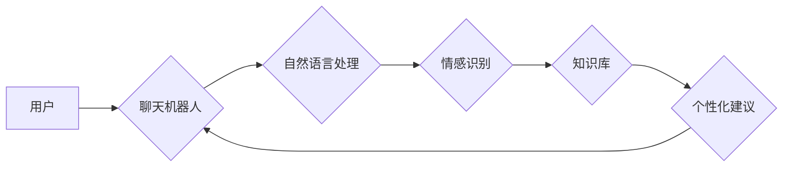

                 

## 虚拟治疗：AI驱动的心理健康服务

> 关键词：人工智能、虚拟治疗、心理健康、自然语言处理、深度学习、情感识别、机器学习、临床诊断

### 1. 背景介绍

心理健康问题已成为全球性的公共卫生挑战，其影响范围广泛，从个人福祉到社会经济发展。传统的心理治疗服务往往面临着诸多瓶颈，例如：

* **资源有限:**  qualified的心理治疗师数量严重不足，尤其是在偏远地区和发展中国家。
* **成本高昂:**  心理治疗的费用通常很高，难以负担普通大众。
* **时间限制:**  传统的面对面治疗需要患者腾出大量时间，难以适应现代快节奏的生活。

随着人工智能技术的飞速发展，虚拟治疗逐渐成为一种备受关注的解决方案。虚拟治疗利用人工智能技术，提供便捷、高效、可负担的线上心理健康服务。

### 2. 核心概念与联系

虚拟治疗的核心概念是利用人工智能技术模拟人类心理治疗师的角色，通过与患者进行交互，提供心理支持、情感疏导、认知行为疗法等服务。

**架构图:**



**核心概念:**

* **聊天机器人:**  虚拟治疗的核心组件，负责与用户进行文本或语音交互。
* **自然语言处理 (NLP):**  使聊天机器人能够理解和处理用户的自然语言输入。
* **情感识别:**  分析用户的文本或语音表达，识别其情感状态。
* **知识库:**  包含心理健康相关知识、治疗方法和案例，为聊天机器人提供参考依据。
* **个性化建议:**  根据用户的需求和情况，提供个性化的治疗建议和支持。

### 3. 核心算法原理 & 具体操作步骤

#### 3.1  算法原理概述

虚拟治疗的核心算法主要包括自然语言处理、情感识别和机器学习。

* **自然语言处理 (NLP):**  利用统计模型和机器学习算法，使计算机能够理解和处理人类语言。
* **情感识别:**  利用机器学习算法，从文本或语音中识别用户的感情状态，例如快乐、悲伤、愤怒等。
* **机器学习:**  通过训练模型，使虚拟治疗系统能够从海量数据中学习，并提供更精准、个性化的服务。

#### 3.2  算法步骤详解

1. **数据收集:**  收集大量的心理健康相关数据，包括患者的病历、治疗记录、聊天记录等。
2. **数据预处理:**  对收集到的数据进行清洗、格式化和标注，使其能够被算法模型所理解。
3. **模型训练:**  利用机器学习算法，训练 NLP、情感识别和个性化建议模型。
4. **模型评估:**  评估模型的性能，并进行调整和优化。
5. **系统部署:**  将训练好的模型部署到虚拟治疗系统中。
6. **用户交互:**  用户通过聊天机器人与系统进行交互，系统根据用户的输入，提供相应的治疗建议和支持。

#### 3.3  算法优缺点

**优点:**

* **便捷高效:**  用户随时随地可以通过手机或电脑访问虚拟治疗服务。
* **可负担性高:**  虚拟治疗的成本通常低于传统心理治疗。
* **数据驱动:**  虚拟治疗系统可以利用数据分析，提供更精准、个性化的服务。

**缺点:**

* **缺乏人际互动:**  虚拟治疗无法完全替代面对面的治疗，缺乏人际情感的连接。
* **技术限制:**  当前的 AI 技术还无法完全理解和处理复杂的人类情感。
* **伦理问题:**  虚拟治疗的应用引发了一些伦理问题，例如数据隐私、责任归属等。

#### 3.4  算法应用领域

虚拟治疗的应用领域非常广泛，包括：

* **抑郁症治疗:**  提供情绪监测、认知行为疗法和自我帮助工具。
* **焦虑症治疗:**  帮助用户放松身心、缓解焦虑情绪。
* **压力管理:**  提供压力应对策略和放松技巧。
* **睡眠障碍治疗:**  帮助用户改善睡眠质量。
* ** substance abuse treatment:**  提供戒毒支持和心理辅导。

### 4. 数学模型和公式 & 详细讲解 & 举例说明

#### 4.1  数学模型构建

虚拟治疗系统中常用的数学模型包括：

* **情感识别模型:**  通常使用深度学习算法，例如卷积神经网络 (CNN) 和循环神经网络 (RNN)，对文本或语音数据进行情感分类。
* **个性化建议模型:**  可以使用推荐系统算法，例如协同过滤和内容过滤，根据用户的历史数据和偏好，提供个性化的治疗建议。

#### 4.2  公式推导过程

情感识别模型的训练过程通常使用交叉熵损失函数，其公式如下：

$$
L = -\sum_{i=1}^{N} y_i \log(\hat{y}_i)
$$

其中：

* $L$ 为损失函数值
* $N$ 为样本数量
* $y_i$ 为真实标签
* $\hat{y}_i$ 为模型预测的概率

#### 4.3  案例分析与讲解

假设我们训练了一个情感识别模型，用于识别用户文本中的情感类别 (积极、消极、中性)。

* 用户输入: "今天感觉很开心，一切都顺利。"
* 模型预测: 积极 (概率为 0.9)

在这个例子中，模型根据用户的文本内容，预测其情感类别为积极，并且预测的概率为 0.9，说明模型对用户的输入有较高的置信度。

### 5. 项目实践：代码实例和详细解释说明

#### 5.1  开发环境搭建

虚拟治疗系统的开发环境通常包括：

* **操作系统:**  Windows、Linux 或 macOS
* **编程语言:**  Python、Java 或 C++
* **深度学习框架:**  TensorFlow、PyTorch 或 Keras
* **自然语言处理库:**  NLTK、spaCy 或 Gensim

#### 5.2  源代码详细实现

以下是一个使用 Python 和 TensorFlow 实现简单的虚拟治疗聊天机器人的代码示例：

```python
import tensorflow as tf

# 定义情感识别模型
model = tf.keras.models.Sequential([
  tf.keras.layers.Embedding(input_dim=10000, output_dim=128),
  tf.keras.layers.LSTM(units=64),
  tf.keras.layers.Dense(units=3, activation='softmax')
])

# 训练模型
model.compile(optimizer='adam',
              loss='sparse_categorical_crossentropy',
              metrics=['accuracy'])

# 加载训练数据
(x_train, y_train), (x_test, y_test) = load_data()

# 训练模型
model.fit(x_train, y_train, epochs=10)

# 预测用户输入的情感
def predict_emotion(text):
  # 预处理文本
  processed_text = preprocess_text(text)
  # 预测情感
  prediction = model.predict(processed_text)
  # 返回情感类别
  return tf.math.argmax(prediction).numpy()

# 用户输入
user_input = "今天感觉很开心"

# 预测情感
emotion = predict_emotion(user_input)

# 输出结果
print(f"用户输入: {user_input}")
print(f"预测情感: {emotion}")
```

#### 5.3  代码解读与分析

这段代码定义了一个简单的虚拟治疗聊天机器人，它使用 TensorFlow 框架构建了一个情感识别模型。

* **模型定义:**  模型使用 Embedding 层将文本单词转换为向量表示，然后使用 LSTM 层捕捉文本序列中的上下文信息，最后使用 Dense 层进行情感分类。
* **模型训练:**  模型使用 Adam 优化器和交叉熵损失函数进行训练，并使用准确率作为评估指标。
* **情感预测:**  `predict_emotion` 函数负责预测用户输入的情感类别。

#### 5.4  运行结果展示

当用户输入 "今天感觉很开心" 时，模型会预测其情感类别为积极。

### 6. 实际应用场景

虚拟治疗已经开始在一些实际应用场景中得到应用，例如：

* **在线心理咨询平台:**  一些在线心理咨询平台已经开始使用虚拟治疗机器人，为用户提供初步的心理支持和建议。
* **移动应用程序:**  一些移动应用程序提供虚拟治疗服务，帮助用户管理压力、焦虑和抑郁情绪。
* **企业健康管理:**  一些企业开始使用虚拟治疗系统，为员工提供心理健康支持和干预。

### 6.4  未来应用展望

未来，虚拟治疗有望在以下方面得到更广泛的应用：

* **个性化治疗:**  随着人工智能技术的进步，虚拟治疗系统将能够提供更加个性化的治疗方案，根据用户的具体情况提供定制化的建议和支持。
* **远程医疗:**  虚拟治疗可以帮助解决医疗资源短缺的问题，为偏远地区和发展中国家的人们提供心理健康服务。
* **早期干预:**  虚拟治疗可以用于早期识别和干预心理健康问题，帮助人们在问题出现之前就得到帮助。

### 7. 工具和资源推荐

#### 7.1  学习资源推荐

* **在线课程:**  Coursera、edX 和 Udacity 等平台提供人工智能、自然语言处理和机器学习相关的在线课程。
* **书籍:**  《深度学习》、《自然语言处理实战》等书籍可以帮助读者深入了解相关知识。
* **开源项目:**  Hugging Face、TensorFlow Hub 等平台提供许多开源的 AI 模型和工具。

#### 7.2  开发工具推荐

* **编程语言:**  Python 是 AI 开发最常用的编程语言。
* **深度学习框架:**  TensorFlow、PyTorch 和 Keras 是常用的深度学习框架。
* **自然语言处理库:**  NLTK、spaCy 和 Gensim 是常用的自然语言处理库。

#### 7.3  相关论文推荐

* **Attention Is All You Need:**  Transformer 模型的开创性论文。
* **BERT: Pre-training of Deep Bidirectional Transformers for Language Understanding:**  BERT 模型的论文。
* **GPT-3: Language Models are Few-Shot Learners:**  GPT-3 模型的论文。

### 8. 总结：未来发展趋势与挑战

#### 8.1  研究成果总结

虚拟治疗是人工智能在医疗领域的应用之一，它利用 AI 技术提供便捷、高效、可负担的心理健康服务。

#### 8.2  未来发展趋势

未来，虚拟治疗将朝着以下方向发展：

* **更精准的个性化治疗:**  利用大数据和机器学习，为每个用户提供更加精准的治疗方案。
* **更丰富的服务内容:**  提供更多类型的治疗服务，例如认知行为疗法、人际关系治疗等。
* **更强的交互体验:**  利用虚拟现实 (VR) 和增强现实 (AR) 技术，提供更沉浸式的治疗体验。

#### 8.3  面临的挑战

虚拟治疗也面临着一些挑战：

* **技术限制:**  当前的 AI 技术还无法完全理解和处理复杂的人类情感。
* **伦理问题:**  虚拟治疗的应用引发了一些伦理问题，例如数据隐私、责任归属等。
* **监管政策:**  虚拟治疗的监管政策尚不完善，需要进一步的规范和指导。

#### 8.4  研究展望

未来，需要进一步研究虚拟治疗的有效性、安全性、伦理性和可持续性，并制定相应的监管政策，推动虚拟治疗的健康发展。

### 9. 附录：常见问题与解答

**常见问题:**

* **虚拟治疗可以替代传统心理治疗吗？**

虚拟治疗可以提供一些心理支持和建议，但它无法完全替代传统心理治疗。传统心理治疗需要面对面的互动，才能更深入地了解患者的心理状态，并提供更有效的治疗方案。

* **虚拟治疗的安全性和隐私性如何保证？**

虚拟治疗平台需要采取严格的安全措施，保护用户的个人信息和隐私。

* **虚拟治疗的成本如何？**

虚拟治疗的成本通常低于传统心理治疗，但具体价格取决于平台和服务内容。


作者：禅与计算机程序设计艺术 / Zen and the Art of Computer Programming 
<end_of_turn>

