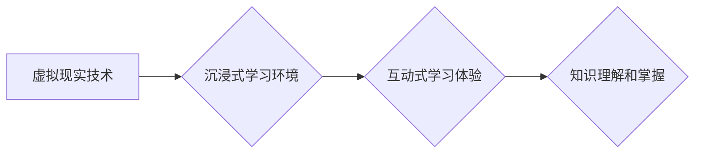

                 

## 虚拟现实教育创业：沉浸式学习体验

> 关键词：虚拟现实、教育科技、沉浸式学习、交互式体验、游戏化学习、元宇宙教育

## 1. 背景介绍

教育领域正在经历一场前所未有的变革，而虚拟现实（VR）技术正成为这场变革的引擎之一。VR技术能够创造逼真的虚拟环境，让用户身临其境地体验不同的场景和内容，为教育带来前所未有的沉浸式学习体验。

传统的教育模式往往局限于课堂和教材，缺乏互动性和趣味性，难以激发学生的学习兴趣。而VR技术则打破了这些局限，为学生提供了一个全新的学习空间，让他们能够通过互动和体验来理解和掌握知识。

近年来，VR技术在教育领域的应用越来越广泛，从科学实验到历史模拟，从语言学习到艺术创作，VR都为教育提供了无限的可能性。

## 2. 核心概念与联系

### 2.1 虚拟现实（VR）

虚拟现实是指利用计算机技术模拟真实环境或虚构环境，并通过头戴式显示器、手柄等设备，让用户沉浸其中，体验身临其境的感觉。VR技术主要包括以下几个方面：

* **3D图形渲染：** 创建逼真的虚拟环境和物体。
* **头戴式显示器：** 提供沉浸式的视觉体验。
* **传感器追踪：** 跟踪用户的动作和位置，实现虚拟环境的交互。
* **音频技术：** 提供逼真的声音效果，增强沉浸感。

### 2.2 沉浸式学习

沉浸式学习是指通过创造逼真的虚拟环境，让学生身临其境地体验学习内容，从而提高学习兴趣和效果的一种教学方法。沉浸式学习的特点包括：

* **身临其境：** 学生能够身临其境地体验虚拟环境，增强学习的真实感。
* **互动性强：** 学生能够与虚拟环境进行互动，主动参与学习过程。
* **个性化定制：** 虚拟环境可以根据学生的学习进度和需求进行个性化定制。

### 2.3  VR在教育中的应用

VR技术在教育领域的应用非常广泛，例如：

* **科学实验：** 学生可以在虚拟环境中进行危险或昂贵的实验，例如模拟化学反应或解剖人体。
* **历史模拟：** 学生可以身临其境地体验历史事件，例如参观古罗马或参加美国独立战争。
* **语言学习：** 学生可以与虚拟角色进行对话练习，沉浸式地学习外语。
* **艺术创作：** 学生可以利用VR工具进行3D建模、绘画和音乐创作。

**核心概念与架构流程图**



## 3. 核心算法原理 & 具体操作步骤

### 3.1 算法原理概述

VR教育的核心算法主要包括：

* **3D建模算法：** 用于创建虚拟环境和物体。
* **渲染算法：** 用于将3D模型渲染成图像，并显示在头戴式显示器上。
* **传感器追踪算法：** 用于跟踪用户的动作和位置，并更新虚拟环境中的用户角色。
* **交互算法：** 用于处理用户的输入，并与虚拟环境进行交互。

### 3.2 算法步骤详解

1. **3D建模：** 使用3D建模软件创建虚拟环境和物体，并定义其属性，例如材质、纹理和灯光。
2. **场景搭建：** 将3D模型导入到VR引擎中，并搭建虚拟场景，包括环境、物体和用户角色。
3. **渲染：** VR引擎根据用户的视角和位置，渲染虚拟场景，并将图像显示在头戴式显示器上。
4. **传感器追踪：** 使用传感器追踪用户的动作和位置，并更新虚拟环境中的用户角色。
5. **交互：** 处理用户的输入，例如手柄操作或语音指令，并与虚拟环境进行交互，例如移动物体、触发事件或与虚拟角色对话。

### 3.3 算法优缺点

**优点：**

* **沉浸式体验：** VR技术能够创造逼真的虚拟环境，让用户身临其境地体验学习内容。
* **互动性强：** 学生能够与虚拟环境进行互动，主动参与学习过程。
* **个性化定制：** 虚拟环境可以根据学生的学习进度和需求进行个性化定制。

**缺点：**

* **成本高昂：** VR设备和软件成本较高，难以普及。
* **技术门槛高：** 开发VR教育内容需要专业的技术人员和技能。
* **晕动症：** 一些用户在使用VR设备时可能会出现晕动症。

### 3.4 算法应用领域

VR教育技术在以下领域具有广泛的应用前景：

* **K-12教育：** 增强课堂教学的互动性和趣味性，提高学生的学习兴趣和效果。
* **高等教育：** 提供沉浸式的实验和模拟体验，帮助学生理解复杂的理论知识。
* **职业培训：** 模拟真实的工作环境，帮助员工进行技能培训和职业发展。
* **特殊教育：** 为残障学生提供个性化的学习体验，帮助他们克服学习障碍。

## 4. 数学模型和公式 & 详细讲解 & 举例说明

### 4.1 数学模型构建

VR教育中的数学模型主要用于描述虚拟环境中的物体运动、用户交互和视觉效果。常见的数学模型包括：

* **3D坐标系：** 用于描述虚拟环境中的物体位置和方向。
* **线性代数：** 用于处理物体变换、旋转和缩放。
* **三角函数：** 用于计算物体之间的距离和角度。
* **光线追踪：** 用于模拟光线在虚拟环境中的传播，实现逼真的阴影和反射效果。

### 4.2 公式推导过程

例如，计算两个物体之间的距离可以使用欧几里得距离公式：

$$d = \sqrt{(x_2 - x_1)^2 + (y_2 - y_1)^2 + (z_2 - z_1)^2}$$

其中，$(x_1, y_1, z_1)$ 和 $(x_2, y_2, z_2)$ 分别表示两个物体的坐标。

### 4.3 案例分析与讲解

例如，在VR游戏中，可以使用线性代数来实现角色的移动和旋转。

假设角色的初始位置为 $(x_0, y_0, z_0)$，移动方向为 $(dx, dy, dz)$，移动距离为 $d$。

则角色的最终位置为：

$$(x_f, y_f, z_f) = (x_0 + dx * d, y_0 + dy * d, z_0 + dz * d)$$

## 5. 项目实践：代码实例和详细解释说明

### 5.1 开发环境搭建

开发VR教育项目需要搭建相应的开发环境，包括：

* **VR引擎：** 例如Unity、Unreal Engine等。
* **编程语言：** 例如C#、C++等。
* **3D建模软件：** 例如Blender、Maya等。
* **头戴式显示器：** 例如Oculus Rift、HTC Vive等。

### 5.2 源代码详细实现

以下是一个简单的VR教育项目代码示例，使用Unity引擎实现一个简单的虚拟球体交互：

```csharp
using UnityEngine;

public class VRInteraction : MonoBehaviour
{
    public float speed = 5f;

    void Update()
    {
        // 获取用户的控制器位置
        Vector3 controllerPosition = OVRInput.GetLocalControllerPosition(OVRInput.Controller.LTouch);

        // 计算球体与控制器的距离
        float distance = Vector3.Distance(transform.position, controllerPosition);

        // 如果距离小于一定阈值，则旋转球体
        if (distance < 1f)
        {
            transform.Rotate(Vector3.up * speed * Time.deltaTime);
        }
    }
}
```

### 5.3 代码解读与分析

这段代码实现了简单的VR球体交互功能。

* `OVRInput.GetLocalControllerPosition(OVRInput.Controller.LTouch)` 获取左手的控制器位置。
* `Vector3.Distance()` 计算球体与控制器的距离。
* 如果距离小于1米，则使用 `transform.Rotate()` 函数旋转球体。

### 5.4 运行结果展示

运行这段代码后，用户可以使用左手的控制器靠近球体，球体就会开始旋转。

## 6. 实际应用场景

### 6.1 科研教育

VR技术可以为学生提供沉浸式的科学实验体验，例如模拟化学反应、解剖人体或探索宇宙。

### 6.2 历史文化教育

VR技术可以将历史事件和文化遗址还原成虚拟场景，让学生身临其境地体验历史和文化。

### 6.3 艺术设计教育

VR技术可以为学生提供虚拟创作空间，让他们利用3D建模、绘画和音乐创作工具进行艺术设计创作。

### 6.4 未来应用展望

随着VR技术的不断发展，其在教育领域的应用将更加广泛和深入。例如：

* **元宇宙教育：** 将VR技术与元宇宙概念结合，构建沉浸式的虚拟学习环境，提供更加丰富的学习体验。
* **人工智能辅助教育：** 利用人工智能技术，为学生提供个性化的学习路径和辅导，提高学习效率。
* **跨文化交流：** VR技术可以打破地域限制，让学生与来自不同国家的学习伙伴进行虚拟交流，促进跨文化理解。

## 7. 工具和资源推荐

### 7.1 学习资源推荐

* **Unity Learn：** https://learn.unity.com/
* **Unreal Engine Learning：** https://www.unrealengine.com/en-US/learn
* **VR/AR Association：** https://www.vrarassociation.com/

### 7.2 开发工具推荐

* **Unity：** https://unity.com/
* **Unreal Engine：** https://www.unrealengine.com/
* **Blender：** https://www.blender.org/

### 7.3 相关论文推荐

* **Immersive Virtual Reality for Education: A Systematic Review**
* **The Impact of Virtual Reality on Learning and Education**
* **Virtual Reality in Education: A Review of the Literature**

## 8. 总结：未来发展趋势与挑战

### 8.1 研究成果总结

VR教育技术在近年来取得了显著的进展，为教育领域带来了新的可能性。VR技术能够创造沉浸式的学习体验，提高学生的学习兴趣和效果。

### 8.2 未来发展趋势

未来，VR教育技术将朝着以下方向发展：

* **更加逼真的虚拟环境：** 利用更先进的渲染技术和传感器追踪技术，创造更加逼真的虚拟环境。
* **更加个性化的学习体验：** 利用人工智能技术，为学生提供更加个性化的学习路径和辅导。
* **更加广泛的应用场景：** VR技术将应用于更多教育领域，例如职业培训、特殊教育等。

### 8.3 面临的挑战

VR教育技术也面临着一些挑战：

* **成本高昂：** VR设备和软件成本较高，难以普及。
* **技术门槛高：** 开发VR教育内容需要专业的技术人员和技能。
* **晕动症：** 一些用户在使用VR设备时可能会出现晕动症。

### 8.4 研究展望

未来，需要进一步研究VR教育技术的应用效果、用户体验和伦理问题，并探索如何降低成本、降低技术门槛和解决晕动症等问题，推动VR教育技术更加广泛地应用于教育领域。

## 9. 附录：常见问题与解答

**Q1：VR教育技术是否真的能够提高学习效果？**

A1：研究表明，VR教育技术能够提高学生的学习兴趣、参与度和知识掌握程度。

**Q2：VR教育技术有哪些应用场景？**

A2：VR教育技术可以应用于各种教育领域，例如科学实验、历史文化教育、艺术设计教育等。

**Q3：如何开发VR教育内容？**

A3：开发VR教育内容需要学习VR引擎、编程语言和3D建模软件等相关知识。

**作者：禅与计算机程序设计艺术 / Zen and the Art of Computer Programming**


<end_of_turn>

