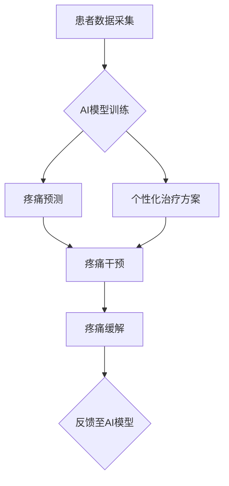

                 

## 虚拟疼痛管理：AI辅助的痛觉调节

> 关键词：人工智能、疼痛管理、神经网络、深度学习、生物反馈、虚拟现实、情感计算

### 1. 背景介绍

疼痛是人类生活中不可避免的一部分，它可以是剧烈的，也可以是持续的，对个体的生理和心理健康都造成严重影响。传统疼痛管理方法，如药物治疗和物理治疗，虽然有一定的效果，但往往存在副作用、耐药性等问题，并且无法完全解决疼痛问题。

近年来，人工智能（AI）技术飞速发展，为疼痛管理领域带来了新的希望。AI算法能够分析海量医疗数据，识别疼痛模式，预测疼痛发生和加重，并提供个性化的治疗方案。结合虚拟现实（VR）和生物反馈技术，AI可以构建沉浸式的虚拟环境，帮助患者转移注意力，放松身心，从而减轻疼痛感。

### 2. 核心概念与联系

**2.1 痛觉机制**

痛觉是一种复杂的生理过程，涉及到多种神经元、激素和化学物质。当身体受到伤害时，伤害信号会通过神经元传递到大脑，大脑会对这些信号进行解读，产生疼痛的感觉。

**2.2 人工智能在疼痛管理中的应用**

AI技术可以应用于各个阶段的疼痛管理，包括：

* **疼痛预测:** 利用机器学习算法分析患者的历史医疗数据，预测疼痛发生和加重的时间和程度。
* **疼痛诊断:** 基于图像识别和自然语言处理技术，辅助医生诊断疼痛的类型和原因。
* **个性化治疗方案:** 根据患者的疼痛类型、病史、生活习惯等因素，制定个性化的治疗方案。
* **疼痛监测:** 利用生物传感器监测患者的生理指标，如心率、血压、皮肤温度等，实时评估疼痛程度。
* **疼痛干预:** 利用VR技术构建沉浸式的虚拟环境，帮助患者转移注意力，放松身心，减轻疼痛感。

**2.3  AI辅助疼痛管理架构**



### 3. 核心算法原理 & 具体操作步骤

**3.1 算法原理概述**

在虚拟疼痛管理中，常用的AI算法包括：

* **深度学习:** 深度学习算法能够从海量数据中学习复杂的特征，用于疼痛预测、诊断和个性化治疗方案制定。
* **强化学习:** 强化学习算法可以训练AI代理，使其能够在虚拟环境中学习最佳的疼痛干预策略。
* **自然语言处理:** 自然语言处理算法可以分析患者的文字描述，识别疼痛的类型和程度。

**3.2 算法步骤详解**

以深度学习算法为例，其具体操作步骤如下：

1. **数据收集:** 收集患者的医疗数据，包括疼痛日记、生理指标、影像数据等。
2. **数据预处理:** 对收集到的数据进行清洗、转换和特征提取。
3. **模型训练:** 使用深度学习算法训练模型，使其能够从数据中学习疼痛的模式和规律。
4. **模型评估:** 使用测试数据评估模型的性能，并进行调优。
5. **模型部署:** 将训练好的模型部署到实际应用场景中，用于疼痛预测、诊断和个性化治疗方案制定。

**3.3 算法优缺点**

**优点:**

* 能够从海量数据中学习复杂的特征，提高预测和诊断的准确性。
* 可以根据患者的个体差异，制定个性化的治疗方案。
* 能够实时监测患者的疼痛程度，并根据需要调整治疗方案。

**缺点:**

* 需要大量的训练数据，否则模型性能会下降。
* 训练深度学习模型需要大量的计算资源和时间。
* 模型的解释性较差，难以理解模型是如何做出决策的。

**3.4 算法应用领域**

AI辅助的疼痛管理技术可以应用于多种领域，包括：

* **慢性疼痛管理:** 帮助患者管理慢性疼痛，提高生活质量。
* **术后疼痛管理:** 减少术后疼痛，缩短恢复时间。
* **癌症疼痛管理:** 缓解癌症患者的疼痛，提高生活质量。
* **神经痛管理:** 治疗神经痛，减轻患者的痛苦。

### 4. 数学模型和公式 & 详细讲解 & 举例说明

**4.1 数学模型构建**

在虚拟疼痛管理中，常用的数学模型包括：

* **疼痛强度模型:** 用于预测患者的疼痛强度，常用的模型包括线性回归模型、支持向量机模型和神经网络模型。
* **疼痛缓解模型:** 用于预测患者对不同疼痛干预方法的反应，常用的模型包括逻辑回归模型和决策树模型。

**4.2 公式推导过程**

以线性回归模型为例，其公式如下：

$$
y = \beta_0 + \beta_1x_1 + \beta_2x_2 + ... + \beta_nx_n + \epsilon
$$

其中：

* $y$ 是疼痛强度
* $x_1, x_2, ..., x_n$ 是患者的特征变量，例如年龄、性别、疼痛类型等
* $\beta_0, \beta_1, \beta_2, ..., \beta_n$ 是模型参数
* $\epsilon$ 是误差项

通过最小二乘法，可以求解模型参数，得到最佳的疼痛强度预测模型。

**4.3 案例分析与讲解**

假设我们收集了100名患者的疼痛日记数据，包括年龄、性别、疼痛类型、疼痛强度等信息。我们可以使用线性回归模型训练一个疼痛强度预测模型。

训练完成后，我们可以使用这个模型预测新患者的疼痛强度。例如，如果一个新患者的年龄为30岁，性别为女性，疼痛类型为头痛，那么我们可以使用模型预测其疼痛强度。

### 5. 项目实践：代码实例和详细解释说明

**5.1 开发环境搭建**

* 操作系统：Windows/macOS/Linux
* Python版本：3.6+
* 必要的库：TensorFlow/PyTorch、NumPy、Pandas、Scikit-learn

**5.2 源代码详细实现**

```python
# 导入必要的库
import tensorflow as tf
from sklearn.model_selection import train_test_split
from sklearn.metrics import mean_squared_error

# 加载数据
data = pd.read_csv('pain_data.csv')

# 分割数据
X = data[['age', 'gender', 'pain_type']]
y = data['pain_intensity']
X_train, X_test, y_train, y_test = train_test_split(X, y, test_size=0.2, random_state=42)

# 创建模型
model = tf.keras.Sequential([
    tf.keras.layers.Dense(64, activation='relu', input_shape=(3,)),
    tf.keras.layers.Dense(32, activation='relu'),
    tf.keras.layers.Dense(1)
])

# 编译模型
model.compile(loss='mse', optimizer='adam')

# 训练模型
model.fit(X_train, y_train, epochs=100, batch_size=32)

# 评估模型
y_pred = model.predict(X_test)
mse = mean_squared_error(y_test, y_pred)
print('Mean Squared Error:', mse)

```

**5.3 代码解读与分析**

* 代码首先导入必要的库，然后加载数据。
* 数据被分割成训练集和测试集。
* 然后，创建一个深度学习模型，该模型包含三个全连接层。
* 模型被编译，使用均方误差作为损失函数，使用Adam优化器。
* 模型被训练，训练过程持续100个epochs，每个batch包含32个样本。
* 最后，模型被评估，使用均方误差来衡量模型的性能。

**5.4 运行结果展示**

运行代码后，会输出模型的均方误差值。

### 6. 实际应用场景

**6.1 慢性疼痛管理**

慢性疼痛患者可以通过VR技术体验沉浸式的虚拟环境，例如海滩、森林等，转移注意力，放松身心，从而减轻疼痛感。AI算法可以根据患者的疼痛日记和生理指标，个性化定制虚拟环境，提高疼痛缓解效果。

**6.2 术后疼痛管理**

术后患者可以通过VR技术体验虚拟的放松场景，例如冥想、瑜伽等，减轻术后疼痛和焦虑。AI算法可以根据患者的术后恢复情况，动态调整虚拟环境和疼痛干预方案，提高疼痛管理效果。

**6.3 未来应用展望**

随着AI技术和VR技术的不断发展，虚拟疼痛管理将有更广泛的应用场景：

* **远程疼痛管理:** 患者可以通过远程医疗平台，使用VR技术和AI算法进行疼痛管理，无需前往医院就诊。
* **个性化疼痛干预:** AI算法可以根据患者的个体差异，制定更精准的疼痛干预方案，提高治疗效果。
* **疼痛预防:** AI算法可以分析患者的风险因素，预测疼痛发生，并提供相应的预防措施。

### 7. 工具和资源推荐

**7.1 学习资源推荐**

* **书籍:**
    * 深度学习
    * 人工智能：一种现代方法
* **在线课程:**
    * Coursera: 深度学习
    * edX: 人工智能
* **博客:**
    * TensorFlow博客
    * PyTorch博客

**7.2 开发工具推荐**

* **Python:** 
* **TensorFlow:** 深度学习框架
* **PyTorch:** 深度学习框架
* **Keras:** 高级API，用于构建和训练深度学习模型

**7.3 相关论文推荐**

* **Deep Learning for Pain Management: A Review**
* **Virtual Reality for Pain Management: A Systematic Review**
* **Artificial Intelligence in Pain Management: Current State and Future Directions**

### 8. 总结：未来发展趋势与挑战

**8.1 研究成果总结**

AI辅助的虚拟疼痛管理技术取得了显著的进展，能够有效减轻患者的疼痛，提高生活质量。

**8.2 未来发展趋势**

* **模型精度提升:** 随着数据量的增加和算法的改进，模型的预测和诊断精度将进一步提高。
* **个性化治疗方案:** AI算法将能够根据患者的个体差异，制定更精准的疼痛干预方案。
* **多模态数据融合:** 将结合多种数据类型，例如图像、语音、生物信号等，构建更全面的疼痛管理模型。

**8.3 面临的挑战**

* **数据隐私和安全:** 医疗数据是高度敏感的信息，需要采取有效的措施保护患者隐私和数据安全。
* **算法解释性和可信度:** 深度学习模型的决策过程难以解释，需要提高算法的透明度和可信度。
* **伦理问题:** AI辅助的疼痛管理技术可能会带来一些伦理问题，例如过度依赖AI，忽视患者的自主权等，需要进行深入的伦理探讨。

**8.4 研究展望**

未来，AI辅助的虚拟疼痛管理技术将朝着更智能、更个性化、更安全的方向发展，为患者提供更有效的疼痛管理方案。


### 9. 附录：常见问题与解答

**9.1  AI辅助的疼痛管理技术是否安全可靠？**

AI辅助的疼痛管理技术经过严格的测试和验证，安全性较高。但需要注意的是，任何医疗技术都存在一定的风险，患者在使用该技术时，应遵循医生的指导，并密切关注自身情况。

**9.2  AI辅助的疼痛管理技术是否适用于所有患者？**

AI辅助的疼痛管理技术适用于大多数慢性疼痛患者，但对于一些特殊情况，例如精神疾病患者，可能需要谨慎使用。

**9.3  AI辅助的疼痛管理技术会取代传统疼痛管理方法吗？**

AI辅助的疼痛管理技术是一种补充传统疼痛管理方法的新技术，不会完全取代传统方法。两种方法可以相互配合，为患者提供更全面的疼痛管理方案。


作者：禅与计算机程序设计艺术 / Zen and the Art of Computer Programming 
<end_of_turn>

