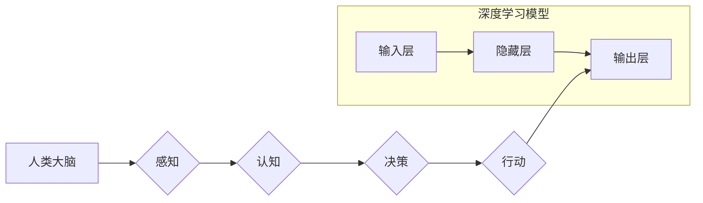

                 

## 认知革命：人类思维的进化历程

> 关键词：人工智能、认知科学、神经网络、深度学习、进化算法、机器学习、自然语言处理

## 1. 背景介绍

人类文明的进步离不开对认知的不断探索和理解。从古希腊哲学家对“灵魂”的思考，到现代神经科学对大脑结构和功能的揭示，我们一直在试图解开认知的奥秘。而随着计算机技术的飞速发展，人工智能（AI）的兴起为我们提供了全新的视角和工具，让我们能够更深入地研究和模拟人类思维。

本篇文章将探讨人工智能在认知革命中的作用，分析其核心概念、算法原理、数学模型以及实际应用场景，并展望其未来发展趋势和挑战。

## 2. 核心概念与联系

### 2.1 人工智能与认知科学

人工智能旨在构建能够模拟人类智能的机器系统。而认知科学则致力于理解人类思维、学习、记忆、语言和感知等认知过程的本质。两者之间存在着密切的联系，人工智能的研究成果可以为认知科学提供新的实验方法和理论框架，而认知科学的发现则可以指导人工智能的发展方向。

### 2.2 深度学习与生物神经网络

深度学习是人工智能领域近年来取得突破性进展的技术之一。其核心是构建多层神经网络，模仿生物神经网络的结构和功能。深度学习算法能够从海量数据中自动学习特征和模式，从而实现对复杂问题的建模和解决。

**Mermaid 流程图**



## 3. 核心算法原理 & 具体操作步骤

### 3.1 算法原理概述

深度学习算法的核心是反向传播算法。该算法通过不断调整神经网络权重，使得模型的输出与实际目标值之间的误差最小化。

### 3.2 算法步骤详解

1. **数据预处理:** 将原始数据转换为深度学习模型可以理解的格式。
2. **网络结构设计:** 根据具体任务选择合适的网络结构，例如卷积神经网络（CNN）、循环神经网络（RNN）等。
3. **参数初始化:** 为神经网络中的权重和偏置赋予初始值。
4. **前向传播:** 将输入数据通过神经网络传递，得到输出结果。
5. **误差计算:** 计算输出结果与实际目标值之间的误差。
6. **反向传播:** 将误差信号反向传播到网络各层，更新权重和偏置。
7. **迭代训练:** 重复步骤4-6，直到模型的误差达到预设阈值。

### 3.3 算法优缺点

**优点:**

* 能够自动学习特征，无需人工特征工程。
* 能够处理海量数据，并从数据中发现隐藏的模式。
* 在图像识别、自然语言处理等领域取得了突破性进展。

**缺点:**

* 训练过程需要大量计算资源和时间。
* 对训练数据的质量要求较高，数据偏差会导致模型性能下降。
* 模型的内部工作机制难以解释，缺乏可解释性。

### 3.4 算法应用领域

深度学习算法已广泛应用于各个领域，例如：

* **计算机视觉:** 图像识别、物体检测、图像分割、人脸识别等。
* **自然语言处理:** 机器翻译、文本摘要、情感分析、对话系统等。
* **语音识别:** 语音转文本、语音助手等。
* **医疗诊断:** 疾病预测、图像分析、药物研发等。
* **金融分析:** 风险评估、欺诈检测、投资预测等。

## 4. 数学模型和公式 & 详细讲解 & 举例说明

### 4.1 数学模型构建

深度学习模型的核心是多层神经网络。每个神经元接收多个输入信号，并通过加权求和和激活函数进行处理，最终输出一个信号。

**神经元模型:**

$$
y = f(w_1x_1 + w_2x_2 + ... + w_nx_n + b)
$$

其中：

* $y$ 是神经元的输出信号。
* $x_1, x_2, ..., x_n$ 是输入信号。
* $w_1, w_2, ..., w_n$ 是权重。
* $b$ 是偏置。
* $f$ 是激活函数。

### 4.2 公式推导过程

反向传播算法的核心是利用链式法则对损失函数进行求导，并根据梯度更新权重和偏置。

**损失函数:**

$$
L = \frac{1}{N}\sum_{i=1}^{N}(y_i - \hat{y}_i)^2
$$

其中：

* $L$ 是损失函数。
* $N$ 是样本数量。
* $y_i$ 是真实值。
* $\hat{y}_i$ 是预测值。

**梯度下降:**

$$
\theta = \theta - \alpha \frac{\partial L}{\partial \theta}
$$

其中：

* $\theta$ 是权重和偏置的集合。
* $\alpha$ 是学习率。

### 4.3 案例分析与讲解

以图像识别为例，假设我们训练一个深度学习模型识别猫和狗的图片。模型的输入是图像像素值，输出是猫和狗的概率。

训练过程中，模型会不断调整权重，使得输出概率与真实标签之间的误差最小化。通过反向传播算法，模型可以学习到识别猫和狗的关键特征，例如耳朵形状、尾巴长度等。

## 5. 项目实践：代码实例和详细解释说明

### 5.1 开发环境搭建

使用Python语言和深度学习框架TensorFlow或PyTorch进行开发。

### 5.2 源代码详细实现

```python
import tensorflow as tf

# 定义模型结构
model = tf.keras.models.Sequential([
    tf.keras.layers.Conv2D(32, (3, 3), activation='relu', input_shape=(28, 28, 1)),
    tf.keras.layers.MaxPooling2D((2, 2)),
    tf.keras.layers.Conv2D(64, (3, 3), activation='relu'),
    tf.keras.layers.MaxPooling2D((2, 2)),
    tf.keras.layers.Flatten(),
    tf.keras.layers.Dense(10, activation='softmax')
])

# 编译模型
model.compile(optimizer='adam',
              loss='sparse_categorical_crossentropy',
              metrics=['accuracy'])

# 训练模型
model.fit(x_train, y_train, epochs=10)

# 评估模型
loss, accuracy = model.evaluate(x_test, y_test)
print('Test loss:', loss)
print('Test accuracy:', accuracy)
```

### 5.3 代码解读与分析

这段代码定义了一个简单的卷积神经网络模型，用于识别手写数字。

* `tf.keras.models.Sequential` 创建了一个顺序模型，即层级结构。
* `tf.keras.layers.Conv2D` 定义了卷积层，用于提取图像特征。
* `tf.keras.layers.MaxPooling2D` 定义了最大池化层，用于降维和提高模型鲁棒性。
* `tf.keras.layers.Flatten` 将多维特征转换为一维向量。
* `tf.keras.layers.Dense` 定义了全连接层，用于分类。
* `model.compile` 编译模型，指定优化器、损失函数和评价指标。
* `model.fit` 训练模型，使用训练数据进行迭代训练。
* `model.evaluate` 评估模型，使用测试数据计算损失和准确率。

### 5.4 运行结果展示

训练完成后，模型可以用于识别新的手写数字图片。

## 6. 实际应用场景

### 6.1 图像识别

深度学习模型在图像识别领域取得了突破性进展，例如：

* **人脸识别:** 用于身份验证、安全监控等。
* **物体检测:** 用于自动驾驶、机器人视觉等。
* **图像分类:** 用于医疗诊断、产品分类等。

### 6.2 自然语言处理

深度学习模型在自然语言处理领域也取得了显著成果，例如：

* **机器翻译:** 将一种语言翻译成另一种语言。
* **文本摘要:** 自动生成文本的简要概述。
* **情感分析:** 分析文本表达的情感倾向。

### 6.3 语音识别

深度学习模型可以用于语音识别，例如：

* **语音转文本:** 将语音转换为文本。
* **语音助手:** 例如Siri、Alexa等。

### 6.4 未来应用展望

随着深度学习技术的不断发展，其应用场景将更加广泛，例如：

* **个性化教育:** 根据学生的学习情况提供个性化的学习方案。
* **精准医疗:** 基于患者的基因信息和病史提供个性化的医疗方案。
* **智能客服:** 提供24小时在线客服服务，解决用户的疑问。

## 7. 工具和资源推荐

### 7.1 学习资源推荐

* **书籍:**
    * 《深度学习》
    * 《动手学深度学习》
* **在线课程:**
    * Coursera上的深度学习课程
    * Udacity上的深度学习工程师课程

### 7.2 开发工具推荐

* **TensorFlow:** 开源深度学习框架，支持多种平台和硬件。
* **PyTorch:** 开源深度学习框架，以其灵活性和易用性而闻名。
* **Keras:** 高级深度学习API，可以运行在TensorFlow、Theano或CNTK等框架之上。

### 7.3 相关论文推荐

* **《ImageNet Classification with Deep Convolutional Neural Networks》**
* **《Attention Is All You Need》**
* **《BERT: Pre-training of Deep Bidirectional Transformers for Language Understanding》**

## 8. 总结：未来发展趋势与挑战

### 8.1 研究成果总结

深度学习技术取得了令人瞩目的进展，在图像识别、自然语言处理、语音识别等领域取得了突破性成果。

### 8.2 未来发展趋势

* **模型规模和复杂度提升:** 训练更大规模、更复杂的神经网络模型。
* **模型解释性和可解释性增强:** 研究如何更好地理解和解释深度学习模型的决策过程。
* **跨模态学习:** 训练能够处理多种模态数据（例如文本、图像、音频）的模型。
* **边缘计算和部署:** 将深度学习模型部署到边缘设备上，实现更快速的推理和更低的延迟。

### 8.3 面临的挑战

* **数据获取和标注:** 深度学习模型需要海量数据进行训练，数据获取和标注成本较高。
* **计算资源需求:** 训练大型深度学习模型需要大量的计算资源，成本高昂。
* **模型安全性:** 深度学习模型容易受到攻击，需要提高模型的安全性。
* **伦理问题:** 深度学习技术可能带来一些伦理问题，例如算法偏见、隐私泄露等，需要谨慎对待。

### 8.4 研究展望

未来，深度学习技术将继续发展，并在更多领域发挥重要作用。我们需要不断探索新的算法、模型和应用场景，同时也要关注其潜在的风险和挑战，确保其安全、可持续发展。

## 9. 附录：常见问题与解答

**Q1: 深度学习和机器学习有什么区别？**

**A1:** 机器学习是人工智能的一个子领域，它旨在构建能够从数据中学习的算法。深度学习是机器学习的一种特殊形式，它使用多层神经网络来模拟人类大脑的结构和功能。

**Q2: 如何选择合适的深度学习框架？**

**A2:** 选择深度学习框架需要考虑多种因素，例如：

* **项目需求:** 不同的框架擅长不同的任务。
* **开发经验:** 选择自己熟悉的框架可以提高开发效率。
* **社区支持:** 选择拥有活跃社区支持的框架可以获得更多帮助。

**Q3: 如何解决深度学习模型的过拟合问题？**

**A3:** 过拟合是指模型在训练数据上表现良好，但在测试数据上表现差。解决过拟合问题的方法包括：

* **增加训练数据量:** 更多的训练数据可以帮助模型泛化到新的数据。
* **使用正则化技术:** 例如L1正则化、L2正则化等，可以惩罚模型的复杂度，防止过拟合。
* **使用Dropout技术:** 在训练过程中随机丢弃一些神经元，可以防止模型过于依赖特定的神经元。


作者：禅与计算机程序设计艺术 / Zen and the Art of Computer Programming 
<end_of_turn>

