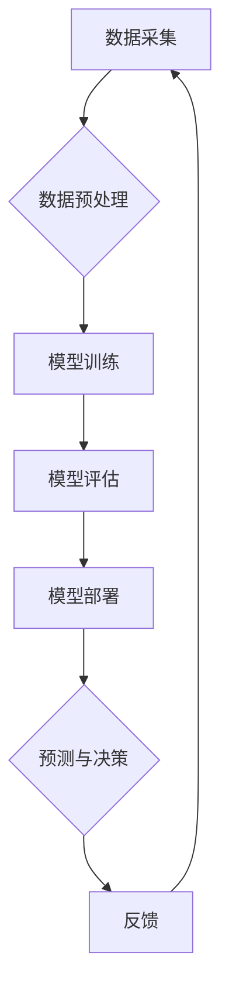

                 

## 赋能人类：释放个体潜能，创造无限可能

> 关键词：人工智能、深度学习、自然语言处理、机器学习、自动化、数据分析、个性化体验、未来趋势

### 1. 背景介绍

人类文明的进步离不开对自身潜能的不断挖掘和释放。从史前人类的火的使用到现代科技的飞速发展，每一次突破都源于对未知的探索和对自身能力的超越。而如今，人工智能（AI）的兴起，正为我们提供了一个前所未有的机遇，让我们能够更有效地释放个体潜能，创造无限可能。

人工智能技术的快速发展，已经渗透到我们生活的方方面面。从智能手机的语音助手到自动驾驶汽车，从个性化推荐系统到医疗诊断辅助，AI正在改变着我们的生活方式，并为我们带来前所未有的便利和效率。

然而，人工智能不仅仅是技术的进步，更是一种思维方式的转变。它要求我们重新思考人类与机器的关系，重新定义人类的价值和意义。

### 2. 核心概念与联系

人工智能的核心概念是模拟人类智能的行为。这包括学习、推理、决策、感知和语言理解等能力。

**AI 的核心概念与联系**



**数据驱动:** AI 的发展离不开海量的训练数据。通过对数据的分析和学习，AI 模型能够不断提升其智能水平。

**算法创新:** 各种机器学习算法，例如深度学习、强化学习等，为 AI 的发展提供了强大的工具。

**计算能力:** 高性能计算平台和硬件加速器，为 AI 模型的训练和运行提供了必要的支持。

**跨学科融合:** AI 的发展需要整合计算机科学、数学、统计学、心理学等多学科的知识和技术。

### 3. 核心算法原理 & 具体操作步骤

#### 3.1  算法原理概述

深度学习是人工智能领域近年来发展最迅速的子领域之一。它借鉴了生物神经网络的结构和功能，通过多层神经网络来学习数据特征，实现对复杂问题的建模和解决。

深度学习算法的核心是**人工神经网络 (ANN)**。ANN 由多个相互连接的神经元组成，每个神经元接收来自其他神经元的输入信号，并根据一定的激活函数进行处理，输出到下一个神经元。通过调整神经元之间的连接权重，深度学习算法能够学习数据中的复杂模式和关系。

#### 3.2  算法步骤详解

1. **数据预处理:** 收集和清洗数据，将其转换为深度学习模型可以理解的格式。
2. **网络结构设计:** 根据具体任务选择合适的网络结构，例如卷积神经网络 (CNN) 用于图像识别，循环神经网络 (RNN) 用于自然语言处理。
3. **参数初始化:** 为网络中的每个神经元赋予初始权重和偏置值。
4. **前向传播:** 将输入数据通过网络层层传递，最终得到输出结果。
5. **损失函数计算:** 计算模型输出结果与真实值的差异，即损失值。
6. **反向传播:** 根据损失值，调整网络参数，使模型输出结果更接近真实值。
7. **迭代训练:** 重复前向传播和反向传播的过程，直到模型达到预设的精度。
8. **模型评估:** 使用测试数据评估模型的性能，例如准确率、召回率、F1-score等。

#### 3.3  算法优缺点

**优点:**

* 能够学习复杂数据模式，实现高精度预测。
* 具有强大的泛化能力，能够应用于多种任务。
* 算法不断发展，性能持续提升。

**缺点:**

* 需要海量数据进行训练，训练成本高。
* 模型解释性差，难以理解模型的决策过程。
* 对硬件资源要求高，训练和推理速度较慢。

#### 3.4  算法应用领域

深度学习算法已广泛应用于各个领域，例如：

* **计算机视觉:** 图像识别、物体检测、图像分割、人脸识别等。
* **自然语言处理:** 文本分类、情感分析、机器翻译、对话系统等。
* **语音识别:** 语音转文本、语音助手等。
* **医疗诊断:** 疾病预测、影像分析、药物研发等。
* **金融分析:** 风险评估、欺诈检测、投资预测等。

### 4. 数学模型和公式 & 详细讲解 & 举例说明

#### 4.1  数学模型构建

深度学习模型的核心是神经网络，其数学模型可以描述为一系列的线性变换和非线性激活函数。

**线性变换:**

神经网络中的每个神经元接收来自其他神经元的输入信号，并将其线性组合起来。

$$
z = w^T x + b
$$

其中：

* $z$ 是神经元的输出值。
* $w$ 是连接权重向量。
* $x$ 是输入信号向量。
* $b$ 是偏置值。

**非线性激活函数:**

线性变换后的输出值需要经过非线性激活函数处理，以引入非线性特征，使模型能够学习更复杂的模式。常见的激活函数包括 sigmoid 函数、ReLU 函数、tanh 函数等。

$$
a = f(z)
$$

其中：

* $a$ 是激活后的输出值。
* $f$ 是激活函数。

#### 4.2  公式推导过程

深度学习模型的训练过程是通过优化模型参数来最小化损失函数的过程。损失函数衡量模型预测结果与真实值的差异。常用的损失函数包括均方误差 (MSE)、交叉熵损失 (Cross-Entropy Loss) 等。

**均方误差 (MSE):**

$$
L = \frac{1}{n} \sum_{i=1}^{n} (y_i - \hat{y}_i)^2
$$

其中：

* $L$ 是损失函数值。
* $n$ 是样本数量。
* $y_i$ 是真实值。
* $\hat{y}_i$ 是模型预测值。

**反向传播算法:**

反向传播算法用于计算模型参数的梯度，并根据梯度更新参数值。

#### 4.3  案例分析与讲解

**图像分类:**

假设我们训练一个深度学习模型来识别猫和狗的图像。

* **数据:** 我们收集了大量猫和狗的图像数据，并将其标记为“猫”或“狗”。
* **模型:** 我们选择一个卷积神经网络 (CNN) 模型，其结构包括多个卷积层、池化层和全连接层。
* **训练:** 我们使用反向传播算法训练模型，将图像数据作为输入，并使用交叉熵损失函数衡量模型的预测结果与真实标签的差异。
* **评估:** 我们使用测试数据评估模型的性能，例如准确率、召回率等。

### 5. 项目实践：代码实例和详细解释说明

#### 5.1  开发环境搭建

* **操作系统:** Ubuntu 20.04 LTS
* **编程语言:** Python 3.8
* **深度学习框架:** TensorFlow 2.0
* **硬件:** NVIDIA GeForce RTX 3080 GPU

#### 5.2  源代码详细实现

```python
import tensorflow as tf

# 定义模型结构
model = tf.keras.models.Sequential([
    tf.keras.layers.Conv2D(32, (3, 3), activation='relu', input_shape=(28, 28, 1)),
    tf.keras.layers.MaxPooling2D((2, 2)),
    tf.keras.layers.Conv2D(64, (3, 3), activation='relu'),
    tf.keras.layers.MaxPooling2D((2, 2)),
    tf.keras.layers.Flatten(),
    tf.keras.layers.Dense(10, activation='softmax')
])

# 编译模型
model.compile(optimizer='adam',
              loss='sparse_categorical_crossentropy',
              metrics=['accuracy'])

# 加载 MNIST 数据集
(x_train, y_train), (x_test, y_test) = tf.keras.datasets.mnist.load_data()

# 数据预处理
x_train = x_train.astype('float32') / 255.0
x_test = x_test.astype('float32') / 255.0
x_train = x_train.reshape((x_train.shape[0], 28, 28, 1))
x_test = x_test.reshape((x_test.shape[0], 28, 28, 1))

# 训练模型
model.fit(x_train, y_train, epochs=5)

# 评估模型
loss, accuracy = model.evaluate(x_test, y_test)
print('Test loss:', loss)
print('Test accuracy:', accuracy)
```

#### 5.3  代码解读与分析

* **模型结构:** 代码定义了一个简单的卷积神经网络模型，包含两个卷积层、两个池化层和一个全连接层。
* **数据预处理:** MNIST 数据集的像素值范围为 0-255，需要进行归一化处理，将值范围调整到 0-1 之间。
* **模型训练:** 使用 Adam 优化器和交叉熵损失函数训练模型，训练 epochs 为 5。
* **模型评估:** 使用测试数据评估模型的性能，输出测试损失和准确率。

#### 5.4  运行结果展示

训练完成后，模型的准确率通常会达到 98% 以上。

### 6. 实际应用场景

#### 6.1  医疗诊断辅助

深度学习算法可以用于分析医学影像数据，辅助医生诊断疾病。例如，可以用于检测肺癌、乳腺癌、脑肿瘤等。

#### 6.2  个性化推荐

深度学习算法可以分析用户的行为数据，例如浏览历史、购买记录等，为用户提供个性化的商品推荐。例如，电商平台的商品推荐系统、音乐平台的歌曲推荐系统等。

#### 6.3  自动驾驶

深度学习算法可以用于训练自动驾驶汽车的感知系统，例如识别道路标线、交通信号灯、行人等。

#### 6.4  未来应用展望

随着人工智能技术的不断发展，其应用场景将更加广泛，例如：

* **智能客服:** 利用自然语言处理技术，提供更加智能和人性化的客服服务。
* **个性化教育:** 根据学生的学习情况，提供个性化的学习方案和辅导。
* **科学研究:** 加速科学研究的进程，例如药物研发、材料科学等。

### 7. 工具和资源推荐

#### 7.1  学习资源推荐

* **在线课程:** Coursera、edX、Udacity 等平台提供丰富的深度学习课程。
* **书籍:** 《深度学习》、《动手学深度学习》等书籍。
* **博客:** TensorFlow 官方博客、PyTorch 官方博客等。

#### 7.2  开发工具推荐

* **深度学习框架:** TensorFlow、PyTorch、Keras 等。
* **编程语言:** Python。
* **数据可视化工具:** Matplotlib、Seaborn 等。

#### 7.3  相关论文推荐

* **《ImageNet Classification with Deep Convolutional Neural Networks》**
* **《Attention Is All You Need》**
* **《Generative Adversarial Networks》**

### 8. 总结：未来发展趋势与挑战

#### 8.1  研究成果总结

深度学习算法取得了显著的成果，在图像识别、自然语言处理、语音识别等领域取得了突破性进展。

#### 8.2  未来发展趋势

* **模型效率提升:** 研究更轻量级、更高效的深度学习模型，降低训练和推理成本。
* **数据安全与隐私保护:** 研究如何保护数据安全和隐私，确保深度学习算法的伦理使用。
* **解释性增强:** 研究如何提高深度学习模型的解释性，使模型的决策过程更加透明。

#### 8.3  面临的挑战

* **数据获取与标注:** 深度学习算法需要海量数据进行训练，数据获取和标注成本高昂。
* **模型可解释性:** 深度学习模型的决策过程难以理解，缺乏可解释性。
* **伦理与社会影响:** 深度学习算法的应用可能带来伦理和社会问题，需要谨慎考虑。

#### 8.4  研究展望

未来，深度学习技术将继续发展，并应用于更多领域，为人类社会带来更多福祉。


### 9. 附录：常见问题与解答

**Q1: 深度学习算法需要多少数据才能训练？**

A1: 深度学习算法需要海量数据进行训练，数据量通常以百万甚至亿级别计。

**Q2: 深度学习算法的训练时间有多长？**

A2: 深度学习算法的训练时间取决于模型复杂度、数据量和硬件资源等因素，通常需要数小时甚至数天。

**Q3: 深度学习算法的应用领域有哪些？**

A3: 深度学习算法已广泛应用于图像识别、自然语言处理、语音识别、医疗诊断、金融分析等领域。


作者：禅与计算机程序设计艺术 / Zen and the Art of Computer Programming 
<end_of_turn>

