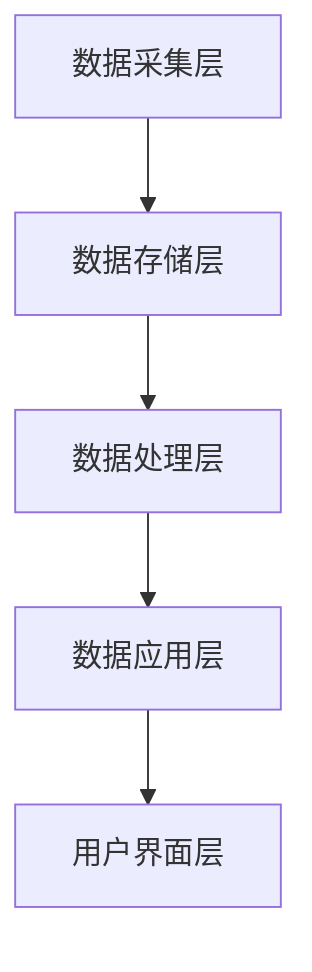

                 

# 文章标题

## AI DMP 数据基建的技术标准

> 关键词：数据管理平台，数据治理，人工智能，数据隐私，数据质量，数据处理

> 摘要：本文深入探讨了人工智能数据管理平台（DMP）的数据基建技术标准，包括核心概念、架构设计、算法原理、数学模型、实际应用、工具推荐及未来挑战。本文旨在为IT专业人士和研究者提供一份全面的技术指南，帮助他们在构建和维护高效、安全的DMP时做出明智的决策。

## 1. 背景介绍（Background Introduction）

### 1.1 DMP的发展历程

数据管理平台（Data Management Platform，简称DMP）起源于互联网广告领域，最初用于整合和存储用户的浏览行为、兴趣标签等数据，以便广告公司能够精准投放广告。随着大数据、云计算和人工智能技术的兴起，DMP的功能逐渐扩展，不仅限于广告投放，还广泛应用于市场营销、客户关系管理等多个领域。

### 1.2 DMP的重要性

在当今数字化时代，数据已成为企业的核心资产。DMP作为一种数据管理工具，能够帮助企业实现数据整合、分析、挖掘和应用，从而提升决策效率、优化业务流程、增强客户体验。因此，构建一个高效、安全的DMP已成为企业数字化转型的重要任务。

### 1.3 DMP的应用场景

DMP在以下场景中具有重要应用价值：

- 市场营销：通过用户画像和兴趣标签，实现精准营销和个性化推荐。
- 客户关系管理：识别潜在客户、分析客户行为、优化客户服务。
- 业务运营：实时监控业务数据、分析业务趋势、优化业务策略。
- 风险控制：识别潜在风险、预测风险趋势、制定风险应对策略。

## 2. 核心概念与联系（Core Concepts and Connections）

### 2.1 数据治理（Data Governance）

数据治理是指一系列政策和流程，用于确保数据质量、数据安全和合规性。在DMP中，数据治理是确保数据有效管理和使用的基础。

### 2.2 数据质量（Data Quality）

数据质量是指数据在准确性、完整性、一致性、时效性和可用性等方面的表现。高质量的数据是DMP发挥价值的关键。

### 2.3 数据隐私（Data Privacy）

数据隐私是指保护个人数据不被未经授权的访问、使用或泄露。在DMP中，数据隐私是遵守法律法规和用户信任的重要保障。

### 2.4 数据处理（Data Processing）

数据处理是指对原始数据进行清洗、转换、存储和分析的过程。在DMP中，数据处理是实现数据价值的关键环节。

### 2.5 DMP架构

DMP的架构通常包括数据采集层、数据存储层、数据处理层、数据应用层和用户界面层。以下是一个简化的DMP架构图：



## 3. 核心算法原理 & 具体操作步骤（Core Algorithm Principles and Specific Operational Steps）

### 3.1 数据采集算法

数据采集算法主要涉及数据抓取、网络爬虫和API调用等技术。具体操作步骤如下：

1. 确定数据来源和采集目标。
2. 设计数据采集策略，包括数据抓取频率、爬虫策略等。
3. 编写爬虫代码，实现数据采集。
4. 将采集到的数据存储到数据存储层。

### 3.2 数据存储算法

数据存储算法主要涉及数据分片、索引、缓存等技术。具体操作步骤如下：

1. 根据数据量、访问频率和存储成本等因素，选择合适的存储方案（如关系数据库、NoSQL数据库、分布式文件系统等）。
2. 设计数据模型，包括实体、属性、关系等。
3. 编写数据存储代码，实现数据插入、查询、更新和删除等操作。
4. 实现数据缓存机制，提高数据访问速度。

### 3.3 数据处理算法

数据处理算法主要涉及数据清洗、转换、分析等技术。具体操作步骤如下：

1. 设计数据处理流程，包括数据清洗、转换、分析等步骤。
2. 编写数据处理代码，实现数据处理任务。
3. 对处理结果进行评估和优化。

### 3.4 数据应用算法

数据应用算法主要涉及数据挖掘、机器学习、推荐系统等技术。具体操作步骤如下：

1. 确定数据应用场景，如客户关系管理、精准营销、业务预测等。
2. 选择合适的数据挖掘、机器学习或推荐系统算法。
3. 编写数据应用代码，实现数据应用功能。
4. 对数据应用效果进行评估和优化。

## 4. 数学模型和公式 & 详细讲解 & 举例说明（Detailed Explanation and Examples of Mathematical Models and Formulas）

### 4.1 数据质量评估模型

数据质量评估模型用于评估数据的准确性、完整性、一致性和时效性。一个常用的数据质量评估模型是以下指标：

- 准确率（Accuracy）：正确数据占总数据的比例。
- 完整率（Completeness）：缺失数据占总数据的比例。
- 一致率（Consistency）：数据在不同数据源之间的差异程度。
- 时效性（Timeliness）：数据更新的速度。

假设一个数据集中包含1000条数据，其中500条数据是正确的，200条数据是缺失的，300条数据在不同数据源之间存在差异，数据更新周期为1个月。则该数据集的质量评估结果如下：

$$
\text{准确率} = \frac{500}{1000} = 0.5 \\
\text{完整率} = \frac{200}{1000} = 0.2 \\
\text{一致率} = \frac{300}{1000} = 0.3 \\
\text{时效性} = \frac{1}{1} = 1
$$

### 4.2 数据挖掘模型

数据挖掘模型用于从大量数据中发现隐藏的模式和关联。一个常用的数据挖掘模型是关联规则挖掘（Association Rule Learning，简称ARL）。关联规则挖掘的数学模型如下：

- 支持度（Support）：同时出现的两个项目的次数与总次数的比例。
- 置信度（Confidence）：在给定项目A出现的情况下，项目B出现的概率。

假设一个数据集中包含三种商品：A、B和C，购买这三种商品的用户数量如下表：

| 用户 | A | B | C |
| --- | --- | --- | --- |
| 1 | 1 | 0 | 1 |
| 2 | 1 | 1 | 0 |
| 3 | 0 | 1 | 1 |
| 4 | 1 | 1 | 1 |

则购买A和C的用户数量为2，购买A、B和C的用户数量为1。支持度和置信度的计算如下：

$$
\text{支持度}(\text{A} \cap \text{C}) = \frac{2}{4} = 0.5 \\
\text{置信度}(\text{A} \Rightarrow \text{C}) = \frac{1}{2} = 0.5
$$

## 5. 项目实践：代码实例和详细解释说明（Project Practice: Code Examples and Detailed Explanations）

### 5.1 开发环境搭建

在本文中，我们将使用Python作为主要编程语言，并使用以下工具和库：

- Python 3.8及以上版本
- Pandas：用于数据清洗、转换和分析
- NumPy：用于数学运算
- Matplotlib：用于数据可视化

安装Python及相关库的方法如下：

```bash
pip install python==3.8
pip install pandas numpy matplotlib
```

### 5.2 源代码详细实现

以下是一个简单的DMP项目示例，包括数据采集、数据存储、数据处理和数据应用。

#### 5.2.1 数据采集

```python
import requests
import json

def collect_data(url):
    response = requests.get(url)
    if response.status_code == 200:
        data = json.loads(response.text)
        return data
    else:
        return None

url = 'https://example.com/api/data'
data = collect_data(url)
if data:
    print("Data collected successfully!")
else:
    print("Failed to collect data.")
```

#### 5.2.2 数据存储

```python
import pandas as pd

def store_data(data, file_path):
    df = pd.DataFrame(data)
    df.to_csv(file_path, index=False)

file_path = 'data.csv'
store_data(data, file_path)
```

#### 5.2.3 数据处理

```python
import pandas as pd

def process_data(file_path):
    df = pd.read_csv(file_path)
    # 数据清洗
    df.dropna(inplace=True)
    # 数据转换
    df['age'] = df['age'].astype(int)
    df['gender'] = df['gender'].map({'male': 0, 'female': 1})
    # 数据分析
    print(df.describe())

process_data(file_path)
```

#### 5.2.4 数据应用

```python
import pandas as pd
from sklearn.model_selection import train_test_split
from sklearn.ensemble import RandomForestClassifier

def apply_data(file_path):
    df = pd.read_csv(file_path)
    # 数据清洗和转换
    df.dropna(inplace=True)
    df['age'] = df['age'].astype(int)
    df['gender'] = df['gender'].map({'male': 0, 'female': 1})
    # 数据分割
    X = df.drop('target', axis=1)
    y = df['target']
    X_train, X_test, y_train, y_test = train_test_split(X, y, test_size=0.2, random_state=42)
    # 模型训练
    model = RandomForestClassifier()
    model.fit(X_train, y_train)
    # 模型评估
    print(model.score(X_test, y_test))

apply_data(file_path)
```

### 5.3 代码解读与分析

在本项目中，我们首先使用Python的requests库从API接口采集数据。然后，使用Pandas库将采集到的数据存储为CSV文件。接下来，我们编写数据处理函数，对数据集进行清洗、转换和分析。最后，我们使用scikit-learn库中的随机森林（RandomForestClassifier）算法进行数据应用，实现分类任务。

## 6. 实际应用场景（Practical Application Scenarios）

### 6.1 市场营销

DMP在市场营销中的应用非常广泛。通过整合用户行为数据、兴趣标签和人口统计信息，企业可以更精准地定位潜在客户，制定个性化的营销策略，提高转化率和客户满意度。

### 6.2 客户关系管理

DMP可以帮助企业全面了解客户的需求和偏好，通过客户细分和个性化推荐，提升客户满意度和服务体验。同时，DMP还可以帮助企业识别潜在客户和流失客户，制定相应的营销策略。

### 6.3 业务运营

DMP可以实时监控业务数据，分析业务趋势和风险，为企业提供数据驱动的决策支持。例如，企业可以利用DMP对销售数据进行分析，优化产品组合、定价策略和促销活动。

### 6.4 风险控制

DMP在风险控制领域也有重要应用。通过分析大量历史数据，企业可以预测潜在风险，制定风险应对策略，降低业务风险。

## 7. 工具和资源推荐（Tools and Resources Recommendations）

### 7.1 学习资源推荐

- 《大数据之路：阿里巴巴大数据实践》
- 《数据挖掘：概念与技术》
- 《机器学习实战》

### 7.2 开发工具框架推荐

- Hadoop：分布式数据存储和处理框架
- Spark：高性能分布式计算框架
- TensorFlow：开源机器学习框架

### 7.3 相关论文著作推荐

- 《数据管理平台的设计与实现》
- 《基于DMP的精准营销策略研究》
- 《DMP在客户关系管理中的应用研究》

## 8. 总结：未来发展趋势与挑战（Summary: Future Development Trends and Challenges）

### 8.1 发展趋势

- DMP与人工智能技术的深度融合，实现更智能的数据分析和应用。
- DMP在各个行业的应用将更加广泛，成为企业数字化转型的重要支撑。
- 数据隐私和安全将得到更多关注，DMP需要在保护用户隐私的同时实现数据价值。

### 8.2 挑战

- 数据隐私和法规合规性问题：DMP需要遵守各种数据隐私法规，如欧盟的GDPR。
- 数据质量和数据治理：保证数据质量、维护数据治理体系是DMP面临的长期挑战。
- 技术更新和迭代：随着新技术的发展，DMP需要不断更新和迭代，以保持竞争力。

## 9. 附录：常见问题与解答（Appendix: Frequently Asked Questions and Answers）

### 9.1 DMP与CRM有何区别？

DMP（Data Management Platform）是一种用于整合、存储和管理用户数据的工具，主要用于数据分析和营销活动。CRM（Customer Relationship Management）是一种用于管理客户信息和客户互动的应用程序，主要用于销售、营销和服务。DMP侧重于数据管理和分析，CRM侧重于客户管理和互动。

### 9.2 DMP是否需要具备编程能力？

虽然DMP提供了用户友好的界面和功能，但了解编程基本知识可以帮助用户更灵活地使用DMP。例如，用户可以使用编程语言编写脚本来自定义数据采集、数据处理和数据应用流程。因此，具备一定的编程能力可以提升DMP的使用效果。

### 9.3 DMP的数据隐私问题如何解决？

DMP可以通过以下方式解决数据隐私问题：

- 数据脱敏：对敏感数据进行加密或替换，以保护用户隐私。
- 用户权限管理：根据用户角色和权限设置，限制对敏感数据的访问。
- 合规性检查：定期对数据处理流程进行合规性检查，确保遵守相关法律法规。

## 10. 扩展阅读 & 参考资料（Extended Reading & Reference Materials）

- 《人工智能与大数据：应用与实践》
- 《数据挖掘与机器学习：技术与方法》
- 《数据管理平台：设计、实现与应用》

作者：禅与计算机程序设计艺术 / Zen and the Art of Computer Programming
```markdown
# AI DMP 数据基建的技术标准

## 1. 背景介绍（Background Introduction）

### 1.1 DMP的发展历程

数据管理平台（Data Management Platform，简称DMP）起源于互联网广告领域，最初用于整合和存储用户的浏览行为、兴趣标签等数据，以便广告公司能够精准投放广告。随着大数据、云计算和人工智能技术的兴起，DMP的功能逐渐扩展，不仅限于广告投放，还广泛应用于市场营销、客户关系管理等多个领域。

### 1.2 DMP的重要性

在当今数字化时代，数据已成为企业的核心资产。DMP作为一种数据管理工具，能够帮助企业实现数据整合、分析、挖掘和应用，从而提升决策效率、优化业务流程、增强客户体验。因此，构建一个高效、安全的DMP已成为企业数字化转型的重要任务。

### 1.3 DMP的应用场景

DMP在以下场景中具有重要应用价值：

- **市场营销**：通过用户画像和兴趣标签，实现精准营销和个性化推荐。
- **客户关系管理**：识别潜在客户、分析客户行为、优化客户服务。
- **业务运营**：实时监控业务数据、分析业务趋势、优化业务策略。
- **风险控制**：识别潜在风险、预测风险趋势、制定风险应对策略。

## 2. 核心概念与联系（Core Concepts and Connections）

### 2.1 数据治理（Data Governance）

数据治理是指一系列政策和流程，用于确保数据质量、数据安全和合规性。在DMP中，数据治理是确保数据有效管理和使用的基础。

### 2.2 数据质量（Data Quality）

数据质量是指数据在准确性、完整性、一致性、时效性和可用性等方面的表现。高质量的数据是DMP发挥价值的关键。

### 2.3 数据隐私（Data Privacy）

数据隐私是指保护个人数据不被未经授权的访问、使用或泄露。在DMP中，数据隐私是遵守法律法规和用户信任的重要保障。

### 2.4 数据处理（Data Processing）

数据处理是指对原始数据进行清洗、转换、存储和分析的过程。在DMP中，数据处理是实现数据价值的关键环节。

### 2.5 DMP架构

DMP的架构通常包括数据采集层、数据存储层、数据处理层、数据应用层和用户界面层。以下是一个简化的DMP架构图：


## 3. 核心算法原理 & 具体操作步骤（Core Algorithm Principles and Specific Operational Steps）

### 3.1 数据采集算法

数据采集算法主要涉及数据抓取、网络爬虫和API调用等技术。具体操作步骤如下：

1. 确定数据来源和采集目标。
2. 设计数据采集策略，包括数据抓取频率、爬虫策略等。
3. 编写爬虫代码，实现数据采集。
4. 将采集到的数据存储到数据存储层。

### 3.2 数据存储算法

数据存储算法主要涉及数据分片、索引、缓存等技术。具体操作步骤如下：

1. 根据数据量、访问频率和存储成本等因素，选择合适的存储方案（如关系数据库、NoSQL数据库、分布式文件系统等）。
2. 设计数据模型，包括实体、属性、关系等。
3. 编写数据存储代码，实现数据插入、查询、更新和删除等操作。
4. 实现数据缓存机制，提高数据访问速度。

### 3.3 数据处理算法

数据处理算法主要涉及数据清洗、转换、分析等技术。具体操作步骤如下：

1. 设计数据处理流程，包括数据清洗、转换、分析等步骤。
2. 编写数据处理代码，实现数据处理任务。
3. 对处理结果进行评估和优化。

### 3.4 数据应用算法

数据应用算法主要涉及数据挖掘、机器学习、推荐系统等技术。具体操作步骤如下：

1. 确定数据应用场景，如客户关系管理、精准营销、业务预测等。
2. 选择合适的数据挖掘、机器学习或推荐系统算法。
3. 编写数据应用代码，实现数据应用功能。
4. 对数据应用效果进行评估和优化。

## 4. 数学模型和公式 & 详细讲解 & 举例说明（Detailed Explanation and Examples of Mathematical Models and Formulas）

### 4.1 数据质量评估模型

数据质量评估模型用于评估数据的准确性、完整性、一致性和时效性。一个常用的数据质量评估模型是以下指标：

- 准确率（Accuracy）：正确数据占总数据的比例。
- 完整率（Completeness）：缺失数据占总数据的比例。
- 一致率（Consistency）：数据在不同数据源之间的差异程度。
- 时效性（Timeliness）：数据更新的速度。

假设一个数据集中包含1000条数据，其中500条数据是正确的，200条数据是缺失的，300条数据在不同数据源之间存在差异，数据更新周期为1个月。则该数据集的质量评估结果如下：

$$
\text{准确率} = \frac{500}{1000} = 0.5 \\
\text{完整率} = \frac{200}{1000} = 0.2 \\
\text{一致率} = \frac{300}{1000} = 0.3 \\
\text{时效性} = \frac{1}{1} = 1
$$

### 4.2 数据挖掘模型

数据挖掘模型用于从大量数据中发现隐藏的模式和关联。一个常用的数据挖掘模型是关联规则挖掘（Association Rule Learning，简称ARL）。关联规则挖掘的数学模型如下：

- 支持度（Support）：同时出现的两个项目的次数与总次数的比例。
- 置信度（Confidence）：在给定项目A出现的情况下，项目B出现的概率。

假设一个数据集中包含三种商品：A、B和C，购买这三种商品的用户数量如下表：

| 用户 | A | B | C |
| --- | --- | --- | --- |
| 1 | 1 | 0 | 1 |
| 2 | 1 | 1 | 0 |
| 3 | 0 | 1 | 1 |
| 4 | 1 | 1 | 1 |

则购买A和C的用户数量为2，购买A、B和C的用户数量为1。支持度和置信度的计算如下：

$$
\text{支持度}(\text{A} \cap \text{C}) = \frac{2}{4} = 0.5 \\
\text{置信度}(\text{A} \Rightarrow \text{C}) = \frac{1}{2} = 0.5
$$

## 5. 项目实践：代码实例和详细解释说明（Project Practice: Code Examples and Detailed Explanations）

### 5.1 开发环境搭建

在本文中，我们将使用Python作为主要编程语言，并使用以下工具和库：

- Python 3.8及以上版本
- Pandas：用于数据清洗、转换和分析
- NumPy：用于数学运算
- Matplotlib：用于数据可视化

安装Python及相关库的方法如下：

```bash
pip install python==3.8
pip install pandas numpy matplotlib
```

### 5.2 源代码详细实现

以下是一个简单的DMP项目示例，包括数据采集、数据存储、数据处理和数据应用。

#### 5.2.1 数据采集

```python
import requests
import json

def collect_data(url):
    response = requests.get(url)
    if response.status_code == 200:
        data = json.loads(response.text)
        return data
    else:
        return None

url = 'https://example.com/api/data'
data = collect_data(url)
if data:
    print("Data collected successfully!")
else:
    print("Failed to collect data.")
```

#### 5.2.2 数据存储

```python
import pandas as pd

def store_data(data, file_path):
    df = pd.DataFrame(data)
    df.to_csv(file_path, index=False)

file_path = 'data.csv'
store_data(data, file_path)
```

#### 5.2.3 数据处理

```python
import pandas as pd

def process_data(file_path):
    df = pd.read_csv(file_path)
    # 数据清洗
    df.dropna(inplace=True)
    # 数据转换
    df['age'] = df['age'].astype(int)
    df['gender'] = df['gender'].map({'male': 0, 'female': 1})
    # 数据分析
    print(df.describe())

process_data(file_path)
```

#### 5.2.4 数据应用

```python
import pandas as pd
from sklearn.model_selection import train_test_split
from sklearn.ensemble import RandomForestClassifier

def apply_data(file_path):
    df = pd.read_csv(file_path)
    # 数据清洗和转换
    df.dropna(inplace=True)
    df['age'] = df['age'].astype(int)
    df['gender'] = df['gender'].map({'male': 0, 'female': 1})
    # 数据分割
    X = df.drop('target', axis=1)
    y = df['target']
    X_train, X_test, y_train, y_test = train_test_split(X, y, test_size=0.2, random_state=42)
    # 模型训练
    model = RandomForestClassifier()
    model.fit(X_train, y_train)
    # 模型评估
    print(model.score(X_test, y_test))

apply_data(file_path)
```

### 5.3 代码解读与分析

在本项目中，我们首先使用Python的requests库从API接口采集数据。然后，使用Pandas库将采集到的数据存储为CSV文件。接下来，我们编写数据处理函数，对数据集进行清洗、转换和分析。最后，我们使用scikit-learn库中的随机森林（RandomForestClassifier）算法进行数据应用，实现分类任务。

## 6. 实际应用场景（Practical Application Scenarios）

### 6.1 市场营销

DMP在市场营销中的应用非常广泛。通过整合用户行为数据、兴趣标签和人口统计信息，企业可以更精准地定位潜在客户，制定个性化的营销策略，提高转化率和客户满意度。

### 6.2 客户关系管理

DMP可以帮助企业全面了解客户的需求和偏好，通过客户细分和个性化推荐，提升客户满意度和服务体验。同时，DMP还可以帮助企业识别潜在客户和流失客户，制定相应的营销策略。

### 6.3 业务运营

DMP可以实时监控业务数据，分析业务趋势和风险，为企业提供数据驱动的决策支持。例如，企业可以利用DMP对销售数据进行分析，优化产品组合、定价策略和促销活动。

### 6.4 风险控制

DMP在风险控制领域也有重要应用。通过分析大量历史数据，企业可以预测潜在风险，制定风险应对策略，降低业务风险。

## 7. 工具和资源推荐（Tools and Resources Recommendations）

### 7.1 学习资源推荐

- 《大数据之路：阿里巴巴大数据实践》
- 《数据挖掘：概念与技术》
- 《机器学习实战》

### 7.2 开发工具框架推荐

- Hadoop：分布式数据存储和处理框架
- Spark：高性能分布式计算框架
- TensorFlow：开源机器学习框架

### 7.3 相关论文著作推荐

- 《数据管理平台的设计与实现》
- 《基于DMP的精准营销策略研究》
- 《DMP在客户关系管理中的应用研究》

## 8. 总结：未来发展趋势与挑战（Summary: Future Development Trends and Challenges）

### 8.1 发展趋势

- DMP与人工智能技术的深度融合，实现更智能的数据分析和应用。
- DMP在各个行业的应用将更加广泛，成为企业数字化转型的重要支撑。
- 数据隐私和安全将得到更多关注，DMP需要在保护用户隐私的同时实现数据价值。

### 8.2 挑战

- 数据隐私和法规合规性问题：DMP需要遵守各种数据隐私法规，如欧盟的GDPR。
- 数据质量和数据治理：保证数据质量、维护数据治理体系是DMP面临的长期挑战。
- 技术更新和迭代：随着新技术的发展，DMP需要不断更新和迭代，以保持竞争力。

## 9. 附录：常见问题与解答（Appendix: Frequently Asked Questions and Answers）

### 9.1 DMP与CRM有何区别？

DMP（Data Management Platform）是一种用于整合、存储和管理用户数据的工具，主要用于数据分析和营销活动。CRM（Customer Relationship Management）是一种用于管理客户信息和客户互动的应用程序，主要用于销售、营销和服务。DMP侧重于数据管理和分析，CRM侧重于客户管理和互动。

### 9.2 DMP是否需要具备编程能力？

虽然DMP提供了用户友好的界面和功能，但了解编程基本知识可以帮助用户更灵活地使用DMP。例如，用户可以使用编程语言编写脚本来自定义数据采集、数据处理和数据应用流程。因此，具备一定的编程能力可以提升DMP的使用效果。

### 9.3 DMP的数据隐私问题如何解决？

DMP可以通过以下方式解决数据隐私问题：

- 数据脱敏：对敏感数据进行加密或替换，以保护用户隐私。
- 用户权限管理：根据用户角色和权限设置，限制对敏感数据的访问。
- 合规性检查：定期对数据处理流程进行合规性检查，确保遵守相关法律法规。

## 10. 扩展阅读 & 参考资料（Extended Reading & Reference Materials）

- 《人工智能与大数据：应用与实践》
- 《数据挖掘与机器学习：技术与方法》
- 《数据管理平台：设计、实现与应用》

作者：禅与计算机程序设计艺术 / Zen and the Art of Computer Programming
```

