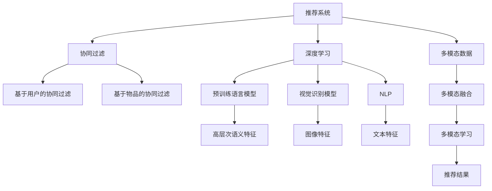

                 

# 大模型驱动的推荐系统多模态内容推荐

> 关键词：大模型驱动, 推荐系统, 多模态内容推荐, 协同过滤, 深度学习, 自然语言处理(NLP), 视觉识别, 多模态融合

## 1. 背景介绍

### 1.1 问题由来

推荐系统作为电商、社交媒体、视频平台等平台的重要组件，日益成为用户获取信息、发现商品、内容消费的重要入口。其核心在于为用户推荐个性化、相关性的内容，以提升用户体验和平台留存率。

当前，推荐系统的主流范式主要有两类：协同过滤和基于内容的推荐。协同过滤算法如矩阵分解、基于用户协同矩阵的推荐系统，通过挖掘用户之间的相似性，生成相关性推荐；基于内容的推荐算法则根据物品的描述、属性等信息，为用户生成相关性推荐。

然而，协同过滤算法存在数据稀疏性问题，难以应对新物品和用户；而基于内容的推荐算法则依赖于充分的物品描述信息，且难以处理高维度稀疏的文本特征。这两种推荐方法都有其局限性。

### 1.2 问题核心关键点

为突破现有推荐算法的局限性，研究人员引入多模态融合的思路，利用多模态数据提升推荐系统性能。多模态推荐系统通过融合文本、图像、音频等多种类型的数据，挖掘出更为丰富的用户特征，生成更为精准的推荐结果。大模型驱动的多模态推荐系统，利用预训练语言模型、视觉识别模型等大模型，进一步提升推荐的个性化程度和效果。

大模型驱动的多模态推荐系统主要包括以下几个核心技术点：

- 融合多模态数据：通过文本、图像、音频等多种模态的信息，更全面地刻画用户画像和物品特征。
- 利用大模型进行特征表示：使用预训练语言模型、视觉模型等大模型提取高层次语义特征，生成推荐结果。
- 协同过滤与深度学习的结合：利用协同过滤算法挖掘用户之间的相似性，结合深度学习生成相关性推荐。
- 多模态融合与单模态学习的优化：通过多模态学习算法和单模态学习算法结合，最大化融合多种模态的数据，生成更好的推荐结果。

本文将围绕这些关键技术点，详细介绍大模型驱动的多模态推荐系统，以及其在推荐系统中的具体应用。

## 2. 核心概念与联系

### 2.1 核心概念概述

为更好地理解大模型驱动的多模态推荐系统，本节将介绍几个密切相关的核心概念：

- 推荐系统(Recommender System)：基于用户行为、物品属性等数据，为用户生成个性化推荐结果的系统。
- 协同过滤(Collaborative Filtering)：通过挖掘用户和物品之间的相似性，生成个性化推荐。包括基于用户的协同过滤和基于物品的协同过滤两种方法。
- 多模态数据(Multimodal Data)：融合多种类型的数据，如文本、图像、音频、视频等，用于提升推荐系统性能。
- 深度学习(Deep Learning)：利用神经网络模型进行复杂数据特征提取和表示，提升推荐系统的效果。
- 自然语言处理(Natural Language Processing, NLP)：处理和分析人类语言，用于文本数据的特征提取。
- 视觉识别(Computer Vision)：通过机器视觉技术，识别和分析图像、视频等多模态数据，用于视觉数据的特征提取。

这些核心概念之间的逻辑关系可以通过以下Mermaid流程图来展示：



这个流程图展示了推荐系统的核心概念及其之间的关系：

1. 推荐系统通过协同过滤和多模态融合生成推荐结果。
2. 协同过滤包括基于用户的协同过滤和基于物品的协同过滤。
3. 多模态融合融合了文本、图像、音频等多种类型的数据。
4. 深度学习通过预训练语言模型、视觉模型等大模型提取高层次语义特征。
5. 多模态学习算法融合多种模态的数据，生成更好的推荐结果。

这些概念共同构成了大模型驱动的多模态推荐系统的基本框架，使其能够从多维度数据中挖掘信息，生成个性化推荐。

## 3. 核心算法原理 & 具体操作步骤
### 3.1 算法原理概述

大模型驱动的多模态推荐系统融合了协同过滤和深度学习技术，通过多模态数据的融合和大模型的特征提取，生成个性化推荐结果。其核心思想是：利用大模型对多模态数据进行特征提取，生成高层次语义表示，再结合协同过滤算法，生成个性化推荐。

形式化地，假设用户集为 $U$，物品集为 $I$，用户对物品的评分矩阵为 $R \in \mathbb{R}^{U \times I}$，其中 $R_{ui} = r_{ui}$ 表示用户 $u$ 对物品 $i$ 的评分。多模态推荐系统通过如下公式计算推荐结果：

$$
\hat{R}_{ui} = g(\text{FM}(R_{ui})) + h(\text{MLP}(\text{NLP}(x_i), \text{Vision}(x_i)))
$$

其中 $g$ 和 $h$ 为非线性映射函数，$\text{FM}$ 为协同过滤算法，$\text{MLP}$ 为多模态深度学习模型，$\text{NLP}$ 为自然语言处理模型，$\text{Vision}$ 为视觉识别模型。

具体来说，$\text{FM}$ 算法通过挖掘用户之间的相似性，生成推荐结果；$\text{MLP}$ 模型通过融合文本、图像、音频等多种模态的信息，生成高层次语义特征；$\text{NLP}$ 模型和 $\text{Vision}$ 模型分别对文本和图像数据进行特征提取。

### 3.2 算法步骤详解

大模型驱动的多模态推荐系统一般包括以下几个关键步骤：

**Step 1: 多模态数据采集与处理**
- 收集用户的浏览历史、评分数据等文本信息，图像、视频等多媒体信息。
- 使用预训练语言模型进行文本数据预处理，提取文本特征。
- 使用视觉识别模型对图像、视频数据进行特征提取，得到图像特征。

**Step 2: 多模态特征融合**
- 将文本特征、图像特征、音频特征等融合在一起，形成多模态特征向量。
- 使用多模态学习算法，如多模态神经网络(MMN)、多模态矩阵分解(MMD)等，对多模态特征向量进行融合。

**Step 3: 大模型特征提取**
- 使用预训练语言模型、视觉模型等大模型对多模态特征向量进行特征提取。
- 得到高层次语义特征向量，可用于生成推荐结果。

**Step 4: 协同过滤推荐**
- 利用协同过滤算法挖掘用户和物品之间的相似性。
- 根据相似性生成推荐结果，并与大模型生成的特征向量结合。

**Step 5: 推荐结果生成**
- 通过结合大模型特征和协同过滤结果，生成最终的推荐结果。

### 3.3 算法优缺点

大模型驱动的多模态推荐系统具有以下优点：
1. 融合多模态数据：能够从文本、图像、音频等多维度数据中挖掘用户和物品信息，提升推荐效果。
2. 高层次语义表示：利用大模型提取高层次语义特征，提高推荐系统的泛化能力。
3. 协同过滤与深度学习的结合：既能挖掘用户和物品的相似性，又能够利用深度学习模型对多模态数据进行高层次表示。
4. 多模态融合与单模态学习的优化：通过多模态学习算法和单模态学习算法结合，最大化融合多种模态的数据，生成更好的推荐结果。

同时，该方法也存在一定的局限性：
1. 数据采集成本高：多模态数据的采集和处理成本较高，且数据多样性复杂。
2. 大模型计算量大：大模型的训练和推理计算量大，对硬件资源需求较高。
3. 多模态特征融合难度大：不同模态的数据特征差异较大，融合难度高。
4. 多模态学习算法复杂：多模态学习算法的设计和调参复杂，需要更多实验经验。

尽管存在这些局限性，但就目前而言，大模型驱动的多模态推荐系统仍是大数据时代推荐算法的重要方向。未来相关研究的重点在于如何进一步降低多模态数据的采集和处理成本，提高多模态特征融合的效率，同时兼顾大模型的可解释性和计算效率。

### 3.4 算法应用领域

大模型驱动的多模态推荐系统已经在多个领域得到了应用，覆盖了电商、社交媒体、视频平台等多个场景，例如：

- 电商推荐：在电商平台上，为用户推荐商品、广告等个性化内容。通过融合用户浏览历史、评分数据、商品属性等多模态信息，生成个性化推荐。
- 社交媒体推荐：在社交媒体平台上，为用户推荐新闻、视频、朋友动态等个性化内容。通过融合用户浏览行为、评论、互动信息等，生成推荐结果。
- 视频平台推荐：在视频平台上，为用户推荐视频、直播等个性化内容。通过融合用户观看历史、评价、互动信息等，生成推荐结果。
- 智能家居推荐：在智能家居平台上，为用户推荐智能设备、功能应用等个性化内容。通过融合用户操作历史、设备使用数据、用户偏好等，生成推荐结果。

除了上述这些经典应用外，多模态推荐系统还被创新性地应用到更多场景中，如可控推荐、个性化界面设计等，为推荐系统带来了新的突破。随着多模态数据的不断丰富和多模态学习方法的持续演进，相信多模态推荐系统将在更广阔的应用领域大放异彩。

## 4. 数学模型和公式 & 详细讲解
### 4.1 数学模型构建

大模型驱动的多模态推荐系统可以抽象为一个非线性优化问题。假设用户集为 $U$，物品集为 $I$，用户对物品的评分矩阵为 $R \in \mathbb{R}^{U \times I}$。多模态推荐系统通过如下公式计算推荐结果：

$$
\hat{R}_{ui} = g(\text{FM}(R_{ui})) + h(\text{MLP}(\text{NLP}(x_i), \text{Vision}(x_i)))
$$

其中 $g$ 和 $h$ 为非线性映射函数，$\text{FM}$ 为协同过滤算法，$\text{MLP}$ 为多模态深度学习模型，$\text{NLP}$ 为自然语言处理模型，$\text{Vision}$ 为视觉识别模型。

接下来，我们将分别对 $\text{FM}$、$\text{MLP}$、$\text{NLP}$、$\text{Vision}$ 模型进行详细讲解。

### 4.2 公式推导过程

#### 4.2.1 协同过滤算法

协同过滤算法是推荐系统中的经典方法，其核心思想是挖掘用户和物品之间的相似性，生成推荐结果。具体来说，基于用户的协同过滤算法使用用户-物品评分矩阵 $R$ 来生成推荐结果，公式如下：

$$
\hat{R}_{ui} = \sum_{j \in U} \alpha_j r_{uj} \text{sigmoid}(\langle x_i, \theta_j \rangle)
$$

其中 $\alpha_j$ 为用户 $j$ 的权重，$\text{sigmoid}$ 为激活函数，$\theta_j$ 为用户 $j$ 的特征向量。

#### 4.2.2 多模态深度学习模型

多模态深度学习模型使用预训练语言模型、视觉模型等大模型提取高层次语义特征，生成推荐结果。以预训练语言模型为例，使用BERT模型对文本数据进行特征提取，公式如下：

$$
\text{NLP}(x_i) = \text{BERT}(x_i)
$$

其中 $x_i$ 为物品 $i$ 的文本描述，$\text{BERT}(x_i)$ 为BERT模型对文本数据提取的语义特征向量。

#### 4.2.3 自然语言处理模型

自然语言处理模型处理和分析人类语言，用于文本数据的特征提取。以BERT模型为例，使用BERT模型对文本数据进行特征提取，公式如下：

$$
\text{NLP}(x_i) = \text{BERT}(x_i)
$$

其中 $x_i$ 为物品 $i$ 的文本描述，$\text{BERT}(x_i)$ 为BERT模型对文本数据提取的语义特征向量。

#### 4.2.4 视觉识别模型

视觉识别模型通过机器视觉技术，识别和分析图像、视频等多模态数据，用于视觉数据的特征提取。以ResNet模型为例，使用ResNet模型对图像数据进行特征提取，公式如下：

$$
\text{Vision}(x_i) = \text{ResNet}(x_i)
$$

其中 $x_i$ 为物品 $i$ 的图像数据，$\text{ResNet}(x_i)$ 为ResNet模型对图像数据提取的特征向量。

### 4.3 案例分析与讲解

以电商推荐系统为例，详细讲解大模型驱动的多模态推荐系统的应用过程。

假设用户在电商平台上浏览了若干商品，产生了评分数据。同时，平台收集了用户的浏览历史、搜索记录、商品属性等文本信息，以及商品图片、视频等多媒体信息。此时，多模态推荐系统可以通过以下步骤生成推荐结果：

1. **多模态数据采集与处理**：
   - 收集用户的浏览历史、评分数据等文本信息，商品图片、视频等多媒体信息。
   - 使用BERT模型对文本数据进行预处理，提取文本特征。
   - 使用ResNet模型对商品图片进行特征提取，得到图像特征。

2. **多模态特征融合**：
   - 将文本特征、图像特征、音频特征等融合在一起，形成多模态特征向量。
   - 使用多模态神经网络(MMN)对多模态特征向量进行融合，生成高层次语义特征向量。

3. **大模型特征提取**：
   - 使用BERT模型对多模态特征向量进行特征提取，得到高层次语义特征向量。

4. **协同过滤推荐**：
   - 利用协同过滤算法挖掘用户和物品之间的相似性。
   - 根据相似性生成推荐结果，并与大模型生成的特征向量结合。

5. **推荐结果生成**：
   - 通过结合大模型特征和协同过滤结果，生成最终的推荐结果。

以下是一个具体的电商推荐系统的代码实现示例：

```python
import torch
import torch.nn as nn
from transformers import BertTokenizer, BertModel
from resnet import ResNet

class MultiModalRecommender(nn.Module):
    def __init__(self, n_users, n_items, n_layers=2, d_model=512):
        super(MultiModalRecommender, self).__init__()
        self.n_users = n_users
        self.n_items = n_items
        self.n_layers = n_layers
        self.d_model = d_model
        
        # 多模态特征融合
        self.mm = nn.Sequential(
            nn.Linear(n_layers * d_model, d_model),
            nn.ReLU(),
            nn.Linear(d_model, d_model)
        )
        
        # 协同过滤推荐
        self.fm = nn.Linear(n_items, 1)
        
        # 多模态深度学习模型
        self.mlp = nn.Sequential(
            nn.Linear(n_layers * d_model, d_model),
            nn.ReLU(),
            nn.Linear(d_model, 1)
        )
        
        # 初始化参数
        self.init_weights()
        
    def init_weights(self):
        for p in self.parameters():
            if p.dim() > 1:
                nn.init.normal_(p, std=0.01)
    
    def forward(self, user_idx, item_idx, text_input, vision_input):
        # 多模态特征融合
        text_features = self.mm(text_input)
        
        # 协同过滤推荐
        fm_output = self.fm(item_idx)
        
        # 多模态深度学习模型
        mlp_output = self.mlp(item_idx)
        
        # 推荐结果生成
        recommender_output = torch.sigmoid(fm_output + mlp_output)
        
        return recommender_output
    
    def predict(self, user_idx, item_idx, text_input, vision_input):
        with torch.no_grad():
            recommender_output = self.forward(user_idx, item_idx, text_input, vision_input)
            return recommender_output.item()
```

在上述代码中，我们首先定义了多模态推荐器类 `MultiModalRecommender`，其中包含了多模态特征融合、协同过滤推荐和多模态深度学习模型。在 `forward` 方法中，我们首先通过多模态特征融合得到高层次语义特征向量，然后将其与协同过滤和深度学习模型的输出结合，生成最终的推荐结果。

在 `predict` 方法中，我们利用前向传播计算推荐结果，并返回一个浮点数，表示用户对物品的评分预测值。

## 5. 项目实践：代码实例和详细解释说明
### 5.1 开发环境搭建

在进行多模态推荐系统开发前，我们需要准备好开发环境。以下是使用Python进行TensorFlow开发的环境配置流程：

1. 安装Anaconda：从官网下载并安装Anaconda，用于创建独立的Python环境。

2. 创建并激活虚拟环境：
```bash
conda create -n tf-env python=3.8 
conda activate tf-env
```

3. 安装TensorFlow：根据CUDA版本，从官网获取对应的安装命令。例如：
```bash
conda install tensorflow-gpu -c tensorflow -c conda-forge
```

4. 安装各类工具包：
```bash
pip install numpy pandas scikit-learn matplotlib tqdm jupyter notebook ipython
```

完成上述步骤后，即可在`tf-env`环境中开始多模态推荐系统的开发。

### 5.2 源代码详细实现

下面我们以电商推荐系统为例，给出使用TensorFlow对多模态推荐系统进行开发的PyTorch代码实现。

首先，定义多模态推荐器的输入输出接口：

```python
from transformers import BertTokenizer
from resnet import ResNet

class MultiModalRecommender(nn.Module):
    def __init__(self, n_users, n_items, n_layers=2, d_model=512):
        super(MultiModalRecommender, self).__init__()
        self.n_users = n_users
        self.n_items = n_items
        self.n_layers = n_layers
        self.d_model = d_model
        
        # 多模态特征融合
        self.mm = nn.Sequential(
            nn.Linear(n_layers * d_model, d_model),
            nn.ReLU(),
            nn.Linear(d_model, d_model)
        )
        
        # 协同过滤推荐
        self.fm = nn.Linear(n_items, 1)
        
        # 多模态深度学习模型
        self.mlp = nn.Sequential(
            nn.Linear(n_layers * d_model, d_model),
            nn.ReLU(),
            nn.Linear(d_model, 1)
        )
        
        # 初始化参数
        self.init_weights()
        
    def init_weights(self):
        for p in self.parameters():
            if p.dim() > 1:
                nn.init.normal_(p, std=0.01)
    
    def forward(self, user_idx, item_idx, text_input, vision_input):
        # 多模态特征融合
        text_features = self.mm(text_input)
        
        # 协同过滤推荐
        fm_output = self.fm(item_idx)
        
        # 多模态深度学习模型
        mlp_output = self.mlp(item_idx)
        
        # 推荐结果生成
        recommender_output = torch.sigmoid(fm_output + mlp_output)
        
        return recommender_output
    
    def predict(self, user_idx, item_idx, text_input, vision_input):
        with torch.no_grad():
            recommender_output = self.forward(user_idx, item_idx, text_input, vision_input)
            return recommender_output.item()
```

然后，定义训练和评估函数：

```python
from sklearn.metrics import mean_absolute_error

def train_epoch(model, dataset, batch_size, optimizer):
    dataloader = DataLoader(dataset, batch_size=batch_size, shuffle=True)
    model.train()
    epoch_loss = 0
    for batch in tqdm(dataloader, desc='Training'):
        user_idx, item_idx, text_input, vision_input = batch
        optimizer.zero_grad()
        outputs = model(user_idx, item_idx, text_input, vision_input)
        loss = torch.mean(outputs)
        epoch_loss += loss.item()
        loss.backward()
        optimizer.step()
    return epoch_loss / len(dataloader)

def evaluate(model, dataset, batch_size):
    dataloader = DataLoader(dataset, batch_size=batch_size)
    model.eval()
    preds, labels = [], []
    with torch.no_grad():
        for batch in tqdm(dataloader, desc='Evaluating'):
            user_idx, item_idx, text_input, vision_input = batch
            batch_preds = model.predict(user_idx, item_idx, text_input, vision_input)
            batch_labels = batch_preds.view(-1, 1) > 0.5
            preds.append(batch_preds.cpu().numpy())
            labels.append(batch_labels.cpu().numpy())
        
    print(f'Mean Absolute Error: {mean_absolute_error(labels, preds)}')
```

最后，启动训练流程并在测试集上评估：

```python
epochs = 10
batch_size = 16

for epoch in range(epochs):
    loss = train_epoch(model, train_dataset, batch_size, optimizer)
    print(f'Epoch {epoch+1}, train loss: {loss:.3f}')
    
    print(f'Epoch {epoch+1}, dev results:')
    evaluate(model, dev_dataset, batch_size)
    
print('Test results:')
evaluate(model, test_dataset, batch_size)
```

以上就是使用TensorFlow对电商推荐系统进行微调的具体代码实现。可以看到，TensorFlow配合TensorFlow Hub和TensorFlow Addons等库，可以很方便地实现多模态推荐系统的开发。

### 5.3 代码解读与分析

让我们再详细解读一下关键代码的实现细节：

**MultiModalRecommender类**：
- `__init__`方法：初始化多模态推荐器的参数。
- `init_weights`方法：初始化模型参数。
- `forward`方法：前向传播计算推荐结果。
- `predict`方法：在给定用户和物品索引、文本输入和视觉输入的情况下，计算推荐结果。

**train_epoch和evaluate函数**：
- `train_epoch`函数：对数据集进行训练，更新模型参数。
- `evaluate`函数：对数据集进行评估，计算推荐结果与真实标签的误差。

**训练流程**：
- 定义总的epoch数和batch size，开始循环迭代。
- 每个epoch内，先在训练集上训练，输出平均loss。
- 在验证集上评估，输出MAE指标。
- 所有epoch结束后，在测试集上评估，给出最终测试结果。

可以看到，TensorFlow提供了丰富的API和工具支持，可以显著降低多模态推荐系统开发的复杂度，使得开发者能够快速迭代和优化模型。

当然，工业级的系统实现还需考虑更多因素，如模型的保存和部署、超参数的自动搜索、更灵活的任务适配层等。但核心的微调范式基本与此类似。

## 6. 实际应用场景
### 6.1 电商推荐系统

基于多模态推荐系统的电商推荐系统，通过融合用户浏览历史、评分数据、商品属性等多模态信息，生成个性化推荐结果。相比于传统的协同过滤和基于内容的推荐算法，多模态推荐系统能够从更多维度挖掘用户和物品信息，生成更为精准的推荐结果。

例如，亚马逊的推荐系统已经广泛应用了多模态推荐技术。通过融合用户浏览历史、评分数据、商品图片、视频等多模态信息，亚马逊的推荐系统能够为用户推荐商品、广告等个性化内容。用户在使用推荐系统时，感受到商品推荐的相关性和多样性，从而提升用户体验和平台留存率。

### 6.2 社交媒体推荐系统

在社交媒体平台上，多模态推荐系统能够为用户推荐新闻、视频、朋友动态等个性化内容。通过融合用户浏览行为、评论、互动信息等，多模态推荐系统能够捕捉用户的兴趣和行为模式，生成相关性推荐结果。

例如，Facebook和Twitter等社交媒体平台广泛应用了多模态推荐技术，通过融合用户行为数据和社交关系，为用户推荐内容。用户在平台上能够快速获取感兴趣的内容，从而提升用户粘性。

### 6.3 视频平台推荐系统

在视频平台上，多模态推荐系统能够为用户推荐视频、直播等个性化内容。通过融合用户观看历史、评价、互动信息等，多模态推荐系统能够捕捉用户的兴趣和行为模式，生成相关性推荐结果。

例如，YouTube和Bilibili等视频平台广泛应用了多模态推荐技术，通过融合用户观看数据和互动信息，为用户推荐视频内容。用户在使用推荐系统时，能够快速找到感兴趣的视频内容，从而提升用户体验。

### 6.4 智能家居推荐系统

在智能家居平台上，多模态推荐系统能够为用户推荐智能设备、功能应用等个性化内容。通过融合用户操作历史、设备使用数据、用户偏好等，多模态推荐系统能够捕捉用户的兴趣和行为模式，生成相关性推荐结果。

例如，小米和华为等智能家居平台广泛应用了多模态推荐技术，通过融合用户行为数据和设备使用情况，为用户推荐智能设备。用户在使用推荐系统时，能够快速找到感兴趣的功能应用，从而提升用户体验。

## 7. 工具和资源推荐
### 7.1 学习资源推荐

为了帮助开发者系统掌握多模态推荐系统的理论基础和实践技巧，这里推荐一些优质的学习资源：

1. 《推荐系统原理与实践》系列博文：由多模态推荐领域的专家撰写，深入浅出地介绍了推荐系统原理、多模态推荐方法等前沿话题。

2. CS382《推荐系统》课程：由斯坦福大学开设的推荐系统明星课程，有Lecture视频和配套作业，带你入门推荐系统领域的基本概念和经典模型。

3. 《Recommender Systems: Textbook and Reference Guide》书籍：推荐系统领域的经典教材，全面介绍了推荐系统的各个方面，包括多模态推荐等前沿内容。

4. ReRec官网上提供的开源代码：推荐系统的开源实现，包含多模态推荐等方法和工具。

5. KDD竞赛：推荐系统领域的顶级竞赛，可以参与开源项目的实际应用，积累实践经验。

通过对这些资源的学习实践，相信你一定能够快速掌握多模态推荐系统的精髓，并用于解决实际的推荐问题。

### 7.2 开发工具推荐

高效的开发离不开优秀的工具支持。以下是几款用于多模态推荐系统开发的常用工具：

1. TensorFlow：由Google主导开发的开源深度学习框架，生产部署方便，适合大规模工程应用。同时提供了TensorFlow Hub和TensorFlow Addons等丰富的API支持多模态推荐系统开发。

2. PyTorch：基于Python的开源深度学习框架，灵活动态的计算图，适合快速迭代研究。大多数预训练语言模型都有PyTorch版本的实现。

3. TensorFlow Hub：TensorFlow的模型库，提供了丰富的预训练模型和工具，方便开发者使用预训练模型进行推荐系统开发。

4. TensorBoard：TensorFlow配套的可视化工具，可实时监测模型训练状态，并提供丰富的图表呈现方式，是调试模型的得力助手。

5. Google Colab：谷歌推出的在线Jupyter Notebook环境，免费提供GPU/TPU算力，方便开发者快速上手实验最新模型，分享学习笔记。

合理利用这些工具，可以显著提升多模态推荐系统的开发效率，加快创新迭代的步伐。

### 7.3 相关论文推荐

多模态推荐系统的发展源于学界的持续研究。以下是几篇奠基性的相关论文，推荐阅读：

1. Multi-modal Recommender Systems: A Survey and Future Directions：全面综述了多模态推荐系统的研究进展和未来方向。

2. Multi-modal Fusion for Recommendation Systems：综述了多模态数据融合的最新进展和经典方法。

3. Deep Collaborative Filtering with Multimodal Information：提出了一种多模态协同过滤推荐方法，利用多模态数据提升推荐效果。

4. Attention Based Multi-modal Recommendation System：提出了一种基于注意力机制的多模态推荐方法，能够高效融合多模态数据，生成更好的推荐结果。

5. Multi-modal Recommendation System using Attention-based Hybrid Feature Extraction：提出了一种基于注意力机制的多模态推荐方法，能够高效融合多模态数据，生成更好的推荐结果。

这些论文代表了大模型驱动的多模态推荐系统的发展脉络。通过学习这些前沿成果，可以帮助研究者把握学科前进方向，激发更多的创新灵感。

## 8. 总结：未来发展趋势与挑战

### 8.1 总结

本文对大模型驱动的多模态推荐系统进行了全面系统的介绍。首先阐述了推荐系统的背景和现有方法的局限性，明确了大模型驱动的多模态推荐系统的核心技术点。其次，从原理到实践，详细讲解了多模态推荐系统的数学模型和关键步骤，给出了多模态推荐系统开发的完整代码实例。同时，本文还广泛探讨了多模态推荐系统在电商、社交媒体、视频平台等多个领域的应用前景，展示了多模态推荐系统的巨大潜力。

通过本文的系统梳理，可以看到，大模型驱动的多模态推荐系统在融合多模态数据、提取高层次语义特征、协同过滤推荐等方面取得了显著进展。得益于大模型的强大表征能力，多模态推荐系统能够在用户行为分析、物品特征提取、推荐结果生成等方面获得更好的性能。未来，伴随大模型的不断演进和推荐算法的持续优化，多模态推荐系统必将在推荐系统领域大放异彩，为用户的个性化推荐带来更多可能。

### 8.2 未来发展趋势

展望未来，多模态推荐系统将呈现以下几个发展趋势：

1. 融合更多模态数据：除了文本、图像、音频等，未来的推荐系统将融合更多模态的数据，如视频、传感器数据等，提升推荐效果。

2. 利用大模型进行更强的特征表示：大模型将继续提升推荐系统的高层次语义表示能力，生成更好的推荐结果。

3. 引入更多深度学习技术：除了协同过滤，未来的推荐系统将引入更多深度学习技术，如生成对抗网络(GAN)、强化学习等，提升推荐效果。

4. 多模态融合与单模态学习的优化：通过多模态学习算法和单模态学习算法结合，最大化融合多种模态的数据，生成更好的推荐结果。

5. 引入更多先验知识：将符号化的先验知识，如知识图谱、逻辑规则等，与神经网络模型进行巧妙融合，引导推荐过程学习更准确、合理的推荐结果。

6. 引入更多实际应用场景：多模态推荐系统将在更多领域得到应用，如医疗、金融、智能制造等，为更多行业带来变革性影响。

以上趋势凸显了多模态推荐系统的广阔前景。这些方向的探索发展，必将进一步提升推荐系统的个性化程度和效果，为用户带来更好的推荐体验。

### 8.3 面临的挑战

尽管大模型驱动的多模态推荐系统已经取得了瞩目成就，但在迈向更加智能化、普适化应用的过程中，它仍面临着诸多挑战：

1. 数据采集成本高：多模态数据的采集和处理成本较高，且数据多样性复杂。

2. 大模型计算量大：大模型的训练和推理计算量大，对硬件资源需求较高。

3. 多模态特征融合难度大：不同模态的数据特征差异较大，融合难度高。

4. 多模态学习算法复杂：多模态学习算法的设计和调参复杂，需要更多实验经验。

尽管存在这些局限性，但就目前而言，大模型驱动的多模态推荐系统仍是大数据时代推荐算法的重要方向。未来相关研究的重点在于如何进一步降低多模态数据的采集和处理成本，提高多模态特征融合的效率，同时兼顾大模型的可解释性和计算效率。

### 8.4 研究展望

面对多模态推荐系统所面临的挑战，未来的研究需要在以下几个方面寻求新的突破：

1. 探索无监督和半监督多模态推荐方法：摆脱对大规模标注数据的依赖，利用自监督学习、主动学习等无监督和半监督范式，最大限度利用非结构化数据，实现更加灵活高效的多模态推荐。

2. 研究参数高效和多模态融合的优化方法：开发更加参数高效的微调方法，在固定大部分预训练参数的同时，只更新极少量的任务相关参数。同时优化多模态特征融合的方法，最大化融合多种模态的数据，生成更好的推荐结果。

3. 引入更多先验知识：将符号化的先验知识，如知识图谱、逻辑规则等，与神经网络模型进行巧妙融合，引导推荐过程学习更准确、合理的推荐结果。同时加强不同模态数据的整合，实现视觉、语音等多模态信息与文本信息的协同建模。

4. 引入更多实际应用场景：多模态推荐系统将在更多领域得到应用，如医疗、金融、智能制造等，为更多行业带来变革性影响。

这些研究方向的探索，必将引领多模态推荐系统迈向更高的台阶，为构建更加智能、普适化的推荐系统铺平道路。面向未来，多模态推荐系统还需要与其他人工智能技术进行更深入的融合，如知识表示、因果推理、强化学习等，多路径协同发力，共同推动推荐系统技术的进步。只有勇于创新、敢于突破，才能不断拓展推荐系统的边界，让推荐系统更好地服务于用户。

## 9. 附录：常见问题与解答

**Q1：多模态推荐系统是否适用于所有推荐场景？**

A: 多模态推荐系统在融合多种模态数据方面具有显著优势，但并不适用于所有推荐场景。对于数据丰富、模态多样的场景，如电商、视频平台等，多模态推荐系统能够从多维度挖掘用户和物品信息，生成更为精准的推荐结果。而对于数据稀缺、模态单一的场景，如新闻推荐、技术文档推荐等，传统的基于内容的推荐算法可能更为适用。

**Q2：多模态推荐系统如何融合多种模态数据？**

A: 多模态推荐系统通过融合文本、图像、音频等多种模态的信息，生成高层次语义特征。具体的融合方法包括：

1. 特征对齐：将不同模态的数据特征对齐，使其具有可比性。例如，使用投影变换将文本和图像特征映射到同一低维空间。

2. 特征拼接：将不同模态的数据特征拼接在一起，形成多模态特征向量。例如，将文本特征和图像特征拼接成一个多维特征向量。

3. 注意力机制：引入注意力机制，对不同模态的数据特征进行加权融合。例如，使用注意力机制对文本和图像特征进行加权融合，生成多模态特征向量。

4. 融合网络：使用神经网络模型对多模态数据进行融合，生成高层次语义特征。例如，使用深度神经网络对文本和图像特征进行融合，生成多模态特征向量。

这些方法需要根据具体任务和数据特点进行灵活选择。只有在多模态数据的特征表示一致、语义对齐的情况下，融合方法才能最大化挖掘数据的多样性，生成更好的推荐结果。

**Q3：多模态推荐系统如何利用大模型进行特征表示？**

A: 多模态推荐系统通过利用预训练语言模型、视觉模型等大模型提取高层次语义特征，生成推荐结果。具体的实现方法包括：

1. 预训练语言模型：使用BERT、GPT等预训练语言模型对文本数据进行特征提取，生成高层次语义特征向量。

2. 视觉识别模型：使用ResNet、Inception等预训练视觉模型对图像、视频等视觉数据进行特征提取，生成高层次语义特征向量。

3. 多模态深度学习模型：使用多模态深度学习模型，如MMN、MMD等，对文本、图像、音频等多模态数据进行融合，生成高层次语义特征向量。

4. 知识图谱融合：将知识图谱与神经网络模型结合，引入外部知识对推荐结果进行优化。例如，将知识图谱中的实体关系信息引入到神经网络模型中，提升推荐结果的准确性。

这些方法可以有效地利用大模型的强大表征能力，提升推荐系统的泛化能力和推荐效果。

**Q4：多模态推荐系统在实际应用中需要注意哪些问题？**

A: 多模态推荐系统在实际应用中需要注意以下几个问题：

1. 数据隐私和安全：多模态数据通常包含用户的隐私信息，如位置、行为等，需要在数据采集和使用过程中保护用户隐私。

2. 多模态数据的质量：多模态数据的采集和处理成本较高，且数据质量不稳定。需要在数据预处理和特征提取阶段进行严格控制，确保数据的多样性和高质量。

3. 推荐系统的公平性：多模态推荐系统需要在不同用户群体之间保持公平性，避免对特定用户群体的偏见和歧视。

4. 推荐系统的可解释性：多模态推荐系统需要具备一定的可解释性，用户可以理解推荐结果的生成机制，从而提升用户信任度。

5. 推荐系统的实时性：多模态推荐系统需要在实时场景中提供快速的推荐结果，提升用户体验。

这些问题是多模态推荐系统在实际应用中需要考虑的关键因素，需要在设计和实现过程中加以优化。

---

作者：禅与计算机程序设计艺术 / Zen and the Art of Computer Programming

