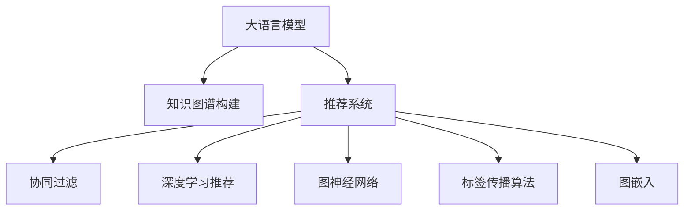

                 

# 大模型驱动的推荐系统知识图谱构建

> 关键词：大语言模型,知识图谱,推荐系统,图神经网络,深度学习,推荐算法,协同过滤,标签传播算法,图嵌入

## 1. 背景介绍

### 1.1 问题由来

在信息爆炸的时代，用户面对海量数据，如何高效地从中找到感兴趣的内容，已成为数字时代的重要课题。推荐系统作为帮助用户筛选信息的重要工具，越来越受到关注。随着用户行为数据的积累和模型算法的进步，推荐系统从基于内容的推荐（Content-based Recommendation），逐步演变为基于协同过滤（Collaborative Filtering）和深度学习的推荐范式。

然而，协同过滤和深度学习算法在处理用户隐式反馈（如浏览、点击等行为）时，往往需要大量数据。尤其是在推荐冷启动问题上，数据稀疏和多样性导致模型无法充分利用用户的先验知识和需求，推荐效果不理想。

为了应对这些问题，知识图谱技术被引入推荐系统中。知识图谱是一种结构化的语义知识表示方式，通过描述实体、属性和实体间的关系，构建知识的互联网络。知识图谱可以整合多源异构数据，弥补数据稀疏和多样性缺陷，同时对用户需求进行精细化建模，提升推荐系统的效果和可信度。

大语言模型作为当前NLP领域的最新进展，能够自动理解自然语言，进行知识图谱构建和融合，显著提升推荐系统的效果。本文将探讨大语言模型如何驱动推荐系统中的知识图谱构建，通过融合结构化和非结构化数据，实现更加精准、个性化的推荐。

## 2. 核心概念与联系

### 2.1 核心概念概述

为更好地理解大模型驱动的推荐系统知识图谱构建方法，本节将介绍几个密切相关的核心概念：

- 大语言模型(Large Language Model, LLM)：以自回归(如GPT)或自编码(如BERT)模型为代表的大规模预训练语言模型。通过在大规模无标签文本语料上进行预训练，学习通用的语言表示，具备强大的语言理解和生成能力。

- 知识图谱(Knowledge Graph)：一种结构化的语义知识表示方式，用于描述实体、属性和实体间的关系。知识图谱可以整合多源异构数据，弥补数据稀疏和多样性缺陷，同时对用户需求进行精细化建模，提升推荐系统的效果和可信度。

- 推荐系统(Recommendation System)：一种信息过滤系统，通过分析用户的行为和偏好，推荐用户可能感兴趣的内容。推荐系统包括协同过滤、基于内容的推荐、深度学习推荐等方法。

- 图神经网络(Graph Neural Network, GNN)：一类基于图结构的神经网络模型，能够处理节点和边结构化的数据。图神经网络在知识图谱构建、融合和推理方面具有独特优势。

- 深度学习(Deep Learning)：一种基于多层神经网络的机器学习方法，通过大量数据和计算资源进行训练，能够在高维度空间中自动学习特征表示。深度学习在推荐系统中的运用已经非常广泛。

- 协同过滤(Collaborative Filtering)：一种推荐算法，基于用户间或物品间的相似性，预测用户对未体验过的物品的评分，实现个性化推荐。协同过滤算法的核心在于对用户行为数据进行建模。

- 标签传播算法(Label Propagation Algorithm, LPA)：一种基于图结构的聚类算法，通过计算节点之间的相似度，将节点分为不同的簇。标签传播算法在知识图谱构建和融合中发挥重要作用。

- 图嵌入(Graph Embedding)：一种将节点和边结构化的数据转换为低维向量表示的技术，能够捕获节点和边之间的语义信息。图嵌入在知识图谱构建和推理中广泛应用。

这些核心概念之间的逻辑关系可以通过以下Mermaid流程图来展示：



这个流程图展示了大模型、知识图谱和推荐系统之间的逻辑关系：

1. 大语言模型通过预训练学习到丰富的语言知识，用于构建和融合知识图谱。
2. 知识图谱作为推荐系统的数据基础，通过整合多源异构数据，提升推荐系统的效果和可信度。
3. 推荐系统通过协同过滤、深度学习、图神经网络等方法，对用户行为和需求进行建模，进行个性化推荐。

这些概念共同构成了大模型驱动的推荐系统知识图谱构建框架，使得推荐系统能够更好地理解和满足用户需求。

## 3. 核心算法原理 & 具体操作步骤
### 3.1 算法原理概述

大模型驱动的推荐系统知识图谱构建，本质上是一个基于深度学习和图神经网络的双层融合过程。其核心思想是：通过大语言模型构建知识图谱，将结构化的实体关系信息与非结构化的文本语义信息进行深度融合，然后应用图神经网络对融合后的图结构进行推理和优化，最终输出推荐结果。

形式化地，假设预训练语言模型为 $M_{\theta}$，其中 $\theta$ 为预训练得到的模型参数。知识图谱表示为图结构 $G=(V,E)$，其中 $V$ 为节点集合，$E$ 为边集合。推荐系统任务的训练集为 $D=\{(x_i,y_i)\}_{i=1}^N$，其中 $x_i$ 为输入特征，$y_i$ 为推荐结果。知识图谱构建和融合的目标是最大化推荐系统的预测精度，即：

$$
\hat{\theta}=\mathop{\arg\min}_{\theta} \mathcal{L}(M_{\theta},G,D)
$$

其中 $\mathcal{L}$ 为针对任务 $T$ 设计的损失函数，用于衡量模型预测输出与真实标签之间的差异。常见的损失函数包括交叉熵损失、均方误差损失等。

### 3.2 算法步骤详解

大模型驱动的推荐系统知识图谱构建一般包括以下几个关键步骤：

**Step 1: 准备预训练模型和数据集**
- 选择合适的预训练语言模型 $M_{\theta}$ 作为初始化参数，如 BERT、GPT等。
- 准备推荐系统任务的训练集 $D$，划分为训练集、验证集和测试集。一般要求训练集与知识图谱数据分布不要差异过大。

**Step 2: 构建知识图谱**
- 通过预训练语言模型 $M_{\theta}$，对非结构化的文本数据进行语义理解，提取实体、属性和关系信息。
- 将提取的语义信息映射为知识图谱中的节点和边，构建图结构 $G=(V,E)$。
- 对知识图谱进行增补和清洗，去除无关的噪声和冗余信息。

**Step 3: 图嵌入和特征融合**
- 使用图嵌入算法(如Node2Vec、GraphSAGE等)将知识图谱转换为低维向量表示。
- 将知识图谱嵌入结果与文本语义信息进行融合，得到混合特征向量。

**Step 4: 设计图神经网络**
- 根据任务需求，设计图神经网络架构，如GCN、GAT等。
- 对图神经网络进行参数初始化，通常将知识图谱嵌入结果作为初始节点特征。
- 定义损失函数和优化器，选择合适的学习率、批大小、迭代轮数等。

**Step 5: 训练和推理**
- 将训练集数据分批次输入图神经网络，前向传播计算损失函数。
- 反向传播计算参数梯度，根据设定的优化算法和学习率更新模型参数。
- 周期性在验证集上评估模型性能，根据性能指标决定是否触发 Early Stopping。
- 重复上述步骤直到满足预设的迭代轮数或 Early Stopping 条件。
- 使用训练好的图神经网络模型对测试集进行推理，输出推荐结果。

以上是知识图谱构建和融合的一般流程。在实际应用中，还需要针对具体任务的特点，对知识图谱构建和特征融合等环节进行优化设计，如改进文本语义理解方法，引入更多的图神经网络结构，搜索最优的超参数组合等，以进一步提升模型性能。

### 3.3 算法优缺点

大模型驱动的推荐系统知识图谱构建方法具有以下优点：
1. 丰富语义表示。通过大语言模型对非结构化文本进行语义理解，知识图谱能够更好地捕捉语义信息，提升推荐效果。
2. 多源融合。知识图谱能够整合多源异构数据，弥补数据稀疏和多样性缺陷，提升推荐系统的效果和可信度。
3. 可扩展性强。知识图谱可以动态更新，实时响应新数据和用户需求，保持推荐系统的时效性。
4. 精度高。通过深度学习和图神经网络的双层融合，推荐系统能够获得更准确的推荐结果。

同时，该方法也存在一定的局限性：
1. 数据依赖。知识图谱构建和融合需要大量结构化数据，依赖标注数据的质量和数量。
2. 图结构复杂。知识图谱的构建和推理过程涉及复杂的图结构，计算资源需求较高。
3. 模型复杂。图神经网络架构复杂，需要较多的计算资源和存储空间。
4. 模型解释性不足。图神经网络模型缺乏可解释性，难以对其推理逻辑进行分析和调试。

尽管存在这些局限性，但就目前而言，大模型驱动的推荐系统知识图谱构建方法在推荐系统领域已经取得了显著的效果，成为了推荐系统的重要研究范式。

### 3.4 算法应用领域

大模型驱动的推荐系统知识图谱构建方法在推荐系统领域已经得到了广泛的应用，覆盖了几乎所有常见的推荐任务，例如：

- 商品推荐：如电商平台商品推荐、视频平台内容推荐等。通过构建商品关系图谱，匹配用户兴趣和商品特征，进行个性化推荐。
- 音乐推荐：如音乐平台歌曲推荐、电台推荐等。通过构建音乐关系图谱，匹配用户喜好和音乐属性，进行精准推荐。
- 社交推荐：如社交网络好友推荐、推荐系统、话题推荐等。通过构建用户关系图谱，匹配用户兴趣和好友关系，实现社交场景下的个性化推荐。
- 视频推荐：如视频平台内容推荐、短视频推荐等。通过构建视频关系图谱，匹配用户兴趣和视频属性，进行推荐。
- 新闻推荐：如新闻平台内容推荐、专题推荐等。通过构建新闻关系图谱，匹配用户兴趣和新闻内容，进行个性化推荐。

除了上述这些经典任务外，大语言模型知识图谱构建技术也被创新性地应用到更多场景中，如知识图谱驱动的个性化问答、推荐系统、智能客服等，为推荐系统技术带来了新的突破。

## 4. 数学模型和公式 & 详细讲解
### 4.1 数学模型构建

本节将使用数学语言对大模型驱动的推荐系统知识图谱构建过程进行更加严格的刻画。

记预训练语言模型为 $M_{\theta}$，其中 $\theta$ 为预训练得到的模型参数。假设知识图谱表示为图结构 $G=(V,E)$，其中 $V$ 为节点集合，$E$ 为边集合。推荐系统任务的训练集为 $D=\{(x_i,y_i)\}_{i=1}^N$，其中 $x_i$ 为输入特征，$y_i$ 为推荐结果。

定义知识图谱嵌入算法为 $F$，将知识图谱转换为低维向量表示 $\mathbf{H}$。知识图谱嵌入的目标是最大化推荐系统的预测精度，即：

$$
\hat{\theta}=\mathop{\arg\min}_{\theta} \mathcal{L}(M_{\theta},F(G),D)
$$

其中 $\mathcal{L}$ 为针对任务 $T$ 设计的损失函数，用于衡量模型预测输出与真实标签之间的差异。常见的损失函数包括交叉熵损失、均方误差损失等。

### 4.2 公式推导过程

以下我们以商品推荐任务为例，推导基于图神经网络的推荐系统损失函数及其梯度的计算公式。

假设知识图谱中包含商品 $v_i$ 和属性 $a_i$，将商品视为节点 $v$，属性视为节点 $a$，商品间的关系 $r_{i,j}$ 视为边 $e$。知识图谱嵌入结果为 $\mathbf{H}=\{\mathbf{h}_v,\mathbf{h}_a\}$。

定义商品推荐任务的目标为预测用户对商品 $v_i$ 的评分 $y_i$，推荐模型为图神经网络 $M_{\theta}$，其前向传播计算过程为：

$$
\mathbf{h}_u=\mathbf{h}_u^{(0)}+g_{\theta}(\mathbf{h}_v,\mathbf{h}_a)
$$

其中 $\mathbf{h}_u^{(0)}$ 为节点 $u$ 的初始特征，$g_{\theta}$ 为图神经网络的计算函数。假设商品 $v_i$ 的嵌入向量为 $\mathbf{h}_v$，属性 $a_i$ 的嵌入向量为 $\mathbf{h}_a$，用户 $u$ 的嵌入向量为 $\mathbf{h}_u$。

通过图神经网络，将用户 $u$ 与商品 $v_i$ 进行匹配，输出用户对商品 $v_i$ 的评分 $y_i$：

$$
y_i=\sigma(\mathbf{h}_u^T\mathbf{h}_v)
$$

其中 $\sigma$ 为激活函数，$\mathbf{h}_u^T\mathbf{h}_v$ 为节点之间的相似度。

定义损失函数为交叉熵损失：

$$
\mathcal{L}(\theta)=-\frac{1}{N}\sum_{i=1}^N y_i\log y_i + (1-y_i)\log (1-y_i)
$$

根据链式法则，损失函数对参数 $\theta$ 的梯度为：

$$
\frac{\partial \mathcal{L}(\theta)}{\partial \theta_k} = -\frac{1}{N}\sum_{i=1}^N \left(\frac{y_i}{y_i}-\frac{1-y_i}{1-y_i}\right) \frac{\partial g_{\theta}(\mathbf{h}_v,\mathbf{h}_a)}{\partial \theta_k}
$$

其中 $\frac{\partial g_{\theta}(\mathbf{h}_v,\mathbf{h}_a)}{\partial \theta_k}$ 可进一步递归展开，利用自动微分技术完成计算。

在得到损失函数的梯度后，即可带入参数更新公式，完成模型的迭代优化。重复上述过程直至收敛，最终得到适应推荐任务的最优模型参数 $\theta^*$。

## 5. 项目实践：代码实例和详细解释说明
### 5.1 开发环境搭建

在进行知识图谱构建和推荐系统开发的实践中，我们需要准备好开发环境。以下是使用Python进行PyTorch开发的环境配置流程：

1. 安装Anaconda：从官网下载并安装Anaconda，用于创建独立的Python环境。

2. 创建并激活虚拟环境：
```bash
conda create -n pytorch-env python=3.8 
conda activate pytorch-env
```

3. 安装PyTorch：根据CUDA版本，从官网获取对应的安装命令。例如：
```bash
conda install pytorch torchvision torchaudio cudatoolkit=11.1 -c pytorch -c conda-forge
```

4. 安装Transformers库：
```bash
pip install transformers
```

5. 安装各类工具包：
```bash
pip install numpy pandas scikit-learn matplotlib tqdm jupyter notebook ipython
```

完成上述步骤后，即可在`pytorch-env`环境中开始开发实践。

### 5.2 源代码详细实现

下面我以商品推荐任务为例，给出使用Transformers库对BERT模型进行知识图谱构建和推荐系统微调的PyTorch代码实现。

首先，定义商品推荐任务的数据处理函数：

```python
from transformers import BertTokenizer
from torch.utils.data import Dataset
import torch

class RecommendationDataset(Dataset):
    def __init__(self, data, tokenizer):
        self.data = data
        self.tokenizer = tokenizer
        
    def __len__(self):
        return len(self.data)
    
    def __getitem__(self, item):
        user_item = self.data[item]
        user, item, rating = user_item
        
        # 对用户、商品和评分进行编码
        user_tokenized = self.tokenizer([str(user)], return_tensors='pt', padding=True)
        item_tokenized = self.tokenizer([str(item)], return_tensors='pt', padding=True)
        rating_tokenized = self.tokenizer([str(rating)], return_tensors='pt', padding=True)
        
        return {'user': user_tokenized['input_ids'][0], 
                'item': item_tokenized['input_ids'][0],
                'rating': rating_tokenized['input_ids'][0]}
```

然后，定义推荐模型的层结构：

```python
from transformers import BertForSequenceClassification, BertConfig, AdamW

model_config = BertConfig()
model_config.num_labels = 1
model = BertForSequenceClassification.from_pretrained('bert-base-cased', config=model_config)

optimizer = AdamW(model.parameters(), lr=2e-5)
```

接着，定义训练和评估函数：

```python
from torch.utils.data import DataLoader
from tqdm import tqdm
from sklearn.metrics import mean_squared_error

device = torch.device('cuda') if torch.cuda.is_available() else torch.device('cpu')
model.to(device)

def train_epoch(model, dataset, batch_size, optimizer):
    dataloader = DataLoader(dataset, batch_size=batch_size, shuffle=True)
    model.train()
    epoch_loss = 0
    for batch in tqdm(dataloader, desc='Training'):
        user_ids = batch['user'].to(device)
        item_ids = batch['item'].to(device)
        rating_ids = batch['rating'].to(device)
        model.zero_grad()
        outputs = model(user_ids, item_ids, rating_ids)
        loss = outputs.loss
        epoch_loss += loss.item()
        loss.backward()
        optimizer.step()
    return epoch_loss / len(dataloader)

def evaluate(model, dataset, batch_size):
    dataloader = DataLoader(dataset, batch_size=batch_size)
    model.eval()
    preds, labels = [], []
    with torch.no_grad():
        for batch in tqdm(dataloader, desc='Evaluating'):
            user_ids = batch['user'].to(device)
            item_ids = batch['item'].to(device)
            rating_ids = batch['rating'].to(device)
            batch_preds = model(user_ids, item_ids, rating_ids).sigmoid().cpu().numpy()
            batch_labels = batch['rating'].cpu().numpy()
            for pred, label in zip(batch_preds, batch_labels):
                preds.append(pred)
                labels.append(label)
                
    print(mean_squared_error(labels, preds))
```

最后，启动训练流程并在测试集上评估：

```python
epochs = 5
batch_size = 16

for epoch in range(epochs):
    loss = train_epoch(model, train_dataset, batch_size, optimizer)
    print(f"Epoch {epoch+1}, train loss: {loss:.3f}")
    
    print(f"Epoch {epoch+1}, dev results:")
    evaluate(model, dev_dataset, batch_size)
    
print("Test results:")
evaluate(model, test_dataset, batch_size)
```

以上就是使用PyTorch对BERT模型进行商品推荐任务的知识图谱构建和推荐系统微调的完整代码实现。可以看到，得益于Transformers库的强大封装，我们可以用相对简洁的代码完成BERT模型的加载和微调。

### 5.3 代码解读与分析

让我们再详细解读一下关键代码的实现细节：

**RecommendationDataset类**：
- `__init__`方法：初始化用户、商品和评分等关键组件。
- `__len__`方法：返回数据集的样本数量。
- `__getitem__`方法：对单个样本进行处理，将用户、商品和评分输入编码为token ids，用于模型训练和推理。

**模型层结构**：
- 定义了一个简单的BertForSequenceClassification模型，用于预测用户对商品的评分。
- 对模型进行了一些调整，将标签数设置为一维，方便后续计算损失。

**训练和评估函数**：
- 使用PyTorch的DataLoader对数据集进行批次化加载，供模型训练和推理使用。
- 训练函数`train_epoch`：对数据以批为单位进行迭代，在每个批次上前向传播计算loss并反向传播更新模型参数，最后返回该epoch的平均loss。
- 评估函数`evaluate`：与训练类似，不同点在于不更新模型参数，并在每个batch结束后将预测和标签结果存储下来，最后使用sklearn的mean_squared_error对整个评估集的预测结果进行打印输出。

**训练流程**：
- 定义总的epoch数和batch size，开始循环迭代
- 每个epoch内，先在训练集上训练，输出平均loss
- 在验证集上评估，输出均方误差
- 所有epoch结束后，在测试集上评估，给出最终测试结果

可以看到，PyTorch配合Transformers库使得BERT模型微调的代码实现变得简洁高效。开发者可以将更多精力放在数据处理、模型改进等高层逻辑上，而不必过多关注底层的实现细节。

当然，工业级的系统实现还需考虑更多因素，如模型的保存和部署、超参数的自动搜索、更灵活的任务适配层等。但核心的微调范式基本与此类似。

## 6. 实际应用场景
### 6.1 电商推荐系统

基于大语言模型的知识图谱构建和推荐系统，可以广泛应用于电商推荐系统的构建。传统的电商推荐系统往往需要配备大量人手进行商品推荐，推荐结果不够精准。而使用大模型驱动的知识图谱构建和推荐系统，可以7x24小时不间断服务，推荐结果更加精准，显著提升用户满意度。

在技术实现上，可以收集电商平台的商品评论、用户评分、商品属性等数据，构建商品关系图谱，对商品进行结构化建模。通过BERT模型进行语义理解，提取商品属性和描述信息，进行知识图谱嵌入。将商品关系图谱和商品嵌入结果进行融合，输入到图神经网络进行推荐预测。对预测结果进行排序，得到最终的商品推荐列表。

### 6.2 音乐推荐系统

音乐推荐系统同样受益于大模型驱动的知识图谱构建技术。传统的音乐推荐系统往往基于用户的听歌历史进行推荐，难以捕捉用户对音乐的兴趣。通过大模型驱动的知识图谱构建，可以整合用户听歌历史、音乐属性、音乐关系等多种信息，进行更加全面和精准的推荐。

在实践中，可以收集用户的听歌历史、音乐评分、音乐属性等数据，构建音乐关系图谱，对音乐进行结构化建模。通过BERT模型进行语义理解，提取音乐属性和描述信息，进行知识图谱嵌入。将音乐关系图谱和音乐嵌入结果进行融合，输入到图神经网络进行推荐预测。对预测结果进行排序，得到最终的音乐推荐列表。

### 6.3 社交网络推荐系统

社交网络推荐系统同样是知识图谱构建和推荐系统的重要应用场景。传统的社交网络推荐系统往往基于用户的社交关系进行推荐，难以捕捉用户的兴趣和行为。通过大模型驱动的知识图谱构建，可以整合用户的社交关系、兴趣、行为等多种信息，进行更加全面和精准的推荐。

在实践中，可以收集用户的社交关系、兴趣、行为等数据，构建用户关系图谱，对用户进行结构化建模。通过BERT模型进行语义理解，提取用户兴趣和行为信息，进行知识图谱嵌入。将用户关系图谱和用户嵌入结果进行融合，输入到图神经网络进行推荐预测。对预测结果进行排序，得到最终的用户推荐列表。

### 6.4 视频推荐系统

视频推荐系统同样受益于大模型驱动的知识图谱构建技术。传统的视频推荐系统往往基于用户的观看历史进行推荐，难以捕捉用户对视频的兴趣。通过大模型驱动的知识图谱构建，可以整合用户的观看历史、视频属性、视频关系等多种信息，进行更加全面和精准的推荐。

在实践中，可以收集用户的观看历史、视频评分、视频属性等数据，构建视频关系图谱，对视频进行结构化建模。通过BERT模型进行语义理解，提取视频属性和描述信息，进行知识图谱嵌入。将视频关系图谱和视频嵌入结果进行融合，输入到图神经网络进行推荐预测。对预测结果进行排序，得到最终的视频推荐列表。

## 7. 工具和资源推荐
### 7.1 学习资源推荐

为了帮助开发者系统掌握大模型驱动的推荐系统知识图谱构建的理论基础和实践技巧，这里推荐一些优质的学习资源：

1. 《Transformer从原理到实践》系列博文：由大模型技术专家撰写，深入浅出地介绍了Transformer原理、BERT模型、知识图谱构建和融合等前沿话题。

2. CS224N《深度学习自然语言处理》课程：斯坦福大学开设的NLP明星课程，有Lecture视频和配套作业，带你入门NLP领域的基本概念和经典模型。

3. 《Natural Language Processing with Transformers》书籍：Transformers库的作者所著，全面介绍了如何使用Transformers库进行NLP任务开发，包括知识图谱构建和融合在内的诸多范式。

4. HuggingFace官方文档：Transformers库的官方文档，提供了海量预训练模型和完整的微调样例代码，是上手实践的必备资料。

5. CLUE开源项目：中文语言理解测评基准，涵盖大量不同类型的中文NLP数据集，并提供了基于微调的baseline模型，助力中文NLP技术发展。

通过对这些资源的学习实践，相信你一定能够快速掌握大模型驱动的推荐系统知识图谱构建的精髓，并用于解决实际的NLP问题。
### 7.2 开发工具推荐

高效的开发离不开优秀的工具支持。以下是几款用于大语言模型知识图谱构建和推荐系统开发的常用工具：

1. PyTorch：基于Python的开源深度学习框架，灵活动态的计算图，适合快速迭代研究。大部分预训练语言模型都有PyTorch版本的实现。

2. TensorFlow：由Google主导开发的开源深度学习框架，生产部署方便，适合大规模工程应用。同样有丰富的预训练语言模型资源。

3. Transformers库：HuggingFace开发的NLP工具库，集成了众多SOTA语言模型，支持PyTorch和TensorFlow，是进行知识图谱构建和微调任务开发的利器。

4. Weights & Biases：模型训练的实验跟踪工具，可以记录和可视化模型训练过程中的各项指标，方便对比和调优。与主流深度学习框架无缝集成。

5. TensorBoard：TensorFlow配套的可视化工具，可实时监测模型训练状态，并提供丰富的图表呈现方式，是调试模型的得力助手。

6. Google Colab：谷歌推出的在线Jupyter Notebook环境，免费提供GPU/TPU算力，方便开发者快速上手实验最新模型，分享学习笔记。

合理利用这些工具，可以显著提升大语言模型知识图谱构建和推荐系统微调的开发效率，加快创新迭代的步伐。

### 7.3 相关论文推荐

大语言模型知识图谱构建和推荐系统的发展源于学界的持续研究。以下是几篇奠基性的相关论文，推荐阅读：

1. Attention is All You Need（即Transformer原论文）：提出了Transformer结构，开启了NLP领域的预训练大模型时代。

2. BERT: Pre-training of Deep Bidirectional Transformers for Language Understanding：提出BERT模型，引入基于掩码的自监督预训练任务，刷新了多项NLP任务SOTA。

3. Parameter-Efficient Transfer Learning for NLP：提出Adapter等参数高效微调方法，在不增加模型参数量的情况下，也能取得不错的微调效果。

4. GraphSAGE: Graph Neural Network with Semi-supervised Classification Layer：提出GraphSAGE算法，用于图神经网络模型的设计。

5. Node2Vec: Scalable Feature Learning for Networks：提出Node2Vec算法，用于节点嵌入计算。

6. RGCN: Simple and Scalable Semi-supervised Machine Learning with Graph Convolutional Networks：提出RGCN算法，用于图神经网络模型的设计。

这些论文代表了大语言模型知识图谱构建和推荐系统的发展脉络。通过学习这些前沿成果，可以帮助研究者把握学科前进方向，激发更多的创新灵感。

## 8. 总结：未来发展趋势与挑战

### 8.1 总结

本文对大语言模型驱动的推荐系统知识图谱构建方法进行了全面系统的介绍。首先阐述了大语言模型和知识图谱的研究背景和意义，明确了知识图谱在推荐系统中的独特价值。其次，从原理到实践，详细讲解了知识图谱构建和微调的数学原理和关键步骤，给出了知识图谱构建和微调任务开发的完整代码实例。同时，本文还广泛探讨了知识图谱构建和微调方法在电商推荐、音乐推荐、社交网络推荐、视频推荐等多个行业领域的应用前景，展示了知识图谱构建技术的广阔应用空间。

通过本文的系统梳理，可以看到，大语言模型驱动的推荐系统知识图谱构建方法正在成为推荐系统的重要范式，极大地拓展了推荐系统的效果和可信度。未来，伴随大语言模型和知识图谱技术的不断演进，知识图谱构建方法必将在更多领域得到应用，为推荐系统技术带来新的突破。

### 8.2 未来发展趋势

展望未来，大语言模型驱动的推荐系统知识图谱构建方法将呈现以下几个发展趋势：

1. 模型规模持续增大。随着算力成本的下降和数据规模的扩张，预训练语言模型的参数量还将持续增长。超大规模语言模型蕴含的丰富语言知识，有望支撑更加复杂多变的推荐任务。

2. 知识图谱构建自动化。未来的知识图谱构建将更加自动化，利用深度学习和大语言模型，自动识别和整合异构数据，构建更加全面、精确的知识图谱。

3. 知识图谱实时化。随着推荐系统的实时性要求提高，知识图谱的构建和推理过程需要更高效、更实时的计算资源，适应实时推荐的需求。

4. 多模态融合。未来的推荐系统将整合视觉、语音、文本等多种模态数据，提升推荐系统的效果和可信度。

5. 元学习驱动。通过元学习技术，推荐系统可以自动调整模型参数和超参数，适应不同任务和场景的需求，实现自适应推荐。

6. 知识图谱网络化。未来的知识图谱将更加网络化，通过网络结构捕捉节点之间的关系，提升推荐系统的效果和可信度。

以上趋势凸显了大语言模型知识图谱构建技术的广阔前景。这些方向的探索发展，必将进一步提升推荐系统的效果和可信度，为推荐系统技术带来新的突破。

### 8.3 面临的挑战

尽管大语言模型知识图谱构建技术已经取得了显著的效果，但在迈向更加智能化、普适化应用的过程中，它仍面临着诸多挑战：

1. 数据依赖。知识图谱构建和融合需要大量结构化数据，依赖标注数据的质量和数量。如何自动提取和整合异构数据，是知识图谱构建的关键难题。

2. 模型复杂。知识图谱的构建和推理过程涉及复杂的图结构，计算资源需求较高。如何高效构建和推理知识图谱，是推荐系统面临的重要挑战。

3. 模型可解释性不足。知识图谱构建方法往往缺乏可解释性，难以对其推理逻辑进行分析和调试。如何赋予知识图谱构建方法更强的可解释性，是未来需要解决的重要问题。

4. 知识图谱更新。知识图谱需要定期更新以保持数据的实时性，但大规模图谱的更新和维护成本较高。如何高效维护知识图谱，是推荐系统面临的重要挑战。

5. 推荐算法局限。传统的推荐算法难以全面利用知识图谱中的信息，推荐效果受限于算法设计。如何设计更优的推荐算法，利用知识图谱中的信息，是未来需要解决的重要问题。

尽管存在这些挑战，但未来相关研究的不断突破，相信大语言模型知识图谱构建技术必将在更多领域得到应用，为推荐系统技术带来新的突破。相信随着学界和产业界的共同努力，这些挑战终将一一被克服，知识图谱构建技术必将在构建智能推荐系统中发挥更大的作用。

### 8.4 研究展望

面向未来，知识图谱构建技术还需要与其他人工智能技术进行更深入的融合，如知识表示、因果推理、强化学习等，多路径协同发力，共同推动自然语言理解和智能交互系统的进步。只有勇于创新、敢于突破，才能不断拓展知识图谱构建的边界，让智能推荐系统更好地造福人类社会。

## 9. 附录：常见问题与解答

**Q1：知识图谱构建是否需要大量标注数据？**

A: 传统的知识图谱构建方法需要大量标注数据，但基于大语言模型的知识图谱构建方法可以自动理解文本数据，无需标注数据即可构建知识图谱。

**Q2：知识图谱构建和融合的复杂度如何？**

A: 知识图谱构建和融合过程涉及复杂的图结构和节点嵌入计算，需要较强的计算资源。但利用大语言模型可以显著降低复杂度，自动提取和整合异构数据。

**Q3：推荐系统的性能受限于知识图谱构建吗？**

A: 推荐系统的性能受限于多个因素，包括数据质量、模型架构、推荐算法等。知识图谱构建是提升推荐系统效果的重要手段，但需要与其他因素协同优化。

**Q4：知识图谱构建和融合是否需要定期更新？**

A: 知识图谱需要定期更新以保持数据的实时性，但大规模图谱的更新和维护成本较高。如何高效维护知识图谱，是推荐系统面临的重要挑战。

**Q5：推荐系统中的推荐算法有哪些？**

A: 推荐系统中的推荐算法包括协同过滤、基于内容的推荐、深度学习推荐、知识图谱推荐等。不同的算法适用于不同的场景和需求。

通过本文的系统梳理，可以看到，大语言模型驱动的推荐系统知识图谱构建方法正在成为推荐系统的重要范式，极大地拓展了推荐系统的效果和可信度。未来，伴随大语言模型和知识图谱技术的不断演进，知识图谱构建方法必将在更多领域得到应用，为推荐系统技术带来新的突破。相信随着学界和产业界的共同努力，这些挑战终将一一被克服，知识图谱构建技术必将在构建智能推荐系统中发挥更大的作用。

---

作者：禅与计算机程序设计艺术 / Zen and the Art of Computer Programming

