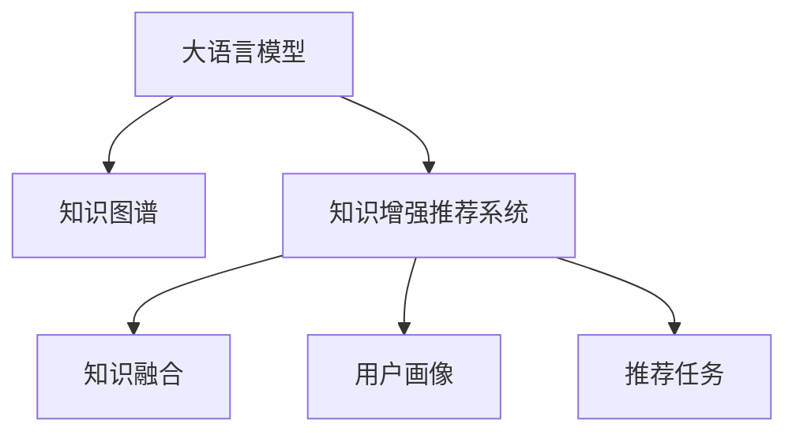

                 

# 大模型驱动的推荐系统知识增强框架

## 1. 背景介绍

### 1.1 问题由来
推荐系统（Recommender Systems）旨在通过智能算法为用户推荐个性化内容，提升用户体验和运营效率。传统的推荐算法以用户行为数据为驱动，通过协同过滤、基于内容的推荐、混合推荐等方法，实现个性化推荐。

然而，基于行为数据的推荐存在诸多局限，如冷启动问题、数据稀疏性、跨领域泛化能力差等。近年来，通过引入深度学习和知识图谱，推荐系统进入了知识增强的2.0时代，开始利用模型参数和大规模结构化知识库，提升推荐效果。

在知识增强推荐系统中，大语言模型（Large Language Models, LLMs）扮演了重要的角色。LLMs通过预训练获得丰富的语言和语义知识，通过微调适应推荐任务的需求，为推荐系统注入语言理解和生成能力，进一步提升了个性化推荐的精度和广度。

### 1.2 问题核心关键点
大模型驱动的推荐系统知识增强框架，本质上是一个跨领域的语言模型微调过程。其核心思想是：将预训练大语言模型视作强大的"知识提取器"，通过微调获得针对推荐任务的知识增强模型，提升推荐系统的智能化水平。

在知识增强推荐系统中，大模型的微调过程通常包括以下几个步骤：
- 选择合适的预训练语言模型 $M_{\theta}$ 作为初始化参数。
- 准备推荐系统任务 $T$ 的标注数据集 $D$，划分为训练集、验证集和测试集。
- 在预训练模型的基础上，添加推荐任务的适配层，并设置微调超参数。
- 执行梯度训练，优化模型在推荐任务上的表现。
- 在测试集上评估微调后模型的性能，集成到实际推荐系统中。

### 1.3 问题研究意义
研究大模型驱动的推荐系统知识增强框架，对于提升推荐系统的智能化水平、拓展知识库的应用边界、加速推荐技术的产业化进程，具有重要意义：

1. 提升推荐精度。大模型的语言理解和生成能力，可以帮助推荐系统深入挖掘用户兴趣和行为背后的语义信息，提升推荐内容的精准度。
2. 拓展知识库应用。预训练语言模型蕴含丰富的语言知识和常识，可以作为知识库的补充和增强，提升推荐系统对多领域数据的适应能力。
3. 加速技术落地。大模型驱动的知识增强推荐系统，可以显著减少从头开发推荐算法所需的计算和人力成本。
4. 促进产业升级。知识增强推荐系统在电商、社交、娱乐等诸多领域都有广泛应用，为传统行业的数字化转型提供了新的技术路径。

## 2. 核心概念与联系

### 2.1 核心概念概述

为更好地理解大模型驱动的推荐系统知识增强框架，本节将介绍几个密切相关的核心概念：

- 大语言模型(Large Language Model, LLM)：以自回归(如GPT)或自编码(如BERT)模型为代表的大规模预训练语言模型。通过在大规模无标签文本语料上进行预训练，学习通用的语言表示，具备强大的语言理解和生成能力。

- 知识图谱(Knowledge Graph)：一种结构化的知识表示方法，用于存储实体和实体之间的关系。知识图谱中包含丰富的语义信息，能够为推荐系统提供跨领域、跨时间的知识支持。

- 知识增强推荐系统(Knowledge-Enhanced Recommender System)：通过引入知识图谱，将推荐系统与知识表示方法相结合，提升推荐内容的语义精度和泛化能力。

- 知识融合(Knowledge Fusion)：将知识图谱与推荐系统中的深度模型相结合，通过融合机制将知识嵌入模型参数，提高推荐模型的泛化能力。

- 用户画像(User Profile)：用户历史行为、兴趣偏好、社交属性等多维度信息的综合表示，用于指导推荐模型的训练和推理。

- 推荐任务(Recommender Task)：推荐系统中的具体任务，如商品推荐、新闻推荐、视频推荐等，可以对应不同的知识增强方法。

这些核心概念之间的逻辑关系可以通过以下Mermaid流程图来展示：



这个流程图展示了大模型驱动的推荐系统知识增强框架的核心概念及其之间的关系：

1. 大语言模型通过预训练获得基础能力。
2. 知识图谱提供了跨领域、跨时间的知识库。
3. 知识增强推荐系统通过融合知识图谱和大模型，提升推荐精度。
4. 用户画像用于个性化推荐模型的训练。
5. 推荐任务驱动知识增强模型进行适配。

这些概念共同构成了大模型驱动的推荐系统知识增强框架，使其能够利用丰富的语言知识和结构化知识，构建跨领域、高效、精准的推荐系统。

## 3. 核心算法原理 & 具体操作步骤
### 3.1 算法原理概述

基于知识增强的大模型推荐系统微调，本质上是一个跨领域的语言模型微调过程。其核心思想是：将预训练大语言模型视作强大的"知识提取器"，通过微调获得针对推荐任务的知识增强模型，提升推荐系统的智能化水平。

形式化地，假设预训练语言模型为 $M_{\theta}$，其中 $\theta$ 为预训练得到的模型参数。给定推荐任务 $T$ 的标注数据集 $D=\{(x_i, y_i)\}_{i=1}^N$，知识增强推荐系统的微调目标是最小化损失函数 $\mathcal{L}(M_{\theta},D)$，使其在推荐任务上的表现接近于真实标签 $y_i$。

通过梯度下降等优化算法，微调过程不断更新模型参数 $\theta$，最小化损失函数 $\mathcal{L}$，使得模型输出逼近真实标签。由于 $\theta$ 已经通过预训练获得了较好的初始化，因此即便在推荐系统小规模数据集 $D$ 上进行微调，也能较快收敛到理想的模型参数 $\hat{\theta}$。

### 3.2 算法步骤详解

基于知识增强的大模型推荐系统微调一般包括以下几个关键步骤：

**Step 1: 准备预训练模型和数据集**
- 选择合适的预训练语言模型 $M_{\theta}$ 作为初始化参数，如 BERT、GPT 等。
- 准备推荐系统任务 $T$ 的标注数据集 $D$，划分为训练集、验证集和测试集。一般要求标注数据与预训练数据的分布不要差异过大。

**Step 2: 添加推荐任务适配层**
- 根据推荐任务类型，在预训练模型顶层设计合适的输出层和损失函数。
- 对于推荐任务，通常在顶层添加点积相似度计算层，计算用户与物品的相似度。
- 对于用户画像，通常使用多分类交叉熵损失函数。

**Step 3: 设置微调超参数**
- 选择合适的优化算法及其参数，如 AdamW、SGD 等，设置学习率、批大小、迭代轮数等。
- 设置正则化技术及强度，包括权重衰减、Dropout、Early Stopping等。
- 确定冻结预训练参数的策略，如仅微调顶层，或全部参数都参与微调。

**Step 4: 执行梯度训练**
- 将训练集数据分批次输入模型，前向传播计算损失函数。
- 反向传播计算参数梯度，根据设定的优化算法和学习率更新模型参数。
- 周期性在验证集上评估模型性能，根据性能指标决定是否触发 Early Stopping。
- 重复上述步骤直到满足预设的迭代轮数或 Early Stopping 条件。

**Step 5: 测试和部署**
- 在测试集上评估微调后模型 $M_{\hat{\theta}}$ 的性能，对比微调前后的精度提升。
- 使用微调后的模型对新物品进行推荐，集成到实际的应用系统中。
- 持续收集新的数据，定期重新微调模型，以适应数据分布的变化。

以上是基于知识增强的大模型推荐系统微调的一般流程。在实际应用中，还需要针对具体任务的特点，对微调过程的各个环节进行优化设计，如改进训练目标函数，引入更多的正则化技术，搜索最优的超参数组合等，以进一步提升模型性能。

### 3.3 算法优缺点

基于知识增强的大模型推荐系统微调方法具有以下优点：
1. 模型精度高。大模型的语言理解和生成能力，能够从用户行为和知识库中提取更深层次的语义信息，提升推荐精度。
2. 泛化能力强。通过知识融合，大模型可以跨越领域、时间的限制，提升推荐模型的泛化能力。
3. 工程实现简便。借助现有的深度学习框架和工具，大模型微调过程相对简单，便于快速迭代。
4. 业务场景广泛。适用于电商、社交、娱乐等多个业务场景，能够快速适配不同应用需求。

同时，该方法也存在一定的局限性：
1. 依赖知识库。知识图谱的构建和维护需要大量人工工作，知识库的准确性和完备性直接影响推荐效果。
2. 数据标注成本高。推荐系统的标注数据通常需要标注用户与物品之间的关系，数据标注工作量大且复杂。
3. 模型计算资源需求高。大模型的参数量和计算量较大，需要高效的分布式计算资源。
4. 应用场景限制。知识图谱与推荐模型的结合，在知识图谱较为丰富的场景下效果显著，但在知识图谱较少的场景下可能不适用。
5. 知识融合难度大。如何将知识图谱与深度模型有效融合，仍需进一步研究和探索。

尽管存在这些局限性，但就目前而言，基于知识增强的大模型推荐系统微调方法，仍是大规模推荐系统中最为流行和有效的技术之一。未来相关研究的重点在于如何进一步降低知识库构建和数据标注成本，提高知识融合效果，优化模型计算资源使用，以及拓展知识图谱的应用场景。

### 3.4 算法应用领域

基于知识增强的大模型推荐系统微调方法，在电商、社交、娱乐等多个领域得到了广泛的应用，取得了显著的效果：

- 电商推荐：通过知识增强模型，可以结合用户画像和商品描述，提供更精准的商品推荐，提升用户购物体验和满意度。
- 社交推荐：结合用户社交网络和兴趣，推荐系统可以发现用户的潜在朋友和兴趣内容，提升社交互动质量。
- 娱乐推荐：结合知识图谱和用户行为，推荐系统可以发现用户的潜在兴趣电影和音乐，提升用户体验和满意度。

此外，知识增强推荐系统也被创新性地应用于更多场景中，如可控内容生成、个性化问答、广告推荐等，为推荐系统带来了全新的突破。随着知识图谱和预训练模型的不断进步，相信知识增强推荐系统将在更多领域发挥重要作用，为推荐技术带来新的增长点。

## 4. 数学模型和公式 & 详细讲解  
### 4.1 数学模型构建

本节将使用数学语言对基于知识增强的大模型推荐系统微调过程进行更加严格的刻画。

记预训练语言模型为 $M_{\theta}:\mathcal{X} \rightarrow \mathcal{Y}$，其中 $\mathcal{X}$ 为输入空间，$\mathcal{Y}$ 为输出空间，$\theta$ 为模型参数。假设推荐任务 $T$ 的标注数据集为 $D=\{(x_i, y_i)\}_{i=1}^N, x_i \in \mathcal{X}, y_i \in \mathcal{Y}$。

定义模型 $M_{\theta}$ 在输入 $x$ 上的损失函数为 $\ell(M_{\theta}(x),y)$，则在数据集 $D$ 上的经验风险为：

$$
\mathcal{L}(\theta) = \frac{1}{N} \sum_{i=1}^N \ell(M_{\theta}(x_i),y_i)
$$

其中 $\ell$ 为推荐任务设计的损失函数，用于衡量模型预测输出与真实标签之间的差异。常见的损失函数包括均方误差损失、点积相似度损失等。

### 4.2 公式推导过程

以下我们以电商推荐任务为例，推导点积相似度损失函数及其梯度的计算公式。

假设推荐模型 $M_{\theta}$ 在输入 $x$ 上的输出为 $\hat{y}=M_{\theta}(x) \in [0,1]$，表示用户对物品 $x$ 的兴趣评分。真实标签 $y \in \{0,1\}$，表示用户是否对物品 $x$ 感兴趣。则点积相似度损失函数定义为：

$$
\ell(M_{\theta}(x),y) = -y\log M_{\theta}(x) + (1-y)\log (1-M_{\theta}(x))
$$

将其代入经验风险公式，得：

$$
\mathcal{L}(\theta) = -\frac{1}{N}\sum_{i=1}^N [y_i\log M_{\theta}(x_i)+(1-y_i)\log(1-M_{\theta}(x_i))]
$$

根据链式法则，损失函数对参数 $\theta_k$ 的梯度为：

$$
\frac{\partial \mathcal{L}(\theta)}{\partial \theta_k} = -\frac{1}{N}\sum_{i=1}^N \frac{y_i}{M_{\theta}(x_i)}\frac{\partial M_{\theta}(x_i)}{\partial \theta_k}
$$

其中 $\frac{\partial M_{\theta}(x_i)}{\partial \theta_k}$ 可进一步递归展开，利用自动微分技术完成计算。

在得到损失函数的梯度后，即可带入参数更新公式，完成模型的迭代优化。重复上述过程直至收敛，最终得到适应推荐任务的最优模型参数 $\theta^*$。

## 5. 项目实践：代码实例和详细解释说明
### 5.1 开发环境搭建

在进行推荐系统微调实践前，我们需要准备好开发环境。以下是使用Python进行PyTorch开发的环境配置流程：

1. 安装Anaconda：从官网下载并安装Anaconda，用于创建独立的Python环境。

2. 创建并激活虚拟环境：
```bash
conda create -n pytorch-env python=3.8 
conda activate pytorch-env
```

3. 安装PyTorch：根据CUDA版本，从官网获取对应的安装命令。例如：
```bash
conda install pytorch torchvision torchaudio cudatoolkit=11.1 -c pytorch -c conda-forge
```

4. 安装Transformers库：
```bash
pip install transformers
```

5. 安装各类工具包：
```bash
pip install numpy pandas scikit-learn matplotlib tqdm jupyter notebook ipython
```

完成上述步骤后，即可在`pytorch-env`环境中开始推荐系统微调实践。

### 5.2 源代码详细实现

下面我以电商推荐任务为例，给出使用Transformers库对BERT模型进行推荐系统微调的PyTorch代码实现。

首先，定义推荐任务的数据处理函数：

```python
from transformers import BertTokenizer
from torch.utils.data import Dataset
import torch

class RecommendationDataset(Dataset):
    def __init__(self, user_behaviors, item_descriptions, tokenizer, max_len=128):
        self.user_behaviors = user_behaviors
        self.item_descriptions = item_descriptions
        self.tokenizer = tokenizer
        self.max_len = max_len
        
    def __len__(self):
        return len(self.user_behaviors)
    
    def __getitem__(self, item):
        user_behavior = self.user_behaviors[item]
        item_description = self.item_descriptions[item]
        
        encoding = self.tokenizer(user_behavior, return_tensors='pt', max_length=self.max_len, padding='max_length', truncation=True)
        item_description = self.tokenizer(item_description, return_tensors='pt', max_length=self.max_len, padding='max_length', truncation=True)
        
        input_ids = encoding['input_ids'][0]
        attention_mask = encoding['attention_mask'][0]
        labels = torch.tensor([1], dtype=torch.long) # 用户对物品感兴趣
        item_input_ids = item_description['input_ids'][0]
        item_attention_mask = item_description['attention_mask'][0]
        labels = torch.tensor([1], dtype=torch.long) # 物品对用户感兴趣
        
        return {'input_ids': input_ids, 
                'attention_mask': attention_mask,
                'labels': labels,
                'item_input_ids': item_input_ids,
                'item_attention_mask': item_attention_mask,
                'item_labels': labels}
```

然后，定义模型和优化器：

```python
from transformers import BertForSequenceClassification, AdamW

model = BertForSequenceClassification.from_pretrained('bert-base-cased', num_labels=2)

optimizer = AdamW(model.parameters(), lr=2e-5)
```

接着，定义训练和评估函数：

```python
from torch.utils.data import DataLoader
from tqdm import tqdm
from sklearn.metrics import classification_report

device = torch.device('cuda') if torch.cuda.is_available() else torch.device('cpu')
model.to(device)

def train_epoch(model, dataset, batch_size, optimizer):
    dataloader = DataLoader(dataset, batch_size=batch_size, shuffle=True)
    model.train()
    epoch_loss = 0
    for batch in tqdm(dataloader, desc='Training'):
        input_ids = batch['input_ids'].to(device)
        attention_mask = batch['attention_mask'].to(device)
        labels = batch['labels'].to(device)
        item_input_ids = batch['item_input_ids'].to(device)
        item_attention_mask = batch['item_attention_mask'].to(device)
        item_labels = batch['item_labels'].to(device)
        model.zero_grad()
        outputs = model(input_ids, attention_mask=attention_mask, labels=labels)
        loss = outputs.loss
        epoch_loss += loss.item()
        loss.backward()
        optimizer.step()
    return epoch_loss / len(dataloader)

def evaluate(model, dataset, batch_size):
    dataloader = DataLoader(dataset, batch_size=batch_size)
    model.eval()
    preds, labels = [], []
    with torch.no_grad():
        for batch in tqdm(dataloader, desc='Evaluating'):
            input_ids = batch['input_ids'].to(device)
            attention_mask = batch['attention_mask'].to(device)
            labels = batch['labels'].to(device)
            item_input_ids = batch['item_input_ids'].to(device)
            item_attention_mask = batch['item_attention_mask'].to(device)
            item_labels = batch['item_labels'].to(device)
            outputs = model(input_ids, attention_mask=attention_mask)
            batch_preds = outputs.logits.argmax(dim=2).to('cpu').tolist()
            batch_labels = batch_labels.to('cpu').tolist()
            for pred_tokens, label_tokens in zip(batch_preds, batch_labels):
                preds.append(pred_tokens[:len(label_tokens)])
                labels.append(label_tokens)
                
    print(classification_report(labels, preds))
```

最后，启动训练流程并在测试集上评估：

```python
epochs = 5
batch_size = 16

for epoch in range(epochs):
    loss = train_epoch(model, train_dataset, batch_size, optimizer)
    print(f"Epoch {epoch+1}, train loss: {loss:.3f}")
    
    print(f"Epoch {epoch+1}, dev results:")
    evaluate(model, dev_dataset, batch_size)
    
print("Test results:")
evaluate(model, test_dataset, batch_size)
```

以上就是使用PyTorch对BERT进行推荐系统微调的完整代码实现。可以看到，得益于Transformers库的强大封装，我们可以用相对简洁的代码完成BERT模型的加载和微调。

### 5.3 代码解读与分析

让我们再详细解读一下关键代码的实现细节：

**RecommendationDataset类**：
- `__init__`方法：初始化用户行为、物品描述、分词器等关键组件。
- `__len__`方法：返回数据集的样本数量。
- `__getitem__`方法：对单个样本进行处理，将用户行为和物品描述输入编码为token ids，最终返回模型所需的输入。

**模型和优化器**：
- 使用BERT的线性分类层和AdamW优化器。

**训练和评估函数**：
- 使用PyTorch的DataLoader对数据集进行批次化加载，供模型训练和推理使用。
- 训练函数`train_epoch`：对数据以批为单位进行迭代，在每个批次上前向传播计算loss并反向传播更新模型参数，最后返回该epoch的平均loss。
- 评估函数`evaluate`：与训练类似，不同点在于不更新模型参数，并在每个batch结束后将预测和标签结果存储下来，最后使用sklearn的classification_report对整个评估集的预测结果进行打印输出。

**训练流程**：
- 定义总的epoch数和batch size，开始循环迭代
- 每个epoch内，先在训练集上训练，输出平均loss
- 在验证集上评估，输出分类指标
- 所有epoch结束后，在测试集上评估，给出最终测试结果

可以看到，PyTorch配合Transformers库使得BERT微调的代码实现变得简洁高效。开发者可以将更多精力放在数据处理、模型改进等高层逻辑上，而不必过多关注底层的实现细节。

当然，工业级的系统实现还需考虑更多因素，如模型的保存和部署、超参数的自动搜索、更灵活的任务适配层等。但核心的微调范式基本与此类似。

## 6. 实际应用场景
### 6.1 智能客服系统

基于知识增强的大模型推荐系统，可以广泛应用于智能客服系统的构建。传统客服往往需要配备大量人力，高峰期响应缓慢，且一致性和专业性难以保证。而使用知识增强的推荐系统，可以7x24小时不间断服务，快速响应客户咨询，用自然流畅的语言解答各类常见问题。

在技术实现上，可以收集企业内部的历史客服对话记录，将问题和最佳答复构建成监督数据，在此基础上对预训练推荐系统进行微调。微调后的推荐系统能够自动理解用户意图，匹配最合适的答复模板进行回复。对于客户提出的新问题，还可以接入检索系统实时搜索相关内容，动态组织生成回答。如此构建的智能客服系统，能大幅提升客户咨询体验和问题解决效率。

### 6.2 金融舆情监测

金融机构需要实时监测市场舆论动向，以便及时应对负面信息传播，规避金融风险。传统的人工监测方式成本高、效率低，难以应对网络时代海量信息爆发的挑战。基于知识增强的推荐系统文本分类和情感分析技术，为金融舆情监测提供了新的解决方案。

具体而言，可以收集金融领域相关的新闻、报道、评论等文本数据，并对其进行主题标注和情感标注。在此基础上对预训练语言模型进行微调，使其能够自动判断文本属于何种主题，情感倾向是正面、中性还是负面。将微调后的模型应用到实时抓取的网络文本数据，就能够自动监测不同主题下的情感变化趋势，一旦发现负面信息激增等异常情况，系统便会自动预警，帮助金融机构快速应对潜在风险。

### 6.3 个性化推荐系统

当前的推荐系统往往只依赖用户的历史行为数据进行物品推荐，无法深入理解用户的真实兴趣偏好。基于知识增强的推荐系统，可以更好地挖掘用户行为背后的语义信息，从而提供更精准、多样的推荐内容。

在实践中，可以收集用户浏览、点击、评论、分享等行为数据，提取和用户交互的物品标题、描述、标签等文本内容。将文本内容作为模型输入，用户的后续行为（如是否点击、购买等）作为监督信号，在此基础上微调预训练语言模型。微调后的模型能够从文本内容中准确把握用户的兴趣点。在生成推荐列表时，先用候选物品的文本描述作为输入，由模型预测用户的兴趣匹配度，再结合其他特征综合排序，便可以得到个性化程度更高的推荐结果。

### 6.4 未来应用展望

随着知识增强推荐系统的不断发展，其在更多领域的应用将不断拓展。

在智慧医疗领域，基于知识增强的问答、病历分析、药物推荐等应用将提升医疗服务的智能化水平，辅助医生诊疗，加速新药开发进程。

在智能教育领域，知识增强推荐系统可应用于作业批改、学情分析、知识推荐等方面，因材施教，促进教育公平，提高教学质量。

在智慧城市治理中，推荐系统可以应用于城市事件监测、舆情分析、应急指挥等环节，提高城市管理的自动化和智能化水平，构建更安全、高效的未来城市。

此外，在企业生产、社会治理、文娱传媒等众多领域，基于大模型的推荐系统也将不断涌现，为传统行业数字化转型提供新的技术路径。相信随着技术的日益成熟，知识增强推荐系统必将在构建人机协同的智能时代中扮演越来越重要的角色。

## 7. 工具和资源推荐
### 7.1 学习资源推荐

为了帮助开发者系统掌握知识增强推荐系统的理论基础和实践技巧，这里推荐一些优质的学习资源：

1. 《Recommender Systems: Algorithms and Architectures》书籍：该书系统介绍了推荐系统的基本原理和多种推荐算法，是推荐系统领域的重要参考资料。

2. 《Deep Learning for Recommendation Systems》在线课程：由DeepLearning.AI提供的推荐系统课程，介绍了深度学习在推荐系统中的应用，涵盖了知识增强、深度协同过滤等前沿技术。

3. 《Knowledge-Graphs and Recommendation Systems》书籍：该书深入探讨了知识图谱与推荐系统的融合方法，提供了丰富的案例和实践指南。

4. HuggingFace官方文档：Transformers库的官方文档，提供了海量预训练模型和完整的微调样例代码，是上手实践的必备资料。

5. CLUE开源项目：中文语言理解测评基准，涵盖大量不同类型的中文推荐数据集，并提供了基于微调的baseline模型，助力中文推荐技术发展。

通过对这些资源的学习实践，相信你一定能够快速掌握知识增强推荐系统的精髓，并用于解决实际的推荐问题。
###  7.2 开发工具推荐

高效的开发离不开优秀的工具支持。以下是几款用于知识增强推荐系统开发的常用工具：

1. PyTorch：基于Python的开源深度学习框架，灵活动态的计算图，适合快速迭代研究。大部分预训练语言模型都有PyTorch版本的实现。

2. TensorFlow：由Google主导开发的开源深度学习框架，生产部署方便，适合大规模工程应用。同样有丰富的预训练语言模型资源。

3. Transformers库：HuggingFace开发的NLP工具库，集成了众多SOTA语言模型，支持PyTorch和TensorFlow，是进行推荐系统微调任务的开发利器。

4. Weights & Biases：模型训练的实验跟踪工具，可以记录和可视化模型训练过程中的各项指标，方便对比和调优。与主流深度学习框架无缝集成。

5. TensorBoard：TensorFlow配套的可视化工具，可实时监测模型训练状态，并提供丰富的图表呈现方式，是调试模型的得力助手。

6. Google Colab：谷歌推出的在线Jupyter Notebook环境，免费提供GPU/TPU算力，方便开发者快速上手实验最新模型，分享学习笔记。

合理利用这些工具，可以显著提升知识增强推荐系统的开发效率，加快创新迭代的步伐。

### 7.3 相关论文推荐

知识增强推荐系统的研究源于学界的持续研究。以下是几篇奠基性的相关论文，推荐阅读：

1. Knowledge-aware Recommender Systems: A Survey and Taxonomy：该论文综述了知识增强推荐系统的理论基础和多种方法，为深入理解推荐系统提供了全面的视角。

2. Neural Collaborative Filtering（NCF）：提出了基于深度神经网络的协同过滤模型，广泛应用于电商推荐、社交推荐等领域。

3. Attention-based Recommender Systems：介绍了注意力机制在推荐系统中的应用，提升了推荐模型的精度和泛化能力。

4. Graph Neural Networks for Recommendation Systems：提出了基于图神经网络的推荐系统，利用知识图谱中的结构信息提升推荐效果。

5. DENO：基于深度增强学习的推荐系统，引入生成对抗网络（GAN）进行模型优化，提升了推荐精度和多样性。

这些论文代表了大模型驱动的知识增强推荐系统的研究进展。通过学习这些前沿成果，可以帮助研究者把握学科前进方向，激发更多的创新灵感。

## 8. 总结：未来发展趋势与挑战

### 8.1 总结

本文对基于知识增强的大模型推荐系统微调方法进行了全面系统的介绍。首先阐述了知识增强推荐系统的研究背景和意义，明确了知识增强框架在大模型微调中的重要地位。其次，从原理到实践，详细讲解了知识增强推荐系统的数学原理和关键步骤，给出了微调任务开发的完整代码实例。同时，本文还广泛探讨了知识增强推荐系统在电商、社交、娱乐等多个领域的应用前景，展示了知识增强框架的广阔应用前景。此外，本文精选了知识增强推荐系统的各类学习资源，力求为读者提供全方位的技术指引。

通过本文的系统梳理，可以看到，基于知识增强的大模型推荐系统微调方法，通过融合大模型和知识图谱，实现了推荐系统从基于用户行为到基于知识表示的跨越，提升了推荐精度和泛化能力。未来，伴随预训练语言模型和知识图谱的不断进步，知识增强推荐系统必将在更多领域发挥重要作用，为推荐技术带来新的增长点。

### 8.2 未来发展趋势

展望未来，知识增强推荐系统将呈现以下几个发展趋势：

1. 知识图谱与大模型的融合将更加紧密。未来的推荐系统将更好地整合知识图谱中的结构化信息和深度模型中的语义信息，实现跨领域、跨时间的知识融合。

2. 知识增强推荐模型的自动化构建将成为可能。自动构建知识图谱、自动选择知识增强方法、自动优化模型参数，将使得知识增强推荐系统的构建更加高效和通用。

3. 推荐系统的解释性和可控性将显著提升。通过引入因果推断和博弈论工具，推荐系统将具备更强的可解释性和可控性，能够主动探索并规避模型的脆弱点。

4. 推荐系统将更加依赖于多模态数据融合。将文本、图像、语音等多模态数据结合，构建更加全面、准确的推荐模型，提升推荐系统的智能化水平。

5. 推荐系统将面向特定领域的优化需求。针对特定领域的推荐任务，将发展出更加高效的微调方法，提升推荐系统的适用性和精准度。

6. 推荐系统将引入伦理和安全性约束。推荐系统中的偏见、有害信息等问题将引起更多关注，系统设计将加入伦理和安全性约束，保障用户隐私和数据安全。

以上趋势凸显了知识增强推荐系统的广阔前景。这些方向的探索发展，必将进一步提升推荐系统的智能化水平，为推荐技术带来新的突破。

### 8.3 面临的挑战

尽管知识增强推荐系统已经取得了显著成就，但在迈向更加智能化、普适化应用的过程中，它仍面临着诸多挑战：

1. 知识图谱构建和维护成本高。知识图谱的构建和维护需要大量人工工作，数据的质量和完备性直接影响推荐效果。

2. 数据标注成本高。推荐系统的标注数据通常需要标注用户与物品之间的关系，数据标注工作量大且复杂。

3. 模型计算资源需求高。大模型的参数量和计算量较大，需要高效的分布式计算资源。

4. 模型泛化能力有限。当前的知识增强方法主要依赖于结构化知识，难以灵活应用到非结构化数据和跨领域数据。

5. 推荐模型难以解释。当前的推荐模型通常较为复杂，难以解释其内部工作机制和决策逻辑。

6. 推荐系统可能存在偏见。预训练模型和知识图谱中的偏见可能会传递到推荐模型，造成推荐偏见。

尽管存在这些挑战，但就目前而言，基于知识增强的推荐系统仍是大规模推荐系统中最为流行和有效的技术之一。未来相关研究的重点在于如何进一步降低知识图谱构建和数据标注成本，提高知识融合效果，优化模型计算资源使用，以及拓展知识图谱的应用场景。

### 8.4 研究展望

面对知识增强推荐系统所面临的种种挑战，未来的研究需要在以下几个方面寻求新的突破：

1. 探索无监督和半监督知识增强方法。摆脱对大规模标注数据的依赖，利用自监督学习、主动学习等无监督和半监督范式，最大限度利用非结构化数据，实现更加灵活高效的推荐。

2. 研究知识增强的参数高效微调方法。开发更加参数高效的推荐模型，在固定大部分预训练参数的同时，只更新极少量的任务相关参数。同时优化推荐模型的计算图，减少前向传播和反向传播的资源消耗，实现更加轻量级、实时性的部署。

3. 引入因果学习和博弈论工具。通过引入因果推断和博弈论思想，增强推荐模型建立稳定因果关系的能力，学习更加普适、鲁棒的语言表征，从而提升推荐模型的泛化能力和可控性。

4. 纳入伦理道德约束。在推荐系统训练目标中引入伦理导向的评估指标，过滤和惩罚有偏见、有害的输出倾向。同时加强人工干预和审核，建立推荐行为的监管机制，确保推荐系统的安全性。

这些研究方向的探索，必将引领知识增强推荐系统迈向更高的台阶，为构建安全、可靠、可解释、可控的推荐系统铺平道路。面向未来，知识增强推荐系统还需要与其他人工智能技术进行更深入的融合，如知识表示、因果推理、强化学习等，多路径协同发力，共同推动推荐系统技术的进步。只有勇于创新、敢于突破，才能不断拓展推荐系统的边界，让推荐技术更好地造福人类社会。

## 9. 附录：常见问题与解答
**Q1：知识增强推荐系统是否适用于所有推荐场景？**

A: 知识增强推荐系统适用于需要结构化知识支持的推荐场景，如电商推荐、社交推荐、娱乐推荐等。但对于一些基于用户行为的无结构化数据推荐场景，如基于文本的情感分析、基于图像的推荐等，知识增强方法可能不适用。

**Q2：微调过程中如何选择合适的学习率？**

A: 知识增强推荐系统的微调学习率一般要比预训练时小1-2个数量级，如果使用过大的学习率，容易破坏预训练权重，导致过拟合。一般建议从1e-5开始调参，逐步减小学习率，直至收敛。也可以使用warmup策略，在开始阶段使用较小的学习率，再逐渐过渡到预设值。

**Q3：知识增强推荐系统在落地部署时需要注意哪些问题？**

A: 将知识增强推荐系统转化为实际应用，还需要考虑以下因素：
1. 模型裁剪：去除不必要的层和参数，减小模型尺寸，加快推理速度。
2. 量化加速：将浮点模型转为定点模型，压缩存储空间，提高计算效率。
3. 服务化封装：将模型封装为标准化服务接口，便于集成调用。
4. 弹性伸缩：根据请求流量动态调整资源配置，平衡服务质量和成本。
5. 监控告警：实时采集系统指标，设置异常告警阈值，确保服务稳定性。
6. 安全防护：采用访问鉴权、数据脱敏等措施，保障数据和模型安全。

知识增强推荐系统在落地部署时，需要关注模型的压缩、量化、服务化封装等工程问题，以及监控、告警、安全防护等保障措施。

**Q4：如何缓解知识增强推荐系统中的过拟合问题？**

A: 过拟合是知识增强推荐系统面临的主要挑战，尤其是在标注数据不足的情况下。常见的缓解策略包括：
1. 数据增强：通过回译、近义替换等方式扩充训练集。
2. 正则化：使用L2正则、Dropout、Early Stopping等避免过拟合。
3. 对抗训练：引入对抗样本，提高模型鲁棒性。
4. 参数高效微调：只调整少量参数(如Adapter、Prefix等)，减小过拟合风险。
5. 多模型集成：训练多个知识增强模型，取平均输出，抑制过拟合。

这些策略往往需要根据具体任务和数据特点进行灵活组合。只有在数据、模型、训练、推理等各环节进行全面优化，才能最大限度地发挥知识增强推荐系统的威力。

**Q5：知识增强推荐系统在实际应用中需要注意哪些问题？**

A: 知识增强推荐系统在实际应用中，还需要考虑以下问题：
1. 知识库的选择和构建：选择合适的知识图谱和构建方法，确保知识库的质量和完备性。
2. 知识增强模型的选择：根据具体任务选择最合适的知识增强方法，如深度协同过滤、知识图谱增强等。
3. 知识融合的效果：如何有效地将知识图谱中的结构化信息与深度模型中的语义信息融合，提升推荐效果。
4. 推荐系统的解释性和可控性：通过引入因果推断和博弈论工具，提升推荐系统的解释性和可控性。
5. 推荐系统的偏见和公平性：在推荐系统训练目标中引入伦理导向的评估指标，过滤和惩罚有偏见、有害的输出倾向。

知识增强推荐系统在实际应用中，需要关注知识库的选择和构建、知识融合的效果、推荐系统的解释性和可控性等关键问题，确保推荐系统的质量和公正性。

---

作者：禅与计算机程序设计艺术 / Zen and the Art of Computer Programming

