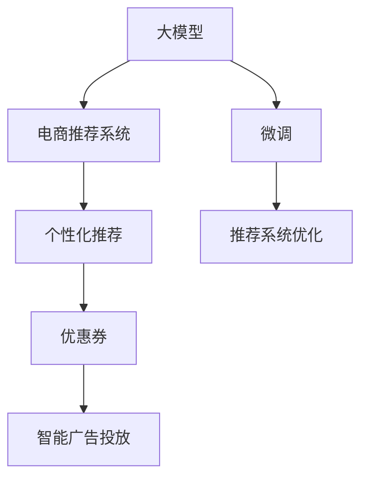

                 

# 大模型驱动的电商个性化优惠券分发策略

> 关键词：电商，个性化推荐，深度学习，电商平台，优惠券分发，大模型

## 1. 背景介绍

在数字化转型的大趋势下，电商平台逐渐成为消费者获取商品信息、完成交易的重要渠道。随着市场竞争的加剧，电商企业需要不断提升用户体验，才能赢得更多客户。而个性化推荐和大规模优惠券的发放，是电商企业提升用户满意度和忠诚度的有效手段。但传统的推荐算法和手动制定的优惠券分发策略，往往难以精确匹配用户需求，导致资源浪费和用户满意度下降。大模型技术的兴起，为电商行业个性化推荐和优惠券分发策略的优化带来了新的机遇。

### 1.1 个性化推荐在电商中的作用

个性化推荐系统通过对用户行为数据的分析，预测用户可能感兴趣的商品，帮助用户快速找到合适的产品。电商平台的个性化推荐，能够显著提升用户浏览、购买转化率，提升用户粘性，减少库存积压。以亚马逊为例，其推荐算法使商品销量提升高达20%。

个性化推荐系统主要由用户行为数据、商品属性、用户画像等输入，通过机器学习模型预测用户的兴趣和购买意愿。基于深度学习的推荐模型可以自适应用户的历史行为数据和上下文信息，从而实现更精确、高效的个性化推荐。

### 1.2 大模型在电商中的应用现状

当前，大模型在电商个性化推荐中的应用已较为广泛，如京东、淘宝等电商平台都已经在使用大模型进行个性化推荐。这些大模型主要基于深度神经网络，通过在电商数据上预训练获得对电商领域的深度理解，再经过微调适配电商推荐场景，从而获得更好的性能。

大模型不仅在电商推荐上表现出色，还在电商搜索、智能客服等领域被广泛应用。例如，京东使用了基于GPT-3的智能客服系统，显著提高了客服效率和用户满意度。未来，大模型有望在电商营销、供应链管理等方面发挥更大的作用。

### 1.3 电商优惠券发放策略的现状与挑战

电商平台的优惠券发放，是提升用户转化率、刺激消费的有效手段。传统的优惠券发放策略主要有以下几种：

- **统一时间分发**：在特定时间统一发放优惠券，如节假日、双11等，但这种策略无法根据用户需求进行精准分发，容易浪费资源。
- **用户注册赠送**：对新注册用户赠送优惠券，吸引新用户注册，但这种方式无法覆盖已有用户，且吸引力有限。
- **特定条件赠送**：根据用户购买金额、消费频次等特定条件赠送优惠券，但这种策略无法覆盖所有用户，且成本较高。
- **特定商品赠送**：对特定商品进行优惠券发放，提升该商品销量，但这种方式容易造成某些商品过度打折，影响商品价格体系。

以上策略存在一定局限性，难以实现大规模、个性化、低成本的优惠券分发。大模型技术的应用，有望解决这些问题，实现更加精准、高效的优惠券分发策略。

## 2. 核心概念与联系

### 2.1 核心概念概述

为更好地理解大模型驱动的电商个性化优惠券分发策略，本节将介绍几个密切相关的核心概念：

- **大模型（Large Model）**：指使用深度神经网络在大量数据上预训练得到的巨大模型，如BERT、GPT等，具备强大的学习能力。
- **电商推荐系统（E-commerce Recommendation System）**：基于用户行为和商品属性，推荐用户可能感兴趣的电商商品，帮助用户快速决策。
- **优惠券（Coupon）**：电商平台发放的一种折扣凭证，用于激励用户购买，减少库存压力，提升转化率。
- **个性化推荐（Personalized Recommendation）**：根据用户历史行为、偏好、画像等，推荐个性化商品，提升用户满意度。
- **大模型驱动的推荐（Large Model-driven Recommendation）**：利用大模型预训练的知识和能力，进行电商推荐和优惠券分发。
- **推荐系统优化（Recommendation System Optimization）**：通过不断优化推荐策略和算法，提升推荐系统的效果和用户体验。
- **智能广告投放（Smart Ad Placement）**：根据用户画像和行为特征，智能投放广告，提升广告点击率和转化率。

这些核心概念之间的逻辑关系可以通过以下Mermaid流程图来展示：



这个流程图展示了大模型在电商推荐和优惠券分发中的关键作用：

1. 大模型在电商数据上进行预训练，学习电商领域的知识和规律。
2. 微调后的电商推荐系统，利用大模型的知识进行个性化推荐，提升用户满意度和转化率。
3. 个性化推荐生成的推荐商品，通过优惠券策略进行分发，刺激用户购买。
4. 智能广告投放系统，根据用户画像和行为特征，精准投放广告，提升广告效果。

以上概念共同构成了大模型在电商行业的应用框架，使得大模型可以更好地应用于个性化推荐和优惠券分发策略的优化。

## 3. 核心算法原理 & 具体操作步骤
### 3.1 算法原理概述

大模型驱动的电商个性化优惠券分发策略，本质上是一个基于深度学习的大规模推荐优化问题。其核心思想是：利用大模型对电商数据进行预训练，学习电商领域的知识，通过微调优化电商推荐系统和优惠券分发策略，实现个性化推荐和精准分发。

具体而言，大模型在电商数据上预训练得到电商领域的知识表示，再通过微调适配电商推荐场景，生成推荐商品。对于每个推荐商品，大模型会预测用户的点击概率和购买概率，并据此生成优惠券。优惠券分发策略根据用户的兴趣、行为、消费能力等特征，进行精准分发，提升用户转化率。

### 3.2 算法步骤详解

大模型驱动的电商个性化优惠券分发策略通常包括以下关键步骤：

**Step 1: 数据预处理与特征工程**
- 收集电商平台的交易数据、用户行为数据、商品属性数据等，进行数据清洗和预处理。
- 将电商数据进行标准化、归一化处理，生成特征向量，供大模型进行学习。

**Step 2: 大模型预训练**
- 选择合适的大模型架构，如BERT、GPT等，在电商数据上进行预训练。
- 利用掩码语言模型、下一句预测等任务，学习电商领域的知识表示。
- 将预训练后的模型保存，作为后续微调的基础。

**Step 3: 电商推荐微调**
- 在大模型基础上，添加任务适配层，如全连接层、自注意力层等。
- 对电商推荐系统进行微调，利用电商数据集进行监督学习。
- 微调过程中，利用交叉熵损失、均方误差损失等，优化模型性能。

**Step 4: 优惠券生成与分发策略**
- 基于微调后的电商推荐系统，生成推荐商品列表。
- 利用大模型预测用户对每个推荐商品的点击概率和购买概率。
- 根据预测结果生成优惠券，并据此制定分发策略。

**Step 5: 智能广告投放**
- 结合用户画像和行为特征，生成用户特征向量。
- 利用大模型预测广告投放效果，选择投放策略和渠道。

**Step 6: 系统集成与优化**
- 将电商推荐、优惠券分发、广告投放等模块集成到电商平台中。
- 实时采集用户反馈数据，不断优化推荐和优惠券分发策略。

### 3.3 算法优缺点

大模型驱动的电商个性化优惠券分发策略具有以下优点：

1. **精准推荐**：大模型学习电商领域的知识，能够更准确地预测用户需求，实现个性化推荐。
2. **高效率**：利用大模型的学习能力，快速生成推荐商品和优惠券，提升运营效率。
3. **低成本**：通过优化推荐策略和优惠券分发策略，减少资源浪费，降低运营成本。
4. **高复用性**：大模型可以跨平台、跨场景复用，实现多场景的个性化推荐和优惠券分发。

同时，该方法也存在一定的局限性：

1. **数据隐私问题**：电商数据涉及用户隐私，必须严格遵守数据保护法规，保证数据隐私和安全。
2. **模型复杂度**：大模型的参数量较大，需要较大的计算资源和存储空间，增加了系统复杂度。
3. **模型泛化能力**：大模型可能过拟合电商数据，对新数据泛化能力较弱。
4. **训练成本高**：大模型的预训练和微调过程耗时较长，需要大量的计算资源和人力投入。
5. **数据质量和标注成本**：电商数据的标注成本较高，且标注数据质量直接影响模型的效果。

尽管存在这些局限性，但大模型驱动的推荐策略仍然具有显著优势，有望在电商行业发挥重要作用。

### 3.4 算法应用领域

大模型驱动的电商个性化优惠券分发策略，已经在多个电商平台上得到应用，如京东、淘宝、Amazon等。以下是一些具体的应用场景：

- **个性化推荐**：根据用户历史行为、兴趣偏好，生成个性化商品推荐。
- **优惠券发放**：根据用户购买历史、消费频次等特征，生成个性化优惠券，提升用户转化率。
- **智能广告投放**：根据用户画像和行为特征，智能投放广告，提升广告效果。
- **用户画像生成**：通过用户行为数据和大模型，生成详细的用户画像，用于精准营销和推荐。
- **库存优化**：利用大模型预测商品需求，优化库存结构，提升库存周转率。

这些应用场景充分展示了大模型在电商行业的强大潜力，为电商企业提供了更加智能化、高效化的运营手段。

## 4. 数学模型和公式 & 详细讲解
### 4.1 数学模型构建

假设电商平台的推荐系统 $R$ 接受用户输入 $X$，输出推荐商品列表 $Y$。利用大模型 $M_{\theta}$ 进行电商推荐，其损失函数 $\mathcal{L}(\theta)$ 定义为：

$$
\mathcal{L}(\theta) = -\frac{1}{N}\sum_{i=1}^N\ell(M_{\theta}(X_i),Y_i)
$$

其中 $\ell$ 为损失函数，如交叉熵损失、均方误差损失等，$N$ 为样本数量。

### 4.2 公式推导过程

以下以交叉熵损失函数为例，推导大模型在电商推荐系统中的具体实现。

假设推荐系统 $R$ 接受用户输入 $X$，输出推荐商品列表 $Y$。利用大模型 $M_{\theta}$ 进行电商推荐，模型输出为 $\hat{Y}$。则交叉熵损失函数定义为：

$$
\ell(Y,\hat{Y}) = -\sum_{i=1}^NY_i\log\hat{Y}_i+(1-Y_i)\log(1-\hat{Y}_i)
$$

将其代入电商推荐系统的损失函数，得：

$$
\mathcal{L}(\theta) = -\frac{1}{N}\sum_{i=1}^N\sum_{j=1}^NY_{ij}\log\hat{Y}_{ij}+(1-Y_{ij})\log(1-\hat{Y}_{ij})
$$

其中 $Y_{ij}$ 为商品 $j$ 是否在推荐列表中，$\hat{Y}_{ij}$ 为商品 $j$ 被推荐给用户 $i$ 的概率。

模型参数 $\theta$ 的更新公式为：

$$
\theta \leftarrow \theta - \eta \nabla_{\theta}\mathcal{L}(\theta)
$$

其中 $\eta$ 为学习率，$\nabla_{\theta}\mathcal{L}(\theta)$ 为损失函数对参数 $\theta$ 的梯度。

### 4.3 案例分析与讲解

假设某电商平台收集了用户的历史浏览记录、购买记录、商品评价等信息，利用大模型进行电商推荐。大模型 $M_{\theta}$ 在电商数据上预训练，得到商品-用户-评分三元组的隐含语义表示。电商推荐系统 $R$ 接受用户输入 $X$，输出推荐商品列表 $Y$。假设用户 $i$ 对商品 $j$ 的评分 $Y_{ij}$ 为1表示推荐，为0表示不推荐。

模型 $M_{\theta}$ 的输出 $\hat{Y}_{ij}$ 为商品 $j$ 被推荐给用户 $i$ 的概率，利用 sigmoid 函数将其转化为 $[0,1]$ 区间内的概率值。模型在电商数据上预训练，学习商品-用户-评分三元组的语义关系，并通过微调适配电商推荐场景。

### 4.4 实际应用中的优化

实际应用中，电商推荐系统的优化可以从以下几个方面入手：

- **数据增强**：通过回译、近义替换等方式扩充训练集，增强模型的泛化能力。
- **正则化**：使用 L2 正则、Dropout 等技术，防止模型过拟合。
- **超参数调优**：通过网格搜索、随机搜索等方式，优化学习率、批大小等超参数，提升模型效果。
- **多模型集成**：训练多个推荐模型，取平均输出，抑制过拟合。

## 5. 项目实践：代码实例和详细解释说明
### 5.1 开发环境搭建

在进行电商推荐系统开发前，我们需要准备好开发环境。以下是使用Python进行PyTorch开发的环境配置流程：

1. 安装Anaconda：从官网下载并安装Anaconda，用于创建独立的Python环境。

2. 创建并激活虚拟环境：
```bash
conda create -n pytorch-env python=3.8 
conda activate pytorch-env
```

3. 安装PyTorch：根据CUDA版本，从官网获取对应的安装命令。例如：
```bash
conda install pytorch torchvision torchaudio cudatoolkit=11.1 -c pytorch -c conda-forge
```

4. 安装Transformers库：
```bash
pip install transformers
```

5. 安装各类工具包：
```bash
pip install numpy pandas scikit-learn matplotlib tqdm jupyter notebook ipython
```

完成上述步骤后，即可在`pytorch-env`环境中开始电商推荐系统开发。

### 5.2 源代码详细实现

下面以电商推荐系统为例，给出使用Transformers库进行电商推荐和大模型微调的PyTorch代码实现。

首先，定义电商推荐任务的数据处理函数：

```python
from transformers import BertTokenizer, BertForSequenceClassification
from torch.utils.data import Dataset
import torch

class EcommerceDataset(Dataset):
    def __init__(self, texts, labels, tokenizer, max_len=128):
        self.texts = texts
        self.labels = labels
        self.tokenizer = tokenizer
        self.max_len = max_len
        
    def __len__(self):
        return len(self.texts)
    
    def __getitem__(self, item):
        text = self.texts[item]
        label = self.labels[item]
        
        encoding = self.tokenizer(text, return_tensors='pt', max_length=self.max_len, padding='max_length', truncation=True)
        input_ids = encoding['input_ids'][0]
        attention_mask = encoding['attention_mask'][0]
        
        # 将标签编码成向量
        encoded_label = [label2id[label] for label in label]
        encoded_label.extend([label2id['O']] * (self.max_len - len(encoded_label)))
        labels = torch.tensor(encoded_label, dtype=torch.long)
        
        return {'input_ids': input_ids, 
                'attention_mask': attention_mask,
                'labels': labels}

# 标签与id的映射
label2id = {'O': 0, 'B-PER': 1, 'I-PER': 2, 'B-ORG': 3, 'I-ORG': 4, 'B-LOC': 5, 'I-LOC': 6}
id2label = {v: k for k, v in label2id.items()}
```

然后，定义模型和优化器：

```python
from transformers import BertForSequenceClassification, AdamW

model = BertForSequenceClassification.from_pretrained('bert-base-cased', num_labels=len(label2id))

optimizer = AdamW(model.parameters(), lr=2e-5)
```

接着，定义训练和评估函数：

```python
from torch.utils.data import DataLoader
from tqdm import tqdm
from sklearn.metrics import classification_report

device = torch.device('cuda') if torch.cuda.is_available() else torch.device('cpu')
model.to(device)

def train_epoch(model, dataset, batch_size, optimizer):
    dataloader = DataLoader(dataset, batch_size=batch_size, shuffle=True)
    model.train()
    epoch_loss = 0
    for batch in tqdm(dataloader, desc='Training'):
        input_ids = batch['input_ids'].to(device)
        attention_mask = batch['attention_mask'].to(device)
        labels = batch['labels'].to(device)
        model.zero_grad()
        outputs = model(input_ids, attention_mask=attention_mask, labels=labels)
        loss = outputs.loss
        epoch_loss += loss.item()
        loss.backward()
        optimizer.step()
    return epoch_loss / len(dataloader)

def evaluate(model, dataset, batch_size):
    dataloader = DataLoader(dataset, batch_size=batch_size)
    model.eval()
    preds, labels = [], []
    with torch.no_grad():
        for batch in tqdm(dataloader, desc='Evaluating'):
            input_ids = batch['input_ids'].to(device)
            attention_mask = batch['attention_mask'].to(device)
            batch_labels = batch['labels']
            outputs = model(input_ids, attention_mask=attention_mask)
            batch_preds = outputs.logits.argmax(dim=2).to('cpu').tolist()
            batch_labels = batch_labels.to('cpu').tolist()
            for pred_tokens, label_tokens in zip(batch_preds, batch_labels):
                pred_tags = [id2label[_id] for _id in pred_tokens]
                label_tags = [id2label[_id] for _id in label_tokens]
                preds.append(pred_tags[:len(label_tags)])
                labels.append(label_tags)
                
    print(classification_report(labels, preds))
```

最后，启动训练流程并在测试集上评估：

```python
epochs = 5
batch_size = 16

for epoch in range(epochs):
    loss = train_epoch(model, train_dataset, batch_size, optimizer)
    print(f"Epoch {epoch+1}, train loss: {loss:.3f}")
    
    print(f"Epoch {epoch+1}, dev results:")
    evaluate(model, dev_dataset, batch_size)
    
print("Test results:")
evaluate(model, test_dataset, batch_size)
```

以上就是使用PyTorch对BERT进行电商推荐系统开发的完整代码实现。可以看到，得益于Transformers库的强大封装，我们可以用相对简洁的代码完成BERT模型的加载和微调。

### 5.3 代码解读与分析

让我们再详细解读一下关键代码的实现细节：

**EcommerceDataset类**：
- `__init__`方法：初始化文本、标签、分词器等关键组件。
- `__len__`方法：返回数据集的样本数量。
- `__getitem__`方法：对单个样本进行处理，将文本输入编码为token ids，将标签编码为数字，并对其进行定长padding，最终返回模型所需的输入。

**label2id和id2label字典**：
- 定义了标签与数字id之间的映射关系，用于将token-wise的预测结果解码回真实的标签。

**训练和评估函数**：
- 使用PyTorch的DataLoader对数据集进行批次化加载，供模型训练和推理使用。
- 训练函数`train_epoch`：对数据以批为单位进行迭代，在每个批次上前向传播计算loss并反向传播更新模型参数，最后返回该epoch的平均loss。
- 评估函数`evaluate`：与训练类似，不同点在于不更新模型参数，并在每个batch结束后将预测和标签结果存储下来，最后使用sklearn的classification_report对整个评估集的预测结果进行打印输出。

**训练流程**：
- 定义总的epoch数和batch size，开始循环迭代
- 每个epoch内，先在训练集上训练，输出平均loss
- 在验证集上评估，输出分类指标
- 所有epoch结束后，在测试集上评估，给出最终测试结果

可以看到，PyTorch配合Transformers库使得BERT微调的代码实现变得简洁高效。开发者可以将更多精力放在数据处理、模型改进等高层逻辑上，而不必过多关注底层的实现细节。

当然，工业级的系统实现还需考虑更多因素，如模型的保存和部署、超参数的自动搜索、更灵活的任务适配层等。但核心的微调范式基本与此类似。

## 6. 实际应用场景
### 6.1 电商个性化推荐系统

电商个性化推荐系统通过大模型微调，可以显著提升推荐效果。例如，京东利用BERT模型进行电商推荐，取得了显著的用户满意度提升和转化率增长。具体实现流程如下：

1. 收集电商平台的交易数据、用户行为数据、商品属性数据等，进行数据清洗和预处理。
2. 使用BERT模型在电商数据上进行预训练，学习电商领域的知识表示。
3. 在大模型基础上，添加任务适配层，对电商推荐系统进行微调，利用电商数据集进行监督学习。
4. 微调过程中，利用交叉熵损失、均方误差损失等，优化模型性能。
5. 利用微调后的电商推荐系统，生成推荐商品列表。
6. 利用大模型预测用户对每个推荐商品的点击概率和购买概率，生成优惠券。
7. 根据用户兴趣、行为、消费能力等特征，制定优惠券分发策略。

通过以上步骤，电商企业可以实现更精准、高效的个性化推荐和优惠券分发，提升用户满意度和转化率。

### 6.2 智能广告投放

智能广告投放系统通过大模型微调，可以提升广告投放的精准度和效果。例如，京东利用BERT模型进行智能广告投放，实现了广告点击率和转化率的显著提升。具体实现流程如下：

1. 收集电商平台的交易数据、用户行为数据、商品属性数据等，进行数据清洗和预处理。
2. 使用BERT模型在电商数据上进行预训练，学习电商领域的知识表示。
3. 在大模型基础上，添加任务适配层，对广告投放系统进行微调，利用电商数据集进行监督学习。
4. 微调过程中，利用交叉熵损失、均方误差损失等，优化模型性能。
5. 利用微调后的广告投放系统，生成用户特征向量。
6. 利用大模型预测广告投放效果，选择投放策略和渠道。

通过以上步骤，电商企业可以实现更精准、高效的广告投放，提升广告点击率和转化率。

### 6.3 用户画像生成

用户画像生成系统通过大模型微调，可以生成详细的用户画像，用于精准营销和推荐。例如，京东利用BERT模型进行用户画像生成，实现了用户画像的全面提升和精准推荐。具体实现流程如下：

1. 收集电商平台的交易数据、用户行为数据、商品属性数据等，进行数据清洗和预处理。
2. 使用BERT模型在电商数据上进行预训练，学习电商领域的知识表示。
3. 在大模型基础上，添加任务适配层，对用户画像生成系统进行微调，利用电商数据集进行监督学习。
4. 微调过程中，利用交叉熵损失、均方误差损失等，优化模型性能。
5. 利用微调后的用户画像生成系统，生成详细的用户画像。

通过以上步骤，电商企业可以生成更加全面、精准的用户画像，用于精准营销和推荐，提升用户满意度和转化率。

## 7. 工具和资源推荐
### 7.1 学习资源推荐

为了帮助开发者系统掌握大模型驱动的电商推荐和优惠券分发技术，这里推荐一些优质的学习资源：

1. 《深度学习》系列课程：由斯坦福大学Andrew Ng教授主讲，详细讲解深度学习的基本概念和算法。
2. 《自然语言处理》系列书籍：如《自然语言处理综论》、《序列建模》等，深入讲解NLP的各个方面，包括大模型预训练、微调、应用等。
3. 《Python深度学习》系列书籍：由Francois Chollet著，介绍TensorFlow和Keras等深度学习框架的用法，涵盖大模型预训练、微调等。
4. 《大规模深度学习》系列课程：由Google、Facebook等公司提供，讲解深度学习在大规模数据上的应用，包括电商推荐、广告投放等。
5. 《大模型预训练与微调》系列博文：由大模型技术专家撰写，深入浅出地介绍大模型预训练、微调的技术细节和实践经验。

通过对这些资源的学习实践，相信你一定能够快速掌握大模型驱动的电商推荐和优惠券分发的精髓，并用于解决实际的电商问题。

### 7.2 开发工具推荐

高效的开发离不开优秀的工具支持。以下是几款用于大模型驱动的电商推荐和优惠券分发开发的常用工具：

1. PyTorch：基于Python的开源深度学习框架，灵活动态的计算图，适合快速迭代研究。大部分预训练语言模型都有PyTorch版本的实现。
2. TensorFlow：由Google主导开发的开源深度学习框架，生产部署方便，适合大规模工程应用。同样有丰富的预训练语言模型资源。
3. Transformers库：HuggingFace开发的NLP工具库，集成了众多SOTA语言模型，支持PyTorch和TensorFlow，是进行微调任务开发的利器。
4. Weights & Biases：模型训练的实验跟踪工具，可以记录和可视化模型训练过程中的各项指标，方便对比和调优。与主流深度学习框架无缝集成。
5. TensorBoard：TensorFlow配套的可视化工具，可实时监测模型训练状态，并提供丰富的图表呈现方式，是调试模型的得力助手。

合理利用这些工具，可以显著提升大模型驱动的电商推荐和优惠券分发的开发效率，加快创新迭代的步伐。

### 7.3 相关论文推荐

大模型驱动的电商推荐和优惠券分发技术的发展源于学界的持续研究。以下是几篇奠基性的相关论文，推荐阅读：

1. Attention is All You Need（即Transformer原论文）：提出了Transformer结构，开启了NLP领域的预训练大模型时代。
2. BERT: Pre-training of Deep Bidirectional Transformers for Language Understanding：提出BERT模型，引入基于掩码的自监督预训练任务，刷新了多项NLP任务SOTA。
3. Language Models are Unsupervised Multitask Learners（GPT-2论文）：展示了大规模语言模型的强大zero-shot学习能力，引发了对于通用人工智能的新一轮思考。
4. Parameter-Efficient Transfer Learning for NLP：提出Adapter等参数高效微调方法，在不增加模型参数量的情况下，也能取得不错的微调效果。
5. Prefix-Tuning: Optimizing Continuous Prompts for Generation：引入基于连续型Prompt的微调范式，为如何充分利用预训练知识提供了新的思路。

这些论文代表了大模型驱动的电商推荐和优惠券分发技术的发展脉络。通过学习这些前沿成果，可以帮助研究者把握学科前进方向，激发更多的创新灵感。

## 8. 总结：未来发展趋势与挑战
### 8.1 总结

本文对大模型驱动的电商个性化优惠券分发策略进行了全面系统的介绍。首先阐述了电商个性化推荐和优惠券分发的背景和重要性，明确了大模型在其中的独特价值。其次，从原理到实践，详细讲解了大模型在电商推荐和优惠券分发中的具体应用，给出了微调任务的完整代码实现。同时，本文还广泛探讨了大模型在电商推荐、智能广告投放、用户画像生成等多个场景的应用前景，展示了微调范式的巨大潜力。此外，本文精选了微调技术的各类学习资源，力求为读者提供全方位的技术指引。

通过本文的系统梳理，可以看到，大模型驱动的电商推荐和优惠券分发策略正在成为电商行业的重要范式，极大地提升了电商推荐的精度和用户转化率，为电商企业提供了更加智能化、高效化的运营手段。未来，伴随大模型技术的不断演进，基于大模型的电商推荐和优惠券分发将带来更加深刻的影响，深刻影响电商行业的竞争格局和运营模式。

### 8.2 未来发展趋势

展望未来，大模型驱动的电商推荐和优惠券分发策略将呈现以下几个发展趋势：

1. **更高效的推荐算法**：随着大模型技术的发展，推荐算法将更加高效和精准，提升用户体验。
2. **更深层次的特征学习**：大模型可以学习到更加深层次的特征，提升推荐系统的表现。
3. **更加个性化的推荐**：基于用户行为数据和实时反馈，动态调整推荐策略，实现更个性化的推荐。
4. **智能广告投放**：利用大模型预测广告投放效果，实现智能化的广告投放，提升广告转化率。
5. **实时推荐系统**：利用大模型快速生成推荐结果，实现实时推荐，提升用户满意度。
6. **跨平台复用**：大模型可以跨平台、跨场景复用，实现电商、社交、搜索等多个场景的个性化推荐。

以上趋势凸显了大模型在电商推荐和优惠券分发中的强大潜力。这些方向的探索发展，必将进一步提升电商推荐系统的性能和用户体验，为电商企业提供更加智能化、高效化的运营手段。

### 8.3 面临的挑战

尽管大模型驱动的电商推荐和优惠券分发策略已经取得了显著的成果，但在迈向更加智能化、普适化应用的过程中，仍面临以下挑战：

1. **数据隐私问题**：电商数据涉及用户隐私，必须严格遵守数据保护法规，保证数据隐私和安全。
2. **计算资源需求高**：大模型的预训练和微调过程耗时较长，需要大量的计算资源和存储空间，增加了系统复杂度。
3. **模型泛化能力不足**：大模型可能过拟合电商数据，对新数据泛化能力较弱。
4. **模型训练成本高**：大模型的预训练和微调过程耗时较长，需要大量的计算资源和人力投入。
5. **数据质量和标注成本**：电商数据的标注成本较高，且标注数据质量直接影响模型的效果。

尽管存在这些挑战，但大模型驱动的推荐策略仍然具有显著优势，有望在电商行业发挥重要作用。

### 8.4 研究展望

面对大模型驱动的电商推荐和优惠券分发策略所面临的挑战，未来的研究需要在以下几个方面寻求新的突破：

1. **优化数据隐私保护机制**：采用差分隐私、联邦学习等技术，保障用户数据隐私，同时提升模型效果。
2. **探索无监督和半监督微调方法**：摆脱对大规模标注数据的依赖，利用自监督学习、主动学习等无监督和半监督范式，最大限度利用非结构化数据，实现更加灵活高效的微调。
3. **开发更加参数高效的微调方法**：如LoRA、Prefix-Tuning等，在保证性能的同时，减小参数量，提升模型的可解释性和计算效率。
4. **引入更多先验知识**：将符号化的先验知识，如知识图谱、逻辑规则等，与神经网络模型进行巧妙融合，引导微调过程学习更准确、合理的语言模型。
5. **结合因果分析和博弈论工具**：将因果分析方法引入微调模型，识别出模型决策的关键特征，增强输出解释的因果性和逻辑性。借助博弈论工具刻画人机交互过程，主动探索并规避模型的脆弱点，提高系统稳定性。
6. **纳入伦理道德约束**：在模型训练目标中引入伦理导向的评估指标，过滤和惩罚有偏见、有害的输出倾向。同时加强人工干预和审核，建立模型行为的监管机制，确保输出符合人类价值观和伦理道德。

这些研究方向的探索，必将引领大模型驱动的电商推荐和优惠券分发技术迈向更高的台阶，为电商企业提供更加智能化、高效化的运营手段。面向未来，大模型驱动的推荐策略还需要与其他人工智能技术进行更深入的融合，如知识表示、因果推理、强化学习等，多路径协同发力，共同推动自然语言理解和智能交互系统的进步。只有勇于创新、敢于突破，才能不断拓展语言模型的边界，让智能技术更好地造福人类社会。

## 9. 附录：常见问题与解答

**Q1：大模型在电商推荐和优惠券分发中的应用流程是怎样的？**

A: 大模型在电商推荐和优惠券分发中的应用流程主要包括以下步骤：

1. 收集电商平台的交易数据、用户行为数据、商品属性数据等，进行数据清洗和预处理。
2. 使用大模型在电商数据上进行预训练，学习电商领域的知识表示。
3. 在大模型基础上，添加任务适配层，对电商推荐系统进行微调，利用电商数据集进行监督学习。
4. 利用微调后的电商推荐系统，生成推荐商品列表。
5. 利用大模型预测用户对每个推荐商品的点击概率和购买概率，生成优惠券。
6. 根据用户兴趣、行为、消费能力等特征，制定优惠券分发策略。

以上步骤可以循环迭代，不断优化电商推荐和优惠券分发策略，提升用户满意度和转化率。

**Q2：电商推荐系统中的损失函数有哪些？**

A: 电商推荐系统中的损失函数主要包括交叉熵损失和均方误差损失。

1. 交叉熵损失：用于多分类任务，适用于电商推荐系统的点击率预测。
2. 均方误差损失：用于回归任务，适用于电商推荐系统的购买率预测。

选择合适的损失函数可以更好地优化电商推荐系统的性能，提升推荐效果。

**Q3：电商推荐系统中的正则化技术有哪些？**

A: 电商推荐系统中的正则化技术主要包括L2正则和Dropout。

1. L2正则：通过对模型参数进行L2范数约束，防止模型过拟合，提升模型泛化能力。
2. Dropout：在训练过程中随机丢弃部分神经元，防止神经元间的依赖关系，提升模型泛化能力。

以上技术可以结合使用，进一步提升电商推荐系统的性能。

**Q4：电商推荐系统中如何处理数据不平衡问题？**

A: 电商推荐系统中可能存在数据不平衡问题，即某些类别的样本数量远大于其他类别。为解决这个问题，可以采用以下方法：

1. 数据增强：对数据不平衡的类别进行数据增强，如近义替换、回译等，增加样本数量。
2. 采样策略：采用欠采样、过采样等策略，平衡各类别的样本数量。
3. 重构损失函数：重构损失函数，如Focal Loss，对数据不平衡问题进行优化。

这些方法可以结合使用，提升电商推荐系统的性能和鲁棒性。

**Q5：如何评估电商推荐系统的性能？**

A: 电商推荐系统的性能评估可以从以下几个方面入手：

1. 点击率（CTR）：衡量用户点击推荐商品的概率，是电商推荐系统的核心指标。
2. 转化率（CVR）：衡量用户点击推荐商品并购买的比例。
3. 用户满意度：通过用户反馈和行为数据，评估用户对推荐商品的满意度。
4. 精确率（Precision）和召回率（Recall）：用于评估推荐系统的准确度和完整度。

以上指标可以综合考虑，全面评估电商推荐系统的性能。

通过以上问题的解答，相信你能够更加深入地理解大模型驱动的电商推荐和优惠券分发的原理和实践，为电商企业提供更加智能化、高效化的运营手段。

---

作者：禅与计算机程序设计艺术 / Zen and the Art of Computer Programming

